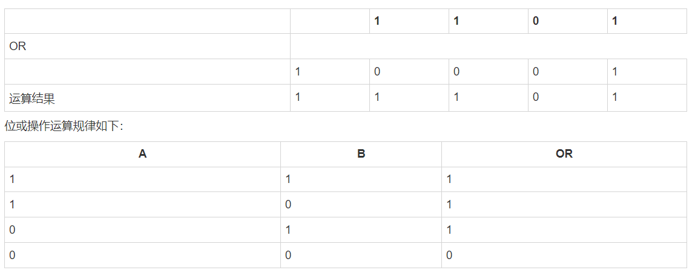
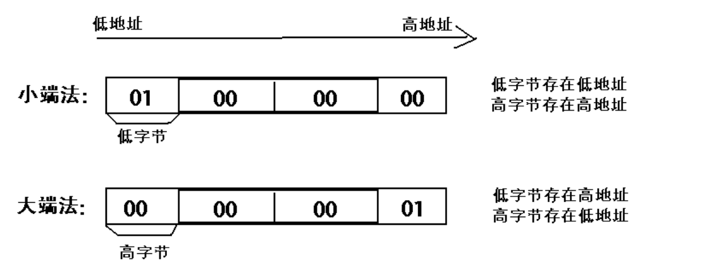

# 18.openCV 基础

**说明：笔记是跟着 B 站黑马程序员的 openCV 课程时做的**

**课程资料可以在黑马程序员评论区获取**

## 1，图像基本操作

### 1-1 图像基础操作

#### 1-1-1 安装相关库

```python
pip install opencv-python
pip install opencv-contrib-python

## 尽量保持两个库安装的版本，比如我都是4.9.0.80
opencv-contrib-python         4.9.0.80
opencv-python                 4.9.0.80

```

#### 1-1-2 导入使用

```python
import cv2
import matplotlib.pyplot  as plt
import numpy as np
```

#### 1-1-3 导入图片

##### 1-3-1 cv2.imshow() 显示图片

参数：

- 显示图像的窗口名称，以字符串类型表示
- 要加载的图像

**注意：在调用显示图像的 API 后，要调用 cv.waitKey()给图像绘制留下时间，否则窗口会出现无响应情况，并且图像无法显示出来**。

```python
img = cv2.imread('./img/01.jpg')
print(img)

## 图像的显示
cv2.imshow('image',img)
## 等待时间，毫秒级。0表示任意键终止
cv2.waitKey(0)
cv2.destroyAllWindows()
```

- cv.IMREAD\*COLOR：以彩色模式加载图像，任何图像的透明度都将被忽略。这是默认参数。
- cv.IMREAD\*GRAYSCALE：以灰度模式加载图像
- cv.IMREAD_UNCHANGED：包括 alpha 通道的加载图像模式。

```python
## 第二个参数，设置彩色还是灰度
img = cv2.imread('./img/01.jpg',cv2.IMREAD_GRAYSCALE )

# 以灰度图的形式读取图像
img = cv.imread('messi5.jpg',0)
```

##### 1-3-2 matplotlib 显示图片

彩色图

```python
import matplotlib.pyplot  as plt
img = cv2.imread('./img/01.jpg')
plt.imshow(img[:,:,::-1])
plt.show()
```

灰度图

```python
import matplotlib.pyplot  as plt
img = cv2.imread('./img/01.jpg'，0)
plt.imshow(img,cmap=plt.cm.gray)
plt.show()
```

#### 1-1-4 图片保存

参数：

- 文件名，要保存在哪里
- 要保存的图像

```python
# 路径和保存的图片
cv2.imwrite('nwe_img.png',img)
```

```Python
import numpy as np
import cv2 as cv
import matplotlib.pyplot as plt
# 1 读取图像
img = cv.imread('messi5.jpg',0)
# 2 显示图像
# 2.1 利用opencv展示图像
cv.imshow('image',img)
# 2.2 在matplotplotlib中展示图像
plt.imshow(img[:,:,::-1])
plt.title('匹配结果'), plt.xticks([]), plt.yticks([])
plt.show()
k = cv.waitKey(0)
# 3 保存图像
cv.imwrite('messigray.png',img)
```

#### 1-1-5 视频的读取

```python
# 不指定文件可以捕获摄像头
vc = cv2.VideoCapture()

## 指定文件路径，可以读取视频
vc = cv2.VideoCapture('test.mp4')

## 判断视频能否打得开
if vc.isOpened():
  open,frame = vc.read()
else:
  open = False
```

```Python
while open:
  ret,frame = vc.read()
  if frame is None:
    break
  if ret == True:
        ## 转换成黑白图
    gray = cv2.cvtColor(frame,cv2.COLOR_BGR2GRAY)
    cv2.imshow('result',gray)
        ## 100 是指处理完一帧等待的时间，单位是ms
    if cv2.waitKey(10) & 0xFF == 27:
      break
vc.release()
cv2.destroyAllWindows()
```

#### 1-1-6 截取部分图像数据

```python
img =cv2.imread('./img/01.jpg')
cat = img[0:200,0:200]
cv2.imshow('cat',cat)
```

#### 1-1-7 颜色通道提取

```python
b,g,r = cv2.split(img)
print(r.shape)
```

#### 1-1-8 通道的合并

```
img = cv2.merge(b,g,r)
img.shape
```

#### 1-1-9 只提取某个通道

##### 1-9-1 只保留 R

```python
img =cv2.imread('./img/01.jpg')
cur_img = img.copy()
cur_img[:,:,0] = 0
cur_img[:,:,1] = 0
cv2.imshow('R',cur_img)

cv2.waitKey(0)
cv2.destroyAllWindows()
```

##### 1-9-2 只保留 G

```python
img =cv2.imread('./img/01.jpg')
cur_img = img.copy()
cur_img[:,:,0] = 0
cur_img[:,:,2] = 0
cv2.imshow('G',cur_img)

cv2.waitKey(0)
cv2.destroyAllWindows()
```

##### 1-9-3 只保留 B

```python
img =cv2.imread('./img/01.jpg')
cur_img = img.copy()
cur_img[:,:,1] = 0
cur_img[:,:,2] = 0
cv2.imshow('B',cur_img)

cv2.waitKey(0)
cv2.destroyAllWindows()
```

#### 1-1-10 边界填充

cv2.BORDER_REPLICATE ： 复制法，也就是复制最边缘像素

cv2.BORDER_REFLECT ： 反射法，对感兴趣的图像中的像素在两边进行复制

cv2.BORDER_REFLECT_101： 反射法，也就是以最边缘像素为轴，对称

cv2.BORDER_WRAP：外包装法

cv2.BORDER_CONSTANT：常量法：常数值填充

```Python
top_size,bottom_size,left_size,right_size = (50,50,50,50)
img = cv2.imread('./img/01.jpg')

replicate = cv2.copyMakeBorder(img,top_size,bottom_size,left_size,right_size,borderType=cv2.BORDER_REPLICATE)
reflect = cv2.copyMakeBorder(img,top_size,bottom_size,left_size,right_size,borderType=cv2.BORDER_REFLECT)
reflect101 = cv2.copyMakeBorder(img,top_size,bottom_size,left_size,right_size,borderType=cv2.BORDER_REFLECT_101)
wrap = cv2.copyMakeBorder(img,top_size,bottom_size,left_size,right_size,borderType=cv2.BORDER_WRAP)
constant = cv2.copyMakeBorder(img, top_size, bottom_size, left_size, right_size, borderType=cv2.BORDER_CONSTANT, value=0)

cv2.imshow('B',img)

cv2.waitKey(0)
cv2.destroyAllWindows()
```

#### 1-1-11，图像上绘制直线

##### 1-11-1 绘制直线

```
cv.line(img,start,end,color,thickness)

cv.line(img,(0,0),(511,511),(255,0,0),5)
```

参数：

- img:要绘制直线的图像
- Start,end: 直线的起点和终点
- color: 线条的颜色
- Thickness: 线条宽度

##### 1-11-2 绘制圆形

```python
cv.circle(img,centerpoint, r, color, thickness)
cv.circle(img,(447,63), 63, (0,0,255), -1)
```

参数：

- img:要绘制圆形的图像
- Centerpoint, r: 圆心和半径
- color: 线条的颜色
- Thickness: 线条宽度，为-1 时生成闭合图案并填充颜色

##### 1-11-3 绘制矩形

```python
cv.rectangle(img,leftupper,rightdown,color,thickness)
cv.rectangle(img,(384,0),(510,128),(0,255,0),3)
```

参数：

- img:要绘制矩形的图像
- Leftupper, rightdown: 矩形的左上角和右下角坐标
- color: 线条的颜色
- Thickness: 线条宽度

##### 1-11-4 向图像中添加文字

```python
cv.putText(img,text,station, font, fontsize,color,thickness,cv.LINE_AA)

cv.putText(img,'OpenCV',(10,500), font, 4,(255,255,255),2,cv.LINE_AA)
```

参数：

- img: 图像
- text：要写入的文本数据
- station：文本的放置位置
- font：字体
- Fontsize :字体大小

##### 1-11-5 效果展示

我们生成一个全黑的图像，然后在里面绘制图像并添加文字

```python
import numpy as np
import cv2 as cv
import matplotlib.pyplot as plt
# 1 创建一个空白的图像
img = np.zeros((512,512,3), np.uint8)
# 2 绘制图形
cv.line(img,(0,0),(511,511),(255,0,0),5)
cv.rectangle(img,(384,0),(510,128),(0,255,0),3)
cv.circle(img,(447,63), 63, (0,0,255), -1)
font = cv.FONT_HERSHEY_SIMPLEX
cv.putText(img,'OpenCV',(10,500), font, 4,(255,255,255),2,cv.LINE_AA)
# 3 图像展示
plt.imshow(img[:,:,::-1])
plt.title('匹配结果'), plt.xticks([]), plt.yticks([])
plt.show()
```

#### 1-1-12，获取图像中的像素点

我们可以通过行和列的坐标值获取该像素点的像素值。对于 BGR 图像，它返回一个蓝，绿，红值的数组。对于灰度图像，仅返回相应的强度值。使用相同的方法对像素值进行修改。

```python
import numpy as np
import cv2 as cv
img = cv.imread('messi5.jpg')
# 获取某个像素点的值
px = img[100,100]
# 仅获取蓝色通道的强度值
blue = img[100,100,0]
# 修改某个位置的像素值
img[100,100] = [255,255,255]
```

```python
import numpy as np
import cv2 as cv
import matplotlib.pyplot as plt

img = np.zeros((256,256,3),np.uint8)
plt.imshow(img[:,:,::-1])
```


```python
# 获取（100,100）处的像素值
img[100,100]

## # 仅获取蓝色通道的强度值
img[100,100,0]

## 修改某一点的像素值
img[100,100] = (0,0,255)
```


#### 1-1-13 ，获取图像的属性

图像属性包括行数，列数和通道数，图像数据类型，像素数等。


```python
img.shape   ## （256,256,3） 256*256 的三个通道的
```

```python
img.dtype   ## dtype('uint8')
```

```Python
img.size   ## 196608
```

#### 1-1-14，图像通道的拆分与合并

有时需要在 B，G，R 通道图像上单独工作。在这种情况下，需要将 BGR 图像分割为单个通道。或者在其他情况下，可能需要将这些单独的通道合并到 BGR 图像。你可以通过以下方式完成。

```python
# 通道拆分
b,g,r = cv.split(img)
# 通道合并
img = cv.merge((b,g,r))
```

```python
dili = cv.imread("./image/dili.jpg")
plt.imshow(dili[:,:,::-1])


b,g,r = cv.split(dili)
## b通道灰色显示
plt.imshow(b,cmap=plt.cm.gray)

# 通道合并
img2 = cv.merge((b,g,r))
plt.imshow(img2[:,:,::-1])
```

#### 1-1-15，色彩空间的改变

OpenCV 中有 150 多种颜色空间转换方法。最广泛使用的转换方法有两种，BGR↔Gray 和 BGR↔HSV。

API：

```python
cv.cvtColor(input_image，flag)
```

参数：

- input_image: 进行颜色空间转换的图像
- flag: 转换类型
  - cv.COLOR_BGR2GRAY : BGR↔Gray
  - cv.COLOR_BGR2HSV: BGR→HSV

```python
# 转换成灰度图片
gray = cv.cvtColor(dili,cv.COLOR_BGR2GRAY)
plt.imshow(gray,cmap=plt.cm.gray)

# 转换成hsv
hsv = cv.cvtColor(dili,cv.COLOR_BGR2HSV)
plt.imshow(hsv)

```


#### 1-1-16 总结

1. 图像 IO 操作的 API：

   ```python
   cv.imread(): ## 读取图像
   cv.imshow()：## 显示图像
   cv.imwrite(): ## 保存图像
   ```

2. 在图像上绘制几何图像

   ```python
   cv.line(): ## 绘制直线
   cv.circle(): ## 绘制圆形
   cv.rectangle(): ## 绘制矩形
   cv.putText(): ## 在图像上添加文字
   ```

3. 直接使用行列索引获取图像中的像素并进行修改

4. 图像的属性

   

5. 拆分通道：cv.split()

   通道合并：cv.merge()

6. 色彩空间的改变

   cv.cvtColor(input_image，flag)

### 1-2 算数操作

#### 1-2-1 图像的加法

你可以使用 OpenCV 的 cv.add()函数把两幅图像相加，或者可以简单地通过 numpy 操作添加两个图像，如 res = img1 + img2。两个图像应该具有相同的大小和类型，或者第二个图像可以是标量值。

**注意：OpenCV 加法和 Numpy 加法之间存在差异。OpenCV 的加法是饱和操作，而 Numpy 添加是模运算。**

参考以下代码：

```python
import numpy as np
>>> x = np.uint8([250])
>>> y = np.uint8([10])
>>> print( cv.add(x,y) ) # 250+10 = 260 => 255
[[255]]
>>> print( x+y )          # 250+10 = 260 % 256 = 4  取模
[4]
```

这种差别在你对两幅图像进行加法时会更加明显。OpenCV 的结果会更好一点。所以我们尽量使用 OpenCV 中的函数。

我们将下面两幅图像：


代码：

```python
import numpy as np
import cv2 as cv
import matplotlib.pyplot as plt

# 1 读取图像
img1 = cv.imread("view.jpg")
img2 = cv.imread("rain.jpg")

# 2 加法操作
img3 = cv.add(img1,img2) # cv中的加法
img4 = img1+img2 # 直接相加

# 3 图像显示
fig,axes=plt.subplots(nrows=1,ncols=2,figsize=(10,8),dpi=100)
axes[0].imshow(img3[:,:,::-1])
axes[0].set_title("cv中的加法")
axes[1].imshow(img4[:,:,::-1])
axes[1].set_title("直接相加")
plt.show()
```

结果如下所示：


#### 1-2-1 图像的混合

这其实也是加法，但是不同的是两幅图像的权重不同，这就会给人一种混合或者透明的感觉。图像混合的计算公式如下：

> g(x) = (1−α)f0(x) + αf1(x)

通过修改 α 的值（0 → 1），可以实现非常炫酷的混合。

现在我们把两幅图混合在一起。第一幅图的权重是 0.7，第二幅图的权重是 0.3。函数 cv2.addWeighted()可以按下面的公式对图片进行混合操作。

> dst = α⋅img1 + β⋅img2 + γ

这里 γ 取为零。

参考以下代码：

```python
import numpy as np
import cv2 as cv
import matplotlib.pyplot as plt

# 1 读取图像
img1 = cv.imread("view.jpg")
img2 = cv.imread("rain.jpg")

# 2 图像混合
img3 = cv.addWeighted(img1,0.7,img2,0.3,0)  # α⋅img1 + β⋅img2 + γ 对应五个参数

# 3 图像显示
plt.figure(figsize=(8,8))
plt.imshow(img3[:,:,::-1])
plt.show()
```

窗口将如下图显示：


#### 1-2-3 总结

1. 图像加法：将两幅图像加载一起

   cv.add()

2. 图像的混合：将两幅图像按照不同的比例进行混合

   cv.addweight()

注意：这里都要求两幅图像是相同大小的。

## 2，图像处理

### 2-1 几何变换

#### 2-1-1 图像的缩放

缩放是对图像的大小进行调整，即使图像放大或缩小。

1，API

```python
cv2.resize(src,dsize,fx=0,fy=0,interpolation=cv2.INTER_LINEAR)
```

参数：

```python
- src : ## 输入图像
- dsize: ## 绝对尺寸，直接指定调整后图像的大小
- fx,fy: ## 相对尺寸，将dsize设置为None，然后将fx和fy设置为比例因子即可
- interpolation：## 插值方法，
```


2，演示

```python
import cv2 as cv
# 1. 读取图片
img1 = cv.imread("./image/dog.jpeg")
# 2.图像缩放
# 2.1 绝对尺寸
rows,cols = img1.shape[:2]
res = cv.resize(img1,(2*cols,2*rows),interpolation=cv.INTER_CUBIC)

# 2.2 相对尺寸
res1 = cv.resize(img1,None,fx=0.5,fy=0.5)

# 3 图像显示
# 3.1 使用opencv显示图像(不推荐)
cv.imshow("orignal",img1)
cv.imshow("enlarge",res)
cv.imshow("shrink）",res1)
cv.waitKey(0)

# 3.2 使用matplotlib显示图像
fig,axes=plt.subplots(nrows=1,ncols=3,figsize=(10,8),dpi=100)
axes[0].imshow(res[:,:,::-1])
axes[0].set_title("绝对尺度（放大）")
axes[1].imshow(img1[:,:,::-1])
axes[1].set_title("原图")
axes[2].imshow(res1[:,:,::-1])
axes[2].set_title("相对尺度（缩小）")
plt.show()
```


#### 2-1-2 图像平移

图像平移将图像按照指定方向和距离，移动到相应的位置。

API

```python
cv.warpAffine(img,M,dsize)
```

参数：


需求是将图像的像素点移动(50,100)的距离：

```python
import numpy as np
import cv2 as cv
import matplotlib.pyplot as plt
# 1. 读取图像
img1 = cv.imread("./image/image2.jpg")

# 2. 图像平移
rows,cols = img1.shape[:2]
M = np.float32([[1,0,100],[0,1,50]])# 平移矩阵
dst = cv.warpAffine(img1,M,(cols,rows))

# 3. 图像显示
fig,axes=plt.subplots(nrows=1,ncols=2,figsize=(10,8),dpi=100)
axes[0].imshow(img1[:,:,::-1])
axes[0].set_title("原图")
axes[1].imshow(dst[:,:,::-1])
axes[1].set_title("平移后结果")
plt.show()
```


#### 2-1-3 图像旋转

图像旋转是指图像按照某个位置转动一定角度的过程，旋转中图像仍保持这原始尺寸。图像旋转后图像的水平对称轴、垂直对称轴及中心坐标原点都可能会发生变换，因此需要对图像旋转中的坐标进行相应转换。

那图像是怎么进行旋转的呢？如下图所示：


在 OpenCV 中图像旋转首先根据旋转角度和旋转中心获取旋转矩阵，然后根据旋转矩阵进行变换，即可实现任意角度和任意中心的旋转效果。

1. API

   ```
   cv2.getRotationMatrix2D(center, angle, scale)
   ```

   参数：

   - center：旋转中心
   - angle：旋转角度
   - scale：缩放比例

   返回：

   - M：旋转矩阵

     调用 cv.warpAffine 完成图像的旋转

2. 示例

   ```python
   import numpy as np
   import cv2 as cv
   import matplotlib.pyplot as plt
   # 1 读取图像
   img = cv.imread("./image/image2.jpg")

   # 2 图像旋转
   rows,cols = img.shape[:2]
   # 2.1 生成旋转矩阵
   M = cv.getRotationMatrix2D((cols/2,rows/2),90,1)
   # 2.2 进行旋转变换
   dst = cv.warpAffine(img,M,(cols,rows))

   # 3 图像展示
   fig,axes=plt.subplots(nrows=1,ncols=2,figsize=(10,8),dpi=100)
   axes[0].imshow(img1[:,:,::-1])
   axes[0].set_title("原图")
   axes[1].imshow(dst[:,:,::-1])
   axes[1].set_title("旋转后结果")
   plt.show()
   ```


#### 2-1-4 仿射变换

图像的仿射变换涉及到图像的形状位置角度的变化，是深度学习预处理中常到的功能,仿射变换主要是对图像的缩放，旋转，翻转和平移等操作的组合。

那什么是图像的仿射变换，如下图所示，图 1 中的点 1, 2 和 3 与图二中三个点一一映射, 仍然形成三角形, 但形状已经大大改变，通过这样两组三点（感兴趣点）求出仿射变换， 接下来我们就能把仿射变换应用到图像中所有的点中，就完成了图像的仿射变换。


需要注意的是，对于图像而言，宽度方向是 x，高度方向是 y，坐标的顺序和图像像素对应下标一致。所以原点的位置不是左下角而是右上角，y 的方向也不是向上，而是向下。

在仿射变换中，原图中所有的平行线在结果图像中同样平行。为了创建这个矩阵我们需要从原图像中找到三个点以及他们在输出图像中的位置。然后 cv2.getAffineTransform 会创建一个 2x3 的矩阵，最后这个矩阵会被传给函数 cv2.warpAffine。

示例

```python
import numpy as np
import cv2 as cv
import matplotlib.pyplot as plt
# 1 图像读取
img = cv.imread("./image/image2.jpg")

# 2 仿射变换
rows,cols = img.shape[:2]
# 2.1 创建变换矩阵
pts1 = np.float32([[50,50],[200,50],[50,200]])
pts2 = np.float32([[100,100],[200,50],[100,250]])
M = cv.getAffineTransform(pts1,pts2)
# 2.2 完成仿射变换
dst = cv.warpAffine(img,M,(cols,rows))

# 3 图像显示
fig,axes=plt.subplots(nrows=1,ncols=2,figsize=(10,8),dpi=100)
axes[0].imshow(img[:,:,::-1])
axes[0].set_title("原图")
axes[1].imshow(dst[:,:,::-1])
axes[1].set_title("仿射后结果")
plt.show()
```


#### 2-1-5 透射变换

透射变换是视角变化的结果，是指利用透视中心、像点、目标点三点共线的条件，按透视旋转定律使承影面（透视面）绕迹线（透视轴）旋转某一角度，破坏原有的投影光线束，仍能保持承影面上投影几何图形不变的变换。


1. 示例

   ```python
   import numpy as np
   import cv2 as cv
   import matplotlib.pyplot as plt
   # 1 读取图像
   img = cv.imread("./image/image2.jpg")
   # 2 透射变换
   rows,cols = img.shape[:2]
   # 2.1 创建变换矩阵
   pts1 = np.float32([[56,65],[368,52],[28,387],[389,390]])
   pts2 = np.float32([[100,145],[300,100],[80,290],[310,300]])

   T = cv.getPerspectiveTransform(pts1,pts2)
   # 2.2 进行变换
   dst = cv.warpPerspective(img,T,(cols,rows))

   # 3 图像显示
   fig,axes=plt.subplots(nrows=1,ncols=2,figsize=(10,8),dpi=100)
   axes[0].imshow(img[:,:,::-1])
   axes[0].set_title("原图")
   axes[1].imshow(dst[:,:,::-1])
   axes[1].set_title("透射后结果")
   plt.show()
   ```


#### 2-1-6 图像金字塔

图像金字塔是图像多尺度表达的一种，最主要用于图像的分割，是一种以多分辨率来解释图像的有效但概念简单的结构。

图像金字塔用于机器视觉和图像压缩，一幅图像的金字塔是一系列以金字塔形状排列的分辨率逐步降低，且来源于同一张原始图的图像集合。其通过梯次向下采样获得，直到达到某个终止条件才停止采样。

金字塔的底部是待处理图像的高分辨率表示，而顶部是低分辨率的近似，层级越高，图像越小，分辨率越低。


1. API

   ```python
   cv.pyrUp(img)       #对图像进行上采样
   cv.pyrDown(img)        #对图像进行下采样
   ```

2. 示例

   ```python
   import numpy as np
   import cv2 as cv
   import matplotlib.pyplot as plt
   # 1 图像读取
   img = cv.imread("./image/image2.jpg")
   # 2 进行图像采样
   up_img = cv.pyrUp(img)  # 上采样操作
   img_1 = cv.pyrDown(img)  # 下采样操作
   # 3 图像显示
   cv.imshow('enlarge', up_img)
   cv.imshow('original', img)
   cv.imshow('shrink', img_1)
   cv.waitKey(0)
   cv.destroyAllWindows()
   ```


#### 2-1-7 总结

**总结**

1. 图像缩放：对图像进行放大或缩小

   cv.resize()

2. 图像平移：

   指定平移矩阵后，调用 cv.warpAffine()平移图像

3. 图像旋转：

   调用 cv.getRotationMatrix2D 获取旋转矩阵，然后调用 cv.warpAffine()进行旋转

4. 仿射变换：

   调用 cv.getAffineTransform 将创建变换矩阵，最后该矩阵将传递给 cv.warpAffine()进行变换

5. 透射变换：

   通过函数 cv.getPerspectiveTransform()找到变换矩阵，将 cv.warpPerspective()进行投射变换

6. 金字塔

   图像金字塔是图像多尺度表达的一种，使用的 API：

   cv.pyrUp(): 向上采样

   cv.pyrDown(): 向下采样 1

### 2-2 形态学操作

#### 2-2-1 连通性


**连通性**是描述区域和边界的重要概念，两个像素连通的两个必要条件是：

1. 两个像素的位置是否相邻
2. 两个像素的灰度值是否满足特定的相 似性准则（或者是否相等

根据连通性的定义，有 4 联通、8 联通和 m 联通三种。


#### 2-2-2 形态学操作

##### 2-1 腐蚀和膨胀

腐蚀和膨胀是最基本的形态学操作，腐蚀和膨胀都是针对白色部分（高亮部分）而言的。

膨胀就是使图像中高亮部分扩张，效果图拥有比原图更大的高亮区域；腐蚀是原图中的高亮区域被蚕食，效果图拥有比原图更小的高亮区域。膨胀是求局部最大值的操作，腐蚀是求局部最小值的操作。

###### 1，腐蚀

具体操作是：用一个结构元素扫描图像中的每一个像素，用结构元素中的每一个像素与其覆盖的像素做“与”操作，如果都为 1，则该像素为 1，否则为 0。如下图所示，结构 A 被结构 B 腐蚀后：


**腐蚀的作用是消除物体边界点，使目标缩小，可以消除小于结构元素的噪声点。**

**API**：

```python
   cv.erode(img,kernel,iterations)
```

参数：

- img: 要处理的图像
- kernel: 核结构
- iterations: 腐蚀的次数，默认是 1

###### 2，膨胀

具体操作是：用一个结构元素扫描图像中的每一个像素，用结构元素中的每一个像素与其覆盖的像素做“与”操作，如果都为 0，则该像素为 0，否则为 1。如下图所示，结构 A 被结构 B 腐蚀后：


---

**API**：

```python
   cv.dilate(img,kernel,iterations)
```

参数：

- img: 要处理的图像
- kernel: 核结构
- iterations: 腐蚀的次数，默认是 1

1. **示例**

我们使用一个 5\*5 的卷积核实现腐蚀和膨胀的运算：

```python
import numpy as np
import cv2 as cv
import matplotlib.pyplot as plt
# 1 读取图像
img = cv.imread("./image/image3.png")
# 2 创建核结构
kernel = np.ones((5, 5), np.uint8)

# 3 图像腐蚀和膨胀
erosion = cv.erode(img, kernel) # 腐蚀
dilate = cv.dilate(img,kernel) # 膨胀

# 4 图像展示
fig,axes=plt.subplots(nrows=1,ncols=3,figsize=(10,8),dpi=100)
axes[0].imshow(img)
axes[0].set_title("原图")
axes[1].imshow(erosion)
axes[1].set_title("腐蚀后结果")
axes[2].imshow(dilate)
axes[2].set_title("膨胀后结果")
plt.show()
```


##### 2-2 开闭运算

开运算和闭运算是将腐蚀和膨胀按照一定的次序进行处理。 但这两者并不是可逆的，即先开后闭并不能得到原来的图像。

1. **开运算**

   开运算是先腐蚀后膨胀，其**作用**是：分离物体，消除小区域。**特点**：消除噪点，去除小的干扰块，而不影响原来的图像。

   

2. **闭运算**

   闭运算与开运算相反，是先膨胀后腐蚀，**作用**是消除/“闭合”物体里面的孔洞，**特点**：可以填充闭合区域。

   

3. **API**

   ```
   cv.morphologyEx(img, op, kernel)
   ```

   参数：

   - img: 要处理的图像
   - op: 处理方式：若进行开运算，则设为 cv.MORPH_OPEN，若进行闭运算，则设为 cv.MORPH_CLOSE
   - Kernel： 核结构

4. **示例**

   使用 10\*10 的核结构对卷积进行开闭运算的实现。

   ```python
   import numpy as np
   import cv2 as cv
   import matplotlib.pyplot as plt
   # 1 读取图像
   img1 = cv.imread("./image/image5.png")
   img2 = cv.imread("./image/image6.png")
   # 2 创建核结构
   kernel = np.ones((10, 10), np.uint8)
   # 3 图像的开闭运算
   cvOpen = cv.morphologyEx(img1,cv.MORPH_OPEN,kernel) # 开运算
   cvClose = cv.morphologyEx(img2,cv.MORPH_CLOSE,kernel)# 闭运算
   # 4 图像展示
   fig,axes=plt.subplots(nrows=2,ncols=2,figsize=(10,8))
   axes[0,0].imshow(img1)
   axes[0,0].set_title("原图")
   axes[0,1].imshow(cvOpen)
   axes[0,1].set_title("开运算结果")
   axes[1,0].imshow(img2)
   axes[1,0].set_title("原图")
   axes[1,1].imshow(cvClose)
   axes[1,1].set_title("闭运算结果")
   plt.show()
   ```


##### 2-3 礼帽和黑帽

1. **礼帽运算**

   原图像与“开运算“的结果图之差，如下式计算：

   

   因为开运算带来的结果是放大了裂缝或者局部低亮度的区域，因此，从原图中减去开运算后的图，得到的效果图突出了比原图轮廓周围的区域更明亮的区域，且这一操作和选择的核的大小相关。

   礼帽运算用来分离比邻近点亮一些的斑块。当一幅图像具有大幅的背景的时候，而微小物品比较有规律的情况下，可以使用顶帽运算进行背景提取。

2. **黑帽运算**

   为”闭运算“的结果图与原图像之差。数学表达式为：

   

   黑帽运算后的效果图突出了比原图轮廓周围的区域更暗的区域，且这一操作和选择的核的大小相关。

   黑帽运算用来分离比邻近点暗一些的斑块。

3. **API**

   ```python
   cv.morphologyEx(img, op, kernel)
   ```

   参数：

   - img: 要处理的图像

   - op: 处理方式：

     

   - Kernel： 核结构

4. **示例**

```python
import numpy as np
import cv2 as cv
import matplotlib.pyplot as plt
# 1 读取图像
img1 = cv.imread("./image/image5.png")
img2 = cv.imread("./image/image6.png")
# 2 创建核结构
kernel = np.ones((10, 10), np.uint8)
# 3 图像的礼帽和黑帽运算
cvOpen = cv.morphologyEx(img1,cv.MORPH_TOPHAT,kernel) # 礼帽运算
cvClose = cv.morphologyEx(img2,cv.MORPH_BLACKHAT,kernel)# 黑帽运算
# 4 图像显示
fig,axes=plt.subplots(nrows=2,ncols=2,figsize=(10,8))
axes[0,0].imshow(img1)
axes[0,0].set_title("原图")
axes[0,1].imshow(cvOpen)
axes[0,1].set_title("礼帽运算结果")
axes[1,0].imshow(img2)
axes[1,0].set_title("原图")
axes[1,1].imshow(cvClose)
axes[1,1].set_title("黑帽运算结果")
plt.show()
```


### 2-3 图像平滑

#### 2-3-1 图像噪声

##### 3-1-1 椒盐噪声

椒盐噪声也称为脉冲噪声，是图像中经常见到的一种噪声，它是一种随机出现的白点或者黑点，可能是亮的区域有黑色像素或是在暗的区域有白色像素（或是两者皆有）。椒盐噪声的成因可能是影像讯号受到突如其来的强烈干扰而产生、类比数位转换器或位元传输错误等。例如失效的感应器导致像素值为最小值，饱和的感应器导致像素值为最大值。


##### 3-1-2 高斯噪声

高斯噪声是指噪声密度函数服从高斯分布的一类噪声。由于高斯噪声在空间和频域中数学上的易处理性，这种噪声(也称为正态噪声)模型经常被用于实践中


#### 2-3-2 图像平滑操作

##### 3-2-1 均值滤波

均值滤波的优点是算法简单，计算速度较快，缺点是在去噪的同时去除了很多细节部分，将图像变得模糊。

API:

```python
cv.blur(src, ksize, anchor, borderType)
```

参数:

- src：输入图像
- ksize：卷积核的大小
- anchor：默认值 (-1,-1) ，表示核中心
- borderType：边界类型

示例：

```python
import cv2 as cv
import numpy as np
from matplotlib import pyplot as plt
# 1 图像读取
img = cv.imread('./image/dogsp.jpeg')
# 2 均值滤波
blur = cv.blur(img,(5,5))
# 3 图像显示
plt.figure(figsize=(10,8),dpi=100)
plt.subplot(121),plt.imshow(img[:,:,::-1]),plt.title('原图')
plt.xticks([]), plt.yticks([])
plt.subplot(122),plt.imshow(blur[:,:,::-1]),plt.title('均值滤波后结果')
plt.xticks([]), plt.yticks([])
plt.show()
```


##### 3-2-2 高斯滤波

API：

```python
cv2.GaussianBlur(src,ksize,sigmaX,sigmay,borderType)
```

参数：

- src: 输入图像
- ksize:高斯卷积核的大小，**注意** ： 卷积核的宽度和高度都应为奇数，且可以不同
- sigmaX: 水平方向的标准差
- sigmaY: 垂直方向的标准差，默认值为 0，表示与 sigmaX 相同
- borderType:填充边界类型

**示例**：

```python
import cv2 as cv
import numpy as np
from matplotlib import pyplot as plt
# 1 图像读取
img = cv.imread('./image/dogGasuss.jpeg')
# 2 高斯滤波
blur = cv.GaussianBlur(img,(3,3),1)
# 3 图像显示
plt.figure(figsize=(10,8),dpi=100)
plt.subplot(121),plt.imshow(img[:,:,::-1]),plt.title('原图')
plt.xticks([]), plt.yticks([])
plt.subplot(122),plt.imshow(blur[:,:,::-1]),plt.title('高斯滤波后结果')
plt.xticks([]), plt.yticks([])
plt.show()
```


##### 3-2-3 中值滤波

中值滤波是一种典型的非线性滤波技术，基本思想是用像素点邻域灰度值的中值来代替该像素点的灰度值。

中值滤波对椒盐噪声（salt-and-pepper noise）来说尤其有用，因为它不依赖于邻域内那些与典型值差别很大的值。

API：

```python
cv.medianBlur(src, ksize )
```

参数：

- src：输入图像
- ksize：卷积核的大小

示例：

```python
import cv2 as cv
import numpy as np
from matplotlib import pyplot as plt
# 1 图像读取
img = cv.imread('./image/dogsp.jpeg')
# 2 中值滤波
blur = cv.medianBlur(img,5)
# 3 图像展示
plt.figure(figsize=(10,8),dpi=100)
plt.subplot(121),plt.imshow(img[:,:,::-1]),plt.title('原图')
plt.xticks([]), plt.yticks([])
plt.subplot(122),plt.imshow(blur[:,:,::-1]),plt.title('中值滤波后结果')
plt.xticks([]), plt.yticks([])
plt.show()
```


### 2-4 直方图

#### 4-1 灰度直方图

##### 4-1-1 原理

直方图是对数据进行统计的一种方法，并且将统计值组织到一系列实现定义好的 bin 当中。其中， bin 为直方图中经常用到的一个概念，可以译为 “直条” 或 “组距”，其数值是从数据中计算出的特征统计量，这些数据可以是诸如梯度、方向、色彩或任何其他特征。

图像直方图（Image Histogram）是用以表示数字图像中亮度分布的直方图，标绘了图像中每个亮度值的像素个数。这种直方图中，横坐标的左侧为较暗的区域，而右侧为较亮的区域。因此一张较暗图片的直方图中的数据多集中于左侧和中间部分，而整体明亮、只有少量阴影的图像则相反。


注意：直方图是根据灰度图进行绘制的，而不是彩色图像。    假设有一张图像的信息（灰度值 0 - 255，已知数字的范围包含 256 个值，于是可以按一定规律将这个范围分割成子区域（也就是 bins）。如：


直方图的一些**术语和细节**：

- dims：需要统计的特征数目。在上例中，dims = 1 ，因为仅仅统计了灰度值。
- bins：每个特征空间子区段的数目，可译为 “直条” 或 “组距”，在上例中， bins = 16。
- range：要统计特征的取值范围。在上例中，range = [0, 255]。

直方图的**意义**：

- 直方图是图像中像素强度分布的图形表达方式。
- 它统计了每一个强度值所具有的像素个数。
- 不同的图像的直方图可能是相同的

##### 4-1-2 直方图的计算和绘制

我们使用 OpenCV 中的方法统计直方图，并使用 matplotlib 将其绘制出来。

API：

```python
cv2.calcHist(images,channels,mask,histSize,ranges[,hist[,accumulate]])
```

参数：

- images: 原图像。当传入函数时应该用中括号 [] 括起来，例如：[img]。
- channels: 如果输入图像是灰度图，它的值就是 [0]；如果是彩色图像的话，传入的参数可以是 [0]，[1]，[2] 它们分别对应着通道 B，G，R。
- mask: 掩模图像。要统计整幅图像的直方图就把它设为 None。但是如果你想统计图像某一部分的直方图的话，你就需要制作一个掩模图像，并使用它。（后边有例子）
- histSize:BIN 的数目。也应该用中括号括起来，例如：[256]。
- ranges: 像素值范围，通常为 [0，256]

示例：

如下图，绘制相应的直方图

```python
import numpy as np
import cv2 as cv
from matplotlib import pyplot as plt
# 1 直接以灰度图的方式读入
img = cv.imread('./image/cat.jpeg',0)
# 2 统计灰度图
histr = cv.calcHist([img],[0],None,[256],[0,256])
# 3 绘制灰度图
plt.figure(figsize=(10,6),dpi=100)
plt.plot(histr)
plt.grid()
plt.show()
```


##### 4-1-3 掩膜的应用

掩膜是用选定的图像、图形或物体，对要处理的图像进行遮挡，来控制图像 处理的区域。

在数字图像处理中，我们通常使用二维矩阵数组进行掩膜。掩膜是由 0 和 1 组成一个二进制图像，利用该掩膜图像要处理的图像进行掩膜，其中 1 值的区域被处理，0 值区域被屏蔽，不会处理。

掩膜的主要用途是：

- 提取感兴趣区域：用预先制作的感兴趣区掩模与待处理图像进行”与“操作，得到感兴趣区图像，感兴趣区内图像值保持不变，而区外图像值都为 0。
- 屏蔽作用：用掩模对图像上某些区域作屏蔽，使其不参加处理或不参加处理参数的计算，或仅对屏蔽区作处理或统计。
- 结构特征提取：用相似性变量或图像匹配方法检测和提取图像中与掩模相似的结构特征。
- 特殊形状图像制作

掩膜在遥感影像处理中使用较多，当提取道路或者河流，或者房屋时，通过一个掩膜矩阵来对图像进行像素过滤，然后将我们需要的地物或者标志突出显示出来。

我们使用 cv.calcHist（）来查找完整图像的直方图。 如果要查找图像某些区域的直方图，该怎么办？ 只需在要查找直方图的区域上创建一个白色的掩膜图像，否则创建黑色， 然后将其作为掩码 mask 传递即可。

示例：

```python
import numpy as np
import cv2 as cv
from matplotlib import pyplot as plt
# 1. 直接以灰度图的方式读入
img = cv.imread('./image/cat.jpeg',0)
# 2. 创建蒙版
mask = np.zeros(img.shape[:2], np.uint8)
mask[400:650, 200:500] = 255
# 3.掩模
masked_img = cv.bitwise_and(img,img,mask = mask)
# 4. 统计掩膜后图像的灰度图
mask_histr = cv.calcHist([img],[0],mask,[256],[1,256])
# 5. 图像展示
fig,axes=plt.subplots(nrows=2,ncols=2,figsize=(10,8))
axes[0,0].imshow(img,cmap=plt.cm.gray)
axes[0,0].set_title("原图")
axes[0,1].imshow(mask,cmap=plt.cm.gray)
axes[0,1].set_title("蒙版数据")
axes[1,0].imshow(masked_img,cmap=plt.cm.gray)
axes[1,0].set_title("掩膜后数据")
axes[1,1].plot(mask_histr)
axes[1,1].grid()
axes[1,1].set_title("灰度直方图")
plt.show()
```


#### 4-2 直方图均衡化

##### 2-1 原理

**想象一下，如果一副图像中的大多数像素点的像素值都集中在某一个小的灰度值值范围之内会怎样呢？如果一幅图像整体很亮，那所有的像素值的取值个数应该都会很高。所以应该把它的直方图做一个横向拉伸（如下图），就可以扩大图像像素值的分布范围，提高图像的对比度，这就是直方图均衡化要做的事情。**


**“直方图均衡化”是把原始图像的灰度直方图从比较集中的某个灰度区间变成在更广泛灰度范围内的分布。直方图均衡化就是对图像进行非线性拉伸，重新分配图像像素值，使一定灰度范围内的像素数量大致相同。**

**这种方法提高图像整体的对比度，特别是有用数据的像素值分布比较接近时，在 X 光图像中使用广泛，可以提高骨架结构的显示，另外在曝光过度或不足的图像中可以更好的突出细节。**

使用 opencv 进行直方图统计时，使用的是：

API：

```python
dst = cv.equalizeHist(img)
```

参数：

- img: 灰度图像

返回：

- dst : 均衡化后的结果

示例：

```python
import numpy as np
import cv2 as cv
from matplotlib import pyplot as plt
# 1. 直接以灰度图的方式读入
img = cv.imread('./image/cat.jpeg',0)
# 2. 均衡化处理
dst = cv.equalizeHist(img)
# 3. 结果展示
fig,axes=plt.subplots(nrows=2,ncols=2,figsize=(10,8),dpi=100)
axes[0].imshow(img,cmap=plt.cm.gray)
axes[0].set_title("原图")
axes[1].imshow(dst,cmap=plt.cm.gray)
axes[1].set_title("均衡化后结果")
plt.show()
```


##### 2-2 自适应的直方图均衡化

**上述的直方图均衡，我们考虑的是图像的全局对比度。 的确在进行完直方图均衡化之后，图片背景的对比度被改变了，在猫腿这里太暗，我们丢失了很多信息，所以在许多情况下，这样做的效果并不好。如下图所示，对比下两幅图像中雕像的画面，由于太亮我们丢失了很多信息**


为了解决这个问题， 需要使用自适应的直方图均衡化。 此时， 整幅图像会被分成很多小块，这些小块被称为“tiles”（在 OpenCV 中 tiles 的 大小默认是 8x8），然后再对每一个小块分别进行直方图均衡化。 所以在每一个的区域中， 直方图会集中在某一个小的区域中）。如果有噪声的话，噪声会被放大。为了避免这种情况的出现要使用对比度限制。对于每个小块来说，如果直方图中的 bin 超过对比度的上限的话，就把 其中的像素点均匀分散到其他 bins 中，然后在进行直方图均衡化。


最后，为了 去除每一个小块之间的边界，再使用双线性差值，对每一小块进行拼接。

API：

```python
cv.createCLAHE(clipLimit, tileGridSize)
```

参数：

- clipLimit: 对比度限制，默认是 40
- tileGridSize: 分块的大小，默认为 8∗88∗8

示例：

```python
import numpy as np
import cv2 as cv
# 1. 以灰度图形式读取图像
img = cv.imread('./image/cat.jpeg',0)
# 2. 创建一个自适应均衡化的对象，并应用于图像
clahe = cv.createCLAHE(clipLimit=2.0, tileGridSize=(8,8))
cl1 = clahe.apply(img)
# 3. 图像展示
fig,axes=plt.subplots(nrows=1,ncols=2,figsize=(10,8),dpi=100)
axes[0].imshow(img,cmap=plt.cm.gray)
axes[0].set_title("原图")
axes[1].imshow(cl1,cmap=plt.cm.gray)
axes[1].set_title("自适应均衡化后的结果")
plt.show()
```


### 2-5 边缘检测

#### 2 -5-1 Sobel 检测算子

利用 OpenCV 进行 sobel 边缘检测的 API 是：

```python
Sobel_x_or_y = cv2.Sobel(src, ddepth, dx, dy, dst, ksize, scale, delta, borderType)
```

参数：

- src：传入的图像

- ddepth: 图像的深度

- dx 和 dy: 指求导的阶数，0 表示这个方向上没有求导，取值为 0、1。

- ksize: 是 Sobel 算子的大小，即卷积核的大小，必须为奇数 1、3、5、7，默认为 3。

  注意：如果 ksize=-1，就演变成为 3x3 的 Scharr 算子。

- scale：缩放导数的比例常数，默认情况为没有伸缩系数。

- borderType：图像边界的模式，默认值为 cv2.BORDER_DEFAULT。

Sobel 函数求完导数后会有负值，还有会大于 255 的值。而原图像是 uint8，即 8 位无符号数，所以 Sobel 建立的图像位数不够，会有截断。因此要使用 16 位有符号的数据类型，即 cv2.CV_16S。处理完图像后，再使用 cv2.convertScaleAbs()函数将其转回原来的 uint8 格式，否则图像无法显示。

Sobel 算子是在两个方向计算的，最后还需要用 cv2.addWeighted( )函数将其组合起来

```pyh
Scale_abs = cv2.convertScaleAbs(x)  # 格式转换函数
result = cv2.addWeighted(src1, alpha, src2, beta) # 图像混合
```

示例：

```python
import cv2 as cv
import numpy as np
from matplotlib import pyplot as plt
# 1 读取图像
img = cv.imread('./image/horse.jpg',0)
# 2 计算Sobel卷积结果
x = cv.Sobel(img, cv.CV_16S, 1, 0)
y = cv.Sobel(img, cv.CV_16S, 0, 1)
# 3 将数据进行转换
Scale_absX = cv.convertScaleAbs(x)  # convert 转换  scale 缩放
Scale_absY = cv.convertScaleAbs(y)
# 4 结果合成
result = cv.addWeighted(Scale_absX, 0.5, Scale_absY, 0.5, 0)
# 5 图像显示
plt.figure(figsize=(10,8),dpi=100)
plt.subplot(121),plt.imshow(img,cmap=plt.cm.gray),plt.title('原图')
plt.xticks([]), plt.yticks([])
plt.subplot(122),plt.imshow(result,cmap = plt.cm.gray),plt.title('Sobel滤波后结果')
plt.xticks([]), plt.yticks([])
plt.show()
```


#### 2-5-2 Laplacian 算子


API：

```python
laplacian = cv2.Laplacian(src, ddepth[, dst[, ksize[, scale[, delta[, borderType]]]]])
```

参数：

- Src: 需要处理的图像，
- Ddepth: 图像的深度，-1 表示采用的是原图像相同的深度，目标图像的深度必须大于等于原图像的深度；
- ksize：算子的大小，即卷积核的大小，必须为 1,3,5,7。

示例：

```python
import cv2 as cv
import numpy as np
from matplotlib import pyplot as plt
# 1 读取图像
img = cv.imread('./image/horse.jpg',0)
# 2 laplacian转换
result = cv.Laplacian(img,cv.CV_16S)
Scale_abs = cv.convertScaleAbs(result)
# 3 图像展示
plt.figure(figsize=(10,8),dpi=100)
plt.subplot(121),plt.imshow(img,cmap=plt.cm.gray),plt.title('原图')
plt.xticks([]), plt.yticks([])
plt.subplot(122),plt.imshow(Scale_abs,cmap = plt.cm.gray),plt.title('Laplacian检测后结果')
plt.xticks([]), plt.yticks([])
plt.show()
```


#### 2-5-3 Canny 边缘检测

在 OpenCV 中要实现 Canny 检测使用的 API:

```python
canny = cv2.Canny(image, threshold1, threshold2)
```

参数：

- image:灰度图，
- threshold1: minval，较小的阈值将间断的边缘连接起来
- threshold2: maxval，较大的阈值检测图像中明显的边缘

示例：

```python
import cv2 as cv
import numpy as np
from matplotlib import pyplot as plt
# 1 图像读取
img = cv.imread('./image/horse.jpg',0)
# 2 Canny边缘检测
lowThreshold = 0
max_lowThreshold = 100
canny = cv.Canny(img, lowThreshold, max_lowThreshold)
# 3 图像展示
plt.figure(figsize=(10,8),dpi=100)
plt.subplot(121),plt.imshow(img,cmap=plt.cm.gray),plt.title('原图')
plt.xticks([]), plt.yticks([])
plt.subplot(122),plt.imshow(canny,cmap = plt.cm.gray),plt.title('Canny检测后结果')
plt.xticks([]), plt.yticks([])
plt.show()
```


#### 2-5-4 算发比较


### 2-6 模板匹配霍夫变换

#### 6-1 模板匹配

##### 6-1.1 原理

所谓的模板匹配，就是在给定的图片中查找和模板最相似的区域，该算法的输入包括模板和图片，整个任务的思路就是按照滑窗的思路不断的移动模板图片，计算其与图像中对应区域的匹配度，最终将匹配度最高的区域选择为最终的结果。

**实现流程：**

- 准备两幅图像：

  1.原图像(I)：在这幅图中，找到与模板相匹配的区域

  2.模板(T)：与原图像进行比对的图像块


- 滑动模板图像和原图像进行比对：


- 获得上述图像后，查找最大值所在的位置，那么该位置对应的区域就被认为是最匹配的。对应的区域就是以该点为顶点，长宽和模板图像一样大小的矩阵。

##### 6-1-2 实现

我们使用 OpenCV 中的方法实现模板匹配。

API：

```
res = cv.matchTemplate(img,template,method)
```

参数：

- img: 要进行模板匹配的图像
- Template ：模板
- method：实现模板匹配的算法，主要有：
  1. 平方差匹配(CV_TM_SQDIFF)：利用模板与图像之间的平方差进行匹配，最好的匹配是 0，匹配越差，匹配的值越大。
  2. 相关匹配(CV_TM_CCORR)：利用模板与图像间的乘法进行匹配，数值越大表示匹配程度较高，越小表示匹配效果差。
  3. 利用相关系数匹配(CV_TM_CCOEFF)：利用模板与图像间的相关系数匹配，1 表示完美的匹配，-1 表示最差的匹配。

完成匹配后，使用 cv.minMaxLoc()方法查找最大值所在的位置即可。如果使用平方差作为比较方法，则最小值位置是最佳匹配位置。

**示例：**

在该案例中，载入要搜索的图像和模板，图像如下所示：


通过 matchTemplate 实现模板匹配，使用 minMaxLoc 定位最匹配的区域，并用矩形标注最匹配的区域。

```python
import cv2 as cv
import numpy as np
from matplotlib import pyplot as plt
# 1 图像和模板读取
img = cv.imread('./image/wulin2.jpeg')
template = cv.imread('./image/wulin.jpeg')
h,w,l = template.shape
# 2 模板匹配
# 2.1 模板匹配
res = cv.matchTemplate(img, template, cv.TM_CCORR)
# 2.2 返回图像中最匹配的位置，确定左上角的坐标，并将匹配位置绘制在图像上
min_val, max_val, min_loc, max_loc = cv.minMaxLoc(res)
# 使用平方差时最小值为最佳匹配位置
# top_left = min_loc
top_left = max_loc
bottom_right = (top_left[0] + w, top_left[1] + h)
cv.rectangle(img, top_left, bottom_right, (0,255,0), 2)
# 3 图像显示
plt.imshow(img[:,:,::-1])
plt.title('匹配结果'), plt.xticks([]), plt.yticks([])
plt.show()
```

拓展：模板匹配不适用于尺度变换，视角变换后的图像，这时我们就要使用关键点匹配算法，比较经典的关键点检测算法包括 SIFT 和 SURF 等，主要的思路是首先通过关键点检测算法获取模板和测试图片中的关键点；然后使用关键点匹配算法处理即可，这些关键点可以很好的处理尺度变化、视角变换、旋转变化、光照变化等，具有很好的不变性。

#### 6-2 霍夫变换

霍夫变换常用来提取图像中的直线和圆等几何形状，如下图所示：


在 OpenCV 中做霍夫线检测是使用的 API 是：

```
cv.HoughLines(img, rho, theta, threshold)
```

参数：

- img: 检测的图像，要求是二值化的图像，所以在调用霍夫变换之前首先要进行二值化，或者进行 Canny 边缘检测

- rho、theta: �*ρ* 和 �*θ*的精确度

- threshold: 阈值，只有累加器中的值高于该阈值时才被认为是直线。

  霍夫线检测的整个流程如下图所示，这是在 stackflow 上一个关于霍夫线变换的解释：

**示例：**

检测下述图像中的直线：


```python
import numpy as np
import random
import cv2 as cv
import matplotlib.pyplot as plt
# 1.加载图片，转为二值图
img = cv.imread('./image/rili.jpg')

gray = cv.cvtColor(img, cv.COLOR_BGR2GRAY)
edges = cv.Canny(gray, 50, 150)

# 2.霍夫直线变换
lines = cv.HoughLines(edges, 0.8, np.pi / 180, 150)
# 3.将检测的线绘制在图像上（注意是极坐标噢）
for line in lines:
    rho, theta = line[0]
    a = np.cos(theta)
    b = np.sin(theta)
    x0 = a * rho
    y0 = b * rho
    x1 = int(x0 + 1000 * (-b))
    y1 = int(y0 + 1000 * (a))
    x2 = int(x0 - 1000 * (-b))
    y2 = int(y0 - 1000 * (a))
    cv.line(img, (x1, y1), (x2, y2), (0, 255, 0))
# 4. 图像显示
plt.figure(figsize=(10,8),dpi=100)
plt.imshow(img[:,:,::-1]),plt.title('霍夫变换线检测')
plt.xticks([]), plt.yticks([])
plt.show()
```


#### 6-3 霍夫圆检测

1.

2. 原理

   圆的表示式是：(�−�)2+(�−�)2=�(*x*−*a*)2+(*y*−*b*)2=*r*其中 �*a*和 �*b*表示圆心坐标，�*r*表示圆半径，因此标准的霍夫圆检测就是在这三个参数组成的三维空间累加器上进行圆形检测，此时效率就会很低，所以 OpenCV 中使用**霍夫梯度法**进行圆形的检测。

   霍夫梯度法将霍夫圆检测范围两个阶段，第一阶段检测圆心，第二阶段利用圆心推导出圆半径。

   - 圆心检测的原理：圆心是圆周法线的交汇处，设置一个阈值，在某点的相交的直线的条数大于这个阈值就认为该交汇点为圆心。
   - 圆半径确定原理：圆心到圆周上的距离（半径）是相同的，确定一个阈值，只要相同距离的数量大于该阈值，就认为该距离是该圆心的半径。

   原则上霍夫变换可以检测任何形状，但复杂的形状需要的参数就多，霍夫空间的维数就多，因此在程序实现上所需的内存空间以及运行效率上都不利于把标准霍夫变换应用于实际复杂图形的检测中。霍夫梯度法是霍夫变换的改进，它的目的是减小霍夫空间的维度，提高效率。

3. API

   在 OpenCV 中检测图像中的圆环使用的是 API 是：

   ```python
   circles = cv.HoughCircles(image, method, dp, minDist, param1=100, param2=100, minRadius=0,maxRadius=0 )
   ```

   参数：

   - image：输入图像，应输入灰度图像
   - method：使用霍夫变换圆检测的算法，它的参数是 CV_HOUGH_GRADIENT
   - dp：霍夫空间的分辨率，dp=1 时表示霍夫空间与输入图像空间的大小一致，dp=2 时霍夫空间是输入图像空间的一半，以此类推
   - minDist 为圆心之间的最小距离，如果检测到的两个圆心之间距离小于该值，则认为它们是同一个圆心
   - param1：边缘检测时使用 Canny 算子的高阈值，低阈值是高阈值的一半。
   - param2：检测圆心和确定半径时所共有的阈值
   - minRadius 和 maxRadius 为所检测到的圆半径的最小值和最大值

   返回：

   - circles：输出圆向量，包括三个浮点型的元素——圆心横坐标，圆心纵坐标和圆半径

4. 实现

   由于霍夫圆检测对噪声比较敏感，所以首先对图像进行中值滤波。

   ```python
   import cv2 as cv
   import numpy as np
   import matplotlib.pyplot as plt
   # 1 读取图像，并转换为灰度图
   planets = cv.imread("./image/star.jpeg")
   gay_img = cv.cvtColor(planets, cv.COLOR_BGRA2GRAY)
   # 2 进行中值模糊，去噪点
   img = cv.medianBlur(gay_img, 7)
   # 3 霍夫圆检测
   circles = cv.HoughCircles(img, cv.HOUGH_GRADIENT, 1, 200, param1=100, param2=30, minRadius=0, maxRadius=100)
   # 4 将检测结果绘制在图像上
   for i in circles[0, :]:  # 遍历矩阵每一行的数据
       # 绘制圆形
       cv.circle(planets, (i[0], i[1]), i[2], (0, 255, 0), 2)
       # 绘制圆心
       cv.circle(planets, (i[0], i[1]), 2, (0, 0, 255), 3)
   # 5 图像显示
   plt.figure(figsize=(10,8),dpi=100)
   plt.imshow(planets[:,:,::-1]),plt.title('霍夫变换圆检测')
   plt.xticks([]), plt.yticks([])
   plt.show()
   ```


## 3，图像的特征提取和描述

### 3-1 Harris 角点检测

在 OpenCV 中实现 Hariis 检测使用的 API 是：

```python
dst=cv.cornerHarris(src, blockSize, ksize, k)
```

参数：

- img：数据类型为 float32 的输入图像。
- blockSize：角点检测中要考虑的邻域大小。
- ksize：sobel 求导使用的核大小
- k ：角点检测方程中的自由参数，取值参数为 [0.04，0.06].

示例：

```python
import cv2 as cv
import numpy as np
import matplotlib.pyplot as plt
# 1 读取图像，并转换成灰度图像
img = cv.imread('./image/chessboard.jpg')
gray = cv.cvtColor(img, cv.COLOR_BGR2GRAY)
# 2 角点检测
# 2.1 输入图像必须是 float32
gray = np.float32(gray)

# 2.2 最后一个参数在 0.04 到 0.05 之间
dst = cv.cornerHarris(gray,2,3,0.04)
# 3 设置阈值，将角点绘制出来，阈值根据图像进行选择
img[dst>0.001*dst.max()] = [0,0,255]
# 4 图像显示
plt.figure(figsize=(10,8),dpi=100)
plt.imshow(img[:,:,::-1]),plt.title('Harris角点检测')
plt.xticks([]), plt.yticks([])
plt.show()
```


Harris 角点检测的优缺点：

优点：

- 旋转不变性，椭圆转过一定角度但是其形状保持不变（特征值保持不变）
- 对于图像灰度的仿射变化具有部分的不变性，由于仅仅使用了图像的一介导数，对于图像灰度平移变化不变；对于图像灰度尺度变化不变

缺点：

- 对尺度很敏感，不具备几何尺度不变性。
- 提取的角点是像素级的

### 3-2 Shi-Tomasi 角点检测

在 OpenCV 中实现 Shi-Tomasi 角点检测使用 API:

```python
corners = cv2.goodFeaturesToTrack ( image, maxcorners, qualityLevel, minDistance )
```

参数：

- Image: 输入灰度图像
- maxCorners : 获取角点数的数目。
- qualityLevel：该参数指出最低可接受的角点质量水平，在 0-1 之间。
- minDistance：角点之间最小的欧式距离，避免得到相邻特征点。

返回：

- Corners: 搜索到的角点，在这里所有低于质量水平的角点被排除掉，然后把合格的角点按质量排序，然后将质量较好的角点附近（小于最小欧式距离）的角点删掉，最后找到 maxCorners 个角点返回。

**示例：**

```python
import numpy as np
import cv2 as cv
import matplotlib.pyplot as plt
# 1 读取图像
img = cv.imread('./img/tv.jpg')
gray = cv.cvtColor(img,cv.COLOR_BGR2GRAY)
# 2 角点检测
corners = cv.goodFeaturesToTrack(gray,1000,0.01,10)
# 3 绘制角点
for i in corners:
    x,y = i.ravel()
    cv.circle(img,(int(x),int(y)),2,(0,0,255),-1)
# 4 图像展示
plt.figure(figsize=(10,8),dpi=100)
plt.imshow(img[:,:,::-1]),plt.title('shi-tomasi角点检测')
plt.xticks([]), plt.yticks([])
plt.show()
```

结果如下：


**总结**

1. Harris 算法

   思想：通过图像的局部的小窗口观察图像，角点的特征是窗口沿任意方向移动都会导致图像灰度的明显变化。

   API: cv.cornerHarris()

2. Shi-Tomasi 算法

   对 Harris 算法的改进，能够更好地检测角点

   API: cv2.goodFeatureToTrack()

### 3-3 SIFT/SURF 算法

在 OpenCV 中利用 SIFT 检测关键点的流程如下所示：

#### 3-1 实例化 sift

```python
sift = cv.xfeatures2d.SIFT_create()
```

#### 3-2 利用 sift.detectAndCompute()检测关键点并计算

```python
kp,des = sift.detectAndCompute(gray,None)
```

参数：

- gray: 进行关键点检测的图像，注意是灰度图像

返回：

- kp: 关键点信息，包括位置，尺度，方向信息
- des: 关键点描述符，每个关键点对应 128 个梯度信息的特征向量

#### 3- 3.将关键点检测结果绘制在图像上

```python
cv.drawKeypoints(image, keypoints, outputimage, color, flags)
```

参数：

- image: 原始图像
- keypoints：关键点信息，将其绘制在图像上
- outputimage：输出图片，可以是原始图像
- color：颜色设置，通过修改（b,g,r）的值,更改画笔的颜色，b=蓝色，g=绿色，r=红色。
- flags：绘图功能的标识设置
  1. cv2.DRAW_MATCHES_FLAGS_DEFAULT：创建输出图像矩阵，使用现存的输出图像绘制匹配对和特征点，对每一个关键点只绘制中间点
  2. cv2.DRAW_MATCHES_FLAGS_DRAW_OVER_OUTIMG：不创建输出图像矩阵，而是在输出图像上绘制匹配对
  3. cv2.DRAW_MATCHES_FLAGS_DRAW_RICH_KEYPOINTS：对每一个特征点绘制带大小和方向的关键点图形
  4. cv2.DRAW_MATCHES_FLAGS_NOT_DRAW_SINGLE_POINTS：单点的特征点不被绘制

SURF 算法的应用与上述流程是一致，这里就不在赘述。

示例：

利用 SIFT 算法在中央电视台的图片上检测关键点，并将其绘制出来：

```python
import cv2 as cv
import numpy as np
import matplotlib.pyplot as plt
# 1 读取图像
img = cv.imread('./image/tv.jpg')
gray= cv.cvtColor(img,cv.COLOR_BGR2GRAY)
# 2 sift关键点检测
# 2.1 实例化sift对象
sift = cv.xfeatures2d.SIFT_create()

# 2.2 关键点检测：kp关键点信息包括方向，尺度，位置信息，des是关键点的描述符
kp,des=sift.detectAndCompute(gray,None)
# 2.3 在图像上绘制关键点的检测结果
cv.drawKeypoints(img,kp,img,flags=cv.DRAW_MATCHES_FLAGS_DRAW_RICH_KEYPOINTS)
# 3 图像显示
plt.figure(figsize=(8,6),dpi=100)
plt.imshow(img[:,:,::-1]),plt.title('sift检测')
plt.xticks([]), plt.yticks([])
plt.show()
```


- ***

### 3-4 Fast 算法

#### 1-1 原理

我们前面已经介绍过几个特征检测器，它们的效果都很好，特别是 SIFT 和 SURF 算法，但是从实时处理的角度来看，效率还是太低了。为了解决这个问题，Edward Rosten 和 Tom Drummond 在 2006 年提出了 FAST 算法，并在 2010 年对其进行了修正。

**FAST** (全称 Features from accelerated segment test)是一种用于角点检测的算法，该算法的原理是取图像中检测点，以该点为圆心的周围邻域内像素点判断检测点是否为角点，通俗的讲就是**若一个像素周围有一定数量的像素与该点像素值不同，则认为其为角点**。

##### 1.1.1 **FAST 算法的基本流程**

1. 在图像中选取一个像素点 p，来判断它是不是关键点。$$I_p$$等于像素点 p 的灰度值。

2. 以 r 为半径画圆，覆盖 p 点周围的 M 个像素，通常情狂下，设置 r=3，则 M=16，如下图所示：

   

3. 设置一个阈值 t，如果在这 16 个像素点中存在 n 个连续像素点的灰度值都高于$$I_p + t$$，或者低于$$I_p - t$$，那么像素点 p 就被认为是一个角点。如上图中的虚线所示，n 一般取值为 12。

4. 由于在检测特征点时是需要对图像中所有的像素点进行检测，然而图像中的绝大多数点都不是特征点，如果对每个像素点都进行上述的检测过程，那显然会浪费许多时间，因此采用一种进行**非特征点判别**的方法：首先对候选点的周围每个 90 度的点：1，9，5，13 进行测试（先测试 1 和 19, 如果它们符合阈值要求再测试 5 和 13）。如果 p 是角点，那么这四个点中至少有 3 个要符合阈值要求，否则直接剔除。对保留下来的点再继续进行测试（是否有 12 的点符合阈值要求）。

虽然这个检测器的效率很高，但它有以下几条缺点：

- 获得的候选点比较多
- 特征点的选取不是最优的，因为它的效果取决与要解决的问题和角点的分布情况。
- 进行非特征点判别时大量的点被丢弃
- 检测到的很多特征点都是相邻的

前 3 个问题可以通过机器学习的方法解决，最后一个问题可以使用非最大值抑制的方法解决。

##### **1.1.2 机器学习的角点检测器**

1. 选择一组训练图片（最好是跟最后应用相关的图片）

2. 使用 FAST 算法找出每幅图像的特征点，对图像中的每一个特征点，将其周围的 16 个像素存储构成一个向量 P。

   

3. 每一个特征点的 16 像素点都属于下列三类中的一种

   

4. 根据这些像素点的分类，特征向量 P 也被分为 3 个子集：Pd ，Ps ，Pb，

5. 定义一个新的布尔变量$$K_p$$，如果 p 是角点就设置为 Ture，如果不是就设置为 False。

6. 利用特征值向量 p，目标值是$K_p$，训练 ID3 树（决策树分类器）。

7. 将构建好的决策树运用于其他图像的快速的检测。

##### 1.1.3 **非极大值抑制**

**在筛选出来的候选角点中有很多是紧挨在一起的，需要通过非极大值抑制来消除这种影响。**

为所有的候选角点都确定一个打分函数$$V $$ ， $$V $$的值可这样计算：先分别计算$$I_p$$与圆上16个点的像素值差值，取绝对值，再将这16个绝对值相加，就得到了$$V $$的值

$$
V = \sum_{i}^{16}|I_p-I_i|
$$

最后比较毗邻候选角点的 V 值，把 V 值较小的候选角点 pass 掉。

FAST 算法的思想与我们对角点的直观认识非常接近，化繁为简。FAST 算法比其它角点的检测算法快，但是在噪声较高时不够稳定，这需要设置合适的阈值。

#### 1-2 实现

OpenCV 中的 FAST 检测算法是用传统方法实现的，

**1.实例化 fast**

```python
fast = =cv.FastFeatureDetector_create( threshold, nonmaxSuppression)
```

参数：

- threshold：阈值 t，有默认值 10
- nonmaxSuppression：是否进行非极大值抑制，默认值 True

返回：

- Fast：创建的 FastFeatureDetector 对象

**2.利用 fast.detect 检测关键点，没有对应的关键点描述**

```python
kp = fast.detect(grayImg, None)
```

参数：

- gray: 进行关键点检测的图像，注意是灰度图像

返回：

- kp: 关键点信息，包括位置，尺度，方向信息

**3.将关键点检测结果绘制在图像上，与在 sift 中是一样的**

```python
cv.drawKeypoints(image, keypoints, outputimage, color, flags)
```

示例：

```python
import numpy as np
import cv2 as cv
from matplotlib import pyplot as plt
# 1 读取图像
img = cv.imread('./image/tv.jpg')
# 2 Fast角点检测
# 2.1 创建一个Fast对象，传入阈值，注意：可以处理彩色空间图像
fast = cv.FastFeatureDetector_create(threshold=30)

# 2.2 检测图像上的关键点
kp = fast.detect(img,None)
# 2.3 在图像上绘制关键点
img2 = cv.drawKeypoints(img, kp, None, color=(0,0,255))

# 2.4 输出默认参数
print( "Threshold: {}".format(fast.getThreshold()) )
print( "nonmaxSuppression:{}".format(fast.getNonmaxSuppression()) )
print( "neighborhood: {}".format(fast.getType()) )
print( "Total Keypoints with nonmaxSuppression: {}".format(len(kp)) )


# 2.5 关闭非极大值抑制
fast.setNonmaxSuppression(0)
kp = fast.detect(img,None)

print( "Total Keypoints without nonmaxSuppression: {}".format(len(kp)) )
# 2.6 绘制为进行非极大值抑制的结果
img3 = cv.drawKeypoints(img, kp, None, color=(0,0,255))

# 3 绘制图像
fig,axes=plt.subplots(nrows=1,ncols=2,figsize=(10,8),dpi=100)
axes[0].imshow(img2[:,:,::-1])
axes[0].set_title("加入非极大值抑制")
axes[1].imshow(img3[:,:,::-1])
axes[1].set_title("未加入非极大值抑制")
plt.show()
```

结果：


---

### 3-5 ORB 算法

#### 2.1 原理

SIFT 和 SURF 算法是受专利保护的，在使用他们时我们是要付费的，但是 ORB（Oriented Fast and Rotated Brief）不需要，它可以用来对图像中的关键点快速创建特征向量，并用这些特征向量来识别图像中的对象。

##### 2.1.1 ORB 算法流程

ORB 算法结合了 Fast 和 Brief 算法，提出了构造金字塔，为 Fast 特征点添加了方向，从而使得关键点具有了尺度不变性和旋转不变性。具体流程描述如下：

- 构造尺度金字塔，金字塔共有 n 层，与 SIFT 不同的是，每一层仅有一幅图像。第 s 层的尺度为：

$$
\sigma_s=\sigma_0^s
$$

$$\sigma_0$$是初始尺度，默认为 1.2，原图在第 0 层。


第 s 层图像的大小：

$$
SIZE = (H*\frac{1}{\sigma_s})\times(W*\frac{1}{\sigma_s})
$$

- 在不同的尺度上利用 Fast 算法检测特征点，采用 Harris 角点响应函数，根据角点的响应值排序，选取前 N 个特征点，作为本尺度的特征点。

- 计算特征点的主方向，计算以特征点为圆心半径为 r 的圆形邻域内的灰度质心位置，将从特征点位置到质心位置的方向做特征点的主方向。

计算方法如下:

$$
m_{pq}=\sum_{x,y}x^py^qI(x,y)
$$

质心位置：

$$
C=(\frac{m_{10}}{m_{00}},\frac{m_{01}}{m_{10}})
$$

主方向：

$$
\theta = arctan(m_{01},m_{10})
$$

- 为了解决旋转不变性，将特征点的邻域旋转到主方向上利用 Brief 算法构建特征描述符，至此就得到了 ORB 的特征描述向量。

##### 2.1.2 BRIEF 算法

**BRIEF 是一种特征描述子提取算法，并非特征点的提取算法，一种生成二值化描述子的算法，不提取代价低，匹配只需要使用简单的汉明距离(Hamming Distance)利用比特之间的异或操作就可以完成。因此，时间代价低，空间代价低，效果还挺好是最大的优点。**

**算法的步骤介绍如下**：

1. **图像滤波**：原始图像中存在噪声时，会对结果产生影响，所以需要对图像进行滤波，去除部分噪声。

2. **选取点对**：以特征点为中心，取 S\*S 的邻域窗口，在窗口内随机选取 N 组点对，一般 N=128,256,512，默认是 256，关于如何选取随机点对，提供了五种形式，结果如下图所示：

   - x,y 方向平均分布采样

   - x,y 均服从 Gauss(0,S^2/25)各向同性采样

   - x 服从 Gauss(0,S^2/25)，y 服从 Gauss(0,S^2/100)采样

   - x,y 从网格中随机获取

   - x 一直在(0,0)，y 从网格中随机选取

     

   图中一条线段的两个端点就是一组点对，其中第二种方法的结果比较好。

3. **构建描述符**：假设 x,y 是某个点对的两个端点，p(x),p(y)是两点对应的像素值，则有：

   $$
   t(x,y)=\begin{cases}1	&if p(x)>p(y)\\
   0&	else\end{cases}
   $$

   对每一个点对都进行上述的二进制赋值，形成 BRIEF 的关键点的描述特征向量，该向量一般为 128-512 位的字符串，其中仅包含 1 和 0，如下图所示：

   

#### 2-2 实现

在 OPenCV 中实现 ORB 算法，使用的是：

**1.实例化 ORB**

```python
orb = cv.xfeatures2d.orb_create(nfeatures)
```

参数：

- nfeatures: 特征点的最大数量

**2.利用 orb.detectAndCompute()检测关键点并计算**

```python
kp,des = orb.detectAndCompute(gray,None)
```

参数：

- gray: 进行关键点检测的图像，注意是灰度图像

返回：

- kp: 关键点信息，包括位置，尺度，方向信息
- des: 关键点描述符，每个关键点 BRIEF 特征向量，二进制字符串，

**3.将关键点检测结果绘制在图像上**

```python
cv.drawKeypoints(image, keypoints, outputimage, color, flags)
```

**示例：**

```python
import numpy as np
import cv2 as cv
from matplotlib import pyplot as plt
# 1 图像读取
img = cv.imread('./image/tv.jpg')

# 2 ORB角点检测
# 2.1 实例化ORB对象
orb = cv.ORB_create(nfeatures=500)
# 2.2 检测关键点,并计算特征描述符
kp,des = orb.detectAndCompute(img,None)

print(des.shape)

# 3 将关键点绘制在图像上
img2 = cv.drawKeypoints(img, kp, None, color=(0,0,255), flags=0)

# 4. 绘制图像
plt.figure(figsize=(10,8),dpi=100)
plt.imshow(img2[:,:,::-1])
plt.xticks([]), plt.yticks([])
plt.show()
```


---

## 4，视频操作

### 4-1 视频读写

#### 4-1-1 从文件中读取视频并播放

在 OpenCV 中我们要获取一个视频，需要创建一个 VideoCapture 对象，指定你要读取的视频文件：

**1-1** **创建读取视频的对象**

```python
cap = cv.VideoCapture(filepath)
```

参数：

- filepath: 视频文件路径

视频的属性信息

**2.1. 获取视频的某些属性，**

```python
retval = cap.get(propId)
```

参数：

- propId: 从 0 到 18 的数字，每个数字表示视频的属性

  常用属性有：

  

**2.2 修改视频的属性信息**

```python
cap.set(propId，value)
```

参数：

- proid: 属性的索引，与上面的表格相对应
- value: 修改后的属性值

1. 判断图像是否读取成功

   ```python
   isornot = cap.isOpened()
   ```

   - 若读取成功则返回 true，否则返回 False

2. 获取视频的一帧图像

   ```python
   ret, frame = cap.read()
   ```

   参数：

   - ret: 若获取成功返回 True，获取失败，返回 False
   - Frame: 获取到的某一帧的图像

3. 调用 cv.imshow()显示图像，在显示图像时使用 cv.waitkey()设置适当的持续时间，如果太低视频会播放的非常快，如果太高就会播放的非常慢，通常情况下我们设置 25ms 就可以了。

4. 最后，调用 cap.realease()将视频释放掉

示例：

```python
import numpy as np
import cv2 as cv
# 1.获取视频对象
cap = cv.VideoCapture('DOG.wmv')
# 2.判断是否读取成功
while(cap.isOpened()):
    # 3.获取每一帧图像
    ret, frame = cap.read()
    # 4. 获取成功显示图像
    if ret == True:
        cv.imshow('frame',frame)
    # 5.每一帧间隔为25ms
    if cv.waitKey(25) & 0xFF == ord('q'):
        break
# 6.释放视频对象
cap.release()
cv.destoryAllwindows()
```

#### 4-1-2 保存视频

在 OpenCV 中我们保存视频使用的是 VedioWriter 对象，在其中指定输出文件的名称，如下所示：

1. 创建视频写入的对象

```python
out = cv2.VideoWriter(filename,fourcc, fps, frameSize)
```

参数：

- filename：视频保存的位置

- fourcc：指定视频编解码器的 4 字节代码

- fps：帧率

- frameSize：帧大小

- 设置视频的编解码器，如下所示，

  ```
  retval = cv2.VideoWriter_fourcc( c1, c2, c3, c4 )
  ```

  参数：

  - c1,c2,c3,c4: 是视频编解码器的 4 字节代码，在[fourcc.org](http://www.fourcc.org/codecs.php)中找到可用代码列表，与平台紧密相关，常用的有：

    ###### 在 Windows 中：DIVX（.avi）

    ###### 在 OS 中：MJPG（.mp4），DIVX（.avi），X264（.mkv）。

- 利用 cap.read()获取视频中的每一帧图像，并使用 out.write()将某一帧图像写入视频中。

- 使用 cap.release()和 out.release()释放资源。

示例：

```python
import cv2 as cv
import numpy as np

# 1. 读取视频
cap = cv.VideoCapture("DOG.wmv")

# 2. 获取图像的属性（宽和高，）,并将其转换为整数
frame_width = int(cap.get(3))
frame_height = int(cap.get(4))

# 3. 创建保存视频的对象，设置编码格式，帧率，图像的宽高等
out = cv.VideoWriter('outpy.avi',cv.VideoWriter_fourcc('M','J','P','G'), 10, (frame_width,frame_height))
while(True):
    # 4.获取视频中的每一帧图像
    ret, frame = cap.read()
    if ret == True:
        # 5.将每一帧图像写入到输出文件中
        out.write(frame)
    else:
        break

# 6.释放资源
cap.release()
out.release()
cv.destroyAllWindows()
```

---

**总结**

1. 读取视频：
   - 读取视频：cap = cv.VideoCapture()
   - 判断读取成功：cap.isOpened()
   - 读取每一帧图像：ret,frame = cap.read()
   - 获取属性：cap.get(proid)
   - 设置属性：cap.set(proid,value)
   - 资源释放：cap.release()
2. 保存视频
   - 保存视频： out = cv.VideoWrite()
   - 视频写入：out.write()
   - 资源释放：out.release()

```python
import numpy as np
import cv2 as cv

# 1 获取视频
cap = cv.VideoCapture('image/DOG.wmv')

# 2 指定追踪目标
ret,frame = cap.read()
r,h,c,w=197,141,0,208
win = (c,r,w,h)
roi = frame[r:r+h,c:c+w]

# 3 计算直方图
hsv_roi = cv.cvtColor(roi,cv.COLOR_BGR2HSV)
roi_hist = cv.calcHist([hsv_roi],[0],None,[180],[0,180])
cv.normalize(roi_hist,roi_hist,0,255,cv.NORM_MINMAX)

# 4 目标追踪
term = (cv.TERM_CRITERIA_EPS|cv.TERM_CRITERIA_COUNT,10,1)

while(True):
    ret,frame = cap.read()
    if ret ==True:
        hst = cv.cvtColor(frame,cv.COLOR_BGR2HSV)
        dst = cv.calcBackProject([hst],[0],roi_hist,[0,180],1)
        ret,win = cv.meanShift(dst,win,term)

        x,y,w,h = win
        img2 = cv.rectangle(frame,(x,y),(x+w,y+h),255,2)
        cv.imshow("frame",img2)
        if cv.waitKey(60)&0xFF ==ord('q'):
            break


# 5 释放资源
cap.release()
cv.destroyAllWindows()
```

## 5，人脸识别案例

### 5-1 基础

我们使用机器学习的方法完成人脸检测，首先需要大量的正样本图像（面部图像）和负样本图像（不含面部的图像）来训练分类器。我们需要从其中提取特征。下图中的 Haar 特征会被使用，就像我们的卷积核，每一个特征是一 个值，这个值等于黑色矩形中的像素值之后减去白色矩形中的像素值之和。


Haar 特征值反映了图像的灰度变化情况。例如：脸部的一些特征能由矩形特征简单的描述，眼睛要比脸颊颜色要深，鼻梁两侧比鼻梁颜色要深，嘴巴比周围颜色要深等。

Haar 特征可用于于图像任意位置，大小也可以任意改变，所以矩形特征值是矩形模版类别、矩形位置和矩形大小这三个因素的函数。故类别、大小和位置的变化，使得很小的检测窗口含有非常多的矩形特征。


得到图像的特征后，训练一个决策树构建的 adaboost 级联决策器来识别是否为人脸。


### 5-2.实现

OpenCV 中自带已训练好的检测器，包括面部，眼睛，猫脸等，都保存在 XML 文件中，我们可以通过以下程序找到他们：

```python
import cv2 as cv
print(cv.__file__)
```

找到的文件如下所示：


那我们就利用这些文件来识别人脸，眼睛等。检测流程如下：

1. 读取图片，并转换成灰度图

2. 实例化人脸和眼睛检测的分类器对象

   ```python
   # 实例化级联分类器
   classifier =cv.CascadeClassifier( "haarcascade_frontalface_default.xml" )
   # 加载分类器
   classifier.load('haarcascade_frontalface_default.xml')
   ```

3. 进行人脸和眼睛的检测

   ```python
   rect = classifier.detectMultiScale(gray, scaleFactor, minNeighbors, minSize,maxsize)
   ```

   参数：

   - Gray: 要进行检测的人脸图像
   - scaleFactor: 前后两次扫描中，搜索窗口的比例系数
   - minneighbors：目标至少被检测到 minNeighbors 次才会被认为是目标
   - minsize 和 maxsize: 目标的最小尺寸和最大尺寸

4. 将检测结果绘制出来就可以了。

主程序如下所示：

```python
import cv2 as cv
import matplotlib.pyplot as plt
# 1.以灰度图的形式读取图片
img = cv.imread("16.jpg")
gray = cv.cvtColor(img,cv.COLOR_BGR2GRAY)

# 2.实例化OpenCV人脸和眼睛识别的分类器
face_cas = cv.CascadeClassifier( "haarcascade_frontalface_default.xml" )
face_cas.load('haarcascade_frontalface_default.xml')

eyes_cas = cv.CascadeClassifier("haarcascade_eye.xml")
eyes_cas.load("haarcascade_eye.xml")

# 3.调用识别人脸
faceRects = face_cas.detectMultiScale( gray, scaleFactor=1.2, minNeighbors=3, minSize=(32, 32))
for faceRect in faceRects:
    x, y, w, h = faceRect
    # 框出人脸
    cv.rectangle(img, (x, y), (x + h, y + w),(0,255,0), 3)
    # 4.在识别出的人脸中进行眼睛的检测
    roi_color = img[y:y+h, x:x+w]
    roi_gray = gray[y:y+h, x:x+w]
    eyes = eyes_cas.detectMultiScale(roi_gray)
    for (ex,ey,ew,eh) in eyes:
        cv.rectangle(roi_color,(ex,ey),(ex+ew,ey+eh),(0,255,0),2)
# 5. 检测结果的绘制
plt.figure(figsize=(8,6),dpi=100)
plt.imshow(img[:,:,::-1]),plt.title('检测结果')
plt.xticks([]), plt.yticks([])
plt.show()
```

结果：


```python
import cv2 as cv
import matplotlib.pyplot as plt
img = cv.imread('./img/yangzi.jpg')
gray = cv.cvtColor(img,cv.COLOR_BGR2GRAY)

# 实例化检测器
face_cas = cv.CascadeClassifier( "D:\\Users\\anaconda3\\Lib\\site-packages\\cv2\\data\\haarcascade_frontalface_default.xml" )
face_cas.load('D:\\Users\\anaconda3\\Lib\\site-packages\\cv2\\data\\haarcascade_frontalface_default.xml')

eyes_cas = cv.CascadeClassifier("D:\\Users\\anaconda3\\Lib\\site-packages\cv2\\data\\haarcascade_eye.xml")
eyes_cas.load("D:\\Users\\anaconda3\\Lib\\site-packages\cv2\\data\\haarcascade_eye.xml")

# 人脸检测
face_rects = face_cas.detectMultiScale(gray,scaleFactor =1.2,minNeighbors = 3,minSize=(32,32))
# 绘制人脸检测眼睛
for facerect in face_rects:
    x,y,w,h = facerect
    cv.rectangle(img,(x,y),(x+w,y+h),(0,255,0),3)
    roi_color = img[y:y+h,x:x+w]
    roi_gray = gray[y:y+h,x:x+w]
    eyes = eyes_cas.detectMultiScale(roi_gray)
    for (ex,ey,ew,eh) in eyes:
        cv.rectangle(roi_color,(ex,ey),(ex+ew,ey+eh),(0,255,0),3)

plt.figure(figsize=(8,6),dpi=100)
plt.imshow(img[:,:,::-1]),plt.title('检测结果')
plt.xticks([]), plt.yticks([])
plt.imshow(img[:,:,::-1])
```

我们也可在视频中对人脸进行检测：

```python
import cv2 as cv
import matplotlib.pyplot as plt
# 1.读取视频
cap = cv.VideoCapture("movie.mp4")
# 2.在每一帧数据中进行人脸识别
while(cap.isOpened()):
    ret, frame = cap.read()
    if ret==True:
        gray = cv.cvtColor(frame, cv.COLOR_BGR2GRAY)
        # 3.实例化OpenCV人脸识别的分类器
        face_cas = cv.CascadeClassifier( "haarcascade_frontalface_default.xml" )
        face_cas.load('haarcascade_frontalface_default.xml')
        # 4.调用识别人脸
        faceRects = face_cas.detectMultiScale(gray, scaleFactor=1.2, minNeighbors=3, minSize=(32, 32))
        for faceRect in faceRects:
            x, y, w, h = faceRect
            # 框出人脸
            cv.rectangle(frame, (x, y), (x + h, y + w),(0,255,0), 3)
        cv.imshow("frame",frame)
        if cv.waitKey(1) & 0xFF == ord('q'):
            break
# 5. 释放资源
cap.release()
cv.destroyAllWindows()
```

---

**总结**

opencv 中人脸识别的流程是：

1. 读取图片，并转换成灰度图
2. 实例化人脸和眼睛检测的分类器对象

```python
# 实例化级联分类器
classifier =cv.CascadeClassifier( "haarcascade_frontalface_default.xml" )
# 加载分类器
classifier.load('haarcascade_frontalface_default.xml')
```

1. 进行人脸和眼睛的检测

```python
rect = classifier.detectMultiScale(gray, scaleFactor, minNeighbors, minSize,maxsize)
```

1. 将检测结果绘制出来就可以了。

我们也可以在视频中进行人脸识别

# 十九，Numpy 教程

## 1-1 安装

### 1-1-1 使用已有的发行版本

对于许多用户，尤其是在 Windows 上，最简单的方法是下载以下的 Python 发行版，它们包含了所有的关键包（包括 NumPy，SciPy，matplotlib，IPython，SymPy 以及 Python 核心自带的其它包）：

- [Anaconda](https://www.anaconda.com/download/): 免费 Python 发行版，用于进行大规模数据处理、预测分析，和科学计算，致力于简化包的管理和部署。支持 Linux, Windows 和 Mac 系统。
- [Enthought Canopy](https://www.enthought.com/products/canopy): 提供了免费和商业发行版。持 Linux, Windows 和 Mac 系统。
- [Python(x,y)](https://python-xy.github.io/): 免费的 Python 发行版，包含了完整的 Python 语言开发包 及 [Spyder IDE](https://www.spyder-ide.org/)。支持 Windows，仅限 Python 2 版本。
- [WinPython](https://winpython.github.io/): 另一个免费的 Python 发行版，包含科学计算包与 Spyder IDE。支持 Windows。
- [Pyzo](http://www.pyzo.org/): 基于 Anaconda 的免费发行版本及 IEP 的交互开发环境，超轻量级。 支持 Linux, Windows 和 Mac 系统。

---

### 1-1-2 使用 pip 安装

安装 NumPy 最简单的方法就是使用 [pip 工具](https://www.runoob.com/w3cnote/python-pip-install-usage.html)：

```python
pip3 install --user numpy scipy matplotlib
```

--user 选项可以设置只安装在当前的用户下，而不是写入到系统目录。

默认情况使用国外线路，国外太慢，我们使用清华的镜像就可以:

```python
pip3 install numpy scipy matplotlib -i https://pypi.tuna.tsinghua.edu.cn/simple
```

---

### 1-1-3 Linux 下安装

#### 3-1 **Ubuntu & Debian**

```python
sudo apt-get install python3-numpy python3-scipy python3-matplotlib ipython ipython-notebook python-pandas python-sympy python-nose
```

#### 3-2 **CentOS/Fedora**

```python
sudo dnf install numpy scipy python-matplotlib ipython python-pandas sympy python-nose atlas-devel
```

### 1-1-4 **Mac 系统**

Mac 系统的 Homebrew 不包含 NumPy 或其他一些科学计算包，所以可以使用以下方式来安装：

```python
pip3 install numpy scipy matplotlib -i https://pypi.tuna.tsinghua.edu.cn/simple
```

---

### 1-1-5 安装验证

测试是否安装成功：

```python
>>> from numpy import *
>>> eye(4)
array([[1., 0., 0., 0.],
       [0., 1., 0., 0.],
       [0., 0., 1., 0.],
       [0., 0., 0., 1.]])
```

**from numpy import \*** 为导入 numpy 库。

**eye(4)** 生成对角矩阵。

## 1-2 NumPy Ndarray 对象

- NumPy 最重要的一个特点是其 N 维数组对象 ndarray，它是一系列同类型数据的集合，以 0 下标为开始进行集合中元素的索引。
- ndarray 对象是用于存放同类型元素的多维数组。
- ndarray 中的每个元素在内存中都有相同存储大小的区域。

ndarray 内部由以下内容组成：

- 一个指向数据（内存或内存映射文件中的一块数据）的指针。
- 数据类型或 dtype，描述在数组中的固定大小值的格子。
- 一个表示数组形状（shape）的元组，表示各维度大小的元组。
- 一个跨度元组（stride），其中的整数指的是为了前进到当前维度下一个元素需要"跨过"的字节数。

ndarray 的内部结构:


跨度可以是负数，这样会使数组在内存中后向移动，切片中 **obj[::-1]** 或 **obj[:,::-1]** 就是如此。

创建一个 ndarray 只需调用 NumPy 的 array 函数即可：

```
numpy.array(object, dtype = None, copy = True, order = None, subok = False, ndmin = 0)
```

**参数说明：**


### 1-2-1 实例 1

接下来可以通过以下实例帮助我们更好的理解。

```python
import numpy as np
a = np.array([1,2,3])
print (a)
```

输出结果如下：

```
[1 2 3]
```

### 1-2-2 实例 2

```python
# 多于一个维度
import numpy as np
a = np.array([[1,  2],  [3,  4]])
print (a)
```

输出结果如下：

```
[[1  2]
 [3  4]]
```

### 1-2-3 实例 3

```python
# 最小维度
import numpy as np
a = np.array([1, 2, 3, 4, 5], ndmin =  2)
print (a)
```

输出如下：

```
[[1 2 3 4 5]]
```

### 1-2-4 实例 4

```python
# dtype 参数
import numpy as np
a = np.array([1,  2,  3], dtype = complex)
print (a)
```

输出结果如下：

```
[1.+0.j 2.+0.j 3.+0.j]
```

ndarray 对象由计算机内存的连续一维部分组成，并结合索引模式，将每个元素映射到内存块中的一个位置。内存块以行顺序(C 样式)或列顺序(FORTRAN 或 MatLab 风格，即前述的 F 样式)来保存元素。

## 1-3 NumPy 数据类型

numpy 支持的数据类型比 Python 内置的类型要多很多，基本上可以和 C 语言的数据类型对应上，其中部分类型对应为 Python 内置的类型。下表列举了常用 NumPy 基本类型。


### 1-3-1 数据类型对象 (dtype)

数据类型对象（numpy.dtype 类的实例）用来描述与数组对应的内存区域是如何使用，它描述了数据的以下几个方面：：

- 数据的类型（整数，浮点数或者 Python 对象）
- 数据的大小（例如， 整数使用多少个字节存储）
- 数据的字节顺序（小端法或大端法）
- 在结构化类型的情况下，字段的名称、每个字段的数据类型和每个字段所取的内存块的部分
- 如果数据类型是子数组，那么它的形状和数据类型是什么。

字节顺序是通过对数据类型预先设定 **<** 或 **>** 来决定的。 **<** 意味着小端法(最小值存储在最小的地址，即低位组放在最前面)。**>** 意味着大端法(最重要的字节存储在最小的地址，即高位组放在最前面)。

dtype 对象是使用以下语法构造的：

```
numpy.dtype(object, align, copy)
```

- object - 要转换为的数据类型对象
- align - 如果为 true，填充字段使其类似 C 的结构体。
- copy - 复制 dtype 对象 ，如果为 false，则是对内置数据类型对象的引用

### 1-3-2 实例

接下来我们可以通过实例来理解。

#### 2-1 实例 1

```python
import numpy as np
# 使用标量类型
dt = np.dtype(np.int32)
print(dt)
```

输出结果为：

```
int32
```

#### 2-2 实例 2

```Python
import numpy as np
# int8, int16, int32, int64 四种数据类型可以使用字符串 'i1', 'i2','i4','i8' 代替
dt = np.dtype('i4')
print(dt)
```

输出结果为：

```
int32
```

#### 2-3 实例 3

```python
import numpy as np
# 字节顺序标注
dt = np.dtype('<i4')
print(dt)
```

输出结果为：

```
int32
```

下面实例展示结构化数据类型的使用，类型字段和对应的实际类型将被创建。

#### 2-4 实例 4

```python
# 首先创建结构化数据类型
import numpy as np
dt = np.dtype([('age',np.int8)])
print(dt)
```

输出结果为：

```
[('age', 'i1')]
```

#### 2-5 实例 5

```python
# 将数据类型应用于 ndarray 对象
import numpy as np
dt = np.dtype([('age',np.int8)])
a = np.array([(10,),(20,),(30,)], dtype = dt)
print(a)
```

输出结果为：

```
[(10,) (20,) (30,)]
```

#### 2-6 实例 6

```python
# 类型字段名可以用于存取实际的 age 列
import numpy as np
dt = np.dtype([('age',np.int8)])
a = np.array([(10,),(20,),(30,)], dtype = dt)
print(a['age'])
```

输出结果为：

```
[10 20 30]
```

下面的示例定义一个结构化数据类型 student，包含字符串字段 name，整数字段 age，及浮点字段 marks，并将这个 dtype 应用到 ndarray 对象。

#### 2-7 实例 7

```python
import numpy as np
student = np.dtype([('name','S20'), ('age', 'i1'), ('marks', 'f4')])
print(student)
```

输出结果为：

```
[('name', 'S20'), ('age', 'i1'), ('marks', 'f4')]
```

#### 2-8 实例 8

```python
import numpy as np
student = np.dtype([('name','S20'), ('age', 'i1'), ('marks', 'f4')])
a = np.array([('abc', 21, 50),('xyz', 18, 75)], dtype = student)
print(a)
```

输出结果为：

```
[('abc', 21, 50.0), ('xyz', 18, 75.0)]
```

每个内建类型都有一个唯一定义它的字符代码，如下：


## 1-4 NumPy 数组属性

NumPy 的数组中比较重要 ndarray 对象属性有：


### 1-4-1 ndarray.ndim

ndarray.ndim 用于返回数组的维数，等于秩。

```Python
import numpy as np

a = np.arange(24)
print (a.ndim)             # a 现只有一个维度
# 现在调整其大小
b = a.reshape(2,4,3)  # b 现在拥有三个维度
print (b.ndim)
```

输出结果为：

```
1
3
```

### 1-4-2 ndarray.shape

ndarray.shape 表示数组的维度，返回一个元组，这个元组的长度就是维度的数目，即 ndim 属性(秩)。比如，一个二维数组，其维度表示"行数"和"列数"。

ndarray.shape 也可以用于调整数组大小。

```python
import numpy as np

a = np.array([[1,2,3],[4,5,6]])
print (a.shape)
```

输出结果为：

```
(2, 3)
```

调整数组大小。

```Python
import numpy as np

a = np.array([[1,2,3],[4,5,6]])
a.shape =  (3,2)
print (a)
```

输出结果为：

```
[[1 2]
 [3 4]
 [5 6]]
```

NumPy 也提供了 reshape 函数来调整数组大小。

```python
import numpy as np

a = np.array([[1,2,3],[4,5,6]])
b = a.reshape(3,2)
print (b)
```

输出结果为：

```
[[1 2]
 [3 4]
 [5 6]]
```

### 1-4-3 ndarray.itemsize

ndarray.itemsize 以字节的形式返回数组中每一个元素的大小。

例如，一个元素类型为 float64 的数组 itemsize 属性值为 8(float64 占用 64 个 bits，每个字节长度为 8，所以 64/8，占用 8 个字节），又如，一个元素类型为 complex32 的数组 item 属性为 4（32/8）。

```python
import numpy as np

# 数组的 dtype 为 int8（一个字节）
x = np.array([1,2,3,4,5], dtype = np.int8)
print (x.itemsize)

# 数组的 dtype 现在为 float64（八个字节）
y = np.array([1,2,3,4,5], dtype = np.float64)
print (y.itemsize)
```

输出结果为：

```
1
8
```

### 1-4-4 ndarray.flags

ndarray.flags 返回 ndarray 对象的内存信息，包含以下属性：


```python
import numpy as np

x = np.array([1,2,3,4,5])
print (x.flags)
```

输出结果为：

```
  C_CONTIGUOUS : True
  F_CONTIGUOUS : True
  OWNDATA : True
  WRITEABLE : True
  ALIGNED : True
  WRITEBACKIFCOPY : False
  UPDATEIFCOPY : False
```

## 1-5 NumPy 创建数组

ndarray 数组除了可以使用底层 ndarray 构造器来创建外，也可以通过以下几种方式来创建。

### 5-1 numpy.empty

numpy.empty 方法用来创建一个指定形状（shape）、数据类型（dtype）且未初始化的数组：

```
numpy.empty(shape, dtype = float, order = 'C')
```

参数说明：


下面是一个创建空数组的实例：

```python
import numpy as np
x = np.empty([3,2], dtype = int)
print (x)
```

输出结果为：

```
[[ 6917529027641081856  5764616291768666155]
 [ 6917529027641081859 -5764598754299804209]
 [          4497473538      844429428932120]]
```

**注意** − 数组元素为随机值，因为它们未初始化。

### 5-2 numpy.zeros

创建指定大小的数组，数组元素以 0 来填充：

```
numpy.zeros(shape, dtype = float, order = 'C')
```

参数说明：


```python
import numpy as np

# 默认为浮点数
x = np.zeros(5)
print(x)

# 设置类型为整数
y = np.zeros((5,), dtype = int)
print(y)

# 自定义类型
z = np.zeros((2,2), dtype = [('x', 'i4'), ('y', 'i4')])
print(z)
```

输出结果为：

```
[0. 0. 0. 0. 0.]
[0 0 0 0 0]
[[(0, 0) (0, 0)]
 [(0, 0) (0, 0)]]
```

### 5-3 numpy.ones

创建指定形状的数组，数组元素以 1 来填充：

```
numpy.ones(shape, dtype = None, order = 'C')
```

参数说明：


```python
import numpy as np

# 默认为浮点数
x = np.ones(5)
print(x)

# 自定义类型
x = np.ones([2,2], dtype = int)
print(x)
```

输出结果为：

```
[1. 1. 1. 1. 1.]
[[1 1]
 [1 1]]
```

### 5-4 numpy.zeros_like

numpy.zeros_like 用于创建一个与给定数组具有相同形状的数组，数组元素以 0 来填充。

numpy.zeros 和 numpy.zeros_like 都是用于创建一个指定形状的数组，其中所有元素都是 0。

它们之间的区别在于：numpy.zeros 可以直接指定要创建的数组的形状，而 numpy.zeros_like 则是创建一个与给定数组具有相同形状的数组。

```
numpy.zeros_like(a, dtype=None, order='K', subok=True, shape=None)
```

参数说明：


创建一个与 arr 形状相同的，所有元素都为 0 的数组：

```Python
import numpy as np

# 创建一个 3x3 的二维数组
arr = np.array([[1, 2, 3], [4, 5, 6], [7, 8, 9]])

# 创建一个与 arr 形状相同的，所有元素都为 0 的数组
zeros_arr = np.zeros_like(arr)
print(zeros_arr)
```

输出结果为：

```
[[0 0 0]
 [0 0 0]
 [0 0 0]]
```

### 5-5 numpy.ones_like

numpy.ones_like 用于创建一个与给定数组具有相同形状的数组，数组元素以 1 来填充。

numpy.ones 和 numpy.ones_like 都是用于创建一个指定形状的数组，其中所有元素都是 1。

它们之间的区别在于：numpy.ones 可以直接指定要创建的数组的形状，而 numpy.ones_like 则是创建一个与给定数组具有相同形状的数组。

```
numpy.ones_like(a, dtype=None, order='K', subok=True, shape=None)
```

参数说明：


```Python
import numpy as np

# 创建一个 3x3 的二维数组
arr = np.array([[1, 2, 3], [4, 5, 6], [7, 8, 9]])

# 创建一个与 arr 形状相同的，所有元素都为 1 的数组
ones_arr = np.ones_like(arr)
print(ones_arr)
```

输出结果为：

```
[[1 1 1]
 [1 1 1]
 [1 1 1]]
```

## 1-6 NumPy 从已有的数组创建数组

本章节我们将学习如何从已有的数组创建数组。

### 1-6-1 numpy.asarray

numpy.asarray 类似 numpy.array，但 numpy.asarray 参数只有三个，比 numpy.array 少两个。

```
numpy.asarray(a, dtype = None, order = None)
```

参数说明：


将列表转换为 ndarray:

```python
import numpy as np

x =  [1,2,3]
a = np.asarray(x)
print (a)
```

输出结果为：

```
[1  2  3]
```

将元组转换为 ndarray:

```python
import numpy as np

x =  (1,2,3)
a = np.asarray(x)
print (a)
```

输出结果为：

```
[1  2  3]
```

将元组列表转换为 ndarray:

```python
import numpy as np

x =  [(1,2,3),(4,5)]
a = np.asarray(x)
print (a)
```

输出结果为：

```
[(1, 2, 3) (4, 5)]
```

设置了 dtype 参数：

```python
import numpy as np

x =  [1,2,3]
a = np.asarray(x, dtype =  float)
print (a)
```

输出结果为：

```
[ 1.  2.  3.]
```

### 1-6-2 numpy.frombuffer

numpy.frombuffer 用于实现动态数组。

numpy.frombuffer 接受 buffer 输入参数，以流的形式读入转化成 ndarray 对象。

```
numpy.frombuffer(buffer, dtype = float, count = -1, offset = 0)
```

> **注意：**buffer 是字符串的时候，Python3 默认 str 是 Unicode 类型，所以要转成 bytestring 在原 str 前加上 b。

参数说明：


#### 2-1 Python3.x 实例

```python
import numpy as np

s =  b'Hello World'
a = np.frombuffer(s, dtype =  'S1')
print (a)
```

输出结果为：

```
[b'H' b'e' b'l' b'l' b'o' b' ' b'W' b'o' b'r' b'l' b'd']
```

#### 2-2 Python2.x 实例

```python
import numpy as np
s =  'Hello World'
a = np.frombuffer(s, dtype =  'S1')
print (a)
```

输出结果为：

```
['H' 'e' 'l' 'l' 'o' ' ' 'W' 'o' 'r' 'l' 'd']
```

### 1-6-3 numpy.fromiter

numpy.fromiter 方法从可迭代对象中建立 ndarray 对象，返回一维数组。

```
numpy.fromiter(iterable, dtype, count=-1)
```


```python
import numpy as np

# 使用 range 函数创建列表对象
list=range(5)
it=iter(list)

# 使用迭代器创建 ndarray
x=np.fromiter(it, dtype=float)
print(x)
```

输出结果为：

```
[0. 1. 2. 3. 4.]
```

## 1-7 NumPy 从数值范围创建数组

这一章节我们将学习如何从数值范围创建数组。

### 1-7-1 numpy.arange

numpy 包中的使用 arange 函数创建数值范围并返回 ndarray 对象，函数格式如下：

```
numpy.arange(start, stop, step, dtype)
```

根据 start 与 stop 指定的范围以及 step 设定的步长，生成一个 ndarray。

参数说明：


**实例**

生成 0 到 4 长度为 5 的数组:

```python
import numpy as np

x = np.arange(5)
print (x)
```

输出结果如下：

```
[0  1  2  3  4]
```

设置返回类型位 float:

```python
import numpy as np

# 设置了 dtype
x = np.arange(5, dtype =  float)
print (x)
```

输出结果如下：

```
[0.  1.  2.  3.  4.]
```

设置了起始值、终止值及步长：

```python
import numpy as np
x = np.arange(10,20,2)
print (x)
```

输出结果如下：

```
[10  12  14  16  18]
```

### 1-7-2 numpy.linspace

numpy.linspace 函数用于创建一个一维数组，数组是一个等差数列构成的，格式如下：

```python
np.linspace(start, stop, num=50, endpoint=True, retstep=False, dtype=None)
```

参数说明：


以下实例用到三个参数，设置起始点为 1 ，终止点为 10，数列个数为 10。

```python
import numpy as np
a = np.linspace(1,10,10)
print(a)
```

输出结果为：

```
[ 1.  2.  3.  4.  5.  6.  7.  8.  9. 10.]
```

设置元素全部是 1 的等差数列：

```python
import numpy as np
a = np.linspace(1,1,10)
print(a)
```

输出结果为：

```
[1. 1. 1. 1. 1. 1. 1. 1. 1. 1.]
```

将 endpoint 设为 false，不包含终止值：

```python
import numpy as np

a = np.linspace(10, 20,  5, endpoint =  False)
print(a)
```

输出结果为：

```
[10. 12. 14. 16. 18.]
```

如果将 endpoint 设为 true，则会包含 20。

以下实例设置间距。

```python
import numpy as np
a =np.linspace(1,10,10,retstep= True)

print(a)
# 拓展例子
b =np.linspace(1,10,10).reshape([10,1])
print(b)
```

输出结果为：

```
(array([ 1.,  2.,  3.,  4.,  5.,  6.,  7.,  8.,  9., 10.]), 1.0)
[[ 1.]
 [ 2.]
 [ 3.]
 [ 4.]
 [ 5.]
 [ 6.]
 [ 7.]
 [ 8.]
 [ 9.]
 [10.]]
```

### 1-7-3 numpy.logspace

numpy.logspace 函数用于创建一个于等比数列。格式如下：

```
np.logspace(start, stop, num=50, endpoint=True, base=10.0, dtype=None)
```

base 参数意思是取对数的时候 log 的下标。


```python
import numpy as np
# 默认底数是 10
a = np.logspace(1.0,  2.0, num =  10)
print (a)
```

输出结果为：

```
[ 10.           12.91549665     16.68100537      21.5443469  27.82559402
  35.93813664   46.41588834     59.94842503      77.42636827    100.    ]
```

将对数的底数设置为 2 :

```python
import numpy as np
a = np.logspace(0,9,10,base=2)
print (a)
```

输出如下：

```
[  1.   2.   4.   8.  16.  32.  64. 128. 256. 512.]
```

## 1-8 NumPy 切片和索引

ndarray 对象的内容可以通过索引或切片来访问和修改，与 Python 中 list 的切片操作一样。

ndarray 数组可以基于 0 - n 的下标进行索引，切片对象可以通过内置的 slice 函数，并设置 start, stop 及 step 参数进行，从原数组中切割出一个新数组。

```python
import numpy as np

a = np.arange(10)
s = slice(2,7,2)   # 从索引 2 开始到索引 7 停止，间隔为2
print (a[s])
```

输出结果为：

```
[2  4  6]
```

以上实例中，我们首先通过 arange() 函数创建 ndarray 对象。 然后，分别设置起始，终止和步长的参数为 2，7 和 2。

我们也可以通过冒号分隔切片参数 **start:stop:step** 来进行切片操作：

```python
import numpy as np

a = np.arange(10)
b = a[2:7:2]   # 从索引 2 开始到索引 7 停止，间隔为 2
print(b)
```

输出结果为：

```
[2  4  6]
```

冒号 **:** 的解释：如果只放置一个参数，如 **[2]**，将返回与该索引相对应的单个元素。如果为 **[2:]**，表示从该索引开始以后的所有项都将被提取。如果使用了两个参数，如 **[2:7]**，那么则提取两个索引(不包括停止索引)之间的项。

```python
import numpy as np

a = np.arange(10)  # [0 1 2 3 4 5 6 7 8 9]
b = a[5]
print(b)
```

输出结果为：

```
5
```

```python
import numpy as np

a = np.arange(10)
print(a[2:])
```

输出结果为：

```
[2  3  4  5  6  7  8  9]
```

```python
import numpy as np

a = np.arange(10)  # [0 1 2 3 4 5 6 7 8 9]
print(a[2:5])
```

输出结果为：

```
[2  3  4]
```

多维数组同样适用上述索引提取方法：

```python
import numpy as np

a = np.array([[1,2,3],[3,4,5],[4,5,6]])
print(a)
# 从某个索引处开始切割
print('从数组索引 a[1:] 处开始切割')
print(a[1:])
```

输出结果为：

```Python
[[1 2 3]
 [3 4 5]
 [4 5 6]]
从数组索引 a[1:] 处开始切割
[[3 4 5]
 [4 5 6]]
```

切片还可以包括省略号 **…**，来使选择元组的长度与数组的维度相同。 如果在行位置使用省略号，它将返回包含行中元素的 ndarray。

```Python
import numpy as np

a = np.array([[1,2,3],[3,4,5],[4,5,6]])
print (a[...,1])   # 第2列元素
print (a[1,...])   # 第2行元素Python
print (a[...,1:])  # 第2列及剩下的所有元素
```

输出结果为：

```python
[2 4 5]
[3 4 5]
[[2 3]
 [4 5]
 [5 6]]
```

## 1-9 NumPy 高级索引

### 1-9-1 整数数组索引

整数数组索引是指使用一个数组来访问另一个数组的元素。这个数组中的每个元素都是目标数组中某个维度上的索引值。

以下实例获取数组中 **(0,0)，(1,1)** 和 **(2,0)** 位置处的元素。

```python
import numpy as np

x = np.array([[1,  2],  [3,  4],  [5,  6]])
y = x[[0,1,2],  [0,1,0]]
print (y)
```

输出结果为：

```
[1  4  5]
```

以下实例获取了 4X3 数组中的四个角的元素。 行索引是 [0,0] 和 [3,3]，而列索引是 [0,2] 和 [0,2]。

```python
import numpy as np

x = np.array([[  0,  1,  2],[  3,  4,  5],[  6,  7,  8],[  9,  10,  11]])
print ('我们的数组是：' )
print (x)
print ('\n')
rows = np.array([[0,0],[3,3]])
cols = np.array([[0,2],[0,2]])
y = x[rows,cols]
print  ('这个数组的四个角元素是：')
print (y)
```

输出结果为：

```
我们的数组是：
[[ 0  1  2]
 [ 3  4  5]
 [ 6  7  8]
 [ 9 10 11]]


这个数组的四个角元素是：
[[ 0  2]
 [ 9 11]]
```

返回的结果是包含每个角元素的 ndarray 对象。

可以借助切片 **:** 或 **…** 与索引数组组合。如下面例子：

```Python
import numpy as np

a = np.array([[1,2,3], [4,5,6],[7,8,9]])
b = a[1:3, 1:3]
c = a[1:3,[1,2]]
d = a[...,1:]
print(b)
print(c)
print(d)
```

输出结果为：

```
[[5 6]
 [8 9]]
[[5 6]
 [8 9]]
[[2 3]
 [5 6]
 [8 9]]
```

### 1-9-2 布尔索引

我们可以通过一个布尔数组来索引目标数组。

布尔索引通过布尔运算（如：比较运算符）来获取符合指定条件的元素的数组。

以下实例获取大于 5 的元素：

```Python
import numpy as np

x = np.array([[  0,  1,  2],[  3,  4,  5],[  6,  7,  8],[  9,  10,  11]])
print ('我们的数组是：')
print (x)
print ('\n')
# 现在我们会打印出大于 5 的元素
print  ('大于 5 的元素是：')
print (x[x >  5])
```

输出结果为：

```
我们的数组是：
[[ 0  1  2]
 [ 3  4  5]
 [ 6  7  8]
 [ 9 10 11]]


大于 5 的元素是：
[ 6  7  8  9 10 11]
```

以下实例使用了 **~**（取补运算符）来过滤 NaN。

```python
import numpy as np

a = np.array([np.nan,  1,2,np.nan,3,4,5])
print (a[~np.isnan(a)])
```

输出结果为：

```
[ 1.   2.   3.   4.   5.]
```

以下实例演示如何从数组中过滤掉非复数元素。

```python
import numpy as np

a = np.array([1,  2+6j,  5,  3.5+5j])
print (a[np.iscomplex(a)])
```

输出如下：

```
[2.0+6.j  3.5+5.j]
```

### 1-9-3 花式索引

花式索引指的是利用整数数组进行索引。

**花式索引根据索引数组的值作为目标数组的某个轴的下标来取值。**

对于使用一维整型数组作为索引，如果目标是一维数组，那么索引的结果就是对应位置的元素，如果目标是二维数组，那么就是对应下标的行。

花式索引跟切片不一样，它总是将数据复制到新数组中。

### 1-9-4 一维数组

一维数组只有一个轴 **axis = 0**，所以一维数组就在 **axis = 0** 这个轴上取值：

```python
import numpy as np

x = np.arange(9)
print(x)
# 一维数组读取指定下标对应的元素
print("-------读取下标对应的元素-------")
x2 = x[[0, 6]] # 使用花式索引
print(x2)

print(x2[0])
print(x2[1])
```

输出结果为：

```
[0 1 2 3 4 5 6 7 8]
-------读取下标对应的元素-------
[0 6]
0
6
```

### 1-9-5 二维数组

1、传入顺序索引数组

```python
import numpy as np

x=np.arange(32).reshape((8,4))
print(x)
# 二维数组读取指定下标对应的行
print("-------读取下标对应的行-------")
print (x[[4,2,1,7]])
```

**print (x[[4,2,1,7]])** 输出下表为 **4, 2, 1, 7** 对应的行，输出结果为：

```
[[ 0  1  2  3]
 [ 4  5  6  7]
 [ 8  9 10 11]
 [12 13 14 15]
 [16 17 18 19]
 [20 21 22 23]
 [24 25 26 27]
 [28 29 30 31]]
-------读取下标对应的行-------
[[16 17 18 19]
 [ 8  9 10 11]
 [ 4  5  6  7]
 [28 29 30 31]]
```

2、传入倒序索引数组

```python
import numpy as np

x=np.arange(32).reshape((8,4))
print (x[[-4,-2,-1,-7]])
```

输出结果为：

```
[[16 17 18 19]
 [24 25 26 27]
 [28 29 30 31]
 [ 4  5  6  7]]
```

3、传入多个索引数组（要使用 np.ix\_）

np.ix\_ 函数就是输入两个数组，产生笛卡尔积的映射关系。

笛卡尔乘积是指在数学中，两个集合 X 和 Y 的笛卡尔积（Cartesian product），又称直积，表示为 **X×Y**，第一个对象是 X 的成员而第二个对象是 Y 的所有可能有序对的其中一个成员。

例如 **A={a,b}, B={0,1,2}**，则：

```
A×B={(a, 0), (a, 1), (a, 2), (b, 0), (b, 1), (b, 2)}
B×A={(0, a), (0, b), (1, a), (1, b), (2, a), (2, b)}
```

```python
import numpy as np

x=np.arange(32).reshape((8,4))
print (x[np.ix_([1,5,7,2],[0,3,1,2])])
```

输出结果为：

```
[[ 4  7  5  6]
 [20 23 21 22]
 [28 31 29 30]
 [ 8 11  9 10]]
```

## 1-10 NumPy 迭代数组

NumPy 迭代器对象 numpy.nditer 提供了一种灵活访问一个或者多个数组元素的方式。

迭代器最基本的任务的可以完成对数组元素的访问。

接下来我们使用 arange() 函数创建一个 2X3 数组，并使用 nditer 对它进行迭代。

```python
import numpy as np

a = np.arange(6).reshape(2,3)
print ('原始数组是：')
print (a)
print ('\n')
print ('迭代输出元素：')
for x in np.nditer(a):
    print (x, end=", " )
print ('\n')
```

输出结果为：

```
原始数组是：
[[0 1 2]
 [3 4 5]]


迭代输出元素：
0, 1, 2, 3, 4, 5,
```

以上实例不是使用标准 C 或者 Fortran 顺序，选择的顺序是和数组内存布局一致的，这样做是为了提升访问的效率，默认是行序优先（row-major order，或者说是 C-order）。

这反映了默认情况下只需访问每个元素，而无需考虑其特定顺序。我们可以通过迭代上述数组的转置来看到这一点，并与以 C 顺序访问数组转置的 copy 方式做对比，如下实例：

```python
import numpy as np

a = np.arange(6).reshape(2,3)
for x in np.nditer(a.T):
    print (x, end=", " )
print ('\n')

for x in np.nditer(a.T.copy(order='C')):
    print (x, end=", " )
print ('\n')
```

输出结果为：

```
0, 1, 2, 3, 4, 5,

0, 3, 1, 4, 2, 5,
```

从上述例子可以看出，a 和 a.T 的遍历顺序是一样的，也就是他们在内存中的存储顺序也是一样的，但是 **a.T.copy(order = 'C')** 的遍历结果是不同的，那是因为它和前两种的存储方式是不一样的，默认是按行访问。

### 1-10-1 控制遍历顺序

- `for x in np.nditer(a, order='F'):`Fortran order，即是列序优先；
- `for x in np.nditer(a.T, order='C'):`C order，即是行序优先；

```python
import numpy as np

a = np.arange(0,60,5)
a = a.reshape(3,4)
print ('原始数组是：')
print (a)
print ('\n')
print ('原始数组的转置是：')
b = a.T
print (b)
print ('\n')
print ('以 C 风格顺序排序：')
c = b.copy(order='C')
print (c)
for x in np.nditer(c):
    print (x, end=", " )
print  ('\n')
print  ('以 F 风格顺序排序：')
c = b.copy(order='F')
print (c)
for x in np.nditer(c):
    print (x, end=", " )
```

输出结果为：

```
原始数组是：
[[ 0  5 10 15]
 [20 25 30 35]
 [40 45 50 55]]


原始数组的转置是：
[[ 0 20 40]
 [ 5 25 45]
 [10 30 50]
 [15 35 55]]


以 C 风格顺序排序：
[[ 0 20 40]
 [ 5 25 45]
 [10 30 50]
 [15 35 55]]
0, 20, 40, 5, 25, 45, 10, 30, 50, 15, 35, 55,

以 F 风格顺序排序：
[[ 0 20 40]
 [ 5 25 45]
 [10 30 50]
 [15 35 55]]
0, 5, 10, 15, 20, 25, 30, 35, 40, 45, 50, 55,
```

可以通过显式设置，来强制 nditer 对象使用某种顺序：

```python
import numpy as np

a = np.arange(0,60,5)
a = a.reshape(3,4)
print ('原始数组是：')
print (a)
print ('\n')
print ('以 C 风格顺序排序：')
for x in np.nditer(a, order =  'C'):
    print (x, end=", " )
print ('\n')
print ('以 F 风格顺序排序：')
for x in np.nditer(a, order =  'F'):
    print (x, end=", " )
```

输出结果为：

```
原始数组是：
[[ 0  5 10 15]
 [20 25 30 35]
 [40 45 50 55]]


以 C 风格顺序排序：
0, 5, 10, 15, 20, 25, 30, 35, 40, 45, 50, 55,

以 F 风格顺序排序：
0, 20, 40, 5, 25, 45, 10, 30, 50, 15, 35, 55,
```

### 1-10-2 修改数组中元素的值

nditer 对象有另一个可选参数 op_flags。 默认情况下，nditer 将视待迭代遍历的数组为只读对象（read-only），为了在遍历数组的同时，实现对数组元素值的修改，必须指定 readwrite 或者 writeonly 的模式。

```python
import numpy as np

a = np.arange(0,60,5)
a = a.reshape(3,4)
print ('原始数组是：')
print (a)
print ('\n')
for x in np.nditer(a, op_flags=['readwrite']):
    x[...]=2*x
print ('修改后的数组是：')
print (a)
```

输出结果为：

```
原始数组是：
[[ 0  5 10 15]
 [20 25 30 35]
 [40 45 50 55]]


修改后的数组是：
[[  0  10  20  30]
 [ 40  50  60  70]
 [ 80  90 100 110]]
```

### 1-10-3 使用外部循环

nditer 类的构造器拥有 flags 参数，它可以接受下列值：


在下面的实例中，迭代器遍历对应于每列，并组合为一维数组。

```python
import numpy as np
a = np.arange(0,60,5)
a = a.reshape(3,4)
print ('原始数组是：')
print (a)
print ('\n')
print ('修改后的数组是：')
for x in np.nditer(a, flags =  ['external_loop'], order =  'F'):
   print (x, end=", " )
```

输出结果为：

```
原始数组是：
[[ 0  5 10 15]
 [20 25 30 35]
 [40 45 50 55]]


修改后的数组是：
[ 0 20 40], [ 5 25 45], [10 30 50], [15 35 55],
```

### 1-10-4 广播迭代

如果两个数组是可广播的，nditer 组合对象能够同时迭代它们。 假设数组 a 的维度为 3X4，数组 b 的维度为 1X4 ，则使用以下迭代器（数组 b 被广播到 a 的大小）。

```python
import numpy as np

a = np.arange(0,60,5)
a = a.reshape(3,4)
print  ('第一个数组为：')
print (a)
print  ('\n')
print ('第二个数组为：')
b = np.array([1,  2,  3,  4], dtype =  int)
print (b)
print ('\n')
print ('修改后的数组为：')
for x,y in np.nditer([a,b]):
    print ("%d:%d"  %  (x,y), end=", " )
```

输出结果为：

```
第一个数组为：
[[ 0  5 10 15]
 [20 25 30 35]
 [40 45 50 55]]


第二个数组为：
[1 2 3 4]


修改后的数组为：
0:1, 5:2, 10:3, 15:4, 20:1, 25:2, 30:3, 35:4, 40:1, 45:2, 50:3, 55:4,
```

## 1-11 Numpy 数组操作

### 1-11-1 修改数组形状


#### 1-1 numpy.reshape

numpy.reshape 函数可以在不改变数据的条件下修改形状，格式如下：

```
numpy.reshape(arr, newshape, order='C')
```

- `arr`：要修改形状的数组
- `newshape`：整数或者整数数组，新的形状应当兼容原有形状
- order：'C' -- 按行，'F' -- 按列，'A' -- 原顺序，'k' -- 元素在内存中的出现顺序。

```python
import numpy as np

a = np.arange(8)
print ('原始数组：')
print (a)
print ('\n')

b = a.reshape(4,2)
print ('修改后的数组：')
print (b)
```

输出结果如下：

```
原始数组：
[0 1 2 3 4 5 6 7]

修改后的数组：
[[0 1]
 [2 3]
 [4 5]
 [6 7]]
```

#### 1-2 numpy.ndarray.flat

numpy.ndarray.flat 是一个数组元素迭代器，实例如下:

```python
import numpy as np

a = np.arange(9).reshape(3,3)
print ('原始数组：')
for row in a:
    print (row)

#对数组中每个元素都进行处理，可以使用flat属性，该属性是一个数组元素迭代器：
print ('迭代后的数组：')
for element in a.flat:
    print (element)
```

输出结果如下：

```
原始数组：
[0 1 2]
[3 4 5]
[6 7 8]
迭代后的数组：
0
1
2
3
4
5
6
7
8
```

#### 1-3 numpy.ndarray.flatten

numpy.ndarray.flatten 返回一份数组拷贝，对拷贝所做的修改不会影响原始数组，格式如下：

```
ndarray.flatten(order='C')
```

参数说明：

- order：'C' -- 按行，'F' -- 按列，'A' -- 原顺序，'K' -- 元素在内存中的出现顺序。

```python
import numpy as np

a = np.arange(8).reshape(2,4)

print ('原数组：')
print (a)
print ('\n')
# 默认按行

print ('展开的数组：')
print (a.flatten())
print ('\n')

print ('以 F 风格顺序展开的数组：')
print (a.flatten(order = 'F'))
```

输出结果如下：

```
原数组：
[[0 1 2 3]
 [4 5 6 7]]


展开的数组：
[0 1 2 3 4 5 6 7]


以 F 风格顺序展开的数组：
[0 4 1 5 2 6 3 7]
```

#### 1-4 numpy.ravel

numpy.ravel() 展平的数组元素，顺序通常是"C 风格"，返回的是数组视图（view，有点类似 C/C++引用 reference 的意味），修改会影响原始数组。

该函数接收两个参数：

```
numpy.ravel(a, order='C')
```

参数说明：

order：'C' -- 按行，'F' -- 按列，'A' -- 原顺序，'K' -- 元素在内存中的出现顺序

```python
import numpy as np

a = np.arange(8).reshape(2,4)

print ('原数组：')
print (a)
print ('\n')

print ('调用 ravel 函数之后：')
print (a.ravel())
print ('\n')

print ('以 F 风格顺序调用 ravel 函数之后：')
print (a.ravel(order = 'F'))
```

输出结果如下：

```
原数组：
[[0 1 2 3]
 [4 5 6 7]]


调用 ravel 函数之后：
[0 1 2 3 4 5 6 7]


以 F 风格顺序调用 ravel 函数之后：
[0 4 1 5 2 6 3 7]
```

---

### 1-11-2 翻转数组


#### 2-1 numpy.transpose

numpy.transpose 函数用于对换数组的维度，格式如下：

```
numpy.transpose(arr, axes)
```

参数说明:

`arr`：要操作的数组

`axes`：整数列表，对应维度，通常所有维度都会对换。

```python
import numpy as np

a = np.arange(12).reshape(3,4)

print ('原数组：')
print (a )
print ('\n')

print ('对换数组：')
print (np.transpose(a))
```

输出结果如下：

```
原数组：
[[ 0  1  2  3]
 [ 4  5  6  7]
 [ 8  9 10 11]]


对换数组：
[[ 0  4  8]
 [ 1  5  9]
 [ 2  6 10]
 [ 3  7 11]]
```

numpy.ndarray.T 类似 numpy.transpose：

```python
import numpy as np

a = np.arange(12).reshape(3,4)

print ('原数组：')
print (a)
print ('\n')

print ('转置数组：')
print (a.T)
```

输出结果如下：

```
原数组：
[[ 0  1  2  3]
 [ 4  5  6  7]
 [ 8  9 10 11]]


转置数组：
[[ 0  4  8]
 [ 1  5  9]
 [ 2  6 10]
 [ 3  7 11]]
```

#### 2-2 numpy.rollaxis

numpy.rollaxis 函数向后滚动特定的轴到一个特定位置，格式如下：

```
numpy.rollaxis(arr, axis, start)
```

参数说明：

- `arr`：数组
- `axis`：要向后滚动的轴，其它轴的相对位置不会改变
- `start`：默认为零，表示完整的滚动。会滚动到特定位置。

```python
import numpy as np

# 创建了三维的 ndarray
a = np.arange(8).reshape(2,2,2)

print ('原数组：')
print (a)
print ('获取数组中一个值：')
print(np.where(a==6))
print(a[1,1,0])  # 为 6
print ('\n')


# 将轴 2 滚动到轴 0（宽度到深度）

print ('调用 rollaxis 函数：')
b = np.rollaxis(a,2,0)
print (b)
# 查看元素 a[1,1,0]，即 6 的坐标，变成 [0, 1, 1]
# 最后一个 0 移动到最前面
print(np.where(b==6))
print ('\n')

# 将轴 2 滚动到轴 1：（宽度到高度）

print ('调用 rollaxis 函数：')
c = np.rollaxis(a,2,1)
print (c)
# 查看元素 a[1,1,0]，即 6 的坐标，变成 [1, 0, 1]
# 最后的 0 和 它前面的 1 对换位置
print(np.where(c==6))
print ('\n')
```

输出结果如下：

```
原数组：
[[[0 1]
  [2 3]]

 [[4 5]
  [6 7]]]
获取数组中一个值：
(array([1]), array([1]), array([0]))
6


调用 rollaxis 函数：
[[[0 2]
  [4 6]]

 [[1 3]
  [5 7]]]
(array([0]), array([1]), array([1]))


调用 rollaxis 函数：
[[[0 2]
  [1 3]]

 [[4 6]
  [5 7]]]
(array([1]), array([0]), array([1]))
```

#### 2-3 numpy.swapaxes

numpy.swapaxes 函数用于交换数组的两个轴，格式如下：

```
numpy.swapaxes(arr, axis1, axis2)
```

- `arr`：输入的数组
- `axis1`：对应第一个轴的整数
- `axis2`：对应第二个轴的整数

```python
import numpy as np

# 创建了三维的 ndarray
a = np.arange(8).reshape(2,2,2)

print ('原数组：')
print (a)
print ('\n')
# 现在交换轴 0（深度方向）到轴 2（宽度方向）

print ('调用 swapaxes 函数后的数组：')
print (np.swapaxes(a, 2, 0))
```

输出结果如下：

```
原数组：
[[[0 1]
  [2 3]]

 [[4 5]
  [6 7]]]


调用 swapaxes 函数后的数组：
[[[0 4]
  [2 6]]

 [[1 5]
  [3 7]]]
```

---

### 1-11-3 修改数组维度


#### 3-1 numpy.broadcast

numpy.broadcast 用于模仿广播的对象，它返回一个对象，该对象封装了将一个数组广播到另一个数组的结果。

该函数使用两个数组作为输入参数，如下实例：

```python
import numpy as np

x = np.array([[1], [2], [3]])
y = np.array([4, 5, 6])

# 对 y 广播 x
b = np.broadcast(x,y)
# 它拥有 iterator 属性，基于自身组件的迭代器元组

print ('对 y 广播 x：')
r,c = b.iters

# Python3.x 为 next(context) ，Python2.x 为 context.next()
print (next(r), next(c))
print (next(r), next(c))
print ('\n')
# shape 属性返回广播对象的形状

print ('广播对象的形状：')
print (b.shape)
print ('\n')
# 手动使用 broadcast 将 x 与 y 相加
b = np.broadcast(x,y)
c = np.empty(b.shape)

print ('手动使用 broadcast 将 x 与 y 相加：')
print (c.shape)
print ('\n')
c.flat = [u + v for (u,v) in b]

print ('调用 flat 函数：')
print (c)
print ('\n')
# 获得了和 NumPy 内建的广播支持相同的结果

print ('x 与 y 的和：')
print (x + y)
```

输出结果为：

```
对 y 广播 x：
1 4
1 5


广播对象的形状：
(3, 3)


手动使用 broadcast 将 x 与 y 相加：
(3, 3)


调用 flat 函数：
[[5. 6. 7.]
 [6. 7. 8.]
 [7. 8. 9.]]


x 与 y 的和：
[[5 6 7]
 [6 7 8]
 [7 8 9]]
```

#### 3-2 numpy.broadcast_to

函数将数组广播到新形状。它在原始数组上返回只读视图。 它通常不连续。 如果新形状不符合 NumPy 的广播规则，该函数可能会抛出 ValueError。

```
numpy.broadcast_to(array, shape, subok)
```

```python
import numpy as np

a = np.arange(4).reshape(1,4)

print ('原数组：')
print (a)
print ('\n')

print ('调用 broadcast_to 函数之后：')
print (np.broadcast_to(a,(4,4)))
```

输出结果为：

```
原数组：
[[0 1 2 3]]


调用 broadcast_to 函数之后：
[[0 1 2 3]
 [0 1 2 3]
 [0 1 2 3]
 [0 1 2 3]]
```

#### 3-3 numpy.expand_dims

numpy.expand_dims 函数通过在指定位置插入新的轴来扩展数组形状，函数格式如下:

```
 numpy.expand_dims(arr, axis)
```

参数说明：

- `arr`：输入数组
- `axis`：新轴插入的位置

```python
import numpy as np

x = np.array(([1,2],[3,4]))

print ('数组 x：')
print (x)
print ('\n')
y = np.expand_dims(x, axis = 0)

print ('数组 y：')
print (y)
print ('\n')

print ('数组 x 和 y 的形状：')
print (x.shape, y.shape)
print ('\n')
# 在位置 1 插入轴
y = np.expand_dims(x, axis = 1)

print ('在位置 1 插入轴之后的数组 y：')
print (y)
print ('\n')

print ('x.ndim 和 y.ndim：')
print (x.ndim,y.ndim)
print ('\n')

print ('x.shape 和 y.shape：')
print (x.shape, y.shape)
```

输出结果为：

```
数组 x：
[[1 2]
 [3 4]]


数组 y：
[[[1 2]
  [3 4]]]


数组 x 和 y 的形状：
(2, 2) (1, 2, 2)


在位置 1 插入轴之后的数组 y：
[[[1 2]]

 [[3 4]]]


x.ndim 和 y.ndim：
2 3


x.shape 和 y.shape：
(2, 2) (2, 1, 2)
```

#### 3-4 numpy.squeeze

numpy.squeeze 函数从给定数组的形状中删除一维的条目，函数格式如下：

```
numpy.squeeze(arr, axis)
```

参数说明：

- `arr`：输入数组
- `axis`：整数或整数元组，用于选择形状中一维条目的子集

```python
import numpy as np

x = np.arange(9).reshape(1,3,3)

print ('数组 x：')
print (x)
print ('\n')
y = np.squeeze(x)

print ('数组 y：')
print (y)
print ('\n')

print ('数组 x 和 y 的形状：')
print (x.shape, y.shape)
```

输出结果为：

```
数组 x：
[[[0 1 2]
  [3 4 5]
  [6 7 8]]]


数组 y：
[[0 1 2]
 [3 4 5]
 [6 7 8]]


数组 x 和 y 的形状：
(1, 3, 3) (3, 3)
```

### 1-11-4 连接数组


#### 4-1 numpy.concatenate

numpy.concatenate 函数用于沿指定轴连接相同形状的两个或多个数组，格式如下：

```
numpy.concatenate((a1, a2, ...), axis)
```

参数说明：

- `a1, a2, ...`：相同类型的数组
- `axis`：沿着它连接数组的轴，默认为 0

```python
import numpy as np

a = np.array([[1,2],[3,4]])

print ('第一个数组：')
print (a)
print ('\n')
b = np.array([[5,6],[7,8]])

print ('第二个数组：')
print (b)
print ('\n')
# 两个数组的维度相同

print ('沿轴 0 连接两个数组：')
print (np.concatenate((a,b)))
print ('\n')

print ('沿轴 1 连接两个数组：')
print (np.concatenate((a,b),axis = 1))
```

输出结果为：

```
第一个数组：
[[1 2]
 [3 4]]


第二个数组：
[[5 6]
 [7 8]]


沿轴 0 连接两个数组：
[[1 2]
 [3 4]
 [5 6]
 [7 8]]


沿轴 1 连接两个数组：
[[1 2 5 6]
 [3 4 7 8]]
```

#### 4-2 numpy.stack

numpy.stack 函数用于沿新轴连接数组序列，格式如下：

```
numpy.stack(arrays, axis)
```

参数说明：

- `arrays`相同形状的数组序列
- `axis`：返回数组中的轴，输入数组沿着它来堆叠

```python
import numpy as np

a = np.array([[1,2],[3,4]])

print ('第一个数组：')
print (a)
print ('\n')
b = np.array([[5,6],[7,8]])

print ('第二个数组：')
print (b)
print ('\n')

print ('沿轴 0 堆叠两个数组：')
print (np.stack((a,b),0))
print ('\n')

print ('沿轴 1 堆叠两个数组：')
print (np.stack((a,b),1))
```

输出结果如下：

```
第一个数组：
[[1 2]
 [3 4]]


第二个数组：
[[5 6]
 [7 8]]


沿轴 0 堆叠两个数组：
[[[1 2]
  [3 4]]

 [[5 6]
  [7 8]]]


沿轴 1 堆叠两个数组：
[[[1 2]
  [5 6]]

 [[3 4]
  [7 8]]]
```

#### 4-3 numpy.hstack

numpy.hstack 是 numpy.stack 函数的变体，它通过水平堆叠来生成数组。

```python
import numpy as np

a = np.array([[1,2],[3,4]])

print ('第一个数组：')
print (a)
print ('\n')
b = np.array([[5,6],[7,8]])

print ('第二个数组：')
print (b)
print ('\n')

print ('水平堆叠：')
c = np.hstack((a,b))
print (c)
print ('\n')
```

输出结果如下：

```
第一个数组：
[[1 2]
 [3 4]]


第二个数组：
[[5 6]
 [7 8]]


水平堆叠：
[[1 2 5 6]
 [3 4 7 8]]
```

#### 4-4 numpy.vstack

numpy.vstack 是 numpy.stack 函数的变体，它通过垂直堆叠来生成数组。

```python
import numpy as np

a = np.array([[1,2],[3,4]])

print ('第一个数组：')
print (a)
print ('\n')
b = np.array([[5,6],[7,8]])

print ('第二个数组：')
print (b)
print ('\n')

print ('竖直堆叠：')
c = np.vstack((a,b))
print (c)
```

输出结果为：

```
第一个数组：
[[1 2]
 [3 4]]


第二个数组：
[[5 6]
 [7 8]]


竖直堆叠：
[[1 2]
 [3 4]
 [5 6]
 [7 8]]
```

---

### 1-11-5 分割数组


#### 5-1 numpy.split

numpy.split 函数沿特定的轴将数组分割为子数组，格式如下：

```
numpy.split(ary, indices_or_sections, axis)
```

参数说明：

- `ary`：被分割的数组
- `indices_or_sections`：如果是一个整数，就用该数平均切分，如果是一个数组，为沿轴切分的位置（左开右闭）
- `axis`：设置沿着哪个方向进行切分，默认为 0，横向切分，即水平方向。为 1 时，纵向切分，即竖直方向。

```python
import numpy as np

a = np.arange(9)

print ('第一个数组：')
print (a)
print ('\n')

print ('将数组分为三个大小相等的子数组：')
b = np.split(a,3)
print (b)
print ('\n')

print ('将数组在一维数组中表明的位置分割：')
b = np.split(a,[4,7])
print (b)
```

输出结果为：

```
第一个数组：
[0 1 2 3 4 5 6 7 8]


将数组分为三个大小相等的子数组：
[array([0, 1, 2]), array([3, 4, 5]), array([6, 7, 8])]


将数组在一维数组中表明的位置分割：
[array([0, 1, 2, 3]), array([4, 5, 6]), array([7, 8])]
```

axis 为 0 时在水平方向分割，axis 为 1 时在垂直方向分割：

```python
import numpy as np

a = np.arange(16).reshape(4, 4)
print('第一个数组：')
print(a)
print('\n')
print('默认分割（0轴）：')
b = np.split(a,2)
print(b)
print('\n')

print('沿水平方向分割：')
c = np.split(a,2,1)
print(c)
print('\n')

print('沿水平方向分割：')
d= np.hsplit(a,2)
print(d)
```

输出结果为：

```
第一个数组：
[[ 0  1  2  3]
 [ 4  5  6  7]
 [ 8  9 10 11]
 [12 13 14 15]]


默认分割（0轴）：
[array([[0, 1, 2, 3],
       [4, 5, 6, 7]]), array([[ 8,  9, 10, 11],
       [12, 13, 14, 15]])]


沿水平方向分割：
[array([[ 0,  1],
       [ 4,  5],
       [ 8,  9],
       [12, 13]]), array([[ 2,  3],
       [ 6,  7],
       [10, 11],
       [14, 15]])]


沿水平方向分割：
[array([[ 0,  1],
       [ 4,  5],
       [ 8,  9],
       [12, 13]]), array([[ 2,  3],
       [ 6,  7],
       [10, 11],
       [14, 15]])]
```

#### 5-2 numpy.hsplit

numpy.hsplit 函数用于水平分割数组，通过指定要返回的相同形状的数组数量来拆分原数组。

```python
import numpy as np

harr = np.floor(10 * np.random.random((2, 6)))
print ('原array：')
print(harr)

print ('拆分后：')
print(np.hsplit(harr, 3))
```

输出结果为：

```
原array：
[[4. 7. 6. 3. 2. 6.]
 [6. 3. 6. 7. 9. 7.]]
拆分后：
[array([[4., 7.],
       [6., 3.]]), array([[6., 3.],
       [6., 7.]]), array([[2., 6.],
       [9., 7.]])]
```

#### 5-3 numpy.vsplit

numpy.vsplit 沿着垂直轴分割，其分割方式与 hsplit 用法相同。

```python
import numpy as np

a = np.arange(16).reshape(4,4)

print ('第一个数组：')
print (a)
print ('\n')

print ('竖直分割：')
b = np.vsplit(a,2)
print (b)
```

输出结果为：

```
第一个数组：
[[ 0  1  2  3]
 [ 4  5  6  7]
 [ 8  9 10 11]
 [12 13 14 15]]


竖直分割：
[array([[0, 1, 2, 3],
       [4, 5, 6, 7]]), array([[ 8,  9, 10, 11],
       [12, 13, 14, 15]])]
```

---

### 1-11-6 数组元素的添加与删除


#### 6-1 numpy.resize

numpy.resize 函数返回指定大小的新数组。

如果新数组大小大于原始大小，则包含原始数组中的元素的副本。

```
numpy.resize(arr, shape)
```

参数说明：

- `arr`：要修改大小的数组
- `shape`：返回数组的新形状

```Python
import numpy as np

a = np.array([[1,2,3],[4,5,6]])

print ('第一个数组：')
print (a)
print ('\n')

print ('第一个数组的形状：')
print (a.shape)
print ('\n')
b = np.resize(a, (3,2))

print ('第二个数组：')
print (b)
print ('\n')

print ('第二个数组的形状：')
print (b.shape)
print ('\n')
# 要注意 a 的第一行在 b 中重复出现，因为尺寸变大了

print ('修改第二个数组的大小：')
b = np.resize(a,(3,3))
print (b)
```

输出结果为：

```
第一个数组：
[[1 2 3]
 [4 5 6]]


第一个数组的形状：
(2, 3)


第二个数组：
[[1 2]
 [3 4]
 [5 6]]


第二个数组的形状：
(3, 2)


修改第二个数组的大小：
[[1 2 3]
 [4 5 6]
 [1 2 3]]
```

#### 6-2 numpy.append

numpy.append 函数在数组的末尾添加值。 追加操作会分配整个数组，并把原来的数组复制到新数组中。 此外，输入数组的维度必须匹配否则将生成 ValueError。

append 函数返回的始终是一个一维数组。

```
numpy.append(arr, values, axis=None)
```

参数说明：

- `arr`：输入数组
- `values`：要向`arr`添加的值，需要和`arr`形状相同（除了要添加的轴）
- `axis`：默认为 None。当 axis 无定义时，是横向加成，返回总是为一维数组！当 axis 有定义的时候，分别为 0 和 1 的时候。当 axis 有定义的时候，分别为 0 和 1 的时候（列数要相同）。当 axis 为 1 时，数组是加在右边（行数要相同）。

```python
import numpy as np

a = np.array([[1,2,3],[4,5,6]])

print ('第一个数组：')
print (a)
print ('\n')

print ('向数组添加元素：')
print (np.append(a, [7,8,9]))
print ('\n')

print ('沿轴 0 添加元素：')
print (np.append(a, [[7,8,9]],axis = 0))
print ('\n')

print ('沿轴 1 添加元素：')
print (np.append(a, [[5,5,5],[7,8,9]],axis = 1))
```

输出结果为：

```
第一个数组：
[[1 2 3]
 [4 5 6]]


向数组添加元素：
[1 2 3 4 5 6 7 8 9]


沿轴 0 添加元素：
[[1 2 3]
 [4 5 6]
 [7 8 9]]


沿轴 1 添加元素：
[[1 2 3 5 5 5]
 [4 5 6 7 8 9]]
```

#### 6-3 numpy.insert

numpy.insert 函数在给定索引之前，沿给定轴在输入数组中插入值。

如果值的类型转换为要插入，则它与输入数组不同。 插入没有原地的，函数会返回一个新数组。 此外，如果未提供轴，则输入数组会被展开。

```
numpy.insert(arr, obj, values, axis)
```

参数说明：

- `arr`：输入数组
- `obj`：在其之前插入值的索引
- `values`：要插入的值
- `axis`：沿着它插入的轴，如果未提供，则输入数组会被展开

```python
import numpy as np

a = np.array([[1,2],[3,4],[5,6]])

print ('第一个数组：')
print (a)
print ('\n')

print ('未传递 Axis 参数。 在删除之前输入数组会被展开。')
print (np.insert(a,3,[11,12]))
print ('\n')
print ('传递了 Axis 参数。 会广播值数组来配输入数组。')

print ('沿轴 0 广播：')
print (np.insert(a,1,[11],axis = 0))
print ('\n')

print ('沿轴 1 广播：')
print (np.insert(a,1,11,axis = 1))
```

输出结果如下：

```
第一个数组：
[[1 2]
 [3 4]
 [5 6]]


未传递 Axis 参数。 在删除之前输入数组会被展开。
[ 1  2  3 11 12  4  5  6]


传递了 Axis 参数。 会广播值数组来配输入数组。
沿轴 0 广播：
[[ 1  2]
 [11 11]
 [ 3  4]
 [ 5  6]]


沿轴 1 广播：
[[ 1 11  2]
 [ 3 11  4]
 [ 5 11  6]]
```

#### 6-4 numpy.delete

numpy.delete 函数返回从输入数组中删除指定子数组的新数组。 与 insert() 函数的情况一样，如果未提供轴参数，则输入数组将展开。

```
Numpy.delete(arr, obj, axis)
```

参数说明：

- `arr`：输入数组
- `obj`：可以被切片，整数或者整数数组，表明要从输入数组删除的子数组
- `axis`：沿着它删除给定子数组的轴，如果未提供，则输入数组会被展开

```python
import numpy as np

a = np.arange(12).reshape(3,4)

print ('第一个数组：')
print (a)
print ('\n')

print ('未传递 Axis 参数。 在插入之前输入数组会被展开。')
print (np.delete(a,5))
print ('\n')

print ('删除第二列：')
print (np.delete(a,1,axis = 1))
print ('\n')

print ('包含从数组中删除的替代值的切片：')
a = np.array([1,2,3,4,5,6,7,8,9,10])
print (np.delete(a, np.s_[::2]))
```

输出结果为：

```
第一个数组：
[[ 0  1  2  3]
 [ 4  5  6  7]
 [ 8  9 10 11]]


未传递 Axis 参数。 在插入之前输入数组会被展开。
[ 0  1  2  3  4  6  7  8  9 10 11]


删除第二列：
[[ 0  2  3]
 [ 4  6  7]
 [ 8 10 11]]


包含从数组中删除的替代值的切片：
[ 2  4  6  8 10]
```

#### 6-6 numpy.unique

numpy.unique 函数用于去除数组中的重复元素。

```
numpy.unique(arr, return_index, return_inverse, return_counts)
```

`arr`：输入数组，如果不是一维数组则会展开

- `return_index`：如果为`true`，返回新列表元素在旧列表中的位置（下标），并以列表形式储
- `return_inverse`：如果为`true`，返回旧列表元素在新列表中的位置（下标），并以列表形式储
- `return_counts`：如果为`true`，返回去重数组中的元素在原数组中的出现次数

```python
import numpy as np

a = np.array([5,2,6,2,7,5,6,8,2,9])

print ('第一个数组：')
print (a)
print ('\n')

print ('第一个数组的去重值：')
u = np.unique(a)
print (u)
print ('\n')

print ('去重数组的索引数组：')
u,indices = np.unique(a, return_index = True)
print (indices)
print ('\n')

print ('我们可以看到每个和原数组下标对应的数值：')
print (a)
print ('\n')

print ('去重数组的下标：')
u,indices = np.unique(a,return_inverse = True)
print (u)
print ('\n')

print ('下标为：')
print (indices)
print ('\n')

print ('使用下标重构原数组：')
print (u[indices])
print ('\n')

print ('返回去重元素的重复数量：')
u,indices = np.unique(a,return_counts = True)
print (u)
print (indices)
```

输出结果为：

```
第一个数组：
[5 2 6 2 7 5 6 8 2 9]


第一个数组的去重值：
[2 5 6 7 8 9]


去重数组的索引数组：
[1 0 2 4 7 9]


我们可以看到每个和原数组下标对应的数值：
[5 2 6 2 7 5 6 8 2 9]


去重数组的下标：
[2 5 6 7 8 9]


下标为：
[1 0 2 0 3 1 2 4 0 5]


使用下标重构原数组：
[5 2 6 2 7 5 6 8 2 9]


返回去重元素的重复数量：
[2 5 6 7 8 9]
[3 2 2 1 1 1]
```

## 1-12 NumPy 位运算

- 位运算是一种在二进制数字的位级别上进行操作的一类运算，它们直接操作二进制数字的各个位，而不考虑数字的整体值。
- 位运算在计算机科学中广泛应用于优化和处理底层数据。
- NumPy **"bitwise\_"** 开头的函数是位运算函数。

NumPy 位运算包括以下几个函数：


```python
import numpy as np

arr1 = np.array([True, False, True], dtype=bool)
arr2 = np.array([False, True, False], dtype=bool)

result_and = np.bitwise_and(arr1, arr2)
result_or = np.bitwise_or(arr1, arr2)
result_xor = np.bitwise_xor(arr1, arr2)
result_not = np.bitwise_not(arr1)

print("AND:", result_and)  # [False, False, False]
print("OR:", result_or)    # [True, True, True]
print("XOR:", result_xor)  # [True, True, True]
print("NOT:", result_not)  # [False, True, False]

# 按位取反
arr_invert = np.invert(np.array([1, 2], dtype=np.int8))
print("Invert:", arr_invert)  # [-2, -3]

# 左移位运算
arr_left_shift = np.left_shift(5, 2)
print("Left Shift:", arr_left_shift)  # 20

# 右移位运算
arr_right_shift = np.right_shift(10, 1)
print("Right Shift:", arr_right_shift)  # 5
```

也可以使用 **"&"、 "~"、 "|" 和 "^"** 等操作符进行计算：

1. **与运算（&）：** 对应位上的两个数字都为 1 时，结果为 1；否则，结果为 0。

   例如：1010 & 1100 = 1000

2. **或运算（|）：** 对应位上的两个数字有一个为 1 时，结果为 1；否则，结果为 0。

   例如：1010 | 1100 = 1110

3. **异或运算（^）：** 对应位上的两个数字相异时，结果为 1；相同时，结果为 0。

   例如：1010 ^ 1100 = 0110

4. **取反运算（~）：** 对数字的每个位取反，即 0 变为 1，1 变为 0。

   例如：~1010 = 0101

5. **左移运算（<<）：** 将数字的所有位向左移动指定的位数，右侧用 0 填充。

   例如：1010 << 2 = 101000

6. **右移运算（>>）：** 将数字的所有位向右移动指定的位数，左侧根据符号位或补零。

   例如：1010 >> 2 = 0010

### 1-12-1 bitwise_and

bitwise_and() 函数对数组中整数的二进制形式执行位与运算。

```python
import numpy as np

print ('13 和 17 的二进制形式：')
a,b = 13,17
print (bin(a), bin(b))
print ('\n')

print ('13 和 17 的位与：')
print (np.bitwise_and(13, 17))
```

输出结果为：

```
13 和 17 的二进制形式：
0b1101 0b10001


13 和 17 的位与：
1
```

以上实例可以用下表来说明：‘


### 1-12-2 bitwise_or

bitwise_or()函数对数组中整数的二进制形式执行位或运算。

```python
import numpy as np

a,b = 13,17
print ('13 和 17 的二进制形式：')
print (bin(a), bin(b))

print ('13 和 17 的位或：')
print (np.bitwise_or(13, 17))
```

输出结果为：

```
13 和 17 的二进制形式：
0b1101 0b10001
13 和 17 的位或：
29
```

以上实例可以用下表来说明：



### 1-12-3 invert

invert() 函数对数组中整数进行位取反运算，即 0 变成 1，1 变成 0。

对于有符号整数，取该二进制数的补码，然后 +1。二进制数，最高位为 0 表示正数，最高位为 1 表示负数。

看看 ~1 的计算步骤：

- 将**`1`**(这里叫：原码)转二进制 ＝ **`00000001`**
- 按位取反 ＝ **`11111110`**
- 发现符号位(即最高位)为**`1`**(表示负数)，将除符号位之外的其他数字取反 ＝ **`10000001`**
- 末位加 1 取其补码 ＝ **`10000010`**
- 转换回十进制 ＝ **`-2`**


```python
import numpy as np

print ('13 的位反转，其中 ndarray 的 dtype 是 uint8：')
print (np.invert(np.array([13], dtype = np.uint8)))
print ('\n')
# 比较 13 和 242 的二进制表示，我们发现了位的反转

print ('13 的二进制表示：')
print (np.binary_repr(13, width = 8))
print ('\n')

print ('242 的二进制表示：')
print (np.binary_repr(242, width = 8))
```

输出结果为：

```
13 的位反转，其中 ndarray 的 dtype 是 uint8：
[242]


13 的二进制表示：
00001101


242 的二进制表示：
11110010
```

### 1-12-4 left_shift

left_shift() 函数将数组元素的二进制形式向左移动到指定位置，右侧附加相等数量的 0。

```python
import numpy as np

print ('将 10 左移两位：')
print (np.left_shift(10,2))
print ('\n')

print ('10 的二进制表示：')
print (np.binary_repr(10, width = 8))
print ('\n')

print ('40 的二进制表示：')
print (np.binary_repr(40, width = 8))
#  '00001010' 中的两位移动到了左边，并在右边添加了两个 0。
```

输出结果为：

```
将 10 左移两位：
40


10 的二进制表示：
00001010


40 的二进制表示：
00101000
```

### 1-12-5 right_shift

right_shift() 函数将数组元素的二进制形式向右移动到指定位置，左侧附加相等数量的 0。

```python
import numpy as np

print ('将 40 右移两位：')
print (np.right_shift(40,2))
print ('\n')

print ('40 的二进制表示：')
print (np.binary_repr(40, width = 8))
print ('\n')

print ('10 的二进制表示：')
print (np.binary_repr(10, width = 8))
#  '00001010' 中的两位移动到了右边，并在左边添加了两个 0。
```

输出结果为：

```
将 40 右移两位：
10


40 的二进制表示：
00101000


10 的二进制表示：
00001010
```

## 1-13 NumPy 字符串函数

以下函数用于对 dtype 为 numpy.string* 或 numpy.unicode* 的数组执行向量化字符串操作。 它们基于 Python 内置库中的标准字符串函数。

这些函数在字符数组类（numpy.char）中定义。


### 1-13-1 numpy.char.add()

numpy.char.add() 函数依次对两个数组的元素进行字符串连接。

```python
import numpy as np

print ('连接两个字符串：')
print (np.char.add(['hello'],[' xyz']))
print ('\n')

print ('连接示例：')
print (np.char.add(['hello', 'hi'],[' abc', ' xyz']))
```

输出结果为：

```
连接两个字符串：
['hello xyz']

连接示例：
['hello abc' 'hi xyz']
```

### 1-13-2 numpy.char.multiply()

numpy.char.multiply() 函数执行多重连接。

```python
import numpy as np

print (np.char.multiply('Runoob ',3))
```

输出结果为：

```
Runoob Runoob Runoob
```

### 1-13-3 numpy.char.center()

numpy.char.center() 函数用于将字符串居中，并使用指定字符在左侧和右侧进行填充。

```python
import numpy as np

# np.char.center(str , width,fillchar) ：
# str: 字符串，width: 长度，fillchar: 填充字符
print (np.char.center('Runoob', 20,fillchar = '*'))
```

输出结果为：

```
*******Runoob*******
```

### 1-13-4 numpy.char.capitalize()

numpy.char.capitalize() 函数将字符串的第一个字母转换为大写：

```python
import numpy as np

print (np.char.capitalize('runoob'))
```

输出结果为：

```
Runoob
```

### 1-13-5 numpy.char.title()

numpy.char.title() 函数将字符串的每个单词的第一个字母转换为大写：

```python
import numpy as np

print (np.char.title('i like runoob'))
```

输出结果为：

```
I Like Runoob
```

### 1-13-6 numpy.char.lower()

函数对数组的每个元素转换为小写。它对每个元素调用 str.lower。

```python
import numpy as np

#操作数组
print (np.char.lower(['RUNOOB','GOOGLE']))

# 操作字符串
print (np.char.lower('RUNOOB'))
```

输出结果为：

```
['runoob' 'google']
runoob
```

### 1-13-7 numpy.char.upper()

numpy.char.upper() 函数对数组的每个元素转换为大写。它对每个元素调用 str.upper。

```Python
import numpy as np

#操作数组
print (np.char.upper(['runoob','google']))

# 操作字符串
print (np.char.upper('runoob'))
```

输出结果为：

```
['RUNOOB' 'GOOGLE']
RUNOOB
```

### 1-13-8 numpy.char.split()

numpy.char.split() 通过指定分隔符对字符串进行分割，并返回数组。默认情况下，分隔符为空格。

```python
import numpy as np

# 分隔符默认为空格
print (np.char.split ('i like runoob?'))
# 分隔符为 .
print (np.char.split ('www.runoob.com', sep = '.'))
```

输出结果为：

```
['i', 'like', 'runoob?']
['www', 'runoob', 'com']
```

### 1-13-9 numpy.char.splitlines()

numpy.char.splitlines() 函数以换行符作为分隔符来分割字符串，并返回数组。

```python
import numpy as np

# 换行符 \n
print (np.char.splitlines('i\nlike runoob?'))
print (np.char.splitlines('i\rlike runoob?'))
```

输出结果为：

```
['i', 'like runoob?']
['i', 'like runoob?']
```

**\n**，**\r**，**\r\n** 都可用作换行符。

### 1-13-10 numpy.char.strip()

numpy.char.strip() 函数用于移除开头或结尾处的特定字符。

```python
import numpy as np

# 移除字符串头尾的 a 字符
print (np.char.strip('ashok arunooba','a'))

# 移除数组元素头尾的 a 字符
print (np.char.strip(['arunooba','admin','java'],'a'))
```

输出结果为：

```
shok arunoob
['runoob' 'dmin' 'jav']
```

### 1-13-11 numpy.char.join()

numpy.char.join() 函数通过指定分隔符来连接数组中的元素或字符串

```python
import numpy as np

# 操作字符串
print (np.char.join(':','runoob'))

# 指定多个分隔符操作数组元素
print (np.char.join([':','-'],['runoob','google']))
```

输出结果为：

```
r:u:n:o:o:b
['r:u:n:o:o:b' 'g-o-o-g-l-e']
```

### 1-13-12 numpy.char.replace()

numpy.char.replace() 函数使用新字符串替换字符串中的所有子字符串。

```python
import numpy as np

print (np.char.replace ('i like runoob', 'oo', 'cc'))
```

输出结果为：

```
i like runccb
```

### 1-13-13 numpy.char.encode()

numpy.char.encode() 函数对数组中的每个元素调用 str.encode 函数。 默认编码是 utf-8，可以使用标准 Python 库中的编解码器。

```python
import numpy as np

a = np.char.encode('runoob', 'cp500')
print (a)
```

输出结果为：

```
b'\x99\xa4\x95\x96\x96\x82'
```

### 1-13-14 numpy.char.decode()

numpy.char.decode() 函数对编码的元素进行 str.decode() 解码。

```python
import numpy as np

a = np.char.encode('runoob', 'cp500')
print (a)
print (np.char.decode(a,'cp500'))
```

```python
b'\x99\xa4\x95\x96\x96\x82'
runoob
```

## 1-14 NumPy 数学函数

### 1-14-1 三角函数

NumPy 提供了标准的三角函数：sin()、cos()、tan()。

```python
import numpy as np

a = np.array([0,30,45,60,90])
print ('不同角度的正弦值：')
# 通过乘 pi/180 转化为弧度
print (np.sin(a*np.pi/180))
print ('\n')
print ('数组中角度的余弦值：')
print (np.cos(a*np.pi/180))
print ('\n')
print ('数组中角度的正切值：')
print (np.tan(a*np.pi/180))
```

输出结果为：

```
不同角度的正弦值：
[0.         0.5        0.70710678 0.8660254  1.        ]


数组中角度的余弦值：
[1.00000000e+00 8.66025404e-01 7.07106781e-01 5.00000000e-01
 6.12323400e-17]


数组中角度的正切值：
[0.00000000e+00 5.77350269e-01 1.00000000e+00 1.73205081e+00
 1.63312394e+16]
```

arcsin，arccos，和 arctan 函数返回给定角度的 sin，cos 和 tan 的反三角函数。

这些函数的结果可以通过 numpy.degrees() 函数将弧度转换为角度。

```python
import numpy as np

a = np.array([0,30,45,60,90])
print ('含有正弦值的数组：')
sin = np.sin(a*np.pi/180)
print (sin)
print ('\n')
print ('计算角度的反正弦，返回值以弧度为单位：')
inv = np.arcsin(sin)
print (inv)
print ('\n')
print ('通过转化为角度制来检查结果：')
print (np.degrees(inv))
print ('\n')
print ('arccos 和 arctan 函数行为类似：')
cos = np.cos(a*np.pi/180)
print (cos)
print ('\n')
print ('反余弦：')
inv = np.arccos(cos)
print (inv)
print ('\n')
print ('角度制单位：')
print (np.degrees(inv))
print ('\n')
print ('tan 函数：')
tan = np.tan(a*np.pi/180)
print (tan)
print ('\n')
print ('反正切：')
inv = np.arctan(tan)
print (inv)
print ('\n')
print ('角度制单位：')
print (np.degrees(inv))
```

输出结果为：

```
含有正弦值的数组：
[0.         0.5        0.70710678 0.8660254  1.        ]


计算角度的反正弦，返回值以弧度为单位：
[0.         0.52359878 0.78539816 1.04719755 1.57079633]


通过转化为角度制来检查结果：
[ 0. 30. 45. 60. 90.]


arccos 和 arctan 函数行为类似：
[1.00000000e+00 8.66025404e-01 7.07106781e-01 5.00000000e-01
 6.12323400e-17]


反余弦：
[0.         0.52359878 0.78539816 1.04719755 1.57079633]


角度制单位：
[ 0. 30. 45. 60. 90.]


tan 函数：
[0.00000000e+00 5.77350269e-01 1.00000000e+00 1.73205081e+00
 1.63312394e+16]


反正切：
[0.         0.52359878 0.78539816 1.04719755 1.57079633]


角度制单位：
[ 0. 30. 45. 60. 90.]
```

### 1-14-2 舍入函数

#### 2-1 **numpy.around() **

函数返回指定数字的四舍五入值。

```
numpy.around(a,decimals)
```

参数说明：

- a: 数组
- decimals: 舍入的小数位数。 默认值为 0。 如果为负，整数将四舍五入到小数点左侧的位置

```python
import numpy as np

a = np.array([1.0,5.55,  123,  0.567,  25.532])
print  ('原数组：')
print (a)
print ('\n')
print ('舍入后：')
print (np.around(a))
print (np.around(a, decimals =  1))
print (np.around(a, decimals =  -1))
```

输出结果为：

```
原数组：
[  1.      5.55  123.      0.567  25.532]


舍入后：
[  1.   6. 123.   1.  26.]
[  1.    5.6 123.    0.6  25.5]
[  0.  10. 120.   0.  30.]
```

#### 2-2 **numpy.floor()**

numpy.floor() 返回小于或者等于指定表达式的最大整数，即向下取整。

```python
import numpy as np

a = np.array([-1.7,  1.5,  -0.2,  0.6,  10])
print ('提供的数组：')
print (a)
print ('\n')
print ('修改后的数组：')
print (np.floor(a))
```

输出结果为：

```
提供的数组：
[-1.7  1.5 -0.2  0.6 10. ]


修改后的数组：
[-2.  1. -1.  0. 10.]
```

#### 2-3 numpy.ceil()

numpy.ceil() 返回大于或者等于指定表达式的最小整数，即向上取整。

```python
import numpy as np

a = np.array([-1.7,  1.5,  -0.2,  0.6,  10])
print  ('提供的数组：')
print (a)
print ('\n')
print ('修改后的数组：')
print (np.ceil(a))
```

输出结果为：

```
提供的数组：
[-1.7  1.5 -0.2  0.6 10. ]


修改后的数组：
[-1.  2. -0.  1. 10.]
```

## 1-15 NumPy 算术函数

NumPy 算术函数包含简单的加减乘除: **add()**，**subtract()**，**multiply()** 和 **divide()**。

需要注意的是数组必须具有相同的形状或符合数组广播规则。

```python
import numpy as np

a = np.arange(9, dtype = np.float_).reshape(3,3)
print ('第一个数组：')
print (a)
print ('\n')
print ('第二个数组：')
b = np.array([10,10,10])
print (b)
print ('\n')
print ('两个数组相加：')
print (np.add(a,b))
print ('\n')
print ('两个数组相减：')
print (np.subtract(a,b))
print ('\n')
print ('两个数组相乘：')
print (np.multiply(a,b))
print ('\n')
print ('两个数组相除：')
print (np.divide(a,b))
```

输出结果为：

```
第一个数组：
[[0. 1. 2.]
 [3. 4. 5.]
 [6. 7. 8.]]


第二个数组：
[10 10 10]


两个数组相加：
[[10. 11. 12.]
 [13. 14. 15.]
 [16. 17. 18.]]


两个数组相减：
[[-10.  -9.  -8.]
 [ -7.  -6.  -5.]
 [ -4.  -3.  -2.]]


两个数组相乘：
[[ 0. 10. 20.]
 [30. 40. 50.]
 [60. 70. 80.]]


两个数组相除：
[[0.  0.1 0.2]
 [0.3 0.4 0.5]
 [0.6 0.7 0.8]]
```

此外 Numpy 也包含了其他重要的算术函数。

### 1-15-1 numpy.reciprocal()

numpy.reciprocal() 函数返回参数逐元素的倒数。如 **1/4** 倒数为 **4/1**。

```python
import numpy as np

a = np.array([0.25,  1.33,  1,  100])
print ('我们的数组是：')
print (a)
print ('\n')
print ('调用 reciprocal 函数：')
print (np.reciprocal(a))
```

输出结果为：

```
我们的数组是：
[  0.25   1.33   1.   100.  ]


调用 reciprocal 函数：
[4.        0.7518797 1.        0.01     ]
```

### 1-15-2 numpy.power()

numpy.power() 函数将第一个输入数组中的元素作为底数，计算它与第二个输入数组中相应元素的幂。

```python
import numpy as np

a = np.array([10,100,1000])
print ('我们的数组是；')
print (a)
print ('\n')
print ('调用 power 函数：')
print (np.power(a,2))
print ('\n')
print ('第二个数组：')
b = np.array([1,2,3])
print (b)
print ('\n')
print ('再次调用 power 函数：')
print (np.power(a,b))
```

输出结果为：

```
我们的数组是；
[  10  100 1000]


调用 power 函数：
[    100   10000 1000000]


第二个数组：
[1 2 3]


再次调用 power 函数：
[        10      10000 1000000000]
```

### 1-15-3 numpy.mod()

numpy.mod() 计算输入数组中相应元素的相除后的余数。 函数 numpy.remainder() 也产生相同的结果。

```python
import numpy as np

a = np.array([10,20,30])
b = np.array([3,5,7])
print ('第一个数组：')
print (a)
print ('\n')
print ('第二个数组：')
print (b)
print ('\n')
print ('调用 mod() 函数：')
print (np.mod(a,b))
print ('\n')
print ('调用 remainder() 函数：')
print (np.remainder(a,b))
```

输出结果为：

```
第一个数组：
[10 20 30]


第二个数组：
[3 5 7]


调用 mod() 函数：
[1 0 2]


调用 remainder() 函数：
[1 0 2]
```

## 1-16 NumPy 统计函数

NumPy 提供了很多统计函数，用于从数组中查找最小元素，最大元素，百分位标准差和方差等。

### 1-16-1 numpy.amin() 和 numpy.amax()

numpy.amin() 用于计算数组中的元素沿指定轴的最小值。

```
numpy.amin(a, axis=None, out=None, keepdims=<no value>, initial=<no value>, where=<no value>)
```

参数说明：

- `a`: 输入的数组，可以是一个 NumPy 数组或类似数组的对象。
- `axis`: 可选参数，用于指定在哪个轴上计算最小值。如果不提供此参数，则返回整个数组的最小值。可以是一个整数表示轴的索引，也可以是一个元组表示多个轴。
- `out`: 可选参数，用于指定结果的存储位置。
- `keepdims`: 可选参数，如果为 True，将保持结果数组的维度数目与输入数组相同。如果为 False（默认值），则会去除计算后维度为 1 的轴。
- `initial`: 可选参数，用于指定一个初始值，然后在数组的元素上计算最小值。
- `where`: 可选参数，一个布尔数组，用于指定仅考虑满足条件的元素。

numpy.amax() 用于计算数组中的元素沿指定轴的最大值。

```
numpy.amax(a, axis=None, out=None, keepdims=<no value>, initial=<no value>, where=<no value>)
```

参数说明：

- `a`: 输入的数组，可以是一个 NumPy 数组或类似数组的对象。
- `axis`: 可选参数，用于指定在哪个轴上计算最大值。如果不提供此参数，则返回整个数组的最大值。可以是一个整数表示轴的索引，也可以是一个元组表示多个轴。
- `out`: 可选参数，用于指定结果的存储位置。
- `keepdims`: 可选参数，如果为 True，将保持结果数组的维度数目与输入数组相同。如果为 False（默认值），则会去除计算后维度为 1 的轴。
- `initial`: 可选参数，用于指定一个初始值，然后在数组的元素上计算最大值。
- `where`: 可选参数，一个布尔数组，用于指定仅考虑满足条件的元素。

```python
import numpy as np

a = np.array([[3,7,5],[8,4,3],[2,4,9]])
print ('我们的数组是：')
print (a)
print ('\n')
print ('调用 amin() 函数：')
print (np.amin(a,1))
print ('\n')
print ('再次调用 amin() 函数：')
print (np.amin(a,0))
print ('\n')
print ('调用 amax() 函数：')
print (np.amax(a))
print ('\n')
print ('再次调用 amax() 函数：')
print (np.amax(a, axis =  0))
```

输出结果为：

```
我们的数组是：
[[3 7 5]
 [8 4 3]
 [2 4 9]]


调用 amin() 函数：
[3 3 2]


再次调用 amin() 函数：
[2 4 3]


调用 amax() 函数：
9


再次调用 amax() 函数：
[8 7 9]
```

### 1-16-2 numpy.ptp()

**numpy.ptp()** 函数计算数组中元素最大值与最小值的差（最大值 - 最小值）。

```
numpy.ptp(a, axis=None, out=None, keepdims=<no value>, initial=<no value>, where=<no value>)
```

参数说明：

- `a`: 输入的数组，可以是一个 NumPy 数组或类似数组的对象。
- `axis`: 可选参数，用于指定在哪个轴上计算峰-峰值。如果不提供此参数，则返回整个数组的峰-峰值。可以是一个整数表示轴的索引，也可以是一个元组表示多个轴。
- `out`: 可选参数，用于指定结果的存储位置。
- `keepdims`: 可选参数，如果为 True，将保持结果数组的维度数目与输入数组相同。如果为 False（默认值），则会去除计算后维度为 1 的轴。
- `initial`: 可选参数，用于指定一个初始值，然后在数组的元素上计算峰-峰值。
- `where`: 可选参数，一个布尔数组，用于指定仅考虑满足条件的元素。

```python
import numpy as np

a = np.array([[3,7,5],[8,4,3],[2,4,9]])
print ('我们的数组是：')
print (a)
print ('\n')
print ('调用 ptp() 函数：')
print (np.ptp(a))
print ('\n')
print ('沿轴 1 调用 ptp() 函数：')
print (np.ptp(a, axis =  1))
print ('\n')
print ('沿轴 0 调用 ptp() 函数：')
print (np.ptp(a, axis =  0))
```

输出结果为：

```
我们的数组是：
[[3 7 5]
 [8 4 3]
 [2 4 9]]


调用 ptp() 函数：
7


沿轴 1 调用 ptp() 函数：
[4 5 7]


沿轴 0 调用 ptp() 函数：
[6 3 6]
```

### 1-16-3 numpy.percentile()

百分位数是统计中使用的度量，表示小于这个值的观察值的百分比。 函数 numpy.percentile()接受以下参数。

```
numpy.percentile(a, q, axis)
```

参数说明：

- a: 输入数组
- q: 要计算的百分位数，在 0 ~ 100 之间
- axis: 沿着它计算百分位数的轴

**首先明确百分位数：**

第 p 个百分位数是这样一个值，它使得至少有 p% 的数据项小于或等于这个值，且至少有 (100-p)% 的数据项大于或等于这个值。

举个例子：高等院校的入学考试成绩经常以百分位数的形式报告。比如，假设某个考生在入学考试中的语文部分的原始分数为 54 分。相对于参加同一考试的其他学生来说，他的成绩如何并不容易知道。但是如果原始分数 54 分恰好对应的是第 70 百分位数，我们就能知道大约 70%的学生的考分比他低，而约 30%的学生考分比他高。

这里的 p = 70。

```python
import numpy as np

a = np.array([[10, 7, 4], [3, 2, 1]])
print ('我们的数组是：')
print (a)

print ('调用 percentile() 函数：')
# 50% 的分位数，就是 a 里排序之后的中位数
print (np.percentile(a, 50))

# axis 为 0，在纵列上求
print (np.percentile(a, 50, axis=0))

# axis 为 1，在横行上求
print (np.percentile(a, 50, axis=1))

# 保持维度不变
print (np.percentile(a, 50, axis=1, keepdims=True))
```

输出结果为：

```
我们的数组是：
[[10  7  4]
 [ 3  2  1]]
调用 percentile() 函数：
3.5
[6.5 4.5 2.5]
[7. 2.]
[[7.]
 [2.]]
```

### 1-16-4 numpy.median()

numpy.median() 函数用于计算数组 a 中元素的中位数（中值）

```
numpy.median(a, axis=None, out=None, overwrite_input=False, keepdims=<no value>)
```

参数说明：

- `a`: 输入的数组，可以是一个 NumPy 数组或类似数组的对象。
- `axis`: 可选参数，用于指定在哪个轴上计算中位数。如果不提供此参数，则计算整个数组的中位数。可以是一个整数表示轴的索引，也可以是一个元组表示多个轴。
- `out`: 可选参数，用于指定结果的存储位置。
- `overwrite_input`: 可选参数，如果为 True，则允许在计算中使用输入数组的内存。这可能会在某些情况下提高性能，但可能会修改输入数组的内容。
- `keepdims`: 可选参数，如果为 True，将保持结果数组的维度数目与输入数组相同。如果为 False（默认值），则会去除计算后维度为 1 的轴。

```python
import numpy as np

a = np.array([[30,65,70],[80,95,10],[50,90,60]])
print ('我们的数组是：')
print (a)
print ('\n')
print ('调用 median() 函数：')
print (np.median(a))
print ('\n')
print ('沿轴 0 调用 median() 函数：')
print (np.median(a, axis =  0))
print ('\n')
print ('沿轴 1 调用 median() 函数：')
print (np.median(a, axis =  1))
```

输出结果为：

```
我们的数组是：
[[30 65 70]
 [80 95 10]
 [50 90 60]]


调用 median() 函数：
65.0


沿轴 0 调用 median() 函数：
[50. 90. 60.]


沿轴 1 调用 median() 函数：
[65. 80. 60.]
```

### 1-16-5 numpy.mean()

numpy.mean() 函数返回数组中元素的算术平均值，如果提供了轴，则沿其计算。

算术平均值是沿轴的元素的总和除以元素的数量。

```
numpy.mean(a, axis=None, dtype=None, out=None, keepdims=<no value>)
```

参数说明：

- `a`: 输入的数组，可以是一个 NumPy 数组或类似数组的对象。
- `axis`: 可选参数，用于指定在哪个轴上计算平均值。如果不提供此参数，则计算整个数组的平均值。可以是一个整数表示轴的索引，也可以是一个元组表示多个轴。
- `dtype`: 可选参数，用于指定输出的数据类型。如果不提供，则根据输入数据的类型选择合适的数据类型。
- `out`: 可选参数，用于指定结果的存储位置。
- `keepdims`: 可选参数，如果为 True，将保持结果数组的维度数目与输入数组相同。如果为 False（默认值），则会去除计算后维度为 1 的轴。

```python
import numpy as np

a = np.array([[1,2,3],[3,4,5],[4,5,6]])
print ('我们的数组是：')
print (a)
print ('\n')
print ('调用 mean() 函数：')
print (np.mean(a))
print ('\n')
print ('沿轴 0 调用 mean() 函数：')
print (np.mean(a, axis =  0))
print ('\n')
print ('沿轴 1 调用 mean() 函数：')
print (np.mean(a, axis =  1))
```

输出结果为：

```
我们的数组是：
[[1 2 3]
 [3 4 5]
 [4 5 6]]


调用 mean() 函数：
3.6666666666666665


沿轴 0 调用 mean() 函数：
[2.66666667 3.66666667 4.66666667]


沿轴 1 调用 mean() 函数：
[2. 4. 5.]
```

### 1-16-6 numpy.average()

numpy.average() 函数根据在另一个数组中给出的各自的权重计算数组中元素的加权平均值。

该函数可以接受一个轴参数。 如果没有指定轴，则数组会被展开。

加权平均值即将各数值乘以相应的权数，然后加总求和得到总体值，再除以总的单位数。

考虑数组[1,2,3,4]和相应的权重[4,3,2,1]，通过将相应元素的乘积相加，并将和除以权重的和，来计算加权平均值。

```
加权平均值 = (1*4+2*3+3*2+4*1)/(4+3+2+1)
```

函数语法：

```
numpy.average(a, axis=None, weights=None, returned=False)
```

参数说明：

- `a`: 输入的数组，可以是一个 NumPy 数组或类似数组的对象。
- `axis`: 可选参数，用于指定在哪个轴上计算加权平均值。如果不提供此参数，则计算整个数组的加权平均值。可以是一个整数表示轴的索引，也可以是一个元组表示多个轴。
- `weights`: 可选参数，用于指定对应数据点的权重。如果不提供权重数组，则默认为等权重。
- `returned`: 可选参数，如果为 True，将同时返回加权平均值和权重总和。

```python
import numpy as np

a = np.array([1,2,3,4])
print ('我们的数组是：')
print (a)
print ('\n')
print ('调用 average() 函数：')
print (np.average(a))
print ('\n')
# 不指定权重时相当于 mean 函数
wts = np.array([4,3,2,1])
print ('再次调用 average() 函数：')
print (np.average(a,weights = wts))
print ('\n')
# 如果 returned 参数设为 true，则返回权重的和
print ('权重的和：')
print (np.average([1,2,3,  4],weights =  [4,3,2,1], returned =  True))
```

输出结果为：

```
我们的数组是：
[1 2 3 4]


调用 average() 函数：
2.5


再次调用 average() 函数：
2.0


权重的和：
(2.0, 10.0)
```

在多维数组中，可以指定用于计算的轴。

```python
import numpy as np

a = np.arange(6).reshape(3,2)
print ('我们的数组是：')
print (a)
print ('\n')
print ('修改后的数组：')
wt = np.array([3,5])
print (np.average(a, axis =  1, weights = wt))
print ('\n')
print ('修改后的数组：')
print (np.average(a, axis =  1, weights = wt, returned =  True))
```

输出结果为：

```
我们的数组是：
[[0 1]
 [2 3]
 [4 5]]


修改后的数组：
[0.625 2.625 4.625]


修改后的数组：
(array([0.625, 2.625, 4.625]), array([8., 8., 8.]))
```

### 1-16-7 标准差

标准差是一组数据平均值分散程度的一种度量。

标准差是方差的算术平方根。

标准差公式如下：

```
std = sqrt(mean((x - x.mean())**2))
```

如果数组是 [1，2，3，4]，则其平均值为 2.5。 因此，差的平方是 [2.25,0.25,0.25,2.25]，并且再求其平均值的平方根除以 4，即 sqrt(5/4) ，结果为 1.1180339887498949。

### 1-16-8 实例

import numpy as np print (np.std([1,2,3,4]))

输出结果为：

```
1.1180339887498949
```

#### 8-1 方差

统计中的方差（样本方差）是每个样本值与全体样本值的平均数之差的平方值的平均数，即 mean((x - x.mean())\*\* 2)。

换句话说，标准差是方差的平方根。

#### 8-2 实例

```python
import numpy as np

print (np.var([1,2,3,4]))
```

输出结果为：

```
1.25
```

## 1-17 NumPy 排序、条件筛选函数

NumPy 提供了多种排序的方法。 这些排序函数实现不同的排序算法，每个排序算法的特征在于执行速度，最坏情况性能，所需的工作空间和算法的稳定性。 下表显示了三种排序算法的比较。


### 1-17-1 numpy.sort()

numpy.sort() 函数返回输入数组的排序副本。函数格式如下：

```
numpy.sort(a, axis, kind, order)
```

参数说明：

- a: 要排序的数组
- axis: 沿着它排序数组的轴，如果没有数组会被展开，沿着最后的轴排序， axis=0 按列排序，axis=1 按行排序
- kind: 默认为'quicksort'（快速排序）
- order: 如果数组包含字段，则是要排序的字段

```python
import numpy as np

a = np.array([[3,7],[9,1]])
print ('我们的数组是：')
print (a)
print ('\n')
print ('调用 sort() 函数：')
print (np.sort(a))
print ('\n')
print ('按列排序：')
print (np.sort(a, axis =  0))
print ('\n')
# 在 sort 函数中排序字段
dt = np.dtype([('name',  'S10'),('age',  int)])
a = np.array([("raju",21),("anil",25),("ravi",  17),  ("amar",27)], dtype = dt)
print ('我们的数组是：')
print (a)
print ('\n')
print ('按 name 排序：')
print (np.sort(a, order =  'name'))
```

输出结果为：

```
我们的数组是：
[[3 7]
 [9 1]]


调用 sort() 函数：
[[3 7]
 [1 9]]


按列排序：
[[3 1]
 [9 7]]


我们的数组是：
[(b'raju', 21) (b'anil', 25) (b'ravi', 17) (b'amar', 27)]


按 name 排序：
[(b'amar', 27) (b'anil', 25) (b'raju', 21) (b'ravi', 17)]
```

### 1-17-2 numpy.argsort()

numpy.argsort() 函数返回的是数组值从小到大的索引值。

```python
import numpy as np

x = np.array([3,  1,  2])
print ('我们的数组是：')
print (x)
print ('\n')
print ('对 x 调用 argsort() 函数：')
y = np.argsort(x)
print (y)
print ('\n')
print ('以排序后的顺序重构原数组：')
print (x[y])
print ('\n')
print ('使用循环重构原数组：')
for i in y:
    print (x[i], end=" ")
```

输出结果为：

```
我们的数组是：
[3 1 2]


对 x 调用 argsort() 函数：
[1 2 0]


以排序后的顺序重构原数组：
[1 2 3]


使用循环重构原数组

1 2 3
```

### 1-17-3 numpy.lexsort()

numpy.lexsort() 用于对多个序列进行排序。把它想象成对电子表格进行排序，每一列代表一个序列，排序时优先照顾靠后的列。

这里举一个应用场景：小升初考试，重点班录取学生按照总成绩录取。在总成绩相同时，数学成绩高的优先录取，在总成绩和数学成绩都相同时，按照英语成绩录取…… 这里，总成绩排在电子表格的最后一列，数学成绩在倒数第二列，英语成绩在倒数第三列。

```python
import numpy as np

nm =  ('raju','anil','ravi','amar')
dv =  ('f.y.',  's.y.',  's.y.',  'f.y.')
ind = np.lexsort((dv,nm))
print ('调用 lexsort() 函数：')
print (ind)
print ('\n')
print ('使用这个索引来获取排序后的数据：')
print ([nm[i]  +  ", "  + dv[i]  for i in ind])
```

输出结果为：

```python
调用 lexsort() 函数：
[3 1 0 2]


使用这个索引来获取排序后的数据：
['amar, f.y.', 'anil, s.y.', 'raju, f.y.', 'ravi, s.y.']
```

上面传入 np.lexsort 的是一个 tuple，排序时首先排 nm，顺序为：amar、anil、raju、ravi 。综上排序结果为 [3 1 0 2]。

### 1-17-4 msort、sort_complex、partition、argpartition


复数排序：

```python
>>> import numpy as np
>>> np.sort_complex([5, 3, 6, 2, 1])
array([ 1.+0.j,  2.+0.j,  3.+0.j,  5.+0.j,  6.+0.j])
>>>
>>> np.sort_complex([1 + 2j, 2 - 1j, 3 - 2j, 3 - 3j, 3 + 5j])
array([ 1.+2.j,  2.-1.j,  3.-3.j,  3.-2.j,  3.+5.j])
```

partition() 分区排序：

```python
>>> a = np.array([3, 4, 2, 1])
>>> np.partition(a, 3)  # 将数组 a 中所有元素（包括重复元素）从小到大排列，3 表示的是排序数组索引为 3 的数字，比该数字小的排在该数字前面，比该数字大的排在该数字的后面
array([2, 1, 3, 4])
>>>
>>> np.partition(a, (1, 3)) # 小于 1 的在前面，大于 3 的在后面，1和3之间的在中间
array([1, 2, 3, 4])
```

找到数组的第 3 小（index=2）的值和第 2 大（index=-2）的值

```python
>>> arr = np.array([46, 57, 23, 39, 1, 10, 0, 120])
>>> arr[np.argpartition(arr, 2)[2]]
10
>>> arr[np.argpartition(arr, -2)[-2]]
57
```

同时找到第 3 和第 4 小的值。注意这里，用 [2,3] 同时将第 3 和第 4 小的排序好，然后可以分别通过下标 [2] 和 [3] 取得。

```python
>>> arr[np.argpartition(arr, [2,3])[2]]
10
>>> arr[np.argpartition(arr, [2,3])[3]]
23
```

### 1-17-5 numpy.argmax() 和 numpy.argmin()

numpy.argmax() 和 numpy.argmin()函数分别沿给定轴返回最大和最小元素的索引。

```Python
import numpy as np

a = np.array([[30,40,70],[80,20,10],[50,90,60]])
print  ('我们的数组是：')
print (a)
print ('\n')
print ('调用 argmax() 函数：')
print (np.argmax(a))
print ('\n')
print ('展开数组：')
print (a.flatten())
print ('\n')
print ('沿轴 0 的最大值索引：')
maxindex = np.argmax(a, axis =  0)
print (maxindex)
print ('\n')
print ('沿轴 1 的最大值索引：')
maxindex = np.argmax(a, axis =  1)
print (maxindex)
print ('\n')
print ('调用 argmin() 函数：')
minindex = np.argmin(a)
print (minindex)
print ('\n')
print ('展开数组中的最小值：')
print (a.flatten()[minindex])
print ('\n')
print ('沿轴 0 的最小值索引：')
minindex = np.argmin(a, axis =  0)
print (minindex)
print ('\n')
print ('沿轴 1 的最小值索引：')
minindex = np.argmin(a, axis =  1)
print (minindex)
```

输出结果为：

```
我们的数组是：
[[30 40 70]
 [80 20 10]
 [50 90 60]]


调用 argmax() 函数：
7


展开数组：
[30 40 70 80 20 10 50 90 60]


沿轴 0 的最大值索引：
[1 2 0]


沿轴 1 的最大值索引：
[2 0 1]


调用 argmin() 函数：
5


展开数组中的最小值：
10


沿轴 0 的最小值索引：
[0 1 1]


沿轴 1 的最小值索引：
[0 2 0]
```

### 1-17-6 numpy.nonzero()

numpy.nonzero() 函数返回输入数组中非零元素的索引。

```python
import numpy as np

a = np.array([[30,40,0],[0,20,10],[50,0,60]])
print ('我们的数组是：')
print (a)
print ('\n')
print ('调用 nonzero() 函数：')
print (np.nonzero (a))
```

输出结果为：

```
我们的数组是：
[[30 40  0]
 [ 0 20 10]
 [50  0 60]]


调用 nonzero() 函数：
(array([0, 0, 1, 1, 2, 2]), array([0, 1, 1, 2, 0, 2]))
```

### 1-17-7 numpy.where()

numpy.where() 函数返回输入数组中满足给定条件的元素的索引。

```python
import numpy as np

x = np.arange(9.).reshape(3,  3)
print ('我们的数组是：')
print (x)
print ( '大于 3 的元素的索引：')
y = np.where(x >  3)
print (y)
print ('使用这些索引来获取满足条件的元素：')
print (x[y])
```

输出结果为：

```
我们的数组是：
[[0. 1. 2.]
 [3. 4. 5.]
 [6. 7. 8.]]
大于 3 的元素的索引：
(array([1, 1, 2, 2, 2]), array([1, 2, 0, 1, 2]))
使用这些索引来获取满足条件的元素：
[4. 5. 6. 7. 8.]
```

### 1-17-8 numpy.extract()

numpy.extract() 函数根据某个条件从数组中抽取元素，返回满条件的元素。

```python
import numpy as np

x = np.arange(9.).reshape(3,  3)
print ('我们的数组是：')
print (x)
# 定义条件, 选择偶数元素
condition = np.mod(x,2)  ==  0
print ('按元素的条件值：')
print (condition)
print ('使用条件提取元素：')
print (np.extract(condition, x))
```

输出结果为：

```
我们的数组是：
[[0. 1. 2.]
 [3. 4. 5.]
 [6. 7. 8.]]
按元素的条件值：
[[ True False  True]
 [False  True False]
 [ True False  True]]
使用条件提取元素：
[0. 2. 4. 6. 8.]
```

## 1-18 NumPy 字节交换

在几乎所有的机器上，多字节对象都被存储为连续的字节序列。字节顺序，是跨越多字节的程序对象的存储规则。

- **大端模式：**指数据的高字节保存在内存的低地址中，而数据的低字节保存在内存的高地址中，这样的存储模式有点儿类似于把数据当作字符串顺序处理：地址由小向大增加，而数据从高位往低位放；这和我们的阅读习惯一致。
- **小端模式：**指数据的高字节保存在内存的高地址中，而数据的低字节保存在内存的低地址中，这种存储模式将地址的高低和数据位权有效地结合起来，高地址部分权值高，低地址部分权值低。

例如在 C 语言中，一个类型为 int 的变量 x 地址为 0x100，那么其对应地址表达式&x 的值为 0x100。且 x 的四个字节将被存储在存储器的 0x100, 0x101, 0x102, 0x103 位置。



### 1-18-1 numpy.ndarray.byteswap()

numpy.ndarray.byteswap() 函数将 ndarray 中每个元素中的字节进行大小端转换。

```python
import numpy as np

a = np.array([1,  256,  8755], dtype = np.int16)
print ('我们的数组是：')
print (a)
print ('以十六进制表示内存中的数据：')
print (map(hex,a))
# byteswap() 函数通过传入 true 来原地交换
print ('调用 byteswap() 函数：')
print (a.byteswap(True))
print ('十六进制形式：')
print (map(hex,a))
# 我们可以看到字节已经交换了
```

输出结果为：

```
我们的数组是：
[   1  256 8755]
以十六进制表示内存中的数据：
<map object at 0x104acb400>
调用 byteswap() 函数：
[  256     1 13090]
十六进制形式：
<map object at 0x104acb3c8>
```

## 1-19 NumPy 副本和视图

副本是一个数据的完整的拷贝，如果我们对副本进行修改，它不会影响到原始数据，物理内存不在同一位置。

视图是数据的一个别称或引用，通过该别称或引用亦便可访问、操作原有数据，但原有数据不会产生拷贝。如果我们对视图进行修改，它会影响到原始数据，物理内存在同一位置。

**视图一般发生在：**

- 1、numpy 的切片操作返回原数据的视图。
- 2、调用 ndarray 的 view() 函数产生一个视图。

**副本一般发生在：**

- Python 序列的切片操作，调用 deepCopy()函数。
- 调用 ndarray 的 copy() 函数产生一个副本。

### 1-19-1 无复制

简单的赋值不会创建数组对象的副本。 相反，它使用原始数组的相同 id()来访问它。 id()返回 Python 对象的通用标识符，类似于 C 中的指针。

此外，一个数组的任何变化都反映在另一个数组上。 例如，一个数组的形状改变也会改变另一个数组的形状。

```python
import numpy as np

a = np.arange(6)
print ('我们的数组是：')
print (a)
print ('调用 id() 函数：')
print (id(a))
print ('a 赋值给 b：')
b = a
print (b)
print ('b 拥有相同 id()：')
print (id(b))
print ('修改 b 的形状：')
b.shape =  3,2
print (b)
print ('a 的形状也修改了：')
print (a)
```

输出结果为：

```
我们的数组是：
[0 1 2 3 4 5]
调用 id() 函数：
4349302224
a 赋值给 b：
[0 1 2 3 4 5]
b 拥有相同 id()：
4349302224
修改 b 的形状：
[[0 1]
 [2 3]
 [4 5]]
a 的形状也修改了：
[[0 1]
 [2 3]
 [4 5]]
```

### 1-19-2 视图或浅拷贝

ndarray.view() 方会创建一个新的数组对象，该方法创建的新数组的维数变化不会改变原始数据的维数。

```python
import numpy as np

# 最开始 a 是个 3X2 的数组
a = np.arange(6).reshape(3,2)
print ('数组 a：')
print (a)
print ('创建 a 的视图：')
b = a.view()
print (b)
print ('两个数组的 id() 不同：')
print ('a 的 id()：')
print (id(a))
print ('b 的 id()：' )
print (id(b))
# 修改 b 的形状，并不会修改 a
b.shape =  2,3
print ('b 的形状：')
print (b)
print ('a 的形状：')
print (a)
```

输出结果为：

```
数组 a：
[[0 1]
 [2 3]
 [4 5]]
创建 a 的视图：
[[0 1]
 [2 3]
 [4 5]]
两个数组的 id() 不同：
a 的 id()：
4314786992
b 的 id()：
4315171296
b 的形状：
[[0 1 2]
 [3 4 5]]
a 的形状：
[[0 1]
 [2 3]
 [4 5]]
```

使用切片创建视图修改数据会影响到原始数组：

```python
import numpy as np

arr = np.arange(12)
print ('我们的数组：')
print (arr)
print ('创建切片：')
a=arr[3:]
b=arr[3:]
a[1]=123
b[2]=234
print(arr)
print(id(a),id(b),id(arr[3:]))
```

输出结果为：

```
我们的数组：
[ 0  1  2  3  4  5  6  7  8  9 10 11]
创建切片：
[  0   1   2   3 123 234   6   7   8   9  10  11]
4545878416 4545878496 4545878576
```

变量 a,b 都是 arr 的一部分视图，对视图的修改会直接反映到原数据中。但是我们观察 a,b 的 id，他们是不同的，也就是说，视图虽然指向原数据，但是他们和赋值引用还是有区别的。

### 1-19-3 副本或深拷贝

ndarray.copy() 函数创建一个副本。 对副本数据进行修改，不会影响到原始数据，它们物理内存不在同一位置。

```python
import numpy as np

a = np.array([[10,10],  [2,3],  [4,5]])
print ('数组 a：')
print (a)
print ('创建 a 的深层副本：')
b = a.copy()
print ('数组 b：')
print (b)
# b 与 a 不共享任何内容
print ('我们能够写入 b 来写入 a 吗？')
print (b is a)
print ('修改 b 的内容：')
b[0,0]  =  100
print ('修改后的数组 b：')
print (b)
print ('a 保持不变：')
print (a)
```

输出结果为：

```
数组 a：
[[10 10]
 [ 2  3]
 [ 4  5]]
创建 a 的深层副本：
数组 b：
[[10 10]
 [ 2  3]
 [ 4  5]]
我们能够写入 b 来写入 a 吗？
False
修改 b 的内容：
修改后的数组 b：
[[100  10]
 [  2   3]
 [  4   5]]
a 保持不变：
[[10 10]
 [ 2  3]
 [ 4  5]]
```

# 二十，pandas 教程

## 1-1 pandas 安装

### 1-1-1 使用 pip 安装 pandas:

```python
pip install pandas
```

安装成功后，我们就可以导入 pandas 包使用：

```Python
import pandas
```

### 1-1-2 查看 pandas 版本

```python
>>> import pandas
>>> pandas.__version__  # 查看版本
'1.1.5'
```

导入 pandas 一般使用别名 **pd** 来代替：

```python
>>> import pandas as pd
>>> pd.__version__  # 查看版本
'1.1.5'
```

### 1-1-3 一个简单的 pandas 实例：

```python
import pandas as pd

mydataset = {
  'sites': ["Google", "Runoob", "Wiki"],
  'number': [1, 2, 3]
}

myvar = pd.DataFrame(mydataset)

print(myvar)
```

执行以上代码，输出结果为：


## 1-2 Pandas 数据结构 - Series

Pandas Series 类似表格中的一个列（column），类似于一维数组，可以保存任何数据类型。

Series 特点：

- **索引：** 每个 `Series` 都有一个索引，它可以是整数、字符串、日期等类型。如果没有显式指定索引，Pandas 会自动创建一个默认的整数索引。

- **数据类型：** `Series` 可以容纳不同数据类型的元素，包括整数、浮点数、字符串等。

- Series 是 Pandas 中的一种基本数据结构，类似于一维数组或列表，但具有标签（索引），使得数据在处理和分析时更具灵活性。

  以下是关于 Pandas 中的 Series 的详细介绍： 创建 Series： 可以使用 pd.Series() 构造函数创建一个 Series 对象，传递一个数据数组（可以是列表、NumPy 数组等）和一个可选的索引数组。

```Python
pandas.Series( data, index, dtype, name, copy)
```

参数说明：

- **data**：一组数据(ndarray 类型)。
- **index**：数据索引标签，如果不指定，默认从 0 开始。
- **dtype**：数据类型，默认会自己判断。
- **name**：设置名称。
- **copy**：拷贝数据，默认为 False。

创建一个简单的 Series 实例：

### 1-2-1 **实例**

```Python
import pandas as pd

a = [1, 2, 3]

myvar = pd.Series(a)

print(myvar)
```


### 1-2-2 **实例**

```python
import pandas as pd

a = [1, 2, 3]

myvar = pd.Series(a)

print(myvar[1])
```

输出结果如下：

```
2
```

我们可以指定索引值，如下实例：

### 1-2-3 实例

```python
import pandas as pd

a = ["Google", "Runoob", "Wiki"]

myvar = pd.Series(a, index = ["x", "y", "z"])

print(myvar)
```

输出结果如下：

```python
Runoob
```

我们也可以使用 key/value 对象，类似字典来创建 Series：

### 1-2-4 实例

```python
import pandas as pd

sites = {1: "Google", 2: "Runoob", 3: "Wiki"}

myvar = pd.Series(sites)

print(myvar)
```


### 1-2-5 实例

```Python
import pandas as pd

sites = {1: "Google", 2: "Runoob", 3: "Wiki"}

myvar = pd.Series(sites, index = [1, 2])

print(myvar)
```


设置 Series 名称参数：

### 1-2-6 实例

```python
import pandas as pd

sites = {1: "Google", 2: "Runoob", 3: "Wiki"}

myvar = pd.Series(sites, index = [1, 2], name="RUNOOB-Series-TEST" )

print(myvar)
```


### 1-2-7 更多 Series 说明

#### 7-1 **基本操作：**

```python
# 获取值
value = series[2]  # 获取索引为2的值

# 获取多个值
subset = series[1:4]  # 获取索引为1到3的值

# 使用自定义索引
value = series_with_index['b']  # 获取索引为'b'的值

# 索引和值的对应关系
for index, value in series_with_index.items():
    print(f"Index: {index}, Value: {value}")
```

#### 7-2 **基本运算：**

```python
# 算术运算
result = series * 2  # 所有元素乘以2

# 过滤
filtered_series = series[series > 2]  # 选择大于2的元素

# 数学函数
import numpy as np
result = np.sqrt(series)  # 对每个元素取平方根
```

#### 7-3 **属性和方法：**

```python
# 获取索引
index = series_with_index.index

# 获取值数组
values = series_with_index.values

# 获取描述统计信息
stats = series_with_index.describe()

# 获取最大值和最小值的索引
max_index = series_with_index.idxmax()
min_index = series_with_index.idxmin()
```

#### 7-4 **注意事项：**

- `Series` 中的数据是有序的。
- 可以将 `Series` 视为带有索引的一维数组。
- 索引可以是唯一的，但不是必须的。
- 数据可以是标量、列表、NumPy 数组等。

## 1-3 Pandas 数据结构 - DataFrame

DataFrame 是一个表格型的数据结构，它含有一组有序的列，每列可以是不同的值类型（数值、字符串、布尔型值）。DataFrame 既有行索引也有列索引，它可以被看做由 Series 组成的字典（共同用一个索引）。

**DataFrame 特点：**

- **列和行：** `DataFrame` 由多个列组成，每一列都有一个名称，可以看作是一个 `Series`。同时，`DataFrame` 有一个行索引，用于标识每一行。
- **二维结构：** `DataFrame` 是一个二维表格，具有行和列。可以将其视为多个 `Series` 对象组成的字典。
- **列的数据类型：** 不同的列可以包含不同的数据类型，例如整数、浮点数、字符串等。


DataFrame 构造方法如下：

```
pandas.DataFrame( data, index, columns, dtype, copy)
```

参数说明：

- **data**：一组数据(ndarray、series, map, lists, dict 等类型)。
- **index**：索引值，或者可以称为行标签。
- **columns**：列标签，默认为 RangeIndex (0, 1, 2, …, n) 。
- **dtype**：数据类型。
- **copy**：拷贝数据，默认为 False。

Pandas DataFrame 是一个二维的数组结构，类似二维数组。

### 1-3-1 实例 - 使用列表创建

```python
import pandas as pd

data = [['Google', 10], ['Runoob', 12], ['Wiki', 13]]

# 创建DataFrame
df = pd.DataFrame(data, columns=['Site', 'Age'])

# 使用astype方法设置每列的数据类型
df['Site'] = df['Site'].astype(str)
df['Age'] = df['Age'].astype(float)

print(df)
```

也可以使用字典来创建：

### 1-3-2 实例 - 使用字典创建

```python
import pandas as pd

data = {'Site':['Google', 'Runoob', 'Wiki'], 'Age':[10, 12, 13]}

df = pd.DataFrame(data)

print (df)
```


以下实例使用 ndarrays 创建，ndarray 的长度必须相同， 如果传递了 index，则索引的长度应等于数组的长度。如果没有传递索引，则默认情况下，索引将是 range(n)，其中 n 是数组长度。

ndarrays 可以参考：[NumPy Ndarray 对象](https://www.runoob.com/numpy/numpy-ndarray-object.html)

### 1-3-3 实例 - 使用 ndarrays 创建

```python
import numpy as np
import pandas as pd

# 创建一个包含网站和年龄的二维ndarray
ndarray_data = np.array([
    ['Google', 10],
    ['Runoob', 12],
    ['Wiki', 13]
])

# 使用DataFrame构造函数创建数据帧
df = pd.DataFrame(ndarray_data, columns=['Site', 'Age'])

# 打印数据帧
print(df)
```


从以上输出结果可以知道， DataFrame 数据类型一个表格，包含 rows（行） 和 columns（列）：


还可以使用字典（key/value），其中字典的 key 为列名:

### 1-3-4 实例 - 使用字典创建

```python
import pandas as pd

data = [{'a': 1, 'b': 2},{'a': 5, 'b': 10, 'c': 20}]

df = pd.DataFrame(data)

print (df)
```

输出结果为：

```python
   a   b     c
0  1   2   NaN
1  5  10  20.0
```

没有对应的部分数据为 **NaN**。

Pandas 可以使用 **loc** 属性返回指定行的数据，如果没有设置索引，第一行索引为 **0**，第二行索引为 **1**，以此类推：

### 1-3-5 实例

```python
import pandas as pd

data = {
  "calories": [420, 380, 390],
  "duration": [50, 40, 45]
}

# 数据载入到 DataFrame 对象
df = pd.DataFrame(data)

# 返回第一行
print(df.loc[0])
# 返回第二行
print(df.loc[1])
```

输出结果如下：

```python
calories    420
duration     50
Name: 0, dtype: int64
calories    380
duration     40
Name: 1, dtype: int64
```

**注意：**返回结果其实就是一个 Pandas Series 数据。

也可以返回多行数据，使用 **[[...]]** 格式，**...** 为各行的索引，以逗号隔开：

### 1-3-6 实例

```python
import pandas as pd

data = {
  "calories": [420, 380, 390],
  "duration": [50, 40, 45]
}

# 数据载入到 DataFrame 对象
df = pd.DataFrame(data)

# 返回第一行和第二行
print(df.loc[[0, 1]])
```

输出结果为：

```
   calories  duration
0       420        50
1       380        40
```

**注意：**返回结果其实就是一个 Pandas DataFrame 数据。

我们可以指定索引值，如下实例：

### 1-3-7 实例

```Python
import pandas as pd

data = {
  "calories": [420, 380, 390],
  "duration": [50, 40, 45]
}

df = pd.DataFrame(data, index = ["day1", "day2", "day3"])

print(df)
```

输出结果为：

```
      calories  duration
day1       420        50
day2       380        40
day3       390        45
```

Pandas 可以使用 **loc** 属性返回指定索引  对应到某一行：

### 1-3-8 实例

```python
import pandas as pd

data = {
  "calories": [420, 380, 390],
  "duration": [50, 40, 45]
}

df = pd.DataFrame(data, index = ["day1", "day2", "day3"])

# 指定索引
print(df.loc["day2"])
```

输出结果为：

```
calories    380
duration     40
Name: day2, dtype: int64
```

### 1-3-9 更多 DataFrame 说明

#### 9-1 **基本操作：**

```
# 获取列
name_column = df['Name']

# 获取行
first_row = df.loc[0]

# 选择多列
subset = df[['Name', 'Age']]

# 过滤行
filtered_rows = df[df['Age'] > 30]
```

#### 9-2 **属性和方法：**

```
# 获取列名
columns = df.columns

# 获取形状（行数和列数）
shape = df.shape

# 获取索引
index = df.index

# 获取描述统计信息
stats = df.describe()
```

#### 9-3 **数据操作：**

```
# 添加新列
df['Salary'] = [50000, 60000, 70000]

# 删除列
df.drop('City', axis=1, inplace=True)

# 排序
df.sort_values(by='Age', ascending=False, inplace=True)

# 重命名列
df.rename(columns={'Name': 'Full Name'}, inplace=True)
```

#### 9-4 **从外部数据源创建 DataFrame：**

```
# 从CSV文件创建 DataFrame
df_csv = pd.read_csv('example.csv')

# 从Excel文件创建 DataFrame
df_excel = pd.read_excel('example.xlsx')

# 从字典列表创建 DataFrame
data_list = [{'Name': 'Alice', 'Age': 25}, {'Name': 'Bob', 'Age': 30}]
df_from_list = pd.DataFrame(data_list)
```

#### 9-5 **注意事项：**

- `DataFrame` 是一种灵活的数据结构，可以容纳不同数据类型的列。
- 列名和行索引可以是字符串、整数等。
- `DataFrame` 可以通过多种方式进行数据选择、过滤、修改和分析。
- 通过对 `DataFrame` 的操作，可以进行数据清洗、转换、分析和可视化等工作。

## 1-4 Pandas CSV 文件

- CSV（Comma-Separated Values，逗号分隔值，有时也称为字符分隔值，因为分隔字符也可以不是逗号），其文件以纯文本形式存储表格数据（数字和文本）。
- CSV 是一种通用的、相对简单的文件格式，被用户、商业和科学广泛应用。
- Pandas 可以很方便的处理 CSV 文件，本文以 [nba.csv](https://static.jyshare.com/download/nba.csv) 为例，你可以[下载 nba.csv](https://static.jyshare.com/download/nba.csv) 或[打开 nba.csv](https://static.jyshare.com/download/nba.csv.txt) 查看。

### 1-4-1 实例

```python
import pandas as pd

df = pd.read_csv('nba.csv')

print(df.to_string())
```

**to_string()** 用于返回 DataFrame 类型的数据，如果不使用该函数，则输出结果为数据的前面 5 行和末尾 5 行，中间部分以 **...** 代替。

### 1-4-2 实例

```python
import pandas as pd

df = pd.read_csv('nba.csv')

print(df)
```

输出结果为：

```
              Name            Team  Number Position   Age Height  Weight            College     Salary
0    Avery Bradley  Boston Celtics     0.0       PG  25.0    6-2   180.0              Texas  7730337.0
1      Jae Crowder  Boston Celtics    99.0       SF  25.0    6-6   235.0          Marquette  6796117.0
2     John Holland  Boston Celtics    30.0       SG  27.0    6-5   205.0  Boston University        NaN
3      R.J. Hunter  Boston Celtics    28.0       SG  22.0    6-5   185.0      Georgia State  1148640.0
4    Jonas Jerebko  Boston Celtics     8.0       PF  29.0   6-10   231.0                NaN  5000000.0
..             ...             ...     ...      ...   ...    ...     ...                ...        ...
453   Shelvin Mack       Utah Jazz     8.0       PG  26.0    6-3   203.0             Butler  2433333.0
454      Raul Neto       Utah Jazz    25.0       PG  24.0    6-1   179.0                NaN   900000.0
455   Tibor Pleiss       Utah Jazz    21.0        C  26.0    7-3   256.0                NaN  2900000.0
456    Jeff Withey       Utah Jazz    24.0        C  26.0    7-0   231.0             Kansas   947276.0
457            NaN             NaN     NaN      NaN   NaN    NaN     NaN                NaN        NaN
```

我们也可以使用 **to_csv()** 方法将 DataFrame 存储为 csv 文件：

### 1-4-3 实例

```python
import pandas as pd

# 三个字段 name, site, age
nme = ["Google", "Runoob", "Taobao", "Wiki"]
st = ["www.google.com", "www.runoob.com", "www.taobao.com", "www.wikipedia.org"]
ag = [90, 40, 80, 98]

# 字典
dict = {'name': nme, 'site': st, 'age': ag}

df = pd.DataFrame(dict)

# 保存 dataframe
df.to_csv('site.csv')
```

执行成功后，我们打开 site.csv 文件，显示结果如下：


### 1-4-4 数据处理

#### 4-1 head()

**head( \*n\* )** 方法用于读取前面的 n 行，如果不填参数 n ，默认返回 5 行。

##### 4-1-1 实例 - 读取前面 5 行

```python
import pandas as pd

df = pd.read_csv('nba.csv')

print(df.head())
```

输出结果为：

```
            Name            Team  Number Position   Age Height  Weight            College     Salary
0  Avery Bradley  Boston Celtics     0.0       PG  25.0    6-2   180.0              Texas  7730337.0
1    Jae Crowder  Boston Celtics    99.0       SF  25.0    6-6   235.0          Marquette  6796117.0
2   John Holland  Boston Celtics    30.0       SG  27.0    6-5   205.0  Boston University        NaN
3    R.J. Hunter  Boston Celtics    28.0       SG  22.0    6-5   185.0      Georgia State  1148640.0
4  Jonas Jerebko  Boston Celtics     8.0       PF  29.0   6-10   231.0                NaN  5000000.0
```

##### 4-1-2 实例 - 读取前面 10 行

```python
import pandas as pd

df = pd.read_csv('nba.csv')

print(df.head(10))
```

输出结果为：

```
            Name            Team  Number Position   Age Height  Weight            College      Salary
0  Avery Bradley  Boston Celtics     0.0       PG  25.0    6-2   180.0              Texas   7730337.0
1    Jae Crowder  Boston Celtics    99.0       SF  25.0    6-6   235.0          Marquette   6796117.0
2   John Holland  Boston Celtics    30.0       SG  27.0    6-5   205.0  Boston University         NaN
3    R.J. Hunter  Boston Celtics    28.0       SG  22.0    6-5   185.0      Georgia State   1148640.0
4  Jonas Jerebko  Boston Celtics     8.0       PF  29.0   6-10   231.0                NaN   5000000.0
5   Amir Johnson  Boston Celtics    90.0       PF  29.0    6-9   240.0                NaN  12000000.0
6  Jordan Mickey  Boston Celtics    55.0       PF  21.0    6-8   235.0                LSU   1170960.0
7   Kelly Olynyk  Boston Celtics    41.0        C  25.0    7-0   238.0            Gonzaga   2165160.0
8   Terry Rozier  Boston Celtics    12.0       PG  22.0    6-2   190.0         Louisville   1824360.0
9   Marcus Smart  Boston Celtics    36.0       PG  22.0    6-4   220.0     Oklahoma State   3431040.0
```

#### 4-2 tail()

**tail( \*n\* )** 方法用于读取尾部的 n 行，如果不填参数 n ，默认返回 5 行，空行各个字段的值返回 **NaN**。

##### 4-2-1 实例 - 读取末尾 5 行

```python
import pandas as pd

df = pd.read_csv('nba.csv')

print(df.tail())
```

输出结果为：

```
             Name       Team  Number Position   Age Height  Weight College     Salary
453  Shelvin Mack  Utah Jazz     8.0       PG  26.0    6-3   203.0  Butler  2433333.0
454     Raul Neto  Utah Jazz    25.0       PG  24.0    6-1   179.0     NaN   900000.0
455  Tibor Pleiss  Utah Jazz    21.0        C  26.0    7-3   256.0     NaN  2900000.0
456   Jeff Withey  Utah Jazz    24.0        C  26.0    7-0   231.0  Kansas   947276.0
457           NaN        NaN     NaN      NaN   NaN    NaN     NaN     NaN        NaN
```

##### 4-2-2 实例 - 读取末尾 10 行

```python
import pandas as pd

df = pd.read_csv('nba.csv')

print(df.tail(10))
```

输出结果为：

```
               Name       Team  Number Position   Age Height  Weight   College      Salary
448  Gordon Hayward  Utah Jazz    20.0       SF  26.0    6-8   226.0    Butler  15409570.0
449     Rodney Hood  Utah Jazz     5.0       SG  23.0    6-8   206.0      Duke   1348440.0
450      Joe Ingles  Utah Jazz     2.0       SF  28.0    6-8   226.0       NaN   2050000.0
451   Chris Johnson  Utah Jazz    23.0       SF  26.0    6-6   206.0    Dayton    981348.0
452      Trey Lyles  Utah Jazz    41.0       PF  20.0   6-10   234.0  Kentucky   2239800.0
453    Shelvin Mack  Utah Jazz     8.0       PG  26.0    6-3   203.0    Butler   2433333.0
454       Raul Neto  Utah Jazz    25.0       PG  24.0    6-1   179.0       NaN    900000.0
455    Tibor Pleiss  Utah Jazz    21.0        C  26.0    7-3   256.0       NaN   2900000.0
456     Jeff Withey  Utah Jazz    24.0        C  26.0    7-0   231.0    Kansas    947276.0
457             NaN        NaN     NaN      NaN   NaN    NaN     NaN       NaN         NaN
```

#### 4-3 info()

info() 方法返回表格的一些基本信息：

##### 4-3-1 实例

```python
import pandas as pd

df = pd.read_csv('nba.csv')

print(df.info())
```

输出结果为：

```
<class 'pandas.core.frame.DataFrame'>
RangeIndex: 458 entries, 0 to 457          # 行数，458 行，第一行编号为 0
Data columns (total 9 columns):            # 列数，9列
 #   Column    Non-Null Count  Dtype       # 各列的数据类型
---  ------    --------------  -----
 0   Name      457 non-null    object
 1   Team      457 non-null    object
 2   Number    457 non-null    float64
 3   Position  457 non-null    object
 4   Age       457 non-null    float64
 5   Height    457 non-null    object
 6   Weight    457 non-null    float64
 7   College   373 non-null    object         # non-null，意思为非空的数据
 8   Salary    446 non-null    float64
dtypes: float64(4), object(5)                 # 类型
```

non-null 为非空数据，我们可以看到上面的信息中，总共 458 行，College 字段的空值最多。

## 1-5 Pandas JSON

- JSON（**J**ava**S**cript **O**bject **N**otation，JavaScript 对象表示法），是存储和交换文本信息的语法，类似 XML。
- JSON 比 XML 更小、更快，更易解析，更多 JSON 内容可以参考 [JSON 教程](https://www.runoob.com/json/json-tutorial.html)。

Pandas 可以很方便的处理 JSON 数据，本文以 [sites.json](https://static.jyshare.com/download/sites.json) 为例，内容如下：

```json
[
  {
    "id": "A001",
    "name": "菜鸟教程",
    "url": "www.runoob.com",
    "likes": 61
  },
  {
    "id": "A002",
    "name": "Google",
    "url": "www.google.com",
    "likes": 124
  },
  {
    "id": "A003",
    "name": "淘宝",
    "url": "www.taobao.com",
    "likes": 45
  }
]
```

### 1-5-1 实例

```python
import pandas as pd

df = pd.read_json('sites.json')

print(df.to_string())
```

**to_string()** 用于返回 DataFrame 类型的数据，我们也可以直接处理 JSON 字符串。

### 1-5-2 实例

```Python
import pandas as pd

data =[
    {
      "id": "A001",
      "name": "菜鸟教程",
      "url": "www.runoob.com",
      "likes": 61
    },
    {
      "id": "A002",
      "name": "Google",
      "url": "www.google.com",
      "likes": 124
    },
    {
      "id": "A003",
      "name": "淘宝",
      "url": "www.taobao.com",
      "likes": 45
    }
]
df = pd.DataFrame(data)

print(df)
```

以上实例输出结果为：

```
     id    name             url  likes
0  A001    菜鸟教程  www.runoob.com     61
1  A002  Google  www.google.com    124
2  A003      淘宝  www.taobao.com     45
```

JSON 对象与 Python 字典具有相同的格式，所以我们可以直接将 Python 字典转化为 DataFrame 数据：

### 1-5-3 实例

```Python
import pandas as pd


# 字典格式的 JSON
s = {
    "col1":{"row1":1,"row2":2,"row3":3},
    "col2":{"row1":"x","row2":"y","row3":"z"}
}

# 读取 JSON 转为 DataFrame
df = pd.DataFrame(s)
print(df)
```

以上实例输出结果为：

```
      col1 col2
row1     1    x
row2     2    y
row3     3    z
```

从 URL 中读取 JSON 数据：

### 1-5-4 实例

```python
import pandas as pd

URL = 'https://static.jyshare.com/download/sites.json'
df = pd.read_json(URL)
print(df)
```

以上实例输出结果为：

```
     id    name             url  likes
0  A001    菜鸟教程  www.runoob.com     61
1  A002  Google  www.google.com    124
2  A003      淘宝  www.taobao.com     45
```

### 1-5-5 内嵌的 JSON 数据

假设有一组内嵌的 JSON 数据文件 **nested_list.json** ：

nested_list.json 文件内容

```python
{
    "school_name": "ABC primary school",
    "class": "Year 1",
    "students": [
    {
        "id": "A001",
        "name": "Tom",
        "math": 60,
        "physics": 66,
        "chemistry": 61
    },
    {
        "id": "A002",
        "name": "James",
        "math": 89,
        "physics": 76,
        "chemistry": 51
    },
    {
        "id": "A003",
        "name": "Jenny",
        "math": 79,
        "physics": 90,
        "chemistry": 78
    }]
}
```

使用以下代码格式化完整内容：

#### 5-1 实例

```python
import pandas as pd

df = pd.read_json('nested_list.json')

print(df)
```

以上实例输出结果为：

```
          school_name   class                                           students
0  ABC primary school  Year 1  {'id': 'A001', 'name': 'Tom', 'math': 60, 'phy...
1  ABC primary school  Year 1  {'id': 'A002', 'name': 'James', 'math': 89, 'p...
2  ABC primary school  Year 1  {'id': 'A003', 'name': 'Jenny', 'math': 79, 'p...
```

这时我们就需要使用到 **json_normalize()** 方法将内嵌的数据完整的解析出来：

#### 5-2 实例

```python
import pandas as pd
import json

# 使用 Python JSON 模块载入数据
with open('nested_list.json','r') as f:
    data = json.loads(f.read())

# 展平数据
df_nested_list = pd.json_normalize(data, record_path =['students'])
print(df_nested_list)
```

以上实例输出结果为：

```
     id   name  math  physics  chemistry
0  A001    Tom    60       66         61
1  A002  James    89       76         51
2  A003  Jenny    79       90         78
```

- **data = json.loads(f.read())** 使用 Python JSON 模块载入数据。
- **json_normalize()** 使用了参数 **record_path** 并设置为 **['students']** 用于展开内嵌的 JSON 数据 **students**。

显示结果还没有包含 school_name 和 class 元素，如果需要展示出来可以使用 meta 参数来显示这些元数据：

#### 5-3 实例

```python
import pandas as pd
import json

# 使用 Python JSON 模块载入数据
with open('nested_list.json','r') as f:
    data = json.loads(f.read())

# 展平数据
df_nested_list = pd.json_normalize(
    data,
    record_path =['students'],
    meta=['school_name', 'class']
)
print(df_nested_list)
```

以上实例输出结果为：

```
     id   name  math  physics  chemistry         school_name   class
0  A001    Tom    60       66         61  ABC primary school  Year 1
1  A002  James    89       76         51  ABC primary school  Year 1
2  A003  Jenny    79       90         78  ABC primary school  Year 1
```

接下来，让我们尝试读取更复杂的 JSON 数据，该数据嵌套了列表和字典，数据文件 **nested_mix.json** 如下：

**nested_mix.json 文件内容**

```python
{
    "school_name": "local primary school",
    "class": "Year 1",
    "info": {
      "president": "John Kasich",
      "address": "ABC road, London, UK",
      "contacts": {
        "email": "admin@e.com",
        "tel": "123456789"
      }
    },
    "students": [
    {
        "id": "A001",
        "name": "Tom",
        "math": 60,
        "physics": 66,
        "chemistry": 61
    },
    {
        "id": "A002",
        "name": "James",
        "math": 89,
        "physics": 76,
        "chemistry": 51
    },
    {
        "id": "A003",
        "name": "Jenny",
        "math": 79,
        "physics": 90,
        "chemistry": 78
    }]
}
```

nested_mix.json 文件转换为 DataFrame：

```python
mport pandas as pd
import json

# 使用 Python JSON 模块载入数据
with open('nested_mix.json','r') as f:
    data = json.loads(f.read())

df = pd.json_normalize(
    data,
    record_path =['students'],
    meta=[
        'class',
        ['info', 'president'],
        ['info', 'contacts', 'tel']
    ]
)

print(df)
```

以上实例输出结果为：

```
     id   name  math  physics  chemistry   class info.president info.contacts.tel
0  A001    Tom    60       66         61  Year 1    John Kasich         123456789
1  A002  James    89       76         51  Year 1    John Kasich         123456789
2  A003  Jenny    79       90         78  Year 1    John Kasich         123456789
```

读取内嵌数据中的一组数据

以下是实例文件 **nested_deep.json**，我们只读取内嵌中的 **math** 字段：

**nested_deep.json 文件内容**

```python
{
    "school_name": "local primary school",
    "class": "Year 1",
    "students": [
    {
        "id": "A001",
        "name": "Tom",
        "grade": {
            "math": 60,
            "physics": 66,
            "chemistry": 61
        }

    },
    {
        "id": "A002",
        "name": "James",
        "grade": {
            "math": 89,
            "physics": 76,
            "chemistry": 51
        }

    },
    {
        "id": "A003",
        "name": "Jenny",
        "grade": {
            "math": 79,
            "physics": 90,
            "chemistry": 78
        }
    }]
}
```

这里我们需要使用到 **glom** 模块来处理数据套嵌，**glom** 模块允许我们使用 **.** 来访问内嵌对象的属性。

第一次使用我们需要安装 glom：

```
pip3 install glom
```

#### 5-4 实例

```python
import pandas as pd
from glom import glom

df = pd.read_json('nested_deep.json')

data = df['students'].apply(lambda row: glom(row, 'grade.math'))
print(data)
```

以上实例输出结果为：

```
0    60
1    89
2    79
Name: students, dtype: int64
```

## 1-6 Pandas 数据清洗

数据清洗是对一些没有用的数据进行处理的过程。

很多数据集存在数据缺失、数据格式错误、错误数据或重复数据的情况，如果要使数据分析更加准确，就需要对这些没有用的数据进行处理。

在这个教程中，我们将利用 Pandas 包来进行数据清洗。

本文使用到的测试数据 [property-data.csv](https://static.jyshare.com/download/property-data.csv) 如下：


上表包含了四种空数据：

- n/a
- NA
- —
- na

## 1-7 Pandas 清洗空值

如果我们要删除包含空字段的行，可以使用 **dropna()** 方法，语法格式如下：

```
DataFrame.dropna(axis=0, how='any', thresh=None, subset=None, inplace=False)
```

**参数说明：**

- axis：默认为 **0**，表示逢空值剔除整行，如果设置参数 **axis ＝ 1** 表示逢空值去掉整列。
- how：默认为 **'any'** 如果一行（或一列）里任何一个数据有出现 NA 就去掉整行，如果设置 **how='all'** 一行（或列）都是 NA 才去掉这整行。
- thresh：设置需要多少非空值的数据才可以保留下来的。
- subset：设置想要检查的列。如果是多个列，可以使用列名的 list 作为参数。
- inplace：如果设置 True，将计算得到的值直接覆盖之前的值并返回 None，修改的是源数据。

我们可以通过 **isnull()** 判断各个单元格是否为空。

### 1-7-1 实例

```Python
import pandas as pd

df = pd.read_csv('property-data.csv')

print (df['NUM_BEDROOMS'])
print (df['NUM_BEDROOMS'].isnull())
```


以上例子中我们看到 Pandas 把 n/a 和 NA 当作空数据，na 不是空数据，不符合我们要求，我们可以指定空数据类型：

### 1-7-2 实例

```python
import pandas as pd

missing_values = ["n/a", "na", "--"]
df = pd.read_csv('property-data.csv', na_values = missing_values)

print (df['NUM_BEDROOMS'])
print (df['NUM_BEDROOMS'].isnull())
```


接下来的实例演示了删除包含空数据的行。

### 1-7-3 实例

```Python
import pandas as pd

df = pd.read_csv('property-data.csv')

new_df = df.dropna()

print(new_df.to_string())
```

以上实例输出结果如下：


**注意：**默认情况下，dropna() 方法返回一个新的 DataFrame，不会修改源数据。

如果你要修改源数据 DataFrame, 可以使用 **inplace = True** 参数:

### 1-7-4 实例

```python
import pandas as pd

df = pd.read_csv('property-data.csv')

df.dropna(inplace = True)

print(df.to_string())
```

以上实例输出结果如下：


我们也可以移除指定列有空值的行：

### 1-7-5 实例

移除 ST_NUM 列中字段值为空的行：

```python
import pandas as pd

df = pd.read_csv('property-data.csv')

df.dropna(subset=['ST_NUM'], inplace = True)

print(df.to_string())
```

以上实例输出结果如下：


我们也可以 **fillna()** 方法来替换一些空字段：

### 1-7-6 实例

使用 12345 替换空字段：

```Python
import pandas as pd

df = pd.read_csv('property-data.csv')

df.fillna(12345, inplace = True)

print(df.to_string())
```

以上实例输出结果如下：


我们也可以指定某一个列来替换数据：

### 1-7-7 实例

使用 12345 替换 PID 为空数据：

```python
import pandas as pd

df = pd.read_csv('property-data.csv')

df['PID'].fillna(12345, inplace = True)

print(df.to_string())
```

以上实例输出结果如下：


替换空单元格的常用方法是计算列的均值、中位数值或众数。

Pandas 使用 **mean()**、**median()** 和 **mode()** 方法计算列的均值（所有值加起来的平均值）、中位数值（排序后排在中间的数）和众数（出现频率最高的数）。

### 1-7-8 实例

使用 mean() 方法计算列的均值并替换空单元格：

```python
import pandas as pd

df = pd.read_csv('property-data.csv')

x = df["ST_NUM"].mean()

df["ST_NUM"].fillna(x, inplace = True)

print(df.to_string())
```

以上实例输出结果如下，红框为计算的均值替换来空单元格：


### 1-7-9 实例

使用 median() 方法计算列的中位数并替换空单元格：

```python
import pandas as pd

df = pd.read_csv('property-data.csv')

x = df["ST_NUM"].median()

df["ST_NUM"].fillna(x, inplace = True)

print(df.to_string())
```

以上实例输出结果如下，红框为计算的中位数替换来空单元格：


### 1-7-10 实例

使用 mode() 方法计算列的众数并替换空单元格：

```python
import pandas as pd

df = pd.read_csv('property-data.csv')

x = df["ST_NUM"].mode()

df["ST_NUM"].fillna(x, inplace = True)

print(df.to_string())
```

以上实例输出结果如下，红框为计算的众数替换来空单元格：


### 1-7-11 pandas 清洗格式错误数据

数据格式错误的单元格会使数据分析变得困难，甚至不可能。

我们可以通过包含空单元格的行，或者将列中的所有单元格转换为相同格式的数据。

以下实例会格式化日期：

```python
import pandas as pd

# 第三个日期格式错误
data = {
  "Date": ['2020/12/01', '2020/12/02' , '20201226'],
  "duration": [50, 40, 45]
}

df = pd.DataFrame(data, index = ["day1", "day2", "day3"])

df['Date'] = pd.to_datetime(df['Date'], format='mixed')

print(df.to_string())
```

以上实例输出结果如下：

```
           Date  duration
day1 2020-12-01        50
day2 2020-12-02        40
day3 2020-12-26        45
```

### 1-7-12 Pandas 清洗错误数据

数据错误也是很常见的情况，我们可以对错误的数据进行替换或移除。

以下实例会替换错误年龄的数据：

```python
import pandas as pd

person = {
  "name": ['Google', 'Runoob' , 'Taobao'],
  "age": [50, 40, 12345]    # 12345 年龄数据是错误的
}

df = pd.DataFrame(person)

df.loc[2, 'age'] = 30 # 修改数据

print(df.to_string())
```

以上实例输出结果如下：

```
     name  age
0  Google   50
1  Runoob   40
2  Taobao   30
```

也可以设置条件语句：

将 age 大于 120 的设置为 120:

```python
import pandas as pd

person = {
  "name": ['Google', 'Runoob' , 'Taobao'],
  "age": [50, 200, 12345]
}

df = pd.DataFrame(person)

for x in df.index:
  if df.loc[x, "age"] > 120:
    df.loc[x, "age"] = 120

print(df.to_string())
```

以上实例输出结果如下：

```
     name  age
0  Google   50
1  Runoob  120
2  Taobao  120
```

也可以将错误数据的行删除：

将 age 大于 120 的删除:

```python
import pandas as pd

person = {
  "name": ['Google', 'Runoob' , 'Taobao'],
  "age": [50, 40, 12345]    # 12345 年龄数据是错误的
}

df = pd.DataFrame(person)

for x in df.index:
  if df.loc[x, "age"] > 120:
    df.drop(x, inplace = True)

print(df.to_string())
```

以上实例输出结果如下：

```
     name  age
0  Google   50
1  Runoob   40
```

---

### 1-7-13 Pandas 清洗重复数据

如果我们要清洗重复数据，可以使用 **duplicated()** 和 **drop_duplicates()** 方法。

如果对应的数据是重复的，**duplicated()** 会返回 True，否则返回 False。

```python
import pandas as pd

person = {
  "name": ['Google', 'Runoob', 'Runoob', 'Taobao'],
  "age": [50, 40, 40, 23]
}
df = pd.DataFrame(person)

print(df.duplicated())
```

以上实例输出结果如下：

```
0    False
1    False
2     True
3    False
dtype: bool
```

删除重复数据，可以直接使用**drop_duplicates()** 方法。

```python
import pandas as pd

persons = {
  "name": ['Google', 'Runoob', 'Runoob', 'Taobao'],
  "age": [50, 40, 40, 23]
}

df = pd.DataFrame(persons)

df.drop_duplicates(inplace = True)
print(df)
```

以上实例输出结果如下：

```
     name  age
0  Google   50
1  Runoob   40
3  Taobao   23
```

## 1-8 Pandas 常用函数

### 1-8-1 读取数据


```python
import pandas as pd

# 从 CSV 文件中读取数据
df = pd.read_csv('data.csv')

# 从 Excel 文件中读取数据
df = pd.read_excel('data.xlsx')

# 从 SQL 数据库中读取数据
import sqlite3
conn = sqlite3.connect('database.db')
df = pd.read_sql('SELECT * FROM table_name', conn)

# 从 JSON 字符串中读取数据
json_string = '{"name": "John", "age": 30, "city": "New York"}'
df = pd.read_json(json_string)

# 从 HTML 页面中读取数据
url = 'https://www.runoob.com'
dfs = pd.read_html(url)
df = dfs[0] # 选择第一个数据框
```

### 1-8-2 查看数据


```python
# 显示前五行数据
df.head()

# 显示后五行数据
df.tail()

# 显示数据信息
df.info()

# 显示基本统计信息
df.describe()

# 显示数据的行数和列数
df.shape
```

```python
import pandas as pd

data = [
    {"name": "Google", "likes": 25, "url": "https://www.google.com"},
    {"name": "Runoob", "likes": 30, "url": "https://www.runoob.com"},
    {"name": "Taobao", "likes": 35, "url": "https://www.taobao.com"}
]

df = pd.DataFrame(data)
# 显示前两行数据
print(df.head(2))
# 显示前最后一行数据
print(df.tail(1))
```

以上实例输出结果为：

```
     name  likes                     url
0  Google     25  https://www.google.com
1  Runoob     30  https://www.runoob.com
     name  likes                     url
2  Taobao     35  https://www.taobao.com
```

### 1-8-3 数据清洗


```python
# 删除包含缺失值的行或列
df.dropna()

# 将缺失值替换为指定的值
df.fillna(0)

# 将指定值替换为新值
df.replace('old_value', 'new_value')

# 检查是否有重复的数据
df.duplicated()

# 删除重复的数据
df.drop_duplicates()
```

### 1-8-4 数据选择和切片


```python
# 选择指定的列
df['column_name']

# 通过标签选择数据
df.loc[row_index, column_name]

# 通过位置选择数据
df.iloc[row_index, column_index]

# 通过标签或位置选择数据
df.ix[row_index, column_name]

# 选择指定的列
df.filter(items=['column_name1', 'column_name2'])

# 选择列名匹配正则表达式的列
df.filter(regex='regex')

# 随机选择 n 行数据
df.sample(n=5)
```

### 1-8-5 数据排序


```python
# 按照指定列的值排序
df.sort_values('column_name')

# 按照多个列的值排序
df.sort_values(['column_name1', 'column_name2'], ascending=[True, False])

# 按照索引排序
df.sort_index()
```

### 1-8-6 数据分组和聚合


```python
# 按照指定列进行分组
df.groupby('column_name')

# 对分组后的数据进行聚合操作
df.aggregate('function_name')

# 生成透视表
df.pivot_table(values='value', index='index_column', columns='column_name', aggfunc='function_name')
```

### 1-8-7 数据合并


```python
# 将多个数据框按照行或列进行合并
df = pd.concat([df1, df2])

# 按照指定列将两个数据框进行合并
df = pd.merge(df1, df2, on='column_name')
```

### 1-8-8 数据选择和过滤


### 1-8-9 数据统计和描述


### 1-8-10 实例

假设我们有如下的 JSON 数据，数据保存到 **data.json** 文件：

```json
[
  {
    "name": "Alice",
    "age": 25,
    "gender": "female",
    "score": 80
  },
  {
    "name": "Bob",
    "age": null,
    "gender": "male",
    "score": 90
  },
  {
    "name": "Charlie",
    "age": 30,
    "gender": "male",
    "score": null
  },
  {
    "name": "David",
    "age": 35,
    "gender": "male",
    "score": 70
  }
]
```

我们可以使用 Pandas 读取 JSON 数据，并进行数据清洗和处理、数据选择和过滤、数据统计和描述等操作，具体如下：

```python
import pandas as pd

# 读取 JSON 数据
df = pd.read_json('data.json')

# 删除缺失值
df = df.dropna()

# 用指定的值填充缺失值
df = df.fillna({'age': 0, 'score': 0})

# 重命名列名
df = df.rename(columns={'name': '姓名', 'age': '年龄', 'gender': '性别', 'score': '成绩'})

# 按成绩排序
df = df.sort_values(by='成绩', ascending=False)

# 按性别分组并计算平均年龄和成绩
grouped = df.groupby('性别').agg({'年龄': 'mean', '成绩': 'mean'})

# 选择成绩大于等于90的行，并只保留姓名和成绩两列
df = df.loc[df['成绩'] >= 90, ['姓名', '成绩']]

# 计算每列的基本统计信息
stats = df.describe()

# 计算每列的平均值
mean = df.mean()

# 计算每列的中位数
median = df.median()

# 计算每列的众数
mode = df.mode()

# 计算每列非缺失值的数量
count = df.count()
```

输出结果如下：

```
# df
   姓名  年龄 性别  成绩
1  Bob   0  male  90

# grouped
             年龄  成绩
性别
female  25.000000  80
male    27.500000  80

# stats
         成绩
count   1.0
mean   90.0
std     NaN
min    90.0
25%    90.0
50%    90.0
75%    90.0
max    90.0

# mean
成绩    90.0
dtype: float64

# median
成绩    90.0
dtype: float64

# mode
    姓名    成绩
0  Bob  90.0

# count
姓名    1
成绩    1
dtype: int64
```

## 1-9 Pandas 相关性分析

- 在 Pandas 中，数据相关性分析是通过计算不同变量之间的相关系数来了解它们之间的关系。
- 在 Pandas 中，数据相关性是一项重要的分析任务，它帮助我们理解数据中各个变量之间的关系。
- Pandas 使用 **corr()** 方法计算数据集中每列之间的关系。

```
df.corr(method='pearson', min_periods=1)
```

- **method** (可选): 字符串类型，用于指定计算相关系数的方法。默认是 'pearson'，还可以选择 'kendall'（Kendall Tau 相关系数）或 'spearman'（Spearman 秩相关系数）。
- **min_periods** (可选): 表示计算相关系数时所需的最小观测值数量。默认值是 1，即只要有至少一个非空值，就会进行计算。如果指定了 `min_periods`，并且在某些列中的非空值数量小于该值，则相应列的相关系数将被设为 NaN。

**df.corr()** 方法返回一个相关系数矩阵，矩阵的行和列对应数据框的列名，矩阵的元素是对应列之间的相关系数。

常见的相关性系数包括 Pearson 相关系数和 Spearman 秩相关系数：

- **Pearson 相关系数:** 即皮尔逊相关系数，用于衡量了两个变量之间的线性关系强度和方向。它的取值范围在 -1 到 1 之间，其中 -1 表示完全负相关，1 表示完全正相关，0 表示无线性相关。可以使用 **corr()** 方法计算数据框中各列之间的 Pearson 相关系数。
- **Spearman 相关系数：**即斯皮尔曼相关系数，是一种秩相关系数。用于衡量两个变量之间的单调关系，即不一定是线性关系。它通过比较变量的秩次来计算相关性。可以使用 **corr(method='spearman')** 方法计算数据框中各列之间的 Spearman 相关系数。

**Pearson 相关系数**

```python
import pandas as pd

# 创建一个示例数据框
data = {'A': [1, 2, 3, 4, 5], 'B': [5, 4, 3, 2, 1]}
df = pd.DataFrame(data)

# 计算 Pearson 相关系数
correlation_matrix = df.corr()
print(correlation_matrix)
```

输出结果：

```
     A    B
A  1.0 -1.0
B -1.0  1.0
```

**说明**：由于数据集是线性相关的，因此 Pearson 相关系数矩阵对角线上的值为 1，而非对角线上的值为 -1 表示完全负相关。

**Spearman 秩相关系数**

```python
import pandas as pd

# 创建一个示例数据框
data = {'A': [1, 2, 3, 4, 5], 'B': [5, 4, 3, 2, 1]}
df = pd.DataFrame(data)

# 计算 Spearman 相关系数
spearman_correlation_matrix = df.corr(method='spearman')
print(spearman_correlation_matrix)
```

输出结果：

```
     A    B
A  1.0 -1.0
B -1.0  1.0
```

**说明：**Spearman 相关系数矩阵的结果与 Pearson 相关系数矩阵相同，因为这两个变量之间是完全的单调负相关。

**可视化相关性**

这里我们要使用 Python 的 Seaborn 库， Seaborn 是一个基于 Matplotlib 的数据可视化库，专注于统计图形的绘制，旨在简化数据可视化的过程。

Seaborn 提供了一些简单的高级接口，可以轻松地绘制各种统计图形，包括散点图、折线图、柱状图、热图等，而且具有良好的美学效果。

安装 Seaborn：

```python
pip install seaborn
```

```python
import seaborn as sns
import matplotlib.pyplot as plt
import pandas as pd

# 创建一个示例数据框
data = {'A': [1, 2, 3, 4, 5], 'B': [5, 4, 3, 2, 1]}
df = pd.DataFrame(data)

# 计算 Pearson 相关系数
correlation_matrix = df.corr()
# 使用热图可视化 Pearson 相关系数
sns.heatmap(correlation_matrix, annot=True, cmap='coolwarm', fmt=".2f")
plt.show()
```

**说明：**这段代码将生成一个热图，用颜色表示相关系数的强度，其中正相关用温暖色调表示，负相关用冷色调表示。**annot=True** 参数在热图上显示具体的数值。
