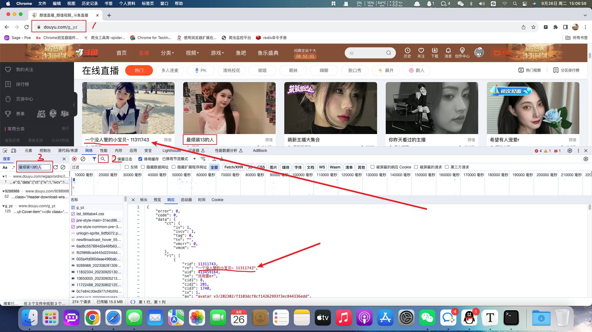
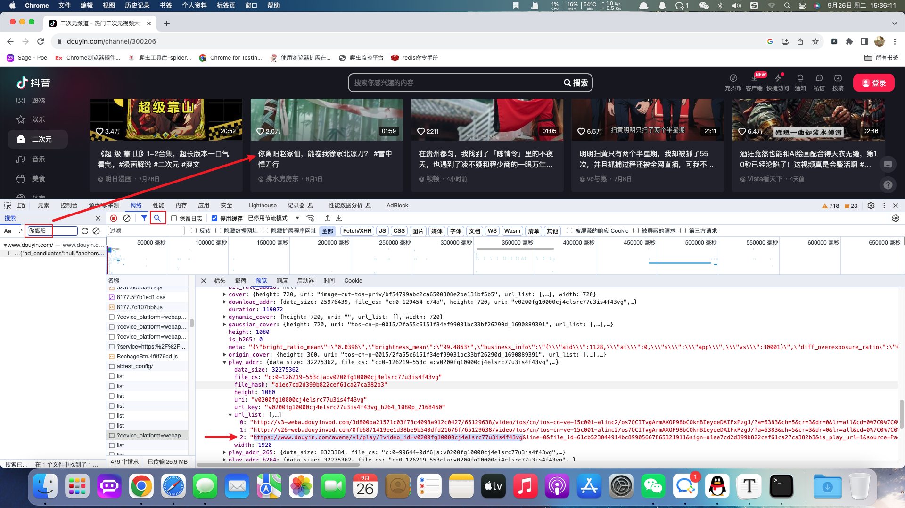
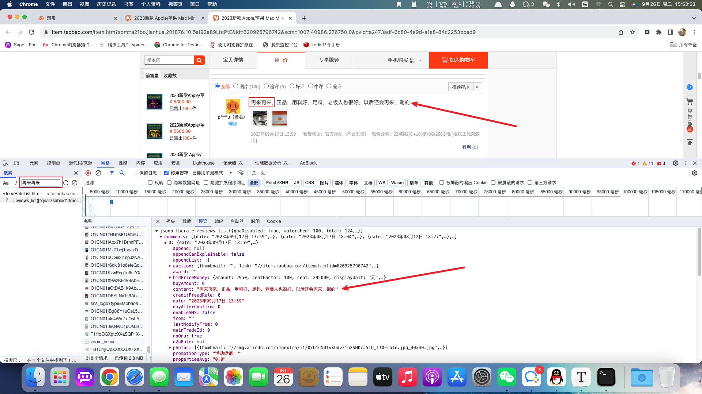
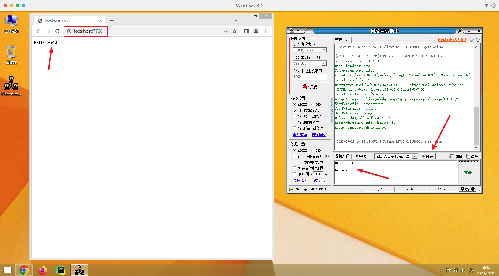

### 1.爬虫相关概念

##### 什么是爬虫

网络爬虫（又被称为网页蜘蛛，网络机器人）就是模拟浏览器发送网络请求，接收请求响应，一种按照一定的规则，自动地抓取互联网信息的程序。

原则上，**只要是浏览器(客户端)能做的事情，爬虫都能够做**

##### 如何获取爬虫程序

- 下载其他公司开发的通用爬虫(八爪鱼)
- 开发人员自己编写

##### 区别

> 通用爬虫

可以提取大多数网站的数据，但是对于网站中某些特殊数据的提取方式没有实现

> 自定义爬虫

可以针对某一种网站自行开发符合要求的爬虫

##### 开发语言

只要能够发送`HTTP(S)`请求的任何编程语言都是可以完成爬虫程序的，例如：`C++`、`java`、`php`、`JavaScript`等等

但是论爬虫开发效率一般都指的是`python`语言

##### 爬虫分类

根据抓取网站的数量不同，大致将爬虫分为两种：

- 通用爬虫：通常指搜索引擎的爬虫，例如：https://www.baidu.com
- 聚焦爬虫：针对特定网站的爬虫

### 2.爬虫流程以及案例演示

##### 聚焦爬虫代码执行流程


> 流程说明

1. 向起始地址发送请求，并获取响应
2. 对响应结果进行数据提取
3. 如果获取的数据是新的网站地址则继续发送请求并获取响应
4. 如果获取的数据为页面需要的数据则完成数据保存

##### 案例：斗鱼图片

> 目标

- 练习分析素材并提取素材地址的能力
- 手动下载素材

> 过程记录

斗鱼-颜值`URL`：https://www.douyu.com/g_yz

分析出图片的`URL`：https://rpic.douyucdn.cn/live-cover/roomCover/2023/09/02/003a4fd060deae496bab910340b6a165_big.png



在一般的网站中，图片地址都是在`html`代码的`img`标签中的，例如百度图片。但是斗鱼网站进过分析之后我们发现，图片并不在`html`代码当中。像这种网站的资源都是动态加载过来的，所以需要善于利用浏览器开发者工具进行网络抓包。基于抓包我们发现当前图片等动态信息位于：https://www.douyu.com/wgapi/ordnc/live/web/room/yzList/1

当前`api`返回的数据为`json`数据，在`json`数据中包含了主播封面图片地址。

##### 案例：抖音视频

> 要求：获取抖音原视频地址
>
> 分析地址：https://www.douyin.com/channel/300206



根据抓包分析出当前视频的`api`接口并返回`json`数据。在`json`数据中包含视频的播放地址，位于当前`api`的`url_list`节点。

##### 案例：淘宝评论

> 要求：获取商家评论信息
>
> 分析地址：https://item.taobao.com/item.htm?spm=a21bo.jianhua.201876.10.5af92a89LhtPtE&id=620925796742&scm=1007.40986.276750.0&pvid=a2473adf-6c80-4e9d-a1e8-84c2253bbed9



根据浏览器抓包工具获取对应的评论`api`并获取响应的`json`数据。

### 3.`HTTP`与`HTTPS`协议

目前大部分网站是基于`HTTP`与`HTTPS`进行网络交互的，在爬虫程序中也是发送网络协议来获取对应的网站信息，所以还是有必要了解网络协议。

##### `HTTP`与`HTTPS`相关概念

- `HTTP`
  - 超文本传输协议
  - 默认端口号：80
- `HTTPS`
  - `HTTP` + `SSL`(安全套接字层)，即带有安全套接字层的超本文传输协议
  - 默认端口号：443

`HTTPS`比`HTTP`更安全，但是性能更低。

##### 理解`HTTP`协议

`HTTP`协议使用了`TCP`协议，接下来我们使用`网络调试助手`软件发送`HTTP`协议并携带`hello world`数据到浏览器。

软件下载地址：https://soft.3dmgame.com/down/213757.html



> 操作步骤
>
> 1. 设置网络调试助手为`TCP Server`端
> 2. 浏览器链接网络调试助手
> 3. 发送`HTTP`协议到浏览器并携带数据
> 4. 断开连接，浏览器显示相应内容

##### `HTTP`协议的重要信息

在以上案例中，我们想要给浏览器发送信息并显示，就必须要带上`HTTP`协议。`HTTP`协议中有一部分数据对爬虫程序来说非常重要。分别是请求头与响应头。

> 常见的请求头参数

1. `Host` (主机和端口号)
2. `Connection` (链接类型)
3. `Upgrade-Insecure-Requests` (升级为`HTTPS`请求)
4. `User-Agent `(浏览器名称)
5. `Accept` (传输文件类型)
6. `Referer` (页面跳转处)
7. `Accept-Encoding`（文件编解码格式）
8. `Cookie `（`Cookie`信息）
9. `x-requested-with :XMLHttpRequest` (表示该请求是`Ajax`异步请求)

> 响应头参数

`Set-Cookie` （对方服务器设置`cookie`到用户浏览器的缓存）

> 响应状态码

- `200`：成功
- `302`：临时转移至新的`url`(一般会用`GET`，例如原本是`POST`则新的请求则是`GET`)
- `307`：临时转移至新的`url`(原本是`POST`则新的请求依然是`POST`)
- `403`：无请求权限
- `404`：找不到该页面
- `500`：服务器内部错误
- `503`：服务不可用，一般是被反爬

##### 浏览器发送`HTTP`请求过程


1. 客户端发送网站域名到`DNS`服务器
2. `DNS`服务器返回`IP`地址到客户端
3. 客户端根据返回的`IP`地址访问网站后端服务器并请求网站资源
4. 网站后端服务器返回对应页面资源

### 4.`Robots`协议

网站通过`Robots`协议告诉搜索引擎哪些页面可以抓取，哪些页面不能抓取，但它仅仅是互联网中的约定而已，可以不用遵守。例如：https://www.taobao.com/robots.txt

在后期的`Scrapy`框架学习中，需要手动关闭`Robots`协议，现阶段了解即可。

### 5.爬虫相关的谷歌浏览器插件

- **XPath Helper**
- **Web Scraper**
- **Toggle JavaScript**
- **User-Agent Switcher for Chrome**
- **EditThisCookie**
- **SwitchySharp**

**无法链接外网的同学通过国内浏览器插件网站下载：https://extfans.com/**

### 6.网站请求测试软件

> PostMan:https://www.postman.com/downloads

> ApiPost:https://www.apipost.cn/download.html

### 7.编码

字符是各种文字和符号的总称，包括国家文字、标点符号、图形符号、数字等等。

字符集是多个字符的集合，字符集包括：`ASCII`、`GB2312`、`Unicode`等等。`UTF-8`是`Unicode`的实现方式之一

> `Python3`中的字符串

- `str`：`unicode`的呈现形式
- `bytes`：字节类型，互联网上的数据都已以二进制的方式传输的

> `str`与`bytes`类型的互相转换

- `str`使用`encode`方法转换为`bytes`

  ```python
  str_code = 'abc'
  print(type(str_code))

  byte_code = str_code.encode()
  print(type(byte_code))
  ```

- `bytes`通过`decode`转换为`str`

  ```python
  byte_code = b'abc'
  print(type(byte_code))

  str_code = byte_code.decode()
  print(type(str_code))
  ```

注意：编码方式必须和解码方式一样，否则就会出现乱码问题。例如使用`utf-8`编码，那么就必须使用`utf-8`解码。
