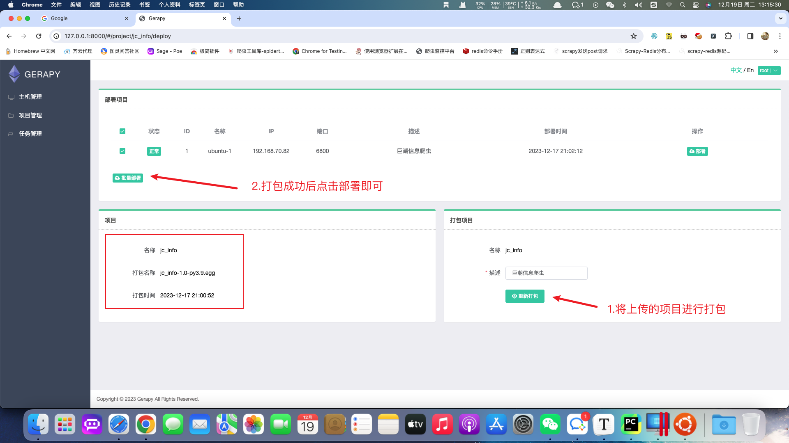

### 1.`scrapy-redis`实现增量爬虫

##### 增量爬虫的含义

在前面我们学习了可以在运行`scrapy`项目时，使用`scrpay crawl 爬虫名 -s JOBDIR=xxx`来实现暂停、恢复爬取（其实就是增量爬虫，再次运行时可以在之前基础上继续爬），这种方式虽然能够实现增量爬取，但我们无法从`JOBDIR`指定的路径中看出我们现在爬取的情况。

##### 使用`scrapy-redis`完成增量爬虫

> 安装

```shell
# 使用scrapy-redis之前最好将scrapy版本保持在2.8.0, 2.11.0版本有兼容性问题
pip install scrapy==2.8.0
pip install scrapy-redis  -i https://pypi.tuna.tsinghua.edu.cn/simple
```

> 配置

想要让`scrapy`实现增量爬取（即暂停、恢复）功能，就需要在`scrapy`项目中的`settings.py`文件中进行配置

```python
""" scrapy-redis配置 """
# 调度器类
SCHEDULER = "scrapy_redis.scheduler.Scheduler"

# 指纹去重类
DUPEFILTER_CLASS = "scrapy_redis.dupefilter.RFPDupeFilter"
# 可以替换成布隆过滤器
# 下载 - pip install scrapy-redis-bloomfilter
# from scrapy_redis_bloomfilter.dupefilter import RFPDupeFilter
# DUPEFILTER_CLASS = 'scrapy_redis_bloomfilter.dupefilter.RFPDupeFilter'

# 是否在关闭时候保留原来的调度器和去重记录，True=保留，False=清空
SCHEDULER_PERSIST = True

# Redis服务器地址
REDIS_URL = "redis://127.0.0.1:6379/0"  # Redis默认有16库，/1的意思是使用序号为2的库，默认是0号库（这个可以任意）

SCHEDULER_QUEUE_CLASS = 'scrapy_redis.queue.PriorityQueue'  # 使用有序集合来存储
# SCHEDULER_QUEUE_CLASS = 'scrapy_redis.queue.FifoQueue'  # 先进先出
# SCHEDULER_QUEUE_CLASS = 'scrapy_redis.queue.LifoQueue'  # 先进后出、后进先出

# 配置redis管道
# from scrapy_redis.pipelines import RedisPipeline
ITEM_PIPELINES = {
    "douban.pipelines.DoubanPipeline": 300,
    'scrapy_redis.pipelines.RedisPipeline': 301
}

# 重爬: 一般不配置，在分布式中使用重爬机制会导致数据混乱，默认是False
# SCHEDULER_FLUSH_ON_START = True
```

> 运行指令以及运行效果

```shell
scrapy crawl 爬虫名称
```

在爬取过程中，使用`ctrl + c`让爬虫暂停抓取。停止后使用`redis`客户端查看对应的数据信息。

1. 在数据库中显示的`requests`表示还没有来得及抓取的请求，下次抓取时根据当前数据继续运行。


2. 数据库中显示的`dupfilter`表示已经抓取过的请求，重新启动后如果存在相同的`requests`则不再抓取。


##### 爬虫作业

访问网易招聘站点获取列出的所有招聘信息，网站地址：https://hr.163.com/job-list.html

> 示例代码

`spiders/zhaopin.py`

```python
import scrapy
from scrapy import cmdline
from scrapy.http import JsonRequest


class ZhaoPinSpider(scrapy.Spider):
    name = "zhaopin"
    allowed_domains = ["hr.163.com"]

    # start_urls = ["https://hr.163.com/api/hr163/position/queryPage"]

    def start_requests(self):
        api_url = 'https://hr.163.com/api/hr163/position/queryPage'
        for page in range(1, 279):
            params = {
                'currentPage': page,
                'pageSize': 10
            }
            yield JsonRequest(api_url, data=params)

    def parse(self, response, **kwargs):
        work_list = response.json()['data']['list']
        for work in work_list:
            item = dict()
            item['work_id'] = work['id']
            item['postTypeFullName'] = work['postTypeFullName']
            item['reqEducationName'] = work['reqEducationName']
            item['workPlaceNameList'] = work['workPlaceNameList'][0]
            item['requirement'] = work['requirement']

            yield item


if __name__ == '__main__':
    cmdline.execute('scrapy crawl zhaopin'.split())
```

`pipelines.py`

```python
import pymongo
from itemadapter import ItemAdapter


class NetEasePipeline:
    def open_spider(self, spider):
        self.mongo_client = pymongo.MongoClient()
        self.collection = self.mongo_client['py_spider']['netEase_job']

    def process_item(self, item, spider):
        self.collection.insert_one(item)
        print('保存成功:', item)

    def close_spider(self, spider):
        self.mongo_client.close()
```

`settings.py`

```python
BOT_NAME = "netease"

SPIDER_MODULES = ["netease.spiders"]
NEWSPIDER_MODULE = "netease.spiders"

ROBOTSTXT_OBEY = False

DOWNLOAD_DELAY = 5

ITEM_PIPELINES = {
    "netease.pipelines.NetEasePipeline": 300,
}

REQUEST_FINGERPRINTER_IMPLEMENTATION = "2.7"
TWISTED_REACTOR = "twisted.internet.asyncioreactor.AsyncioSelectorReactor"
FEED_EXPORT_ENCODING = "utf-8"

"""scrapy-redis配置"""
# 调度器类
SCHEDULER = "scrapy_redis.scheduler.Scheduler"
# 指纹去重类
DUPEFILTER_CLASS = "scrapy_redis.dupefilter.RFPDupeFilter"
# 是否在关闭时候保留原来的调度器和去重记录，True=保留，False=清空
SCHEDULER_PERSIST = True
# Redis服务器地址
REDIS_URL = "redis://127.0.0.1:6379/1"  # Redis默认有16库，/1的意思是使用序号为2的库，默认是0号库（这个可以任意）

```

### 2.`scrapy-redis`实现分布式爬虫

在前面`scrapy`框架的学习中我们已经能够使用框架实现爬虫爬取网站数据,如果当前网站的数据比较庞大, 我们就需要使用分布式来更快的爬取数据。

##### `scrapy-redis`的概念

之前我们已经学习了`scrapy`，它是一个通用的爬虫框架，能够耗费很少的时间就能够写出爬虫代码。`scrapy-redis`是`scrapy`的一个组件，它使用了`redis`数据库做为基础，目的为了更方便地让`scrapy`实现分布式爬取。

`scrapy`能做的事情很多，但是要做到大规模的分布式应用则捉襟见肘。有能人改变了`scrapy`的队列调度，将起始的网址从`start_urls`里分离出来，改为从`redis`读取，多个客户端可以同时读取同一个`redis`，从而实现了分布式的爬虫。

##### 什么是分布式

简单的说 分布式就是不同的节点（服务器，ip 不同）共同完成一个任务，且数据不会混乱。

比方说：某公司到年底了要统计这一年来公司所有的收入与支出情况，所以请了一个财务人员来做，此时就是单任务（因为只有 1 个人做事）。为了提高效率公司又临时聘请了 9 位财务人员一起来做这个事情，此时共有 10 人，此时我们成为多任务，又因为每个人都是一个独立的个体，所以就叫做分布式了。

在数据统计之前，需要分配每个人应该做的工作，当所有人全部完成任务后将结果汇总在一起则完成了公司下达的任务。

所以，在分布式系统中一个很重要的事情就是：任务的分配与结果的收集。

##### `scrapy-redis`的作用

`scrapy-redis`在`scrapy`的基础上实现了更多更强大的功能，具体体现在：

通过持久化请求队列和请求的指纹集合来实现：

- 断点续爬

  通俗的说：这次爬取的数据，下载再运行时不会爬取，只爬取之前没有爬过的数据

- 分布式快速抓取

  通俗的说：多个电脑（也可以在一个电脑上运行多个程序来模拟）可以一起爬取数据，而且不会有冲突

##### `scrapy-redis`的工作流程

1. `scrapy`的流程（与之前所讲的`scrapy`图解一样，只是表现形式不一样）


2. `scrapy-redis`实现分布式图解


说明：原本只有 1 个`scrapy`时，它所有的请求对象`request`都直接存放到了内存中，此时可以完成本台电脑上`scrapy`的功能，但是其他电脑上的`scrapy`是不能够获取另外一台电脑内存中的数据的，所以借助了`Redis`数据库。将原本直接存储到内存中的数据（像请求对象等）放到了`Redis`数据库中（因为`Redis`效率非常高，所以用它而不用`MySQL`、`MongoDB`），又因为`Redis`是支持网络访问的，所以在本电脑上的`Redis`中存储的数据，就可以让其他电脑上的`scrapy`去共用，此时哪个请求对象已经处理过，哪个没有并处理过，一目了然。

##### 注意点

1. 在`scrapy-redis`中，所有的待抓取的`request`对象和去重的`request`对象指纹都存在共用的`redis`中
2. 所有的服务器中的`scrapy`进程共用同一个`redis`中的`request`对象的队列
3. 所有的`request`对象存入`redis`前，都会通过该`redis`中的`request`指纹集合进行判断，之前是否已经存入过
4. 在默认情况下所有的数据会保存在`redis`中


##### `scrapy-redis`分布式架构的思路分析

假设有四台电脑：`Windows 10`、`Mac OS X`、`Ubuntu 16.04`、`CentOS 7.2`任意一台电脑都可以作为`Master`端或`Slaver`端。


- `Master端`(核心服务器) ：使用`Windows 10`，搭建一个`Redis`数据库，不负责爬取，只负责`url`指纹判重、`Request`的分配，以及数据的存储
- `Slaver端`(爬虫程序执行端) ：使用`Mac OS X`、`Ubuntu 16.04`、`CentOS 7.2`负责执行爬虫程序，运行过程中提交新的`Request`给`Master`

> 执行流程

1. 首先`Slaver`端从`Master`端拿任务（`Request`、`url`）进行数据抓取，`Slaver`抓取数据的同时，产生新任务的`Request`便提交给`Master`处理；
2. `Master`端只有一个`Redis`数据库，负责将未处理的`Request`去重和任务分配，将处理后的`Request`加入待爬队列，并且存储爬取的数据。

`scrapy-redis`默认使用的就是这种策略，我们实现起来很简单，因为任务调度等工作`scrapy-redis`都已经帮我们做好了，我们只需要继承`RedisSpider`、指定`redis_key`就行了。

缺点：`scrapy-redis`调度的任务是`Request`对象，里面信息量比较大（不仅包含`url`，还有`callback`函数、`headers`等信息），可能导致的结果就是会降低爬虫速度、而且会占用`Redis`大量的存储空间，所以如果要保证效率，那么就需要一定硬件水平。

##### 豆瓣爬虫案例实现

`top250.py`

```python
import base64
import scrapy
from scrapy import cmdline
from scrapy_redis.spiders import RedisSpider
from scrapy.http import HtmlResponse


class Top250Spider(RedisSpider):
    name = "top250"
    allowed_domains = ["movie.douban.com", 'doubanio.com']
    # start_urls = ["https://movie.douban.com/top250"]
    redis_key = 'top250:start_urls'

    def parse(self, response: HtmlResponse, **kwargs):
        li_list = response.xpath("//ol[@class='grid_view']/li")
        for li_temp in li_list:
            image_url = li_temp.xpath(".//img/@src").extract_first()
            title = li_temp.xpath(".//span[@class='title'][1]/text()").extract_first()
            rating_num = li_temp.xpath(".//span[@class='rating_num']/text()").extract_first()
            people_num = li_temp.xpath(".//div[@class='star']/span[4]/text()").extract_first()

            yield {
                'type': 'info',
                'image_url': image_url,
                'title': title,
                'rating_num': rating_num,
                'people_num': people_num
            }

            yield scrapy.Request(url=image_url, callback=self.parse_image, cb_kwargs={'image_name': title})

        if response.xpath("//span[@class='next']/a/@href"):
            next_url = response.urljoin(response.xpath("//span[@class='next']/a/@href").extract_first())
            print('开始抓取下一页:', next_url)
            yield scrapy.Request(url=next_url, callback=self.parse)
        else:
            print('全站抓取成功...')

    def parse_image(self, response, image_name):
        base64_data = base64.b64encode(response.body)
        str_data = base64_data.decode()
        yield {
            'type': 'image',
            'image_name': image_name + '.jpg',
            'image_content': str_data
        }


# if __name__ == '__main__':
#     cmdline.execute('scrapy crawl top250'.split())

```

`settings.py`

```python
BOT_NAME = "douban"

SPIDER_MODULES = ["douban.spiders"]
NEWSPIDER_MODULE = "douban.spiders"

ROBOTSTXT_OBEY = False

# 控制抓取速率
DOWNLOAD_DELAY = 3

DOWNLOADER_MIDDLEWARES = {
    # "douban.middlewares.DoubanDownloaderMiddleware": 543,
    "douban.middlewares.UserAgentDownloaderMiddleware": 543,
}

REQUEST_FINGERPRINTER_IMPLEMENTATION = "2.7"
TWISTED_REACTOR = "twisted.internet.asyncioreactor.AsyncioSelectorReactor"
FEED_EXPORT_ENCODING = "utf-8"

""" scrapy-redis配置 """
# 调度器类
SCHEDULER = "scrapy_redis.scheduler.Scheduler"

# 指纹去重类
DUPEFILTER_CLASS = "scrapy_redis.dupefilter.RFPDupeFilter"
# 可以替换成布隆过滤器
# 下载 - pip install scrapy-redis-bloomfilter
# from scrapy_redis_bloomfilter.dupefilter import RFPDupeFilter
# DUPEFILTER_CLASS = 'scrapy_redis_bloomfilter.dupefilter.RFPDupeFilter'

# 是否在关闭时候保留原来的调度器和去重记录，True=保留，False=清空
SCHEDULER_PERSIST = True

# Redis服务器地址
REDIS_URL = "redis://127.0.0.1:6379/0"  # Redis默认有16库，/1的意思是使用序号为2的库，默认是0号库（这个可以任意）

SCHEDULER_QUEUE_CLASS = 'scrapy_redis.queue.PriorityQueue'  # 使用有序集合来存储
# SCHEDULER_QUEUE_CLASS = 'scrapy_redis.queue.FifoQueue'  # 先进先出
# SCHEDULER_QUEUE_CLASS = 'scrapy_redis.queue.LifoQueue'  # 先进后出、后进先出

# 配置redis管道
# from scrapy_redis.pipelines import RedisPipeline
ITEM_PIPELINES = {
    # "douban.pipelines.DoubanPipeline": 300,
    'scrapy_redis.pipelines.RedisPipeline': 301
}

# 重爬: 一般不配置，在分布式中使用重爬机制会导致数据混乱
# SCHEDULER_FLUSH_ON_START = True
```

`middlewares.py`

```python
# 自定义下载中间件
class UserAgentDownloaderMiddleware:
    USER_AGENTS_LIST = [
        "Mozilla/5.0 (compatible; MSIE 9.0; Windows NT 6.1; Win64; x64; Trident/5.0; .NET CLR 3.5.30729; .NET CLR 3.0.30729; .NET CLR 2.0.50727; Media Center PC 6.0)",
        "Mozilla/5.0 (compatible; MSIE 8.0; Windows NT 6.0; Trident/4.0; WOW64; Trident/4.0; SLCC2; .NET CLR 2.0.50727; .NET CLR 3.5.30729; .NET CLR 3.0.30729; .NET CLR 1.0.3705; .NET CLR 1.1.4322)",
        "Mozilla/4.0 (compatible; MSIE 7.0b; Windows NT 5.2; .NET CLR 1.1.4322; .NET CLR 2.0.50727; InfoPath.2; .NET CLR 3.0.04506.30)",
        "Mozilla/5.0 (Windows; U; Windows NT 5.1; zh-CN) AppleWebKit/523.15 (KHTML, like Gecko, Safari/419.3) Arora/0.3 (Change: 287 c9dfb30)",
        "Mozilla/5.0 (X11; U; Linux; en-US) AppleWebKit/527+ (KHTML, like Gecko, Safari/419.3) Arora/0.6",
        "Mozilla/5.0 (Windows; U; Windows NT 5.1; en-US; rv:1.8.1.2pre) Gecko/20070215 K-Ninja/2.1.1",
        "Mozilla/5.0 (Windows; U; Windows NT 5.1; zh-CN; rv:1.9) Gecko/20080705 Firefox/3.0 Kapiko/3.0",
        "Mozilla/5.0 (X11; Linux i686; U;) Gecko/20070322 Kazehakase/0.4.5"
    ]

    def process_request(self, request, spider):
        """
        如果返回None, 表示当前的request提交给下载器或者其他的中间件
        如果返回的是request对象, 则表示将当前对象提交给调度器进行重新请求
        """
        print('下载中间件 ---> process_request')
        # print('请求对象:', request)
        user_agent = random.choice(self.USER_AGENTS_LIST)
        request.headers['User-Agent'] = user_agent
        return None
```

`insert_start_url.py`

```python
import redis

redis_client = redis.Redis()
redis_client.lpush('top250:start_urls', 'https://movie.douban.com/top250?start=0&filter=')
print('插入完成...')
redis_client.close()
```

##### 当当网爬虫实战

> 站点地址：http://search.dangdang.com/?key=Python&act=input

1. 项目初始化

```shell
scrapy startproject dangdang_book
```

2. 创建爬虫文件

```shell
cd dangdang_book
scrapy genspider book http://search.dangdang.com/
```

3. 修改父类以及配置`redis_key`

```python
import scrapy
from scrapy_redis.spiders import RedisSpider


class BookSpider(RedisSpider):
    name = "book"
    allowed_domains = ["search.dangdang.com"]
    # start_urls = ["http://search.dangdang.com/"]
    redis_key = 'dd_book:start_url'

    def parse(self, response, **kwargs):
        pass
```

4. 修改配置文件

```python
# 持久化配置
SCHEDULER_PERSIST = True
# 使用scrapy-redis调度器
SCHEDULER = "scrapy_redis.scheduler.Scheduler"
# scrapy-redis指纹过滤器
DUPEFILTER_CLASS = "scrapy_redis.dupefilter.RFPDupeFilter"
# redis链接地址
REDIS_URL = 'redis://127.0.0.1:6379/0'
# 任务的优先级别
SCHEDULER_QUEUE_CLASS = 'scrapy_redis.queue.PriorityQueue'
# 存放的管道
ITEM_PIPELINES = {
    "scrapy_redis.pipelines.RedisPipeline": 300,
    'dangdang_book.pipelines.MySQLPipeline': 301,
}

DEFAULT_REQUEST_HEADERS = {
    'Accept': 'text/html,application/xhtml+xml,application/xml;q=0.9,*/*;q=0.8',
    'Accept-Language': 'en',
    'User-Agent': 'Mozilla/5.0 (Windows NT 10.0; Win64; x64) AppleWebKit/537.36 (KHTML, like Gecko) Chrome/110.0.0.0 Safari/537.36'
}
```

5. 管道配置

```python
# Define your item pipelines here
#
# Don't forget to add your pipeline to the ITEM_PIPELINES setting
# See: https://docs.scrapy.org/en/latest/topics/item-pipeline.html


# useful for handling different item types with a single interface
from itemadapter import ItemAdapter

import pymysql


class MySQLPipeline:
    def open_spider(self, spider):
        # 判断是哪个爬虫, 名字不同执行的爬虫项目也不同
        if spider.name == 'book':
            self.db = pymysql.connect(host="localhost", user="root", password="root", db="py_spider")
            self.cursor = self.db.cursor()
            # 创建表语法
            sql = '''
            CREATE TABLE IF NOT EXISTS book_info(
                id int primary key auto_increment not null,
                title VARCHAR(255) NOT NULL,
                price VARCHAR(255) NOT NULL,
                author VARCHAR(255) NOT NULL,
                date_data VARCHAR(255) NOT NULL,
                detail TEXT,
                producer VARCHAR(255) NOT NULL)
            '''
            try:
                self.cursor.execute(sql)
                print("表创建成功...")
            except Exception as e:
                print(f"表创建失败:", e)

    def process_item(self, item, spider):
        if spider.name == 'book':
            # SQL 插入语句
            sql = """INSERT INTO book_info(id, title, price, author, date_data, detail, producer)
            values (%s, %s, %s, %s, %s, %s, %s)"""
            # 执行 SQL 语句
            try:
                self.cursor.execute(sql, (
                    0, item['title'], item['price'], item['author'], item['date_data'], item['detail'],
                    item['producer']))
                # 提交到数据库执行
                self.db.commit()
                print('数据插入成功:', (
                    0, item['title'], item['price'], item['author'], item['date_data'], item['detail'],
                    item['producer']))
            except Exception as e:
                print(f'数据插入失败: {e}')
                # 如果发生错误就回滚
                self.db.rollback()
            return item  # 将数据提交给redis管道

    def close_spider(self, spider):
        # 关闭数据库连接
        if spider.name == 'book':
            self.db.close()

```

6. `items.py`配置

```python
# Define here the models for your scraped items
#
# See documentation in:
# https://docs.scrapy.org/en/latest/topics/items.html

import scrapy


class DangDangBookItem(scrapy.Item):
    title = scrapy.Field()
    price = scrapy.Field()
    author = scrapy.Field()
    date_data = scrapy.Field()
    detail = scrapy.Field()
    producer = scrapy.Field()
```

7. 完善`parse`函数解析逻辑

```python
import scrapy
from scrapy import cmdline

# 使用上一级路径导入Item文件, 如果使用当前导入方式请使用命令启动项目
from ..items import DangDangBookItem
from scrapy_redis.spiders import RedisSpider


class BookSpider(RedisSpider):
    name = "book"
    allowed_domains = ["search.dangdang.com"]
    # start_urls = ["http://search.dangdang.com/"]
    redis_key = 'dd_book:start_url'

    def parse(self, response, **kwargs):
        li_list = response.xpath('//ul[@class="bigimg"]/li')
        for li in li_list:
            item = DangDangBookItem()
            item['title'] = li.xpath('./a/@title').extract_first()
            item['price'] = li.xpath('./p[@class="price"]/span[1]/text()').extract_first()
            item['author'] = li.xpath('./p[@class="search_book_author"]/span[1]/a[1]/@title').extract_first()
            item['date_data'] = li.xpath('./p[@class="search_book_author"]/span[last()-1]/text()').extract_first()
            item['detail'] = li.xpath('./p[@class="detail"]/text()').extract_first() if li.xpath(
                './p[@class="detail"]/text()') else '空'
            item['producer'] = li.xpath(
                './p[@class="search_book_author"]/span[last()]/a/text()').extract_first() if li.xpath(
                './p[@class="search_book_author"]/span[last()]/a/text()') else '空'

            yield item

        if response.xpath('//ul[@name="Fy"]/li[@class="next"]/a/@href').extract_first() is not None:
            next_url = response.urljoin(response.xpath('//ul[@name="Fy"]/li[@class="next"]/a/@href').extract_first())
            yield scrapy.Request(url=next_url, callback=self.parse)


# if __name__ == '__main__':
#     cmdline.execute('scrapy crawl book'.split())
```

9. `redis`存储`start_url`运行脚本

`insert_start_url.py`

```python
import redis


res = redis.Redis()
res.lpush('dd_book:start_url', 'http://search.dangdang.com/?key=python&act=input&page_index=1')
res.close()
```

10. 从`redis`中获取数据

`get_redis_info.py`

```python
import json
import redis

redis_client = redis.Redis()

for temp in redis_client.lrange('book:items', 0, -1):
    print(json.loads(temp))

redis_client.close()
```

##### 使用`scrapy-redis`发送`POST`请求

在当前案例中我们需要掌握如何使用`scrapy-redis`发送`POST`请求并完成翻页。

站点请求地址：http://www.cninfo.com.cn/new/commonUrl?url=disclosure/list/notice#szse

`jc.py`

```python
import json
from scrapy import cmdline
from scrapy.http import FormRequest
from scrapy_redis.spiders import RedisSpider


class JcSpider(RedisSpider):
    name = "jc"
    allowed_domains = ["www.cninfo.com.cn"]
    # start_urls = ["http://www.cninfo.com.cn/"]
    redis_key = 'jc:start_urls'

    def make_request_from_data(self, data):
        url = 'http://www.cninfo.com.cn/new/disclosure'
        """
        :param data: 是scrapy-redis读取redis中的[url, form_data, meta]
        :return:
        """
        data = json.loads(data)
        form_data = data.get('form_data')
        print(form_data)

        headers = {
            'User-Agent': 'Mozilla/5.0 (Macintosh; Intel Mac OS X 10_15_7) AppleWebKit/537.36 (KHTML, like Gecko) Chrome/120.0.0.0 Safari/537.36'
        }

        return FormRequest(url=url, headers=headers, formdata=form_data, callback=self.parse)

    def parse(self, response, **kwargs):
        print('返回信息:', response.json())


if __name__ == '__main__':
    cmdline.execute('scrapy crawl jc'.split())
```

`push_start_url_data.py`

```python
import json
import redis


def push_start_url_data(db, request_obj):
    """
    :param db: redis链接对象
    :param request_obj: {'url':url, 'form_data':form_data, 'meta':meta}
    :return:
    """
    db.lpush('jc:start_urls', request_obj)


if __name__ == '__main__':
    redis_client = redis.Redis()
    # 需要将表单中的数字类型强转为字符串类型
    for page in range(1, 26):
        form_data = {
            'column': 'szse_latest',
            'pageNum': str(page),
            'pageSize': '30',
            'sortName': '',
            'sortType': '',
            'clusterFlag': 'true'
        }

        request_data = {
            'form_data': form_data
        }

        push_start_url_data(redis_client, json.dumps(request_data))
    redis_client.close()

```

`settings.py`

```python
"""scrapy-redis配置"""
# 调度器类
SCHEDULER = "scrapy_redis.scheduler.Scheduler"
# 指纹去重类
DUPEFILTER_CLASS = "scrapy_redis.dupefilter.RFPDupeFilter"
# 是否在关闭时候保留原来的调度器和去重记录，True=保留，False=清空
SCHEDULER_PERSIST = True
# Redis服务器地址
REDIS_URL = "redis://127.0.0.1:6379/0"

```

### 3.项目部署 - `scrapyd`

##### `scrapyd`的概念

`scarpy`是一个爬虫框架，而`scrapyd`相当于一个组件，能够将`scrapy`项目进行远程部署，调度使用等。

##### 服务端相关配置 - 执行爬虫的服务器

> 安装`scrapyd`

```python
pip install scrapyd  -i https://pypi.tuna.tsinghua.edu.cn/simple
```

> 运行`scrapyd`

在服务端执行`scrapyd`指令

> 修改配置让`scrapyd`支持远程访问

使用`ctrl+c`停止上一步运行的`scrapyd`，并在你想要运行爬虫项目的路径之下新建`scrapyd.conf`文件。


输入的内容如下：

```shell
[scrapyd]
# 监听的IP地址，默认为127.0.0.1（只有改成0.0.0.0才能在别的电脑上能够访问scrapyd运行之后的服务器）
bind_address = 0.0.0.0
# 监听的端口，默认为6800
http_port   = 6800
# 是否打开debug模式，默认为off
debug = off
```

> 重新运行

在刚刚新建`scrpayd.conf`文件所在路径下通过终端运行`scrapyd`。


> 在物理机中使用浏览器访问运行`scrapyd`指令的服务器地址以及端口


##### 客户端相关配置 - 本地编写的爬虫代码上传到服务端

> 安装`scrapyd-client`

```python
pip install scrapyd-client  -i https://pypi.tuna.tsinghua.edu.cn/simple
```

> 配置`scrapy`项目


如果运行的`scrapy`的服务器只有一个则配置一个`deploy`即可，如果有多台服务器则配置多个`deploy`。

> 检查配置是否生效

在`scrapy`项目根路径之下运行如下命令：

```shell
# 注意是小写的L，不是数字1
scrapyd-deploy -l
```


> 发布`scrapy`项目到`scrapyd`所在的服务器（当前爬虫是未运行状态）

```shell
scrapyd-deploy <target> -p <project> --version <version>
```

- `target`：就是前面配置文件里`deploy`后面的的`target`名字，例如`ubuntu-1`
- `project`：可以随意定义，跟爬虫的工程名字无关，一般建议与`scrapy`爬虫项目名相同
- `version`：自定义版本号，不写的话默认为当前时间戳，一般不写

```shell
scrapyd-deploy ubuntu-1 -p dangdang_book
```

爬虫目录下不要放无关的`py`文件，放无关的`py`文件会导致发布失败，但是当爬虫发布成功后，会在当前目录生成一个`setup.py`文件，可以删除掉。


发布成功后可以在服务端查看到上传的爬虫项目，效果如下：


刷新物理机上的浏览器则显示上传成功后的`scrapy`项目，效果如下：


##### 启动通过`scrapyd`部署的爬虫

###### 运行指令

`scrapyd`已经给出了怎样开始运行爬虫，如下图所示：


将上述的命令复制，之后在终端中进行适当的修改即可开启爬虫，命令如下：

```python
curl http://192.168.70.82:6800/schedule.json -d project=dangdang_book -d spider=book
```


爬虫启动成功后可在浏览器中查看爬虫运行状态，在主页中点击`Jobs`，效果如下：


验证服务端是否开始抓取信息：


验证服务端中的`Redis`信息：


###### 爬虫停止

停止爬虫的指令如下：

```python
curl http://ip:6800/cancel.json -d project=项目名 -d job=任务的id值
```

任务的`id`值可在浏览器中查询：


根据页面中显示的`id`编辑指令：

```shell
curl http://192.168.70.82:6800/cancel.json -d project=dangdang_book -d job=55b4b87a98c111eeb1af001c42c139d2
```


浏览器查询爬虫运行状态：


###### 总结

1. 如果`scrapy`项目代码，修改了，只需要重新发布到`scrapyd`所在服务器即可
2. 如果`scrapy`项目暂停了，可以再次通过`curl`的方式发送命令让其"断点续爬"

### 4.项目部署 - `scrapydweb`

##### 简介

是一个基于`scrapyd`的可视化组件，集成并且提供更多可视化功能和更优美的界面。`scrapydweb`后端是采用`flask`框架编写的，所以对于会`flask`的同学是可以适当定制的。

##### 安装与运行

###### 安装方式

```shell
pip install scrapydweb  -i https://pypi.tuna.tsinghua.edu.cn/simple
```

###### 运行指令

在运行`scrapydweb`之前一定要确保`scrapyd`正在运行，可以在`scrapyd`服务启动之后重新创建一个新终端窗口来启动`scrapydweb`。

```shell
scrapyd
scrapydweb
```

`scrapydweb`项目地址：https://github.com/my8100/scrapydweb?tab=readme-ov-file

`scrapydweb`第一次启动会报错，报错之后重新启动即可，重新启动后会在启动路径的位置生成脚本文件。如果重新启动失败并抛出版本依赖问题请查看项目地址中的`requirements.txt`文件并安装最新依赖。

当成功启动后可使用物理机浏览器访问地址：http://192.168.70.82:5000/

显示如下：


##### 基本使用

###### 发布`scrapy`项目


在计算机中搜索需要部署的项目，项目可以打包成压缩包，在打包压缩包之前需要确认项目中只有`scrapy`框架代码。


项目上传成功后的效果如下：


项目运行：


### 5.项目部署 - `Gerapy`

`Gerapy`是一款国人开发的爬虫管理软件（有中文界面）。它是一个管理爬虫项目的可视化工具，把项目部署到管理的操作全部变为交互式，实现批量部署，更方便控制、管理、实时查看结果。

`gerapy`和`scrapyd`的关系就是：我们可以通过`gerapy`中配置`scrapyd`后，不使用命令，直接通过图形化界面开启爬虫。

##### 安装方式

> 安装：`gerapy`作为客户端所以需要安装到物理机中

```python
pip install gerapy==0.9.12 -i https://pypi.tuna.tsinghua.edu.cn/simple
```

安装成功后可以在终端输入指令进行测试：


##### 使用方式

新建文件夹并启动指令：

```shell
gerapy init
```

以下为`gerapy`配置操作：

```shell
cd gerapy
gerapy migrate  # 同步sqlite数据库
gerapy createsuperuser  # 创建超级管理员
gerapy runserver  # 启动服务，访问地址为：127.0.0.1:8000
```

输入用户名密码即可登录：


登录成功后显示如下：


##### 配置完成后创建主机


主机连接成功之后的效果如下：


##### 运行已经存在的项目

在主机管理页面中点击调度则可以查看到已经存在的项目状态：


当前页面中有运行按钮，如果想要运行当前爬虫则点击运行即可，如果运行之后想要停止则页面中会显示停止按钮，点击即可。

##### 本地项目上传

在项目管理中点击上传并将项目压缩包上传即可，压缩包类型必须为`zip`。


