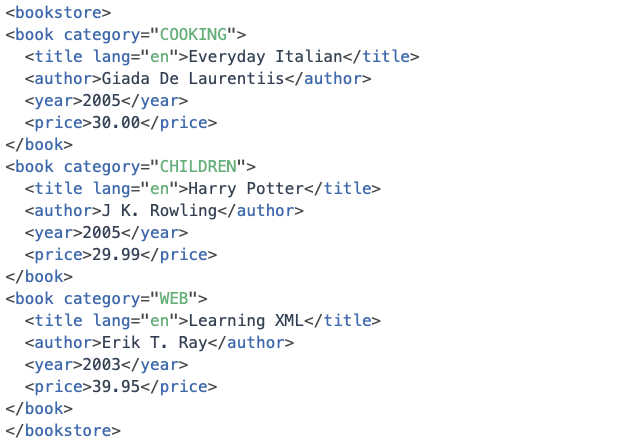
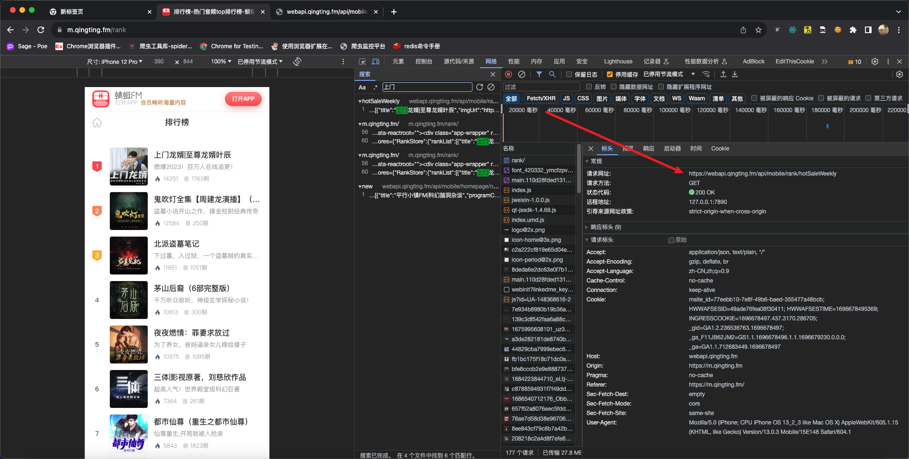

### 1.数据提取的概念和数据分类

在爬虫爬取的数据中有很多不同类型的数据,我们需要了解数据的不同类型来又规律的提取和解析数据。

- 结构化数据：`json`、`xml`
  - 处理方式：直接转化为`python`数据类型
- 非结构化数据：`HTML`
  - 处理方式：正则表达式、`xpath`、`bs4`

##### 结构化数据

> `json`


> `xml`



##### 非结构化数据


### 2.结构化数据提取 - `JSON`

##### 什么是`json`

`JSON(JavaScript Object Notation)` 是一种轻量级的数据交换格式，它使得人们很容易的进行阅读和编写，同时也方便了机器进行解析和生成，适用于进行数据交互的场景，比如网站前端与后端之间的数据交互。

##### `json`模块方法回顾


```python
# json.dumps 实现python类型转化为json字符串
# indent实现换行和空格
# ensure_ascii=False实现让中文写入的时候保持为中文
json_str = json.dumps(mydict, indent=2, ensure_ascii=False)

# json.loads 实现json字符串转化为python的数据类型
my_dict = json.loads(json_str)

```

##### 代码示例

```python
import json
import requests

# 获取公告信息
url = 'http://www.cninfo.com.cn/new/disclosure'

# 定义请求头，模拟浏览器
headers = {
    "User-Agent": "Mozilla/5.0 (Macintosh; Intel Mac OS X 10_15_7) "
                  "AppleWebKit/537.36 (KHTML, like Gecko) Chrome/117.0.0.0 Safari/537.36",
}

# 定义表单数据
post_data = {
    'column': 'szse_latest',
    'pageNum': 1,
    'pageSize': 30,
    'sortName': '',
    'sortType': '',
    'clusterFlag': 'true'
}

# 请求json数据
r = requests.post(url, headers=headers, data=post_data)

# 解码
json_str = r.content.decode()

# 把json格式字符串转换成python对象
json_dict = json.loads(json_str)

print(json_dict)

print("\n\n")

# 还可以使用json()
print(r.json())
```

### 3.练习：蜻蜓 FM 排行榜信息

蜻蜓 FM 的首页`url`：https://m.qingting.fm/rank

代码示例：

```python
import requests

url = "https://webapi.qingting.fm/api/mobile/rank/hotSaleWeekly"

headers = {
    "User-Agent": "Mozilla/5.0 (iPhone; CPU iPhone OS 13_2_3 like Mac OS X) AppleWebKit/605.1.15 (KHTML, like Gecko) Version/13.0.3 Mobile/15E148 Safari/604.1"
}

r = requests.get(url=url, headers=headers)
print(r.status_code)
print(r.json())
```

分析过程：



### 4.非结构化数据提取 - 正则

##### 什么是正则表达式

用事先定义好的一些特定字符、及这些特定字符的组合，组成一个**规则字符串**，这个**规则字符串**用来表达对字符串的一种**过滤**逻辑。

##### 正则表达式的常见语法

- 正则中的字符
- 正则中的预定义字符集
- 正则中的数量词

| 一般字符 | 匹配规则                                                                                                                                                                         | 表达式    | 完整匹配的字符串    |
| -------- | :------------------------------------------------------------------------------------------------------------------------------------------------------------------------------- | --------- | ------------------- |
| `.`      | 匹配任意除换行符`\n`外的字符                                                                                                                                                     | `a.c`     | `abc`               |
| `\`      | 转义字符，使后面一个字符改变原来的意思。如果字符串有字符`*`需要匹配，则可以使用`\*`                                                                                              | `a\.c`    | `a.c`               |
| `[...]`  | 字符集（字符类）。对应的位置可以使字符集中任意字符。字符集中的字符可以逐个列出，也可以给定范围：`[abc]`或`[a-c]`。第一个字符如果是`^`则表示取反：`[^abc]`表示不是 abc 的其他字符 | `a[bcd]e` | `abe`、`ace`、`ade` |
| `\d`     | 数字：`[0-9]`                                                                                                                                                                    | `a\dc`    | `a1c`               |
| `\D`     | 非数字：`[^\d]`                                                                                                                                                                  | `a\Dc`    | `abc`               |
| `\s`     | 空白字符：`[<空格>\t\r\t\f\v]`                                                                                                                                                   | `a\sc`    | `a c`               |
| `\S`     | 非空白字符：`[^\s]`                                                                                                                                                              | `a\Sc`    | `abc`               |
| `\w`     | 单词字符：`[A-Za-z0-9_]`                                                                                                                                                         | `a\wc`    | `abc`               |
| `\W`     | 非单词字符：`[^\w]`                                                                                                                                                              | `a\Wc`    | `a c`               |
| `*`      | 匹配前一个字符 0 次或者无数次                                                                                                                                                    | `abc*`    | `ab`、`abccccc`     |
| `+`      | 匹配前一个字符 1 次或者无数次                                                                                                                                                    | `abc+`    | `abc`、`abccccc`    |
| `?`      | 匹配前一个字符 0 次或者 1 次                                                                                                                                                     | `abc?`    | `ab`、`abc`         |
| `{m}`    | 匹配前一个字符`m`次                                                                                                                                                              | `ab{2}c`  | `abbc`              |

以上表格只是列出部分用法，对于其他用法请同学们善于利用搜索引擎查阅资料。

代码练习：

```python
import re
string_a = '<meta http-equiv="X-UA-Compatible" content="IE=edge,chrome=1">\n\t\t<meta http-equiv="content-type" content="text/html;charset=utf-8">\n\t\t<meta content="always" name="referrer">\n        <meta name="theme-color" content="#2932e1">'
ret = re.findall("<.*>",string_a)
print(ret)
```

##### `re`模块的常见方法

- `pattern.match`：从字符串开头找一个

- `pattern.search`：在字符串任意位置找一个

- `pattern.findall`：找所有

  - 返回一个列表，如果没有则返回一个空列表
  - `re.findall('\d', 'zhi1zhi2')`得到`['1', '2']`

- `pattern.sub`：替换

  - `re.sub('\d', '_', 'zhi1zhi2')`得到`['zhi_zhi_']`

- `re.compile`：编译

  - 返回一个模型`P`，具有和`re`一样的方法，但是传递的参数不同

  - 匹配模式需要传到`compile`中

    ```python
    p = re.compile(r"\d")  # 得到一个对象p, 可以用多次
    p.findall("zhi1zhi2")
    p.findall("zhi1zhi100")

    # 下面的方式是每次匹配的时候都要写正则表达式
    re.match(r"\d", "xxxx")
    re.match(r"\d", "yyyy")
    ```

##### 匹配中文

在某些情况下，我们想匹配文本中的汉字，有一点需要注意的是，中文的 `unicode` 编码范围 主要在` [u4e00-u9fa5]`，这里说主要是因为这个范围并不完整，比如没有包括全角（中文）标点，不过，在大部分情况下，应该是够用的。

```python
import re

title = '你好，hello，世界, 123'
pattern = re.compile(r'[\u4e00-\u9fa5]+')
result = pattern.findall(title)

print(result)
```

### 5.练习：爬取 36kr 新闻首页

代码示例：

```python
import re
import requests

# 1. 爬取
url = "https://36kr.com"

# 模拟手机浏览器访问移动端页面
headers = {
    "User-Agent": "Mozilla/5.0 (iPhone; CPU iPhone OS 11_0 like Mac OS X) "
                  "AppleWebKit/604.1.38 (KHTML, like Gecko) Version/11.0 Mobile/15A372 Safari/604.1",
}
r = requests.get(url=url, headers=headers)

# 2. 得到响应的内容
html = r.text
# 测试提取的页面数据
# print(html)

# 3. 通过正则表达式提取需要的数据
item_list = re.findall(r'<a class="item-info clearfloat" href="([^"]*).*?ellipsis-2">(.*?)</span>.*?</a>', html)

print("提取到的新闻个数:", len(item_list))
print(item_list)
for temp in item_list:
    print(url + temp[0], temp[1])
```

### 6.`xpath`语法

##### 为什么学习`xpath`

在上一节学习中，我们使用的正则表达式来对爬取到的`html`数据进行处理，这种方式较为繁琐，而且有稍微有一点地方写错了，那么可能会导致匹配失败，从而提取数据失败。

一句话：**使用正则提取数据，较为麻烦**。所以才有了接下来学习`XPath`的原因。

##### 什么是`xpath`

`XPath (XML Path Language)` 即`XML路径语言`，在最初时它主要在`xml`文档中查找需要的信息，而现在它也适用于`HTML`文档的搜索。

W3School 官方文档：http://www.w3school.com.cn/xpath/index.asp

`XPath`可以很轻松的选择出想要的数据，提供了非常简单明了的路径选择表达式，几乎想要任何定位功能，`XPath`都可以很轻松的实现。

##### `xpath`节点

每个标签我们都称之为`节点`，其中最顶层的节点称为`根节点`。


##### 辅助工具

- `Chrome`浏览器插件： `XPath Helper`
- `Firefox`浏览器插件：`XPath Finder`

注意： 这些工具是用来**学习`XPath`语法**的，当熟练掌握`XPath`的语法后就可以直接在代码中编写`XPath`而不一定非要用此工具。

##### 语法规则

`XPath`使用路径表达式来选取文档中的节点或者节点集。这些路径表达式和我们在常规的**电脑文件系统中看到的表达式**非常相似。

| 表达式     | 描述                                                     |
| :--------- | :------------------------------------------------------- |
| `nodename` | 选中该元素                                               |
| `/`        | 从根节点选取、或者是元素和元素间的过渡                   |
| `//`       | 从匹配选择的当前节点选择文档中的节点，而不考虑它们的位置 |
| `.`        | 选取当前节点                                             |
| `..`       | 选取当前节点的父节点                                     |
| `@`        | 选取属性                                                 |
| `text()`   | 选取文本                                                 |

> 路径表达式

| 路径表达式            | 结果                                                                                        |
| :-------------------- | :------------------------------------------------------------------------------------------ |
| `bookstore`           | 选择 bookstore 元素                                                                         |
| `/bookstore`          | 选取根元素 bookstore。注释：假如路径起始于正斜杠(`/`)，则此路径始终代表到某元素的绝对路径！ |
| `bookstore/book`      | 选取属于 bookstore 的子元素的所有 book 元素                                                 |
| `//book`              | 选取所有 book 子元素，而不管它们在文档中的位置                                              |
| `bookstore//book`     | 选择属于 bookstore 元素的后代的所有 book 元素，而不管它们位于 bookstore 之下的什么位置      |
| `//book/title/@lang`  | 选择所有的 book 下面的 title 中的 lang 属性的值                                             |
| `//book/title/text()` | 选择所有的 book 下面的 title 的文本                                                         |

> 查询特定节点

| 路径表达式                                       | 结果                                                                     |
| :----------------------------------------------- | :----------------------------------------------------------------------- |
| `//title[@lang="eng"]`                           | 选择 lang 属性值为 eng 的所有 title 元素                                 |
| `/bookstore/book[1]`                             | 选取属于 bookstore 子元素的第 1 个 book 元素                             |
| `/bookstore/book[last()]`                        | 选取属于 bookstore 子元素的最后 1 个 book 元素                           |
| `/bookstore/book[last()-1]`                      | 选取属于 bookstore 子元素的倒数第 2 个 book 元素                         |
| `/bookstore/book[position()>1]`                  | 选择 bookstore 下面的 book 元素，从第 2 个开始选择                       |
| `/bookstore/book[position()>1 and position()<4]` | 选择 bookstore 下面的 book 元素，从第 2 个开始取到第 4 个元素            |
| `//book/title[text()='Harry Potter']`            | 选择所有 book 下的 title 元素，仅仅选择文本为 Harry Potter 的 title 元素 |

注意点: 在`XPath`中，第一个元素的位置是`1`，最后一个元素的位置是`last()`,倒数第二个是`last()-1`

##### 语法练习

接下来对豆瓣电影 top250 的页面来练习上述语法：https://movie.douban.com/top250

- 选择所有的`h1`下的文本

  ```xpath
  //h1/text()
  ```

- 获取电影信息的`href`属性

  ```xpath
  //div[@class='item']//div[@class='hd']/a/@href
  ```

- 获取电影的评价人数

  ```xpath
  //div[@class='star']/span[last()]/text()
  ```

##### 总结

1. `XPath`的概述：`XPath (XML Path Language)`，解析查找提取信息的语言
2. `xml`是和服务器交互的数据格式和`json`的作用一致
3. `html`是浏览器解析标签数据显示给用户
4. `XPath`的重点语法获取任意节点:`//`
5. `XPath`的重点语法根据属性获取节点:`标签[@属性 = '值']`
6. `XPath`的获取节点属性值:`@属性值`
7. `XPath`的获取节点文本值:`text()`

### 7.使用`lxml`模块中的`XPath`语法提取非结构化数据

前面学习的`XPath`知识主要的作用是：学会怎样通过`XPath`语法找到需要的数据，想要在代码中使用`Xpath`进行处理，就需要学习另外一个新的模块`lxml`

##### 模块安装

```txt
pip install lxml -i https://pypi.tuna.tsinghua.edu.cn/simple
```

##### `lxml`的使用

> 1. 使用`lxml`转化为`Element`对象

```python
from lxml import etree

text = ''' <div> <ul>
        <li class="item-1"><a href="link1.html">first item</a></li>
        <li class="item-1"><a href="link2.html">second item</a></li>
        <li class="item-inactive"><a href="link3.html">third item</a></li>
        <li class="item-1"><a href="link4.html">fourth item</a></li>
        <li class="item-0"><a href="link5.html">fifth item</a>
        </ul> </div> '''

# 利用etree.HTML，将字符串转化为Element对象, Element对象具有XPath的方法
html = etree.HTML(text)
print(type(html))

# 将Element对象转化为字符串
handled_html_str = etree.tostring(html).decode()
print(handled_html_str)

```

> 2. 使用`lxml`中的`XPath`语法提取数据

提取`a标签`属性和文本

```python
from lxml import etree

text = ''' <div> <ul>
        <li class="item-1"><a href="link1.html">first item</a></li>
        <li class="item-1"><a href="link2.html">second item</a></li>
        <li class="item-inactive"><a href="link3.html">third item</a></li>
        <li class="item-1"><a href="link4.html">fourth item</a></li>
        <li class="item-0"><a href="link5.html">fifth item</a>
        </ul> </div> '''

html = etree.HTML(text)

# 获取href的列表和title的列表
href_list = html.xpath("//li[@class='item-1']/a/@href")
title_list = html.xpath("//li[@class='item-1']/a/text()")

for title, href in zip(title_list, href_list):
    item = dict()
    item["title"] = title
    item["href"] = href
    print(item)
```

以上代码必须确保标签中的数据是一一对应的，如果有些标签中不存在指定的属性或文本则会匹配混乱。

```python
from lxml import etree

text = ''' <div> <ul>
        <li class="item-1"><a>first item</a></li>
        <li class="item-1"><a href="link2.html">second item</a></li>
        <li class="item-inactive"><a href="link3.html">third item</a></li>
        <li class="item-1"><a href="link4.html">fourth item</a></li>
        <li class="item-0"><a href="link5.html">fifth item</a>
        </ul> </div> '''

html = etree.HTML(text)

# 获取href的列表和title的列表
href_list = html.xpath("//li[@class='item-1']/a/@href")
title_list = html.xpath("//li[@class='item-1']/a/text()")

for title, href in zip(title_list, href_list):
    item = dict()
    item["title"] = title
    item["href"] = href
    print(item)
```

输出结果为：

```txt
/Users/poppies/python_envs/base/bin/python3 /Users/poppies/Documents/spider_code/1.py
{'title': 'first item', 'href': 'link2.html'}
{'title': 'second item', 'href': 'link4.html'}
```

> 3. `XPath`分次提取

前面我们取到属性，或者是文本的时候，返回字符串 但是如果我们取到的是一个节点，返回什么呢?

返回的是`element`对象，可以继续使用`xpath`方法

对此我们可以在后面的数据提取过程中：**先根据某个`xpath`规则进行提取部分节点，然后再次使用`xpath`进行数据的提取**

示例如下：

```python
from lxml import etree

text = ''' <div> <ul>
        <li class="item-1"><a>first item</a></li>
        <li class="item-1"><a href="link2.html">second item</a></li>
        <li class="item-inactive"><a href="link3.html">third item</a></li>
        <li class="item-1"><a href="link4.html">fourth item</a></li>
        <li class="item-0"><a href="link5.html">fifth item</a>
        </ul> </div> '''

html = etree.HTML(text)

li_list = html.xpath("//li[@class='item-1']")
print(li_list)

```

可以发现结果是一个`element`对象，这个对象能够继续使用`xpath`方法

先根据`li标签`进行分组，之后再进行数据的提取

```python
from lxml import etree

text = ''' <div> <ul>
        <li class="item-1"><a>first item</a></li>
        <li class="item-1"><a href="link2.html">second item</a></li>
        <li class="item-inactive"><a href="link3.html">third item</a></li>
        <li class="item-1"><a href="link4.html">fourth item</a></li>
        <li class="item-0"><a href="link5.html">fifth item</a>
        </ul> </div> '''

html = etree.HTML(text)

li_list = html.xpath("//li[@class='item-1']")
print(li_list)

# 在每一组中继续进行数据的提取
for li in li_list:
    item = dict()
    item["href"] = li.xpath("./a/@href")[0] if len(li.xpath("./a/@href")) > 0 else None
    item["title"] = li.xpath("./a/text()")[0] if len(li.xpath("./a/text()")) > 0 else None
    print(item)

```

##### 总结

1. `lxml`库的安装: `pip install lxml`
2. `lxml`的导包:`from lxml import etree`;
3. `lxml`转换解析类型的方法:`etree.HTML(text)`
4. `lxml`解析数据的方法:`data.xpath("//div/text()")`
5. 需要注意`lxml`提取完毕数据的数据类型都是列表类型
6. 如果数据比较复杂:先提取大节点, 然后再进行小节点操作

### 8.练习：通过`XPath`提取豆瓣电影评论

> 要求

爬取豆瓣电影的评论，地址链接：https://movie.douban.com/subject/1292052/comments?status=P

> 提示

先在浏览器中使用插件`XPath Helper`进行`XPath`语法测试，效果如下：


> 代码示例

```python
import requests
from lxml import etree

"""
流程分析：
1. 通过requests发送请求获取豆瓣返回的内容
2. 将返回的内容通过etree.HTML转换为Element对象
3. 对Element对象使用XPath提取数据
"""

# 1. 通过requests发送请求获取豆瓣返回的内容
url = "https://movie.douban.com/subject/1292052/comments?status=P"
headers = {
    "User-Agent": "Mozilla/5.0 (Macintosh; Intel Mac OS X 10_15_3) AppleWebKit/537.36 (KHTML, like Gecko) Chrome/86.0.4240.183 Safari/537.36",
}
r = requests.get(url=url, headers=headers)

# print(r.text)

# 2. 将返回的内容通过etree.HTML转换为Element对象
html = etree.HTML(r.text)

# 3. 对Element对象使用XPath提取数据
comment_list = html.xpath('//span[@class="short"]/text()')

print("提取到的个数：", len(comment_list))

for comment in comment_list:
    print(comment)
    print('\n')

```

### 9.`jsonpath`模块

`JsonPath`是一种可以快速解析`json`数据的方式，`JsonPath`对于`JSON`来说，相当于`XPath`对于`XML`，`JsonPath`用来解析多层嵌套的`json`数据。

官网：https://goessner.net/articles/JsonPath/

想要在`Python`编程语言中使用`JsonPath`对`json`数据快速提取，需要安装`jsonpath`模块

```txt
pip install jsonpath -i https://pypi.tuna.tsinghua.edu.cn/simple
```

##### `jsonpath`常用语法


##### 代码示例

```python
import jsonpath

info = {
    "error_code": 0,
    "stu_info": [
        {
            "id": 2059,
            "name": "小白",
            "sex": "男",
            "age": 28,
            "addr": "河南省济源市北海大道xx号",
            "grade": "天蝎座",
            "phone": "1837830xxxx",
            "gold": 10896,
            "info": {
                "card": 12345678,
                "bank_name": '中国银行'
            }
        },
        {
            "id": 2067,
            "name": "小黑",
            "sex": "男",
            "age": 28,
            "addr": "河南省济源市北海大道xx号",
            "grade": "天蝎座",
            "phone": "87654321",
            "gold": 100
        }
    ]
}

"""
未使用jsonpath时，提取dict时的方式
"""

res = info["stu_info"][0]['name']  # 取某个学生姓名的原始方法:通过查找字典中的key以及list方法中的下标索引
print(res)  # 输出结果是：小白
res = info["stu_info"][1]['name']
print(res)  # 输出结果是：小黑

print("----------我是分割线----------")

"""
使用jsonpath时，提取dict时的方式
"""

res1 = jsonpath.jsonpath(info, '$.stu_info[0].name')  # $表示最外层的{}， . 表示子节点的意思
print(res1)  # 输出结果是list：['小白']
res2 = jsonpath.jsonpath(info, '$.stu_info[1].name')
print(res2)  # 输出结果是list：['小黑']

res3 = jsonpath.jsonpath(info, '$..name')  # 嵌套n层也能取到所有学生姓名信息,$表示最外层的{}，..表示模糊匹配
print(res3)  # 输出结果是list：['小白', '小黑']

res4 = jsonpath.jsonpath(info, '$..bank_name')
print(res4)  # 输出结果是list：['中国银行']
```

### 10.`jsonpath`练习

`jsonpath`对比`XPath`


练习代码：

```python
import jsonpath

info = {
    "store": {
        "book": [
            {"category": "reference",
             "author": "Nigel Rees",
             "title": "Sayings of the Century",
             "price": 8.95
             },
            {"category": "fiction",
             "author": "Evelyn Waugh",
             "title": "Sword of Honour",
             "price": 12.99
             },
            {"category": "fiction",
             "author": "Herman Melville",
             "title": "Moby Dick",
             "isbn": "0-553-21311-3",
             "price": 8.99
             },
            {"category": "fiction",
             "author": "J. R. R. Tolkien",
             "title": "The Lord of the Rings",
             "isbn": "0-395-19395-8",
             "price": 22.99
             }
        ],
        "bicycle": {
            "color": "red",
            "price": 19.95
        }
    }
}

# 1. 提取第1本书的title
print("\n1. 提取第1本书的title")
ret = jsonpath.jsonpath(info, "$.store.book[0].title")
print(ret)

ret = jsonpath.jsonpath(info, "$['store']['book'][0]['title']")
print(ret)

# 2. 提取2、3、4本书的标题
print("\n2. 提取2、3、4本书的标题")
ret = jsonpath.jsonpath(info, "$.store.book[1,2,3].title")
print(ret)
ret = jsonpath.jsonpath(info, "$.store.book[1,2,3]['title']")
print(ret)
ret = jsonpath.jsonpath(info, "$.store.book[1:4]['title']")
print(ret)

# 3. 提取1、3本书的标题
print("\n3. 提取1、3本书的标题")
ret = jsonpath.jsonpath(info, "$.store.book[::2].title")
print(ret)

# 4. 提取最后一本书的标题
print("\n4. 提取最后一本书的标题")
ret = jsonpath.jsonpath(info, "$.store.book[(@.length-1)].title")
print(ret)
ret = jsonpath.jsonpath(info, "$.store.book[-1:].title")
print(ret)

# 5. 提取价格小于10的书的标题
print("\n5. 提取价格小于10的书的标题")
ret = jsonpath.jsonpath(info, "$.store.book[?(@.price < 10)].title")
print(ret)

# 6. 提取价格小于或者等于20的所有商品的价格
print("\n6. 提取价格小于或者等于20的所有商品的价格")
ret = jsonpath.jsonpath(info, "$..*[?(@.price <= 20)].price")
print(ret)

# 7. 获取所有书的作者
print("\n7. 获取所有书的作者")
ret = jsonpath.jsonpath(info, "$.store.book[::].author")
print(ret)
ret = jsonpath.jsonpath(info, "$.store.book[*].author")
print(ret)

# 8. 获取所有作者
print("\n8. 获取所有作者")
ret = jsonpath.jsonpath(info, "$..author")
print(ret)

# 9. 获取在store中的所有商品(包括书、自行车)
print("\n9. 获取在store中的所有商品(包括书、自行车)")
ret = jsonpath.jsonpath(info, "$..store")
print(ret)

# 10. 获取所有商品（包括书、自行车）的价格
print("\n10. 获取所有商品（包括书、自行车）的价格")
ret = jsonpath.jsonpath(info, "$.store..price")
print(ret)

# 11. 获取带有isbn的书
print("\n11. 获取带有isbn的书")
ret = jsonpath.jsonpath(info, "$..book[?(@.isbn)]")
print(ret)

# 12. 获取不带有isbn的书
print("\n12. 获取不带有isbn的书")
ret = jsonpath.jsonpath(info, "$..book[?(!@.isbn)]")
print(ret)

# 13. 获取价格在5~10之间的书
print("\n13. 获取价格在5~10之间的书")
ret = jsonpath.jsonpath(info, "$..book[?(@.price>=5 && @.price<=10)]")
print(ret)

# 14. 获取价格不在5~10之间的书
print("\n13. 获取价格在5~10之间的书")
ret = jsonpath.jsonpath(info, "$..book[?(@.price<5 || @.price>10)]")
print(ret)

# 15. 获取所有的元素
print("\n15. 获取所有的元素")
ret = jsonpath.jsonpath(info, "$..")
print(ret)
ret = jsonpath.jsonpath(info, "$..*")
print(ret)
```

### 11.非结构化数据提取 - `BS4`

##### 介绍与安装

> 介绍

`BeautifulSoup4`简称`BS4`，和使用`lxml模块` 一样，`Beautiful Soup` 也是一个`HTML/XML`的解析器，主要的功能也是解析和提取`HTML/XML`数据。

`Beautiful Soup`是基于`HTML DOM`的，会载入整个文档，解析整个`DOM`树，因此时间和内存开销都会大很多，所以性能要低于`lxml模块`。

`BeautifulSoup`用来解析`HTML`比较简单，`API`非常人性化，支持`CSS`选择器、`Python`标准库中的`HTML`解析器，也支持` lxml模块`的`XML`解析器

> 安装

```txt
pip install beautifulsoup4 -i https://pypi.tuna.tsinghua.edu.cn/simple
```

官方文档：http://beautifulsoup.readthedocs.io/zh_CN/v4.4.0


##### `BS4`基本使用示例

```python
from bs4 import BeautifulSoup

html = """
<html><head><title>The Dormouse's story</title></head>
<body>
<p class="title" name="dromouse"><b>The Dormouse's story</b></p>
<p class="story">Once upon a time there were three little sisters; and their names were
<a href="http://example.com/elsie" class="sister" id="link1">Elsie</a>,
<a href="http://example.com/lacie" class="sister" id="link2">Lacie</a> and
<a href="http://example.com/tillie" class="sister" id="link3">Tillie</a>;
and they lived at the bottom of a well.</p>
<p class="story">...</p>
"""

# 创建 Beautiful Soup 对象
soup = BeautifulSoup(html, "lxml")

print(soup.prettify())
```

##### 搜索文档树中的标签、内容、属性

> `find_all`方法中的参数

```python
def find_all(self, name=None, attrs={}, recursive=True, string=None, limit=None, **kwargs)...
```

> `name`参数

当前参数可以传递标签名称字符串，根据传递的标签名称搜索对应标签

```python
# 1. 创建soup对象
soup = BeautifulSoup(html_obj, 'lxml')

# 2. 根据标签名称搜索标签
ret_1 = soup.find_all('b')
ret_2 = soup.find_all('a')

print(ret_1, ret_2)
```

除了传递标签名称字符串之外也可传递正则表达式，如果传入正则表达式作为参数，`Beautiful Soup`会通过正则表达式的 `match()`来匹配内容。下面例子中找出所有以`b`开头的标签。

```python
soup = BeautifulSoup(html_obj, 'lxml')
for tag in soup.find_all(re.compile('^b')):
    print(tag.name)
```

如果传递是一个列表，则`Beautiful Soup`会将与列表中任一元素匹配的内容返回。

```python
soup = BeautifulSoup(html_obj, 'lxml')
ret = soup.find_all(['a', 'b'])
print(ret)
```

> `attrs`参数：可以根据标签属性搜索对应标签

```python
from bs4 import BeautifulSoup

html = """
<html><head><title>The Dormouse's story</title></head>
<body>
<p class="title" name="dromouse"><b>The Dormouse's story</b></p>
<p class="story">Once upon a time there were three little sisters; and their names were
<a href="http://example.com/elsie" class="sister" id="link1">Elsie</a>,
<a href="http://example.com/lacie" class="sister" id="link2">Lacie</a> and
<a href="http://example.com/tillie" class="sister" id="link3">Tillie</a>;
and they lived at the bottom of a well.</p>
<p class="story">...</p>
"""


soup = BeautifulSoup(html, "lxml")
ret_1 = soup.find_all(attrs={'class': 'sister'})
print(ret_1)

print('-' * 30)

# 简写方式
ret_2 = soup.find_all(class_='sister')
print(ret_2)

print('-' * 30)

# 查询id属性为link2的标签
ret_3 = soup.find_all(id='link2')
print(ret_3)
```

> `string`参数：通过`string`参数可以搜索文档中的字符串内容，与`name`参数的可选值一样, `string`参数接受字符串 , 正则表达式 , 列表

```python
import re
from bs4 import BeautifulSoup

html = """
<html><head><title>The Dormouse's story</title></head>
<body>
<p class="title" name="dromouse"><b>The Dormouse's story</b></p>
<p class="story">Once upon a time there were three little sisters; and their names were
<a href="http://example.com/elsie" class="sister" id="link1">Elsie</a>,
<a href="http://example.com/lacie" class="sister" id="link2">Lacie</a> and
<a href="http://example.com/tillie" class="sister" id="link3">Tillie</a>;
and they lived at the bottom of a well.</p>
<p class="story">...</p>
"""


soup = BeautifulSoup(html, "lxml")

ret_1 = soup.find_all(string='Elsie')
print(ret_1)

ret_2 = soup.find_all(string=['Tillie', 'Elsie', 'Lacie'])
print(ret_2)

ret_3 = soup.find_all(string=re.compile('Dormouse'))
print(ret_3)
```

> `find`方法

`find`的用法与`find_all`一样，区别在于`find`返回第一个符合匹配结果，`find_all`则返回所有匹配结果的列表

##### 搜索文档树中的`css`选择器

另一种与`find_all`方法有异曲同工之妙的查找方法，也是返回所有匹配结果的列表。

`css`选择器编写注意事项：

- 标签名称不加任何修饰
- 类名前加`.`
- `id`属性名称前加`#`

`css`选择器编写方式与编写`css`样式表的语法大致相同。在`bs4`中可以直接使用`soup.select()`方法进行筛选，返回值类型是一个列表。

> 标签选择器

```python
import re
from bs4 import BeautifulSoup

html = """
<html><head><title>The Dormouse's story</title></head>
<body>
<p class="title" name="dromouse"><b>The Dormouse's story</b></p>
<p class="story">Once upon a time there were three little sisters; and their names were
<a href="http://example.com/elsie" class="sister" id="link1">Elsie</a>,
<a href="http://example.com/lacie" class="sister" id="link2">Lacie</a> and
<a href="http://example.com/tillie" class="sister" id="link3">Tillie</a>;
and they lived at the bottom of a well.</p>
<p class="story">...</p>
"""


soup = BeautifulSoup(html, "lxml")

print(soup.select('title'))
print(soup.select('a'))
print(soup.select('b'))
```

> 类选择器

```python
import re
from bs4 import BeautifulSoup

html = """
<html><head><title>The Dormouse's story</title></head>
<body>
<p class="title" name="dromouse"><b>The Dormouse's story</b></p>
<p class="story">Once upon a time there were three little sisters; and their names were
<a href="http://example.com/elsie" class="sister" id="link1">Elsie</a>,
<a href="http://example.com/lacie" class="sister" id="link2">Lacie</a> and
<a href="http://example.com/tillie" class="sister" id="link3">Tillie</a>;
and they lived at the bottom of a well.</p>
<p class="story">...</p>
"""


soup = BeautifulSoup(html, "lxml")

print(soup.select('.sister'))
```

> `id`选择器

```python
import re
from bs4 import BeautifulSoup

html = """
<html><head><title>The Dormouse's story</title></head>
<body>
<p class="title" name="dromouse"><b>The Dormouse's story</b></p>
<p class="story">Once upon a time there were three little sisters; and their names were
<a href="http://example.com/elsie" class="sister" id="link1">Elsie</a>,
<a href="http://example.com/lacie" class="sister" id="link2">Lacie</a> and
<a href="http://example.com/tillie" class="sister" id="link3">Tillie</a>;
and they lived at the bottom of a well.</p>
<p class="story">...</p>
"""


soup = BeautifulSoup(html, "lxml")

print(soup.select('#link1'))
```

> 层级选择器

```python
import re
from bs4 import BeautifulSoup

html = """
<html><head><title>The Dormouse's story</title></head>
<body>
<p class="title" name="dromouse"><b>The Dormouse's story</b></p>
<p class="story">Once upon a time there were three little sisters; and their names were
<a href="http://example.com/elsie" class="sister" id="link1">Elsie</a>,
<a href="http://example.com/lacie" class="sister" id="link2">Lacie</a> and
<a href="http://example.com/tillie" class="sister" id="link3">Tillie</a>;
and they lived at the bottom of a well.</p>
<p class="story">...</p>
"""


soup = BeautifulSoup(html, "lxml")

print(soup.select('p #link1'))
```

> 属性选择器

```python
import re
from bs4 import BeautifulSoup

html = """
<html><head><title>The Dormouse's story</title></head>
<body>
<p class="title" name="dromouse"><b>The Dormouse's story</b></p>
<p class="story">Once upon a time there were three little sisters; and their names were
<a href="http://example.com/elsie" class="sister" id="link1">Elsie</a>,
<a href="http://example.com/lacie" class="sister" id="link2">Lacie</a> and
<a href="http://example.com/tillie" class="sister" id="link3">Tillie</a>;
and they lived at the bottom of a well.</p>
<p class="story">...</p>
"""


soup = BeautifulSoup(html, "lxml")

print(soup.select('a[class="sister"]'))
print('-' * 30)
print(soup.select('a[href="http://example.com/elsie"]'))
```

> `get_text()`方法：获取文本内容

```python
import re
from bs4 import BeautifulSoup

html = """
<html><head><title>The Dormouse's story</title></head>
<body>
<p class="title" name="dromouse"><b>The Dormouse's story</b></p>
<p class="story">Once upon a time there were three little sisters; and their names were
<a href="http://example.com/elsie" class="sister" id="link1">Elsie</a>,
<a href="http://example.com/lacie" class="sister" id="link2">Lacie</a> and
<a href="http://example.com/tillie" class="sister" id="link3">Tillie</a>;
and they lived at the bottom of a well.</p>
<p class="story">...</p>
"""


soup = BeautifulSoup(html, "lxml")

# select返回的是列表对象, 需要使用for循环遍历列表元素再使用get_text方法获取文本数据
for title in soup.select('title'):
    print(title.get_text())
```

> `get()`方法：获取属性

```python
import re
from bs4 import BeautifulSoup

html = """
<html><head><title>The Dormouse's story</title></head>
<body>
<p class="title" name="dromouse"><b>The Dormouse's story</b></p>
<p class="story">Once upon a time there were three little sisters; and their names were
<a href="http://example.com/elsie" class="sister" id="link1">Elsie</a>,
<a href="http://example.com/lacie" class="sister" id="link2">Lacie</a> and
<a href="http://example.com/tillie" class="sister" id="link3">Tillie</a>;
and they lived at the bottom of a well.</p>
<p class="story">...</p>
"""


soup = BeautifulSoup(html, "lxml")

for attr in soup.select('a'):
    print(attr.get('href'))
```

##### 总结

1. 安装`beautifulsoup4`:`pip install beautifulsoup4`
2. `beautifulsoup`导包: `from bs4 import BeautifulSoup`
3. `beautifulsoup`转换类型: `BeautifulSoup(html)`
4. `find`方法返回一个解析完毕的对象
5. `findall`方法返回的是解析列表`list`
6. `select`方法返回的是解析列表`list`
7. 获取属性的方法: `get('属性名字')`
8. 和获取文本的方法: `get_text()`

### 12.练习：使用`BS4`抓取搜狗微信下的所有文章标题

```python
import requests
from bs4 import BeautifulSoup


url = "https://weixin.sogou.com/weixin?_sug_type_=1&type=2&query=python"

headers = {
    "User-Agent": "Mozilla/5.0 (Macintosh; Intel Mac OS X 10_15_3) "
                  "AppleWebKit/537.36 (KHTML, like Gecko) Chrome/86.0.4240.183 Safari/537.36"
}

response = requests.get(url, headers=headers).text
soup = BeautifulSoup(response, 'lxml')
ul_tag = soup.select('ul[class="news-list"]')
# print(ul_tag)

h3_list = ul_tag[0].select('h3')
for temp in h3_list:
    print(temp.select('a')[0].get_text(), temp.select('a')[0].get('href'))
    print('-' * 30)
```
