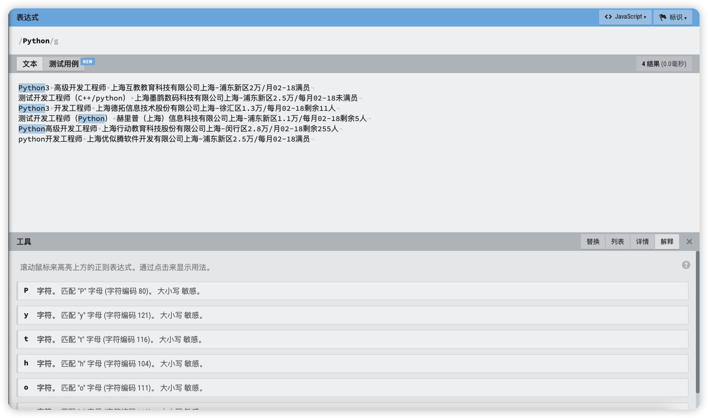
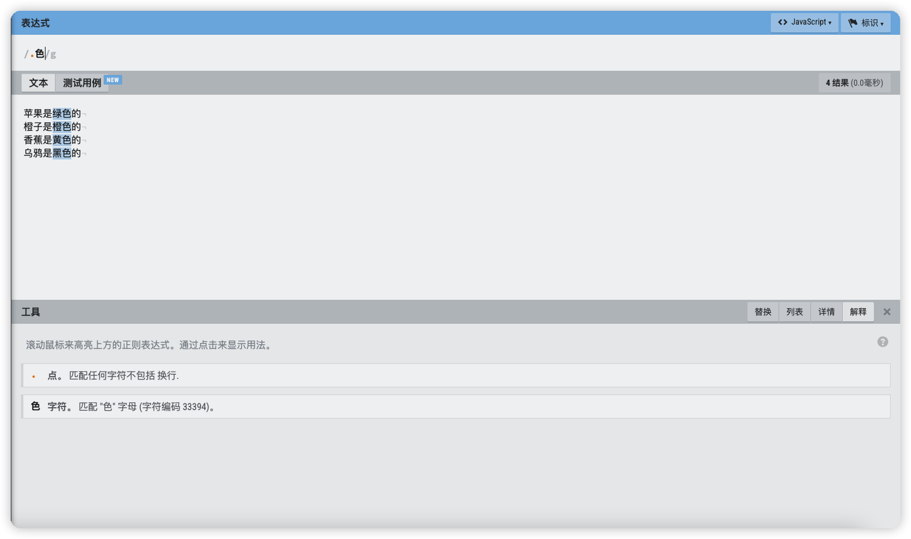
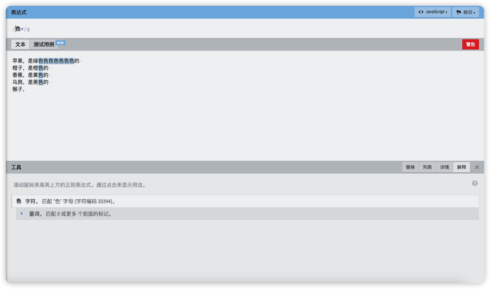
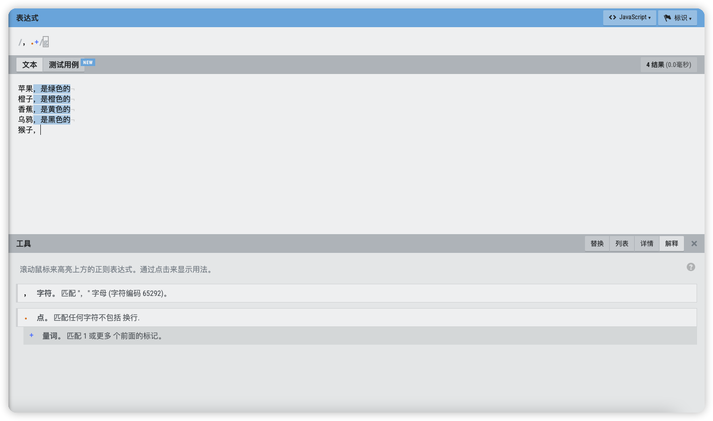
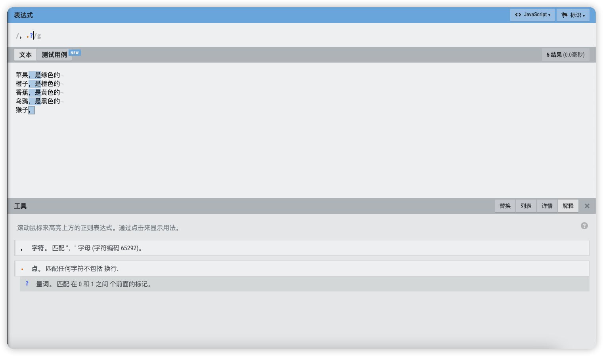
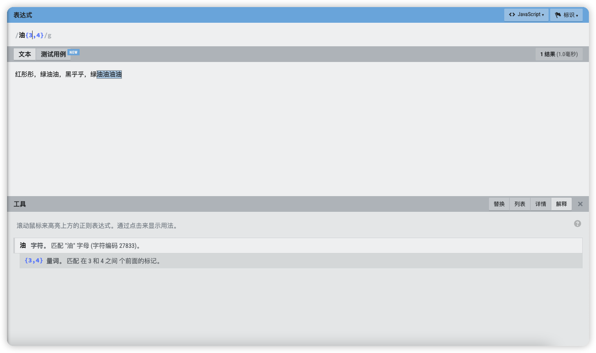
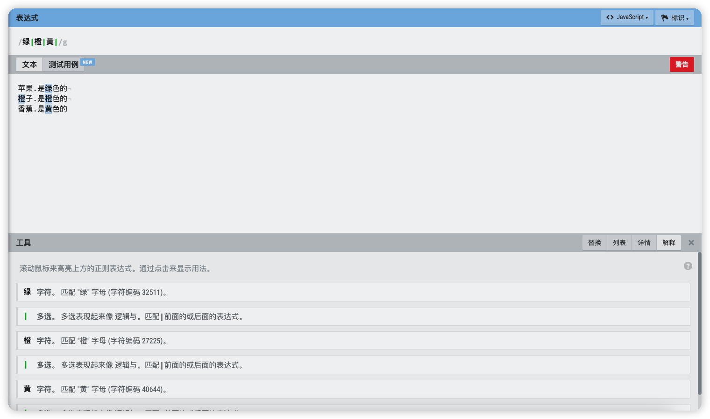

### 1.正则表达式的作用

##### 案例演示

先给大家看一个例子，在以下文本中存储了一些职位信息：

```txt
Python3 高级开发工程师 上海互教教育科技有限公司上海-浦东新区2万/月02-18满员
测试开发工程师（C++/python） 上海墨鹍数码科技有限公司上海-浦东新区2.5万/每月02-18未满员
Python3 开发工程师 上海德拓信息技术股份有限公司上海-徐汇区1.3万/每月02-18剩余11人
测试开发工程师（Python） 赫里普（上海）信息科技有限公司上海-浦东新区1.1万/每月02-18剩余5人
Python高级开发工程师 上海行动教育科技股份有限公司上海-闵行区2.8万/月02-18剩余255人
python开发工程师 上海优似腾软件开发有限公司上海-浦东新区2.5万/每月02-18满员
```

将文本中的薪资数据提取出来，只要包含数字就可以。

> 代码实现

```python
import re

content = '''
Python3 高级开发工程师 上海互教教育科技有限公司上海-浦东新区2万/月02-18满员
测试开发工程师（C++/python） 上海墨鹍数码科技有限公司上海-浦东新区2.5万/每月02-18未满员
Python3 开发工程师 上海德拓信息技术股份有限公司上海-徐汇区1.3万/每月02-18剩余11人
测试开发工程师（Python） 赫里普（上海）信息科技有限公司上海-浦东新区1.1万/每月02-18剩余5人
Python高级开发工程师 上海行动教育科技股份有限公司上海-闵行区2.8万/月02-18剩余255人
python开发工程师 上海优似腾软件开发有限公司上海-浦东新区2.5万/每月02-18满员
'''

for temp in re.findall(r'([\d.]+)万/每{0,1}月', content):
    print(temp)
```

通过以上代码就可以轻松的将文本中的数字提取出来，在`find_all`方法中的字符串其实就是正则表达式。观察当前方法返回的数据我们发现是一个列表。

### 2.正则表达式在线验证工具

工具链接地址：https://regexr-cn.com

在这个工具中我们可以快速验证自己编写的正则表达式是否存在语法错误。

### 3.常见语法

##### 普通字符匹配

可以在正则表达式中直接输入我们想要匹配的字符，如图所示：



当然直接查询汉字也是可以的。但是有些特殊字符不能直接匹配，这些特殊字符有专业术语：元字符。

元字符具有特殊含义，如下所示：

```txt
. * + ? \ [] ^ $ {} | ()
```

##### 通配符 - `.`

在以下文本中选出所有的颜色信息：

```txt
苹果是绿色的
橙子是橙色的
香蕉是黄色的
乌鸦是黑色的
```

在文本中找到以`色`结尾，并且包括前面一个字符的信息，那么正则表达式就可以写成：

```txt
.色
```

当前`.`代表任意字符，但是字符个数只有一个。`色`这个汉字代表以这个汉字结尾。



> 代码实现

```python
import re

content = '''
苹果是绿色的
橙子是橙色的
香蕉是黄色的
乌鸦是黑色的
'''


for temp in re.findall(r'.色', content):
    print(temp)
```

##### 重复匹配任意次数 - `*`

`*`表示匹配子表达式任意次，包括 0 次。

在以下文本中匹配逗号后面的字符串内容，包含逗号本身：文本中的逗号为中文。

```txt
苹果，是绿色的
橙子，是橙色的
香蕉，是黄色的
乌鸦，是黑色的
猴子，
```

表达式语法：

```txt
，.*
```

效果如下：


大家注意最后一行，猴子逗号后面没有其它字符了，但是\*表示可以匹配 0 次， 所以表达式也是成立的。

> 代码实现

```python
content = '''
苹果，是绿色的
橙子，是橙色的
香蕉，是黄色的
乌鸦，是黑色的
猴子，
'''

for temp in re.findall(r'，.*', content):
    print(temp)
```

`.*`在正则表达式中非常常见，表示匹配任意字符任意次数。当然，`*`前面不一定就是`.`，也可以是其他字符。



##### 重复匹配一次或多次 - `+`

`+`表示匹配前面的子表达式一次或多次，不包括 0 次。

以之前的文本为例，匹配所有逗号的内容，包含逗号。但是如果逗号后没有内容则不匹配。



表达式语法：

```txt
，.+
```

##### 匹配 0 次或者 1 次 - `?`

以之前的文本为例，在文本中匹配每行逗号后面的 1 个字符，也包含逗号本身。



表达式语法：

```txt
，.?
```

最后一行也可以正常匹配，原因是`?`表示可以匹配 1 次或者 0 次。

##### 匹配执行次数 - `{}`

`{}`表示指定字符匹配的次数。

测试文本：

```txt
红彤彤，绿油油，黑乎乎，绿油油油油
```

- 表达式`油{3}`就表示匹配连续的`油`字 3 次
- 表达式`油{3,4}`就表示匹配连续的`油`字至少 3 次，至多 4 次



##### 贪婪模式与非贪婪模式

将以下字符串中的所有`html`标签提取出来：

```html
<html>
  <head>
    <title>Title</title>
  </head>
</html>
```

根据之前所学习的内容，我们可以使用`<.*>`将标签进行匹配，代码如下：

```python
import re

source = '<html><head><title>Title</title>'


for temp in re.findall(r'<.*>', source):
    print(temp)
```

运行效果如下：

```txt
<html><head><title>Title</title>
```

当前结果将不是标签的数据也提取出来了。

> 解决方式

在正则表达式中，`*`、`+`等元字符都是贪婪的。使用它们时会尽可能匹配多的内容，所以在`<.*>`表达式中的`*`一直匹配到了字符串最后的`</title>`中的`e`，解决这个问题的方式就是将贪婪模式更改为非贪婪模式。在`*`后加上`?`。

语法如下：

```txt
<.*?>
```

代码实现：

```python
import re

source = '<html><head><title>Title</title>'


for temp in re.findall(r'<.*?>', source):
    print(temp)
```

##### 元字符转义

反斜杠`\`在正则表达式中有多重用途，例如在以下文本中搜索所有`.`之前的字符串，也包含`.`本身。

```txt
苹果.是绿色的
橙子.是橙色的
香蕉.是黄色的
```

如果我们将正则表达式写成：`.*.`，肯定是不正确的，因为`.`是一个元字符，具有特殊含义。直接出现在正则表达式中不能表示`.`这个字符本身。

解决方式：使用`\`转义。

`Python`程序如下：

```python
import re

content = '''
苹果.是绿色的
橙子.是橙色的
香蕉.是黄色的
'''

for temp in re.findall(r'.*\.', content):
    print(temp)
```

##### 匹配某种字符类型

在反斜杠后链接一些字符可以表示某种类型的一个字符。

- `\d`匹配 0-9 之间任意一个数字字符，等价于表达式：`[0-9]`

- `\D`匹配任意一个不是 0-9 之间的数字字符，等价于表达式：` [^0-9]`

- `\s`匹配任意一个空白字符，包括空格、`tab`、换行符等，等价于表达式：`[\t\n\r\f\v]`

- `\S`匹配任意一个非空白字符，等价于表达式：`[^\t\n\r\f\v]`

- `\w`匹配任意一个文字字符，包括大小写字母、数字、下划线，等价于表达式：`[a-zA-Z0-9_]`

- `\W`匹配任意一个非文字字符，等价于表达式：`[^a-zA-Z0-9_]`

反斜杠也可以用在方括号里面，比如`[\s,.]`表示匹配 ： 任何空白字符， 或者逗号，或者点

##### 使用中括号匹配指定字符范围 - `[]`

中括号表示要匹配的几个指定字符之一。

`[abc]`可以匹配`a、b、c`中任意一个字符，等价于：`[a-c]`

`[a-c]`中间的`-`表示范围从`a`到`c`，如果你想匹配所有的小写字母，可以使用：`[a-z]`

一些元字符在中括号内会失去特殊含义，和普通字符没有区别。例如：`[akm.]`，在当前正则中的`.`只是一个普通字符而已，并不表示匹配任意字符。

如果在中括号中使用`^`则表示**非**，不匹配在中括号中的字符集合。

```python
import re

content = 'a1b2c3d4e5'
for temp in re.findall(r'[^\d]', content):
    print(temp)

```

##### 起始结尾位置与单行多行模式

> 起始位置

`^`表示匹配文本的**开头**位置。在正则表达式中可以设置**单行模式**与**多行模式**。

- 单行模式：表示匹配整个文本的开头位置
- 多行模式：表示匹配文本每行的开头位置

在下面的文本中，每行最前面的数字表示水果的编号，最后的数字表示价格。

```txt
001-苹果价格-60
002-橙子价格-70
003-香蕉价格-80
```

如果我们要提取所有的水果编号，用这样的正则表达式：`^\d+`

代码示例：

```python
import re

content = '''001-苹果价格-60
002-橙子价格-70
003-香蕉价格-80
'''


for temp in re.findall(r'^\d+', content, re.M):
    print(temp)
```

在以上代码的`find_all`方法中，第三个参数`re.M`表示使用多行模式。

运行结果如下：

```txt
001
002
003
```

如果去掉第三个参数则运行结果如下：

```txt
001
```

> 结尾位置

`$`表示匹配文本的`结尾`位置。

将之前文本中所有的水果价格提取出来，可以使用这样的表达式：`\d+$`

注意：在结尾匹配也有单行与多行的区别。

代码示例：

```python
import re

content = '''001-苹果价格-60
002-橙子价格-70
003-香蕉价格-80
'''


for temp in re.findall(r'\d+$', content, re.M):
    print(temp)
```

运行结果如下：

```txt
60
70
80
```

如果将`re.MULTILINE`去掉则只能匹配最后一行。

结果如下：

```txt
80
```

单行模式下，`$`只会匹配整个文本的结束位置。

##### 匹配指定多个字符中的其中之一 - `|`

竖线表示匹配其中之一，示例如下：



特别要注意的是竖线在正则表达式的优先级是最低的，这就意味着竖线隔开的部分是一个整体。比如`绿色|橙`表示要匹配是 `绿色`或者`橙` ，而不是`绿色`或者`绿橙`。

##### 分组 - `()`

小括号是正则表达式的组选择。`组`就是把正则表达式匹配的内容中的一部分标记为某个组。

我们可以在正则表达式中标记多个`组`。

使用之前的文本案例，从以下文本中提取逗号前面的字符串，包含逗号。

```txt
苹果，苹果是绿色的
橙子，橙子是橙色的
香蕉，香蕉是黄色的
```

以上案例可以使用：`^.*，`来完成，但是如果要求不要包含逗号呢？可能有同学会写成：`^.*`来完成，这种写法无法满足需求，因为逗号是结尾特征。

> 解决方式

使用小括号分组，并去除逗号。

语法示例：

```txt
^(.*)，
```

`Python`代码如下：

```python
import re

content = '''苹果，苹果是绿色的
橙子，橙子是橙色的
香蕉，香蕉是黄色的'''

for temp in re.findall(r'^(.*)，', content, re.M):
    print(temp)
```

`分组`还可以多次使用，例如在以下文本中提取每个人的名字以及对应的手机号：

```txt
张三，手机号码15945678901
李四，手机号码13945677701
王二，手机号码13845666901
```

代码如下：

```python
import re

content = '''张三，手机号码15945678901
李四，手机号码13945677701
王二，手机号码13845666901'''


for temp in re.findall(r'^(.+)，.+(\d{11})', content, re.M):
    print(temp)
```

当有多个分组的时候可以使用`(?P<分组名称>...)`这样的格式给每个分组命名，这样做的好处是方便之后的代码提取每个指定分组中的内容。

```python
import re

content = '''张三，手机号码15945678901
李四，手机号码13945677701
王二，手机号码13845666901'''


for temp in re.finditer(r'^(?P<user_name>.+)，.+(?P<mobile>\d{11})', content, re.M):
    print(temp.group('user_name'), temp.group('mobile'))
```

##### `DOTALL`参数 - 标记允许点号匹配所有字符

`DOTALL`标记允许点号匹配所有字符，包括换行符。这对于需要处理包含换行符的文本时非常有用，因为默认情况下点号无法匹配换行符。

> 需求解决

在以下`html`代码中提取所有的职位名称：

```html
<div class="el">
  <p class="t1">
    <span>
      <a>Python开发工程师</a>
    </span>
  </p>
  <span class="t2">南京</span>
  <span class="t3">1.5-2万/月</span>
</div>
<div class="el">
  <p class="t1">
    <span>
      <a>java开发工程师</a>
    </span>
  </p>
  <span class="t2">苏州</span>
  <span class="t3">1.5-2/月</span>
</div>
```

如果直接使用表达式`class=\"t1\">.*?<a>(.*?)</a>`会发现匹配不上，因为`t1`和`<a>`之间有两个空行，这时就需要`.`匹配所有字符了。

代码示例：

```python
import re

content = '''
<div class="el">
        <p class="t1">
            <span>
                <a>Python开发工程师</a>
            </span>
        </p>
        <span class="t2">南京</span>
        <span class="t3">1.5-2万/月</span>
</div>
<div class="el">
        <p class="t1">
            <span>
                <a>java开发工程师</a>
            </span>
		</p>
        <span class="t2">苏州</span>
        <span class="t3">1.5-2/月</span>
</div>
'''


for temp in re.findall(r'class=\"t1\">.*?<a>(.*?)</a>', content, re.DOTALL):
    print(temp)
```

### 4.常用字符串处理方式

##### 正则字符串切割

> `Python`中的字符串切割

字符串对象中的`split`方法只适用于简单的字符串切割，有时你需要更加灵活的字符串切割。

在以下字符串中提取武将名称：

```python
names = '关羽; 张飞, 赵云,马超, 黄忠  李逵'
```

我们发现这些名字之间有些是`;`分割，有些是`,`分割，还有一些是空格分割，并且空格数量是不一致的。这时使用字符串对象中的分割方法不好处理。

> 正则表达式中的`split`方法

使用`re.split`方法完成字符串提取：

```python
import re

names = '关羽; 张飞, 赵云,   马超, 黄忠  李逵'

name_list = re.split(r'[;,\s]\s*', names)
print(name_list)
```

##### 字符串替换

> 匹配模式替换

字符串对象中的`replace`方法只适应于简单的替换，有时你需要更加灵活的字符串替换。

比如我们需要在以下文本中找到所有以`av`开头的所有链接：`\avxxxxxx\`，然后将这些字符串替换为`/cn345677/`。

```python
html_obj = '''

下面是这学期要学习的课程：

<a href='https://www.bilibili.com/video/av66771949/?p=1' target='_blank'>点击这里，边看视频讲解，边学习以下内容</a>
这节讲的是牛顿第2运动定律

<a href='https://www.bilibili.com/video/av46349552/?p=125' target='_blank'>点击这里，边看视频讲解，边学习以下内容</a>
这节讲的是毕达哥拉斯公式

<a href='https://www.bilibili.com/video/av90571967/?p=33' target='_blank'>点击这里，边看视频讲解，边学习以下内容</a>
这节讲的是切割磁力线
'''
```

被替换的内容不是固定的，所以无法使用字符串中的`replace`方法。

> 使用正则表达式中的`sub`方法

```python
import re

html_obj = '''

下面是这学期要学习的课程：

<a href='https://www.bilibili.com/video/av66771949/?p=1' target='_blank'>点击这里，边看视频讲解，边学习以下内容</a>
这节讲的是牛顿第2运动定律

<a href='https://www.bilibili.com/video/av46349552/?p=125' target='_blank'>点击这里，边看视频讲解，边学习以下内容</a>
这节讲的是毕达哥拉斯公式

<a href='https://www.bilibili.com/video/av90571967/?p=33' target='_blank'>点击这里，边看视频讲解，边学习以下内容</a>
这节讲的是切割磁力线
'''

data = re.sub(r'/av\d+/', '/cn345677/', html_obj)
print(data)
```

`sub`方法是正则表达式中的替换方法，替换的内容是用正则表达式匹配出来的内容。

当前第一个参数`r'/av\d+/'`是一个正则表达式，表示以`/av`开头，后面是一串数字，在以`/`结尾的这种特征的字符串是需要被替换的。

第二个参数`/cn345677/`是替换的结果。

第三个参数是原来的字符串。

> 指定替换函数

在刚刚的例子中，我们用来替换的是一个固定的字符串`/cn345677/`。如果我们要求替换的内容是原来的数字加上数字`6`的结果，例如：`/av66771949/`替换为`/av66771955/`。如何实现？

这种更加复杂的替换，我们可以把`sub`中的第二个参数指定为一个函数，该函数的返回值就是用来替换的字符串。

代码如下：

```python
import re

names = '''

下面是这学期要学习的课程：

<a href='https://www.bilibili.com/video/av66771949/?p=1' target='_blank'>点击这里，边看视频讲解，边学习以下内容</a>
这节讲的是牛顿第2运动定律

<a href='https://www.bilibili.com/video/av46349552/?p=125' target='_blank'>点击这里，边看视频讲解，边学习以下内容</a>
这节讲的是毕达哥拉斯公式

<a href='https://www.bilibili.com/video/av90571967/?p=33' target='_blank'>点击这里，边看视频讲解，边学习以下内容</a>
这节讲的是切割磁力线
'''


# 替换函数，参数是Match对象
def sub_func(match):
    # Match对象的group(0)返回的是整个匹配上的字符串，
    src = match.group(0)

    # Match对象的group(1)返回的是第一个group分组的内容
    number = int(match.group(1)) + 6
    dest = f'/av{number}/'

    print(f'{src} 替换为 {dest}')

    # 返回值就是最终替换的字符串
    return dest


data = re.sub(r'/av(\d+)/', sub_func, names)
print(data)

```
