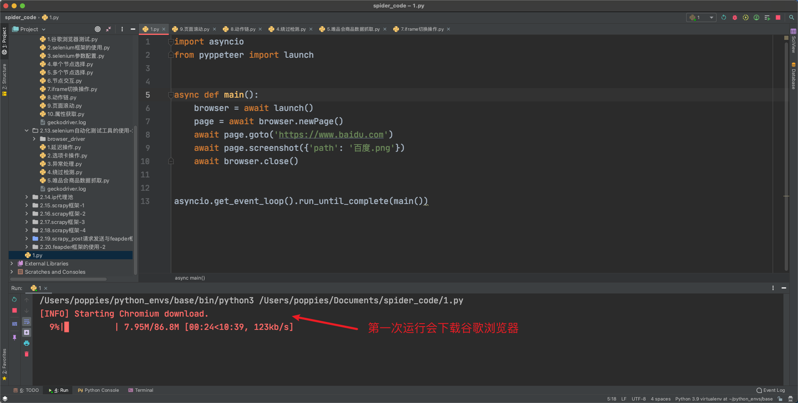

### 1.本章介绍

有很多网站，例如淘宝，它上面的很多页面 的数据是由`JavaScript`生成的，而不是原始`HTML`代码，而且还有很多`ajax`获取的数据，甚至有些数据是加密的，导致，当我们使用普通的`requests`来处理时，需要分析很多的`js`代码，此时非常困难，所以我们就用`Selenium`来解决。

##### 什么是`Selenium`

`Selenium`是一个`Web`的自动化测试工具，最初是为网站自动化测试而开发的，利用它可以控制浏览器执行特定的动作，例如点击、下拉、输入内容等

官方网站：https://www.seleniumhq.org/

中文参考网址：http://www.selenium.org.cn/

其他参考网址：https://selenium-python.readthedocs.io/

##### 环境配置

安装命令：

```python
# 在安装过程中最好限定框架版本为4.9.1
pip install selenium==4.9.1 -i https://pypi.tuna.tsinghua.edu.cn/simple
```

安装完 selenium 后，还需要安装使用 selenium 控制的浏览器需要的驱动。

谷歌驱动下载地址：https://googlechromelabs.github.io/chrome-for-testing/#stable

驱动下载完成后将文件移动到系统环境变量中：

- `MacOS`：将文件移动到`/usr/local/bin`目录
- `Windows`：将文件移动到`miniconda3`安装目录

编写以下代码，验证是否能正常运行：

```python
from selenium import webdriver


browser = webdriver.Chrome()
```

如果可以正常打开浏览器则配置成功。

除了可以配置谷歌浏览器之外也可以配置火狐浏览器，配置方式与谷歌浏览器大致相同。

火狐驱动下载地址：https://github.com/mozilla/geckodriver/releases

### 2.基本使用

##### 加载网页

```python
from selenium import webdriver

# 获取要操作的浏览器驱动对象（直白点说，这个对象可以控制浏览器）
browser = webdriver.Chrome()

# 加载指定的页面
browser.get("http://www.baidu.com")

# 截屏
browser.save_screenshot("百度首页.png")
```

##### 定位与操作

```python
import time
from selenium import webdriver

# 获取要操作的浏览器驱动对象
browser = webdriver.Chrome()

# 加载指定的页面
browser.get("http://www.baidu.com")

# 获取指定的元素
browser.find_element_by_id("kw").send_keys("python")

# 延时，以便看清楚要进行的操作
time.sleep(2)

# 点击 "百度一下"
browser.find_element_by_id("su").click()
```

##### 查看请求信息

```python
import time
from selenium import webdriver

# 获取要操作的浏览器驱动对象
browser = webdriver.Chrome()

# 加载指定的页面
browser.get("http://www.baidu.com")

# 查看访问的页面的源代码
print(browser.page_source)

# 查看cookie
print(browser.get_cookies())

# 查看经过处理之后，本页面最后显示的url，如果有302的话，那么就是302之后的url
print(browser.current_url)
```

##### 打开新页面

```python
import time

from selenium import webdriver

# 创建浏览器
browser = webdriver.Chrome()

# 打开百度
browser.get("http://www.baidu.com")

time.sleep(3)

# 打开京东
browser.get("https://jd.com")
time.sleep(3)

# 关闭
browser.close()
```

##### 通过`js`脚本打开新标签页

```python
from selenium import webdriver
import time

# 方式1：通过执行js打开新的标签页
browser = webdriver.Chrome()

# 打开淘宝
browser.get("http://login.taobao.com")

time.sleep(3)

# 打开搜狗
js = "window.open('http://www.sogou.com')"
browser.execute_script(js)
```

##### 切换标签页

```python
from selenium import webdriver
import time

# 方式1：通过执行js打开新的标签页
browser = webdriver.Chrome()

# 打开淘宝
browser.get("http://login.taobao.com")

time.sleep(3)

# 打开搜狗
js = "window.open('http://www.sogou.com')"
browser.execute_script(js)

time.sleep(3)

# 切换到第1个标签页
browser.switch_to.window(browser.window_handles[0])
time.sleep(1)

browser.switch_to.window(browser.window_handles[1])
time.sleep(1)

# 关闭第2个标签页
browser.close()

time.sleep(1)

# 切换到第1个标签页
browser.switch_to.window(browser.window_handles[0])
# 关闭第1个标签页
browser.close()
```

##### 退出

```python
import time

from selenium import webdriver

# 获取要操作的浏览器驱动对象
browser = webdriver.Chrome()

# 加载指定的页面
browser.get("http://www.baidu.com")

# 为了演示，浏览器打开后关闭的效果，要先延时一会
time.sleep(3)

# 关闭当前页面（当浏览器只有1个页面时，此操作会让浏览器退出）
browser.close()

# 让浏览器退出(如果用selenium打开了很多)
browser.quit()
```

### 3.元素定位方法

##### 元素定位的基本使用方式

在定位元素时，需要借助`selenium`框架提供的定位工具来进行元素定位。元素定位工具导入路径如下：

```python
from selenium.webdriver.common.by import By
```

为了能够点击某个按钮，此时我们就需要准确无误的定位到需要的元素。元素定位主要分为以下两种：

- 单个节点（返回是一个对象）
  - `find_element(By.ID, '定位规则')`
  - `find_element(By.NAME, '定位规则')`
  - `find_element(By.XPATH, '定位规则')`
  - `find_element(By.LINK_TEXT, '定位规则')`
  - `find_element(By.PARTIAL_LINK_TEXT, '定位规则')`
  - `find_element(By.TAG_NAME, '定位规则')`
  - `find_element(By.CLASS_NAME, '定位规则')`
  - `find_element(By.CSS_SELECTOR, '定位规则')`
- 多个节点（返回是一个列表）
  - `find_elements(By.ID, '定位规则')`
  - `find_elements(By.NAME, '定位规则')`
  - `find_elements(By.XPATH, '定位规则')`
  - `find_elements(By.LINK_TEXT, '定位规则')`
  - `find_elements(By.PARTIAL_LINK_TEXT, '定位规则')`
  - `find_elements(By.TAG_NAME, '定位规则')`
  - `find_elements(By.CLASS_NAME, '定位规则')`
  - `find_elements(By.CSS_SELECTOR, '定位规则')`

##### 案例：获取单个节点

```python
import time
from selenium import webdriver
from selenium.webdriver.common.by import By

# 获取浏览器驱动对象
browser = webdriver.Chrome()

# 打开指定URL
browser.get('http://news.baidu.com/')

# 定位搜索框
ret = browser.find_element(By.ID, 'ww')
# ret = browser.find_element(By.CSS_SELECTOR, '#ww')  # 查询id为ww
# ret = browser.find_element(By.CSS_SELECTOR, '.word')  # 查询class为word
# ret = browser.find_element(By.XPATH, "//input[@class='word']")
print(ret)

time.sleep(3)
browser.quit()
```

##### 案例：获取多个节点

```python
import time
from selenium import webdriver
from selenium.webdriver.common.by import By


# 获取浏览器驱动对象
browser = webdriver.Chrome()

# 打开指定URL
browser.get('https://movie.douban.com/top250')

# 定位25个电影信息
ret = browser.find_elements(By.CSS_SELECTOR, '.item')  # 查询class为item
print(ret)

ret = browser.find_elements(By.XPATH, "//*[@class='item']")
print(ret)

time.sleep(3)
browser.quit()
```

##### 注意点

`find_element`和`find_elements`的区别是：前者返回一个对象，后者返回一个列表

`by_link_text`和`by_partial_link_text`的区别：前者匹配全部文本，后者包含某个文本

### 4.`Selenium`框架的其他方法

##### 提取标签内容与属性值

`find_element`仅仅能够获取元素，不能够直接获取其中的数据，如果需要获取数据需要使用以下方法：

- 获取文本：`element.text`
- 获取属性值：`element.get_attribute("href")`

```python
import time
from selenium import webdriver
from selenium.webdriver.common.by import By


# 获取浏览器驱动对象
browser = webdriver.Chrome()

# 打开指定URL
browser.get('https://www.douban.com')

# 定位h1标签
ret = browser.find_elements(By.TAG_NAME, "h1")
print(ret[0].text)
# 输出：豆瓣

ret = browser.find_elements(By.LINK_TEXT, "下载豆瓣 App")
print(ret[0].get_attribute("href"))
# 输出：https://www.douban.com/doubanapp/app?channel=nimingye

time.sleep(3)
browser.quit()
```

##### 处理`cookie`

通过`driver.get_cookies()`能够获取所有的`cookie`

> `cookie`转`dict`

```python
from selenium import webdriver

browser = webdriver.Chrome()
browser.get("http://www.baidu.com")

cookie_list = browser.get_cookies()
print(cookie_list)

# 整理为requests等需要的字典方式，因为浏览器在发送新请求时携带的cookie只有name、value
# 所以此时提取的也只有name、value，其他的不需要
cookie_dict = {x["name"]: x["value"] for x in cookie_list}
print(cookie_dict)

# 关闭页面
browser.close()
```

> 删除`cookie`

```python
# 删除一条cookie
browser.delete_cookie("CookieName")
# 删除所有的cookie
browser.delete_all_cookies()
```

> 添加`cookie`

```python
# 添加cookie
browser.add_cookie({"name":"安娜", "address":"长沙"})
```

##### 页面等待

如果网站采用了动态`html`技术，那么页面上的部分元素出现时间便不能确定，这个时候就可以设置一个等待时间，强制要求在时间内出现，否则报错。

> 获取京东网站的搜索输入框

```python
import time
from selenium import webdriver
from selenium.webdriver.support.ui import WebDriverWait
from selenium.webdriver.support import expected_conditions as EC
from selenium.webdriver.common.by import By

# 创建浏览器驱动对象
browser = webdriver.Chrome()

# 创建等待操作对象
wait_ob = WebDriverWait(browser, 10)

# 加载url
browser.get("http://jd.com")

# 等待条件到来
search_input = wait_ob.until(EC.presence_of_element_located((By.ID, 'key')))

print(search_input)

# 输入内容
search_input.send_keys("Mac Pro")

# 点击查询
search_button = wait_ob.until(EC.presence_of_element_located((By.XPATH, "//div[@class='form']/button[@class='button']")))
search_button.click()

# 延时等待以便于观察页面变化
time.sleep(5)

# 退出
browser.quit()
```

##### 页面的前进与后退

```python
import time
from selenium import webdriver


browser = webdriver.Chrome()
browser.get("http://jd.com")

time.sleep(2)
browser.get("http://ganji.com")
time.sleep(2)

# 后退
browser.back()
time.sleep(1)

# 前进
browser.forward()

time.sleep(1)
browser.quit()

```

##### 案例：登录网易邮箱

```python
import time
from selenium import webdriver
from selenium.webdriver.common.by import By


class WyMail:
    def __init__(self):
        self.driver = webdriver.Chrome()

    def open_email(self, url):
        self.driver.get(url)
        time.sleep(1)

    def login_email(self, email, password):
        iframe = self.driver.find_element(By.XPATH, '//div[@id="loginDiv"]/iframe[@scrolling = "no"]')

        # 登录表单为一个子页面, 需要切入到当前这个子页面中
        self.driver.switch_to.frame(iframe)

        self.driver.find_element(By.XPATH, '//input[@name="email"]').send_keys(email)
        self.driver.find_element(By.XPATH, '//div[@class="u-input box"]//input[@name="password"]').send_keys(password)

        self.driver.find_element(By.XPATH, './/*[@id="dologin"]').click()

    def close(self):
        time.sleep(10)
        self.driver.quit()


if __name__ == '__main__':
    email = WyMail()
    email.open_email('https://mail.163.com/')
    email.login_email('wt_poppies@163.com', 'wt199486')
    email.close()
```

##### 页面滚动

大部分网站数据是动态数据，需要触发`ajax`请求后才能在页面中进行数据渲染，触发`ajax`请求的方式之一就是页面滑动，例如爱奇艺、今日头条等网站。

> 使用方式

```python
import time
from selenium import webdriver


browser = webdriver.Chrome()
browser.get('https://36kr.com/')


for num in range(1, 10):
    # 绝对位置
    # browser.execute_script(f'window.scrollTo(0, {num * 700})')

    # 相对位置
    browser.execute_script(f'window.scrollBy(0, {num * 700})')
    time.sleep(1)
```

##### 绕过检测

在一些网站当中有专门对浏览器驱动程序进行检测，例如：https://bot.sannysoft.com/

我们可以谷歌浏览器配置项来隐藏浏览器驱动信息，代码如下：

```python
import time
from selenium import webdriver


# 创建浏览器配置对象
options = webdriver.ChromeOptions()
options.add_argument('--disable-blink-features=AutomationControlled')

browser = webdriver.Chrome(options=options)

browser.get('https://bot.sannysoft.com/')
time.sleep(10)
browser.quit()
```

##### 浏览器信息配置

```python
import time
from selenium import webdriver


# 浏览器配置加载
options = webdriver.ChromeOptions()

# 禁止图片加载
prefs = {"profile.managed_default_content_settings.images": 2}
options.add_experimental_option('prefs', prefs)

# 设置UA
user_agent = 'abc'
options.add_argument(f'user-agent={user_agent}')

# 隐藏开发者警告
options.add_experimental_option('useAutomationExtension', False)
options.add_experimental_option('excludeSwitches', ['enable-automation'])

# 设置代理
options.add_argument("--proxy-server=http://127.0.0.1:7890")


# 初始化浏览器对象并加载自定义配置
browser = webdriver.Chrome(options=options)
browser.get('https://www.baidu.com')

# 程序休眠以便观察浏览器中的参数设置
time.sleep(100)
```

##### 动作链

在`selenium`中，动作链是一种用于模拟用户交互的技术。它允许你执行一系列连续的动作，例如鼠标移动、鼠标点击、按键操作等。通过使用动作链，你可以模拟用户在网页上的复杂交互操作，例如拖拽元素、悬停、双击等。

```python
from selenium import webdriver
from selenium.webdriver.common.by import By
from selenium.webdriver import ActionChains

browser = webdriver.Chrome()
url = 'http://www.runoob.com/try/try.php?filename=jqueryui-api-droppable'
browser.get(url)
log = browser.find_element(By.XPATH, '//div[@id="iframewrapper"]/iframe')
browser.switch_to.frame(log)
source = browser.find_element(By.CSS_SELECTOR, '#draggable')
target = browser.find_element(By.CSS_SELECTOR, '#droppable')
actions = ActionChains(browser)
actions.drag_and_drop(source, target)
actions.perform()
```

##### `selenium`中的异常处理

在`selenium`框架中自定义了一些异常类，可以使用框架定义的异常类进行异常捕获。

```python
from selenium import webdriver
from selenium.webdriver.common.by import By
from selenium.common.exceptions import TimeoutException, NoSuchElementException

browser = webdriver.Chrome()
try:
    browser.get('https://www.baidu.com')
except TimeoutException:
    print('Time Out')
    browser.close()


try:
    browser.find_element(By.ID, 'hello')
except NoSuchElementException:
    print('No Element')
finally:
    browser.close()
```

### 5.项目实战

##### 案例：唯品会商品数据抓取

```python
import time
from random import randint
from pymongo import MongoClient
from selenium import webdriver
from selenium.webdriver.common.by import By
from selenium.webdriver.support.ui import WebDriverWait
from selenium.webdriver.support import expected_conditions as EC


class WpShop:
    mongo_client = MongoClient()
    collection = mongo_client['py_spider']['wp_shop']

    # 创建浏览器配置对象
    options = webdriver.ChromeOptions()
    # 屏蔽图片
    prefs = {"profile.managed_default_content_settings.images": 2}
    options.add_experimental_option('prefs', prefs)

    # 驱动配置
    browser = webdriver.Chrome(options=options)

    # 获取唯品会首页并搜索指定商品
    @classmethod
    def base(cls):
        cls.browser.get('https://www.vip.com')
        wait = WebDriverWait(cls.browser, 10)
        el_input = wait.until(EC.presence_of_element_located(
            (By.XPATH, "//input[@class='c-search-input  J-search-input']")
        ))
        el_input.send_keys('电脑')

        el_button = wait.until(EC.presence_of_element_located(
            (By.XPATH, "//a[@class='c-search-button  J-search-button  J_fake_a']")
        ))
        time.sleep(2)
        el_button.click()
        # 当前页面成功获取之后建议延迟 1-3秒 让浏览器滚动
        time.sleep(randint(1, 3))

    # 页面滚动
    @classmethod
    def drop_down(cls):
        for i in range(1, 12):
            js_code = f'document.documentElement.scrollTop = {i * 1000}'
            cls.browser.execute_script(js_code)
            time.sleep(randint(1, 2))

    # 数据提取
    @classmethod
    def parse_data(cls):
        cls.drop_down()
        div_list = cls.browser.find_elements(
            By.XPATH,
            '//section[@id="J_searchCatList"]/div[@class="c-goods-item  J-goods-item c-goods-item--auto-width"]'
        )

        for div in div_list:
            price = div.find_element(
                By.XPATH,
                './/div[@class="c-goods-item__sale-price J-goods-item__sale-price"]'
            ).text

            title = div.find_element(
                By.XPATH,
                './/div[2]/div[2]'
            ).text

            item = {
                'title': title,
                'price': price
            }
            print(item)
            cls.save_mongo(item)
        cls.next_page()  # 当前页面获取完成之后需要点击下一页

    # 数据保存
    @classmethod
    def save_mongo(cls, item):
        cls.collection.insert_one(item)

    # 翻页
    @classmethod
    def next_page(cls):
        try:
            next_button = cls.browser.find_element(By.XPATH, '//*[@id="J_nextPage_link"]')
            if next_button:
                next_button.click()
                cls.parse_data()  # 进入到下一页需要重新解析页面数据
            else:
                cls.browser.close()
        except Exception as e:
            print('最后一页: ', e)
            cls.browser.quit()

    # 启动函数
    @classmethod
    def main(cls):
        cls.base()
        cls.parse_data()


if __name__ == '__main__':
    WpShop.main()
```

### 6.`Pyppeteer`框架的基本使用

在本章课程中已经重点学习了`Selenium`自动化测试框架，在使用过程中我们发现这款框架的效率不高，对浏览器版本有一定的要求，需要根据浏览器版本下载对应的浏览器驱动。

为了解决这个问题，我们可以使用另外一款自动化测试框架：`Pyppeteer`

##### 框架特点以及环境配置

- 支持`chromium`浏览器
- 支持`asyncio`

`Chromium`是一款独立的浏览器，是`Google`为发展自家的浏览器`Google Chrome`而开启的计划，相当于`Chrome`的实验版，且`Chromium`是完全开源的。二者基于相同的源代码构建，`Chrome`所有的新功能都会先在`Chromium`上实现，待验证稳定后才会移植，因此`Chromium`的版本更新频率更高，也会包含很多新的功能，但作为一款独立的浏览器，`Chromium`的用户群体要小众得多。两款浏览器"同根同源"，它们有着同样的`Logo`，但配色不同，`Chrome`由蓝红绿黄四种颜色组成，而 `Chromium`由不同深度的蓝色构成。

> 框架安装

```txt
 pip install pyppeteer -i https://pypi.tuna.tsinghua.edu.cn/simple
```

当前框架无需配置浏览器驱动，第一次启动会自动下载`Chromium`浏览器。



##### 基本使用

> 打开百度首页并截图

```python
import asyncio
from pyppeteer import launch


async def main():
    browser = await launch()
    page = await browser.newPage()
    await page.goto('https://www.baidu.com')
    await page.screenshot({'path': '百度.png'})
    await browser.close()


asyncio.get_event_loop().run_until_complete(main())
```

> 打开浏览器界面

```python
import asyncio
from pyppeteer import launch


async def main():
    browser = await launch({"headless": False})
    page = await browser.newPage()
    await page.goto('https://www.baidu.com')
    await page.screenshot({'path': '百度.png'})
    await browser.close()


asyncio.get_event_loop().run_until_complete(main())
```

> 调整窗口大小

```python
import asyncio
from pyppeteer import launch


# 要设置显示内容的宽度、高度
width, height = 1366, 768


async def main():
    browser = await launch(headless=False, args=['--disable-infobars', f'--window-size={width},{height}'])
    page = await browser.newPage()
    await page.setViewport({'width': width, 'height': height})
    await page.goto('https://www.baidu.com')
    await asyncio.sleep(100)


asyncio.get_event_loop().run_until_complete(main())
```

> 绕过检测

```python
import asyncio
from pyppeteer import launch

width, height = 1366, 768


async def main():
    browser = await launch(headless=False, args=['--disable-infobars', f'--window-size={width},{height}'])
    page = await browser.newPage()
    await page.setViewport({'width': width, 'height': height})
    await page.goto('https://kyfw.12306.cn/otn/resources/login.html')

    # 一些网站主要通过window.navigator.webdriver来对webdriver进行检测，所以我们只需要使用JavaScript将它设置为false即可
    await page.evaluate('''() =>{ Object.defineProperties(navigator,{ webdriver:{ get: () => false } }) }''')
    await asyncio.sleep(5)


asyncio.get_event_loop().run_until_complete(main())
```
