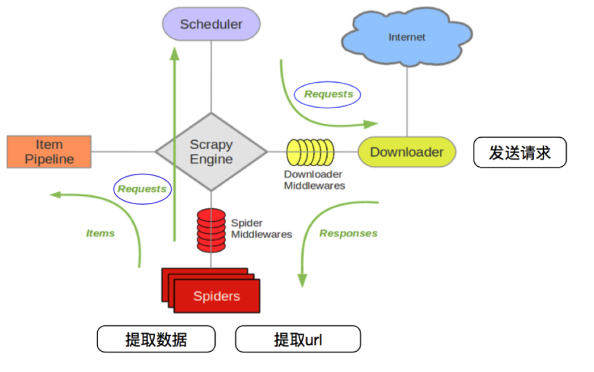
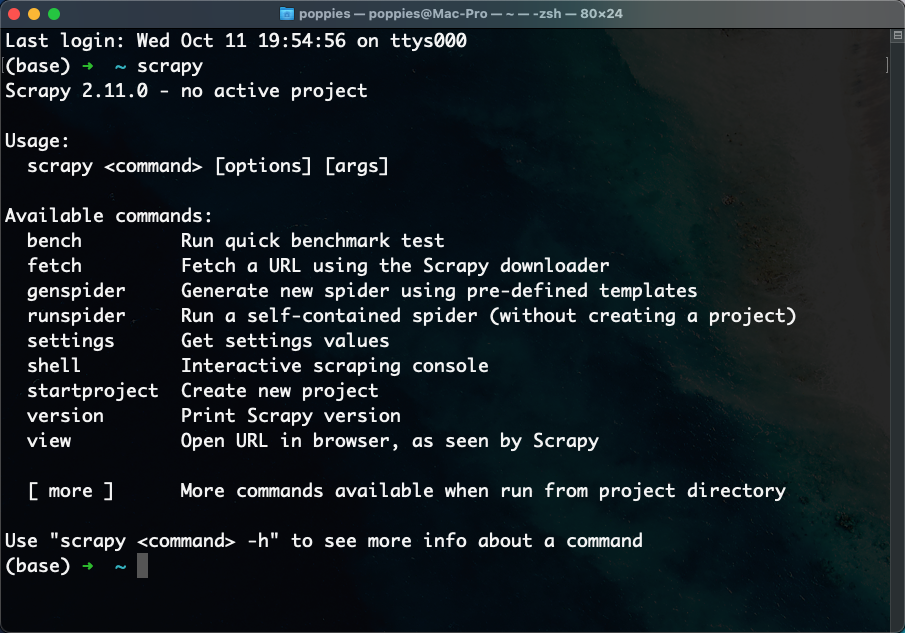
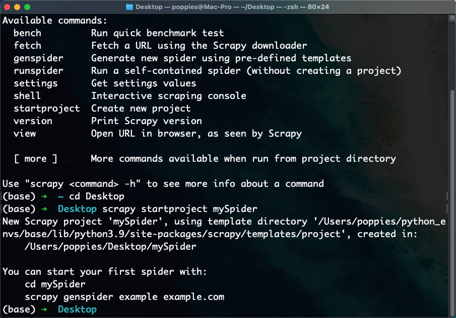
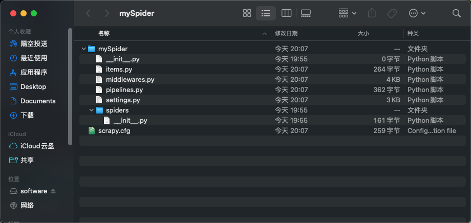
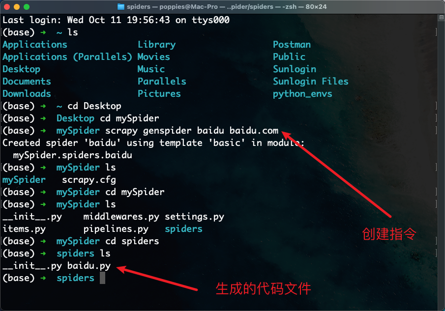
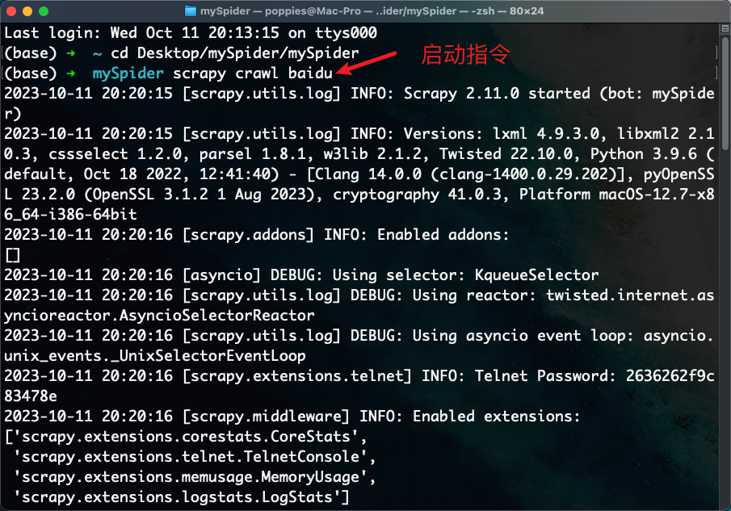
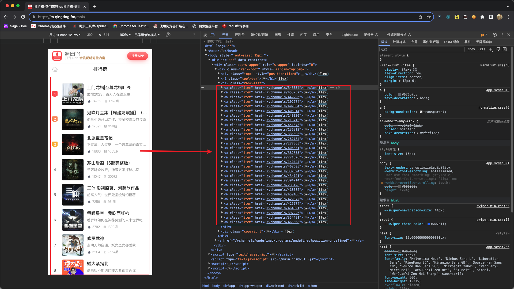
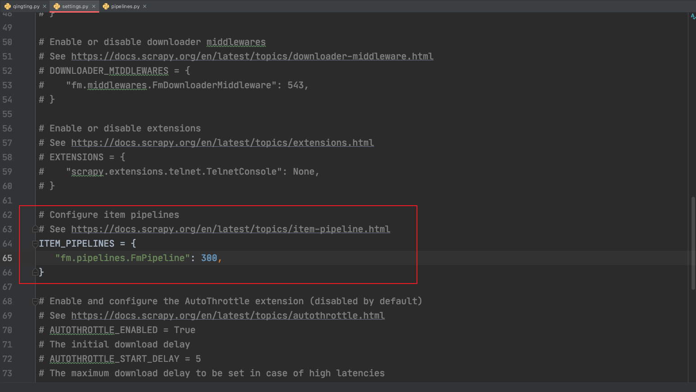
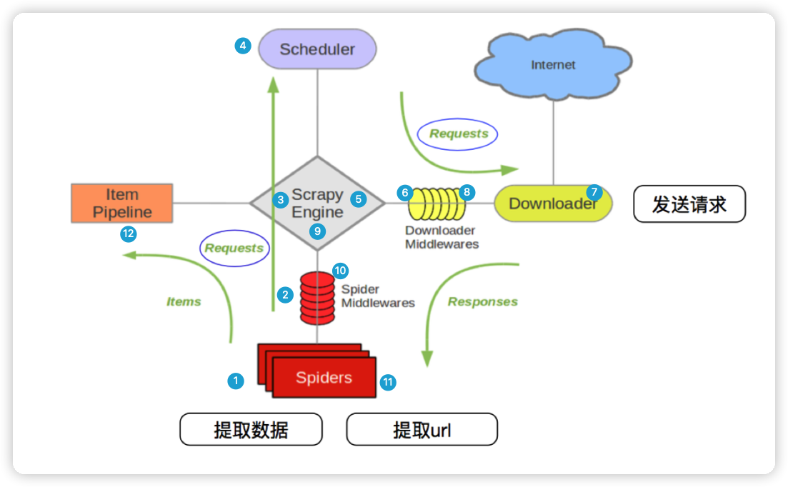

### 1.`Scrapy`框架的概念与执行流程

##### 学习`Scrapy`的原因

1. `Scrapy`不能解决剩下的10%的爬虫需求
2. 能够让开发过程方便、快速
3. `Scrapy`框架能够让我们的爬虫效率更高


##### 什么是`Scrapy`

文档地址：

- 2.5 中文版：https://www.osgeo.cn/scrapy/intro/install.html

- 最新版（英文）：https://docs.scrapy.org/en/latest/index.html

`Scrapy`使用了`Twisted['twɪstɪd]`异步网络框架，可以加快我们的下载速度。

`Scrapy`是一个为了爬取网站数据，提取结构性数据而编写的应用框架，我们只需要实现少量的代码，就能够快速的抓取。


> 异步与非阻塞的区别

前面我们说`Twisted`是一个异步的网络框架，经常我们也听到一个词语叫做非阻塞，那么他们有什么区别呢？


异步：调用在发出之后，这个调用就直接返回，不管有无结果；异步是过程。

非阻塞：关注的是程序在等待调用结果（消息，返回值）时的状态，指在不能立刻得到结果之前，该调用不会阻塞当前线程。


##### `Scrapy`的工作流程

之前爬虫的工作流程：


上面的流程可以改写成以下结构：


`Scrapy`框架的执行流程：




##### 流程描述

1. 爬虫中起始的`url`构造成`request`对象-->爬虫中间件-->引擎-->调度器
2. 调度器把`request`-->引擎-->下载中间件-->下载器
3. 下载器发送请求，获取`response`响应---->下载中间件---->引擎--->爬虫中间件--->爬虫
4. 爬虫提取`url`地址，组装成`request`对象---->爬虫中间件--->引擎--->调度器，重复第二个步骤
5. 爬虫提取数据--->引擎--->管道处理和保存数据


> 注意点

- 图中绿色线条表示数据的传递
- 注意图中中间件的位置，决定了其作用
- 注意其中引擎的位置，所有的模块之前相互独立，只和引擎进行交互


##### `Scrapy`内置的三个对象

- `request`请求对象：由`url`、`method`、`post_data`、`headers`等构成
- `response`响应对象：由`url`、`body`、`status`、`headers`等构成
- `item`数据对象：本质是个字典


##### `Scrapy`内置模块图解


注意：爬虫中间件和下载中间件只是运行逻辑的位置不同，作用是重复的：如替换`User-Agent`等。


### 2.`Scrapy`框架的安装

##### 安装指令

```txt
pip install scrapy -i https://pypi.tuna.tsinghua.edu.cn/simple
```


##### 环境测试

在终端中输入`scrapy`，如果能看到如下效果，说明安装成功。




### 3.第一个`Scrapy`项目

##### 创建`Scrapy`项目结构

```shell
# scrapy startproject 项目名称
scrapy startproject mySpider
```



执行完成后会创建一个项目文件夹，文件夹结构如下：




##### 创建爬虫

```shell
# scrapy genspider 爬虫名 允许爬取的域名
scrapy genspider baidu baidu.com
```



生成的爬虫代码文件内容如下：

```python
import scrapy


class BaiduSpider(scrapy.Spider):
    # 爬虫名称
    name = "baidu"
    
    # 允许爬取的域名
    allowed_domains = ["baidu.com"]
    # 爬取地址
    start_urls = ["https://baidu.com"]
	
    # 数据解析方法，之后需要我们自己编写逻辑
    def parse(self, response):
        pass
```


##### 运行爬虫文件

在项目目录下执行`scrapy crawl 爬虫名称`

```shell
# 在终端中输入命令
scrapy crawl baidu
```



注意点：

- 这个案例并没有对爬取到的数据进行任何操作，怎样提取数据等后面讲解
- 本案例就是让大家对`scrapy`的使用大体有个了解即可


##### 总结

1. 用`Scrapy`来实现爬虫，并不是我们想象的那样创建一个`.py`然后在这个文件中`import`导入，而是通过`scrapy`命令来构建相关的目录结构，最终通过命令来开启`scrapy`
2. `Scrapy`使用流程：
   - 创建`Scrapy`项目，命令是`scrapy startproject 项目名称`
   - 进入到创建出来的`Scrapy`项目文件夹
   - 创建爬虫，命令是：`scrapy genspider 爬虫名 允许爬取的域名`
   - 运行`Scrapy`，命令是：`scrapy crawl 爬虫名`


### 4.数据提取

##### 案例需求

我们以爬取`蜻蜓FM排行榜`为例进行学习如何使用`Scrapy`提取数据

网站地址：https://m.qingting.fm/rank/




##### 项目创建

```shell
# 创建项目目录
scrapy startproject fm

# 进入项目根目录
cd fm

# 创建爬虫文件
scrapy genspider qingting https://m.qingting.fm/rank/
```


##### `parse`方法的探讨

> 我们为了能够对获取到的数据进行操作，需要在`parse`函数中完成数据的提取等操作

```python
import scrapy
from scrapy import cmdline
# 导入response响应对象的类型
from scrapy.http import HtmlResponse


class QingtingSpider(scrapy.Spider):
    # 爬虫名称
    name = "qingting"

    # 允许抓取的域名
    allowed_domains = ["m.qingting.fm"]
    # 抓取地址
    start_urls = ["https://m.qingting.fm/rank/"]
	
    # 设定当前函数接收的response对象的类型，方便语法提示
    def parse(self, response: HtmlResponse, **kwargs):
        """
        :param response:
        :return:
        此函数为回调函数，当对start_url进行请求后，会将请求完成的响应对象传递给此函数
            response参数接收响应对象
        """
        # 验证当前函数是否被调用
        print(response)


if __name__ == '__main__':
    # 使用scrapy框架自带的命令工具来启动爬虫脚本
    cmdline.execute('scrapy crawl qingting'.split())
```


> 知识点补充

在`Scrapy`框架中可以使用`cmdline.execute()`方法来执行启动命令，启动命令有以下两种：

```python
from scrapy import cmdline  # 导入运行指令的工具


# 默认启动方式，打印日志信息 
cmdline.execute('scrapy crawl qingting'.split())

# 忽略日志信息
cmdline.execute('scrapy crawl qingting --nolog'.split())
```


##### `parse`函数中对`response`参数的探究

通过以上代码示例可以看出，`parse`函数是在`scrapy`运行时，被自动调用的，且从默认生成的`parse`函数的参数名是`response`能够看出，`parese`函数应该是`scrapy`对`start_urls`中的URL爬取之后，接收的响应对象。

所以，我们只需要在`parse`函数中使用之前学习过的提取数据的方式提取数据即可，例如正则表达式、`Xpath`等。


> `response`响应对象的常用属性

为了能够在`parse`函数中对`response`进行操作，下面列举了常用的`response`属性：

- `response.url`：当前响应的`url`地址
- `response.request.url`：当前响应对应的请求的`url`地址
- `response.headers`：响应头
- `response.request.headers`：当前响应的请求头
- `response.body`：响应体，也就是`html`代码，并且数据返回类型为`byte`类型
- `response.status`：响应状态码

```python
import scrapy
from scrapy import cmdline
from scrapy.http import HtmlResponse


class QingtingSpider(scrapy.Spider):
    # 爬虫名称
    name = "qingting"

    # 允许抓取的域名
    allowed_domains = ["m.qingting.fm"]
    # 抓取地址
    start_urls = ["https://m.qingting.fm/rank/"]

    def parse(self, response: HtmlResponse, **kwargs):
        """
        :param response:
        :return:
        此函数为回调函数，当对start_url进行请求后，会将请求完成的响应对象传递给此函数
            response参数接收响应对象
        """
        # 验证当前函数是否被调用
        print(response)

        # response常用属性的使用
        print("---1--->", response.url)  # 响应的url地址
        print("---2--->", response.headers)  # 响应头
        print("---3--->", response.status)  # 响应状态码
        print("---4--->", response.body)  # 响应体
        print("---5--->", response.request.url)  # 请求地址
        print("---6--->", response.request.headers)  # 请求头


if __name__ == '__main__':
    cmdline.execute('scrapy crawl qingting'.split())
```


##### 数据解析

可以使用`response`响应对象中提供的`xpath`方法提取数据

```python
import scrapy
from scrapy import cmdline
from scrapy.http import HtmlResponse


class QingtingSpider(scrapy.Spider):
    # 爬虫名称
    name = "qingting"

    # 允许抓取的域名
    allowed_domains = ["m.qingting.fm"]
    # 抓取地址
    start_urls = ["https://m.qingting.fm/rank/"]

    def parse(self, response: HtmlResponse, **kwargs):
        a_list = response.xpath('//div[@class="rank-list"]/a')
        # print(a_list)
        for a_temp in a_list:
            rank_number = a_temp.xpath('./div[@class="badge"]/text()')  # 排名
            img_url = a_temp.xpath('./img/@src')  # 图片地址
            title = a_temp.xpath('./div[@class="content"]/div[@class="title"]/text()')  # 标题
            desc = a_temp.xpath('./div[@class="content"]/div[@class="desc"]/text()')  # 描述
            play_number = a_temp.xpath('.//div[@class="info-item"][1]/span/text()')
            print('---***--->', rank_number, img_url, title, desc, play_number)


if __name__ == '__main__':
    cmdline.execute('scrapy crawl qingting'.split())
```

以上案例中使用`response.xpath`方法所获取的数据是类似列表的数据集，其中包含的是`selector`对象，操作和列表一样，但是有一些额外的方法。

- `extract`方法：返回一个包含有字符串的列表
- `extract_first`方法：返回列表中的第一个字符串，列表为空返回`None`


> `extract()`方法

```python
import scrapy
from scrapy import cmdline
from scrapy.http import HtmlResponse


class QingtingSpider(scrapy.Spider):
    name = 'qingting'
    allowed_domains = ['qingting.fm']
    start_urls = ['https://m.qingting.fm/rank/']

    def parse(self, response: HtmlResponse, **kwargs):
        a_list = response.xpath("//div[@class='rank-list']//a")
        for a_temp in a_list:
            rank_number = a_temp.xpath("./div[@class='badge']//text()").extract()
            img_url = a_temp.xpath("./img/@src").extract()
            title = a_temp.xpath("./div[@class='content']/div[@class='title']/text()").extract()
            desc = a_temp.xpath("./div[@class='content']/div[@class='desc']/text()").extract()
            play_number = a_temp.xpath(".//div[@class='info-item'][1]/span/text()").extract()
            print("---***--->", rank_number, img_url, title, desc, play_number)


if __name__ == '__main__':
    cmdline.execute('scrapy crawl qingting'.split())

```

返回结果如下：


> `extract_first()`方法

```python
import scrapy
from scrapy import cmdline
from scrapy.http import HtmlResponse


class QingtingSpider(scrapy.Spider):
    name = 'qingting'
    allowed_domains = ['qingting.fm']
    start_urls = ['https://m.qingting.fm/rank/']

    def parse(self, response: HtmlResponse, **kwargs):
        a_list = response.xpath("//div[@class='rank-list']//a")
        for a_temp in a_list:
            rank_number = a_temp.xpath("./div[@class='badge']//text()").extract_first()
            img_url = a_temp.xpath("./img/@src").extract_first()
            title = a_temp.xpath("./div[@class='content']/div[@class='title']/text()").extract_first()
            desc = a_temp.xpath("./div[@class='content']/div[@class='desc']/text()").extract_first()
            play_number = a_temp.xpath(".//div[@class='info-item'][1]/span/text()").extract_first()
            print("---***--->", rank_number, img_url, title, desc, play_number)


if __name__ == '__main__':
    cmdline.execute('scrapy crawl qingting'.split())
```

返回结果如下：


##### 总结

- `parse`函数就是`Scrapy`在得到`HTTP(S)`响应之后回调的函数。
- `parse`函数中默认的参数就是将响应数据封装为字典的对象，这个对象可以直接使用`xpath`进行数据的提取，使得在处理非结构化数据（一般指`html`文件）时非常方便。


### 5.管道的基本使用

##### 管道的作用

对`parse`函数中提取到的数据进一步处理的操作，例如保存到`csv`、`MongoDB`、`MySQL`等。


##### 管道的触发条件

修改爬虫文件`qingting.py`中`parse()`函数

```python
import scrapy
from scrapy import cmdline
from scrapy.http import HtmlResponse


class QingtingSpider(scrapy.Spider):
    name = 'qingting'
    allowed_domains = ['qingting.fm']
    start_urls = ['https://m.qingting.fm/rank/']

    def parse(self, response: HtmlResponse, **kwargs):
        a_list = response.xpath("//div[@class='rank-list']/a")
        for a_temp in a_list:
            rank_number = a_temp.xpath("./div[@class='badge']//text()").extract_first()
            img_url = a_temp.xpath("./img/@src").extract_first()
            title = a_temp.xpath("./div[@class='content']/div[@class='title']/text()").extract_first()
            desc = a_temp.xpath("./div[@class='content']/div[@class='desc']/text()").extract_first()
            play_number = a_temp.xpath(".//div[@class='info-item'][1]/span/text()").extract_first()

            # 使用yield关键字将解析的数据返回给pipline
            yield {
                'rank_number': rank_number,
                'img_url': img_url,
                'title': title,
                'desc': desc,
                'play_number': play_number
            }


if __name__ == '__main__':
    cmdline.execute('scrapy crawl qingting --nolog'.split())
```

思考：为什么使用`yield`返回数据？

- 遍历这个函数的返回值的时候，挨个把数据读到内存，不会造成内存的瞬间占用过高，`Python3`中的`range`和`python2`中的`xrange`同理。
- `Scrapy`是异步爬取，所以通过`yield`能够将运行权限教给其他的协程任务去执行，这样整个程序运行效果会更高。

注意点：**解析函数中的`yield`能够传递的对象只能是：`BaseItem`、`Request`、`dict`、`None`**


> 修改`process_item`方法

在项目中找到`pipline.py`文件并修改：

```python
# Define your item pipelines here
#
# Don't forget to add your pipeline to the ITEM_PIPELINES setting
# See: https://docs.scrapy.org/en/latest/topics/item-pipeline.html


# useful for handling different item types with a single interface
from itemadapter import ItemAdapter


class FmPipeline:
    def process_item(self, item, spider):
        """
        :param item:
        :param spider:
        :return:
        当前函数是一个回调函数，在spider爬虫文件中使用了yield返回数据之后，则自动调用管道方法
            注意点: 需要在配置文件中打开管道配置
        """
        print(item)
        # return item
```

> 在`settings.py`文件中开启管道配置




### 6.深入理解`Scrapy`框架执行流程



上图中的1 - 12序号的解释说明：

1. `Scrapy`从`Spider`子类中提取`start_urls`，然后构造为`request`请求对象
2. 将`request`请求对象传递给爬虫中间件
3. 将`request`请求对象传递给`Scrapy`引擎（就是核心代码）
4. 将`request`请求对象传递给调度器（它负责对多个`request`调度，好比交通管理员负责交通的指挥员）
5. 将`request`请求对象传递给`Scrapy`引擎
6. `Scrapy`引擎将`request`请求对象传递给下载中间件（可以更换代理`IP`，更换`Cookies`，更换`User-Agent`，自动重试。等）
7. `request`请求对象传给到下载器（它通过异步的发送`HTTP(S)`请求），得到响应封装为`response`对象
8. 将`response`对象传递给下载中间件
9. 下载中间件将`response`对象传递给`Scrapy`引擎
10. `Scrapy`引擎将`response`对象传递给爬虫中间件（这里可以处理异常等情况）
11. 爬虫对象中的`parse`函数被调用（在这里可以对得到的`response`对象进行处理，例如用`status`得到响应状态码，`xpath`可以进行提取数据等）
12. 将提取到的数据传递给`Scrapy`引擎，它将数据再传递给管道（在管道中我们可以将数据存储到`csv`、`MongoDB`等）


### 7.多数据保存

在解析`response`响应对象的过程当中，解析出来的数据可能是一个新的可访问的`URL`，如果需要对解析出来的`URL`地址进行请求并获取数据该如何完成？


##### 确定需求

从响应对象中提取`URL`，对这样的`URL`也发送请求然后提取它的数据。


##### 项目准备

1. 创建蜻蜓FM项目：`scrapy startproject fm`
2. 进入到`fm`文件夹，创建`qingting`爬虫：`scrapy genspider qingting qingting.fm/rank`
3. 编辑`spiders/qingting.py`

```python
import scrapy
from scrapy import cmdline
from scrapy.http import HtmlResponse


class QingtingSpider(scrapy.Spider):
    name = 'qingting'

    # 注意点: 当前图片域名与蜻蜓FM域名不一致
    # allowed_domains = ['qingting.fm']
    allowed_domains = ['qingting.fm', 'pic.qtfm.cn']
    start_urls = ['https://m.qingting.fm/rank/']

    def parse(self, response: HtmlResponse, **kwargs):
        a_list = response.xpath("//div[@class='rank-list']/a")
        for a_temp in a_list:
            rank_number = a_temp.xpath("./div[@class='badge']//text()").extract_first()
            img_url = a_temp.xpath("./img/@src").extract_first()
            title = a_temp.xpath("./div[@class='content']/div[@class='title']/text()").extract_first()
            desc = a_temp.xpath("./div[@class='content']/div[@class='desc']/text()").extract_first()
            play_number = a_temp.xpath(".//div[@class='info-item'][1]/span/text()").extract_first()

            # 使用yield关键字将解析的数据返回给pipline
            yield {
                'rank_number': rank_number,
                'img_url': img_url,
                'title': title,
                'desc': desc,
                'play_number': play_number
            }

            # 构造新的请求对象: 使用cb_kwargs传递形参
            yield scrapy.Request(img_url, callback=self.parse_image, cb_kwargs={"image_name": title})

    # 解析图片方法
    def parse_image(self, response, image_name):
        # print('图片解析方法:', response.url)
        # print(image_name)
        # print(response.body)
        yield {
            "image_name": image_name + ".png",
            "image_content": response.body
        }


if __name__ == '__main__':
    cmdline.execute('scrapy crawl qingting --nolog'.split())
```


##### 图片保存

在`pipline.py`中编辑代码：

```python
# Define your item pipelines here
#
# Don't forget to add your pipeline to the ITEM_PIPELINES setting
# See: https://docs.scrapy.org/en/latest/topics/item-pipeline.html


# useful for handling different item types with a single interface
import os
from itemadapter import ItemAdapter


class FmPipeline:
    def process_item(self, item, spider):
        # getcwd(): 用于获取当前工作目录(Current Working Directory)的路径
        download_path = os.getcwd() + '/download/'
        if not os.path.exists(download_path):
            os.mkdir(download_path)

        # 图片保存
        image_name = item.get("image_name")
        image_content = item.get("image_content")
        if image_name:
            with open(download_path + image_name, "wb") as f:
                f.write(image_content)
                print("图片保存成功: ", image_name)
```

代码编写完成后开启管道并运行爬虫脚本。

在代码运行完毕后会输出大量的`Scrapy`日志信息，我们可以输出的日志信息简化，配置如下：

```python
# 在settings.py中写入配置项
# 设置scrapy日志信息级别为warning, 忽略info信息

LOG_LEVEL = 'WARNING'
```


##### 保存图片的同时一并保存`FM`信息

在`process_item`函数中，我们可以将图片保存到文件中，那么如果既想保存图片，又想保存在`parse`函数中提取到的信息应该怎么办呢？

在代码内部判断数据是图片还是信息，如果是图片就保存到图片文件，如果是信息就保存到`csv`文件或者存储到数据库中。

代码如下：

> `qingting.py`

```python
import scrapy
from scrapy import cmdline
from scrapy.http import HtmlResponse


class QingtingSpider(scrapy.Spider):
    name = 'qingting'

    # 注意点: 当前图片域名与蜻蜓FM域名不一致
    # allowed_domains = ['qingting.fm']
    allowed_domains = ['qingting.fm', 'pic.qtfm.cn']
    start_urls = ['https://m.qingting.fm/rank/']

    def parse(self, response: HtmlResponse, **kwargs):
        a_list = response.xpath("//div[@class='rank-list']/a")
        for a_temp in a_list:
            rank_number = a_temp.xpath("./div[@class='badge']//text()").extract_first()
            img_url = a_temp.xpath("./img/@src").extract_first()
            title = a_temp.xpath("./div[@class='content']/div[@class='title']/text()").extract_first()
            desc = a_temp.xpath("./div[@class='content']/div[@class='desc']/text()").extract_first()
            play_number = a_temp.xpath(".//div[@class='info-item'][1]/span/text()").extract_first()

            # 使用yield关键字将解析的数据返回给pipline
            yield {
                'type': 'info',
                'rank_number': rank_number,
                'img_url': img_url,
                'title': title,
                'desc': desc,
                'play_number': play_number
            }

            # 构造新的请求对象: 使用cb_kwargs传递形参
            yield scrapy.Request(img_url, callback=self.parse_image, cb_kwargs={"image_name": title})

    # 解析图片方法
    def parse_image(self, response, image_name):
        # print('图片解析方法:', response.url)
        # print(image_name)
        # print(response.body)
        yield {
            'type': 'image',
            "image_name": image_name + ".png",
            "image_content": response.body
        }


if __name__ == '__main__':
    cmdline.execute('scrapy crawl qingting --nolog'.split())
```


> `pipeline.py`

```python
# Define your item pipelines here
#
# Don't forget to add your pipeline to the ITEM_PIPELINES setting
# See: https://docs.scrapy.org/en/latest/topics/item-pipeline.html


# useful for handling different item types with a single interface
import os
import pymongo
from itemadapter import ItemAdapter


class FmPipeline:
    def process_item(self, item, spider):
        # 获取返回的数据类型
        type_ = item.get('type')
        if type_ == 'image':
            # getcwd(): 用于获取当前工作目录(Current Working Directory)的路径
            download_path = os.getcwd() + '/download/'
            if not os.path.exists(download_path):
                os.mkdir(download_path)
            # 图片保存
            image_name = item.get("image_name")
            image_content = item.get("image_content")
            with open(download_path + image_name, "wb") as f:
                f.write(image_content)
                print("图片保存成功: ", image_name)
        elif type_ == 'info':
            mongo_client = pymongo.MongoClient()
            collection = mongo_client['py_spider']['qingtingFM']
            collection.insert_one(item)
            print('数据插入成功:', item.get('title'))
        else:
            print('数据类型不符合规定...')
```


### 8.案例：豆瓣爬虫

##### 项目构建

命令如下：

```shell
# 项目创建
scrapy startproject douban

# 爬虫文件创建
cd douban
scrapy genspider top250 https://movie.douban.com/top250?start=0&filter=
```

`spiders`文件夹下的`top250.py`文件内容如下：

```python
import scrapy
from scrapy import cmdline
from scrapy.http import HtmlResponse


class Top250Spider(scrapy.Spider):
    name = "top250"
    allowed_domains = ["douban.com"]
    start_urls = ["https://movie.douban.com/top250?start=0&filter="]

    def parse(self, response: HtmlResponse, **kwargs):
        pass


if __name__ == '__main__':
    cmdline.execute('scrapy crawl top250'.split())
```


##### 数据解析

```python
import scrapy
from scrapy import cmdline
from scrapy.http import HtmlResponse


class Top250Spider(scrapy.Spider):
    name = "top250"
    allowed_domains = ["douban.com"]
    start_urls = ["https://movie.douban.com/top250?start=0&filter="]

    def parse(self, response: HtmlResponse, **kwargs):
        # 查看请求头信息
        # print(response.request.headers)
        
        li_list = response.xpath("//ol[@class='grid_view']/li")
        for li_temp in li_list:
            image = li_temp.xpath(".//img/@src").extract_first()
            title = li_temp.xpath(".//span[@class='title'][1]/text()").extract_first()
            rating_num = li_temp.xpath(".//span[@class='rating_num']/text()").extract_first()
            people_num = li_temp.xpath(".//div[@class='star']/span[4]/text()").extract_first()
            
            # 信息验证
            print('--->', image, title, rating_num, people_num)


if __name__ == '__main__':
    cmdline.execute('scrapy crawl top250'.split())
```


**注意点：**

豆瓣网站设置了`rebots.txt`验证，需要在`settings.py`文件中关闭`rebots.txt`验证。

```python
ROBOTSTXT_OBEY = False
```

另外需要在`setting.py`中设置爬虫的`User-Agent`。

```python
# 方式一
USER_AGENT = "Mozilla/5.0 (Macintosh; Intel Mac OS X 10_15_7) AppleWebKit/537.36 " \
             "(KHTML, like Gecko) Chrome/117.0.0.0 Safari/537.36"


# 方式二
DEFAULT_REQUEST_HEADERS = {
    "User-Agent": "Mozilla/5.0 (Macintosh; Intel Mac OS X 10_15_7) AppleWebKit/537.36 "
                  "(KHTML, like Gecko) Chrome/117.0.0.0 Safari/537.36"
}


"""
在配置文件中设置的请求头是固定的, 如果发送的请求过多也可能造成当前请求头失效。
所以需要在请求的过程中要对请求头进行随机变换，想要完成这种功能需要借助中间件完成。
"""
```


### 9.`Scrapy`中间件的使用

##### `Scrapy`中间件的分类

根据`Scrapy`运行流程中所在位置不同分为：

1. 下载中间件
2. 爬虫中间件


##### 中间件的作用

预处理`request`和`response`对象

1. 如果响应状态码不是**200**则请求重试（重新构造`Request`对象返回给引擎）
2. 可以对`header`以及`cookie`进行更换和处理
3. 使用代理`ip`等

但在`Scrapy`默认的情况下，两种中间件都在`middlewares.py`一个文件中。爬虫中间件使用方法和下载中间件相同，且功能重复，常使用下载中间件。


##### 下载中间件的内部方法

`Downloader Middlewares`默认的方法：

- **`process_request(self, request, spider)`**
  1. 当每个`request`通过下载中间件时，该方法被调用
  2. 返回`None`值：没有`return`也是返回`None`，该`request`对象传递给下载器，或通过引擎传递给其他权重低的`process_request`方法
  3. 返回`Response`对象：不再请求，把`response`返回给引擎
  4. 返回`Request`对象：把`request`对象通过引擎交给调度器，此时将不通过其他权重低的`process_request`方法


- **`process_response(self, request, response, spider)`**
  1. 当下载器完成`http`请求，传递响应给引擎的时候调用
  2. 返回`Resposne`对象：通过引擎交给爬虫处理或交给权重更低的其他下载中间件的`process_response`方法
  3. 返回`Request`对象：通过引擎交给调度器继续请求，此时将不通过其他权重低的`process_request`方法

**注意：需要在`settings.py`文件中开启中间件，权重越小越优先执行。**


##### 下载中间件代码示例 - 随机`User-Agent`

```python
import random


class UserAgentDownloaderMiddleware:
    USER_AGENTS_LIST = [
        "Mozilla/5.0 (compatible; MSIE 9.0; Windows NT 6.1; Win64; x64; Trident/5.0; .NET CLR 3.5.30729; .NET CLR 3.0.30729; .NET CLR 2.0.50727; Media Center PC 6.0)",
        "Mozilla/5.0 (compatible; MSIE 8.0; Windows NT 6.0; Trident/4.0; WOW64; Trident/4.0; SLCC2; .NET CLR 2.0.50727; .NET CLR 3.5.30729; .NET CLR 3.0.30729; .NET CLR 1.0.3705; .NET CLR 1.1.4322)",
        "Mozilla/4.0 (compatible; MSIE 7.0b; Windows NT 5.2; .NET CLR 1.1.4322; .NET CLR 2.0.50727; InfoPath.2; .NET CLR 3.0.04506.30)",
        "Mozilla/5.0 (Windows; U; Windows NT 5.1; zh-CN) AppleWebKit/523.15 (KHTML, like Gecko, Safari/419.3) Arora/0.3 (Change: 287 c9dfb30)",
        "Mozilla/5.0 (X11; U; Linux; en-US) AppleWebKit/527+ (KHTML, like Gecko, Safari/419.3) Arora/0.6",
        "Mozilla/5.0 (Windows; U; Windows NT 5.1; en-US; rv:1.8.1.2pre) Gecko/20070215 K-Ninja/2.1.1",
        "Mozilla/5.0 (Windows; U; Windows NT 5.1; zh-CN; rv:1.9) Gecko/20080705 Firefox/3.0 Kapiko/3.0",
        "Mozilla/5.0 (X11; Linux i686; U;) Gecko/20070322 Kazehakase/0.4.5"
    ]

    def process_request(self, request, spider):
        print("------下载中间件----")
        # 随机选择UA
        user_agent = random.choice(self.USER_AGENTS_LIST)
        request.headers['User-Agent'] = user_agent
        # 不写return
        """
        如果返回None, 表示当前的response提交下一个权重低的process_request。
        如果传递到最后一个process_request,则传递给下载器进行下载。
        """
```

在`settings.py`中设置中间件：

```python
DOWNLOADER_MIDDLEWARES = {
    "douban.middlewares.DoubanDownloaderMiddleware": 543,
    "douban.middlewares.UserAgentDownloaderMiddleware": 400
}
```


##### 豆瓣爬虫代码完善

> `top250.py`

```python
import scrapy
from scrapy import cmdline
from scrapy.http import HtmlResponse


class Top250Spider(scrapy.Spider):
    name = "top250"

    # 图片域名与网站域名不一致
    allowed_domains = ["douban.com", "doubanio.com"]
    start_urls = ["https://movie.douban.com/top250?start=0&filter="]

    def parse(self, response: HtmlResponse, **kwargs):
        # 查看请求头信息
        # print(response.request.headers)

        li_list = response.xpath("//ol[@class='grid_view']/li")
        for li_temp in li_list:
            image_url = li_temp.xpath(".//img/@src").extract_first()
            title = li_temp.xpath(".//span[@class='title'][1]/text()").extract_first()
            rating_num = li_temp.xpath(".//span[@class='rating_num']/text()").extract_first()
            people_num = li_temp.xpath(".//div[@class='star']/span[4]/text()").extract_first()

            # 信息验证
            # print('--->', image, title, rating_num, people_num)

            yield {
                'type': 'info',
                'image': image_url,
                'title': title,
                'rating_num': rating_num,
                'people_num': people_num
            }

            # 创建新的请求对象下载图片
            yield scrapy.Request(url=image_url, callback=self.parse_image, cb_kwargs={'image_name': title})

    def parse_image(self, response, image_name):
        yield {
            'type': 'image',
            'image_name': image_name + '.jpg',
            'image_content': response.body
        }


if __name__ == '__main__':
    cmdline.execute('scrapy crawl top250'.split())
```

> `pipelines.py`

```python
# Define your item pipelines here
#
# Don't forget to add your pipeline to the ITEM_PIPELINES setting
# See: https://docs.scrapy.org/en/latest/topics/item-pipeline.html


# useful for handling different item types with a single interface
import os
import pymongo
from itemadapter import ItemAdapter


class DoubanPipeline:
    def process_item(self, item, spider):
        type_ = item.get('type')
        if type_ == 'info':
            mongo_client = pymongo.MongoClient()
            collection = mongo_client['py_spider']['movie_info']
            collection.insert_one(item)
            print('数据插入成功:', item.get('title'))
        elif type_ == 'image':
            print(type_)
            download_path = os.getcwd() + '/download/'
            if not os.path.exists(download_path):
                os.mkdir(download_path)
            # 图片保存
            image_name = item.get("image_name")
            image_content = item.get("image_content")
            with open(download_path + image_name, "wb") as f:
                f.write(image_content)
                print("图片保存成功: ", image_name)
        else:
            print('数据类型不符合规定...')

        # return item
```

> `middlewares.py`

```python
class UserAgentDownloaderMiddleware:
    USER_AGENTS_LIST = [
        "Mozilla/5.0 (compatible; MSIE 9.0; Windows NT 6.1; Win64; x64; Trident/5.0; .NET CLR 3.5.30729; .NET CLR 3.0.30729; .NET CLR 2.0.50727; Media Center PC 6.0)",
        "Mozilla/5.0 (compatible; MSIE 8.0; Windows NT 6.0; Trident/4.0; WOW64; Trident/4.0; SLCC2; .NET CLR 2.0.50727; .NET CLR 3.5.30729; .NET CLR 3.0.30729; .NET CLR 1.0.3705; .NET CLR 1.1.4322)",
        "Mozilla/4.0 (compatible; MSIE 7.0b; Windows NT 5.2; .NET CLR 1.1.4322; .NET CLR 2.0.50727; InfoPath.2; .NET CLR 3.0.04506.30)",
        "Mozilla/5.0 (Windows; U; Windows NT 5.1; zh-CN) AppleWebKit/523.15 (KHTML, like Gecko, Safari/419.3) Arora/0.3 (Change: 287 c9dfb30)",
        "Mozilla/5.0 (X11; U; Linux; en-US) AppleWebKit/527+ (KHTML, like Gecko, Safari/419.3) Arora/0.6",
        "Mozilla/5.0 (Windows; U; Windows NT 5.1; en-US; rv:1.8.1.2pre) Gecko/20070215 K-Ninja/2.1.1",
        "Mozilla/5.0 (Windows; U; Windows NT 5.1; zh-CN; rv:1.9) Gecko/20080705 Firefox/3.0 Kapiko/3.0",
        "Mozilla/5.0 (X11; Linux i686; U;) Gecko/20070322 Kazehakase/0.4.5"
    ]

    def process_request(self, request, spider):
        print("------下载中间件----")
        # 随机选择
        user_agent = random.choice(self.USER_AGENTS_LIST)
        request.headers['User-Agent'] = user_agent
        return None
```

中间件编写完成后记住需要在`settings.py`中启用。


##### 翻页操作

使用`xpath`定位到翻页控件并获取当前控件的`href`属性，将这个属性值拼接到`start_urls`链接中，使用`response`响应对象中的`response.urljoin`方法完成地址拼接。

注意：当前案例写入的`URL`地址携带查询字符串，需要将原本的查询字符串去除。

```python
import scrapy
from scrapy import cmdline
from scrapy.http import HtmlResponse


class Top250Spider(scrapy.Spider):
    name = "top250"

    # 图片域名与网站域名不一致
    allowed_domains = ["douban.com", "doubanio.com"]
    start_urls = ["https://movie.douban.com/top250"]

    def parse(self, response: HtmlResponse, **kwargs):
        # 查看请求头信息
        # print(response.request.headers)

        li_list = response.xpath("//ol[@class='grid_view']/li")
        for li_temp in li_list:
            image_url = li_temp.xpath(".//img/@src").extract_first()
            title = li_temp.xpath(".//span[@class='title'][1]/text()").extract_first()
            rating_num = li_temp.xpath(".//span[@class='rating_num']/text()").extract_first()
            people_num = li_temp.xpath(".//div[@class='star']/span[4]/text()").extract_first()

            # 信息验证
            # print('--->', image, title, rating_num, people_num)

            yield {
                'type': 'info',
                'image': image_url,
                'title': title,
                'rating_num': rating_num,
                'people_num': people_num
            }

            # 创建新的请求对象下载图片
            yield scrapy.Request(url=image_url, callback=self.parse_image, cb_kwargs={'image_name': title})

        # 获取下一页的链接, 最后一页停止运行
        if response.xpath("//span[@class='next']/a/@href"):
            next_url = response.urljoin(response.xpath("//span[@class='next']/a/@href").extract_first())
            print('开始抓取下一页: ', next_url)
            yield scrapy.Request(url=next_url, callback=self.parse)
        else:
            print('全站抓取完成...')

    def parse_image(self, response, image_name):
        yield {
            'type': 'image',
            'image_name': image_name + '.jpg',
            'image_content': response.body
        }


if __name__ == '__main__':
    cmdline.execute('scrapy crawl top250'.split())
```

除了可以使用`url`拼接查询字符串进行翻页之外，也可以自己手动构造翻页的请求对象，在`Spider`爬虫类中重写`start_requests`方法即可。

```python
class Top250Spider(scrapy.Spider):
    def start_requests(self):
        for page in range(0, 10):
            url = 'https://movie.douban.com/top250?start={}&filter='.format(page * 25)
            print('当前页数:', url)
            yield scrapy.Request(url)

```


##### 请求延时

在豆瓣爬虫案例中，我们已经完成了代码编写。但是，在翻页抓取时因为`Scrapy`框架的异步抓取可能会导致我们的爬虫被网站服务器封禁。所以，我们需要控制爬虫的请求频率。

在`settings.py`中设置请求频率：

```python
# 在配置文件中搜索此配置开启即可
# 当前参数不会等待固定的3秒钟，而是使用当前设置的参数乘以0.5 - 1.5之间的等待时间(1.5秒到4.5秒之间)
DOWNLOAD_DELAY = 3
```

作用：`Scrapy`爬取同一个域名下的间隔时间，不是固定时间。

详情可参考：https://www.osgeo.cn/scrapy/topics/settings.html?highlight=download_delay#std-setting-DOWNLOAD_DELAY


##### 中间件代码示例 - 设置`IP`代理

在爬虫项目中虽然设置了请求延时，但是在某些情况下网站服务器依然会封禁我们的爬虫程序。此时就可以使用不同的`IP`地址来访问目标站点。

在`Scrapy`的`Request`对象当中包含`meta`元信息，可以使用`meta`参数设置代理。

> 在下载中间件中设置代理

```python
# 免费代理ip
class FreeProxyDownloaderMiddleware:
    def process_request(self, request, spider):
        print('下载中间件 - 代理设置')
        # 当前设置免费代理
        request.meta['proxy'] = 'http://127.0.0.1:7890'
        return None  # 当前return可省略

    def process_response(self, request, response, spider):
        print('下载中间件 - 代理检测')
        if response.status != 200:
            request.dont_filter = True  # 关闭过滤, 并重新发送失败的请求
            return request
        return response  # 通过引擎交给爬虫处理或交给权重更低的其他下载中间件的process_response方法


# 付费代理ip
class TollProxyDownloaderMiddleware:
    """
    付费代理配置文档(快代理):
        https://www.kuaidaili.com/doc/dev/sdk_http/#proxy_python-scrapy
    """
    pass
```

代理中间件编写完成后记住在`settings.py`中开启。


##### 在`Scrapy`中使用`Selenium`

在某些网站中的数据是通过`ajax`动态渲染的，不能直接通过`Scrapy`获取到页面渲染的数据。此时就可以通过之前学习的`Selenium`来获取动态数据。

接下来我们通过腾讯招聘爬虫案例来学习如何在`Scrapy`框架中集成`Selenium`，目标站点：https://careers.tencent.com/search.html


> 项目创建

```shell
scrapy startproject TxWork
```

> 爬虫创建

```shell
cd TxWork
scrapy genspider tx_work_info https://careers.tencent.com/search.html
```

> 下载中间件：`middlewares.py`

```python
import scrapy
from scrapy import signals
from selenium import webdriver
from selenium.webdriver.common.by import By
from selenium.webdriver.support.wait import WebDriverWait
from selenium.webdriver.support import expected_conditions as EC


class SeleniumDownloaderMiddleware:
    def __init__(self):
        self.browser = webdriver.Chrome()

    # 监测爬虫状态
    @classmethod
    def from_crawler(cls, crawler):
        s = cls()
        # 如果爬虫关闭则调用spider_closed方法
        crawler.signals.connect(s.spider_closed, signal=signals.spider_closed)
        return s

    def process_request(self, request, spider):
        self.browser.get(request.url)
        wait = WebDriverWait(self.browser, 10)
        wait.until(EC.presence_of_element_located(
            (By.CLASS_NAME, 'recruit-list')
        ))

        # 获取页面信息
        body = self.browser.page_source
        return scrapy.http.HtmlResponse(url=request.url, body=body, request=request, encoding='utf-8')

    def spider_closed(self):
        # self.browser.quit()
        self.browser.close()
```

> 爬虫文件：`tx_work_info.py`
>
> 在爬虫文件代码中，我们需要手动构造请求地址完成翻页功能，需要重写`Spider`类中的`start_requests`方法。

```python
import scrapy
from scrapy import cmdline
from scrapy.http import HtmlResponse


class TxWorkInfoSpider(scrapy.Spider):
    name = "tx_work_info"
    allowed_domains = ["careers.tencent.com"]
    # start_urls = ["https://careers.tencent.com/search.html"]

    # 手动构建请求地址
    def start_requests(self):
        url = 'https://careers.tencent.com/search.html?index={}&keyword=python'
        for page in range(1, 6):
            yield scrapy.Request(url=url.format(page))

    def parse(self, response: HtmlResponse, **kwargs):
        div_list = response.xpath("//div[@class='correlation-degree']/div/div")
        for div in div_list:
            item = dict()
            item['title'] = div.xpath('./a//span[@class="job-recruit-title"]/text()').extract_first()
            item['department'] = div.xpath('./a/p[1]/span[1]/text()').extract_first()
            item['address'] = div.xpath('./a//span[2]/text()').extract_first()
            item['post'] = div.xpath('./a/p[1]/span[3]/text()').extract_first()
            item['date'] = div.xpath('./a/p[1]/span[last()]/text()').extract_first()
            item['recruit_data'] = div.xpath('./a/p[2]/text()').extract_first()
            yield item

        # 当前方法无法对python岗位页面翻页，原因是首页岗位页数与python岗位页数不一致
        # if response.xpath("//li[last()-1]/span/text()"):
        #     page_num = response.xpath("//li[last()-1]/span/text()").extract_first()
        #     page_num = int(page_num) + 1
        #     for page in range(1, page_num):
        #         next_url = response.urljoin(f"?index={page}&keyword=python")
        #         print(next_url)
        #         yield scrapy.Request(url=next_url, callback=self.parse)


if __name__ == "__main__":
    cmdline.execute('scrapy crawl tx_work_info'.split())
```

> 管道文件：`pipelines.py`

```python
# Define your item pipelines here
#
# Don't forget to add your pipeline to the ITEM_PIPELINES setting
# See: https://docs.scrapy.org/en/latest/topics/item-pipeline.html


# useful for handling different item types with a single interface
import pymongo
from itemadapter import ItemAdapter


class TxworkPipeline:
    def process_item(self, item, spider):
        mongo_client = pymongo.MongoClient()
        collection = mongo_client['py_spider']['tx_work_info']
        collection.insert_one(item)
        print('数据插入成功: ', item.get('title'))
        # return item
```

> `settings.py`配置

```python
ROBOTSTXT_OBEY = False

DOWNLOADER_MIDDLEWARES = {
    # "TxWork.middlewares.TxworkDownloaderMiddleware": 543,
    "TxWork.middlewares.SeleniumDownloaderMiddleware": 543,
}

ITEM_PIPELINES = {
    "TxWork.pipelines.TxworkPipeline": 300,
}
```


### 10.管道的详细使用

在前面学习`Scrapy`时，我们用过管道，它其实就是一个类，这个类中有`process_item`方法，在这个方法中，可以实现将数据存储到`MongoDB`中。

但问题来了：如果有一个`Scrapy`爬虫项目，它需要在存储数据之前，先进行清洗数据（所谓清洗就是去除不符合要求的数据），然后再存储数据。此时应该怎么办呢？

答：可以创建多个管道。


##### 自定义管道

如果我们需要自定义管道`pipeline`，那么就要注意在管道类中可以编写的方法如下：

> **`process_item(self, item, spider)`**

- 管道类中必须要有的方法
- 实现对`item`数据的处理
- 一般情况下都会`return item`，如果没有`return`，那么就相当于将`None`传递给权重低的`process_item`

> **`open_spider(self, spider)`**

- 在爬虫开启的时候仅执行一次
- 可以在该方法中链接数据库、打开文件等等

> **`close_spider(self, spider)`**

- 在爬虫关闭的时候仅执行一次
- 可以在该方法中关闭数据库连接、关闭文件对象等


##### 代码示例

我们以之前的腾讯招聘爬虫为例，在当前项目中修改`piplines.py`文件：

```python
# Define your item pipelines here
#
# Don't forget to add your pipeline to the ITEM_PIPELINES setting
# See: https://docs.scrapy.org/en/latest/topics/item-pipeline.html


# useful for handling different item types with a single interface
import json
import pymongo
from itemadapter import ItemAdapter


class TxWorkFilePipeline:
    def open_spider(self, spider):
        if spider.name == 'tx_work_info':
            self.file_obj = open('json.txt', 'a', encoding='utf-8')

    def process_item(self, item, spider):
        """
        在当前方法中可以对item进行数据判断，如果不符合数据要求，一般有两种方式来处理:
            1. 扔掉
                抛出一个异常中断当前管道，阻止item通过return传递给下一个管道
            2. 修复
                在当前方法中编辑修复代码逻辑并使用return将修复的数据传递给下一个item

            注意:
                当前方法如果存在return item则将item数据传递给下一个item
                如果return不存在则将None传递给下一个item
        """
        if spider.name == 'tx_work_info':
            self.file_obj.write(json.dumps(item, ensure_ascii=False, indent=4) + ',\n')
        return item

    def close_spider(self, spider):
        if spider.name == 'tx_work_info':
            self.file_obj.close()


class TxWorkMongoPipeline:
    def open_spider(self, spider):
        if spider.name == 'tx_work_info':
            self.mongo_client = pymongo.MongoClient()
            self.collection = self.mongo_client['py_spider']['tx_work_info']

    def process_item(self, item, spider):
        if spider.name == 'tx_work_info':
            self.collection.insert_one(item)
            print('数据插入成功: ', item.get('title'))
            return item

    def close_spider(self, spider):
        if spider.name == 'tx_work_info':
            self.mongo_client.close()
```

将修改完成后的`pipline`添加到`settings.py`配置文件中：

```python
ITEM_PIPELINES = {
    "TxWork.pipelines.TxWorkFilePipeline": 300,
    "TxWork.pipelines.TxWorkMongoPipeline": 301,
}
```


##### 思考

**在`settings.py`中能够开启多个管道，为什么需要开启多个？**

1. 不同的`pipeline`可以处理不同爬虫的数据，通过`spider.name`属性来区分
2. 不同的`pipeline`能够对一个或多个爬虫进行不同的数据处理的操作，比如一个进行数据清洗，一个进行数据的保存
3. 同一个管道类也可以处理不同爬虫的数据，通过`spider.name`属性来区分


##### 总结

1. 使用之前需要在`settings.py`中开启
2. 多个管道在项目中的位置可以自定义，值表示距离引擎的远近，越近数据会越先经过：**权重值小的优先执行**
3. 有多个`pipeline`的时候，`process_item`方法应该`return item`,否则后一个`pipeline`取到的数据为`None`值
4. `pipeline`中`process_item`的方法必须有，否则`item`没有办法接收和处理
5. `process_item`方法接受`item`和`spider`，其中`spider`表示当前传递`item`过来的`spider`引用
6. `open_spider(spider)` :能够在爬虫开启的时候执行一次
7. `close_spider(spider)` :能够在爬虫关闭的时候执行一次
8. 上述俩个方法经常用于爬虫和数据库的交互，在爬虫开启的时候建立数据库的连接，在爬虫关闭的时候断开数据库的连接


### 11.数据去重

在实际爬取某网站时，可能由于某些原因导致爬虫意外结束，当开发人员修复之后，需要在之前爬取的基础上继续爬取，此时就需要进行过滤掉已爬取的`URL`或者数据，完成数据去重操作。

1. 可以判断`URL`是否爬取过
2. 可以判断数据是否存储过


##### 对数据进行去重

```python
import json
import redis
import hashlib
from scrapy.exceptions import DropItem


class TxWorkCheckPipeline:
    """
    使用redis进行数据去重
    """

    def open_spider(self, spider):
        if spider.name == 'tx_work_info':
            self.redis_client = redis.Redis()

    def process_item(self, item, spider):
        if spider.name == 'tx_work_info':
            # 将传递过来的item数据转为字符串并加密成md5数据
            item_str = json.dumps(item)
            md5_hash = hashlib.md5()
            md5_hash.update(item_str.encode())
            hash_value = md5_hash.hexdigest()

            # 判断hash值是否存在于redis中
            if self.redis_client.get(f'tx_work_item_filter:{hash_value}'):
                # 如果存在则抛出异常停止管道传递数据
                raise DropItem('数据已存在...')
            else:
                # 如果不存在则将hash保存到redis中
                # tx_work_filter:前缀会在redis中创建文件夹, 便于管理
                self.redis_client.set(f'tx_work_item_filter:{hash_value}', item_str)
            return item

    def close_spider(self, spider):
        if spider.name == 'tx_work_info':
            self.redis_client.close()
```

以上代码已经实现了对数据的去重，但是在项目启动时对之前已经访问过的`URL`地址还是会重复访问。所以接下来可以对之前访问过的`URL`进行去重。


##### 对地址进行去重

```python
import redis
import scrapy
import hashlib
from scrapy import cmdline
from scrapy.http import HtmlResponse


class TxWorkInfoSpider(scrapy.Spider):
    name = "tx_work_info"
    allowed_domains = ["careers.tencent.com"]

    # start_urls = ["https://careers.tencent.com/search.html"]
    def __init__(self, *args, **kwargs):
        super().__init__(*args, **kwargs)
        self.redis_client = redis.Redis()

    # 当程序退出时关闭redis连接
    def __del__(self):
        self.redis_client.close()

    # 手动构建请求地址
    def start_requests(self):
        url = 'https://careers.tencent.com/search.html?index={}&keyword=python'
        for page in range(1, 6):
            md5_hash = hashlib.md5()
            md5_hash.update(url.format(page).encode())
            hash_value = md5_hash.hexdigest()

            if self.redis_client.get(f'tx_work_url_filter:{hash_value}'):
                print('url重复...')
                continue
            else:
                self.redis_client.set(f'tx_work_url_filter:{hash_value}', url.format(page))
                yield scrapy.Request(url=url.format(page))

    def parse(self, response: HtmlResponse, **kwargs):
        div_list = response.xpath("//div[@class='correlation-degree']/div/div")
        for div in div_list:
            item = dict()
            item['title'] = div.xpath('./a//span[@class="job-recruit-title"]/text()').extract_first()
            item['department'] = div.xpath('./a/p[1]/span[1]/text()').extract_first()
            item['address'] = div.xpath('./a//span[2]/text()').extract_first()
            item['post'] = div.xpath('./a/p[1]/span[3]/text()').extract_first()
            item['date'] = div.xpath('./a/p[1]/span[last()]/text()').extract_first()
            item['recruit_data'] = div.xpath('./a/p[2]/text()').extract_first()
            yield item


if __name__ == "__main__":
    cmdline.execute('scrapy crawl tx_work_info'.split())
```


### 12.增量爬虫

有些情况下，我们希望能暂停爬虫，之后在恢复运行，尤其是抓取大型站点的时候可以完成暂停与恢复。此时就用到了`Scrapy`的爬虫暂停与爬虫恢复。


##### 暂停爬虫的命令

想要实现暂停，`Scrapy`代码不用修改，只需要在启动时修改运行命令即可：

```shell
# scrapy crawl 爬虫名称 -s JOBDIR=缓存scrapy信息的路径

scrapy crawl MySpider -s JOBDIR=crawls/my_spider-1
```


##### 暂停爬虫的快捷键

在终端启动爬虫之后，只需要按下`ctrl + c`就可以让爬虫暂停

注意点：**`ctrl + c`不能执行两次，只需一次即可**


##### 恢复爬虫的命令

与暂停爬虫的指令类似，恢复爬虫时运行相同的命令：

```python
# scrapy crawl 爬虫名称 -s JOBDIR=缓存scrapy信息的路径

scrapy crawl MySpider -s JOBDIR=crawls/my_spider-1
```


### 13.`dont_filter`参数与`start_requests`方法

##### `dont_filter`参数

当我们在使用`scrapy`生成一个新的`Request`请求对象时，需要根据业务场景判断是否请求重复的`Request`对象，如果不需要重复请求则通过`dont_filter`进行过滤。

`scrapy.Request`初始化方法部分源码：

```python
def __init__(
        self,
        url: str,
        callback: Optional[Callable] = None,
        method: str = "GET",
        headers: Optional[dict] = None,
        body: Optional[Union[bytes, str]] = None,
        cookies: Optional[Union[dict, List[dict]]] = None,
        meta: Optional[dict] = None,
        encoding: str = "utf-8",
        priority: int = 0,
        dont_filter: bool = False,
        errback: Optional[Callable] = None,
        flags: Optional[List[str]] = None,
        cb_kwargs: Optional[dict] = None,
    ) -> None:
    ...
```

通过以上代码我们得知`dont_filter`参数的默认值为`False`，即默认开启重复请求过滤。如果需要对重复的`Request`对象发起请求则设置`dont_filter`参数值为`True`。


##### `start_requests`方法

`start_requests`是`scrapy.Spider`父类中的方法，在没有重写的情况下，`Scrapy`提取`start_urls`列表中的地址并构建请求对象。

但是如果在重写的情况下，则调用重写后的代码而不经过`start_urls`，只要保证这个方法的返回值可以迭代即可。


如何确定在什么场景下需要重写`start_requests`方法？

1. 如果`start_urls`列表中的地址需要登录后才能访问，则需要重写`start_requests`方法并手动添加`cookie`
2. 需要自己构建翻页地址的情况下可以重写`start_requests`方法
3. 如果在`start_urls`中的`URL`需要用`POST`提交的话，则需要在`start_requests`方法中修改
4. 默认情况下`start_urls`中的`URL`在被生成`Request`对象时，都是设置为不过滤，即`dont_filter=True`，所以如果想使用暂停、恢复爬取功能的话，就需要重写此方法了。


##### 再次理解豆瓣爬虫代码

```python
import scrapy
from scrapy import cmdline
from scrapy.http import HtmlResponse


class Top250Spider(scrapy.Spider):
    name = "top250"
    allowed_domains = ["douban.com", "doubanio.com"]
    
    """
    start_urls中的地址默认是不过滤的
    	所以需要对列表中的地址过滤则重写start_requests
    	
    	详情可查看父类中的start_requests方法
    """
    start_urls = ["https://movie.douban.com/top250"]

    def parse(self, response: HtmlResponse, **kwargs):
        li_list = response.xpath("//ol[@class='grid_view']/li")
        for li_temp in li_list:
            image_url = li_temp.xpath(".//img/@src").extract_first()
            title = li_temp.xpath(".//span[@class='title'][1]/text()").extract_first()
            rating_num = li_temp.xpath(".//span[@class='rating_num']/text()").extract_first()
            people_num = li_temp.xpath(".//div[@class='star']/span[4]/text()").extract_first()

            yield {
                'type': 'info',
                'image': image_url,
                'title': title,
                'rating_num': rating_num,
                'people_num': people_num
            }

            # 创建新的请求对象下载图片
            # 自己生成的新的Request对象Scrapy默认是过滤的
            yield scrapy.Request(url=image_url, callback=self.parse_image, cb_kwargs={'image_name': title})

        if response.xpath("//span[@class='next']/a/@href"):
            next_url = response.urljoin(response.xpath("//span[@class='next']/a/@href").extract_first())
            print('开始抓取下一页: ', next_url)
            yield scrapy.Request(url=next_url, callback=self.parse)
        else:
            print('全站抓取完成...')

    def parse_image(self, response, image_name):
        yield {
            'type': 'image',
            'image_name': image_name + '.jpg',
            'image_content': response.body
        }


"""
if __name__ == '__main__':
    cmdline.execute('scrapy crawl top250 -s JOBDIR=crawls/my_spider-1'.split())
"""
```


##### 修改豆瓣爬虫代码让其支持地址过滤

> 重写`start_requests`方法即可

```python
import scrapy
from scrapy import cmdline
from scrapy.http import HtmlResponse


class Top250Spider(scrapy.Spider):
    name = "top250"
    allowed_domains = ["douban.com", "doubanio.com"]
    start_urls = ["https://movie.douban.com/top250"]

    def start_requests(self):
        for url in self.start_urls:
            # 重新构造请求对象, dont_filter=False可不写
            yield scrapy.Request(url=url, callback=self.parse, dont_filter=False)

    def parse(self, response: HtmlResponse, **kwargs):
        li_list = response.xpath("//ol[@class='grid_view']/li")
        for li_temp in li_list:
            image_url = li_temp.xpath(".//img/@src").extract_first()
            title = li_temp.xpath(".//span[@class='title'][1]/text()").extract_first()
            rating_num = li_temp.xpath(".//span[@class='rating_num']/text()").extract_first()
            people_num = li_temp.xpath(".//div[@class='star']/span[4]/text()").extract_first()

            yield {
                'type': 'info',
                'image': image_url,
                'title': title,
                'rating_num': rating_num,
                'people_num': people_num
            }

            yield scrapy.Request(url=image_url, callback=self.parse_image, cb_kwargs={'image_name': title})

        if response.xpath("//span[@class='next']/a/@href"):
            next_url = response.urljoin(response.xpath("//span[@class='next']/a/@href").extract_first())
            print('开始抓取下一页: ', next_url)
            yield scrapy.Request(url=next_url, callback=self.parse)
        else:
            print('全站抓取完成...')

    def parse_image(self, response, image_name):
        yield {
            'type': 'image',
            'image_name': image_name + '.jpg',
            'image_content': response.body
        }


"""
if __name__ == '__main__':
    cmdline.execute('scrapy crawl top250 -s JOBDIR=crawls/my_spider-1'.split())
"""
```


### 14.发送`POST`请求

在之前的学习当中我们经常会使用`Scrapy`发送`GET`请求，那么如果一些网站接收的请求类型为`POST`应该怎么处理？

接下来我们以巨潮资讯网为例，讲解如何发送`POST`请求。

目标站点：http://www.cninfo.com.cn/new/commonUrl?url=disclosure/list/notice#szse


##### 代码示例

> 爬虫文件

```python
# import json
import scrapy
from scrapy import cmdline
from HcInfo.items import HcInfoItem


class HcInfoDataSpider(scrapy.Spider):
    name = "HcInfoData"

    def start_requests(self):
        url = 'http://www.cninfo.com.cn/new/disclosure'

        # 表单数据
        for page in range(1, 16):
            data = {
                'column': 'szse_latest',
                'pageNum': str(page),
                'pageSize': '30',
                'sortName': '',
                'sortType': '',
                'clusterFlag': 'true',
            }

            yield scrapy.FormRequest(url=url, formdata=data, callback=self.parse, dont_filter=False)
            # yield scrapy.Request(url=url, body=json.dumps(data), method='POST', callback=self.parse)

    def parse(self, response, **kwargs):
        for info_list in response.json()['classifiedAnnouncements']:
            for info in info_list:
                item = HcInfoItem()
                item['announcementTitle'] = info['announcementTitle']
                item['announcementTypeName'] = info['announcementTypeName']
                item['batchNum'] = info['batchNum']
                item['secName'] = info['secName']
                item['adjunctType'] = info['adjunctType']
                yield item


if __name__ == '__main__':
    cmdline.execute('scrapy crawl HcInfoData'.split())
```

> `items.py`文件

首先需要了解`items.py`文件可以定义抓取的数据结构，在校验完数据结构之后则可以递交给管道进行数据存储。总之，`items.py`主要功能是检查抓取的数据是否符合自己定义的数据结构。

```python
# Define here the models for your scraped items
#
# See documentation in:
# https://docs.scrapy.org/en/latest/topics/items.html

import scrapy


class HcInfoItem(scrapy.Item):
    # define the fields for your item here like:
    # name = scrapy.Field()
    announcementTitle = scrapy.Field()
    announcementTypeName = scrapy.Field()
    batchNum = scrapy.Field()
    secName = scrapy.Field()
    adjunctType = scrapy.Field()
```

> 管道文件

```python
# Define your item pipelines here
#
# Don't forget to add your pipeline to the ITEM_PIPELINES setting
# See: https://docs.scrapy.org/en/latest/topics/item-pipeline.html


# useful for handling different item types with a single interface
import pymongo
from itemadapter import ItemAdapter


class HcInfoPipeline:
    def process_item(self, item, spider):
        return item


class MongoPipeline:
    def open_spider(self, spider):
        if spider.name == 'HcInfoData':
            self.mongo_client = pymongo.MongoClient()
            self.collection = self.mongo_client['py_spider']['jc_info']

    def process_item(self, item, spider):
        if spider.name == 'HcInfoData':
            self.collection.insert_one(dict(item))
        return item

    def close_spider(self, spider):
        if spider.name == 'HcInfoData':
            self.mongo_client.close()
```

