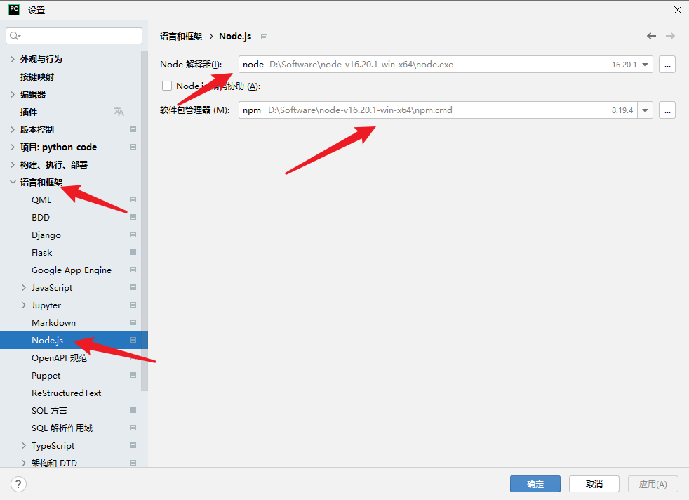
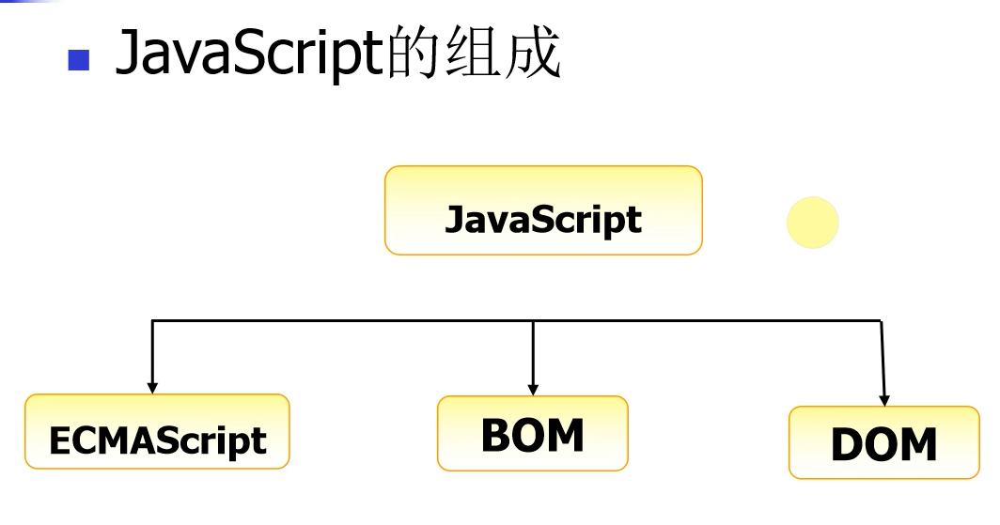

## js 基础

**学习目标:**

1. 逆向工具准备
2. 熟悉 逆向的基本过程
3. 熟悉 JavaScript 语法

### 一.前期准备

#### 1. 技术准备

1. python 基础语法
2. 爬虫基础功底
3. JavaScript 基础语法知识(可以自己偷偷的学习一些)

#### 2. 工具准备

1. node 解释器
   1. 官网地址:https://nodejs.org/zh-cn (推荐安装版本 16 版本)

- 把提供的软件包解压到你对应的文件目录,解压之后把两个文件目录添加到环境变量


2.  `pycharm`专业版开发工具

    1. 在`pycharm`安装 node 插件

    

        2. `pycharm`配置node环境

    

3.  浏览器
    1. `EDG`浏览器
    2. `chrome`浏览器

### 二.逆向简介

#### 1. 课程安排

- 25 节课左右
- 基础知识-4 节课
- 算法知识-5-6 节课
- `rpc`技术 1-2 节课
- `webpack`技术 1-2 节课
- `ast`技术 2-3 节课
- 补环境专题 4-5 节课
- cookie 专题 4-5 节课
- 验证码专题 2-3 节课

#### 2. 什么是习逆向

##### 1. `js`逆向是什么操作

- JavaScript 加密: 通常指的是在 JavaScript 中使用各种加密技术和算法来保护数据的安全性或者对敏感信息进行加密处理的过程。

- JavaScript 逆向:工程是指对 JavaScript 代码进行反向工程的过程。在软件开发中，逆向工程通常是指对已有的软件、程序或代码进行分析和理解，以获取它们的设计、功能和工作原理的过程。
- JavaScript 逆向并不是,把网站的加密信息还原成文明数据,而是根据网站上的加密(解密)的代码,我们通过 python 模拟出来,`逆向并不是通过密文,能反推出明文(算法是没有办法能反推出来的)`

##### 2. 为什会有加密

1. **数据传输安全：** 在 Web 应用程序中，客户端和服务器之间的通信可能涉及敏感数据，如用户身份验证信息、支付信息等。通过使用加密技术，可以确保这些数据在传输过程中不被窃听或篡改。
2. **客户端数据保护：** 在客户端，有时需要对一些敏感信息进行本地存储，例如用户凭据、令牌等。通过使用前端加密技术，可以增加这些本地存储的安全性。
3. **密码安全：** 当涉及用户密码时，最佳实践是在服务器上存储密码的哈希值而不是明文密码。然而，有时需要在客户端进行一些密码处理，比如在注册或登录时进行密码哈希。使用前端加密库可以确保这些操作在客户端的安全性。
4. **数字签名和身份验证：** 在一些场景中，需要确保数据的完整性和来源。
5. **加密算法研究和实验：** 有时，开发人员可能对加密算法进行研究或实验，以了解它们的工作原理、性能和适用性。

##### 3. 加密的方式

- 请求头加密
  - 请求头常见的是:`ua`, host, Origin,`Referer`,这些请求头我们很简单就能分辨出来,但是除了这些数据以外,网站会自己带上一些其他的参数,跟平时的数据可以明显看得出来不一样,这些就是请求头加密
  - 网址:https://www.qizhidao.com/check?searchKey=%E4%BA%BA%E5%B7%A5%E6%99%BA%E8%83%BD&tagNum=1&fromRoutePage=check
- 请求参数加密
  - 网址:https://www.jizhy.com/44/rank/school
- cookie 验证
  - 网址:http://www.fangdi.com.cn/new_house/new_house_jjswlpgs.html
- 响应数据验证

  - 网址:https://www.swguancha.com/home/ranking-list?code=td&tabName=city

- 全加密
  - http://www.birdreport.cn/home/search/report.html?search=eyJ0YXhvbmlkIjoiIiwic3RhcnRUaW1lIjoiIiwiZW5kVGltZSI6IiIsInByb3ZpbmNlIjoi6Z2S5rW355yBIiwiY2l0eSI6IiIsImRpc3RyaWN0IjoiIiwicG9pbnRuYW1lIjoiIiwidXNlcm5hbWUiOiIiLCJzZXJpYWxfaWQiOiIiLCJjdGltZSI6IiIsInRheG9ubmFtZSI6IiIsInN0YXRlIjoiIiwibW9kZSI6IjAiLCJvdXRzaWRlX3R5cGUiOjB9

### 三.变量和数据类型

#### 1. 定义变量

- `javaScript `是一种弱类型语言，也就是说不需要指定变量的类型，JavaScript 的变量类型由它的值来决定， 定义变量需要用关键字 'var', 一条 JavaScript 语句应该以“;”结尾

**定义变量的语法格式:**

- var 变量名 = 值;

```JavaScript
 var iNum = 123;
 var sTr = 'asd';

 //同时定义多个变量可以用","隔开，公用一个‘var’关键字

 var iNum = 45,sTr='qwe',sCount='68';
```

#### 2. JavaScript 注释

- JavaScript 的注释分为单行注释(//注释内容)和多行注释(/_多行注释_/)

```JavaScript
// 单行注释
var iNum = 123;
/*
    多行注释
    1、...
    2、...
*/
var sTr = 'abc123';

```

#### 3. 数据类型

js 中有六种数据类型，包括五种基本数据类型和一种复杂数据类型(object)。

5 种基本数据类型：

1. number 数字类型
2. string 字符串类型
3. boolean 布尔类型 true 或 false
4. undefined undefined 类型，变量声明未初始化，它的值就是 undefined
5. null null 类型，表示空对象，如果定义的变量将来准备保存对象，可以将变量初始化为 null,在页面上获取不到对象，返回的值就是 null

1 种复合类型：

1. object 后面学习的**数组、函数和 JavaScript 对象**都属于复合类型

```JavaScript
//1.1 数字 number
var iOne = 10.1;

//1.2 字符串 string
var sStr = '1234';

//1.3 布尔 boolean;
var bIsTrue = false;

//1.4 未定义 undefined
var unData;

//1.5 null 表示空对象
var nullData = null;
//因为在 JS 的最初版本中，使用的是 32 位系统，为了性能考虑使用低位存储了变量的类型信息，000 开头代表是对象，然而 null 表示为全零，所以将它错误的判断为 object 。虽然现在的内部类型判断代码已经改变了，但是对于这个 Bug 却是一直流传下来。

//1.6 object 表示对象类型
var oObj = {
   name:"隔壁老王",
   age:88
}
// 获取变量的类型
var type = typeof(oObj);
alert(type);
// 获取对象的name属性
alert(oObj.name);
```

#### 4. 变量命名规范

1. 区分大小写
2. 第一个字符必须是字母、下划线（\_）或者美元符号（$）
3. 其他字符可以是字母、下划线、美元符或数字

### 四.函数定义和调用

#### 1. 函数定义

- 函数就是可以**重复使用的代码块**, 使用关键字 **function** 定义函数。

```JavaScript

    // 函数定义
    function fnAlert(){
        alert('hello!');
    }

```

#### 2. 函数调用

- 函数调用就是**函数名加小括号**，比如:函数名(参数[参数可选])

```JavaScript
    // 函数定义
    function fnAlert(){
        alert('hello!');
    }
    // 函数调用
    fnAlert();
```

#### 3. 定义有参数有返回值的函数

- 定义函数时，函数如果有参数，**参数放到小括号里面**，函数如果有返回值，返回值通过 **return** 关键字来返回
- `arguments`关键字可以直接用来接受参数

```JavaScript

function fnAdd(iNum01,iNum02){
    var iRs = iNum01 + iNum02;
    return iRs;
    alert('here!');
}

var iCount = fnAdd(3,4);
alert(iCount);  //弹出7

```

#### 4 内部函数外部调用

```javascript
var _xl;
!(function () {
  function xl() {
    console.log("hello");
  }
  _xl = xl;
})();
_xl();
```

**函数中'return'关键字的作用:**

1. 返回函数中的值
2. 执行完 return 函数执行结束

### 五.变量作用域

#### 1. 变量作用域的介绍

变量作用域就是变量的使用范围，变量分为:

- 局部变量
  - 局部变量就是在函数内使用的变量，只能在函数内部使用。

```javascript
function myalert() {
  // 定义局部变量
  var b = 23;
  alert(b);
}
myalert(); // 弹出23
alert(b); // 函数外使用出错
```

- 全局变量
  - 全局变量就是在函数外定义的变量，可以在不同函数内使用。

```JavaScript
    // 定义全局变量
    var a = 12;
    function myalert()
    {
        // 修改全局变量
        a++;
    }
    myalert();
    alert(a);  // 弹出13
```

#### 2. JavaScript 变量生命周期

- JavaScript 变量生命周期在它声明时初始化。
- 局部变量在函数执行完毕后销毁。
- 全局变量在页面关闭后销毁。

### 六.条件语句

#### 1. 条件语句的介绍

- 条件语句就是通过条件来控制程序的走向

#### 2. 条件语句语法

1. if 语句 - 只有当指定条件为 true 时，使用该语句来执行代码
2. if...else 语句 - 当条件为 true 时执行代码，当条件为 false 时执行其他代码
3. if...else if....else 语句 - 使用该语句来判断多条件，执行条件成立的语句

#### 3. 比较运算符

假如 x = 5, 查看比较后的结果:

| 比较运算符 | 描述           | 例子                                |
| ---------- | -------------- | ----------------------------------- |
| ==         | 等于           | x == 8 为 false                     |
| ===        | 全等(值和类型) | x === 5 为 true; x === "5" 为 false |
| !=         | 不等于         | x != 8 为 true                      |
| >          | 大于           | x > 8 为 false                      |
| <          | 小于           | x < 8 为 true                       |
| >=         | 大于或等于     | x >= 8 为 false                     |
| <=         | 小于或等于     | x <= 8 为 true                      |

**比较运算符示例代码:**

```javascript
var iNum01 = 12;
var sNum01 = "12";

if (iNum01 == 12) {
  alert("相等！");
} else {
  alert("不相等！");
}

// "==" 符号默认会将符号两边的变量转换成数字再进行对比，这个叫做隐式转换
if (sNum01 == 12) {
  alert("相等！");
} else {
  alert("不相等！");
}

// "===" 符号不会转换符号两边的数据类型
if (sNum01 === 12) {
  alert("相等！");
} else {
  alert("不相等！");
}

// 多条件判断
var sFruit = "苹果";
if (sFruit == "苹果") {
  alert("您选择的水果是苹果");
} else if (sFruit == "鸭梨") {
  alert("您选择的水果是鸭梨");
} else {
  alert("对不起，您选择的水果不存在!");
}
```

#### 4. 三目运算

```javascript
// 不带返回值
5 > 3 ? alert("5大") : alert("3大"); // 即    if(5>3){alert('5大')}else{alert('3大')};
// 带返回值
var a = 1;
var b = 2;
var max = a > b ? a : b;
// 多条三目运行
a = 2;
b = 3;

console.log(a > b ? 1 : a == 0 ? 1 : 2);
```

**注意：三目运算和 if(){}else{}的区别是三目运算有返回值**

#### 5. 逻辑运算符

假如 x=6, y=3, 查看比较后的结果:

| 比较运算符 | 描述 | 例子                      |
| ---------- | ---- | ------------------------- |
| &&         | and  | (x < 10 && y > 1) 为 true |
| \|\|       | or   | (x==5 \|\| y==5) 为 false |
| !          | not  | !(x==y) 为 true           |

**逻辑运算符示例代码:**

```
var x = 6;
var y = 3;

if(x < 10 && y > 1){
    alert('都大于');
}
else{
    alert('至少有一个不大于');
}

if(x > 5 || y > 7 ){
    alert('至少有一个大于');
}
else{
    alert('都不大于');
}

if(!(x == y)){
    alert('等于')
}
else{
    alert('不等于')
}
```

### 七.数组及操作方法

#### 1. 数组的介绍

数组就是一组数据的集合，`javascript` 中，数组里面的数据可以是不同类型的数据，好比 python 里面的列表。

#### 2. 数组的定义

```
// 实例化对象方式创建
var aList = new Array(1,2,3);

// 字面量方式创建，推荐使用
var aList2 = [1,2,3,'asd'];
```

#### 3. 多维数组

多维数组指的是数组的成员也是数组，把这样的数组叫做多维数组。

```
var aList = [[1,2,3],['a','b','c']];

```

#### 4. 数组的操作

1、 获取数组的长度

```
var aList = [1,2,3,4];
alert(aList.length); // 弹出4

```

2、 根据下标取值

```
var aList = [1,2,3,4];
alert(aList[0]); // 弹出1

```

3、 从数组最后添加和删除数据

```
var aList = [1,2,3,4];
aList.push(5);
alert(aList); //弹出1,2,3,4,5
aList.pop();
alert(aList); // 弹出1,2,3,4

```

4、根据下标添加和删除元素

`arr.splice(start,num,element1,.....,elementN)`

参数解析：

1. start：必需，开始删除的索引。
2. `num`：可选，删除数组元素的个数。
3. `elementN`：可选，在 start 索引位置要插入的新元素。

此方法会删除从 start 索引开始的`num`个元素，并将`elementN`参数插入到 start 索引位置。

```
var colors = ["red", "green", "blue"];
colors.splice(0,1);  //删除第一项
alert(colors);  //green,blue

colors.splice(1, 0, "yellow", "orange");  //从第一个索引位置插入两项数据
alert(colors);  //green,yellow,organge,blue

colors.splice(1, 1, "red", "purple");  //删除一项，插入两项数据
alert(colors);  //green,red,purple,orange,blue

```

### 八.对象

#### 1.什么是对象

现实生活中:万物皆对象，对象是一个具体的事物，看得见摸得着的实物。例如，一本书、一辆汽车、一个人可以是“对象”，一个数据库、一张网页、一个与远程服务器的连按也可以是“对象”。

在 JavaScript 中，对象是一组无序的相关属性和方法的集合，所有的事物都是对象，例如字符串、数值、数组.函数等。

对象是由属性和方法组成的。

- 属性:事物的特征，在对象中用属性来表示(常用名词)
- 方法:事物的行为，在对象中用方法来表示(常用动词)

#### 2.创建对象的三种方式

- 利用字面量创建对象
- 利用 new object 创建对象
- 利用构造函数创建对象

##### 1.利用字面量创建对象

对象字面量:就是花括号里面包含了表达这个具体事物(对象)的属性和方法

```
<script>
// 利用对象字面量创建对象 {}
// var obj = ;
// 创建了一个空的对象
var obj = {
	uname:张三疯'
	age: 18
	sex:男'， I
	sayHi: function(){
      console.log('hello world')
	}
	// (1) 里面的属性或者方法我们采取键值对的形式 键 属性名 : 值 属性值
	// (2) 多个属性或者方法中间用逗号隔开的
	// (3) 方法冒号后面跟的是一个匿名函数
	// 2.使用对象
	// (1).调用对象的属性 我们采取 对象名.属性名
	// (2). 调用属性还有一种方法 对象名["属性名"]
	// (3).调用对象的方法   对象名.方法名()
</script>
```

##### 2.利用 new object 创建对象

```
<script>
// 利用 new object 创建对象
var obj = new object();
// 创建了一个空的对象
obj.uname =张三疯';
obj.age = 18;
obj.sex ='男';
obj.sayHi = function(){
	console.log("hi~');
	}
	//(1) 我们是利用 等号 = 赋值的方法 添加对象的属性和方法
	// (2) 每个属性和方法之间用 分号结束
</script>
```

##### 3.利用构造函数创建对象

- 为什么要通过构造函数创建对象？
  - 因为我们前面两种创建对象的方式一次只能创建一个对象，里面很多的属性和方法是大量相同的 我们只能复制
  - 因此我们可以利用函数的方法 重复这些相同的代码 我们就把这个函数成为**构造函数**

**构造函数**:是一种特殊的函数，主要用来初始化对象，即为对象成员变量赋初始值，它总与 new 运算符一起使用。我们可以把对象中一些公共的属性和方法抽取出来，然后封装到这个函数里面。

​

```
<script>
//利用构造函数创建对象
//我们需要创建四大天王的对象相同的属性: 名字 年龄 性别 相同的方法:唱歌
//构造函数的语法格式
// function 构造函数名(){
//	this.属性 = 值;
//	this.方法 = function()}
//	}

// new 构造函数名();

function Star(uname, age, sex){
	this.name = uname;
	this.age = age;
	this.sex = sex;
	this.sing = function (sang) {
        console.log(sang)
    }
	}
var ldh = new Star("刘德华",18, "男");
console.log(typeof ldh);
console.log(ldh.age);
console.log(ldh['name']);
ldh.sing('冰雨');


</script>
```

### 九.定时器

#### 1. 定时器的介绍

定时器就是在一段特定的时间后执行某段程序代码。

#### 2. 定时器的使用：

`js `定时器有两种创建方式：

1. `setTimeout(func[, delay, param1, param2, ...])` ：以指定的时间间隔（以毫秒计）调用一次函数的定时器
2. `setInterval(func[, delay, param1, param2, ...]) `：以指定的时间间隔（以毫秒计）重复调用一个函数的定时器

**`setTimeout`函数的参数说明:**

- 第一个参数 `func` , 表示定时器要执行的函数名
- 第二个参数 delay, 表示时间间隔，默认是 0，单位是毫秒
- 第三个参数 `param1`, 表示定时器执行函数的第一个参数，一次类推传入多个执行函数对应的参数。

```
<script>
    function hello(){
        alert('hello');
    }

    // 执行一次函数的定时器
    setTimeout(hello, 500);
</script>
```

**`setInterval`函数的参数说明:**

- 第一个参数 `func` , 表示定时器要执行的函数名
- 第二个参数 delay, 表示时间间隔，默认是 0，单位是毫秒
- 第三个参数 `param1`, 表示定时器执行函数的第一个参数，一次类推传入多个执行函数对应的参数。

```
<script>
    function hello(){
        alert('hello');
    }
    // 重复执行函数的定时器
    setInterval(hello, 1000);
</script>

```

#### 3. 清除定时器

`js `清除定时器分别是:

- `clearTimeout(timeoutID)` 清除只执行一次的定时器(`setTimeout`函数)
- `clearInterval(timeoutID)` 清除反复执行的定时器(`setInterval`函数)

**`clearTimeout`函数的参数说明:**

- `timeoutID` 为调用 `setTimeout` 函数时所获得的返回值，使用该返回标识符作为参数，可以取消该 `setTimeout` 所设定的定时执行操作。

```
<script>
    function hello(){
        alert('hello');

    }
    // 执行一次函数的定时器
    t1 = setTimeout(hello, 500);
    // 清除只执行一次的定时器
        clearTimeout(t1)
</script>
```

**`clearInterval`函数的参数说明:**

- `timeoutID` 为调用 `setInterval` 函数时所获得的返回值，使用该返回标识符作为参数，可以取消该 `setInterval` 所设定的定时执行操作。

```
<script>
    function hello(){
        alert('hello');
    }
    // 重复执行函数的定时器
    var t1 = setInterval(hello, 1000);

    function stop(){
        // 清除反复执行的定时器
        clearInterval(t1);
    }

</script>

<input type="button" value="停止" onclick="stop();">
```

### 十. `json`

#### 1. `json`的介绍

- `json`是 JavaScript Object Notation 的首字母缩写，翻译过来就是`javascript`对象表示法，这里说的`json`就是**类似于`javascript`对象的字符串**，它同时是一种**数据格式**，目前这种数据格式比较流行，逐渐替换掉了传统的`xml`数据格式。

#### 2. `json`的格式

`json`有两种格式：

1. 对象格式
2. 数组格式

**对象格式:**

对象格式的`json`数据，使用一对大括号({})，大括号里面放入`key:value`形式的键值对，多个键值对使用逗号分隔。

**对象格式的`json`数据:**

```
{
    "name":"tom",
    "age":18
}
```

**格式说明:**

`json`中的(key)属性名称和字符串值需要用**双引号**引起来，用单引号或者不用引号会导致读取数据错误。

**数组格式:**

数组格式的`json`数据，使用一对中括号([])，中括号里面的数据使用逗号分隔。

**数组格式的`json`数据:**

```
["tom",18,"programmer"]
```

**实际开发的`json`格式比较复杂,例如:**

```
{
    "name":"jack",
    "age":29,
    "hobby":["reading","travel","photography"]
    "school":{
        "name":"Merrimack College",
        "location":"North Andover, MA"
    }
}
```

#### 3. `json`数据转换成 JavaScript 对象

**`json`本质上是字符串**，如果在`js`中操作`json`数据，可以将`json`字符串转化为 JavaScript 对象。

**示例代码:**

```
var sJson = '{"name":"tom","age":18}';
var oPerson = JSON.parse(sJson);

// 操作属性
alert(oPerson.name);
alert(oPerson.age);
```

### 十一. `ajax`

#### 1. `ajax`的介绍

`ajax` 是 Asynchronous JavaScript and XML 的简写，`ajax`一个前后台配合的技术，它可以**让 `javascript` 发送异步的 `http` 请求，与后台通信进行数据的获取**，`ajax` 最大的优点是**实现局部刷新**，`ajax`可以发送`http`请求，当获取到后台数据的时候更新页面显示数据实现局部刷新，在这里大家只需要记住，**当前端页面想和后台服务器进行数据交互就可以使用`ajax`了。**

这里提示一下大家, **在`html`页面使用`ajax`需要在 web 服务器环境下运行, 一般向自己的 web 服务器发送`ajax`请求。**

#### 2. `ajax`的使用

`jquery`将它封装成了一个方法`$.ajax()`，我们可以直接用这个方法来执行`ajax`请求。

**示例代码:**

```
<script>
    $.ajax({
    // 1.url 请求地址
    url:'https://image.baidu.com/search/acjson?tn=resultjson_com&logid=9427531757301067696&ipn=rj&ct=201326592&is=&fp=result&fr=ala&word=%E5%9B%BE%E7%89%87&queryWord=%E5%9B%BE%E7%89%87&cl=2&lm=-1&ie=utf-8&oe=utf-8&adpicid=&st=&z=&ic=&hd=&latest=&copyright=&s=&se=&tab=&width=&height=&face=&istype=&qc=&nc=&expermode=&nojc=&isAsync=&pn=120&rn=30&gsm=78&1685437399327=',
    // 2.type 请求方式，默认是'GET'，常用的还有'POST'
    type:'GET',
    // 3.dataType 设置返回的数据格式，常用的是'json'格式
    dataType:'JSON',
    // 4.data 设置发送给服务器的数据, 没有参数不需要设置

    // 5.success 设置请求成功后的回调函数
    success:function (response) {
        console.log(response);
    },
    // 6.error 设置请求失败后的回调函数
    error:function () {
        alert("请求失败,请稍后再试!");
    },
    // 7.async 设置是否异步，默认值是'true'，表示异步，一般不用写
    async:true
});
</script>
```

**注意：** 由于版本的不同回调方法有一定的差异，请求成功也有可能是 done/then，请求失败是 faile

**`ajax`方法的参数说明:**

1. `url`请求地址
2. type 请求方式，默认是'GET'，常用的还有'POST'
3. `dataType` 设置返回的数据格式，常用的是`json`格式
4. data 设置发送给服务器的数据，没有参数不需要设置
5. success 设置请求成功后的回调函数
6. error 设置请求失败后的回调函数
7. `async `设置是否异步，默认值是'true'，表示异步，一般不用写
8. 同步和异步说明
   - 同步是一个`ajax`请求完成另外一个才可以请求，需要等待上一个`ajax`请求完成，好比线程同步。
   - 异步是多个`ajax`同时请求，不需要等待其它`ajax`请求完成， 好比线程异步。

### 十二. 浏览器 window 对象属性

#### 1. JavaScript 的组成



JavaScript 可以分为三个部分：[ECMAScript](https://so.csdn.net/so/search?q=ECMAScript&spm=1001.2101.3001.7020)标准、DOM、`BOM`。

- `ECMAScript`标准

  ​ 即`JS`的基本语法，JavaScript 的核心，描述了语言的基本语法和数据类型，`ECMAScript`是一套标准，定义了一种语言的标准与具体实现无关。

- DOM

  即文档对象模型，Document Object Model，用于操作页面元素，DOM 可以把 HTML 看做是文档树，通过 DOM 提供的`API`可以对树上的节点进行操作。

  

- `BOM`
  即浏览器对象模型，Browser Object Model，用于操作浏览器，比如：弹出框、控制浏览器跳转、获取分辨率等。


#### 2. docment 常见属性对象

​ document 对象其实是 window 对象下的一个子对象，它操作的是 HTML 文档里所有的内容。事实上，浏览器每次打开一个窗口，就会为这个窗口生成一个 window 对象，并且会为这个窗口内部的页面（即 HTML 文档）自动生成一个 document 对象，然后我们就可以通过 document 对象来操作页面中所有的元素。

| 属性                                | 说明                                   |
| :---------------------------------- | -------------------------------------- |
| `document.title`                    | 获取文档的 title                       |
| `document.forms`                    | 获取所有 form 元素                     |
| `document.images`                   | 获取所有`img`元素                      |
| `document.links`                    | 获取所有 a 元素                        |
| `document.cookie`                   | 文档的 cookie                          |
| `document.URL`                      | 当前文档的 URL                         |
| `document.referrer`                 | 返回使浏览者到达当前文档的 URL         |
| `document.write`                    | 页面载入过程中，用脚本加入新的页面内容 |
| `document.getElementById()`         | 通过 id 获取元素                       |
| `document.getElementsByTagName()`   | 通过标签名获取元素                     |
| `document.getElementsByClassName()` | 通过 class 获取元素                    |
| `document.getElementsByName()`      | 通过 name 获取元素                     |
| `document.querySelector()`          | 通过选择器获取元素，只获取第 1 个      |
| `document.querySelectorAll()`       | 通过选择器获取元素，获取所有           |
| `document.createElement()`          | 创建元素节点                           |
| `document.createTextNode()`         | 创建文本节点                           |
| `document.write()`                  | 输出内容                               |
| `document.writeln()`                | 输出内容并换行                         |
|                                     |                                        |

​

**代码演示**

```
<Script>
  console.log(document.forms);
  console.log(document.body);
  console.log(document.links);
  console.log(document.images);
  document.write('你的网址是' + document.URL);
  document.write('12342345345')
</Script>


<form action="">
    <lable>你好</lable>
    <input type="text">

</form>
123123423
<div>21334</div>
<a href="">数据</a>
<a href="">新浪</a>
<a href="">百度</a>


```

**注意**：由于 window 对象是包括 document 对象的，所以我们可以“简单”地把`BOM`和 DOM 的关系理解成：`BOM`包含 DOM。只不过对于文档操作来说，我们一般不把它看成是`BOM`的一部分，而是看成独立的，也就是 DOM。

#### 3. window 对象的 navigator 属性

​ `window.navigator`返回一个 navigator 对象的引用,可以用它来查询一些关于运行当前脚本的应用程序的相关信息.

| 方法                      | 说明         |
| ------------------------- | ------------ |
| `navigator.appCodeName`   | 浏览器代号   |
| `navigator.appName`       | 浏览器名称   |
| `navigator.appVersion`    | 浏览器版本   |
| `navigator.cookieEnabled` | 启用 Cookies |
| `navigator.platform`      | 硬件平台     |
| `navigator.userAgent`     | 用户代理     |
| `navigator.language`      | 用户代理语言 |

**代码示例**

```
        <Script>

    txt = "<p>浏览器代号: " + navigator.appCodeName + "</p>";
    txt+= "<p>浏览器名称: " + navigator.appName + "</p>";
    txt+= "<p>浏览器版本: " + navigator.appVersion + "</p>";
    txt+= "<p>启用Cookies: " + navigator.cookieEnabled + "</p>";
    txt+= "<p>硬件平台: " + navigator.platform + "</p>";
    txt+= "<p>用户代理: " + navigator.userAgent + "</p>";
    txt+= "<p>用户代理语言: " + navigator.language + "</p>";
    document.write(txt);

        </Script>
```

#### 4. Window 对象的 Location 属性

`window.location` 对象用于获得当前页面的地址 (URL)，并把浏览器重定向到新的页面。

**`window.location`**  对象在编写时可不使用 window 这个前缀

- `location.hostname` 返回 web 主机的域名
- `location.pathname` 返回当前页面的路径和文件名
- `location.port` 返回 web 主机的端口 （80 或 443）
- `location.protocol `返回所使用的 web 协议（`http`: 或 `https:`）
- `window.location.hre`f='http://www.baidu.com' 重定向到百度

#### 5. Window frames 属性

frames 属性返回窗口中所有命名的框架。

#### 6. window history 属性

`BOM`中的 window 对象通过`window.history`方法提供了对浏览器历史记录的读取，让你可以在用户的访问记录中前进和后退。

使用 back(),forward(),和 go()方法可以在用户的历史记录中前进和后退

#### 7. Window Screen 属性

`window.screen` 对象包含有关用户屏幕的信息。

**`window.screen`**对象在编写时可以不使用 window 这个前缀。

一些属性：

- `screen.availWidth` - 可用的屏幕宽度
- `screen.availHeight` - 可用的屏幕高度
