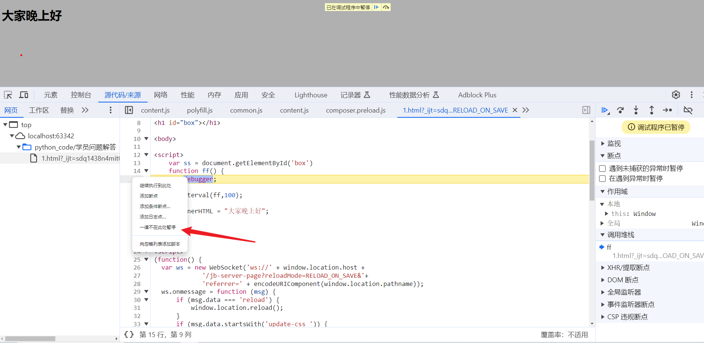
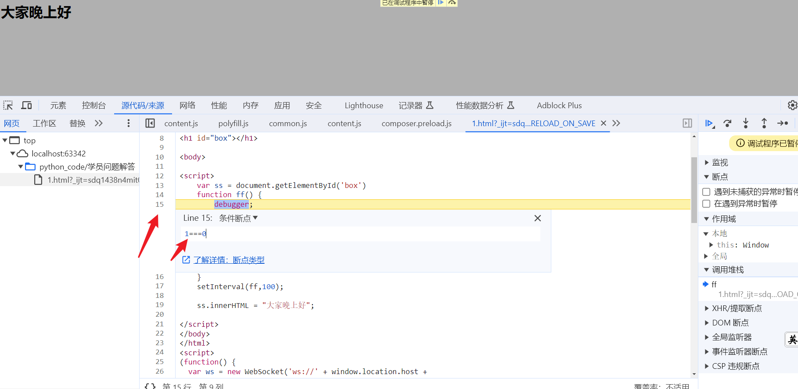
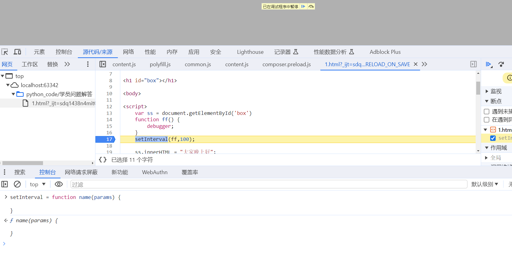
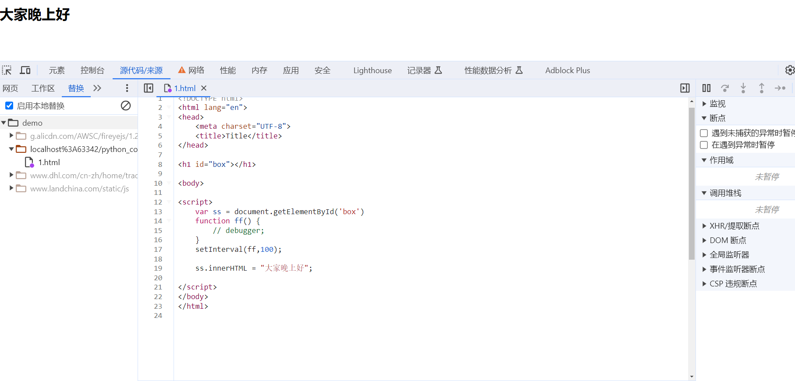

## `js`调试技巧

**学习目标:**

1. 熟悉 开发者工具的使用
2. 熟悉 代码断点的方式
3. 熟悉 网页 debugger 实现方式

### 一. 浏览器开发者工具

#### 1. 元素面板

- 展示浏览器渲染之后的页面

#### 2. 网络面板

- 浏览器请求的数据都会加载在网络面板

#### 3. 控制台面板

- 可以在控制台调试你对应的代码

#### 3.源代码面板

- 网页:当前网站加载的源代码位置
- 工作区:用不到,前端工程师会用
- 替换:替换网站代码信息,访问网站的时候,就是走的自己替换的文件
- 代码段:可以编写测试代码

#### 4. 应用面板

- 用来查看和删除 cookie 信息

### 二. 断点讲解

#### 1. 什么是断点

- 开发人员可以通过在源代码中设置断点来控制程序执行流程。一旦程序执行到设置的断点位置，它就会在那里暂停，使得开发人员可以逐步执行代码、观察变量的值，并进行其他调试操作。
- 他的作用是可以帮助我们去定位数据加密的位置.

#### 2. 断点方法

##### 1. DOM 事件断点定位加密

- DOM 事件断点是在浏览器的开发者工具中提供的一种调试工具，用于暂停 JavaScript 执行当特定类型的 DOM 事件被触发时。
- 使用 DOM 事件断点，你可以指定在哪些 DOM 事件上设置断点，比如点击（click）、改变（change）、加载（load）等。一旦设置了 DOM 事件断点，当相应的事件被触发时，浏览器会自动在触发事件的 JavaScript 代码行上暂停执行，从而允许你检查当前的程序状态、变量值，以及执行堆栈信息等。
- 执行的比较靠前 距离加密函数比较远

##### 2. `XHR`断点定位加密

- `XHR`断点是在浏览器的开发者工具中设置的一种调试工具，用于在进行`XMLHttpRequest（XHR也就是我们说的ajax请求）`请求时暂停 JavaScript 执行。
- 执行比较靠后 距离加密函数相对较近 可以根据栈快速定位
- **注意**：非`XHR`发送的就断不住

##### 3. 网站加载时间轴

```
加载Hmtl - 加载JS - 运行JS初始化 - 用户触发某个事件 - 调用某段JS - 加密函数 - 给服务器发信息（XHR-SEND） - 接收到服务器数据 - 解密函数(如果数据加密的话) - 刷新网页渲染
```

##### 4. 断点示例

- 网址:https://oauth.d.cn/auth/goLogin.html
- 关键字定位
- 跳过子函数（次态函数）执行（只在主函数内一步一步执行，不进入子函数内部）
- 进入子函数（次态函数）执行（在主函数内部一步一步执行，如果遇到子函数，会跳转到子函数内部一步一步执行）
- 跳出当前函数，回到调用位置
- 单步执行，会进入到函数内部 更加的细致
- 屏蔽断点

### 三. 方法栈

**栈是一种先进后出的特殊线性表结构**

调用栈是解析器的一种机制，可以在脚本调用多个函数时，通过这种机制，我们能够追踪到哪个函数正在执行，执行的函数体又调用了哪个函数。

- 当脚本要调用一个函数时，解析器把该函数添加到栈中并且执行这个函数。
- 任何被这个函数调用的函数会进一步添加到调用栈中，并且运行到它们被上个程序调用的位置。
- 当函数运行结束后，解释器将它从堆栈中取出，并在主代码列表中继续执行代码。

#### 1. 代码说明

```JavaScript

function cc(a, b) {
    console.log(a + b)
    console.log('调用的cc函数')
}


function bb(a, b){
    console.log(a + b)
    cc()
    console.log('调用的bb函数')
}

function aa(a, b) {
    bb(a, b)
    console.log('调用的aa函数')
}

aa(1, 2)

```

#### 2. 案例

- 网址:https://oauth.d.cn/auth/goLogin.html
- `xhr`断点调试看栈

### 四. debugger 原理

#### 1. 示范样例

```html
<!DOCTYPE html>
<html lang="en">
  <head>
    <meta charset="UTF-8" />
    <title>Title</title>
  </head>

  <h1 id="box"></h1>

  <body>
    <script>
      var ss = document.getElementById("box");
      function ff() {
        debugger;
      }
      setInterval(ff, 100);

      ss.innerHTML = "大家晚上好";
    </script>
  </body>
</html>
```

#### 2. 浏览器过 debugger

- 不再此处暂停
  - 鼠标右击代码行号,一律不再此处暂停



- 编辑断点
  - 当定义器运行到这个`debugger`这个代码的时候，那么这个时候它为`true`，它肯定执行我们的`debugger`代码，那我们可以用浏览器的功能给他改成`false`
  - 鼠标右击行号,添加条件断点,添加一个不成立的条件
  - 写个 1===0 的先验条件，永远为假，就永远不会进入这个断点了。



#### 3. 方法置空过 debugger

- 无限 debugger 产生的原因是第七行代码`ff`这个函数造成的,所以我们可以重写这个函数,使无限 debugger 失效.在控制台中输入`function ff(){}`即可
- 注：一定要在 debugger 进入之前

```
setInterval = function(){}
```



#### 4. 替换文件过 debugger

- 把`JS`文件保存到本地修改，修改范围主要是将 debugger 相关的代码删除或者改写，可以使用文件替换方式
- 用 pycharm 启动的文件,后缀需要删除掉



#### 5. 注入代码过 debugger

- 在控制台注入代码
- 网址:https://www.spolicy.com/
- 这样的网站,鼠标右击的方式替换网站会非常的卡,他会不断异步的去创建文件,把浏览器的资源都占用
- constructor: 构造函数

```
[f(357, "flU7", 0, 148) + p(416, 0, "GoXF") + "r"](c[l(167, 377, "LwY)")](c[t(-204, 0, 0, -71, "%g*t")], c[p(289, 0, "LQO2")]))[a(453, 0, "k4Oq", 263)](c[p(462, 0, "#x1a")])
```

- 这行代码创建的 debugger,那么我们可以根据 JavaScript 的特点把他的这个方法改写一下

```
var _constructor = constructor;
Function.prototype.constructor = function(s) {

    if ( s== "debugger") {
        console.log(s);
        return null;
    }
    return _constructor(s);
}

```

- 有调用 constructor 方法我们判断他传递的参数是不是 debugger,要是 debugger 的话就把这个方法改写,要不是的话就是用源方法返回
