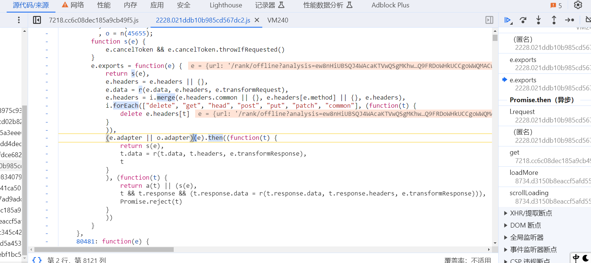
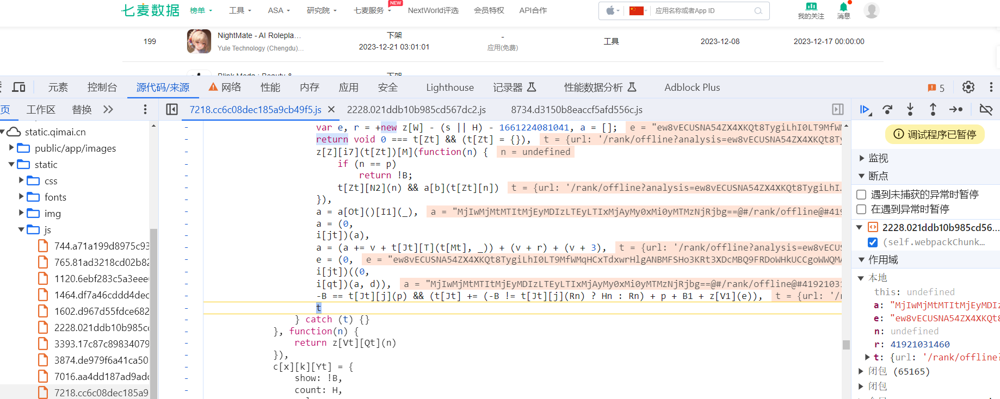

## `JS`调用和扣代码

**学习目标:**

1. 掌握 python调用`js`代码方式
2. 熟悉 `js`开放接口进行调用
3. 了解 补环境的基本概念
4. 掌握 `js`调试技巧


### 一. `pyexecjs`的使用

#### 1. 简介

- `PyExecJS` 是一个 Python 库，用于在 Python 环境中执行 JavaScript 代码。它实际上是对 ExecJS 库的 Python 封装，ExecJS 本身是一个通用的 JavaScript 运行环境的抽象层。

- 使用 `PyExecJS`，你可以在 Python 中执行 JavaScript 代码，而无需启动一个完整的 JavaScript 解释器。它的目标是提供一种简便的方式，使得在 Python 中嵌入 JavaScript 代码成为可能，特别是对于需要与 JavaScript 交互的项目而言。
- git地址:https://github.com/doloopwhile/PyExecJS
- 安装方式:

```
pip install PyExecJS  -i  https://pypi.tuna.tsinghua.edu.cn/simple/
```

#### 2. `execjs`使用方式

- 基本使用方法

```python
import execjs  # 导入

# 生成JavaScript运行环境，环境名可以指定
node = execjs.get()  # 安装nodejs后，会得到运行环境名为：Node.js (V8)

with open('1111.js', encoding='utf-8') as f:
    js_code = f.read()

# 编译js代码
ctx = node.compile(js_code)  # compile方法去加载js代码

# 两种方式执行js函数
data1 = ctx.eval('get_data({"aa": "123"})')  # eval方法中，整个函数调用包含在字符串内
print(data1)
data2 = ctx.call('get_data', ['123'])  # call方法中，第一个参数是函数名（str）,后面接参数
print(data2)
```


### 二. Express开放接口

#### 1. Express简介

- 官方给出的概念：Express 是基于 `Node.js` 平台，快速、开放、极简的 Web 开发框架。

- 通俗的理解：Express 的作用和 `Node.js` 内置的 `http` 模块类似，是专门用来创建 Web 服务器的。

- Express 的本质：就是一个 `npm` 上的第三方包，提供了快速创建 Web 服务器的便捷方法。

- Express 的中文官网：http://www.expressjs.com.cn/

- `http` 内置模块与 Express 类似于浏览器中 `Web API` 和 `jQuery` 的关系。后者是基于前者进一步封装出来的。


#### 2. Express使用方式

- 安装方式

```
npm install express -S
```

- 创建服务器

```JavaScript
// 1.导入 express
const express = require('express');

// 2.创建 web 服务器
const app = express();

// 3.get请求 req是请求对象  res响应对象
app.get('/user', function(req, res){
    // 调用express提供的res.send()方法，向客户端响应一个JSON对象
    res.send('hello world')
})
// 4.启动 web 服务器
app.listen(8080, function(){
    console.log('express server running at http://127.0.0.1:8080');
})
```

- 获取`url`中携带的查询参数
- 请求对象中会有query,不传请求查询参数就是空值

```JavaScript
app.get('/', function(req, res){
//    通过req.query 可以获取到客户端发送过来的 查询参数
//    注意： 默认情况下，req.query 是一个空对象
    console.log(req.query)
    res.send(req.query)
})
```

- express发送post请求

```JavaScript
// 指定参数类型
app.use(express.json())
app.post('/api',function(req, res){
    res.send('Got a post request')
})
```


### 三. `js`调试技巧

#### 1. 定位方法总结

1. `dom`和`xhr`断点定位
2. 关键字搜索（尽量符合可能在`JS`里面出现的形状 sign =   sign:  "sign"）
3. 使用hook技术进行拦截
4. 根据启动器去找调用关系(分析启动器是比较麻烦的,运气成分比较多)


#### 2. 实战案例

##### 1. 逆向目标

- 目标网址:https://www.qimai.cn/rank/offline
- 接口:https://api.qimai.cn/rank/offline?analysis=ew8vECUSNA54ZX4XKQt8TygiLhI0LT9MfWMqHCxTdxwrHlgANBMFSHo3KRt3XDcMBQ9FRDoWHkUCCgoWWQMACwEWHDoWBQZaVlEAAVNTUVg4Wkk%3D&status=3&date=2023-12-21&sdate=2023-12-21&edate=2023-12-21&country=cn&genre=36&option=4&page=2

##### 2. 逆向分析

- 定位加密位置

- 尝试关键字搜索`analysis`

```JavaScript
// 搜索不到的原因
1. 代码有做混淆
2. 关键字做拼接  
```

- `hook`定位

```
(function () {
    var open = window.XMLHttpRequest.prototype.open;
    window.XMLHttpRequest.prototype.open = function (method, url, async) {
        if (url.indexOf("analysis") != -1) {
            debugger;
        }
        return open.apply(this, arguments);
    };
})();
```



- 可以看到他的数据在第三个栈已经生成好了,说明代码是在异步的过程中加密的数据,但是异步执行的代码在栈堆里面是看不到的,在异步生成的过程有两个原因,第一个可能是在单纯的异步代码生成加密的,另一种可能是在拦截器里面生成的
- 异步调试的方法,可以在发异步的位置下一个断点,先大致的过一点,先大致观察代码的执行的过程,前期可以先大致调试一下,大致知道数据在哪里生成之后就能精细化调整
- 拦截器,就能向上节课一样,向下调试找到响应拦截器,请求拦截器一般就是在响应拦截器的上面
- 加密位置
- e的值就是加密对应的数据



##### 3. 逆向代码

- JavaScript代码

```JavaScript
function o(n) {
    t = "",
        ['66', '72', '6f', '6d', '43', '68', '61', '72', '43', '6f', '64', '65']['forEach'](function (n) {
            t += unescape("%u00" + n)
        });
    var t, e = t;
    return String[e](n)
}

function v(t) {
    t = encodeURIComponent(t)["replace"](/%([0-9A-F]{2})/g, function (n, t) {
        return o("0x" + t)
    });

    return btoa(t)

}

function h(n, t) {
    for (var e = (n = n["split"](""))["length"], r = t["length"], a = "charCodeAt", i = 0; i < e; i++)
        n[i] = o(n[i][a](0) ^ t[(i + 10) % r][a](0));
    return n["join"]('')
}


function get_analysis(a) {
    // var a = [1, '2023-12-21', '2023-12-21', '2023-12-21', 'cn', '36', 4, 3];
    a = a["sort"]()["join"]('')
    a = v(a)
    r = +new Date() - 4421027 - 1661224081041
    // r = 41932436257
    a = (a += "@#" + "/indexV2/getIndexRank") + ("@#" + r) + ("@#" + 3)
    console.log(a)
    var d = "xyz517cda96efgh"
    return v(h(a, d))
}

aa = get_analysis(['0', '6014'])

// console.log(aa)
```

- python代码

```python
import requests
import execjs

headers = {
    "origin": "https://www.qimai.cn",
    "user-agent": "Mozilla/5.0 (Windows NT 10.0; Win64; x64) AppleWebKit/537.36 (KHTML, like Gecko) Chrome/120.0.0.0 Safari/537.36"
}

url = "https://api.qimai.cn/indexV2/getIndexRank"
params = {
    "setting": "0",
    "genre": "6014"
}
with open('1111.js', encoding='utf-8') as f:
    js_code = f.read()
js = execjs.compile(js_code)
val = params.values()
analysis = js.call('get_analysis', list(val))
params['analysis'] = analysis
response = requests.get(url, headers=headers, params=params)

print(response.json())

```

