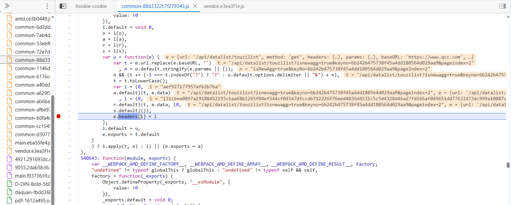

## 摘要算法

在 `JavaScript` 中和 `Python `中的基本实现方法，遇到 `JS` 加密的时候可以快速还原加密过程，有的网站在加密的过程中可能还经过了其他处理，但是大致的方法是一样的。

消息摘要算法/签名算法：`MD5、SHA、HMAC`


### 1. MD5

简介：全称` MD5` 消息摘要算法，又称哈希算法、散列算法，由美国密码学家`罗纳德·李维斯特`设计，于 1992 年作为 RFC 1321 被公布，用以取代 MD4 算法。摘要算法是单向加密的，也就是说明文通过摘要算法加密之后，是不能解密的。摘要算法的第二个特点密文是固定长度的，它通过一个函数，把任意长度的数据转换为一个长度固定的数据串（通常用`16进制`的字符串表示）。之所以叫摘要算法，它的算法就是提取明文重要的特征。所以，两个不同的明文，使用了摘要算法之后，有可能他们的密文是一样的，不过这个概率非常的低。

#### 1.1 JavaScript 实现

地址：https://www.autohome.com.cn/changsha/

安装对应的模块

```javascript
// 在依赖项中添加包： --save
npm install crypto-js  --save
```

**使用案例**

```JavaScript
// 引用 crypto-js 加密模块
var CryptoJS = require('crypto-js')

function MD5Test() {
    var text = "I love python!"
    return CryptoJS.MD5(text).toString()
}

console.log(MD5Test()) 
```

#### 1.2 Python 实现

```python
import hashlib

def md5_test2():
    md5 = hashlib.md5()
    md5.update('python'.encode('utf-8'))
    print(md5.hexdigest())

if __name__ == '__main__':
    md5_test2() 
```

**总结：**`MD5`哈希视为字符串，而是将其视为十六进制数， `MD5`哈希长度为128位，通常由`32`个十六进制数字表示。


### 2. SHA

简介：全称安全哈希算法，由美国国家安全局`（NSA）`所设计，主要适用于数字签名标准里面定义的数字签名算法，`SHA` 通常指 `SHA` 家族的五个算法，分别是` SHA-1、SHA-224、SHA-256、SHA-384、SHA-512`，`SHA` 是比 `MD5` 更安全一点的摘要算法，`MD5` 的密文是 32 位，而 `SHA-1` 是 40 位，版本越强，密文越长，代价是速度越慢。

#### 2.1  JavaScript 实现

```JavaScript
// 引用 crypto-js 加密模块
var CryptoJS = require('crypto-js')

function SHA1Encrypt() {
    var text = "I love python!"
    return CryptoJS.SHA1(text).toString();
}

console.log(SHA1Encrypt()) 
```

#### 2.2 Python 实现

```python
import hashlib

def sha1_test2():
    sha1 = hashlib.sha1()
    sha1.update('I love python!'.encode('utf-8'))
    print(sha1.hexdigest())

if __name__ == '__main__':
    sha1_test2() 
```

#### 2.3 `sha`系列特征

`sha1:23c02b203bd2e2ca19da911f1d270a06d86719fb`

`sha224:1ffeffcbe2707dc5d1c10df619203c1a3b620c70394b3c4c106d92e6`

`sha256:c3a845a318cd654749ea4db6f4d5f9cb5c6e5b0cade46d9dc04af46d32049c7c`

`sha512:af47f324b77a4885748bfc3f0d9b5a846c0153c589852bb3f185ab6e7a600547b818ab994776e8d24584457f9aac84246b0de971584cebbdd96aa1aee6630f9f`

总结：根据长度进行定位、主要还是要去JavaScript里面下断点调试分析


### 3. `HMAC`

简介：全称散列消息认证码、密钥相关的哈希运算消息认证码，于 1996 年提出，1997 年作为 RFC 2104 被公布，`HMAC` 加密算法是一种安全的基于加密 `Hash` 函数和共享密钥的消息认证协议，它要求通信双方共享密钥 key、约定算法、对报文进行 `Hash` 运算，形成固定长度的认证码。通信双方通过认证码的校验来确定报文的合法性。

参考资料：

- 百科：https://baike.baidu.com/item/hmac/7307543?fr=aladdin

#### 3.1 JavaScript 实现

```JavaScript
// 引用 crypto-js 加密模块
var CryptoJS = require('crypto-js')

function HMACEncrypt() {
    var text = "I love python!"
    var key = "secret"   // 密钥文件
    return CryptoJS.HmacMD5(text, key).toString();
    // return CryptoJS.HmacSHA1(text, key).toString();
    // return CryptoJS.HmacSHA256(text, key).toString();
}
console.log(HMACEncrypt())
```

#### 3.2 Python 实现

```python
import hmac

def hmac_test1():
    message = 'I love python!'.encode()
    key = b'secret'
    md5 = hmac.new(key, message, digestmod='MD5')
    print(md5.hexdigest())

def hmac_test2():
    key = 'secret'.encode('utf8')
    sha1 = hmac.new(key, digestmod='sha1')
    sha1.update('I love '.encode('utf8'))
    sha1.update('Python!'.encode('utf8'))
    print(sha1.hexdigest())

if __name__ == '__main__':
    hmac_test1()  # 9c503a1f852edcc3526ea56976c38edf
    hmac_test2()  # 2d8449a4292d4bbeed99ce9ea570880d6e19b61a
```


### 4. 实战案例

#### 4.1 案例 `md5`加密逆向

##### 4.1.1 **逆向目标**

+ 主页：https://www.mytokencap.com/

+ 逆向字段：`code: '9c503a1f852edcc3526ea56976c38edf'`

##### 4.1.2 **逆向分析**

1. 先进行抓包，可以看到有一个签名信息 `code`

   这里推荐下`xhr`断点调试进行分析、可以发现有一个拦截器

   


2.  数据加密位置，可以在这儿进行分析


##### 4.1.3 **python代码模拟**

```python
import hashlib,time
// o()(n + "9527" + n.substr(0, 6))

def md5_test2():
    n = str(int(time.time())*1000)
    value = n + "9527" + n[0:6]
    md5 = hashlib.md5()
    md5.update(value.encode('utf-8'))
    print(md5.hexdigest())

if __name__ == '__main__':
    md5_test2() 
```


#### 4.2 案例`sha256`系列

**逆向目标**

+ 主页：http://www.hh1024.com/

+ 接口：https://ucp.hrdjyun.com:60359/api/dy

+ 逆向参数：`sign: "0d2864b1420c42f12de6efeff30bcb4b458157d8177675b8910fa632524604cb"`

##### 4.2.1  抓包分析：

1. 通过对比，可以发现这个参数每次都会切换


##### 4.2.2 调试加密地地点

1. 打开全局搜索 `sign`关键字


2. 参数加密地点


##### 4.2.3 python代码实现

```python
import urllib3,requests,time,json
urllib3.disable_warnings()
import hashlib

months = input("请输入查询月份：")
days = input("请输入查询日期,2天以内：")
times = str(int(time.time()) * 1000)
params = {"no":"dy0002","data":{"days":1,"rankType":5,"liveDay":f"2023-{months.zfill(2)}-{days.zfill(2)}"}}
print(params)
dd = json.dumps(params)
def get_sign():
    data = f'param={dd}&timestamp={times}&tenant=1&salt=kbn%&)@<?FGkfs8sdf4Vg1*+;`kf5ndl$'  # 要进行加密的数据
    data_sha = hashlib.sha256(data.encode('utf-8')).hexdigest()
    return data_sha

def get_data():
    headers = {
        "Content-Type": "application/json;charset=UTF-8",
        "Host": "ucp.hrdjyun.com:60359",
        "Origin": "http://www.hh1024.com",
        "Pragma": "no-cache",
        "sec-ch-ua": "\"Google Chrome\";v=\"107\", \"Chromium\";v=\"107\", \"Not=A?Brand\";v=\"24\"",
        "sec-ch-ua-mobile": "?0",
        "sec-ch-ua-platform": "\"Windows\"",
        "Sec-Fetch-Dest": "empty",
        "Sec-Fetch-Mode": "cors",
        "Sec-Fetch-Site": "cross-site",
        "User-Agent": "Mozilla/5.0 (Windows NT 10.0; Win64; x64) AppleWebKit/537.36 (KHTML, like Gecko) Chrome/107.0.0.0 Safari/537.36"
    }
    session = requests.session()
    s = get_sign()
    t = "这里面是登陆后的token值"
    datas = {"param":dd,"sign":s,"tenant":"1","timestamp":times,"token":t}
    url = 'https://ucp.hrdjyun.com:60359/api/dy'
    res = session.post(url,headers=headers,data=json.dumps(datas))
    if res.json().get('status') == 0:
        data = res.json().get('data')['rankList']
        for d in data:
            items = {}
            items['抖音名'] = d.get('anchorName')
            items['带货销量'] ='%.2f' % (d.get('salesVolume') / 10000) + '万'
            print(items)

if __name__ == '__main__':
    reads = """
        本接口只开放抖音带货销量日榜
        可以根据日期查询
                                --- 夏洛
        """
    print(reads)
    get_data()
```

s

#### 4.3 案例`Hmac`系列

##### 1. **逆向目标**

+ 主页：https://www.qcc.com/
+ 接口:https://www.qcc.com/api/datalist/touzilist?keyNo=5dffb644394922f9073544a08f38be9f&pageIndex=2
+ 逆向字段：`code: '9c503a1f852edcc3526ea56976c38edf'`

##### 2. **逆向分析**

- 定位加密的位置
- 关键字定位

```JavaScript
// 前端代码赋值请求头的代码
aa.setRequestHeader('sign', '值')
aa.headers['sign'] = '值'
aa.headers: {}
// 可以搜索这些关键字定位
```

- 调试定位

```
调试定位在异步的js代码里面比较麻烦,我们可以先定位到异步执行代码之前下好断点,先快速的过一般,在脑海里有大楷的印象,看看数据大致的生成位置,前面先粗调试,确定好大致位置之后再精调
```



- 可以看出我们的请求头在这里生成的
- i的生成是`(0,a.default)(t, e.data)`
- l的生成是`l = (0,r.default)(t, e.data, (0,s.default)());`
- `(0,r.default)`是js的逗号操作符我们可以直接`r.default()`来进行调用
- 键值对都是通过网址来进行加密的,可以直接进函数进行对比

##### 3. 逆向结果

- JavaScript代码

```JavaScript
var cryptojs = require('crypto-js')

var dd = {
    "n": 20,
    "codes": {
        "0": "W",
        "1": "l",
        "2": "k",
        "3": "B",
        "4": "Q",
        "5": "g",
        "6": "f",
        "7": "i",
        "8": "i",
        "9": "r",
        "10": "v",
        "11": "6",
        "12": "A",
        "13": "K",
        "14": "N",
        "15": "k",
        "16": "4",
        "17": "L",
        "18": "1",
        "19": "8"
    }
}
var r = function () {
    for (var e = (arguments.length > 0 && void 0 !== arguments[0] ? arguments[0] : "/").toLowerCase(), t = e + e, n = "", i = 0; i < t.length; ++i) {
        var a = t[i].charCodeAt() % dd.n;
        n += dd.codes[a]
    }
    return n
};

var r1 = function (e, t) {
    return cryptojs.HmacSHA512(e, t).toString();
};


var s = function () {
    var e = arguments.length > 1 && void 0 !== arguments[1] ? arguments[1] : {}
        , t = (arguments.length > 0 && void 0 !== arguments[0] ? arguments[0] : "/").toLowerCase()
        , n = JSON.stringify(e).toLowerCase();
    return (0,
        r1)(t + n, (0,
        r)(t)).toLowerCase().substr(8, 20)
};


var s1 = function () {
    var e = arguments.length > 1 && void 0 !== arguments[1] ? arguments[1] : {}
        , t = arguments.length > 2 && void 0 !== arguments[2] ? arguments[2] : ""
        , n = (arguments.length > 0 && void 0 !== arguments[0] ? arguments[0] : "/").toLowerCase()
        , i = JSON.stringify(e).toLowerCase();
    return r1(n + "pathString" + i + t,
        r(n))
};

function xxx(t) {
    data = undefined
    var i = (0,
        s)(t, data)

    l = s1(t, data, '210314b3d12062c234e868105494964d')
    return {
        'key': i,
        'value': l
    }

}

t = "/api/datalist/holdcolist?isnewagg=true&keyno=6b242b475738f45a4dd180564d029aa9&pageindex=7"
xxx(t)
```

- python代码

```python
import requests
import execjs


class Qcc():
    def __init__(self):
        self.headers = {
            'cookie': 'qcc_did=4ec3aa37-7e00-4ba3-8981-4561cd125939; UM_distinctid=18a6ad8612d1ad-0dbe600f638f27-26031f51-1fa400-18a6ad8612e17f9; CNZZDATA1254842228=338542179-1694009680-%7C1694700549; QCCSESSID=c79eec2efbd4d79857830f58a7',
            "referer": "https://www.qcc.com/firm/6b242b475738f45a4dd180564d029aa9.html",
            "user-agent": "Mozilla/5.0 (Windows NT 10.0; Win64; x64) AppleWebKit/537.36 (KHTML, like Gecko) Chrome/118.0.0.0 Safari/537.36",
        }
        self.url = "https://www.qcc.com/api/datalist/holdcolist?isNewAgg=true&keyNo=6b242b475738f45a4dd180564d029aa9&pageIndex={}"

    def get_data(self):
        for i in range(1, 3):
            js = execjs.compile(open('demo.js', encoding='utf-8').read())
            pa = '/api/datalist/holdcolist?isnewagg=true&keyno=6b242b475738f45a4dd180564d029aa9&pageindex={}'.format(i)
            he = js.call('xxx', pa)
            self.headers[he['key']] = he['value']
            response = requests.get(self.url.format(i), headers=self.headers)
            print(response.text)


if __name__ == '__main__':
    qcc = Qcc()
    qcc.get_data()

```


