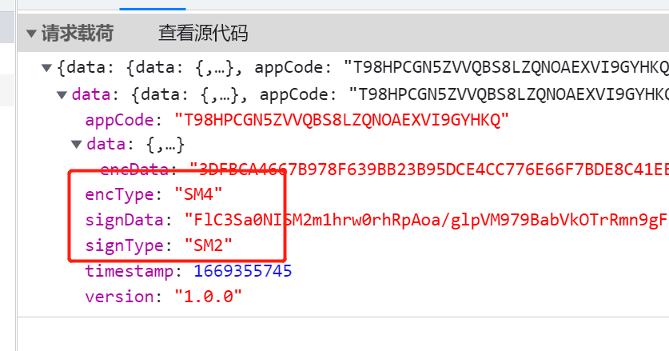
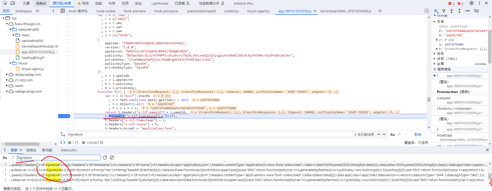
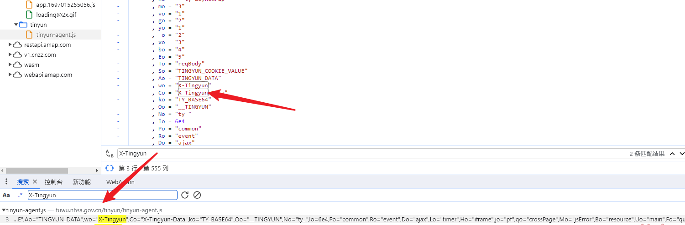
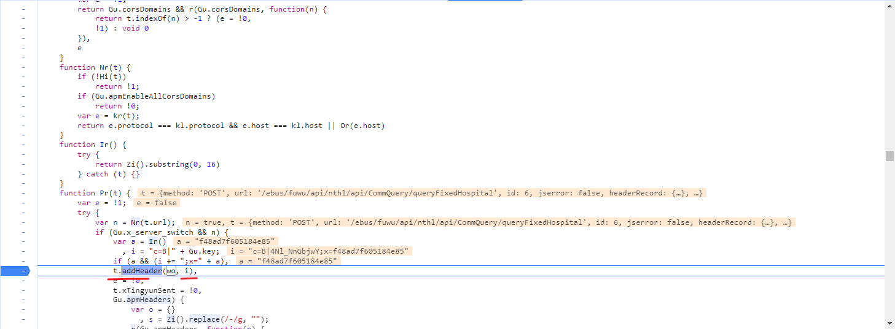
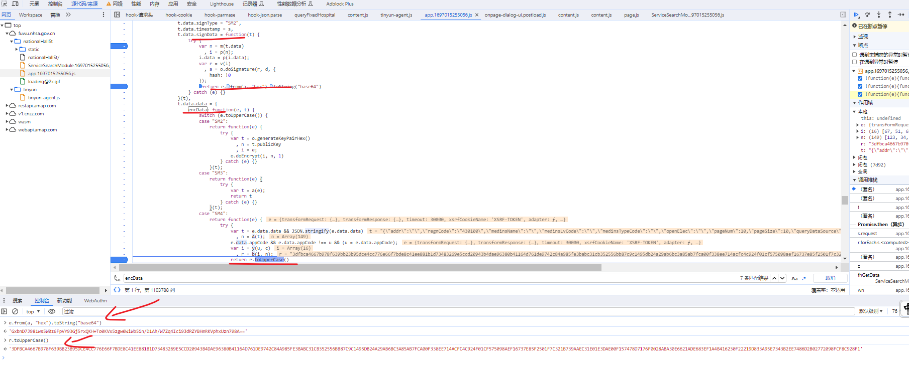
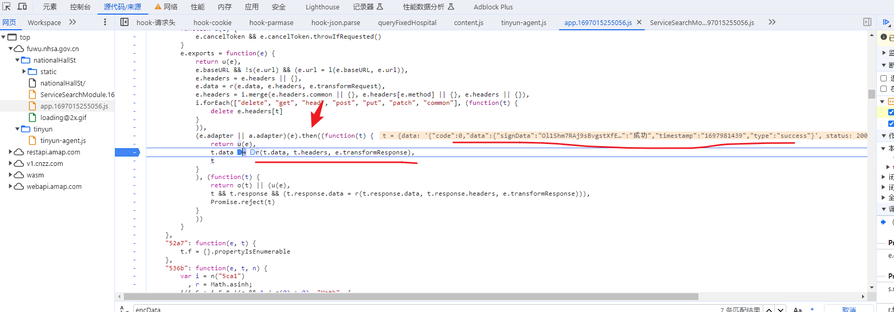
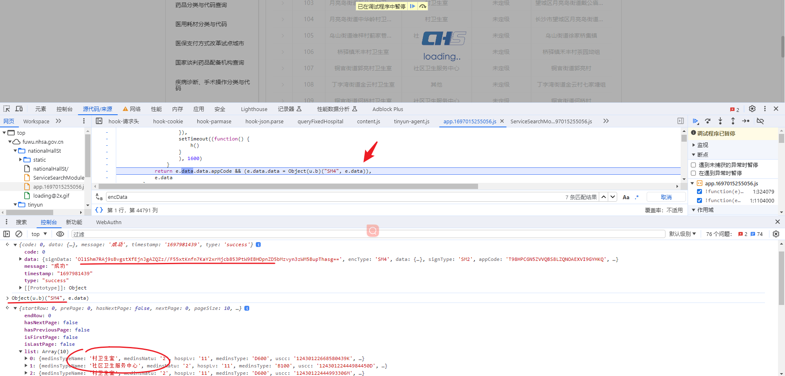

## SM国密系列

```
本教程仅供学习交流使用，严禁用于商业用途和非法用途，否则由此产生的一切后果均与作者无关，请各学员自觉遵守相关法律法规。
```


### 一.算法简介

事实上从 2010 年开始，我国国家密码管理局就已经开始陆续发布了一系列国产加密算法，这其中就包括 `SM1、SM2、SM3 、SM4、SM7、SM9、ZUC`（祖冲之加密算法）等，`SM` 代表商密，即商业密码，是指用于商业的、不涉及国家秘密的密码技术。`SM1` 和 `SM7 `的算法不公开，其余算法都已成为` ISO/IEC` 国际标准。

在这些国产加密算法中，`SM2、SM3、SM4 ` **三种加密算法是比较常见的**，在爬取部分网站时，也可能会遇到这些算法，所以作为爬虫工程师是有必要了解一下这些算法的，如下图所示某网站就使用了 `SM2` 和 `SM4` 加密算法：




#### 1.1 算法分类

| 算法名称 | 算法类别                           | 应用领域             | 特点                                                       |
| -------- | ---------------------------------- | -------------------- | ---------------------------------------------------------- |
| SM1      | 对称（分组）加密算法               | 芯片                 | 分组长度、密钥长度均为 128 比特                            |
| SM2      | 非对称（基于椭圆曲线 ECC）加密算法 | 数据加密             | ECC 椭圆曲线密码机制 256 位，相比 RSA 处理速度快，消耗更少 |
| SM3      | 散列（hash）函数算法               | 完整性校验           | 安全性及效率与 SHA-256 相当，压缩函数更复杂                |
| SM4      | 对称（分组）加密算法               | 数据加密和局域网产品 | 分组长度、密钥长度均为 128 比特，计算轮数多                |
| SM7      | 对称（分组）加密算法               | 非接触式 IC 卡       | 分组长度、密钥长度均为 128 比特                            |
| SM9      | 标识加密算法（IBE）                | 端对端离线安全通讯   | 加密强度等同于 3072 位密钥的 RSA 加密算法                  |
| ZUC      | 对称（序列）加密算法               | 移动通信 4G 网络     | 流密码                                                     |

##### 1.1.1 `SM2` 椭圆曲线公钥加密算法

`SM2` 为椭圆曲线（`ECC`）公钥加密算法，非对称加密，`SM2` 算法和 `RSA `算法都是公钥加密算法，`SM2` 算法是一种更先进安全的算法，在我们国家商用密码体系中被用来替换` RSA` 算法，在不少官方网站会见到此类加密算法。我国学者对椭圆曲线密码的研究从 20 世纪 80 年代开始，目前已取得不少成果，`SM2` 椭圆曲线公钥密码算法比 `RSA `算法有以下优势：

|                      | SM2                            | RSA                    |
| -------------------- | ------------------------------ | ---------------------- |
| 安全性               | 256 位 SM2 强度已超过 RSA-2048 | 一般                   |
| 算法结构             | 基本椭圆曲线（ECC）            | 基于特殊的可逆模幂运算 |
| 计算复杂度           | 完全指数级                     | 亚指数级               |
| 存储空间（密钥长度） | 192-256 bit                    | 2048-4096 bit          |
| 秘钥生成速度         | 较 RSA 算法快百倍以上          | 慢                     |
| 解密加密速度         | 较快                           | 一般                   |

##### 1.1.2` SM4 `分组加密算法

`SM4` 为无线局域网标准的分组加密算法，对称加密，用于替代 `DES/AES` 等国际算法，`SM4` 算法与 `AES `算法具有相同的密钥长度和分组长度，均为 128 位，故对消息进行加解密时，若消息长度过长，需要进行分组，要消息长度不足，则要进行填充。加密算法与密钥扩展算法都采用 32 轮非线性迭代结构，解密算法与加密算法的结构相同，只是轮密钥的使用顺序相反，解密轮密钥是加密轮密钥的逆序。

|          | SM4                                  | DES                                            | AES                                                       |
| -------- | ------------------------------------ | ---------------------------------------------- | --------------------------------------------------------- |
| 计算轮数 | 32                                   | 16（3DES 为 16*3）                             | 10/12/14                                                  |
| 密码部件 | S 盒、非线性变换、线性变换、合成变换 | 标准算术和逻辑运算、先替换后置换，不含线性变换 | S 盒、行移位变换、列混合变换、圈密钥加变换（AddRoundKey） |


### 二.算法实现

#### 1. JavaScript实现

在 JavaScript 中已有比较成熟的实现库，这里推荐 `sm-crypto[4]`，目前支持` SM2、SM3 和 SM4`，需要注意的是，SM2 非对称加密的结果由 `C1、C2、C3` 三部分组成，其中 `C1` 是生成随机数的计算出的椭圆曲线点，`C2 `是密文数据，`C3 `是` SM3` 的摘要值，最开始的国密标准的结果是按 `C1C2C3` 顺序的，新标准的是按 `C1C3C2` 顺序存放的，`sm-crypto` 支持设置` cipherMode`，也就是 `C1C2C3` 的排列顺序。

以 `SM2 `算法为例，实现如下（其他算法和详细用法可参考其官方文档）：

##### 1. `SM2` 

```javascript
// npm install sm-crypto --save

const sm2 = require('sm-crypto').sm2
 
// 1 - C1C3C2，0 - C1C2C3，默认为1
const cipherMode = 1
 
// 获取密钥对
let keypair = sm2.generateKeyPairHex()
let publicKey = keypair.publicKey   // 公钥
let privateKey = keypair.privateKey // 私钥
 
let msgString = "this is the data to be encrypted"
let encryptData = sm2.doEncrypt(msgString, publicKey, cipherMode)    // 加密结果
let decryptData = sm2.doDecrypt(encryptData, privateKey, cipherMode) // 解密结果
 
console.log("encryptData: ", encryptData)
console.log("decryptData: ", decryptData)
```

##### 2. `sm3`

```JavaScript
const sm3 = require('sm-crypto').sm3;

const data = 'Hello, SM3!';
const hash = sm3(data);

console.log('SM3 Hash:', hash);
```

##### 3. `sm4`

```JavaScript
const sm4 = require('sm-crypto').sm4;

// 设置SM4密钥（128位，16字节）
const key = '0123456789ABCDEF0123456789ABCDEF';
// 设置SM4加解密模式（ecb、cbc、ctr等）
const mode = 'ecb';

// 加密数据
const plaintext = 'Hello, SM4!';
const ciphertext = sm4.encrypt(plaintext, key, { mode });
console.log('Encrypted:', ciphertext);

// 解密数据
const decryptedText = sm4.decrypt(ciphertext, key, { mode });
console.log('Decrypted:', decryptedText);

```


#### 2`python`实现

在 Python 里面并没有比较官方的库来实现国密算法，这里仅列出了其中两个较为完善的第三方库，需要注意的是，`SM1 和 SM7` 算法不公开，目前大多库仅实现了 `SM2、SM3、SM4` 三种密算法。

若要使用 `SM9` 算法，可下载 `gmssl-python` 源码手动安装。

```python
pip install gmssl
```

##### 1. `sm2`

```python
from gmssl import sm2
 
# 16 进制的公钥和私钥
private_key = '00B9AB0B828FF68872F21A837FC303668428DEA11DCD1B24429D0C99E24EED83D5'
public_key = 'B9C9A6E04E9C91F7BA880429273747D7EF5DDEB0BB2FF6317EB00BEF331A83081A6994B8993F3F5D6EADDDB81872266C87C018FB4162F5AF347B483E24620207'
sm2_crypt = sm2.CryptSM2(public_key=public_key, private_key=private_key)
 
# 待加密数据和加密后数据为 bytes 类型
data = b"this is the data to be encrypted"
enc_data = sm2_crypt.encrypt(data)
dec_data = sm2_crypt.decrypt(enc_data)
 
print('enc_data: ', enc_data.hex())
print('dec_data: ', dec_data)
```

##### 2.`sm3`

- bytes类型的对象，它表示一个包含字节数据的序列。当您使用for 循环遍历 message 时，实际上遍历的是 message 中的每个字节。每个字节都是一个整数，对应于ASCII编码中的字符。所以，在打印每个字节时，您看到的是对应字符的ASCII值

```python
from gmssl import sm3, func


def sm3_hash(message):
    # python实现需要把编码数据转换成列表
    hash_hex = sm3.sm3_hash(func.bytes_to_list(message))
    print(hash_hex)


# main
if __name__ == '__main__':
    message = b"123"  # bytes类型
    sm3_hash(message)

```

##### 3. `sm4`

```
from gmssl import sm4, func

# 创建SM4加密对象
sm4_crypt = sm4.CryptSM4()

key = b'0123456789ABCDEF0123456789ABCDEF'

# 设置密钥
sm4_crypt.set_key(key, sm4.SM4_ENCRYPT)

# 要加密的数据
data = b"Hello, SM4!"

# 加密数据
ciphertext = sm4_crypt.crypt_ecb(func.bytes_to_list(data))

# 将加密后的数据转换为字节串
encrypted_data = bytes(func.list_to_bytes(ciphertext))

# 解密数据（如果需要）
sm4_crypt.set_key(key, sm4.SM4_DECRYPT)
decrypted_data = sm4_crypt.crypt_ecb(ciphertext)
decrypted_data = bytes(func.list_to_bytes(decrypted_data))

print("原始数据:", data.decode("utf-8"))
print("加密后的数据:", encrypted_data.hex())
print("解密后的数据:", decrypted_data.decode("utf-8"))

```


### 三. 实战案例

#### 1. 逆向目标

- 目标： 医保服务
- 主页：https://fuwu.nhsa.gov.cn/nationalHallSt/#/search/medical?code=90000&flag=false&gbFlag=true
- 接口：https://fuwu.nhsa.gov.cn/ebus/fuwu/api/nthl/api/CommQuery/queryFixedHospital
- 逆向参数： 正常请求,正常获取数据
- 请求头
  - `X-Tif-Nonce`
  - `X-Tif-Signature`
  - `X-Tif-Timestamp`
  - `X-Tingyun`
- 载荷数据
  - `encData`
  - `signData`
- 响应数据解密
  - `encData`

#### 2.逆向分析

##### 1. 请求头分析

- 定位加密数据位置
- 当前请求头参数比较有特点我们可以直接通过搜索关键字的方式来进行定位



- 可以看到`timestamp`是生成的一个时间戳  
- `nonce` 是一个随机函数生成的数据    
- `signature` 是时间戳拼接随机数在拼接时间进行`sha256`加密的位置    
- `sha256`网站使用的模块导包的方式,我们也可以直接用导包获取
- `X-Tingyun` 在其他位置进行生成,同样的可以根据搜索关键字的方式进行定位
- `X-Tingyun` 赋值给了wo, 接着可以直接搜索wo的赋值位置





- a是调用的zi函数取16个字符串
- `Gu.key`是一个固定的参数

##### 2.请求头逆向代码

```javascript
// 请求头
function i() {
    var e, t, n, i = "abcdefghijklmnopqrstuvwxyzABCDEFGHIJKLMNOPQRSTUVWXYZ", r = "0123456789";
    return e = o(6, "abcdefghijklmnopqrstuvwxyzABCDEFGHIJKLMNOPQRSTUVWXYZ0123456789"),
        t = o(1, i),
        n = o(1, r),
    t + n + e;

    function o(e, t) {
        e = e || 32;
        for (var n = "", i = 0; i < e; i++)
            n += t.charAt(Math.ceil(1e3 * Math.random()) % t.length);
        return n
    }
}

Zi = (
    function () {
        function t(t) {
            return 0 > t ? NaN : 30 >= t ? 0 | Math.random() * (1 << t) : 53 >= t ? (0 | Math.random() * (1 << 30)) + (0 | Math.random() * (1 << t - 30)) * (1 << 30) : NaN
        }

        function e(t, e) {
            for (var n = t.toString(16), r = e - n.length, a = "0"; r > 0; r >>>= 1,
                a += a)
                1 & r && (n = a + n);
            return n
        }

        return function (n) {
            return n || (n = ""),
            e(t(32), 8) + n + e(t(16), 4) + n + e(16384 | t(12), 4) + n + e(32768 | t(14), 4) + n + e(t(48), 12)
        }
    }())

function get_heade() {
    var r = xxx("6c27").sha256
        , s = Math.ceil((new Date).getTime() / 1e3)
        , h = i()
        , f = s + h + s;
    var a = Zi().substring(0, 16)
    var aa = "c=B|" + '4Nl_NnGbjwY';
    aa += ";x=" + a
    // console.log(aa)
    var headers = {};
    headers["x-tif-signature"] = r(f);
    headers["x-tif-timestamp"] = s;
    headers["x-tif-nonce"] = h;
    headers["X-Tingyun"] = aa;
    return headers

}

console.log(get_heade());
```

##### 3. 载荷分析

- 载荷数据同样的可以根据关键字来进行定位
- 或者通过xhr的方式定位也行,但是距离会有些远



- 可以看到他的参数加密就是在请求头下面进行的
- `signData`是`sm2`加密
- `encData`是`sm4`加密

##### 4,载荷加密核心代码

```javascript
// 请求载荷 signData
function p(e) {
    var t = new Array
        , n = 0;
    for (var i in e)
        t[n] = i,
            n++;
    var r = [].concat(t).sort()
        , o = {};
    for (var a in r)
        o[r[a]] = e[r[a]];
    return o
}

function m(e) {
    var t = {}
        , n = ["signData", "encData", "extra"];
    for (var i in e)
        e.hasOwnProperty(i) && !n.includes(i) && null != e[i] && (t[i] = e[i]);
    return t
}

function v(e) {
    var t = [];
    for (var n in e)
        if (e.hasOwnProperty(n) && (e[n] || "".concat(e[n])))
            if ("data" === n) {
                var i = Object.assign({}, e[n]);
                for (var r in i) {
                    if ("number" != typeof i[r] && "boolean" != typeof i[r] || (i[r] = "" + i[r]),
                    Array.isArray(i[r]) && !i[r].length && delete i[r],
                    Array.isArray(i[r]) && i[r].length > 0)
                        for (var o = 0; o < i[r].length; o++)
                            i[r][o] = p(i[r][o]);
                    null != i[r] && i[r] || delete i[r]
                }
                var a = p(i);
                t.push("".concat(n, "=").concat(JSON.stringify(a)))
            } else
                t.push("".concat(n, "=").concat(e[n]));
    return t.push("key=".concat('NMVFVILMKT13GEMD3BKPKCTBOQBPZR2P')),
        t.join("&")
}

sm4 = require('sm-crypto').sm4;
r = xxx("68b2")
o = r.sm2
a = r.sm3
s = r.sm4
l = (xxx("94f8"),
            {
                appCode: "T98HPCGN5ZVVQBS8LZQNOAEXVI9GYHKQ",
                version: "1.0.0",
                appSecret: "NMVFVILMKT13GEMD3BKPKCTBOQBPZR2P",
                publicKey: "BEKaw3Qtc31LG/hTPHFPlriKuAn/nzTWl8LiRxLw4iQiSUIyuglptFxNkdCiNXcXvkqTH79Rh/A2sEFU6hjeK3k=",
                privateKey: "AJxKNdmspMaPGj+onJNoQ0cgWk2E3CYFWKBJhpcJrAtC",
                publicKeyType: "base64",
                privateKeyType: "base64"
            })
signData = function (t) {
    e = xxx("b639").Buffer
    var n = m(t)
        , i = p(n);

    i.data = p(i.data);
    var r = v(i)
        // console.log(r)

        , a = o.doSignature(r, e.from(l.privateKey, "base64").toString("hex"), {
        hash: !0
    });
    return e.from(a, "hex").toString("base64")

}

// encData
function A(e) {
    var t, n, i = new Array;
    t = e.length;
    for (var r = 0; r < t; r++)
        (n = e.charCodeAt(r)) >= 65536 && n <= 1114111 ? (i.push(n >> 18 & 7 | 240),
            i.push(n >> 12 & 63 | 128),
            i.push(n >> 6 & 63 | 128),
            i.push(63 & n | 128)) : n >= 2048 && n <= 65535 ? (i.push(n >> 12 & 15 | 224),
            i.push(n >> 6 & 63 | 128),
            i.push(63 & n | 128)) : n >= 128 && n <= 2047 ? (i.push(n >> 6 & 31 | 192),
            i.push(63 & n | 128)) : i.push(255 & n);
    return i
}
function b(t, n) {
    var i = 16 - parseInt(n.length % 16);
    n = n.concat(new Array(i).fill(i));
    var r = s.encrypt(n, t);
    return e.from(r).toString("hex")
}
function y(e, t) {
                return A(b(A(e.substr(0, 16)), A(t)).toUpperCase().substr(0, 16))
            }
function encdata(e) {

        var t = e.data && JSON.stringify(e.data)
            , n = A(t);
        u = e.appCode;
        c = l.appSecret;
        var i = y(u, c)
            , r = b(i, n);
        return r.toUpperCase()

}

function get_data(dd) {
    sign_data = signData(dd)
    encData = encdata(dd)
    return {
        "sign_data": sign_data,
        'encData': encData
    }
}
ccc = {
    "data": {
        "addr": "",
        "regnCode": "430100",
        "medinsName": "",
        "medinsLvCode": "",
        "medinsTypeCode": "",
        "openElec": "",
        "pageNum": 7,
        "pageSize": 10,
        "queryDataSource": "es"
    },
    "appCode": "T98HPCGN5ZVVQBS8LZQNOAEXVI9GYHKQ",
    "version": "1.0.0",
    "encType": "SM4",
    "signType": "SM2",
    "timestamp": 1697963445
}
console.log(get_data(ccc))
```

##### 5.数据解密分析

- 解密的代码定位比较好定位，因为他一点会在发`ajax`之后进行回调，我们直接跟`xhr`下一步就行
- 根据关键字可以进行推断请求成功之后的回调,`then()` ,`done()`, `success()` , `onload ` 都是请求成功之后的一些回调关键字



- 在接着往下跟就能找到解密的位置



- 接着就能正常扣代码


##### 6.数据解密核心代码

```JavaScript
// 数据解密
function dec(t) {
    e = xxx("b639").Buffer
    var n = e.from(t.data.data.encData, "hex")
      , i = function(t, n) {
        var i = s.decrypt(n, t)
          , r = i[i.length - 1];
        return i = i.slice(0, i.length - r),
        e.from(i).toString("utf-8")
    }(y(l.appCode, l.appSecret), n);
    return JSON.parse(i)
}

console.log(dec({
    "code": 0,
    "data": {
        "signData": "HTSkheUV+TJODCl0GLtDeqooXR2uOhL1Oi+PbGl/1d/iCi50VNxF343JshmzXr2M/KJw05ivuckKB1xjUC9PrQ==",
        "encType": "SM4",
        "data": {
            "encData": ""
        },
        "signType": "SM2",
        "appCode": "T98HPCGN5ZVVQBS8LZQNOAEXVI9GYHKQ",
        "version": "1.0.0",
        "timestamp": "1697965870377"
    },
    "message": "成功",
    "timestamp": "1697965870",
    "type": "success"
}))
```

##### 7.python多页数据获取

```python
import requests
import execjs


class YiBao():

    def __init__(self):
        self.headers = {
            "Origin": "https://fuwu.nhsa.gov.cn",
            "Referer": "https://fuwu.nhsa.gov.cn/nationalHallSt/",
            "User-Agent": "Mozilla/5.0 (Windows NT 10.0; Win64; x64) AppleWebKit/537.36 (KHTML, like Gecko) Chrome/118.0.0.0 Safari/537.36",
        }
        self.data = {
            "data": {
                "addr": "",
                "regnCode": "430100",
                "medinsName": "",
                "medinsLvCode": "",
                "medinsTypeCode": "",
                "openElec": "",
                "pageNum": 3,
                "pageSize": 10,
                "queryDataSource": "es"
            },
            "appCode": "T98HPCGN5ZVVQBS8LZQNOAEXVI9GYHKQ",
            "version": "1.0.0",
            "encType": "SM4",
            "signType": "SM2",
            "timestamp": 1697810848
        }
        self.url = "https://fuwu.nhsa.gov.cn/ebus/fuwu/api/nthl/api/CommQuery/queryFixedHospital"
        self.js = execjs.compile(open('demo.js', encoding='utf-8').read())

    def get_data(self, page):

        head = self.js.call('get_heade')
        # print(head)
        self.headers['x-tif-nonce'] = head['x-tif-nonce']
        self.headers['x-tif-timestamp'] = str(head['x-tif-timestamp'])
        self.headers['x-tif-nonce'] = head['x-tif-nonce']
        self.headers['X-Tingyun'] = head['X-Tingyun']
        self.data['timestamp'] = head['x-tif-timestamp']
        self.data['data']['pageNum'] = page
        res = self.js.call('get_data', self.data)

        data = {"data": {"data": {
            "encData": res['encData']},
            "appCode": "T98HPCGN5ZVVQBS8LZQNOAEXVI9GYHKQ", "version": "1.0.0", "encType": "SM4",
            "signType": "SM2", "timestamp": head['x-tif-timestamp'],
            "signData": res['sign_data']}}
        # print(self.headers)
        response = requests.post(self.url, headers=self.headers, json=data)
        return response.json()

    def parse_data(self, res):
        res_data = self.js.call('dec', res)
        for i in res_data['list']:
            item = {}
            item['medinsTypeName'] = i['medinsTypeName']
            item['medinsName'] = i['medinsName']
            item['medinsLvName'] = i['medinsLvName']
            print(item)

    def main(self):
        for i in range(1, 5):
            response = self.get_data(i)
            self.parse_data(response)


if __name__ == '__main__':
    yb = YiBao()
    yb.main()

```

