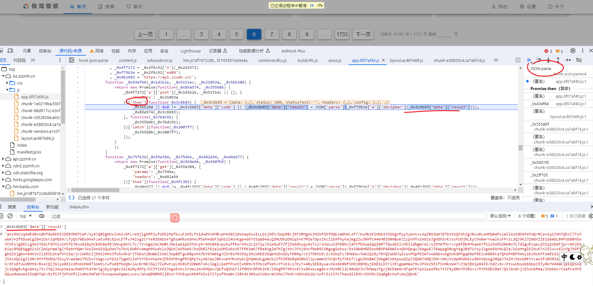
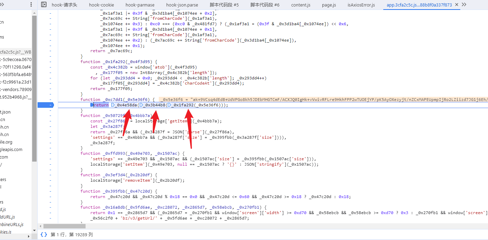
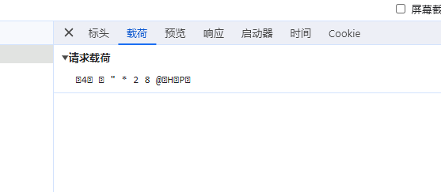
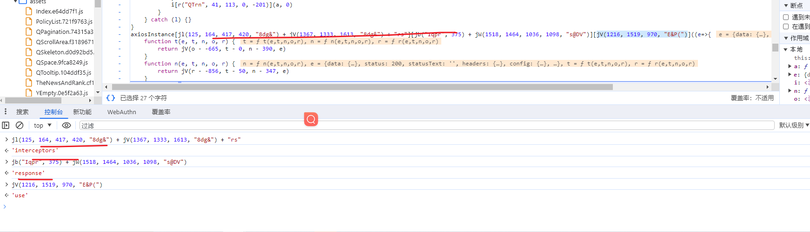
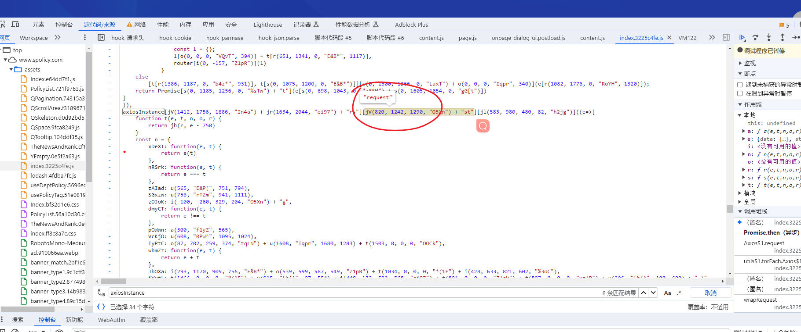
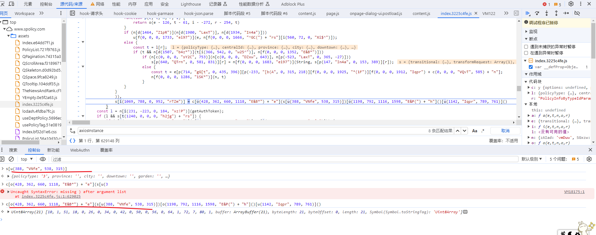
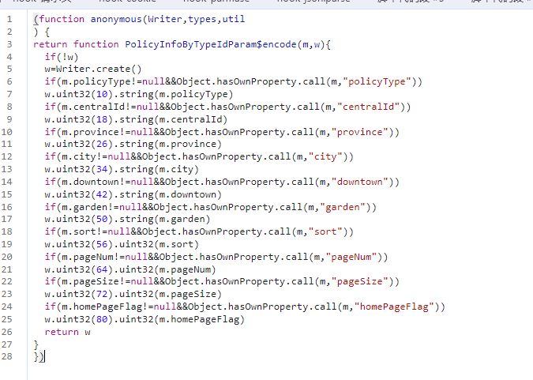
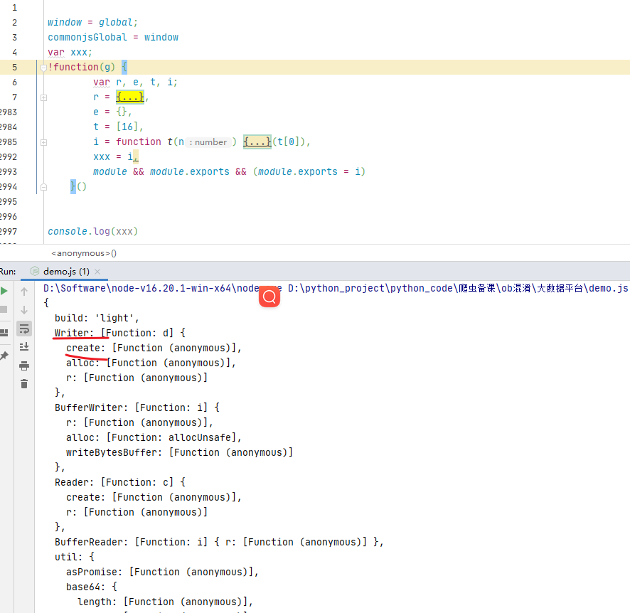

## JavaScript混淆技术

**学习目标:**

1. 了解 混淆的作用
2. 了解 ob混淆的方式
3. 了解 如何将代码进行混淆
4. 熟悉 解析混淆网站的过程


### 一. 混淆简介

#### 1. 为什么要进行混淆

> 对于网页来说，其逻辑是依赖于` JavaScript `来实现的，`JavaScript` 有如下特点：

+ `JavaScript` 代码运行于客户端，也就是它必须要在用户浏览器端加载并运行。
+ `JavaScript` 代码是公开透明的，也就是说浏览器可以直接获取到正在运行的 `JavaScript` 的源码。


#### 2. 压缩、混淆、加密技术

+ 代码压缩：即去除` JavaScript` 代码中的不必要的空格、换行等内容，使源码都压缩为几行内容，降低代码可读性，当然同时也能提高网站的加载速度。

+ 代码混淆：使用变量替换、字符串阵列化、控制流平坦化、多态变异、僵尸函数、调试保护等手段，使代码变得难以阅读和分析，达到最终保护的目的。但这不影响代码原有功能。是理想、实用的` JavaScript `保护方案

+ 代码加密：可以通过某种手段将 JavaScript 代码进行加密，转成人无法阅读或者解析的代码，如将代码完全抽象化加密，如 eval 加密。另外还有更强大的加密技术，可以直接将 `JavaScript` 代码用 C/C++ 实现，`JavaScript` 调用其编译后形成的文件来执行相应的功能，如` Emscripten` 还有 `WebAssembly`。


### 二.ob混淆

`OB` 混淆全称 Obfuscator，Obfuscator 其实就是混淆的意思，官网：https://obfuscator.io/ ，其作者是一位叫 Timofey Kachalov 的俄罗斯` JavaScript `开发工程师，早在 2016 年就发布了第一个版本。


#### 1. ob混淆的特点

1. 一般由一个大数组或者含有大数组的函数、一个自执行函数、解密函数和加密后的函数四部分组成；
2. 函数名和变量名通常以 `_0x` 或者 `0x` 开头，后接 1~6 位数字或字母组合；
3. 自执行函数，进行移位操作，有明显的 push、shift 关键字；

**混淆之前的代码**

```JavaScript
source code
function hi() {
  console.log("Hello World!");
}
hi();
```

**混淆之后的代码**

```JavaScript
var _0x3ed0 = ['1241023ikpdYM', 'Hello\x20World!', '291190xIUkft', '1251274vQVPdI', '124952hgHyOi', '1983KQSSIW', '247DipWFn', '7354VgseoG', '49680CQWPxl', '1ZTWTUo', '648lISKkF'];
 
function _0x4ed9(_0x475ec5, _0x372034) {
  return _0x4ed9 = function (_0x3ed0df, _0x4ed9c4) {
    _0x3ed0df = _0x3ed0df - 0x96;
    var _0x5a22f3 = _0x3ed0[_0x3ed0df];
    return _0x5a22f3;
  }, _0x4ed9(_0x475ec5, _0x372034);
}
 
(function (_0xa942b4, _0x57410c) {
  var _0x4e4980 = _0x4ed9;
 
  while (!![]) {
    try {
      var _0x1e86fa = parseInt(_0x4e4980(0x9b)) + parseInt(_0x4e4980(0x9e)) + -parseInt(_0x4e4980(0x97)) + -parseInt(_0x4e4980(0x9c)) * -parseInt(_0x4e4980(0xa0)) + -parseInt(_0x4e4980(0x98)) * parseInt(_0x4e4980(0x9d)) + -parseInt(_0x4e4980(0x96)) + parseInt(_0x4e4980(0x99)) * parseInt(_0x4e4980(0x9a));
 
      if (_0x1e86fa === _0x57410c) break;else _0xa942b4['push'](_0xa942b4['shift']());
    } catch (_0x178fbf) {
      _0xa942b4['push'](_0xa942b4['shift']());
    }
  }
})(_0x3ed0, 0xb3f61);
 
function hi() {
  var _0x81b55a = _0x4ed9;
  console['log'](_0x81b55a(0x9f));
}
 
hi();
```

#### 2. ob混淆结构

**一般obfuscator混淆的代码结构分为以下几部分：**

**第一部分: 定义一个数组**

-  数组里面保存了混淆或加密的变量，例如上面的_0x3ed0这个大数组，只是一个简单的形式数组，还可以再次混淆到看不出是一个数组。数组的位置也不一定在第一行，复杂一点的obfuscator混淆，会把这个数组放在比较隐藏的位置。

**第二部分：重构数组**

-  把数组_0x3ed0再次重构，例如，把数组的顺序重新排列等，这一部分一般用两个函数来处理，比如，上面的函数_0x4ed9和自执行函数，有内存泄漏的风险，**不建议格式化这部分代码。**

 **第三部分：自解密函数**

- 解密函数是用来解密的，有可能有定时器，由于本例子简单没有解密函数，其实一般网站不会使用这么简单的混淆，本文只是为了讲解方便才使用此示例代码，有内存泄漏的风险，**不建议格式化这部分代码。**

**第四部分：真实代码**

- 整个ob混淆的难度取决于此部分，这里面是加密前的逻辑，主要由真实代码（我们想要的代码）+ 控制流平坦化构成。
- 这一部分就是示例中的hi()函数及其调用，这是我们真正想要的代码，分析代码就是为了找出这一部分。

 **第五部分：可以删除的垃圾代码**

- 这部分主要由“控制流平坦化+无限debugger自执行函数+死代码注入”构成，一般不涉及业务逻辑，既然一般也有特殊情况，不要看到有debugger的，有控制流平坦化的就删除，具体问题具体分析。

**注意：**obfuscator混淆后的这五部分顺序不一定按上面列出的顺序，例如，有可能第三部分在在第一部分前面，第一部分会有可能在第三部分位置；另外，也不是每个obfuscator混淆的代码都包括这五部分，本列子中就只有三部分。


#### 3.ob混淆介绍

JavaScript 混淆完全是在 JavaScript 上面进行的处理，它的目的就是使得 JavaScript 变得难以阅读和分析，大大降低代码可读性，是一种很实用的 JavaScript 保护方案。

**JavaScript 混淆技术主要有以下几种：**

+ 变量混淆
  将带有含意的变量名、方法名、常量名随机变为无意义的类乱码字符串，降低代码可读性，如转成单个字符或十六进制字符串。

+ 字符串混淆
  将字符串阵列化集中放置、并可进行 MD5 或 Base64 加密存储，使代码中不出现明文字符串，这样可以避免使用全局搜索字符串的方式定位到入口点。

+ 属性加密
  针对 JavaScript 对象的属性进行加密转化，隐藏代码之间的调用关系。

+ 控制流平坦化
  打乱函数原有代码执行流程及函数调用关系，使代码逻变得混乱无序。

+ 僵尸代码
  随机在代码中插入无用的僵尸代码、僵尸函数，进一步使代码混乱。

+ 调试保护
  基于调试器特性，对当前运行环境进行检验，加入一些强制调试 debugger 语句，使其在调试模式下难以顺利执行 JavaScript 代码。

+ 多态变异
  使 JavaScript 代码每次被调用时，将代码自身即立刻自动发生变异，变化为与之前完全不同的代码，即功能完全不变，只是代码形式变异，以此杜绝代码被动态分析调试。

+ 锁定域名
  使 JavaScript 代码只能在指定域名下执行。

+ 反格式化
  如果对 JavaScript 代码进行格式化，则无法执行，导致浏览器假死。

+ 特殊编码
  将 JavaScript 完全编码为人不可读的代码，如表情符号、特殊表示内容等等。

总之，以上方案都是 JavaScript 混淆的实现方式，可以在不同程度上保护 JavaScript 代码。


#### 4. 实现ob混淆

安装ob混淆库

```
npm install javascript-obfuscator -g
```

安装完成后，`javascript-obfuscator`就是一个独立的可执行命令了。

##### 1. 代码压缩

这里` javascript-obfuscator `也提供了代码压缩的功能，使用其参数 `compact `即可完成` JavaScript` 代码的压缩，输出为一行内容。默认是 true，如果定义为 false，则混淆后的代码会分行显示。

```
const JavaScriptObfuscator = require('javascript-obfuscator');

const sourceCode = `
function myFunction() {
  var myVariable = 'Hello, World!';
  console.log(myVariable);
}
myFunction();
`;

const options = {
  compact: true, // 启用压缩
  controlFlowFlattening: true, // 控制流 平坦化
  controlFlowFlatteningThreshold: 0.75, // 控制流平坦化阈值
  deadCodeInjection: true, // 使死代码注入
  deadCodeInjectionThreshold: 0.4, // 死代码注入阈值
  identifierNamesGenerator: 'hexadecimal', // 生成标识符的方式
  log: false, // 关闭日志
  rotateStringArray: true, // 旋转字符串数组
  selfDefending: true, // 启用自我防御
  stringArray: true, // 启用字符串数组
  stringArrayThreshold: 0.75, // 字符串数组阈值
  // domainLock: ['example.com'], // 锁定域名
  debugProtection: true, // 调试保护
  disableConsoleOutput: true, // 禁用控制台输出
  unicodeEscapeSequence: false, // 禁用 Unicode 转义序列
  rotateUnicodeArray: true, // 旋转 Unicode 数组
};

const obfuscatedCode = JavaScriptObfuscator.obfuscate(sourceCode, options).getObfuscatedCode();

console.log(obfuscatedCode);

```

> 感兴趣的同学可以自行研究  


### 三.项目实战

#### 1. 案例1

##### 1. 逆向目标

+ ###### 首页：https://bz.zzzmh.cn/index
+ API：https://api.zzzmh.cn/bz/v3/getData
+ 目标：result: `ak+9VCsq4dEdB+UdVfGo8kh5JDEbMHGTCmF/`

##### 2. 逆向分析

- 解除无线debugger

```
Function.prototype.__constructor_back = Function.prototype.constructor;
Function.prototype.constructor = function() {
    if(arguments && typeof arguments[0]==='string'){
        if("debugger" === arguments[0]){
            return
        }
    }
   return Function.prototype.__constructor_back.apply(this,arguments);
}
```

- 当前加载的数据为动态数据加密,我们需要定位到解密的位置
- 找到发送ajax的位置,找到请求的回调位置,混淆的位置比较难找,需要一个个定位
- 或者通过hook`JSON.parse`的方式来进行定位,js是一定会去转换这个json数据的



- 可以看出数据是通过`_0xf79b3e['a']['decipher']()` 来进行解密的,我们需要跟进到方法里去找
- 进函数之后可以看到就是三个函数来进行解密的操作



- 扣函数代码就行

##### 3. 逆向结果

```JavaScript
function _0x3ed467(_0x58f7d4) {
    for (var _0x4f1bcd = [-0x6f, 0x34, 0x5b, 0x41, -0x41, 0x74, 0x77, 0x6a, -0x79, -0x52, -0x5, 0x50, 0x33, 0x61, 0x44, -0x53, -0x70, -0x33, 0x17, -0x2e, -0x22, -0x72, -0x37, -0xb, -0x7f, 0x5a, 0x21, 0x16, -0x1f, 0x32, -0x11, 0x14, -0x2c, 0xf, -0x5e, -0x7b, 0x76, -0x17, -0x3d, 0x72, 0x47, -0x68, -0x7e, -0x75, -0x51, -0x36, -0x12, -0x6e, -0x4, -0x5f, -0x5b, 0x5e, -0x50, -0xe, 0x78, 0x69, 0x55, 0x68, -0x56, -0x6c, 0x43, 0x19, 0x65, 0x6c, 0x10, -0x69, 0x6f, -0xa, 0x75, -0x49, 0x4d, 0x59, -0x1d, -0x62, -0x44, 0x70, 0x6b, -0x1, 0x56, 0x79, 0x58, -0x65, -0x7c, 0x45, -0x1e, -0x8, -0x71, -0x4a, -0x76, 0x39, -0x19, 0xc, -0x73, -0x6a, 0x5f, 0x7f, 0x54, 0x7c, -0x66, -0x1c, 0x49, 0x2b, -0x3c, 0x1c, 0x2e, 0x73, 0x1e, 0x7a, -0x4b, 0x7d, -0x43, -0x4d, 0x3, -0x7, -0x35, -0xd, 0x35, 0x4e, -0x48, 0x1, 0xb, -0x47, -0x27, -0x4f, -0x3, 0x13, 0x29, 0x7e, -0x2b, -0x7d, -0x1b, 0x22, 0x3f, 0x8, 0x48, -0x23, -0x29, -0x3f, 0x3c, -0x18, 0x66, 0x2f, -0x77, -0x67, -0x16, 0x2d, 0x3b, 0x40, -0x60, 0x31, 0x53, -0x6b, -0x78, -0x39, -0x46, 0x0, -0x26, -0x54, -0x28, 0x18, 0xe, 0x30, 0x1d, 0x2c, -0x24, -0x2f, 0x38, -0x5c, 0x26, 0x25, 0x4, -0x32, 0x67, 0xa, -0x59, 0x37, 0x71, -0x1a, 0x6e, 0x36, 0x24, -0x14, -0x4e, -0xc, -0x74, 0x46, -0x25, 0x5, -0x3e, -0x4c, -0x30, -0x40, 0x4f, 0x64, 0x28, 0x6, -0x3a, -0x5a, -0x13, -0x9, 0x27, 0x5d, -0x63, 0x15, 0x7, 0x1a, -0x2, 0x1b, -0x2d, 0x51, 0x3a, -0x7a, 0x4c, -0x42, 0x2, 0x5c, -0x2a, 0x62, -0x10, 0x9, 0x3d, 0x3e, -0xf, 0x63, -0x15, 0x1f, -0x38, 0x57, 0x11, -0x34, -0x45, -0x21, -0x3b, -0x55, 0x42, 0x4a, 0x12, -0x5d, -0x80, -0x57, -0x20, 0x2a, 0x20, -0x58, 0x6d, 0x60, 0xd, -0x6, 0x4b, -0x64, -0x31, 0x23, -0x61, 0x52, -0x6d, 0x7b], _0x39eb66 = 0x0, _0x46445e = 0x0, _0x1360a5 = 0x0, _0x596013 = new Array(), _0x411913 = 0x0; _0x411913 < _0x58f7d4['length']; _0x411913++) {
        _0x39eb66 = _0x39eb66 + 0x1 & 0xff,
            _0x46445e = (0xff & _0x4f1bcd[_0x39eb66]) + _0x46445e & 0xff;
        var _0x5e20d4 = _0x4f1bcd[_0x39eb66];
        _0x4f1bcd[_0x39eb66] = _0x4f1bcd[_0x46445e],
            _0x4f1bcd[_0x46445e] = _0x5e20d4,
            _0x1360a5 = (0xff & _0x4f1bcd[_0x39eb66]) + (0xff & _0x4f1bcd[_0x46445e]) & 0xff,
            _0x596013['push'](_0x58f7d4[_0x411913] ^ _0x4f1bcd[_0x1360a5]);
    }
    return _0x596013;
}

function _0x3ef903(_0x44e9d9) {
    for (var _0x39da63, _0x53f955, _0x16f530 = '', _0x134aef = 0x0; _0x134aef < _0x44e9d9['length'];)
        _0x39da63 = _0x44e9d9[_0x134aef],
            _0x53f955 = 0x0,
            _0x39da63 >>> 0x7 === 0x0 ? (_0x16f530 += String['fromCharCode'](_0x44e9d9[_0x134aef]),
                _0x134aef += 0x1) : 0xfc === (0xfc & _0x39da63) ? (_0x53f955 = (0x3 & _0x44e9d9[_0x134aef]) << 0x1e,
                _0x53f955 |= (0x3f & _0x44e9d9[_0x134aef + 0x1]) << 0x18,
                _0x53f955 |= (0x3f & _0x44e9d9[_0x134aef + 0x2]) << 0x12,
                _0x53f955 |= (0x3f & _0x44e9d9[_0x134aef + 0x3]) << 0xc,
                _0x53f955 |= (0x3f & _0x44e9d9[_0x134aef + 0x4]) << 0x6,
                _0x53f955 |= 0x3f & _0x44e9d9[_0x134aef + 0x5],
                _0x16f530 += String['fromCharCode'](_0x53f955),
                _0x134aef += 0x6) : 0xf8 === (0xf8 & _0x39da63) ? (_0x53f955 = (0x7 & _0x44e9d9[_0x134aef]) << 0x18,
                _0x53f955 |= (0x3f & _0x44e9d9[_0x134aef + 0x1]) << 0x12,
                _0x53f955 |= (0x3f & _0x44e9d9[_0x134aef + 0x2]) << 0xc,
                _0x53f955 |= (0x3f & _0x44e9d9[_0x134aef + 0x3]) << 0x6,
                _0x53f955 |= 0x3f & _0x44e9d9[_0x134aef + 0x4],
                _0x16f530 += String['fromCharCode'](_0x53f955),
                _0x134aef += 0x5) : 0xf0 === (0xf0 & _0x39da63) ? (_0x53f955 = (0xf & _0x44e9d9[_0x134aef]) << 0x12,
                _0x53f955 |= (0x3f & _0x44e9d9[_0x134aef + 0x1]) << 0xc,
                _0x53f955 |= (0x3f & _0x44e9d9[_0x134aef + 0x2]) << 0x6,
                _0x53f955 |= 0x3f & _0x44e9d9[_0x134aef + 0x3],
                _0x16f530 += String['fromCharCode'](_0x53f955),
                _0x134aef += 0x4) : 0xe0 === (0xe0 & _0x39da63) ? (_0x53f955 = (0x1f & _0x44e9d9[_0x134aef]) << 0xc,
                _0x53f955 |= (0x3f & _0x44e9d9[_0x134aef + 0x1]) << 0x6,
                _0x53f955 |= 0x3f & _0x44e9d9[_0x134aef + 0x2],
                _0x16f530 += String['fromCharCode'](_0x53f955),
                _0x134aef += 0x3) : 0xc0 === (0xc0 & _0x39da63) ? (_0x53f955 = (0x3f & _0x44e9d9[_0x134aef]) << 0x6,
                _0x53f955 |= 0x3f & _0x44e9d9[_0x134aef + 0x1],
                _0x16f530 += String['fromCharCode'](_0x53f955),
                _0x134aef += 0x2) : (_0x16f530 += String['fromCharCode'](_0x44e9d9[_0x134aef]),
                _0x134aef += 0x1);
    return _0x16f530;
}

function _0x4207c2(_0x2219f6) {
    for (var _0x9c7ad4 = atob(_0x2219f6), _0x2dd788 = new Int8Array(_0x9c7ad4['length']), _0x7c7af6 = 0x0; _0x7c7af6 < _0x9c7ad4['length']; _0x7c7af6++)
        _0x2dd788[_0x7c7af6] = _0x9c7ad4['charCodeAt'](_0x7c7af6);
    return _0x2dd788;
}

function _0x563330(_0x1e29f9) {
    return JSON.parse(_0x3ef903(_0x3ed467(_0x4207c2(_0x1e29f9))));
}


res = _0x563330('')
console.log(res)
```

- python代码

```python
import requests
import execjs


class JiJian():
    def __init__(self):
        self.headers = {
            "referer": "https://bz.zzzmh.cn/",
            "user-agent": "Mozilla/5.0 (Windows NT 10.0; Win64; x64) AppleWebKit/537.36 (KHTML, like Gecko) Chrome/118.0.0.0 Safari/537.36"
        }
        self.url = "https://api.zzzmh.cn/bz/v3/getData"
        self.js = execjs.compile(open('demo.js', encoding='utf-8').read())

    def get_data(self):
        data = {"size":24,"current":11,"sort":0,"category":0,"resolution":0,"color":0,"categoryId":0,"ratio":0}
        response = requests.post(self.url, headers=self.headers, json=data)
        return response.json()

    def parse_data(self, response):
        res = self.js.call('_0x563330', response['result'])
        # print(res)
        for i in res['list']:
            res = requests.get('https://api.zzzmh.cn/bz/v3/getUrl/' + i['i'] + '29', headers=self.headers, allow_redirects=False)
            self.save_data(res.headers['Location'], i['i'])


    def save_data(self, img_url, name):
        with open('壁纸/' + name + '.jpg', 'wb')as f:
            result = requests.get(img_url, headers=self.headers)
            f.write(result.content)
            print('正在下载{}'.format(name))


    def main(self):
        res = self.get_data()
        self.parse_data(res)

if __name__ == '__main__':
    jj = JiJian()
    jj.main()
```


#### 2. 案例2

简介：**octet**-**stream指任意类型的二进制流数据。**

##### 1.逆向目标

+ 地址：http://www.spolicy.com/
+ 接口：http://www.spolicy.com/info_api/policyType/showPolicyType
+ 目标：参数加密


##### 2.逆向分析

- 过无限debugger

```javascript
var _constructor = constructor;
Function.prototype.constructor = function(s) {
    if (s == "debugger") {
        console.log(s);
        return null;
    }
    return _constructor(s);
}
```

- 可以看到他的数据是请求载荷是加密数据数据信息是**octet**-**strea** 的二进制数据



- 这种数据就没有办法进行关键字定位
- 先通过xhr断点他的发包,可以看一下再构造请求的时候是不是一个加密的数据
- 要是构造的请求对象是为未加密的,但是抓包数据的数据是加密的数据,那我们就需要思考一下他是不是会有请求拦截器,拦截进行加密的
- 找请求拦截器会比较麻烦,我们可以直接跟响应的数据解析,一般有请求拦截就会同时有响应拦截



- 一般拦截器会回在同一个文件,我们可以直接在当前文件搜索`axiosInstance`, 看他后方有没有跟上request



- 可以看到请求拦截器应该是在这个位置,我们可以下断点,看看有没有进行触发

- 接着往下跟就能看到数据生成的位置

  

- 接着就需要扣`c[o(428, 362, 660, 1118, "E&B*") + "e"]`这些代码的实现过程
- 实现函数是一个异步代码,我们需要扣出来



- `Writer.create`方法我们需要找到生成他的位置,在js代码中可以看到,当前数据是一个自执行方法,感觉还是一个webpack的形式

- 我们可以直接扣下来,执行看里面是否有我们需要的方法 

  

- 现在就能执行得到我们想要的数据信息
- 执行完之后把`.finish().slice()`给补上
- `finish`是create的方法  
- `slice`可以用来取数组的数据

##### 3.逆向结果

- JavaScript代码

```
function PolicyInfoByTypeIdParam$encode(m) {

    w = xxx.Writer.create()
    if (m.policyType != null && Object.hasOwnProperty.call(m, "policyType"))
        w.uint32(10).string(m.policyType)
    if (m.centralId != null && Object.hasOwnProperty.call(m, "centralId"))
        w.uint32(18).string(m.centralId)
    if (m.province != null && Object.hasOwnProperty.call(m, "province"))
        w.uint32(26).string(m.province)
    if (m.city != null && Object.hasOwnProperty.call(m, "city"))
        w.uint32(34).string(m.city)
    if (m.downtown != null && Object.hasOwnProperty.call(m, "downtown"))
        w.uint32(42).string(m.downtown)
    if (m.garden != null && Object.hasOwnProperty.call(m, "garden"))
        w.uint32(50).string(m.garden)
    if (m.sort != null && Object.hasOwnProperty.call(m, "sort"))
        w.uint32(56).uint32(m.sort)
    if (m.pageNum != null && Object.hasOwnProperty.call(m, "pageNum"))
        w.uint32(64).uint32(m.pageNum)
    if (m.pageSize != null && Object.hasOwnProperty.call(m, "pageSize"))
        w.uint32(72).uint32(m.pageSize)
    if (m.homePageFlag != null && Object.hasOwnProperty.call(m, "homePageFlag"))
        w.uint32(80).uint32(m.homePageFlag)
    return w.finish().slice().toString('base64');
}


m = {
    "policyType": "3",
    "province": "",
    "city": "",
    "downtown": "",
    "garden": "",
    "centralId": "",
    "sort": 0,
    "homePageFlag": 1,
    "pageNum": 1,
    "pageSize": 7
}
console.log(PolicyInfoByTypeIdParam$encode(m));
```

- python代码

```python
import requests
import execjs
import base64
class dsjpt():

    def __init__(self):
        self.url = 'http://www.spolicy.com/info_api/policyType/showPolicyType'
        self.headers = {
            'Content-Type':'application/octet-stream',
            'User-Agent': 'Mozilla/5.0 (Windows NT 10.0; Win64; x64) AppleWebKit/537.36 (KHTML, like Gecko) Chrome/118.0.0.0 Safari/537.36',
        }
        self.js = execjs.compile(open('demo.js', encoding='utf-8').read())

    def get_data(self):
        data = {
            "policyType": "3",
            "province": "",
            "city": "",
            "downtown": "",
            "garden": "",
            "centralId": "",
            "sort": 0,
            "homePageFlag": 1,
            "pageNum": 1,
            "pageSize": 7
        }
        # 直接转bytes数据类型也可以
        # print(bytes(data1['data']))
        data1 = base64.b64decode(self.js.call('PolicyInfoByTypeIdParam$encode', data))
        res = requests.post(self.url, headers=self.headers, data=data1)
        print(res)
        print(res.text)

    def main(self):
        self.get_data()

if __name__ == '__main__':
    dsj = dsjpt()
    dsj.main()
```

