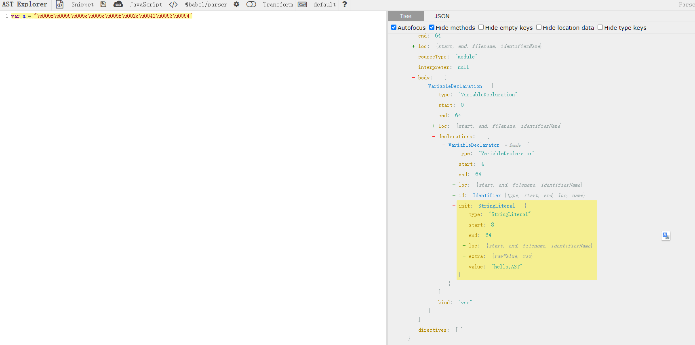
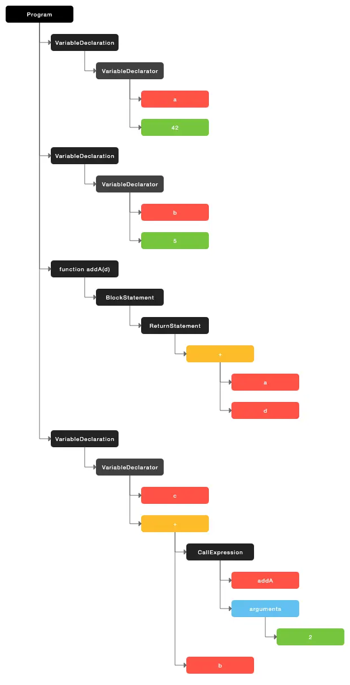
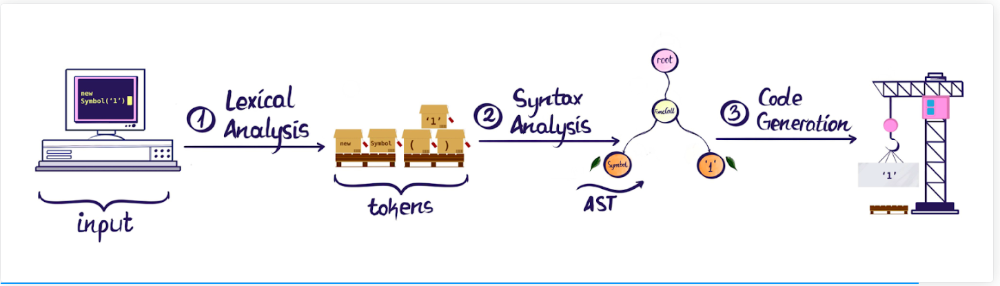
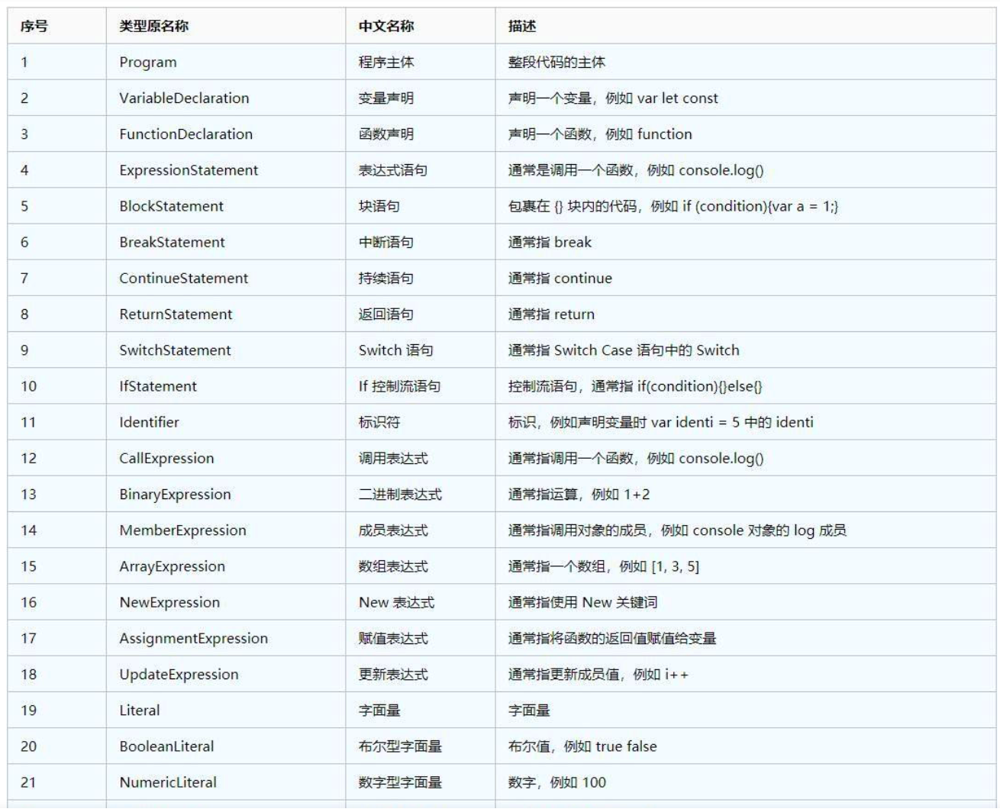
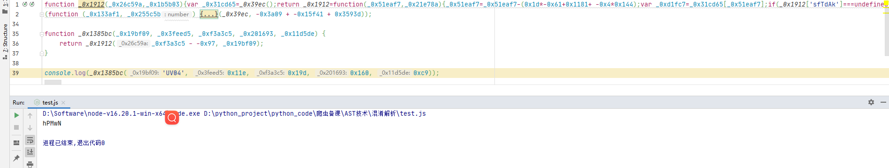

## AST 技术专题

**学习目标:**

1. 了解 ast 执行过程
2. 了解 ast 语法转换方式
3. 熟悉 如何转换代码
4. 熟练 使用 babel 执行命令

**前言:**

**V8 引擎介绍(js 的解释器): **

> 当前百花齐放的编程语言，主要分为编译型语言和解释型语言。

1. 编译型语言的特点是在代码运行前编译器直接将对应的代码转换成机器码，运行时不需要再重新翻 译，直接可以使用编译后的结果。
2. 解释型语言也是需要将代码转换成机器码，但是和编译型的区别在于运行时需要转换。比较显著的 特点是，解释型语言的执行速度要慢于编译型语言，因为解释型语言每次执行都需要把源码转换一 次才能执行。
3. 大多数解释性语言都需要通过解析源代码来构建 AST，以便在运行时执行代码。AST 是解释器的中间表示，它有助于实现代码的语义解释和执行。然后，解释器可以遍历 AST 并执行相应的操作来模拟代码的行为。

**V8 引擎执行 JS 代码都要经过哪些阶段**

1. `Parse`阶段： V8 引擎负责将 JS 代码转换成 AST （抽象语法树）；
2. `Ignition`阶段：解释器将 AST 转换为字节码，解析执行字节码也会为下一个阶段优化编译提供需要 的信息；
3. `TurboFan `阶段：编译器利用上个阶段收集的信息，将字节 码优化为可以执行的机器码；
4. `Orinoco`阶段：垃圾回收阶段，将程序中不再使用的内存空间进行回收。

> 其中，生成 AST 、生成字节码、生成机器码是比较重要的三个阶段。

**学习的目的**


### 一. 什么是 AST 技术

​ `AST` （Abstract Syntax Tree），译为抽象语法树，是编译原理中的一个概念，为源代码的抽象语法结构的树状表示，树上的每个节点都表示源代码中的一种结构，这种数据结构可以类别为一个大的 JSON 对象。通过 `AST` 技术，我们面对的就不再是各种符号混杂空格而成的文本字符串，而是一个严谨规范的 树形结构，我们可以通过对 AST 树节点的一系列操作，借助机器高效且精准地修改代码。 `AST `的用途很广， IDE 的语法高亮、代码检查、格式化、压缩、转译等，都需要先将代码转化成 AST 再进行后续的操作， ES5 和 ES6 语法差异，为了向后兼容，在实际应用中需要进行语法的转换，也会用到 `AST` 。 `AST `并不是为了逆向而生，但做逆向学会了`AST` ，在解混淆时可以如鱼得水.

AST 的用途很广， IDE 的语法高亮、代码检查、格式化、压缩、转译等，都需要先将代码转化成 AST 再进行后续的操作

> 通过 AST 解析网站：https://astexplorer.net/，左侧为我们要输入的 JavaScript 代码，右 侧为 AST 树状结构



#### 1. AST 对爬虫的意义

- 随着技术的革新，越来越多的前端为了保护其网站不被第三方爬取，使用了大量的混淆代码，让爬虫工 程师越来越难找到其核心参数加密代码。有时候定位到加密的地方，面对一大坨乱如麻的代码，内心也是拒绝的。
- 这个时候，希望有一种工具，尽可能的将被混淆的代码进行处理，使其可读性大大增加，使爬虫工程师 能够轻而易举的进行定位，抠出其核心的加密代码。
- AST 用在这里，只是一种辅助工具，并不能直接帮你找到核心的代码，还是得自己去分析，静态分析也好，动态调试也好，目的只有一个

#### 2.AST 在编译中的位置(编译器转换过程)

> 在编译原理中，编译器转换代码通常要经过六个步骤(其中词法分析, 语法分析, 代码生成是我们重点关注的)

##### 1. 词法分析

- 这个阶段会将源代码拆成最小的、不可再分的词法单元，称为 `token `。比如这行代码` var a =1` ；通常会被分解成 `var 、a、=、1、`; 这五个词法单元。另外刚才代码中的空格在 JavaScript 中是直接忽略的。
- 比如一下这一句话

```
2019年是祖国70周年
```

- 我们可以把这句话拆分成最小单元，即：2019 年、是、祖国、70、周年。这就是我们所说的分词，也是最小单元，因为如果我们把它再拆分出去的话，那就没有什么实际意义了。
- `Javascript` 代码中的语法单元主要包括以下这么几种：
  - 关键字：例如 `var`、`let`、`const`等
  - 标识符：没有被引号括起来的连续字符，可能是一个变量，也可能是 `if`、`else` 这些关键字，又或者是 `true`、`false` 这些内置常量
  - 运算符： `+`、`-`、 `*`、`/` 等
  - 数字：像十六进制，十进制，八进制以及科学表达式等语法
  - 字符串：因为对计算机而言，字符串的内容会参与计算或显示
  - 空格：连续的空格，换行，缩进等
  - 注释：行注释或块注释都是一个不可拆分的最小语法单元
  - 其他：大括号、小括号、分号、冒号等

##### 2. 语法分析

- 这个过程是将词法单元转换成一个由元素逐级嵌套所组成的代表了程序语法结构的树， 这个树被称为抽象语法树
- 上面我们已经得到了我们分词的结果，需要将词汇进行一个立体的组合，确定词语之间的关系，确定词语最终的表达含义。
- 简而言之，语法分析是对分词的语法进行归类和结构化

```JavaScript
// 举例
var a = 42;
var b = 5;
function addA(d) {
    return a + d;
}
var c = addA(2) + b;
```

- 会将所有的分词进行分类



##### 3.**语义分析**

- 在 AST 上进行语义分析，检查变量使用是否合法，进行类型检查，生成符号表，检查函数调用等。这是确保源代码语义正确性的重要步骤。

##### 4.**代码生成**

- 在 AST 上应用各种优化技术，并将 AST 转换为目标代码，可以是机器代码、字节码或其他形式的代码。这是生成可执行代码的最终阶段。

##### 5.**链接**

- 如果源代码包含多个文件，链接阶段将这些文件合并成一个可执行文件，解决符号引用等。

##### 6.**加载和执行**

- 生成的目标代码或可执行文件被加载到内存中并执行。



### 二.AST 语法学习

- 参考地址：https://www.babeljs.cn/docs/
- 在线解析：https://astexplorer.net

```javascript
//练习语法
var a = "\u0068\u0065\u006c\u006c\u006f\u002c\u0041\u0053\u0054";
```

#### 1. AST 输出树结构

1.  type: 表示当前节点的类型，我们常用的类型判断方法,就是判断当前的节点是否为某个类型。
2.  start: 表示当前节点的起始位。
3.  end: 表示当前节点的末尾。
4.  loc : 表示当前节点所在的行列位置，里面也有 start 与 end 节点，这里的 start 与上面的 start 是不同 的，这里的 start 是表示节点所在起始的行列位置，而 end 表示的是节点所在末尾的行列位置。
5.  errors:是 File 节点所特有的属性，可以不用理会。
6.  program:包含整个源代码，不包含注释节点。
    1.  sourceType: 通常用于标识源代码的类型，以告诉解析器或编译器它正在处理的代码是模块代码还是脚本代码(**Script**, **Module**)
    2.  body:包含了程序的主体代码，即程序的主要逻辑。
        1. **语句块**："body" 可能表示一组语句，通常是一个代码块，这些语句按顺序执行。
        2. **函数体**：对于函数或方法定义，"body" 包含了函数的主体代码，即函数内部的语句和逻辑。
        3. **类定义**：对于类定义，"body" 可能包含类的成员，如属性和方法。
        4. **模块内容**：对于模块或文件，"body" 可能包含文件中的顶级语句和声明。
        5. `declarations`:通常用于表示变量、常量、函数、类等的声明
        6. `id`:是函数,变量,类的名称
        7. `init`: 通常代表声明的初始化值
7.  comments:源代码中所有的注释会在这里显示。

#### 2.常见节点类型



#### 3.`babel`库学习

​ 根据官网介绍,它是一个 JavaScript 编译器，主要用于将 ECMAScript 2015+ 版本的代码转换为向后兼容 的 JavaScript 语法，以便能够运行在当前和旧版本的浏览器或其他环境中。

1.  `@babel/core` ：Babel 编译器本身，提供了 babel 的编译 API；
2.  `@babel/parser `：将 JavaScript 代码解析成 AST 语法树；
3.  `@babel/traverse` ：遍历、修改 AST 语法树的各个节点；
4.  `@babel/generator` ：将 AST 还原成 JavaScript 代码；
5.  `@babel/types` ：判断、验证节点的类型、构建新 AST 节点等。

```JavaScript
// 安装命令
npm install @babel/core --save-dev
```

##### 1. parser 库使用

- 将 JavaScript 源代码 转换成一棵 AST 树、返回结果(在这里赋值给 ast )是一个 JSON 结构的数据

```JavaScript
const parse = require('@babel/parser')
// JS 转 ast语法树
jscode = `var a = "\u0068\u0065\u006c\u006c\u006f\u002c\u0041\u0053\u0054";`
let ast = parse.parse(jscode);
console.log(JSON.stringify(ast,null,'\t'))
```

##### 2. traverse 库学习

- 节点插件编写与节点转化
- 你可以使用 `traverse` 函数来遍历 AST。通常，你需要提供两个参数：AST 和访问器对象。

```JavaScript
const parse = require('@babel/parser')
const traverse = require('@babel/traverse').default
// JS 转 ast语法树
jscode = `var a = "\u0068\u0065\u006c\u006c\u006f\u002c\u0041\u0053\u0054";`
// 转换js代码为ast树结构
let ast = parse.parse(jscode);

// 用查找定位节点(ast结构树, 访问器对象)
traverse(ast, {
	// 定位VariableDeclarator类别,path是定位之后的地址
    VariableDeclarator(path){
        console.log('Found identifier:', path.node.init.value);
    }
})

```

###### 1. path 属性语法学习

```
var a = "\u0068\u0065\u006c\u006c\u006f\u002c\u0041\u0053\u0054";
```

- `path.node `:表示当前 path 下的 node 节点
- `path.toString()` :当前路径所对应的源代码
- `path.parentPath` :用于获取当前 path 下的父 path，多用于判断节点类型
- `path.container` :用于获取当前 path 下的所有兄弟节点(包括自身)
- `path.type` :获取当前节点类型
- `path.get('')` :获取 path 的子路径

```
const parse = require('@babel/parser')
const traverse = require('@babel/traverse').default
// JS 转 ast语法树
jscode = `var a = "\u0068\u0065\u006c\u006c\u006f\u002c\u0041\u0053\u0054";
var a = "1111";`
// 转换js代码为ast树结构
let ast = parse.parse(jscode);

// 用查找定位节点(ast结构树, 访问器对象)
traverse(ast, {
    VariableDeclarator(path){
        // console.log(path.node); // 表示当前path下的node节点
        // console.log(path.type) // 获取当前节点类型
        // console.log(path.toString()); // 用来获取当前遍历path的js源代码
        // console.log(path.parentPath.node); //用于获取当前path下的父path，多用于判断节点类型
        // console.log(path.get('init').toString()); // 获取下面的节点
        // console.log(path.container); // 用于获取当前path下的所有兄弟节点(包括自身)

         // 只获取一个数据
        console.log(path.node.init.value);
        // 找到第一个后，可以停止遍历
        // path.stop();
    }
})
```

###### 2. 替换原有节点

- path.replaceWith :(单)节点替换函数
  - 还原数字相加： var b = 1 + 2
  - 还原字符串拼接： var c = "coo" + "kie"
  - 还原在一行的： var a = 1+1,b = 2+2;var c = 3;
  - 还原在一行的： var d = "1" + 1;
  - 还原在一行的： var e = 1 + '2';

```
const parse = require('@babel/parser')
const traverse = require('@babel/traverse').default
const types = require('@babel/types')
const generator = require("@babel/generator").default;


// JS 转 ast语法树
jscode = `var b = 1 + 2;
var c = "coo" + "kie";
var a = 1+1,b = 2+2;
var c = 3;
var d = "1" + 1;
var e = 1 + '2';
`
// 转换js代码为ast树结构
let ast = parse.parse(jscode);

// 用查找定位节点(ast结构树, 访问器对象)
traverse(ast, {
    BinaryExpression(path) {
        // 取出数组数据的单独对象
        var {left, operator, right} = path.node
        // 数字相加处理
        if (types.isNumericLiteral(left) && types.isNumericLiteral(right) && operator == "+" || types.isStringLiteral(left) && types.isStringLiteral(right)) {
            value = left.value + right.value
            // console.log(value);
            // 会把原来的节点当中的原来的值进行替换
            path.replaceWith(types.valueToNode(value))
            // console.log(path.parentPath.node)
        }

        if (types.isStringLiteral(left) && types.isStringLiteral(right) && operator == "+") {

            value = left.value + right.value
            // console.log(value);
            // 会把原来的节点当中的原来的值进行替换
            path.replaceWith(types.valueToNode(value))
        }
        if (types.isStringLiteral(left) && types.isNumericLiteral(right) && operator == "+" || types.isNumericLiteral(left) && types.isStringLiteral(right)) {

            value = left.value + right.value
            // console.log(value);
            // 会把原来的节点当中的原来的值进行替换
            path.replaceWith(types.valueToNode(value))
        }

    }
})
// 将ast还原成JavaScript代码
let {code} = generator(ast);
console.log(code)

```

- replaceWithMultiple 多节点替换函数，调用方式

> path.replaceWithMultiple(ArrayNode);

- 实参一般是 Array 类型，它只能用于 Array 的替换。
- 即所有需要替换的节点在一个 Array 里面 举例：对如下变量进行处理

```
替换前：var arr = '3,4,0,5,1,2'['split'](',')
替换后：var arr = ["3", "4", "0", "5", "1", "2"]
```

```JavaScript
const generator = require("@babel/generator").default;
const parse = require('@babel/parser')
const traverse = require('@babel/traverse').default
const types = require('@babel/types')
// JS 转 ast语法树
jscode = `
var arr = '3,4,0,5,1,2'['split'](',')
`
// 转换js代码为ast树结构
let ast = parse.parse(jscode);

traverse(ast, {
    CallExpression(path) {
        let {callee, arguments} = path.node
        let data = callee.object.value
        let func = callee.property.value
        let arg = arguments[0].value
        var res = data[func](arg)
        path.replaceWithMultiple(types.valueToNode(res))

    }
})

// 将ast还原成JavaScript代码
let {code} = generator(ast);
console.log(code)

```

###### 3. 自执行方法还原

```
!(function () {
    console.log('123')
})

```

- 插件编写

```
const parse = require('@babel/parser')
const fs = require('fs')
const traverse = require("@babel/traverse").default;
const types = require("@babel/types");
const generator = require("@babel/generator").default;

process.argv.length > 2 ? File1 = process.argv[2] : File1 = './_encode.js'
process.argv.length > 3 ? File2 = process.argv[2] : File2 = './_decode.js'

jscode = fs.readFileSync(File1, {encoding: 'utf-8'})
let ast = parse.parse(jscode);

const _jy = {
    UnaryExpression(path) {
        let {argument} = path.node;
        if (!types.isFunctionExpression(argument)) {
            return;
        }
        let {body, id, params} = argument;
        if (id != null || params.length != 0) {
            return;
        }
        path.replaceWithMultiple(body.body)
    }

}

traverse(ast, _jy)

let {code} = generator(ast);
console.log(code);
fs.writeFile(File2, code, (err) => {
});

```

###### 4.通用插件

> 假设 var d = true ? 1 : 2;还需要编写插件规则，有没有通用模板？

```
const parse = require('@babel/parser')
const fs = require('fs')
const traverse = require("@babel/traverse").default;
const types = require("@babel/types");
const generator = require("@babel/generator").default;

process.argv.length > 2 ? File1 = process.argv[2] : File1 = './_encode.js'
process.argv.length > 3 ? File2 = process.argv[2] : File2 = './_decode.js'

jscode = fs.readFileSync(File1, {encoding: 'utf-8'})
let ast = parse.parse(jscode);

const _jy = {

    "BinaryExpression|UnaryExpression|ConditionalExpression"(path) {

        // 防止溢出
        if (path.isUnaryExpression({operator: "-"}) ||
            path.isUnaryExpression({operator: "void"})) {
            return;
        }
        const {confident, value} = path.evaluate();
        if (!confident)
            return;
        if (typeof value == 'number' && (!Number.isFinite(value))) {
            return;
        }
        path.replaceWith(types.valueToNode(value));
    },
}

traverse(ast, _jy)

let {code} = generator(ast);
console.log(code);
fs.writeFile(File2, code, (err) => {
});

```

###### 5. evaluate()方法学习

- 针对作用域和引用，直接依据引用来计算出执行结果。

- 列子 1

```
navigator["\x75\x73"+"\x65\x72"+"\x41\x67"+"\x65\x6e"+"\x74"]
```

- 例子 2：

```
function _xl(){
	x = 1 + 2 + 3 +4 + 5 + 6 + 7
}
```

- 插件编写

```
visitor2 = {
    "BinaryExpression|Identifier"(path) {
        const {confident, value} = path.evaluate();
        confident && path.replaceInline(types.valueToNode(value))
    }
}
traverse(ast, visitor2)
```

###### 6. 编码类型还原

- 处理前:

```
var a = 0x25,b = 0b10001001,c = 0o123456,
d = "\x68\x65\x6c\x6c\x6f\x2c\x41\x53\x54",
e = "\u0068\u0065\u006c\u006c\u006f\u002c\u0041\u0053\u0054";
```

- 处理后

```
var a = 37,b = 137,c = 42798,d = "hello,AST",e = "hello,AST"
```

- 插件编写:

```
const transform_literal = {
    NumericLiteral({node}) {
        if (node.extra && /^0[obx]/i.test(node.extra.raw)) {
            node.extra = undefined;
        }
    },
    StringLiteral({node}) {
        if (node.extra && /\\[ux]/gi.test(node.extra.raw)) {
            node.extra = undefined;
        }
    },
}

traverse(ast, transform_literal)
```

###### 7. 合并变量声明与定义，这里的声明与定义是紧挨着。

- 处理前:

```
var a,b,c;
a = 1;
b = 2;
c = 3;
```

- 处理后:

```
var a = 1,b=2,c = 3;
```

- 插件编写

```JavaScript
const combinDefineAndNextAssgin =
    {
        VariableDeclarator(path) {
            let {scope, node, parentPath} = path;
            let {id, init} = node;
            if (init != null) return;
            let name = id.name;
            let nextSibling = parentPath.getNextSibling();
            if (!nextSibling.isExpressionStatement()) {
                return;
            }
            let expression = nextSibling.node.expression;
            if (!types.isAssignmentExpression(expression)) {//非赋值语句直接return
                return;
            }
            let {left, operator, right} = expression;
            if (!types.isIdentifier(left, {name: name}) || operator != "=") {//是否可以合并。
                return;
            }
            path.set("init", right);
            nextSibling.remove();
        }
    }
traverse(ast, combinDefineAndNextAssgin);
```

###### 8. 方法还原

- 处理前

```
function xl (arg,arg1){
    return arg + arg1
}
var xx = xl('\u0068\u0065\u006c\u006c\u006f','\u002c\u0041\u0053\u0054') // --- > var xx = 'hello ast'
```

- 处理后

```
var xx = 'hello ast'
```

- 插件编写

```JavaScript
const parse = require('@babel/parser')
const fs = require('fs')
const traverse = require("@babel/traverse").default;
const types = require("@babel/types");
const generator = require("@babel/generator").default;

process.argv.length > 2 ? File1 = process.argv[2] : File1 = './_encode.js'
process.argv.length > 3 ? File2 = process.argv[2] : File2 = './_decode.js'

jscode = fs.readFileSync(File1, {encoding: 'utf-8'})
let ast = parse.parse(jscode);

// 判断类型是是不是字面量
function isNodeLiteral(node) {
    if (Array.isArray(node)) {
        return node.every(ele => isNodeLiteral(ele));
    }
    if (types.isLiteral(node)) {
        if (node.value == null) {
            return false;
        }
        return true;
    }
    if (types.isBinaryExpression(node)) {
        return isNodeLiteral(node.left) && isNodeLiteral(node.right);
    }
    if (types.isUnaryExpression(node, {
        "operator": "-"
    }) || types.isUnaryExpression(node, {
        "operator": "+"
    })) {
        return isNodeLiteral(node.argument);
    }

    if (types.isObjectExpression(node)) {
        let {properties} = node;
        if (properties.length == 0) {
            return true;
        }

        return properties.every(property => isNodeLiteral(property));

    }
    if (types.isArrayExpression(node)) {
        let {elements} = node;
        if (elements.length == 0) {
            return true;
        }
        return elements.every(element => isNodeLiteral(element));
    }

    return false;
}

const CalcCallExpression = {
    FunctionDeclaration(path) {
        let {node, parentPath} = path;
        let {id, body} = node;
        let len = body.body.length;
        if (!types.isReturnStatement(body.body[len - 1])) {
            return;
        }
        // path.scope.getBinding 方法获取与该标识符相关联的绑定
        const binding = parentPath.scope.getBinding(id.name);
        // constant 属性表示标识符是否被认为是常量。如果标识符绑定在一个不可修改的值上（如字面量或函数声明），则该属性为 true
        if (!binding || !binding.constant)
            return;
        // binding.referenced 是一个属性，用于判断绑定对象是否在代码中被引用 引用true
        // parentPath.isProgram 方法来检查节点是否为顶级程序节点 顶级程序节点表示整个程序的根节点 最外层
        if (!binding.referenced && !parentPath.isProgram()) {
            path.remove();
            return;
        }
        // 定位到计算的方法
        let sourceCode = path.toString();
        if (sourceCode.includes("try") || sourceCode.includes("random") || sourceCode.includes("Date")) {
            //返回值不唯一不做处理
            return;
        }
        //直接eval，如果缺环境，让其主动报错，再补上即可。下同,函数声明eval不会报错。
        eval(sourceCode);
        try {
            let canRemoved = true;
            // binding.referencePaths 是 Babel AST 绑定对象的属性，用于获取与该绑定相关联的所有引用路径。
            for (const referPath of binding.referencePaths) {
                let {parentPath, node} = referPath;
                if (!parentPath.isCallExpression({"callee": node})) {
                    canRemoved = false;
                    continue;
                }
                let arguments = parentPath.node.arguments;
                if (arguments.length == 0 || !isNodeLiteral(arguments)) {
                    canRemoved = false;
                    continue;
                }

                let value = eval(parentPath.toString());

                if (typeof value == "function" || typeof value == "undefined") {
                    canRemoved = false;
                    continue;
                }

                console.log(parentPath.toString(), "-->", value);
                parentPath.replaceWith(types.valueToNode(value));
            }
            canRemoved && path.remove();
        } catch (e) {
        }
    },
}
traverse(ast, CalcCallExpression);

let {code} = generator(ast);
console.log(code);
fs.writeFile(File2, code, (err) => {
});

```

##### 3.fs 库学习

> 安装命令 npm install fs

- 读取文件

```
jscode = fs.readFileSync('encode.js',{encoding:'utf-8'})
```

- 写入文件

```
fs.writeFile('decode.js', code, (err)=>{});
```

##### 4. `generator`库学习

- 生成新的 js code ，并保存到文件中输出

```
const generator = require("@babel/generator").default;
let {code} = generator(ast);
_fs.writeFile('decode.js', code, (err)=>{});
```

- 删除所有注释

```
const {code} = generator(ast,opts = {"comments":false});
```

- Unicode 转中文或者其他非 ASCII 码字符。 是否压缩代码

```
const output = generator(ast,opts = {jsescOption:{"minimal":true}},code);
```

### 三.案例实战

#### 1. OB 混淆高级 1

- 打开著名的 JavaScript 在线混淆网站:

> https://obfuscator.io

- 解析最高级的 ob 混淆

##### 1. 解析混淆

- 定位你需要解析的数据

```
// 举例, 需要解析混淆之后的这种类型的代码
function _0x10de60(_0x37ef9e, _0x34cea9, _0x424356, _0x5b8b31, _0x530358) {
    return _0x3cf5(_0x37ef9e - 0x24b, _0x5b8b31);
}

_0x10de60(0x3fb, 0x507, 0x44c, 'vT&^', 0x4fd)
```

- 在代码中抠出执行返回数据的代码



- 和网页执行 js 之后进行对比,看看数据解析的是否正确
- 在控制台添加代码段,执行前先打上断点,搜索你解析的位置断点查看数据

##### 2. ast 还原

- 首先找到混淆的代码和我们刚刚执行的方法一样的代码,需要满足这样的规则

```
function _0x10de60(_0x37ef9e, _0x34cea9, _0x424356, _0x5b8b31, _0x530358) {
    return _0x3cf5(_0x37ef9e - 0x24b, _0x5b8b31);
}
```

```
// 收集方法
let fun_code = ''
let fun_name = []

// 找到需要替换的方法
const _func = {
    // 获取到所有的方法类型的ast节点
    FunctionDeclaration(path) {
        // 取出节点中的id, params, body
        let {id, params, body} = path.node;
        // 判断接受的参数长度是不是5, 函数代码长度是不是1
        if (params.length != 5 || body.body.length != 1) {
            return
        }
        // 判断函数的数据是不是一个返回语句
        if (!types.isReturnStatement(body.body[0])) {
            return;
        }
        fun_code += path.toString()
        fun_name.push(id.name)

    }

}
traverse(ast, _func)
// 执行方法  把方法都加载到当前的环境
eval(fun_code)
```

- 在获取到 js 里面调用的位置,需要满足`_0x10de60(0x3fb, 0x507, 0x44c, 'vT&^', 0x4fd)`这种规则
- 获取到符合这个规则的代码,然后通过 eval 来执行,因为这些方法我们已经全部扣下来了,所以是可以进行调用的
- 判断这个方法名字有没有在我们上面的函数中出现

```
// 判断类型是是不是字面量
function isNodeLiteral(node) {
    if (Array.isArray(node)) {
        return node.every(ele => isNodeLiteral(ele));
    }
    if (types.isLiteral(node)) {
    	if (node.value == null)
    	{
    		return false;
    	}
      return true;
    }
    if(types.isBinaryExpression(node))
    {
    	return isNodeLiteral(node.left) && isNodeLiteral(node.right);
    }
    if (types.isUnaryExpression(node, {
        "operator": "-"
    }) || types.isUnaryExpression(node, {
        "operator": "+"
    })) {
        return isNodeLiteral(node.argument);
    }

    if (types.isObjectExpression(node)) {
        let { properties } = node;
        if (properties.length == 0) {
            return true;
        }

        return properties.every(property => isNodeLiteral(property));

    }
    if (types.isArrayExpression(node)) {
        let { elements } = node;
        if (elements.length == 0) {
            return true;
        }
        return elements.every(element => isNodeLiteral(element));
    }

    return false;
}
const _xx = {
    CallExpression(path) {
        // 获取到执行方法的节点,得到callee和arguments
        let {callee, arguments} = path.node;
        // 判断执行的这个名字是不是一个标识符,方法有没有在我们刚刚抠出来的函数里面
        if (!types.isIdentifier(callee) || !fun_name.includes(callee.name)) {
            return
        }

        // 判断方法
        if (!arguments.length == 5 || !isNodeLiteral(arguments)) {
            return;
        }
        // console.log(path.toString())
        // console.log(111111)
        // 获取到符合要求的代码数据,并且执行
        let value = eval(path.toString())
        console.log(path.toString(),'---->' ,value)
        // 将结果替换成执行之后的结果
        path.replaceWith(types.valueToNode(value))
    }

}

traverse(ast, _xx)

```

- 在将字符串拼接的问题解决
- 在把文件的编码也全部解决

- 最终代码

```
const parse = require('@babel/parser')
const fs = require('fs')
const traverse = require("@babel/traverse").default;
const types = require("@babel/types");
const generator = require("@babel/generator").default;

process.argv.length > 2 ? File1 = process.argv[2] : File1 = './_encode.js'
process.argv.length > 3 ? File2 = process.argv[2] : File2 = './_decode.js'

jscode = fs.readFileSync(File1, {encoding: 'utf-8'})
let ast = parse.parse(jscode);

// 需要通过这个代码才能还原原本的数据,才能执行这些方法
(function (_0xa8ec3d, _0x2606de) {
    var _0x478f6c = _0xa8ec3d();

    function _0x2c978f(_0x81c36a, _0x5a59fd, _0x1deaca, _0x4f8a4a, _0x5be23b) {
        return _0x3cf5(_0x5be23b - -0x1dc, _0x1deaca);
    }

    function _0x2af083(_0x3033fc, _0x57432a, _0x11ac40, _0x4423ed, _0x407b57) {
        return _0x3cf5(_0x57432a - 0x2a5, _0x4423ed);
    }

    function _0x45fe89(_0x144f7d, _0x43c342, _0x3f94a5, _0x4554dc, _0x4477fb) {
        return _0x3cf5(_0x4477fb - -0x14f, _0x43c342);
    }

    function _0xa98447(_0x1b3bb3, _0x43843c, _0x5dd756, _0x276faf, _0x3bed7b) {
        return _0x3cf5(_0x43843c - 0x193, _0x5dd756);
    }

    function _0x30e393(_0x20d513, _0x1b8618, _0x3633fc, _0x455543, _0x476f9d) {
        return _0x3cf5(_0x1b8618 - 0x231, _0x455543);
    }

    while (!![]) {
        try {
            var _0x3d4edf = -parseInt(_0x2af083(0x677, 0x631, 0x6f1, 'T&$^', 0x610)) / (-0xc * -0x25c + -0x1169 + 0x573 * -0x2) + parseInt(_0x2af083(0x58d, 0x5eb, 0x516, '5*Kw', 0x6c6)) / (0x112c + 0x57 * 0x46 + -0x28f4) * (-parseInt(_0xa98447(0x4b8, 0x4b0, 'L82p', 0x4a6, 0x4ce)) / (0x71d * -0x5 + -0x5 * -0x4ff + 0xa99)) + parseInt(_0xa98447(0x476, 0x3af, 'qgCF', 0x2a5, 0x491)) / (-0x3b2 + 0x2ac + 0x7 * 0x26) * (parseInt(_0x2af083(0x66c, 0x634, 0x727, 'L82p', 0x588)) / (-0xa22 + 0x5 * 0x43 + 0x8d8)) + -parseInt(_0xa98447(0x3e6, 0x344, 'vT&^', 0x269, 0x333)) / (-0x2 * -0xf53 + 0x26e1 + 0x7b9 * -0x9) + parseInt(_0x2af083(0x5c4, 0x4c2, 0x405, '#2rS', 0x4b5)) / (0x1 * 0x2119 + -0x4b1 + -0x1c61) * (-parseInt(_0xa98447(0x4e0, 0x426, 'ZcMD', 0x4fe, 0x3d7)) / (0x15fc * -0x1 + 0x4fb + -0x31 * -0x59)) + parseInt(_0x30e393(0x5b6, 0x4a2, 0x520, 'L82p', 0x527)) / (0x171 * -0xa + 0x15 * -0x15a + 0x2ad5) * (parseInt(_0x2c978f(0x8a, 0x154, 'RNcz', 0x84, 0x94)) / (-0x1663 + -0x1 * -0x10a3 + -0xf7 * -0x6)) + -parseInt(_0x2af083(0x501, 0x4d3, 0x59a, 'WNR(', 0x449)) / (0x2 * 0x9e9 + -0x228a + 0xec3) * (-parseInt(_0xa98447(0x49c, 0x3c3, 'LDmE', 0x30a, 0x3a2)) / (0x66f + 0xe25 + 0x18 * -0xdb));
            if (_0x3d4edf === _0x2606de) break; else _0x478f6c['push'](_0x478f6c['shift']());
        } catch (_0x26a20f) {
            _0x478f6c['push'](_0x478f6c['shift']());
        }
    }
}(_0x2c4e, -0x1127f + 0x105241 + -0x52ff3));
function _0x3cf5(_0x43ba1f,_0x430c41){var _0x50958e=_0x2c4e();return _0x3cf5=function(_0x1ebf43,_0x3465d6){_0x1ebf43=_0x1ebf43-(-0x397*0x8+0x248a+ -0x632);var _0x3370b8=_0x50958e[_0x1ebf43];if(_0x3cf5['AatHvX']===undefined){var _0xa2d549=function(_0x28385a){var _0x2e18f7='abcdefghijklmnopqrstuvwxyzABCDEFGHIJKLMNOPQRSTUVWXYZ0123456789+/=';var _0x178072='',_0x492491='',_0x58f562=_0x178072+_0xa2d549;for(var _0x15163c=0x341+ -0x4*-0x52f+0x45*-0x59,_0x4e0ca7,_0x6210d3,_0x2413e1=0x1cdd*-0x1+ -0x2*0x163+0x5b*0x59;_0x6210d3=_0x28385a['charAt'](_0x2413e1++);~_0x6210d3&&(_0x4e0ca7=_0x15163c%(-0x25d5*0x1+ -0x31a*0x9+0x1c7*0x25)?_0x4e0ca7*(-0xf06+0x6*-0xbf+ -0x9e0*-0x2)+_0x6210d3:_0x6210d3,_0x15163c++%(-0x1*-0x19f9+0x3*-0xbd8+0x2b*0x39))?_0x178072+=_0x58f562['charCodeAt'](_0x2413e1+(0x2083+0x124d*0x2+0x1*-0x4513))-(-0x1*0x3a1+ -0xe3*-0x1+0x2c8)!==-0x5*-0x517+0xe76+0x11*-0x259?String['fromCharCode'](-0x107b+ -0x1*0x4bb+ -0xf*-0x17b&_0x4e0ca7>>(-(0x2456*0x1+ -0xb3b+ -0x1919)*_0x15163c&0x1*0x9bb+0x1*0xf63+0x4*-0x646)):_0x15163c:-0x178c+0x10ab+0x6e1){_0x6210d3=_0x2e18f7['indexOf'](_0x6210d3)}for(var _0x744be1=-0x3*-0x161+0x17*-0x7+ -0x382,_0x28b33f=_0x178072['length'];_0x744be1<_0x28b33f;_0x744be1++){_0x492491+='%'+('00'+_0x178072['charCodeAt'](_0x744be1)['toString'](0x1d3+0x18b4+ -0x10f*0x19))['slice'](-(0x1df3+ -0x2444+0x653))}return decodeURIComponent(_0x492491)};var _0x3c0acf=function(_0x2e84c5,_0x1862f9){var _0x5bc8d1=[],_0x5005f4=-0xf94+0x1*0x25c9+ -0x1635,_0x209431,_0x11e8b4='';_0x2e84c5=_0xa2d549(_0x2e84c5);var _0x33b05b;for(_0x33b05b=-0x22f9+0x1*-0xef8+0x31f1;_0x33b05b<0x58d+0x91d*-0x1+0x490;_0x33b05b++){_0x5bc8d1[_0x33b05b]=_0x33b05b}for(_0x33b05b=0x814*0x1+ -0x2037+0x1823;_0x33b05b<-0x7+ -0x413*-0x6+0xb*-0x221;_0x33b05b++){_0x5005f4=(_0x5005f4+_0x5bc8d1[_0x33b05b]+_0x1862f9['charCodeAt'](_0x33b05b%_0x1862f9['length']))%(0x4c*-0x45+0x2088+ -0xb0c),_0x209431=_0x5bc8d1[_0x33b05b],_0x5bc8d1[_0x33b05b]=_0x5bc8d1[_0x5005f4],_0x5bc8d1[_0x5005f4]=_0x209431}_0x33b05b=-0x1ea*-0x7+0xbd8*-0x1+ -0x18e,_0x5005f4=-0x677*-0x3+ -0x1cb6+0x35*0x2d;for(var _0x5496a7=0x402+0xca9+ -0x10ab;_0x5496a7<_0x2e84c5['length'];_0x5496a7++){_0x33b05b=(_0x33b05b+(-0xb8*-0x13+0x309*-0x7+ -0xc*-0xa2))%(0x18bb+0x25ff*0x1+0x3dba*-0x1),_0x5005f4=(_0x5005f4+_0x5bc8d1[_0x33b05b])%(0x37*-0x45+0x12e+0xea5),_0x209431=_0x5bc8d1[_0x33b05b],_0x5bc8d1[_0x33b05b]=_0x5bc8d1[_0x5005f4],_0x5bc8d1[_0x5005f4]=_0x209431,_0x11e8b4+=String['fromCharCode'](_0x2e84c5['charCodeAt'](_0x5496a7)^_0x5bc8d1[(_0x5bc8d1[_0x33b05b]+_0x5bc8d1[_0x5005f4])%(-0x10af*-0x2+0x137d+ -0x33db)])}return _0x11e8b4};_0x3cf5['daLkGh']=_0x3c0acf,_0x43ba1f=arguments,_0x3cf5['AatHvX']=!![]}var _0x5d420c=_0x50958e[0xfd*0x22+ -0x1e17+0x1*-0x383],_0x40d8e6=_0x1ebf43+_0x5d420c,_0x475b00=_0x43ba1f[_0x40d8e6];if(!_0x475b00){if(_0x3cf5['WokXLu']===undefined){var _0x3113ab=function(_0x5417dd){this['alfNlI']=_0x5417dd,this['NFJXUT']=[-0xd7e+ -0x3*0xa7e+0x1d*0x18d,-0x2703+ -0xcc5+0x33c8,0x192f+0x2218+ -0x3b47],this['LiZPGu']=function(){return'newState'},this['NsljsG']='\x5cw+\x20*\x5c(\x5c)\x20*{\x5cw+\x20*',this['lalJRX']='[\x27|\x22].+[\x27|\x22];?\x20*}'};_0x3113ab['prototype']['nAxlXC']=function(){var _0x2948ef=new RegExp(this['NsljsG']+this['lalJRX']),_0x2921b4=_0x2948ef['test'](this['LiZPGu']['toString']())?--this['NFJXUT'][0x999+ -0x7*-0x3b7+ -0x2399]:--this['NFJXUT'][-0x21b2+ -0x126f+0xa6d*0x5];return this['CmyLjs'](_0x2921b4)},_0x3113ab['prototype']['CmyLjs']=function(_0x170023){if(!Boolean(~_0x170023))return _0x170023;return this['XatjfO'](this['alfNlI'])},_0x3113ab['prototype']['XatjfO']=function(_0x265cde){for(var _0x5dcbbe=-0x1*-0x2152+ -0x1*-0x9d2+ -0x2b24,_0x398ae1=this['NFJXUT']['length'];_0x5dcbbe<_0x398ae1;_0x5dcbbe++){this['NFJXUT']['push'](Math['round'](Math['random']())),_0x398ae1=this['NFJXUT']['length']}return _0x265cde(this['NFJXUT'][-0x1*-0x3f1+ -0xe90+0xa9f])},new _0x3113ab(_0x3cf5)['nAxlXC'](),_0x3cf5['WokXLu']=!![]}_0x3370b8=_0x3cf5['daLkGh'](_0x3370b8,_0x3465d6),_0x43ba1f[_0x40d8e6]=_0x3370b8}else _0x3370b8=_0x475b00;return _0x3370b8},_0x3cf5(_0x43ba1f,_0x430c41)}function _0x2c4e(){var _0xdf2a2a=['sSk0jmoxWQ4','g8kqW7nJW5i','WPWYvmo9WOy','W7NdLCoRWOFcNa','omoyW6ZdNGe','WO8ujMZdIW','qSoYWPLBW4y','WQLdhHdcUq','Cf0qW6ZcSW','WQeTsSoYWO8','W7VcPrW9W7e','W40DW5dcRg8','e8kbDSoCWQm','W44pW6WIiq','WQLsW5PfWQK','W5VdMqegWPm','j2BdO0xdHq','WPyusmoZWQq','WRlcPNRdPhS','aIFcTKFcNG','WOGrv8oCWOy','Bg/dH8orhq','a8oyAetcSa','l8kpFSokWO0','wmoUWPe','WOOtsSobWPy','eZZcT0dcTW','WRGlouRdUa','fxJdNhRdUa','muRdN0tdGG','W7KqbCkpjW','mmoeW4/dIbO','BSkrbmoxFq','qfFdLSo6lq','WQSWW414ea','W6dcS8k6vaW','WQftdSkl','WOTgWRpdRYJcULhdHmkuumk3WRX6','W7RcT8k2WPNdPW','t8kMACkZW4O','WPJdKbNdQKi','WOead2hdQW','w305W67cPG','W7m9WQupAG','DSkaDbpdQW','fX3cTNTM','emkdx8o9WRC','cSkItCkrW4y','W7eDWPOSqG','n8orW7VdRWO','msJcRcm','W6XjfmkyW5BdMrvRcgL1Aa','WRmwBCo6WOu','W5hdPmk7W7rK','CCo1fZ90kmk5W5a','WOSvWOJdQqa','FSkFW74','ymkQFmk0W7u','sSo4W4FdNJK','WRCqwSoGWOa','ruO9W5FcLq','s8olWObrW5S','W4eYW582ja','W7hcQ8k7','ybWJrMK','mCkMwmopWRm','W6PrWPvsW60','eCoxW4RdNYK','WOmhkeRcOa','zCokWQXvW6W','W57cSmkisG0','jrdcU01m','sSkZk8onWRq','k8oilCoIF8k5vJS','W5XWdH3dQq','W4ioW6qLdG','W4b0WOjG','BSk4W70bwq','tvJdHCoK','l8ohz8oIAmkdBsNdMG','agCdW5yy','DmkifSoGtG','WQpdT8kuhmo6','W5C7W5RcKha','DSoUWRvZW7W','WRe6zCopWPy','eCowW5FdLZK','W4fYWPLQW6e','W7WKcSkh','iSo8FMBcUW','WQ0aWOBdIH8','hmkjW5jgW6u','zGmZz2a','W6NdS8oFWRNcRa','xvldPSokhq','W6bNWQnRW5m','W5dcNXC9W5S','BSoEW4tdKJ0','WQLHaqdcIW','WQWyqSocWOC','WOycCNtdLG','smoiW7JdPtm','W6NcLYtdTLG','xSkCj8oRvG','eCk3W4lcL1m','W6jGWR3cRbC','W68bW4VcTM4','yCkQqJBdRa','CfCEW4FcSq','WQ1SoXtcVG','WQ04uCozWRG','W7tdOmohWRNcTW','FSkBnCow','WRuZW7TcnW','WRu7W7DGlq','g1ddQ0RdMa','W7lcPSkrWQ7dKa','fmonW47dOHe','h8o8WRhdJI0','WOK3W4vEeG','DSoFW7ldQaW','WPe2WOVdTay','vgtdJSogaq','WQKksSodWPm','WRldVSokW5On','W71RoqVdQa','jCkDW4VcIfe','W687WQCJsW','W7fXWOxcJJO','W5pcNJmIW5W','WOVdHe5+WOyIfu4eyfFcN8kL','g8owChVcIW','WQuVDCopWPi','DmkEW7C8rG','W7pcRSkDWRxdIq','W7ddQ8kEfGu','v8kll8oKBa','uvxdK8oebG','W4RcGCkoWQ7dNa','W5BcMXW','Cgvnmq','W4PtWOpcPr8','W7vIWP/cMsy','WPGRs8oGWOC','weRdNmoFjq','WPynW7Tjmq','hmkfW618W4C','WP11fq/cNG','W7tdJmoaWRRcOq','WQ4lv8ohWQW','ctRcNhLN','WPmjjuFdSW','WOW3WPzdW54','WOKwsmo0WQG','xCkBD8kjW6i','WPL2W4D4','WPpcTXVcVr0','WPfVW4rdWP0','WP7cQvfU','WQGsjx7dVW','falcQN7cTa','lCkEghhcHW','hmoPC8kiW7ddSSkQgf1byW','tmk4bSoBWOi','W5GIW4eBea','WRNcVdBcQq','W7SeW6ubfq','yCk9j8o4WRC','Eeb2iu0','qmkzAmkwW5a','WP5mu1/cLq','wmkzDCkf','i8onW7/dHWe','WOm5aNldGW','jmknW4NcJL0','gCk/bSkyW7a','W5n2cJRdHa','W58viSk0jq','D8khjCoqzW','fSoMWQRdJdO','qSknwIZdQq','xmoRWOrkW6S','WQGCqSoz','hfxdK2JdSW','eXJcRgBcVG','W5yVWQuRsG','ft/cTvdcOq','t3FdS8oflW','WOWQW5i4','WRiYW4erta','rqZdISkIfW','z8kaW7qKEq','lMldQghdJa','WO8MWPj/W5y','s8ozWRLLBG','nJJcVSopWOy','vr42AG','W7yqW7pcILi','zmkOCmklW6e','u8kjmmooWOO','vMCmW4pcIa','hCkSdCk0W7W','W6NdT8obWRNcTG','WRyhc1RdOG','b8oyW4RdUXO','gmk7W67cRxC','dhOE','W6CIb8kadG','WO8BaxNdSq','c3O4W7Se','W4DvWQNcUsO','nmo3WRpdQbi','gmkRW58zWRC','W6HpWPvgW5O','kNyjW6iJ','WOhcRSoQg8oi','C8kqma','fXxcPhJcUa','wg7dPmo8bG','x0JdMmoZhW','omkkarfy','W5HsWPXGW6ldJCoVvq','W4JcJ8k1yr8','WOmWqcBdOW','W4TQWPv1W6C','C8ozWQvOW5O','tNBdVmoHgW','W70NWOW+FG','W6rypYhdOG','WQNdSSoJWQlcTYe0','WRRcPsJcOsO','b8ovW7hdPa0','o8ofWRtdQW4','WR0fW6DxjW','c3JdILNdOW','W6pdSmknW4Lp','W5tdKmojWRBcNq','W5fsW4WHWOZcHmoUxSoyW48JuW','WR7dRSoseKZcKSoKs8kMc3BdRXi','ax4nW6eT','WP/dVmkTcCos','W5W+W5dcLvK','m8okfMNcLq','fHNcSxXK','W5b7WQVcUGK','xCkvWPBcOem','WQWCu8oA','W5m1W4dcGfq','WPiHWOj4W4e','t1SgW7pcHa','z1tdOCoUaG','cCkqW69MW58','FMLnmMK','W7C4W5CrkW','smkVtSkMW6W','WRPEWObdvXRdNxTHoCow','zCkeW7O7xq','WRxcSSohWPjPW4qbBq4v','WQ3cMH3cPaO','jCo/s2ZcMq','WRGYW4fccq','uLddU8osiW','WQJcScZcHd0','kmk1asDB','WQFdKqtdT3W','W74wWQisEq','haFcPmo2WRO','kCksvCoiWO0','pmovvLpcNq','WOibySoyWOe','WQWaumol','WOjTW414WRW','D8kSFYy','fNeyW4ip','o8kWW7NcNfK','ySklW5yOFq','W5GmcSkGlW','s8o6W6xdVrG','W4HGWP7cTHS','CYfzfda','iSkicSk4W7i','W54SW7DUgW','WP1OW55oWRO','W4pdUSo7WQxcVq','o8o4W6ZdIHW','zwfwd1S','B1ddJCoTja','ytymDum','W6a7W4mXbG','W7S+W5VcGeS','WOKDia','WOKLdK3dUG','W6NcLtm2W48','WRJcUJBcVJW','eLddKxVdOG','WQjmW5XVWOO','qmk0wqVdUa','W7SMWOmMDa','W4VcKXibW4y','k8kar8kVW7i','WQKrl3NdVW','WQ/dPtldGKa','cmkfcmkKW4G','W7ldQ8kqW4G','cvFdQ0/dUa','WQKFWPRdNrq','W6HxW5VcULn3hSoylx/cG8kf','FKDInh4','W6ZcOmkVWOS','W61OWOLGW48','W6RcQ8o8WOVdRq','W40aW6lcU3G','mCoEyhlcQG','WRxcSWdcNbG','m8kSW4NcQeC','vWZdTxBdQG','WP8Smv3dVq','W7lcKrCRW5e','af/dTxhdMG','WOuVxSokWQ0','WRugc37dNG','C0BdPx9eW7xdJdNcMG','Emo8qxKxymkxW6ddJ8k8qhO','eHFcS2tcVG','AfWQW70','W7RcU8k2Dbm','bmoYW47dLbi','tID/FJ0','WR5RBghcUG','pSkYgSkMW6q','FKqBW7VcTW','cmkEECoQWRC','WPNcSdRcVJ4','pSkiwSodWRC','W6b/WRJcRHO','vCkfW6OMsW','W4uQWRyZxa','W7SOdmkPeW','rSktW7OkDW','pCkQlHq','W5r2WONcKJC','amo3WQJdJG','W5OrW4/cLNS','CmoSmtNdOW','WPBdJ8kZe8ov','W53dI8oKWQhcRa','q8kWmCoFWOW','W4fhWOngW7S','F8k3ACk9W68','W781WRSKAW','AmoNW7tdTHy','WPmKW5W2WQdcT3ddNSkYlL7dQq','dJNcSxjN','WO3dP8kSgq','WQ8YASoFWPi','W5JcNruJ','tmo9vSoAWQqVWQ/cLW','WOqivSoDWQ0','uCorW6NdRq8','mCk2W5jfW4G','WPPRfG/cJq','WR8Sn0RdPW','WRVdHmkygSop','WPjHW554WQa','ySoRWPbiW7K','FvabW4VcNW','W6HyWOHmW5i','yCorW43dSa','W5nXbsddNG','A38hW6JcNa','WOLngsVcNa','F8kNW4eOwW','x8oZWOjaW6S','AZOAEvm','t8kyA8kLW7W','W7VcQSkYWOZdSq','WRmmWQhdJWG','eu3dO2ddTG','W74vWORdUbi','lgxdSuRdMW','ymkJqchdRq','jmksoSk4W68','pYxcPmo3WOa','W60yW47cT18','WPD+W4DzWOu','W63cSCkOWQRdOa','kYBcLNLi','W4rNgZy','pmktdmkcW54','W5BcMIiEW4G','WRH4pdZcHq','c8kQEmokWR4','Dwfpiuq','c8kgvmo2WQ4','cSkhdmkdW5W','W5vMcdBdMG','oSkdE8oQWQa','a8o5WONdLde','dfFdHK/dSa','WPL2W555WQC','WRxcJcZcTve','WPBdNmkipSoy','F1WBW5hcHa','d1GSW4q8','W5zcWRZcGrG','W7ddQmoFWQRcVq','w3WHW5BcOW','AmkBi8owFq','ymkwe8oSWOe','W45YWOS','WPjJD0JdVa','WQXRCgtcTW','WR43zmoPWQi','WRyxyCoLWOO','W4mOWPy4WOCUAwZdOc8','yNddLSozdW','De3dVSoGhG','lxxdPNFdMG','WOeqW5P8nq','WPvlsfZcKa','CfyBW4xcHa','ocqCB0y','W7fLWQ7cTae','W5G0WPSexa','ufpdHSoLhW','k0pdNvNdJa','vcrpWOvuWPGaA3yguSor','BK3dUCoggq','E0nUgwO','W6ZcQSkpWOVdTW','W54XWRi','x3u2W4hcUW','W61FWR7cQHC','WP9jwSkTzW','WOvwAudcKa','W57cImkBWRVdJW','lCojW77dVrG','h8k6W6DjW74','W4Wfd8kG','WRujWONdOW','k8oyvNNcJG','WQRcUIlcUGq','WQOmq8oAWO0','WR4oWOhdQa','W6/cSXOEW5q','WO8ACmoIWOS','W6JdSCklW5ri','WOedn1tdSq','iIeAnda','W6GHW4xcJfK','WPFcLW/cRZS','WPztveZcIa','BuyWW7FcUq','W5uLtSkwfq','WQGIWQVdJWa','q8oUW5zgW7y','WPqCfeZdUG','rCk9Fq/dSq','W7JcTCkXuqS','W5j1WP1mW68','sK3dMSo5hW','gCozW5xdQYK','W4e3WQ80EG','xSkje8o6BG','F8kDeSoSBq','rKPrexC','u3y8W6xcTa','wZCbA2a','F8kQnmoXEG','WPCxumoCWRe','fSoFW7ddJWa','AmkRn8o6WQm','W7NcTCkSWPpdVa','o2RdSvldTa','s8ktiCohtG','mmkEW6lcNvm','e8oiW5ddRrW','yYeFE10','WOBdICkacmo6','fCoTuwf+','W7/cUra3W58','W5jQW4T4WQy','ns/cSmojWOO','W4lcG8klzJO','hmk/W5pcRua','WRKYBSo/WPq','kXlcR2/cUa','qLpdSCoF','W6WeW5GgeW','hCkgbbTw','zg13bhC','hmkJW4DqW58','W6/cTCkmvG0','eCkPiIrq','ESk0itLnfSkm','W4yldCoSya','WPJdMcFdNxq','g8oEW4RdPWC','W4z3WPHvW5q','aCkoW7G','C3C+W5pcVG','DmowW5VdKHi','W6KbjSkKhq','FfddLCoHiW','WOHcWRBdOsxcVLBdV8kXCCk3WRbk','WQBdSSoDhYi','nb7cNxb3','WPK/l1xdGG','W4HrWRLWW4u','WPCBumo8WQ0','W47cKSkYWRpdIa','WPRcPs3cGrW','WPqNWR5xW5m','W4n7gGFdHG','WOBdOmkL','A2KnW6hcQa','WQGsWRHyW5S','yCoeW47dRLy','W47cKqGZ','W6VcSCk9WOVdOa','WO/cRrFcLWu','W6vtWQbiW4m','smk3W7b4W4O','A8oEW4y','rWKgrNG','tvntj3i','xCoeWPvuW6W','W4JcKSkeqqG','jsxcV8oiWOy','WQm4WRNcSHS','WRW6W4Pd','bNSxW4my','W4TZWOvW','wCkdW7qCra','W7G1W5dcV04','W53cVSo7tCkkW5/cPCkEq8kpq0rH','u8oPWPHw','WR7dQSoBfu7cLmoTwSk5bNldIXu','imkFjIfY','rCoLWOreW78','W4GCW70cfq','kSoEvM4','f2eAW4qd','iaxcOePj','W5vaWQdcKW0','pbpcUSo4WPO','W4ekiSkhiG','aqDHyWm','imkRaXTy','hCk0W6VcShm','WP5BbZ0','mIxcJSoK','kgqXW4az','zSkFW4KDFq'];_0x2c4e=function(){return _0xdf2a2a};return _0x2c4e()}


// 收集方法
let fun_code = ''
let fun_name = []

// 找到需要替换的方法
const _func = {
    // 获取到所有的方法类型的ast节点
    FunctionDeclaration(path) {
        // 取出节点中的id, params, body
        let {id, params, body} = path.node;
        // 判断接受的参数长度是不是5, 函数代码长度是不是1
        if (params.length != 5 || body.body.length != 1) {
            return
        }
        // 判断函数的数据是不是一个返回语句
        if (!types.isReturnStatement(body.body[0])) {
            return;
        }
        fun_code += path.toString()
        fun_name.push(id.name)

    }

}
traverse(ast, _func)
// 执行方法  把方法都加载到当前的环境
eval(fun_code)

// 判断类型是是不是字面量
function isNodeLiteral(node) {
    if (Array.isArray(node)) {
        return node.every(ele => isNodeLiteral(ele));
    }
    if (types.isLiteral(node)) {
    	if (node.value == null)
    	{
    		return false;
    	}
      return true;
    }
    if(types.isBinaryExpression(node))
    {
    	return isNodeLiteral(node.left) && isNodeLiteral(node.right);
    }
    if (types.isUnaryExpression(node, {
        "operator": "-"
    }) || types.isUnaryExpression(node, {
        "operator": "+"
    })) {
        return isNodeLiteral(node.argument);
    }

    if (types.isObjectExpression(node)) {
        let { properties } = node;
        if (properties.length == 0) {
            return true;
        }

        return properties.every(property => isNodeLiteral(property));

    }
    if (types.isArrayExpression(node)) {
        let { elements } = node;
        if (elements.length == 0) {
            return true;
        }
        return elements.every(element => isNodeLiteral(element));
    }

    return false;
}
const _xx = {
    CallExpression(path) {
        // 获取到执行方法的节点,得到callee和arguments
        let {callee, arguments} = path.node;
        // 判断执行的这个名字是不是一个标识符,方法有没有在我们刚刚抠出来的函数里面
        if (!types.isIdentifier(callee) || !fun_name.includes(callee.name)) {
            return
        }

        // 判断方法
        if (!arguments.length == 5 || !isNodeLiteral(arguments)) {
            return;
        }
        // console.log(path.toString())
        // console.log(111111)
        // 获取到符合要求的代码数据,并且执行
        let value = eval(path.toString())
        console.log(path.toString(),'---->' ,value)
        // 将结果替换成执行之后的结果
        path.replaceWith(types.valueToNode(value))
    }

}

traverse(ast, _xx)


// 通用字面量计算插件
const constantFold = {
    "BinaryExpression|UnaryExpression|ConditionalExpression"(path) {
        // 防止溢出
        if(path.isUnaryExpression({operator:"-"}) ||
    	   path.isUnaryExpression({operator:"void"}))
    	{
    		return;
    	}
        //计算值的
        const {confident, value} = path.evaluate();
        if (!confident)
            return;
        //  Number.isFinite()用来检查一个数值是否为有限的（finite）。
        if (typeof value == 'number' && (!Number.isFinite(value))) {
            return;
        }
        path.replaceWith(types.valueToNode(value));
    },
}
traverse(ast, constantFold);

// 解决编码
const transform_literal = {
  NumericLiteral({node}) {
    if (node.extra && /^0[obx]/i.test(node.extra.raw)) {
      node.extra = undefined;
    }
  },
  StringLiteral({node})
  {
    if (node.extra && /\\[ux]/gi.test(node.extra.raw)) {
      node.extra = undefined;
    }
  },
}

traverse(ast, transform_literal);

let {code} = generator(ast);
console.log(code);
fs.writeFile(File2, code, (err) => {
});

```

- 我们就能将这些方法来进行还原

#### 2. 雪球案例

- 网址:https://xueqiu.com/today

```
const parse = require('@babel/parser')
const fs = require('fs')
const traverse = require("@babel/traverse").default;
const types = require("@babel/types");
const generator = require("@babel/generator").default;

process.argv.length > 2 ? File1 = process.argv[2] : File1 = './_encode.js'
process.argv.length > 3 ? File2 = process.argv[2] : File2 = './_decode.js'

jscode = fs.readFileSync(File1, {encoding: 'utf-8'})
let ast = parse.parse(jscode);

// 解决编码
const transform_literal = {
  NumericLiteral({node}) {
    if (node.extra && /^0[obx]/i.test(node.extra.raw)) {
      node.extra = undefined;
    }
  },
  StringLiteral({node})
  {
    if (node.extra && /\\[ux]/gi.test(node.extra.raw)) {
      node.extra = undefined;
    }
  },
}

traverse(ast, transform_literal);

let {code} = generator(ast);
console.log(code);
fs.writeFile(File2, code, (err) => {
});

```

### 四.ob 混淆解析工具

- `decodeObfuscator-main` 可以解官网的 ob 混淆可以直接拿过来使用

- 使用方法

```
node main.js _encode.js _decode.js
```

- 优点:
  - 官网的 ob 混淆都能进行解析
- 缺点:
  - 只能解析官方的 ob 混淆

> 一套混淆的程序稍作改动,ast 解析代码基本上都不能用了,需要大家慢慢去进行探索
