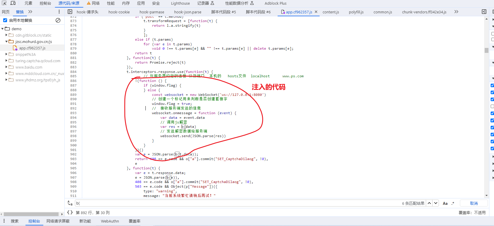
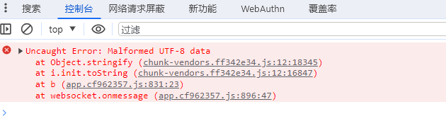
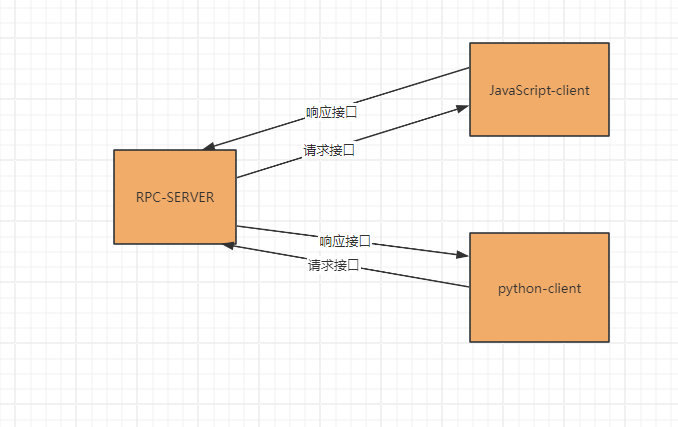
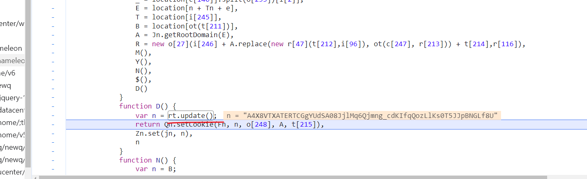
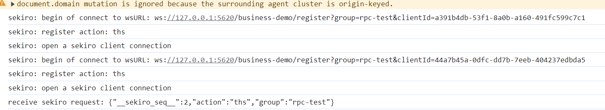
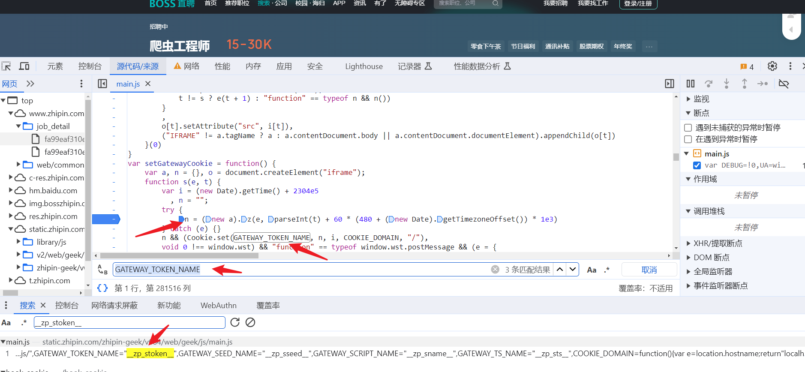
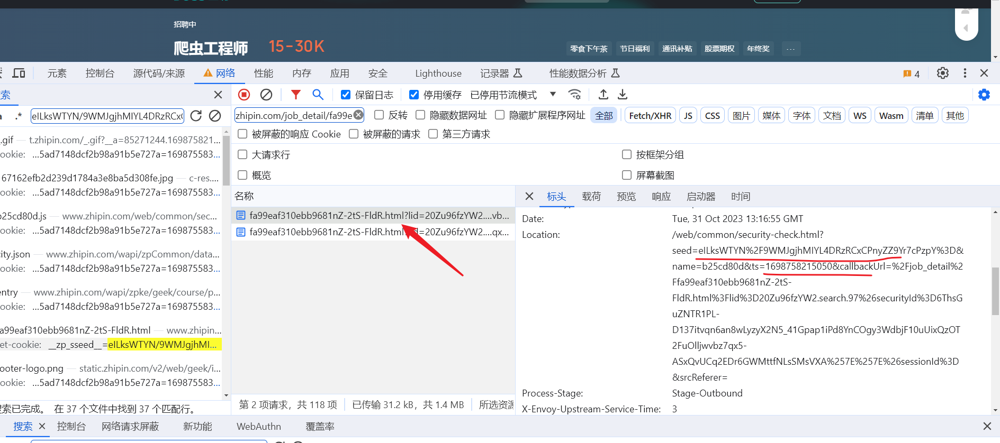
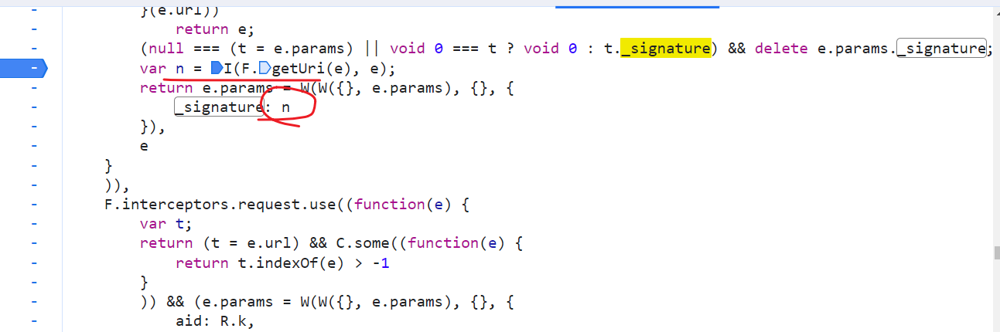
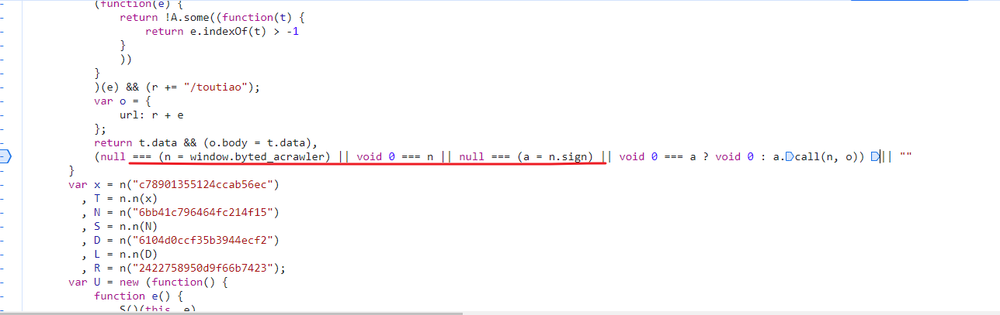

## RPC 技术

**学习目标:**

1. 了解 `websocket`协议
2. 熟悉 `websocket`实现原理
3. 掌握 `RPC`启用和注入方式

RPC，英文 RangPaCong，中文让爬虫，旨在为爬虫开路，秒杀一切，让爬虫畅通无阻！

WebSocket 的出现，使得浏览器具备了实时双向通信的能力。

参考：https://blog.csdn.net/zyym9009/article/details/104203995

参考：https://www.cnblogs.com/chyingp/p/websocket-deep-in.html

### 一. websocket

#### 1. 什么是 websocket

- WebSocket 是 HTML5 下一种新的协议（websocket 协议本质上是一个基于 tcp 的协议）
- 它实现了浏览器与服务器全双工通信，能更好的节省服务器资源和带宽并达到实时通讯的目的
- Websocket 是一个**持久化**的协议

#### 2. websocket 的原理

- websocket 约定了一个通信的规范，通过一个握手的机制，客户端和服务器之间能建立一个类似 tcp 的连接，从而方便它们之间的通信
- 在 websocket 出现之前，web 交互一般是基于 http 协议的短连接或者长连接
- websocket 是一种全新的协议，不属于 http 无状态协议，协议名为"ws"

**总结（总体过程）：**

- **首先，客户端发起 http 请求，经过 3 次握手后，建立起 TCP 连接；http 请求里存放 WebSocket 支持的版本号等信息，如：Upgrade、Connection、WebSocket-Version 等；**
- _然后，服务器收到客户端的握手请求后，同样采用 HTTP 协议回馈数据；_
- **最后，客户端收到连接成功的消息后，开始借助于 TCP 传输信道进行全双工通信。**

#### 3. websocket 实现方式

##### 1. 客户端

```html
<!DOCTYPE html>
<html lang="en">
  <head>
    <meta charset="UTF-8" />
    <title>Title</title>
  </head>
  <body>
    <input id="box" type="text" />
    <button onclick="ps()">发送</button>

    <script>
      // 与服务器约定的连接 以及端口  本机的   hosts文件  localhost      www.ps.com
      const websocket = new WebSocket("ws://127.0.0.1:8080/");

      //连接发生错误的回调方法
      websocket.onerror = () => {
        console.log("WebSocket连接发生错误");
      };

      //连接成功建立的回调方法
      websocket.onopen = function () {
        console.log("WebSocket连接成功");
      };

      //接收到消息的回调方法  接收服务器的数据
      websocket.onmessage = function (event) {
        console.log(event.data);
      };

      //连接关闭的回调方法
      websocket.onclose = function () {
        console.log("WebSocket连接关闭");
      };

      function ps() {
        // jquery -> val   JS -> value
        var text = document.getElementById("box").value;
        // 客户端发信息发服务器
        websocket.send(text);
      }
    </script>
  </body>
</html>
```

##### 2.服务端

```python
# encoding: utf-8
import asyncio
import websockets


async def echo(websocket):
    # 使用WebSocket在客户端和服务器之间建立全双工双向连接后，就可以在连接打开时调用send()方法。
    message = 'hello world'
    # 发送数据
    await websocket.send(message)
    return True


async def recv_msg(websocket):
    while 1:
        # 接收数据
        recv_text = await websocket.recv()
        print(recv_text)


async def main_logic(websocket, path):
    await echo(websocket)
    await recv_msg(websocket)


start_server = websockets.serve(main_logic, '127.0.0.1', 8080)
loop = asyncio.get_event_loop()
loop.run_until_complete(start_server)
# 创建了一个连接对象之后，需要不断监听返回的数据，则调用 run_forever 方法，要保持长连接即可
loop.run_forever()

```

##### 3. 实际案例

###### 1. 案例目标

- 网址:https://jzsc.mohurd.gov.cn/data/company
- 需求:通过`websocket`解析加密数据

- 实际注入网站代码

```
!(function () {
    if (window.flag) {
    } else {
        const websocket = new WebSocket('ws://127.0.0.1:8080')
// 创建一个标记用来判断是否创建套接字
        window.flag = true;
//  接收服务端发送的信息
        websocket.onmessage = function (event) {
            var data = event.data
// 调用js解密
            var res = b(data)
            console.log(res)
// 发送解密数据给服务端
            websocket.send(res)
        }
    }
}())
```

###### 2. 解析思路

- 定位到加密位置
- 将我们写的`websocket`命令注入到代码当中(通过替换的方式实现)



- 要注意数据是否正确,不带 v 请求头数据是有问题的



- 注入之后需要刷新页面才能把 js 执行起来

- python 执行代码

```python
# encoding: utf-8
import asyncio
import websockets
import requests
import time
import json

def get_data(page):
    headers = {
        "v": "231012",
        "Referer": "https://jzsc.mohurd.gov.cn/data/company",
        "User-Agent": "Mozilla/5.0 (Windows NT 10.0; Win64; x64) AppleWebKit/537.36 (KHTML, like Gecko) Chrome/118.0.0.0 Safari/537.36",
    }

    url = "https://jzsc.mohurd.gov.cn/APi/webApi/dataservice/query/comp/list"
    params = {
        "pg": page,
        "pgsz": "15",
        "total": "450"
    }
    response = requests.get(url, headers=headers, params=params)
    print(response.text)
    return response.text

async def echo(websocket):
    for i in range(1, 4):

        data = get_data(i)
        await websocket.send(data)
        # time.sleep(2)
        # return True


async def recv_msg(websocket):
    while 1:
        # 接收数据
        recv_text = await websocket.recv()
        print(json.loads(recv_text))


async def main_logic(websocket, path):
    await echo(websocket)
    await recv_msg(websocket)


start_server = websockets.serve(main_logic, '127.0.0.1', 8080)
loop = asyncio.get_event_loop()
loop.run_until_complete(start_server)
# 创建了一个连接对象之后，需要不断监听返回的数据，则调用 run_forever 方法，要保持长连接即可
loop.run_forever()

```

### 二. RPC

#### 1. RPC 简介

> 为什么要使用 RPC 技术呢?我们在使用 websocket 时候可以发现,python 在操作的时候,需要创建连接,还需要不断去接受传递数据,非常的麻烦, 那这个时候 rpc 技术可以帮助到我们,简单来说就是网页直接和 rpc 服务器进行交互,我们 python 可以直接调用,rpc 暴露的接口,不需要关心,创建连接这一块的问题.

​ **RPC** 技术是非常复杂的，对于我们搞爬虫、逆向的来说，不需要完全了解，只需要知道这项技术如何在逆向中应用就行了。

RPC 在逆向中，简单来说就是将本地和浏览器，看做是服务端和客户端，二者之间通过 `WebSocket` 协议进行 `RPC` 通信，在浏览器中将加密函数暴露出来，在本地直接调用浏览器中对应的加密函数，从而得到加密结果，不必去在意函数具体的执行逻辑，也省去了扣代码、补环境等操作，可以省去大量的逆向调试时间。



#### 2.Sekiro-RPC

- 官网地址：https://sekiro.iinti.cn/sekiro-doc/

##### 1. 使用方法

###### 1. 执行方式

- 在本地开启服务端
- 需要有 Java 环境，配置参考：https://baijiahao.baidu.com/s?id=1762153534119669123&wfr=spider&for=pc
  - 下载地址:https://repo.huaweicloud.com/java/jdk/8u201-b09/
- Linux & Mac：`bin/sekiro.sh` 双击打开服务端
- Windows：`bin/sekiro.bat` 双击打开服务端

###### 2.客户端环境

- 地址：[file.virjar.com/sekiro*web_client.js?*=123](http://file.virjar.com/sekiro_web_client.js?_=123) 这个地址是在前端创建客户端的时候需要用到的代码，`Sekiro-RPC` 把他封装在一个地址里面了

###### 3.使用参数说明

- 使用原理：客户端注入到浏览器环境，然后通过`SekiroClient`和 `Sekiro `服务器通信，即可直接 `RPC` 调用浏览器内部方法，官方提供的` SekiroClient` 代码样例如下：

```JavaScript
// 生成唯一标记uuid编号
function guid() {
    function S4() {
        return (((1+Math.random())*0x10000)|0).toString(16).substring(1);
    }
    return (S4()+S4()+"-"+S4()+"-"+S4()+"-"+S4()+"-"+S4()+S4()+S4());
}
// 连接服务端
var client = new SekiroClient("ws://127.0.0.1:5620/business-demo/register?group=ws-group&clientId="+guid());
// 业务接口
client.registerAction("登陆",function(request, resolve, reject){
    resolve(""+new Date());
})

```

- **group**：业务类型（接口组），每个业务一个 `group`，`group` 下面可以注册多个终端（`SekiroClient`），同时`group` 可以挂载多个 `Action`；

- **clientId**：指代设备，多个设备使用多个机器提供 `API` 服务，提供群控能力和负载均衡能力；

- **SekiroClient**：服务提供者客户端，主要场景为手机/浏览器等。最终的 `Sekiro` 调用会转发到 `SekiroClient`。每个` client` 需要有一个惟一的 `clientId`；

- **registerAction**：接口，同一个 `group` 下面可以有多个接口，分别做不同的功能；
- **resolve**：将内容传回给服务端的方法；

- **request**：服务端传过来的请求，如果请求里有多个参数，可以以键值对的方式从里面提取参数然后再做处理。

##### 2. 测试使用

###### 1. 前端代码

```html
<!DOCTYPE html>
<html lang="en">
  <head>
    <meta charset="UTF-8" />
    <title>Title</title>
  </head>
  <body>
    <script src="http://file.virjar.com/sekiro_web_client.js?_=123"></script>
    <script>
      function guid() {
        function S4() {
          return (((1 + Math.random()) * 0x10000) | 0).toString(16).substring(1);
        }

        return S4() + S4() + "-" + S4() + "-" + S4() + "-" + S4() + "-" + S4() + S4() + S4();
      }

      var client = new SekiroClient("ws://127.0.0.1:5620/business-demo/register?group=rpc-test&clientId=" + guid());

      client.registerAction("clientTime", function (request, resolve, reject) {
        resolve("" + new Date());
      });
    </script>
  </body>
</html>
```

###### 2. SK API

`Sekiro` 为我们提供了一些 API

- 查看分组列表：http://127.0.0.1:5620/business-demo/groupList

- 查看队列状态：http://127.0.0.1:5620/business-demo/clientQueue?group=rpc-test

- 调用转发：http://127.0.0.1:5620/business-demo/invoke?group=rpc-test&action=clientTime

###### 3.`python`调用代码

```python
import requests

params = {
    "group": "rpc-test",
    "action": "clientTime",
}
res = requests.get("http://127.0.0.1:5620/business-demo/invoke", params=params)
print(res.text)

```

### 三.项目实战

#### 1. 替换文件注入案例 1

##### 1. 逆向目标

- 地址：http://q.10jqka.com.cn/
- 接口：http://q.10jqka.com.cn/index/index/board/all/field/zdf/order/desc/page/2/ajax/1/
- 对抗：`cookie`反爬虫处理，关键字`v`

##### 2.定位 cookie 加密位置

```
(function () {
  Object.defineProperty(document, 'cookie', {
    set: function (val) {
      if (val.indexOf('v') != -1) {
        debugger;
      }
      console.log('Hook捕获到cookie设置->', val);
      return val;
    }
  });
})();
```



- 确定好位置之后我们就可以替换当前文件,把我们需要的 rpc 的代码给注入到网页中

- JavaScript 代码

```JavaScript
(function () {

    function SekiroClient(wsURL) {
        this.wsURL = wsURL;
        this.handlers = {};
        this.socket = {};
        this.base64 = false;
        // check
        if (!wsURL) {
            throw new Error('wsURL can not be empty!!')
        }
        this.webSocketFactory = this.resolveWebSocketFactory();
        this.connect()
    }

    SekiroClient.prototype.resolveWebSocketFactory = function () {
        if (typeof window === 'object') {
            var theWebSocket = window.WebSocket ? window.WebSocket : window.MozWebSocket;
            return function (wsURL) {

                function WindowWebSocketWrapper(wsURL) {
                    this.mSocket = new theWebSocket(wsURL);
                }

                WindowWebSocketWrapper.prototype.close = function () {
                    this.mSocket.close();
                };

                WindowWebSocketWrapper.prototype.onmessage = function (onMessageFunction) {
                    this.mSocket.onmessage = onMessageFunction;
                };

                WindowWebSocketWrapper.prototype.onopen = function (onOpenFunction) {
                    this.mSocket.onopen = onOpenFunction;
                };
                WindowWebSocketWrapper.prototype.onclose = function (onCloseFunction) {
                    this.mSocket.onclose = onCloseFunction;
                };

                WindowWebSocketWrapper.prototype.send = function (message) {
                    this.mSocket.send(message);
                };

                return new WindowWebSocketWrapper(wsURL);
            }
        }
        if (typeof weex === 'object') {
            // this is weex env : https://weex.apache.org/zh/docs/modules/websockets.html
            try {
                console.log("test webSocket for weex");
                var ws = weex.requireModule('webSocket');
                console.log("find webSocket for weex:" + ws);
                return function (wsURL) {
                    try {
                        ws.close();
                    } catch (e) {
                    }
                    ws.WebSocket(wsURL, '');
                    return ws;
                }
            } catch (e) {
                console.log(e);
                //ignore
            }
        }
        //TODO support ReactNative
        if (typeof WebSocket === 'object') {
            return function (wsURL) {
                return new theWebSocket(wsURL);
            }
        }
        // weex 鍜� PC鐜鐨剋ebsocket API涓嶅畬鍏ㄤ竴鑷达紝鎵€浠ュ仛浜嗘娊璞″吋瀹�
        throw new Error("the js environment do not support websocket");
    };

    SekiroClient.prototype.connect = function () {
        console.log('sekiro: begin of connect to wsURL: ' + this.wsURL);
        var _this = this;
        // 涓峜heck close锛岃
        // if (this.socket && this.socket.readyState === 1) {
        //     this.socket.close();
        // }
        try {
            this.socket = this.webSocketFactory(this.wsURL);
        } catch (e) {
            console.log("sekiro: create connection failed,reconnect after 2s");
            setTimeout(function () {
                _this.connect()
            }, 2000)
        }

        this.socket.onmessage(function (event) {
            _this.handleSekiroRequest(event.data)
        });

        this.socket.onopen(function (event) {
            console.log('sekiro: open a sekiro client connection')
        });

        this.socket.onclose(function (event) {
            console.log('sekiro: disconnected ,reconnection after 2s');
            setTimeout(function () {
                _this.connect()
            }, 2000)
        });
    };

    SekiroClient.prototype.handleSekiroRequest = function (requestJson) {
        console.log("receive sekiro request: " + requestJson);
        var request = JSON.parse(requestJson);
        var seq = request['__sekiro_seq__'];

        if (!request['action']) {
            this.sendFailed(seq, 'need request param {action}');
            return
        }
        var action = request['action'];
        if (!this.handlers[action]) {
            this.sendFailed(seq, 'no action handler: ' + action + ' defined');
            return
        }

        var theHandler = this.handlers[action];
        var _this = this;
        try {
            theHandler(request, function (response) {
                try {
                    _this.sendSuccess(seq, response)
                } catch (e) {
                    _this.sendFailed(seq, "e:" + e);
                }
            }, function (errorMessage) {
                _this.sendFailed(seq, errorMessage)
            })
        } catch (e) {
            console.log("error: " + e);
            _this.sendFailed(seq, ":" + e);
        }
    };

    SekiroClient.prototype.sendSuccess = function (seq, response) {
        var responseJson;
        if (typeof response == 'string') {
            try {
                responseJson = JSON.parse(response);
            } catch (e) {
                responseJson = {};
                responseJson['data'] = response;
            }
        } else if (typeof response == 'object') {
            responseJson = response;
        } else {
            responseJson = {};
            responseJson['data'] = response;
        }

        if (typeof response == 'string') {
            responseJson = {};
            responseJson['data'] = response;
        }

        if (Array.isArray(responseJson)) {
            responseJson = {
                data: responseJson,
                code: 0
            }
        }

        if (responseJson['code']) {
            responseJson['code'] = 0;
        } else if (responseJson['status']) {
            responseJson['status'] = 0;
        } else {
            responseJson['status'] = 0;
        }
        responseJson['__sekiro_seq__'] = seq;
        var responseText = JSON.stringify(responseJson);
        console.log("response :" + responseText);


        if (responseText.length < 1024 * 6) {
            this.socket.send(responseText);
            return;
        }

        if (this.base64) {
            responseText = this.base64Encode(responseText)
        }

        //澶ф姤鏂囪鍒嗘浼犺緭
        var segmentSize = 1024 * 5;
        var i = 0, totalFrameIndex = Math.floor(responseText.length / segmentSize) + 1;

        for (; i < totalFrameIndex; i++) {
            var frameData = JSON.stringify({
                    __sekiro_frame_total: totalFrameIndex,
                    __sekiro_index: i,
                    __sekiro_seq__: seq,
                    __sekiro_base64: this.base64,
                    __sekiro_is_frame: true,
                    __sekiro_content: responseText.substring(i * segmentSize, (i + 1) * segmentSize)
                }
            );
            console.log("frame: " + frameData);
            this.socket.send(frameData);
        }
    };

    SekiroClient.prototype.sendFailed = function (seq, errorMessage) {
        if (typeof errorMessage != 'string') {
            errorMessage = JSON.stringify(errorMessage);
        }
        var responseJson = {};
        responseJson['message'] = errorMessage;
        responseJson['status'] = -1;
        responseJson['__sekiro_seq__'] = seq;
        var responseText = JSON.stringify(responseJson);
        console.log("sekiro: response :" + responseText);
        this.socket.send(responseText)
    };

    SekiroClient.prototype.registerAction = function (action, handler) {
        if (typeof action !== 'string') {
            throw new Error("an action must be string");
        }
        if (typeof handler !== 'function') {
            throw new Error("a handler must be function");
        }
        console.log("sekiro: register action: " + action);
        this.handlers[action] = handler;
        return this;
    };

    SekiroClient.prototype.encodeWithBase64 = function () {
        this.base64 = arguments && arguments.length > 0 && arguments[0];
    };

    SekiroClient.prototype.base64Encode = function (s) {
        if (arguments.length !== 1) {
            throw "SyntaxError: exactly one argument required";
        }

        s = String(s);
        if (s.length === 0) {
            return s;
        }

        function _get_chars(ch, y) {
            if (ch < 0x80) y.push(ch);
            else if (ch < 0x800) {
                y.push(0xc0 + ((ch >> 6) & 0x1f));
                y.push(0x80 + (ch & 0x3f));
            } else {
                y.push(0xe0 + ((ch >> 12) & 0xf));
                y.push(0x80 + ((ch >> 6) & 0x3f));
                y.push(0x80 + (ch & 0x3f));
            }
        }

        var _PADCHAR = "=",
            _ALPHA = "ABCDEFGHIJKLMNOPQRSTUVWXYZabcdefghijklmnopqrstuvwxyz0123456789+/",
            _VERSION = "1.1";//Mr. Ruan fix to 1.1 to support asian char(utf8)

        //s = _encode_utf8(s);
        var i,
            b10,
            y = [],
            x = [],
            len = s.length;
        i = 0;
        while (i < len) {
            _get_chars(s.charCodeAt(i), y);
            while (y.length >= 3) {
                var ch1 = y.shift();
                var ch2 = y.shift();
                var ch3 = y.shift();
                b10 = (ch1 << 16) | (ch2 << 8) | ch3;
                x.push(_ALPHA.charAt(b10 >> 18));
                x.push(_ALPHA.charAt((b10 >> 12) & 0x3F));
                x.push(_ALPHA.charAt((b10 >> 6) & 0x3f));
                x.push(_ALPHA.charAt(b10 & 0x3f));
            }
            i++;
        }


        switch (y.length) {
            case 1:
                var ch = y.shift();
                b10 = ch << 16;
                x.push(_ALPHA.charAt(b10 >> 18) + _ALPHA.charAt((b10 >> 12) & 0x3F) + _PADCHAR + _PADCHAR);
                break;

            case 2:
                var ch1 = y.shift();
                var ch2 = y.shift();
                b10 = (ch1 << 16) | (ch2 << 8);
                x.push(_ALPHA.charAt(b10 >> 18) + _ALPHA.charAt((b10 >> 12) & 0x3F) + _ALPHA.charAt((b10 >> 6) & 0x3f) + _PADCHAR);
                break;
        }

        return x.join("");
    };

    function startRpc() {
        if (window.flag) {
        } else {
            function guid() {
                function S4() {
                    return (((1 + Math.random()) * 0x10000) | 0).toString(16).substring(1);
                }

                return (S4() + S4() + "-" + S4() + "-" + S4() + "-" + S4() + "-" + S4() + S4() + S4());
            }

            // 创建一个标记用来判断是否创建套接字
            window.flag = true;
            var client = new SekiroClient("ws://127.0.0.1:5620/business-demo/register?group=rpc-test&clientId=" + guid());
            client.registerAction("ths", function (request, resolve, reject) {
                resolve(rt.update());
            })
        }
    }

    setTimeout(startRpc, 1000)
})()
```

- 控制台出现一下页面说明注入是成功的



- python 代码

```python
import requests

data = {
    "group": "rpc-test",
    "action": "ths",
}
res = requests.get("http://127.0.0.1:5620/business-demo/invoke", params=data)
print(res.text)

```

#### 2. 替换文件注入案例 2

##### 1. 逆向目标

- 地址：https://www.zhipin.com/web/geek/job?query=python&city=101250100&page=3
- 接口：详情页面`__zp_stoken__`cookie 值

##### 2. 逆向分析

- 根据关键字定位到 cookie 生成的位置



- 可以看出来 n 的赋值就是`__zp_stoken__`生成的位置
- 那我们的 rpc 就能在这一块来进行编写，直接调用`(new a).z(e, parseInt(t) + 60 * (480 + (new Date).getTimezoneOffset()) * 1e3)`
- 需要用到两个入参,一个是 e 一个是 t,两个参数是来自这个详情页面第一次请求成功之后返回响应头里的数据信息,是服务器返回的



- 那我们的就需要先把 js 文件进行替换,把我们 rpc 的代码替换到网址当中
- python 代码就需要先请求一次这个网址,获取到响应数据,在发送给接口进行加密

##### 3. 实现代码

- JavaScript 注入代码

```JavaScript
(function () {
    /*
      Copyright (C) 2020 virjar <virjar@virjar.com> for https://github.com/virjar/sekiro

      Redistribution and use in source and binary forms, with or without
      modification, are permitted provided that the following conditions are met:

        * Redistributions of source code must retain the above copyright
          notice, this list of conditions and the following disclaimer.
        * Redistributions in binary form must reproduce the above copyright
          notice, this list of conditions and the following disclaimer in the
          documentation and/or other materials provided with the distribution.

      THIS SOFTWARE IS PROVIDED BY THE COPYRIGHT HOLDERS AND CONTRIBUTORS "AS IS"
      AND ANY EXPRESS OR IMPLIED WARRANTIES, INCLUDING, BUT NOT LIMITED TO, THE
      IMPLIED WARRANTIES OF MERCHANTABILITY AND FITNESS FOR A PARTICULAR PURPOSE
      ARE DISCLAIMED. IN NO EVENT SHALL <COPYRIGHT HOLDER> BE LIABLE FOR ANY
      DIRECT, INDIRECT, INCIDENTAL, SPECIAL, EXEMPLARY, OR CONSEQUENTIAL DAMAGES
      (INCLUDING, BUT NOT LIMITED TO, PROCUREMENT OF SUBSTITUTE GOODS OR SERVICES;
      LOSS OF USE, DATA, OR PROFITS; OR BUSINESS INTERRUPTION) HOWEVER CAUSED AND
      ON ANY THEORY OF LIABILITY, WHETHER IN CONTRACT, STRICT LIABILITY, OR TORT
      (INCLUDING NEGLIGENCE OR OTHERWISE) ARISING IN ANY WAY OUT OF THE USE OF
      THIS SOFTWARE, EVEN IF ADVISED OF THE POSSIBILITY OF SUCH DAMAGE.
    */


    function SekiroClient(wsURL) {
        this.wsURL = wsURL;
        this.handlers = {};
        this.socket = {};
        this.base64 = false;
        // check
        if (!wsURL) {
            throw new Error('wsURL can not be empty!!')
        }
        this.webSocketFactory = this.resolveWebSocketFactory();
        this.connect()
    }

    SekiroClient.prototype.resolveWebSocketFactory = function () {
        if (typeof window === 'object') {
            var theWebSocket = window.WebSocket ? window.WebSocket : window.MozWebSocket;
            return function (wsURL) {

                function WindowWebSocketWrapper(wsURL) {
                    this.mSocket = new theWebSocket(wsURL);
                }

                WindowWebSocketWrapper.prototype.close = function () {
                    this.mSocket.close();
                };

                WindowWebSocketWrapper.prototype.onmessage = function (onMessageFunction) {
                    this.mSocket.onmessage = onMessageFunction;
                };

                WindowWebSocketWrapper.prototype.onopen = function (onOpenFunction) {
                    this.mSocket.onopen = onOpenFunction;
                };
                WindowWebSocketWrapper.prototype.onclose = function (onCloseFunction) {
                    this.mSocket.onclose = onCloseFunction;
                };

                WindowWebSocketWrapper.prototype.send = function (message) {
                    this.mSocket.send(message);
                };

                return new WindowWebSocketWrapper(wsURL);
            }
        }
        if (typeof weex === 'object') {
            // this is weex env : https://weex.apache.org/zh/docs/modules/websockets.html
            try {
                console.log("test webSocket for weex");
                var ws = weex.requireModule('webSocket');
                console.log("find webSocket for weex:" + ws);
                return function (wsURL) {
                    try {
                        ws.close();
                    } catch (e) {
                    }
                    ws.WebSocket(wsURL, '');
                    return ws;
                }
            } catch (e) {
                console.log(e);
                //ignore
            }
        }
        //TODO support ReactNative
        if (typeof WebSocket === 'object') {
            return function (wsURL) {
                return new theWebSocket(wsURL);
            }
        }
        // weex 鍜� PC鐜鐨剋ebsocket API涓嶅畬鍏ㄤ竴鑷达紝鎵€浠ュ仛浜嗘娊璞″吋瀹�
        throw new Error("the js environment do not support websocket");
    };

    SekiroClient.prototype.connect = function () {
        console.log('sekiro: begin of connect to wsURL: ' + this.wsURL);
        var _this = this;
        // 涓峜heck close锛岃
        // if (this.socket && this.socket.readyState === 1) {
        //     this.socket.close();
        // }
        try {
            this.socket = this.webSocketFactory(this.wsURL);
        } catch (e) {
            console.log("sekiro: create connection failed,reconnect after 2s");
            setTimeout(function () {
                _this.connect()
            }, 2000)
        }

        this.socket.onmessage(function (event) {
            _this.handleSekiroRequest(event.data)
        });

        this.socket.onopen(function (event) {
            console.log('sekiro: open a sekiro client connection')
        });

        this.socket.onclose(function (event) {
            console.log('sekiro: disconnected ,reconnection after 2s');
            setTimeout(function () {
                _this.connect()
            }, 2000)
        });
    };

    SekiroClient.prototype.handleSekiroRequest = function (requestJson) {
        console.log("receive sekiro request: " + requestJson);
        var request = JSON.parse(requestJson);
        var seq = request['__sekiro_seq__'];

        if (!request['action']) {
            this.sendFailed(seq, 'need request param {action}');
            return
        }
        var action = request['action'];
        if (!this.handlers[action]) {
            this.sendFailed(seq, 'no action handler: ' + action + ' defined');
            return
        }

        var theHandler = this.handlers[action];
        var _this = this;
        try {
            theHandler(request, function (response) {
                try {
                    _this.sendSuccess(seq, response)
                } catch (e) {
                    _this.sendFailed(seq, "e:" + e);
                }
            }, function (errorMessage) {
                _this.sendFailed(seq, errorMessage)
            })
        } catch (e) {
            console.log("error: " + e);
            _this.sendFailed(seq, ":" + e);
        }
    };

    SekiroClient.prototype.sendSuccess = function (seq, response) {
        var responseJson;
        if (typeof response == 'string') {
            try {
                responseJson = JSON.parse(response);
            } catch (e) {
                responseJson = {};
                responseJson['data'] = response;
            }
        } else if (typeof response == 'object') {
            responseJson = response;
        } else {
            responseJson = {};
            responseJson['data'] = response;
        }

        if (typeof response == 'string') {
            responseJson = {};
            responseJson['data'] = response;
        }

        if (Array.isArray(responseJson)) {
            responseJson = {
                data: responseJson,
                code: 0
            }
        }

        if (responseJson['code']) {
            responseJson['code'] = 0;
        } else if (responseJson['status']) {
            responseJson['status'] = 0;
        } else {
            responseJson['status'] = 0;
        }
        responseJson['__sekiro_seq__'] = seq;
        var responseText = JSON.stringify(responseJson);
        console.log("response :" + responseText);


        if (responseText.length < 1024 * 6) {
            this.socket.send(responseText);
            return;
        }

        if (this.base64) {
            responseText = this.base64Encode(responseText)
        }

        //澶ф姤鏂囪鍒嗘浼犺緭
        var segmentSize = 1024 * 5;
        var i = 0, totalFrameIndex = Math.floor(responseText.length / segmentSize) + 1;

        for (; i < totalFrameIndex; i++) {
            var frameData = JSON.stringify({
                    __sekiro_frame_total: totalFrameIndex,
                    __sekiro_index: i,
                    __sekiro_seq__: seq,
                    __sekiro_base64: this.base64,
                    __sekiro_is_frame: true,
                    __sekiro_content: responseText.substring(i * segmentSize, (i + 1) * segmentSize)
                }
            );
            console.log("frame: " + frameData);
            this.socket.send(frameData);
        }
    };

    SekiroClient.prototype.sendFailed = function (seq, errorMessage) {
        if (typeof errorMessage != 'string') {
            errorMessage = JSON.stringify(errorMessage);
        }
        var responseJson = {};
        responseJson['message'] = errorMessage;
        responseJson['status'] = -1;
        responseJson['__sekiro_seq__'] = seq;
        var responseText = JSON.stringify(responseJson);
        console.log("sekiro: response :" + responseText);
        this.socket.send(responseText)
    };

    SekiroClient.prototype.registerAction = function (action, handler) {
        if (typeof action !== 'string') {
            throw new Error("an action must be string");
        }
        if (typeof handler !== 'function') {
            throw new Error("a handler must be function");
        }
        console.log("sekiro: register action: " + action);
        this.handlers[action] = handler;
        return this;
    };

    SekiroClient.prototype.encodeWithBase64 = function () {
        this.base64 = arguments && arguments.length > 0 && arguments[0];
    };

    SekiroClient.prototype.base64Encode = function (s) {
        if (arguments.length !== 1) {
            throw "SyntaxError: exactly one argument required";
        }

        s = String(s);
        if (s.length === 0) {
            return s;
        }

        function _get_chars(ch, y) {
            if (ch < 0x80) y.push(ch);
            else if (ch < 0x800) {
                y.push(0xc0 + ((ch >> 6) & 0x1f));
                y.push(0x80 + (ch & 0x3f));
            } else {
                y.push(0xe0 + ((ch >> 12) & 0xf));
                y.push(0x80 + ((ch >> 6) & 0x3f));
                y.push(0x80 + (ch & 0x3f));
            }
        }

        var _PADCHAR = "=",
            _ALPHA = "ABCDEFGHIJKLMNOPQRSTUVWXYZabcdefghijklmnopqrstuvwxyz0123456789+/",
            _VERSION = "1.1";//Mr. Ruan fix to 1.1 to support asian char(utf8)

        //s = _encode_utf8(s);
        var i,
            b10,
            y = [],
            x = [],
            len = s.length;
        i = 0;
        while (i < len) {
            _get_chars(s.charCodeAt(i), y);
            while (y.length >= 3) {
                var ch1 = y.shift();
                var ch2 = y.shift();
                var ch3 = y.shift();
                b10 = (ch1 << 16) | (ch2 << 8) | ch3;
                x.push(_ALPHA.charAt(b10 >> 18));
                x.push(_ALPHA.charAt((b10 >> 12) & 0x3F));
                x.push(_ALPHA.charAt((b10 >> 6) & 0x3f));
                x.push(_ALPHA.charAt(b10 & 0x3f));
            }
            i++;
        }


        switch (y.length) {
            case 1:
                var ch = y.shift();
                b10 = ch << 16;
                x.push(_ALPHA.charAt(b10 >> 18) + _ALPHA.charAt((b10 >> 12) & 0x3F) + _PADCHAR + _PADCHAR);
                break;

            case 2:
                var ch1 = y.shift();
                var ch2 = y.shift();
                b10 = (ch1 << 16) | (ch2 << 8);
                x.push(_ALPHA.charAt(b10 >> 18) + _ALPHA.charAt((b10 >> 12) & 0x3F) + _ALPHA.charAt((b10 >> 6) & 0x3f) + _PADCHAR);
                break;
        }

        return x.join("");
    };
	// 上面的代码是SekiroClient生成的客户端代码代码
    function startRpc() {
        if (window.flag) {
        } else {
            function guid() {
                function S4() {
                    return (((1 + Math.random()) * 0x10000) | 0).toString(16).substring(1);
                }

                return (S4() + S4() + "-" + S4() + "-" + S4() + "-" + S4() + "-" + S4() + S4() + S4());
            }

            // 创建一个标记用来判断是否创建套接字
            window.flag = true;
            var client = new SekiroClient("ws://127.0.0.1:5620/business-demo/register?group=rpc-test&clientId=" + guid());
            client.registerAction("boss", function (request, resolve, reject) {
                e = request['seed'];
                t = request['ts']

                n = (new a).z(e, parseInt(t) + 60 * (480 + (new Date).getTimezoneOffset()) * 1e3)
                resolve(n);
            })
        }
    }

    setTimeout(startRpc, 1000)

})()
```

- python 连接代码

```python
import requests
import re
from urllib import parse


def get_seed_ts():
    url = f"https://www.zhipin.com/job_detail/fa99eaf310ebb9681nZ-2tS-FldR.html?lid=20Zu96fzYW2.search.97&securityId=6ThsGuZNTR1PL-D137itvqn6an8wLyzyX2N5_41Gpap1iPd8YnCOgy3WdbjF10uUixQzOT2FuOlljwvbz7qx5-ASxQvUCq2EDr6GWMttfNLsSMsVXA~~&sessionId="
    headers = {
        "user-agent": "Mozilla/5.0 (Windows NT 10.0; Win64; x64) AppleWebKit/537.36 (KHTML, like Gecko) Chrome/118.0.0.0 Safari/537.36",
    }
    response = requests.get(url, headers=headers, allow_redirects=False)
    seed = re.findall('\?seed=(.*?)&', response.headers['location'])[0]
    seed = parse.unquote(seed)
    ts = re.findall('&ts=(.*?)&c', response.headers['location'])[0]
    return seed, ts


def get_sig():
    seed, ts = get_seed_ts()
    print(seed, ts)
    data = {
        "group": "rpc-test",
        "action": "boss",
        'seed': seed,
        'ts': ts
    }
    res = requests.post(url="http://127.0.0.1:5620/business-demo/invoke", data=data, verify=False)
    if res.status_code == 200:
        return res.json().get('data')


def get_index():
    url = 'https://www.zhipin.com/job_detail/fa99eaf310ebb9681nZ-2tS-FldR.html?lid=20Zu96fzYW2.search.97&securityId=6ThsGuZNTR1PL-D137itvqn6an8wLyzyX2N5_41Gpap1iPd8YnCOgy3WdbjF10uUixQzOT2FuOlljwvbz7qx5-ASxQvUCq2EDr6GWMttfNLsSMsVXA~~&sessionId='
    token = get_sig()
    print(token)
    headers = {
        "user-agent": "Mozilla/5.0 (Windows NT 10.0; Win64; x64) AppleWebKit/537.36 (KHTML, like Gecko) Chrome/118.0.0.0 Safari/537.36",
        "cookie": f"__zp_stoken__={token}"
    }
    res = requests.get(url, headers=headers)
    res.encoding = 'utf-8'
    print(res.text)


get_index()

```

#### 3. 油猴注入形式

##### 1. 油猴工具介绍

[Tampermonkey](https://links.jianshu.com/go?to=https%3A%2F%2Ftampermonkey.net%2F)是一款免费的浏览器扩展和最为流行的用户脚本管理器，它适用于 Chrome, Microsoft Edge, Safari, Opera Next, 和 Firefox。
以上是油猴官网给出的介绍。它可以让用户自行在添加脚本，并在开启对应页面时应用。如果你了解"**脚本注入**"，你可以把它认为是一个给自己注入脚本的一个工具。

**用户油猴脚本**：https://greasyfork.org/zh-CN/scripts

大家可以自行娱乐娱乐， 比如说啊 VIP 电影免费破解

用油猴可以帮助我们一直去动态的监听网址,有些参数可能是刷新网站的时候生成的比较快,控制台没有那么快去执行代码

| 选项         | 含义                                                                                                                                                                                                                                                                                   |
| :----------- | :------------------------------------------------------------------------------------------------------------------------------------------------------------------------------------------------------------------------------------------------------------------------------------- |
| @name        | 脚本的名称                                                                                                                                                                                                                                                                             |
| @namespace   | 命名空间，用来区分相同名称的脚本，一般写作者名字或者网址就可以                                                                                                                                                                                                                         |
| @version     | 脚本版本，油猴脚本的更新会读取这个版本号                                                                                                                                                                                                                                               |
| @description | 描述这个脚本是干什么用的                                                                                                                                                                                                                                                               |
| @author      | 编写这个脚本的作者的名字                                                                                                                                                                                                                                                               |
| **@match**   | 从字符串的起始位置匹配正则表达式，只有匹配的网址才会执行对应的脚本，例如 `*` 匹配所有，`https://www.baidu.com/*` 匹配百度等，可以参考 Python re 模块里面的 `re.match()` 方法，允许多个实例                                                                                             |
| **@include** | 和 @match 类似，只有匹配的网址才会执行对应的脚本，但是 @include 不会从字符串起始位置匹配，例如 `*://*baidu.com/*` 匹配百度，具体区别可以参考 **TamperMonkey 官方文档**[8]                                                                                                              |
| @icon        | 脚本的 icon 图标                                                                                                                                                                                                                                                                       |
| @grant       | 指定脚本运行所需权限，如果脚本拥有相应的权限，就可以调用油猴扩展提供的 API 与浏览器进行交互。如果设置为 none 的话，则不使用沙箱环境，脚本会直接运行在网页的环境中，这时候无法使用大部分油猴扩展的 API。如果不指定的话，油猴会默认添加几个最常用的 API                                  |
| @require     | 如果脚本依赖其他 JS 库的话，可以使用 require 指令导入，在运行脚本之前先加载其它库                                                                                                                                                                                                      |
| **@run-at**  | 脚本注入时机，该选项是能不能 hook 到的关键，有五个值可选：`document-start`：网页开始时；`document-body`：body 出现时；`document-end`：载入时或者之后执行；`document-idle`：载入完成后执行，默认选项；`context-menu`：在浏览器上下文菜单中单击该脚本时，一般将其设置为 `document-start` |

##### 2.逆向目标

- 目标网址:https://www.toutiao.com/
- 解析:**\_signature**

##### 3. 逆向分析

- 通过关键字的方式定位到加密位置



- 跟 I 方法看看执行的内容



- 可以直接把当前方法导出
- 油猴代码

```
// ==UserScript==
// @name        头条-rpc
// @namespace   柏汌
// @version      0.1
// @description  加载头条的参数
// @author       柏汌
// @match        https://www.toutiao.com/*
// @grant        none
// @require      http://file.virjar.com/sekiro_web_client.js?_=123
// ==/UserScript==

(function() {
    'use strict';

      var client = new SekiroClient("ws://127.0.0.1:5620/business-demo/register?group=test&clientId=" + Math.random());
  client.registerAction("tt", function (request, resolve, reject) {
        var url = request['url'];  // 接收python传的地址
        if (!url){
            reject("url 不能为空")
        }
        resolve({"signature": window.byted_acrawler.sign({url}), "cookie": document.cookie})
  });

})();
```

- python 代码

```
# encoding: utf-8
"""
@author: 夏洛
@QQ: 1972386194
@file: 头条测试.py
"""
import urllib3,requests
urllib3.disable_warnings()

def get_sig(url):
    data = {
        "group": "test",
        "action": "tt",
        "url": url
    }
    res = requests.post(url="http://127.0.0.1:5620/business-demo/invoke", data=data, verify=False)
    resp = res.json()
    print(res.json())
    if "?" in url:
        url += "&_signature={}".format(resp['signature'])
    else:
        url += "?_signature={}".format(resp['signature'])
    return url

url = get_sig("https://www.toutiao.com/api/pc/list/feed?channel_id=0&max_behot_time=1698925370&offset=0&category=pc_profile_recommend&aid=24&app_name=toutiao_web")
print(url)
headers = {
    "authority": "www.toutiao.com",
    "accept": "application/json, text/plain, */*",
    "accept-language": "zh-CN,zh;q=0.9",
    "cache-control": "no-cache",
    "pragma": "no-cache",
    "referer": "https://www.toutiao.com/",
    "sec-ch-ua": "^\\^Google",
    "sec-ch-ua-mobile": "?0",
    "sec-ch-ua-platform": "^\\^Windows^^",
    "sec-fetch-dest": "empty",
    "sec-fetch-mode": "cors",
    "sec-fetch-site": "same-origin",
    "user-agent": "Mozilla/5.0 (Windows NT 10.0; Win64; x64) AppleWebKit/537.36 (KHTML, like Gecko) Chrome/119.0.0.0 Safari/537.36"
}
res = requests.get(url, headers=headers)
print(res.text)
# https://www.toutiao.com/api/pc/list/feed?channel_id=0&min_behot_time=1636703275&refresh_count=2&category=pc_profile_recommend&_signature=_02B4Z6wo00d01KWcaZwAAIDAJZ6T3JmB4wiluG0AAEwpfdsN1DmbuNsUZxKy6hQ9zmq5aoV6APEJmbKSJmmYKcV7Mr4VnVYu3tJ11y1TYvRcyhTGsiq5RdbNdsSdf1msDFZUvL.AAJ-zz4GM34
```

- 油猴 rpc,适用于全局的方法,要是函数内部的方法导出不了
