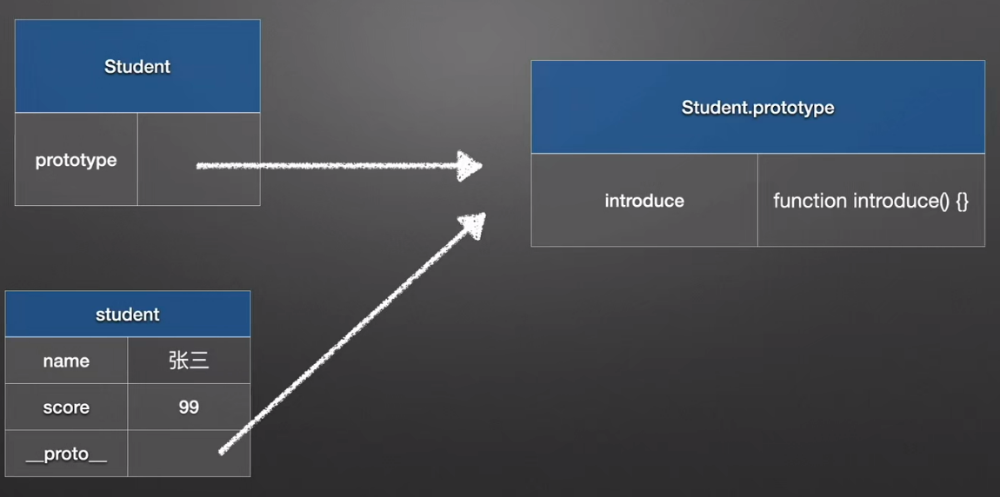
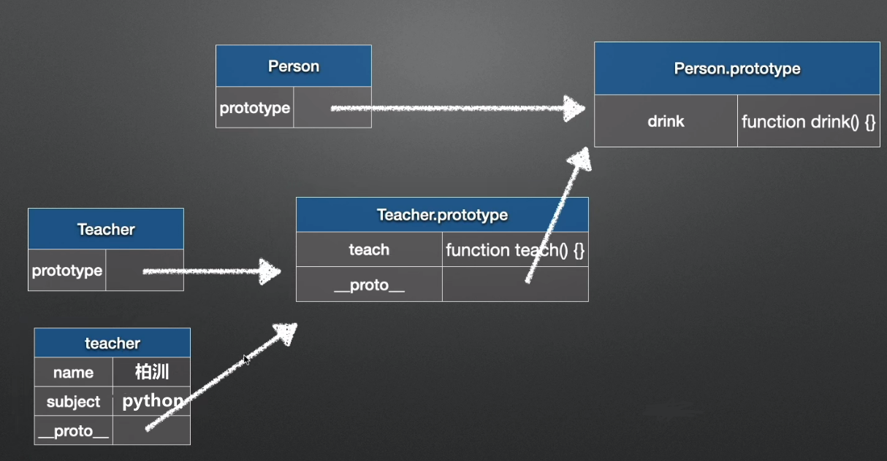
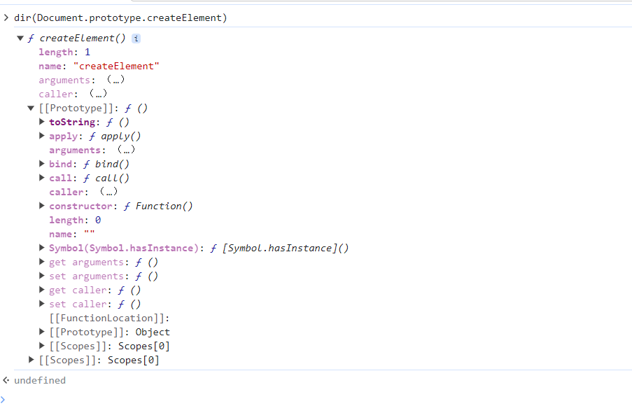
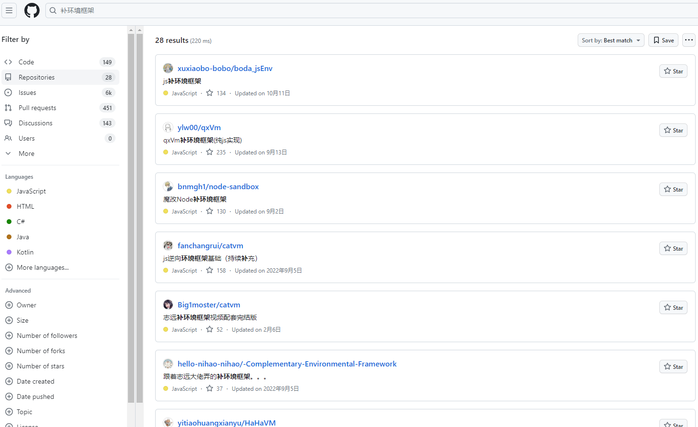
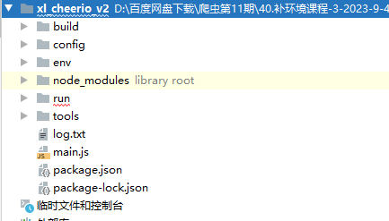

## 补环境框架学习

**学习目标:**

1. 了解 原型链
2. 熟悉 补原型链的方法
3. 熟悉 vm 框架的使用

### 一.原型和原型链

#### 1. `js`类继承

- `js`创建类的关键字 class, 通过`constructor`来进行初始化参数类似于 python 的`init`
- 需要继承类的话使用的关键字是`extends`

```JavaScript

class Person{
    constructor(name) {
        this.name = name
    }
    dance(){
        console.log('跳舞')
    }
}


class Student extends Person{
    constructor(name, score) {
        super(name)
        this.score = score;
    }
    introduce(){
        console.log(`我是${this.name}, 考了${this.score}`)
    }
}

var student = new Student('张三', 10)
console.log(student)
student.introduce()
student.dance()

class Teacher extends Person{
    constructor(name, subject) {
        super(name)
        this.subject = subject;
    }
    introduce(){
        console.log(`我是${this.name}, 教的${this.subject}`)
    }
}

var teacher = new Teacher('柏汌', 'python')
console.log(teacher)
teacher.introduce()
teacher.dance()
```

#### 2. `js`原型

- 实现案例

```
class Student{
    constructor(name, score) {
        this.name = name;
        this.score = score;
    }
    introduce(){
        console.log(`我是${this.name}, 考了${this.score}`)
    }
}

var student = new Student('张三', 10)
console.log(student)
student.introduce()
```

- 在当前这个案例当中,创建了一个`Student`类,里面有属性和方法,我们可以通过创建的对象访问对应的属性和方法
- 但是当我们在但是输出这个对象时会看到,对象当中是没有 introduce 存在的,那我们为什么可以调用到 introduce 方法呢
- 在我们打印对象的时候会看到除了属性以为,还有会有个`__proto__`(由于浏览器版本的不同,在新版浏览器当中你看到的可能是[[Prototype]]),我们在打开之后就能去看到里面有 introduce 方法,那`__proto__`就是我们所说的原型, `隐式原型`
- 在创建的类里面我们同样的可以进行操作,在`Student.prototype`,也会给我们输出一个对象,可以看到输出的这个对象,和我们刚刚输出的隐式原型是相等的,这个就是类的`显式原型`
- 最终结论:每个创建的对象都会有一个隐式原型,这个隐式原型所指向的就是创建这个对象的类的显式原型,当我们在一个对象中查找属性或者方法时,如果找不到的话,就会去到原型中去找.



#### 3. `js`原型链

- 讲解案例

```javascript
class Person {
  constructor(name) {
    this.name = name;
  }
  drink() {
    console.log("喝水");
  }
}

class Teacher extends Person {
  constructor(name, subject) {
    super(name);
    this.subject = subject;
  }
  introduce() {
    console.log(`我是${this.name}, 教的${this.subject}`);
  }
}

var teacher = new Teacher("柏汌", "python");
console.log(teacher);
teacher.introduce();
teacher.drink();
```

- 在继承多个类的时候,他的原型层数会比较多,那我们通过这个原型网上找的这个链路就称为`原型链`



- 如果说你想检验一个属性或者方法是自身所拥有的呢, 可以通过`hasOwnProperty`来检测

```JavaScript
teacher.hasOwnProperty('name') -- > true
teacher.hasOwnProperty('teach') -- > false
```

- 那么`hasOwnProperty`这个方法是重哪里来的呢?

- 在 JavaScript 中同样是存在一个顶层类 object 类, 和 python 的是有一致的地方, 这个`hasOwnProperty`方法就是`Object`原型当中的

### 二.原型检测

官网:https://developer.mozilla.org/zh-CN/docs/Web/JavaScript/Reference/Global_Objects/Object/getOwnPropertyDescriptor

**`Object.getOwnPropertyDescriptor()`** 方法返回指定对象上一个自有属性对应的属性描述符。（自有属性指的是直接赋予该对象的属性，不需要从原型链上进行查找的属性）

```
Object.getOwnPropertyDescriptor(object, propertyname)
```

**参数列表**

| 参数         | 描述                   |
| ------------ | ---------------------- |
| object       | 必需。包含属性的对象。 |
| propertyname | 必需。属性的名称。     |

```javascript
// 浏览器里面执行
Object.getOwnPropertyDescriptor(navigator, "userAgent"); // ---》undefined

// node环境执行
var navigator = {
  userAgent: "aaaaa",
};
Object.getOwnPropertyDescriptor(navigator, "userAgent");
```

**value**:与属性关联的值（仅限数据描述符）。

**writable**:当且仅当与属性关联的值可以更改时，为 `true`（仅限数据描述符）

**configurable**:当且仅当此属性描述符的类型可以更改且该属性可以从相应对象中删除时，为 `true`。

**enumerable**:当且仅当此属性在相应对象的属性枚举中出现时，为 `true`。

#### 1. 补属性

- 第 1 种方式,直接通过 navigator 来补他的隐式原型

```

navigator = {}
navigator.__proto__.userAgent = 'Mozilla/5.0 (Windows NT 10.0; Win64; x64) AppleWebKit/537.36 (KHTML, like Gecko) Chrome/114.0.0.0 Safari/537.36'

console.log(navigator.userAgent);
console.log(Object.getOwnPropertyDescriptor(navigator, 'userAgent'));
```

- 第二种, 通过 navigator 创建的类来补显式原型

```
var Navigator = function() {};
Navigator.prototype = {"userAgent": "123123123"};
navigator = new Navigator();
console.log(navigator.userAgent)
console.log(Object.getOwnPropertyDescriptor(navigator, 'userAgent'));
```

#### 2. 补方法

- 之前的操作

```
document = {}
document.createElement = function (){}
// createElement方法在document前两级的对象当中
Object.getOwnPropertyDescriptor(document.__proto__.__proto__, 'createElement')
```

- 通过原型来补

```JavaScript
Document = function Document(){}
// Object.defineProperty 直接在一个对象上定义一个新属性，或修改其现有属性，并返回此对象。
Object.defineProperty(Document.prototype,'createElement',{
    configurable: true,
    enumerable: true,
    value: function createElement(){},
    writable: true,
})
HTMLDocument = function HTMLDocument(){}
//可以将一个指定对象的原型（即内部的隐式原型属性）设置为另一个对象
Object.setPrototypeOf(HTMLDocument.prototype,Document.prototype)
document = new HTMLDocument()

console.log(Object.getOwnPropertyDescriptor(document.__proto__.__proto__, 'createElement'));
```

#### 3. `toString`检测

在 JavaScript 中，`toString()` 是一个内置函数，用于将一个值转换为字符串。

`toString()` 方法可以应用于大部分 JavaScript 值类型，包括数字、布尔值、对象、数组等。它的返回值是表示该值的字符串。

```
document.createElement.toString()
```

正常我们补环境

```javascript
document = {};
document.createElement = function () {};
// document.createElement.toString();

// 网页上输出 function createElement() { [native code] }
document.createElement.toString = function () {
  return "function createElement() { [native code] }";
};
```

### 三. 脱环境框架学习- `vm2`

#### 1. 简介

##### 1. `vm2`

`vm2` 是 Node.js 中的一个模块，它提供了一种在一个沙箱环境中执行 JavaScript 代码的方式。沙箱环境允许你在一个相对安全的环境中运行不信任的代码，防止恶意代码对系统的损害。`vm2` 的主要作用是创建和管理这样的沙箱环境。

##### 2. 沙箱

沙箱是一种安全机制，用于在计算机系统中隔离和限制程序或代码的执行环境，以防止对系统的不良影响。有点类似于 python 的虚拟环境,要是虚拟环境崩溃不会影响到真实环境,

简而言之，`vm`提供了一个干净的独立环境，提供测试, 帮助我们打造一个真实的浏览器环境.

在`Nodejs`中，我们可以通过引入`vm`模块来创建一个“沙箱”，但其实这个`vm`模块的隔离功能并不完善，还有很多缺陷，因此 Node 后续升级了`vm`，也就是现在的`vm2`沙箱，`vm2`引用了`vm`模块的功能，并在其基础上做了一些优化。

安装命令

```
npm install vm2
```

示例：我们只需要实例化之后调用 `run` 方法即可运行一段脚本。

```
const {VM, VMScript} = require("vm2");

const script = new VMScript("let a = 2;a");

let vm = new VM();

console.log(vm.run(script));

```


#### 2.补环境框架搭建

##### 1. 大致过程

- 搭建框架可以分为 3 部分大的内容
  - 需要加载的环境,一般是存放在 evn 文件当中
  - 需要补环境的代码
  - vm2 加载全部文件到沙箱环境


##### 2. 实战小案例

- 需要判断环境的代码

```
function main(){
    var toString = Object.prototype.toString;
    if (toString.apply(document.createElement).indexOf('native code') ) {
        // 检测描述符
        var descriptor = Object.getOwnPropertyDescriptor(document.__proto__.__proto__, 'createElement');
        if(descriptor && descriptor.writable && descriptor.configurable && descriptor.enumerable) {
             return '环境通过'
          }else {
            return '描述符环境失败'
        }
    }else {
        return 'toString环境失败'
    }
}

main()

```

- 主文件运行的代码

```
// 砂箱的目的就是想使用node环境 又不想被网站检测
const {VM,VMScript} = require('vm2');
const vm = new VM();
const fs = require('fs')
const {read} = require('./env/main')  // 环境相关的代码
const {readJsCode} = require('./JsCode/main')  // 需要操作的JS代码

let jscode = "";

jscode += read()
jscode += readJsCode()

const script = new VMScript(jscode, {filename: '/myvmscript.js'});
console.log(vm.run(script));
```

- 补的`createElement`环境代码

```
Document = function Document(){}
// Object.defineProperty 直接在一个对象上定义一个新属性，或修改其现有属性，并返回此对象。
Object.defineProperty(Document.prototype,'createElement',{
    configurable: true,
    enumerable: true,
    value: function createElement(){},
    writable: true,
})
HTMLDocument = function HTMLDocument(){}
//可以将一个指定对象的原型（即内部的隐式原型属性）设置为另一个对象
Object.setPrototypeOf(HTMLDocument.prototype,Document.prototype)
document = new HTMLDocument()
```

##### 3.环境怎么正常拿下来

- 这里我们是直接用的之前的代码,实际上我们是要用浏览器的生成`createElement`js 源代码才行
- 我们需要把这些环境一个个的重浏览器把他拖下来,可以通过 dir 的方式一个个去找,需要需要的全部 js 代码都拿过来



- 也能在 chrome 源码中去找到这些文件
- 地址:https://github.com/chromium/chromium


- 总额言之,要他的源代码信息要拿下来可以说是非常麻烦的,我们没有必要去硬扣,太耽误时间了,也不是我们要考虑的问题,
- 可以直接在`github`找别人已经写好的现成框架代码,我们没有必要去搞这些



- 这些现成的框架已经帮我们把所有的环境都拿下来了,可以直接用

### 四.框架使用

- 夏洛老师有整理出来一个封装好的框架,大家可以直接拿过来用就好了



- 环境文件都在 env 当中
- 我们需要把需要执行的 js 代码放在 run 文件当中
- 主执行文件是 main.js

#### 1.参数导出

```javascript
var express = require("express");
var app = express();
function ths() {
  const { VM, VMScript } = require("vm2");
  const vm = new VM();
  vm.setGlobal("bofs", fs);
  vm.setGlobal("bobo$", bobo$);
  // debugger
  vm.setGlobal("bobocheerio", cheerio);
  vm.setGlobal("bocreateCanvas", createCanvas);
  const codeTest = `${configCode}${log_code}${toolsCode}${envCode}${globadlThis}${globalInit}${userInit}${proxyObj};;${jscode}${asyncCode};console.table(myloglist);debugger;${last_deal}`;
  const script = new VMScript(codeTest, "./debugJS.js");
  const result = vm.run(script);
  return result;
  // console.log(result)
  // fs.writeFileSync(`${run_path}/output.js`,codeTest)
}

// ths()
app.get("/", function (req, res) {
  data = req.query.data;
  console.log(data);
  res.send(ths());
});

app.listen(3000, function () {
  console.log("启动");
});
```
