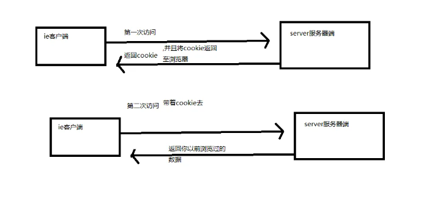
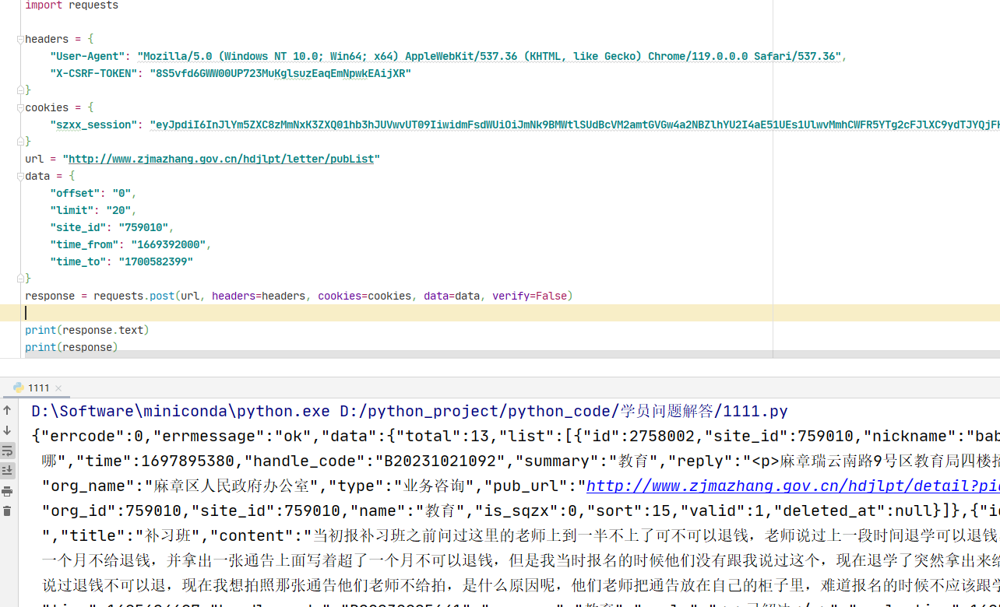

## COOKIE 反爬-1

**学习目标:**

1. 熟悉 响应 cookie 参数传递方式
2. 熟悉 多层数据请求过程
3. 熟悉 阿里系 cookie 处理方法
4. 熟悉 加速乐 cookie 处理方式

### 一.常见 COOKIE 反爬

#### 1. 简介

- Cookie 反爬虫指的是服务器端通过校验请求头中的 Cookie 值来区分正常用户和爬虫程序的手段，这种

  手段被广泛应用在 Web 应用中。

#### 2. 加密原理



- cookie 加密分为大致两种方式
  - 浏览器向服务器发送请求,服务器在响应头带上响应 cookie,下次请求的时候需要再带上 cookie 去进行请求
  - 浏览器向服务器发送请求,服务器返回的是一段 js 代码,浏览器需要解析 js 代码,在通过 js 代码在生成 cookie 信息

### 二.实战案例

#### 1. 服务器响应 cookie 信息

- 学习响应 cookie 和 session 的处理
- 学习基于首页返回的 cookie 值

##### 1. 逆向目标

- 地址：http://www.zjmazhang.gov.cn/hdjlpt/published?via=pc

- 接口：http://www.zjmazhang.gov.cn/hdjlpt/letter/pubList

- 对抗： cookie 反爬虫处理

##### 2. 逆向分析

- 可以先测试当前网站的接口,可以发现,当前的接口需要一个 cookie 值,一个 token 值



- `X-CSRF-TOKEN` 定位, 参数是在页面写死的,所以我需要先请求这个页面一次,在页面上或者这个值


- 定位 cookie 生成的位置,逆向 cookie 的时候,一定要先把页面的 cookie 清除掉之后再刷新,不然 cooki 可能在之前就已经生成了
- 当前的 cookie 是请求首页之后,获取到的服务器响应的数据,那我们的代码就需要先请求首页,获取 cookie 值,在请求对应的接口


##### 3. 逆向结果

```
import requests
import re
headers = {
    "User-Agent": "Mozilla/5.0 (Windows NT 10.0; Win64; x64) AppleWebKit/537.36 (KHTML, like Gecko) Chrome/119.0.0.0 Safari/537.36",
}

def get_cookie():
    url = 'http://www.zjmazhang.gov.cn/hdjlpt/published?via=pc'
    response = requests.get(url, headers=headers)
    szxx_session = response.cookies.get('szxx_session')
    CSRF = re.findall("var _CSRF = '(.*?)';", response.text)
    return szxx_session, CSRF


def get_data():
    szxx_session, CSRF = get_cookie()
    cookies = {
        "szxx_session": szxx_session
    }
    headers['X-Csrf-Token'] = CSRF[0]
    url = "http://www.zjmazhang.gov.cn/hdjlpt/letter/pubList"
    data = {
        "offset": "0",
        "limit": "20",
        "site_id": "759010",
        "time_from": "1669392000",
        "time_to": "1700582399"
    }
    response = requests.post(url, headers=headers, cookies=cookies, data=data, verify=False)

    print(response.text)
    print(response)

get_data()
```

#### 2. 阿里系 cookie 逆向

- 学习 JS 设置的 cookie 处理

- 学习轻度 JS 混淆处理

##### 1. 逆向目标

- 首页：https://xueqiu.com/today
- 目标：cookie： acw_sc\_\_v2

##### 2. 逆向分析

- 逆向 cookie 时需要先清空 cookie,让网页重新生成
- 阿里系的 cookie 在重新刷新之后,会进入到 debugger 模式

- 过无限 debugger

```
Function.prototype.__constructor_back = Function.prototype.constructor;
Function.prototype.constructor = function() {
    if(arguments && typeof arguments[0]==='string'){
        if("debugger" === arguments[0]){
            return
        }
    }
   return Function.prototype.__constructor_back.apply(this,arguments);
}
```

- 可以直接通过调试断点的方式,找到加密的位置


##### 3.逆向结果

- JavaScript 代码

```JavaScript

var _0x4818=['\x63\x73\x4b\x48\x77\x71\x4d\x49','\x5a\x73\x4b\x4a\x77\x72\x38\x56\x65\x41\x73\x79','\x55\x63\x4b\x69\x4e\x38\x4f\x2f\x77\x70\x6c\x77\x4d\x41\x3d\x3d','\x4a\x52\x38\x43\x54\x67\x3d\x3d','\x59\x73\x4f\x6e\x62\x53\x45\x51\x77\x37\x6f\x7a\x77\x71\x5a\x4b\x65\x73\x4b\x55\x77\x37\x6b\x77\x58\x38\x4f\x52\x49\x51\x3d\x3d','\x77\x37\x6f\x56\x53\x38\x4f\x53\x77\x6f\x50\x43\x6c\x33\x6a\x43\x68\x4d\x4b\x68\x77\x36\x48\x44\x6c\x73\x4b\x58\x77\x34\x73\x2f\x59\x73\x4f\x47','\x66\x77\x56\x6d\x49\x31\x41\x74\x77\x70\x6c\x61\x59\x38\x4f\x74\x77\x35\x63\x4e\x66\x53\x67\x70\x77\x36\x4d\x3d','\x4f\x63\x4f\x4e\x77\x72\x6a\x43\x71\x73\x4b\x78\x54\x47\x54\x43\x68\x73\x4f\x6a\x45\x57\x45\x38\x50\x63\x4f\x63\x4a\x38\x4b\x36','\x55\x38\x4b\x35\x4c\x63\x4f\x74\x77\x70\x56\x30\x45\x4d\x4f\x6b\x77\x34\x37\x44\x72\x4d\x4f\x58','\x48\x4d\x4f\x32\x77\x6f\x48\x43\x69\x4d\x4b\x39\x53\x6c\x58\x43\x6c\x63\x4f\x6f\x43\x31\x6b\x3d','\x61\x73\x4b\x49\x77\x71\x4d\x44\x64\x67\x4d\x75\x50\x73\x4f\x4b\x42\x4d\x4b\x63\x77\x72\x72\x43\x74\x6b\x4c\x44\x72\x4d\x4b\x42\x77\x36\x34\x64','\x77\x71\x49\x6d\x4d\x54\x30\x74\x77\x36\x52\x4e\x77\x35\x6b\x3d','\x44\x4d\x4b\x63\x55\x30\x4a\x6d\x55\x77\x55\x76','\x56\x6a\x48\x44\x6c\x4d\x4f\x48\x56\x63\x4f\x4e\x58\x33\x66\x44\x69\x63\x4b\x4a\x48\x51\x3d\x3d','\x77\x71\x68\x42\x48\x38\x4b\x6e\x77\x34\x54\x44\x68\x53\x44\x44\x67\x4d\x4f\x64\x77\x72\x6a\x43\x6e\x63\x4f\x57\x77\x70\x68\x68\x4e\x38\x4b\x43\x47\x63\x4b\x71\x77\x36\x64\x48\x41\x55\x35\x2b\x77\x72\x67\x32\x4a\x63\x4b\x61\x77\x34\x49\x45\x4a\x63\x4f\x63\x77\x72\x52\x4a\x77\x6f\x5a\x30\x77\x71\x46\x39\x59\x67\x41\x56','\x64\x7a\x64\x32\x77\x35\x62\x44\x6d\x33\x6a\x44\x70\x73\x4b\x33\x77\x70\x59\x3d','\x77\x34\x50\x44\x67\x63\x4b\x58\x77\x6f\x33\x43\x6b\x63\x4b\x4c\x77\x72\x35\x71\x77\x72\x59\x3d','\x77\x72\x4a\x4f\x54\x63\x4f\x51\x57\x4d\x4f\x67','\x77\x71\x54\x44\x76\x63\x4f\x6a\x77\x34\x34\x37\x77\x72\x34\x3d','\x77\x35\x58\x44\x71\x73\x4b\x68\x4d\x46\x31\x2f','\x77\x72\x41\x79\x48\x73\x4f\x66\x77\x70\x70\x63','\x4a\x33\x64\x56\x50\x63\x4f\x78\x4c\x67\x3d\x3d','\x77\x72\x64\x48\x77\x37\x70\x39\x5a\x77\x3d\x3d','\x77\x34\x72\x44\x6f\x38\x4b\x6d\x4e\x45\x77\x3d','\x49\x4d\x4b\x41\x55\x6b\x42\x74','\x77\x36\x62\x44\x72\x63\x4b\x51\x77\x70\x56\x48\x77\x70\x4e\x51\x77\x71\x55\x3d','\x64\x38\x4f\x73\x57\x68\x41\x55\x77\x37\x59\x7a\x77\x72\x55\x3d','\x77\x71\x6e\x43\x6b\x73\x4f\x65\x65\x7a\x72\x44\x68\x77\x3d\x3d','\x55\x73\x4b\x6e\x49\x4d\x4b\x57\x56\x38\x4b\x2f','\x77\x34\x7a\x44\x6f\x63\x4b\x38\x4e\x55\x5a\x76','\x63\x38\x4f\x78\x5a\x68\x41\x4a\x77\x36\x73\x6b\x77\x71\x4a\x6a','\x50\x63\x4b\x49\x77\x34\x6e\x43\x6b\x6b\x56\x62','\x4b\x48\x67\x6f\x64\x4d\x4f\x32\x56\x51\x3d\x3d','\x77\x70\x73\x6d\x77\x71\x76\x44\x6e\x47\x46\x71','\x77\x71\x4c\x44\x74\x38\x4f\x6b\x77\x34\x63\x3d','\x77\x37\x77\x31\x77\x34\x50\x43\x70\x73\x4f\x34\x77\x71\x41\x3d','\x77\x71\x39\x46\x52\x73\x4f\x71\x57\x4d\x4f\x71','\x62\x79\x42\x68\x77\x37\x72\x44\x6d\x33\x34\x3d','\x4c\x48\x67\x2b\x53\x38\x4f\x74\x54\x77\x3d\x3d','\x77\x71\x68\x4f\x77\x37\x31\x35\x64\x73\x4f\x48','\x55\x38\x4f\x37\x56\x73\x4f\x30\x77\x71\x76\x44\x76\x63\x4b\x75\x4b\x73\x4f\x71\x58\x38\x4b\x72','\x59\x69\x74\x74\x77\x35\x44\x44\x6e\x57\x6e\x44\x72\x41\x3d\x3d','\x59\x4d\x4b\x49\x77\x71\x55\x55\x66\x67\x49\x6b','\x61\x42\x37\x44\x6c\x4d\x4f\x44\x54\x51\x3d\x3d','\x77\x70\x66\x44\x68\x38\x4f\x72\x77\x36\x6b\x6b','\x77\x37\x76\x43\x71\x4d\x4f\x72\x59\x38\x4b\x41\x56\x6b\x35\x4f\x77\x70\x6e\x43\x75\x38\x4f\x61\x58\x73\x4b\x5a\x50\x33\x44\x43\x6c\x63\x4b\x79\x77\x36\x48\x44\x72\x51\x3d\x3d','\x77\x6f\x77\x2b\x77\x36\x76\x44\x6d\x48\x70\x73\x77\x37\x52\x74\x77\x6f\x39\x38\x4c\x43\x37\x43\x69\x47\x37\x43\x6b\x73\x4f\x52\x54\x38\x4b\x6c\x57\x38\x4f\x35\x77\x72\x33\x44\x69\x38\x4f\x54\x48\x73\x4f\x44\x65\x48\x6a\x44\x6d\x63\x4b\x6c\x4a\x73\x4b\x71\x56\x41\x3d\x3d','\x4e\x77\x56\x2b','\x77\x37\x48\x44\x72\x63\x4b\x74\x77\x70\x4a\x61\x77\x70\x5a\x62','\x77\x70\x51\x73\x77\x71\x76\x44\x69\x48\x70\x75\x77\x36\x49\x3d','\x59\x4d\x4b\x55\x77\x71\x4d\x4a\x5a\x51\x3d\x3d','\x4b\x48\x31\x56\x4b\x63\x4f\x71\x4b\x73\x4b\x31','\x66\x51\x35\x73\x46\x55\x6b\x6b\x77\x70\x49\x3d','\x77\x72\x76\x43\x72\x63\x4f\x42\x52\x38\x4b\x6b','\x4d\x33\x77\x30\x66\x51\x3d\x3d','\x77\x36\x78\x58\x77\x71\x50\x44\x76\x4d\x4f\x46\x77\x6f\x35\x64'];(function(_0x4c97f0,_0x1742fd){var _0x4db1c=function(_0x48181e){while(--_0x48181e){_0x4c97f0['\x70\x75\x73\x68'](_0x4c97f0['\x73\x68\x69\x66\x74']())}};var _0x3cd6c6=function(){var _0xb8360b={'\x64\x61\x74\x61':{'\x6b\x65\x79':'\x63\x6f\x6f\x6b\x69\x65','\x76\x61\x6c\x75\x65':'\x74\x69\x6d\x65\x6f\x75\x74'},'\x73\x65\x74\x43\x6f\x6f\x6b\x69\x65':function(_0x20bf34,_0x3e840e,_0x5693d3,_0x5e8b26){_0x5e8b26=_0x5e8b26||{};var _0xba82f0=_0x3e840e+'\x3d'+_0x5693d3;var _0x5afe31=0x0;for(var _0x5afe31=0x0,_0x178627=_0x20bf34['\x6c\x65\x6e\x67\x74\x68'];_0x5afe31<_0x178627;_0x5afe31++){var _0x41b2ff=_0x20bf34[_0x5afe31];_0xba82f0+='\x3b\x20'+_0x41b2ff;var _0xd79219=_0x20bf34[_0x41b2ff];_0x20bf34['\x70\x75\x73\x68'](_0xd79219);_0x178627=_0x20bf34['\x6c\x65\x6e\x67\x74\x68'];if(_0xd79219!==!![]){_0xba82f0+='\x3d'+_0xd79219}}_0x5e8b26['\x63\x6f\x6f\x6b\x69\x65']=_0xba82f0},'\x72\x65\x6d\x6f\x76\x65\x43\x6f\x6f\x6b\x69\x65':function(){return'\x64\x65\x76'},'\x67\x65\x74\x43\x6f\x6f\x6b\x69\x65':function(_0x4a11fe,_0x189946){_0x4a11fe=_0x4a11fe||function(_0x6259a2){return _0x6259a2};var _0x25af93=_0x4a11fe(new RegExp('\x28\x3f\x3a\x5e\x7c\x3b\x20\x29'+_0x189946['\x72\x65\x70\x6c\x61\x63\x65'](/([.$?*|{}()[]\/+^])/g,'\x24\x31')+'\x3d\x28\x5b\x5e\x3b\x5d\x2a\x29'));var _0x52d57c=function(_0x105f59,_0x3fd789){_0x105f59(++_0x3fd789)};_0x52d57c(_0x4db1c,_0x1742fd);return _0x25af93?decodeURIComponent(_0x25af93[0x1]):undefined}};var _0x4a2aed=function(){var _0x124d17=new RegExp('\x5c\x77\x2b\x20\x2a\x5c\x28\x5c\x29\x20\x2a\x7b\x5c\x77\x2b\x20\x2a\x5b\x27\x7c\x22\x5d\x2e\x2b\x5b\x27\x7c\x22\x5d\x3b\x3f\x20\x2a\x7d');return _0x124d17['\x74\x65\x73\x74'](_0xb8360b['\x72\x65\x6d\x6f\x76\x65\x43\x6f\x6f\x6b\x69\x65']['\x74\x6f\x53\x74\x72\x69\x6e\x67']())};_0xb8360b['\x75\x70\x64\x61\x74\x65\x43\x6f\x6f\x6b\x69\x65']=_0x4a2aed;var _0x2d67ec='';var _0x120551=_0xb8360b['\x75\x70\x64\x61\x74\x65\x43\x6f\x6f\x6b\x69\x65']();if(!_0x120551){_0xb8360b['\x73\x65\x74\x43\x6f\x6f\x6b\x69\x65'](['\x2a'],'\x63\x6f\x75\x6e\x74\x65\x72',0x1)}else if(_0x120551){_0x2d67ec=_0xb8360b['\x67\x65\x74\x43\x6f\x6f\x6b\x69\x65'](null,'\x63\x6f\x75\x6e\x74\x65\x72')}else{_0xb8360b['\x72\x65\x6d\x6f\x76\x65\x43\x6f\x6f\x6b\x69\x65']()}};_0x3cd6c6()}(_0x4818,0x15b));var _0x55f3=function(_0x4c97f0,_0x1742fd){var _0x4c97f0=parseInt(_0x4c97f0,0x10);var _0x48181e=_0x4818[_0x4c97f0];if(!_0x55f3['\x61\x74\x6f\x62\x50\x6f\x6c\x79\x66\x69\x6c\x6c\x41\x70\x70\x65\x6e\x64\x65\x64']){(function(){var _0xdf49c6=Function('\x72\x65\x74\x75\x72\x6e\x20\x28\x66\x75\x6e\x63\x74\x69\x6f\x6e\x20\x28\x29\x20\x7b\x7d\x2e\x63\x6f\x6e\x73\x74\x72\x75\x63\x74\x6f\x72\x28\x22\x72\x65\x74\x75\x72\x6e\x20\x74\x68\x69\x73\x22\x29\x28\x29\x29\x3b');var _0xb8360b=_0xdf49c6();var _0x389f44='\x41\x42\x43\x44\x45\x46\x47\x48\x49\x4a\x4b\x4c\x4d\x4e\x4f\x50\x51\x52\x53\x54\x55\x56\x57\x58\x59\x5a\x61\x62\x63\x64\x65\x66\x67\x68\x69\x6a\x6b\x6c\x6d\x6e\x6f\x70\x71\x72\x73\x74\x75\x76\x77\x78\x79\x7a\x30\x31\x32\x33\x34\x35\x36\x37\x38\x39\x2b\x2f\x3d';_0xb8360b['\x61\x74\x6f\x62']||(_0xb8360b['\x61\x74\x6f\x62']=function(_0xba82f0){var _0xec6bb4=String(_0xba82f0)['\x72\x65\x70\x6c\x61\x63\x65'](/=+$/,'');for(var _0x1a0f04=0x0,_0x18c94e,_0x41b2ff,_0xd79219=0x0,_0x5792f7='';_0x41b2ff=_0xec6bb4['\x63\x68\x61\x72\x41\x74'](_0xd79219++);~_0x41b2ff&&(_0x18c94e=_0x1a0f04%0x4?_0x18c94e*0x40+_0x41b2ff:_0x41b2ff,_0x1a0f04++%0x4)?_0x5792f7+=String['\x66\x72\x6f\x6d\x43\x68\x61\x72\x43\x6f\x64\x65'](0xff&_0x18c94e>>(-0x2*_0x1a0f04&0x6)):0x0){_0x41b2ff=_0x389f44['\x69\x6e\x64\x65\x78\x4f\x66'](_0x41b2ff)}return _0x5792f7})}());_0x55f3['\x61\x74\x6f\x62\x50\x6f\x6c\x79\x66\x69\x6c\x6c\x41\x70\x70\x65\x6e\x64\x65\x64']=!![]}if(!_0x55f3['\x72\x63\x34']){var _0x232678=function(_0x401af1,_0x532ac0){var _0x45079a=[],_0x52d57c=0x0,_0x105f59,_0x3fd789='',_0x4a2aed='';_0x401af1=atob(_0x401af1);for(var _0x124d17=0x0,_0x1b9115=_0x401af1['\x6c\x65\x6e\x67\x74\x68'];_0x124d17<_0x1b9115;_0x124d17++){_0x4a2aed+='\x25'+('\x30\x30'+_0x401af1['\x63\x68\x61\x72\x43\x6f\x64\x65\x41\x74'](_0x124d17)['\x74\x6f\x53\x74\x72\x69\x6e\x67'](0x10))['\x73\x6c\x69\x63\x65'](-0x2)}_0x401af1=decodeURIComponent(_0x4a2aed);for(var _0x2d67ec=0x0;_0x2d67ec<0x100;_0x2d67ec++){_0x45079a[_0x2d67ec]=_0x2d67ec}for(_0x2d67ec=0x0;_0x2d67ec<0x100;_0x2d67ec++){_0x52d57c=(_0x52d57c+_0x45079a[_0x2d67ec]+_0x532ac0['\x63\x68\x61\x72\x43\x6f\x64\x65\x41\x74'](_0x2d67ec%_0x532ac0['\x6c\x65\x6e\x67\x74\x68']))%0x100;_0x105f59=_0x45079a[_0x2d67ec];_0x45079a[_0x2d67ec]=_0x45079a[_0x52d57c];_0x45079a[_0x52d57c]=_0x105f59}_0x2d67ec=0x0;_0x52d57c=0x0;for(var _0x4e5ce2=0x0;_0x4e5ce2<_0x401af1['\x6c\x65\x6e\x67\x74\x68'];_0x4e5ce2++){_0x2d67ec=(_0x2d67ec+0x1)%0x100;_0x52d57c=(_0x52d57c+_0x45079a[_0x2d67ec])%0x100;_0x105f59=_0x45079a[_0x2d67ec];_0x45079a[_0x2d67ec]=_0x45079a[_0x52d57c];_0x45079a[_0x52d57c]=_0x105f59;_0x3fd789+=String['\x66\x72\x6f\x6d\x43\x68\x61\x72\x43\x6f\x64\x65'](_0x401af1['\x63\x68\x61\x72\x43\x6f\x64\x65\x41\x74'](_0x4e5ce2)^_0x45079a[(_0x45079a[_0x2d67ec]+_0x45079a[_0x52d57c])%0x100])}return _0x3fd789};_0x55f3['\x72\x63\x34']=_0x232678}if(!_0x55f3['\x64\x61\x74\x61']){_0x55f3['\x64\x61\x74\x61']={}}if(_0x55f3['\x64\x61\x74\x61'][_0x4c97f0]===undefined){if(!_0x55f3['\x6f\x6e\x63\x65']){var _0x5f325c=function(_0x23a392){this['\x72\x63\x34\x42\x79\x74\x65\x73']=_0x23a392;this['\x73\x74\x61\x74\x65\x73']=[0x1,0x0,0x0];this['\x6e\x65\x77\x53\x74\x61\x74\x65']=function(){return'\x6e\x65\x77\x53\x74\x61\x74\x65'};this['\x66\x69\x72\x73\x74\x53\x74\x61\x74\x65']='\x5c\x77\x2b\x20\x2a\x5c\x28\x5c\x29\x20\x2a\x7b\x5c\x77\x2b\x20\x2a';this['\x73\x65\x63\x6f\x6e\x64\x53\x74\x61\x74\x65']='\x5b\x27\x7c\x22\x5d\x2e\x2b\x5b\x27\x7c\x22\x5d\x3b\x3f\x20\x2a\x7d'};_0x5f325c['\x70\x72\x6f\x74\x6f\x74\x79\x70\x65']['\x63\x68\x65\x63\x6b\x53\x74\x61\x74\x65']=function(){var _0x19f809=new RegExp(this['\x66\x69\x72\x73\x74\x53\x74\x61\x74\x65']+this['\x73\x65\x63\x6f\x6e\x64\x53\x74\x61\x74\x65']);return this['\x72\x75\x6e\x53\x74\x61\x74\x65'](_0x19f809['\x74\x65\x73\x74'](this['\x6e\x65\x77\x53\x74\x61\x74\x65']['\x74\x6f\x53\x74\x72\x69\x6e\x67']())?--this['\x73\x74\x61\x74\x65\x73'][0x1]:--this['\x73\x74\x61\x74\x65\x73'][0x0])};_0x5f325c['\x70\x72\x6f\x74\x6f\x74\x79\x70\x65']['\x72\x75\x6e\x53\x74\x61\x74\x65']=function(_0x4380bd){if(!Boolean(~_0x4380bd)){return _0x4380bd}return this['\x67\x65\x74\x53\x74\x61\x74\x65'](this['\x72\x63\x34\x42\x79\x74\x65\x73'])};_0x5f325c['\x70\x72\x6f\x74\x6f\x74\x79\x70\x65']['\x67\x65\x74\x53\x74\x61\x74\x65']=function(_0x58d85e){for(var _0x1c9f5b=0x0,_0x1ce9e0=this['\x73\x74\x61\x74\x65\x73']['\x6c\x65\x6e\x67\x74\x68'];_0x1c9f5b<_0x1ce9e0;_0x1c9f5b++){this['\x73\x74\x61\x74\x65\x73']['\x70\x75\x73\x68'](Math['\x72\x6f\x75\x6e\x64'](Math['\x72\x61\x6e\x64\x6f\x6d']()));_0x1ce9e0=this['\x73\x74\x61\x74\x65\x73']['\x6c\x65\x6e\x67\x74\x68']}return _0x58d85e(this['\x73\x74\x61\x74\x65\x73'][0x0])};new _0x5f325c(_0x55f3)['\x63\x68\x65\x63\x6b\x53\x74\x61\x74\x65']();_0x55f3['\x6f\x6e\x63\x65']=!![]}_0x48181e=_0x55f3['\x72\x63\x34'](_0x48181e,_0x1742fd);_0x55f3['\x64\x61\x74\x61'][_0x4c97f0]=_0x48181e}else{_0x48181e=_0x55f3['\x64\x61\x74\x61'][_0x4c97f0]}return _0x48181e};

String[_0x55f3('0x5', '\x6e\x5d\x66\x52')][_0x55f3('0x6', '\x50\x67\x35\x34')] = function(_0x4e08d8) {
                var _0x5a5d3b = '';
                for (var _0xe89588 = 0x0; _0xe89588 < this[_0x55f3('0x8', '\x29\x68\x52\x63')] && _0xe89588 < _0x4e08d8[_0x55f3('0xa', '\x6a\x45\x26\x5e')]; _0xe89588 += 0x2) {
                    var _0x401af1 = parseInt(this[_0x55f3('0xb', '\x56\x32\x4b\x45')](_0xe89588, _0xe89588 + 0x2), 0x10);
                    var _0x105f59 = parseInt(_0x4e08d8[_0x55f3('0xd', '\x58\x4d\x57\x5e')](_0xe89588, _0xe89588 + 0x2), 0x10);
                    var _0x189e2c = (_0x401af1 ^ _0x105f59)[_0x55f3('0xf', '\x57\x31\x46\x45')](0x10);
                    if (_0x189e2c[_0x55f3('0x11', '\x4d\x47\x72\x76')] == 0x1) {
                        _0x189e2c = '\x30' + _0x189e2c;
                    }
                    _0x5a5d3b += _0x189e2c;
                }
                return _0x5a5d3b;
            }

String['\x70\x72\x6f\x74\x6f\x74\x79\x70\x65'][_0x55f3('0x14', '\x5a\x2a\x44\x4d')] = function() {
                var _0x4b082b = [0xf, 0x23, 0x1d, 0x18, 0x21, 0x10, 0x1, 0x26, 0xa, 0x9, 0x13, 0x1f, 0x28, 0x1b, 0x16, 0x17, 0x19, 0xd, 0x6, 0xb, 0x27, 0x12, 0x14, 0x8, 0xe, 0x15, 0x20, 0x1a, 0x2, 0x1e, 0x7, 0x4, 0x11, 0x5, 0x3, 0x1c, 0x22, 0x25, 0xc, 0x24];
                var _0x4da0dc = [];
                var _0x12605e = '';
                for (var _0x20a7bf = 0x0; _0x20a7bf < this['\x6c\x65\x6e\x67\x74\x68']; _0x20a7bf++) {
                    var _0x385ee3 = this[_0x20a7bf];
                    for (var _0x217721 = 0x0; _0x217721 < _0x4b082b[_0x55f3('0x16', '\x61\x48\x2a\x4e')]; _0x217721++) {
                        if (_0x4b082b[_0x217721] == _0x20a7bf + 0x1) {
                            _0x4da0dc[_0x217721] = _0x385ee3;
                        }
                    }
                }
                _0x12605e = _0x4da0dc['\x6a\x6f\x69\x6e']('');
                return _0x12605e;
            };
function aaa(arg1) {
    var _0x23a392 = arg1[_0x55f3('0x19', '\x50\x67\x35\x34')]();
    // console.log(_0x23a392)
    arg2 = _0x23a392[_0x55f3('0x1b', '\x7a\x35\x4f\x26')]('3000176000856006061501533003690027800375');

    return arg2
}
var arg1 = '0CDD15A553DCC55CAAC6184D41665E9586527AF9';
aaa(arg1)
```

- python 代码

```python
import requests
import re
import execjs


def get_cookie():
    headers = {
        "User-Agent": "Mozilla/5.0 (Windows NT 10.0; Win64; x64) AppleWebKit/537.36 (KHTML, like Gecko) Chrome/119.0.0.0 Safari/537.36",
    }
    url = "https://xueqiu.com/today"
    response = requests.get(url, headers=headers)
    arg1 = re.findall("arg1='(.*?)';", response.text)[0]
    coo = response.cookies.get('acw_tc')
    return arg1, coo


def get_data():
    arg1, coo = get_cookie()
    with open('emo.js', encoding='utf-8')as f:
        js_code = f.read()
    js = execjs.compile(js_code)
    coo2 = js.call('aaa', arg1)
    headers = {
        "User-Agent": "Mozilla/5.0 (Windows NT 10.0; Win64; x64) AppleWebKit/537.36 (KHTML, like Gecko) Chrome/119.0.0.0 Safari/537.36",
    }
    cookies = {
        "acw_tc": coo,
        'acw_sc__v2': coo2
    }
    url = "https://xueqiu.com/today"
    res = requests.get(url, headers=headers, cookies=cookies)
    print(res.text)


get_data()

```

#### 3. 加速乐系列 cookie 逆向

##### 1. 逆向目标

- 首页：https://www.mafengwo.cn/i/5376978.html

- 目标：cookie： \_\_jsl_clearance_s

##### 2. 逆向分析

- 加速乐 cookie 加密的特性
- cookie 关键字的名称:`__jsl_clearance_s` 里面会有`jsl`的字样
- 会对网址请求 3 次,前两次都是 512 的响应状态码,后面会响应正确的 200


- 这样的数据在抓包工具中查看预览一般不会显示数据,我们不好抓包调试,可以直接用过工具来抓对应的数据包

- 第一次会返回一个 js 代码,这个 js 代码可以直接通过 eval 来执行,会给我们返回一个 cookie 值,需要带上这个 cookie 值在去请求这个对应的接口


- 拿到响应的 cookie,在拿到这一段 js 代码生成的 cookie,在对当前接口发送请求,会返回另外一段 js 代码,我们需要再执行这一段 js 代码,会给我们返回一个新的 cookie 值,在去请求就会给我们返回正确的数据


- 前面一次 js 其实非常简单,主要是后面返回的 js 代码,我们需要去着重分析,想调试当前代码,我们需要把浏览器抓包的,脚步一栏打开,他可以帮助我们去拦截 js 所有执行的文件,他是不会给我们自动断点的


- 在第二次执行的位置同样的去进行定位,可以看到,当前网址调用的是一个 go 方法,数据内容应该是在 go 里面生成的,我们可以把断点下再函数内部


- 进过调试我们可以看出来,他的执行最终生成的当前这个数据


- 根据`ha`的参数用的加密方式也不一样,加速乐一般有 md5,sha1, sha256,我们都需要考虑到

##### 3.逆向结果

- JavaScript 代码

```JavaScript
window = global;
navigator = {}
document = {}
location = {}
navigator.userAgent = 'Mozilla/5.0 (Windows NT 10.0; Win64; x64) AppleWebKit/537.36 (KHTML, like Gecko) Chrome/119.0.0.0 Safari/537.36 Edg/119.0.0.0'
var _0x230c = ['wqjDl17CgQ==', 'wqMWw4hp', 'w7Nuw4I=', 'OcKaP8OR', 'cMOMLMO9', 'w4g4YsOb', 'VMOgwr7Cvg==', 'MA7DlQ==', 'wpEPNsK3', 'wobDmcO3w4I=', 'w7TDumzCqg==', 'wpwaw6wr', 'w6dPwpIq', 'wpkHLsKy', 'w7rDosO8w6w=', 'AMKpf8OM', 'w4LDrMOPw7U=', 'wrfDkMOnw40=', 'A8KlXcOL', 'w6lnQFY=', 'wqXDtMO2w6s=', 'w5XDrE3CiQ==', 'woYHBQE=', 'w5PDgEtZ', 'w6BSwoVP', 'Wz3CoDQ=', 'wpBpwrkm', 'wo81Tjs=', 'HQ7DrhI=', 'SDbCvDU=', 'woISQSI=', 'w5DDuks=', 'wrwAIz4=', 'w6nCgVQ4', 'wrMtQws=', 'dcKsNMOV', 'w7XDiEhG', 'w6kwWMOd', 'HcKSLjo=', 'KhXDlz0=', 'L8KKM8OM', 'w4gpw5nDvQ==', 'woHDlyrCqA==', 'w4fDtUhB', 'wq7CjkpK', 'w7QYw5PCtQ==', 'wqzCusKvwog=', 'w7Z7w4XDpQ==', 'wo3CoMKowps=', 'w7RKw47Dhg==', 'DWV3woQ=', 'wo/DgWZ9', 'wr/CnMOSw7Y=', 'wr9pwptr', 'w6tdwpEc', 'GcKWGS0=', 'YMKyw6XCtw==', 'w5DDqMOow6A=', 'P8KYKMO3', 'wrg3w4QI', 'w5XDmsO3w70=', 'wr0Hw7Nn', 'wp7DsMOVw4A=', 'wq7CgcKEwq0=', 'wrDCjXJp', 'wosfKcKK', 'w5lcwrBW', 'dsKiw6nCig==', 'woXDnX7ChQ==', 'wpLDl8OOw7Y=', 'G0sCDg==', 'w41YwqVL', 'HsKMasOe', 'AcO5w4TCpQ==', 'wodnw4V6', 'KMOiw6vCkA==', 'wqc6bhc=', 'w5/Cp8KkRg==', 'wpjChcO+w4A=', 'D0sAHA==', 'wo4SJCM=', 'wpl2NTo=', 'w4bDj8OIw7M=', 'wpXDrhvClQ==', 'w4DCnMOUw4w=', 'wrU1RSk=', 'XsO+M8OO', 'w6NLwpVo', 'w5AWeQ4=', 'wpjDpcOmw6w=', 'wpAqNig=', 'w60FZ8OG', 'MFfDviw=', 'VcOsw4bCgg==', 'EEEHDw==', 'wo7DmWTCjQ==', 'wos/w6sL', 'w6cLScOX', 'S8OxwpXCmw==', 'V8KCw7zCng==', 'K8KiW8Oh', 'Z8KVw6TCiw==', 'wpXCsMODw50=', 'wqUPLh0=', 'w7zDjcOYw6w=', 'w601ScOU', 'aCfChw4=', 'w7LDoMOzw4M=', 'VcO8wrfCsA==', 'AMKuesOC', 'csOSOsOb', 'JxbDiB4=', 'w7PDuMOow68=', 'RcKifDM=', 'wpDDlXzCjw==', 'G8O6w5HCqQ==', 'w6wiTsO/', 'wp1nwqle', 'w6lXH3Q=', 'EMO/w4TCgQ==', 'w6Nbw4zDqA==', 'wosdw7k8', 'wpzDiC7CjA==', 'Lnh0wpk=', 'w4LDuF/Ckg==', 'wrvDlmfCiA==', 'J8K/OB0=', 'w6jDvm/CrA==', 'wqZIIQM=', 'wqQlw7Z4', 'KsOaw4bCnw==', 'W8KaJ8O4', 'LHcjGA==', 'w7xQw40g', 'wpBZMAE=', 'PVfDohE=', 'w5zCuMKhcA==', 'B8KgesOa', 'w4Z0csKa', 'wrzCiGBw', 'wobDkcOuw7o=', 'wr3CtMKYwr4=', 'VsK5w7fCrA==', 'w7lzZ1Q=', 'w4BIw57Dpg==', 'X8OFwpTCkw==', 'wpYLw65n', 'w4JcYcKT', 'wpNBw6B1', 'w63Do8OQw4g=', 'HXF/wqM=', 'K1QKAg==', 'wpnDqx/ClQ==', 'HsKkJR8=', 'wr/Dh0xr', 'w6ZSwphV', 'wp0jw4dJ', 'woXCukdz', 'RsOKwpHChw==', 'wqvCjX5q', 'wrIRw4JD', 'wqhWw61k', 'Qx/CmTI=', 'wpg7w6ki', 'wqfCtUtH', 'QMO2I8Og', 'N8KKDDY=', 'wp4kw7bCig==', 'wrVxf8OT', 'w4PDm8OIw6E=', 'w5DCqsKrUw==', 'VcOKwoTCgQ==', 'w4DDu3Jg', 'XcOjwqLDig==', 'w54oVMOK', 'w5zDmkA=', 'K1AODA==', 'w5BhwpZw', 'G8Olw4DClQ==', 'wo7CuWdM', 'wp0NIMKU', 'wqNtwpxw', 'OsO/w4fChg==', 'wpzCrEfCvw==', 'w4N1wrVR', 'wo5aORE=', 'woPDpcOlw4g=', 'wqwdID8=', 'wp8/Dg4=', 'J8KqQcO8', 'wp0MIA==', 'wqlJwqYp', 'TjHDpH8=', 'w6PDpHPCmA==', 'wq/Ci2d4', '6K6D5rKc6auG6K6O', 'wrjDiCjChQ==', 'G8OZw6rCkw==', 'w4rDtEvCuA==', 'wokvw6R7', 'wqrDm8OPw4k=', 'wrttw6Fq', 'H1hcwro=', 'bAbCggc=', 'AsKQN8OB', 'DMKEJsOK', 'GMK7JCg=', 'wpljED0=', 'woNkwol2', 'wpXCmcOaw7I=', 'w6jCsT0o', 'w5Udw47Csw==', 'wrcmw5wl', 'wo7DiWvCng==', 'CsKgNcOE', 'w4dHw6HDrg==', 'E8KGWMOB'];
(function (_0x30e4eb, _0x230c15) {
    var _0x39296e = function (_0x84be69) {
        while (--_0x84be69) {
            _0x30e4eb['push'](_0x30e4eb['shift']());
        }
    };
    _0x39296e(++_0x230c15);
}(_0x230c, 0x131));
var _0x3929 = function (_0x30e4eb, _0x230c15) {
    _0x30e4eb = _0x30e4eb - 0x0;
    var _0x39296e = _0x230c[_0x30e4eb];
    if (_0x3929['vRXMYA'] === undefined) {
        (function () {
            var _0x58490b;
            try {
                var _0xbe41af = Function('return\x20(function()\x20' + '{}.constructor(\x22return\x20this\x22)(\x20)' + ');');
                _0x58490b = _0xbe41af();
            } catch (_0x4815a5) {
                _0x58490b = window;
            }
            var _0x2a6e8f = 'ABCDEFGHIJKLMNOPQRSTUVWXYZabcdefghijklmnopqrstuvwxyz0123456789+/=';
            _0x58490b['atob'] || (_0x58490b['atob'] = function (_0x4281ab) {
                    var _0x167e4d = String(_0x4281ab)['replace'](/=+$/, '');
                    var _0x5e3551 = '';
                    for (var _0x71a0a4 = 0x0, _0x327aeb, _0x528e14, _0x4c3d63 = 0x0; _0x528e14 = _0x167e4d['charAt'](_0x4c3d63++); ~_0x528e14 && (_0x327aeb = _0x71a0a4 % 0x4 ? _0x327aeb * 0x40 + _0x528e14 : _0x528e14,
                    _0x71a0a4++ % 0x4) ? _0x5e3551 += String['fromCharCode'](0xff & _0x327aeb >> (-0x2 * _0x71a0a4 & 0x6)) : 0x0) {
                        _0x528e14 = _0x2a6e8f['indexOf'](_0x528e14);
                    }
                    return _0x5e3551;
                }
            );
        }());
        var _0x525f40 = function (_0x2abb65, _0x4946f0) {
            var _0x1fb782 = [], _0x47abca = 0x0, _0x1ac699, _0xae943e = '', _0x40e38b = '';
            _0x2abb65 = atob(_0x2abb65);
            for (var _0x3db13a = 0x0, _0x2668a2 = _0x2abb65['length']; _0x3db13a < _0x2668a2; _0x3db13a++) {
                _0x40e38b += '%' + ('00' + _0x2abb65['charCodeAt'](_0x3db13a)['toString'](0x10))['slice'](-0x2);
            }
            _0x2abb65 = decodeURIComponent(_0x40e38b);
            var _0x4483a9;
            for (_0x4483a9 = 0x0; _0x4483a9 < 0x100; _0x4483a9++) {
                _0x1fb782[_0x4483a9] = _0x4483a9;
            }
            for (_0x4483a9 = 0x0; _0x4483a9 < 0x100; _0x4483a9++) {
                _0x47abca = (_0x47abca + _0x1fb782[_0x4483a9] + _0x4946f0['charCodeAt'](_0x4483a9 % _0x4946f0['length'])) % 0x100;
                _0x1ac699 = _0x1fb782[_0x4483a9];
                _0x1fb782[_0x4483a9] = _0x1fb782[_0x47abca];
                _0x1fb782[_0x47abca] = _0x1ac699;
            }
            _0x4483a9 = 0x0;
            _0x47abca = 0x0;
            for (var _0x58296e = 0x0; _0x58296e < _0x2abb65['length']; _0x58296e++) {
                _0x4483a9 = (_0x4483a9 + 0x1) % 0x100;
                _0x47abca = (_0x47abca + _0x1fb782[_0x4483a9]) % 0x100;
                _0x1ac699 = _0x1fb782[_0x4483a9];
                _0x1fb782[_0x4483a9] = _0x1fb782[_0x47abca];
                _0x1fb782[_0x47abca] = _0x1ac699;
                _0xae943e += String['fromCharCode'](_0x2abb65['charCodeAt'](_0x58296e) ^ _0x1fb782[(_0x1fb782[_0x4483a9] + _0x1fb782[_0x47abca]) % 0x100]);
            }
            return _0xae943e;
        };
        _0x3929['uJIGxA'] = _0x525f40;
        _0x3929['madvuK'] = {};
        _0x3929['vRXMYA'] = !![];
    }
    var _0x84be69 = _0x3929['madvuK'][_0x30e4eb];
    if (_0x84be69 === undefined) {
        if (_0x3929['JkyZRo'] === undefined) {
            _0x3929['JkyZRo'] = !![];
        }
        _0x39296e = _0x3929['uJIGxA'](_0x39296e, _0x230c15);
        _0x3929['madvuK'][_0x30e4eb] = _0x39296e;
    } else {
        _0x39296e = _0x84be69;
    }
    return _0x39296e;
};

var cryptojs = require('crypto-js')
hash1 = {
    'sha1': function (_0x25ab0f) {
        return cryptojs.SHA1(_0x25ab0f).toString()
    },
    'md5': function (_0x432264) {
        return cryptojs.MD5(_0x432264).toString()
    },
    'sha256': function (_0x432264) {
        return cryptojs.SHA256(_0x432264).toString()
    },
}

function go(_0x2969fa) {
    if (_0x2969fa['ha'] === 'sha1') {
        hash = hash1['sha1']
    }
    ;

    if (_0x2969fa['ha'] === 'md5') {
        hash = hash1['md5']
    }
    ;
    if (_0x2969fa['ha'] === 'sha256') {
        hash = hash1['sha256']
    }
    ;
    var _0x4abd2e = {};
    _0x4abd2e[_0x3929('0x9d', 'AYmy') + 'l'] = _0x3929('0x23', '!Kne') + _0x3929('0xa0', '@TGe');
    _0x4abd2e[_0x3929('0x15', 'pggg') + 't'] = function (_0x762cda, _0x19f68c) {
        return _0x762cda !== _0x19f68c;
    }
    ;
    _0x4abd2e[_0x3929('0x68', ']aM^') + 'R'] = _0x3929('0x92', 'wjO6') + 'y';
    _0x4abd2e[_0x3929('0xd6', 'Q%hC') + 'a'] = function (_0x4ec35c, _0x4c2bd5) {
        return _0x4ec35c != _0x4c2bd5;
    }
    ;
    _0x4abd2e[_0x3929('0x4c', '4l*q') + 's'] = function (_0x4ccc81, _0x48522a) {
        return _0x4ccc81 < _0x48522a;
    }
    ;
    _0x4abd2e[_0x3929('0xcd', 'Q%hC') + 'G'] = function (_0x20c529, _0x5cee5a) {
        return _0x20c529 + _0x5cee5a;
    }
    ;
    _0x4abd2e[_0x3929('0x14', 'KY4q') + 'w'] = function (_0x5318a5, _0xfea4ef) {
        return _0x5318a5 == _0xfea4ef;
    }
    ;
    _0x4abd2e[_0x3929('0xa5', 'aJ6i') + 'I'] = function (_0x568eff, _0x102832) {
        return _0x568eff + _0x102832;
    }
    ;
    _0x4abd2e[_0x3929('0xca', 'q9J%') + 'x'] = function (_0x2270f4, _0x6d3371) {
        return _0x2270f4 + _0x6d3371;
    }
    ;
    _0x4abd2e[_0x3929('0x27', '@TGe') + 'H'] = function (_0x1bfc37) {
        return _0x1bfc37();
    }
    ;
    _0x4abd2e[_0x3929('0xbc', 'hY2@') + 'a'] = function (_0x8f45fc, _0x31431b, _0x4e5595) {
        return _0x8f45fc(_0x31431b, _0x4e5595);
    }
    ;
    _0x4abd2e[_0x3929('0x5b', '4l*q') + 'K'] = function (_0x5bb08e, _0x471efd) {
        return _0x5bb08e(_0x471efd);
    }
    ;
    _0x4abd2e[_0x3929('0x82', '&B()') + 'g'] = function (_0x4d65f9, _0x497ea4) {
        return _0x4d65f9 - _0x497ea4;
    }
    ;
    _0x4abd2e[_0x3929('0x3d', 'Y4ZS') + 'u'] = function (_0x39ef6f, _0x4a6e3d) {
        return _0x39ef6f(_0x4a6e3d);
    }
    ;
    _0x4abd2e[_0x3929('0x2a', 'q9J%') + 'i'] = _0x3929('0x6b', '@oXL') + '澶辫触';
    var _0x50b9b3 = _0x4abd2e;

    function _0x24c4bd() {
        var _0x170721 = window[_0x3929('0xd4', 'eCr^') + _0x3929('0xc8', 'r&&7') + 'r'][_0x3929('0x5c', 'cdnu') + _0x3929('0xd1', 'POjI') + 't']
            , _0x476953 = [_0x50b9b3[_0x3929('0x8', 'hY2@') + 'l']];
        for (var _0x43a3d3 = 0x0; _0x43a3d3 < _0x476953[_0x3929('0xce', 'EY4@') + 'th']; _0x43a3d3++) {
            if (_0x50b9b3[_0x3929('0x79', '^9Sy') + 't'](_0x50b9b3[_0x3929('0xae', 'r7w*') + 'R'], _0x3929('0x44', '&B()') + 'y')) {
                _0x2fd47a = 0x5dc;
            } else {
                if (_0x50b9b3[_0x3929('0x94', 'bI)c') + 'a'](_0x170721[_0x3929('0x1', 'bKaz') + _0x3929('0x57', '@TGe')](_0x476953[_0x43a3d3]), -0x1)) {
                    return !![];
                }
            }
        }
        if (window[_0x3929('0xc2', 'cdnu') + _0x3929('0x78', 'ipP!') + _0x3929('0x88', 'AYmy')] || window[_0x3929('0x9f', 'Q%hC') + _0x3929('0xa8', 'AYmy')] || window[_0x3929('0x6', '9r[w') + _0x3929('0xb6', 'ipP!')] || window[_0x3929('0x4', 'fl0R') + _0x3929('0xb0', '0uzQ') + 'r'][_0x3929('0x47', '7JuT') + _0x3929('0x1a', '73SP') + 'r'] || window[_0x3929('0xe', '^9Sy') + _0x3929('0xa6', 'eJqJ') + 'r'][_0x3929('0x7e', 'rOjy') + _0x3929('0x6a', '4l*q') + _0x3929('0x95', 'wjO6') + _0x3929('0x7d', '73SP') + 'e'] || window[_0x3929('0x67', 'r7NR') + _0x3929('0xc5', '73SP') + 'r'][_0x3929('0x2', 'POjI') + _0x3929('0x40', 'eCr^') + _0x3929('0x91', 'Y4ZS') + _0x3929('0x7c', 'hY2@') + _0x3929('0xd', ')gwO')]) {
            return !![];
        }
    }
    ;
    if (_0x50b9b3[_0x3929('0x43', 'r&&7') + 'H'](_0x24c4bd)) {
        return;
    }
    var _0xe0483f = new Date();

    function _0x77dc24(_0x9f0d85, _0xb0e863) {
        var _0x583105 = _0x2969fa[_0x3929('0x63', 'POjI') + 's'][_0x3929('0xcb', '$fCO') + 'th'];
        for (var _0x2f70f7 = 0x0; _0x50b9b3[_0x3929('0x72', '!Kne') + 's'](_0x2f70f7, _0x583105); _0x2f70f7++) {
            for (var _0x4eb505 = 0x0; _0x4eb505 < _0x583105; _0x4eb505++) {
                var _0xcdc765 = _0x50b9b3[_0x3929('0xab', 'eCr^') + 'G'](_0x50b9b3[_0x3929('0xc9', 'aMe*') + 'G'](_0x50b9b3[_0x3929('0x59', 'r&&7') + 'G'](_0xb0e863[0x0], _0x2969fa[_0x3929('0xaf', 'sYeo') + 's'][_0x3929('0xa1', 'POjI') + 'tr'](_0x2f70f7, 0x1)), _0x2969fa[_0x3929('0xb7', 'J6WD') + 's'][_0x3929('0xb3', '!Kne') + 'tr'](_0x4eb505, 0x1)), _0xb0e863[0x1]);
                if (_0x50b9b3[_0x3929('0x93', 'aMe*') + 'w'](hash(_0xcdc765), _0x9f0d85)) {
                    return [_0xcdc765, new Date() - _0xe0483f];
                }
            }
        }
    }
    ;var _0xd28f59 = _0x50b9b3[_0x3929('0xbb', 'rOjy') + 'a'](_0x77dc24, _0x2969fa['ct'], _0x2969fa[_0x3929('0x83', '0uzQ')]);

    var _0x2fd47a;
    if (_0x2969fa['wt']) {
        _0x2fd47a = _0x50b9b3[_0x3929('0x10', 'Y4ZS') + 'K'](parseInt, _0x2969fa['wt']) > _0xd28f59[0x1] ? _0x50b9b3[_0x3929('0x58', '9r[w') + 'g'](parseInt(_0x2969fa['wt']), _0xd28f59[0x1]) : 0x1f4;
    } else {
        _0x2fd47a = 0x5dc;
    }
    aaa = function () {
        var _0x4a520b = _0x50b9b3[_0x3929('0x38', '0uzQ') + 'I'](_0x2969fa['tn'] + '=' + _0xd28f59[0x0] + (_0x3929('0xd5', '^9Sy') + _0x3929('0x5', 'q9J%') + '=') + _0x2969fa['vt'], _0x3929('0x75', ']4*G') + _0x3929('0x4f', 'QS$Y') + '\x20/');
        if (_0x2969fa['is']) {
            _0x4a520b = _0x4a520b + (_0x3929('0x50', 'eJqJ') + _0x3929('0xbe', '&B()') + _0x3929('0x2d', 'J6WD') + _0x3929('0x55', 'KY4q') + _0x3929('0xa4', 'rOjy') + _0x3929('0x66', 'cdnu'));
        }
        return _0x4a520b
    }
    // 直接把调用的传参cookie返回出来
    return aaa()
};
console.log(go({
    'bts': ['1700988826.375|0|wlL', 'YRQ%2BCPI3j66S1chcmUZx0Y%3D'],
    'chars': 'LiJqThdVEcgBfXDTWIVBWh',
    'ct': '433afa32e15fba379ea62fe5693a3afe',
    'ha': 'md5',
    'is': true,
    'tn': '__jsl_clearance_s',
    'vt': '3600',
    'wt': '1500'
}));


```

- python 代码

```python
import requests
import re
import execjs

headers = {
    'Referer': 'https://www.mafengwo.cn/i/5376978.html',
    'User-Agent': 'Mozilla/5.0 (Windows NT 10.0; Win64; x64) AppleWebKit/537.36 (KHTML, like Gecko) Chrome/119.0.0.0 Safari/537.36 Edg/119.0.0.0'
}
url = 'https://www.mafengwo.cn/i/5376978.html'


def first_request():
    response = requests.get(url, headers=headers)
    coo = re.findall("document.cookie=(.*?);location", response.text)[0]
    # cookie取值之后前面的不用
    __jsl_clearance_s = execjs.eval(coo).split('ance_s=')[-1]
    __jsluid_s = response.cookies.get('__jsluid_s')
    return __jsluid_s, __jsl_clearance_s


def second_request():
    __jsluid_s, __jsl_clearance_s = first_request()
    cookies = {'__jsluid_s': __jsluid_s, '__jsl_clearance_s': __jsl_clearance_s}
    res = requests.get(url, headers=headers, cookies=cookies)
    go_code = execjs.eval(re.findall(';go\((.*?)\)</s', res.text)[0])
    # print(go_code)
    js = execjs.compile(open('test.js', encoding='utf-8').read())
    __jsl_clearance_s = js.call('go', go_code).split('ance_s=')[-1]
    # print(__jsl_clearance_s)
    cookies['__jsl_clearance_s'] = __jsl_clearance_s
    return cookies


def third_request():
    cookies = second_request()
    res = requests.get(url, headers=headers, cookies=cookies)
    print(res.text)
    print(res.request.headers)

third_request()
```
