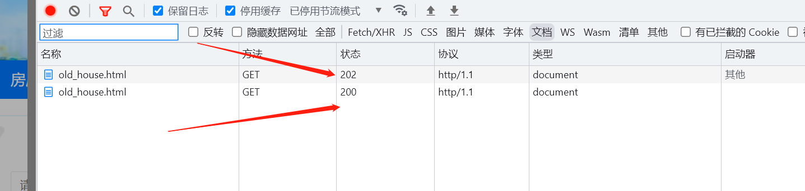
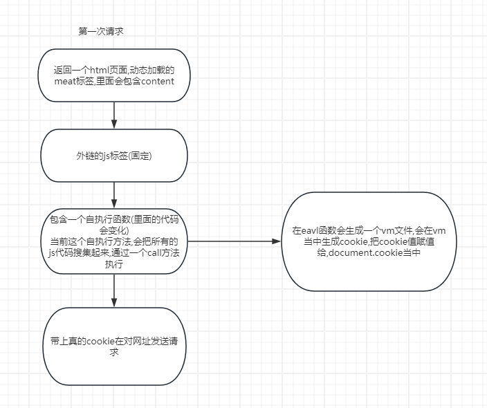
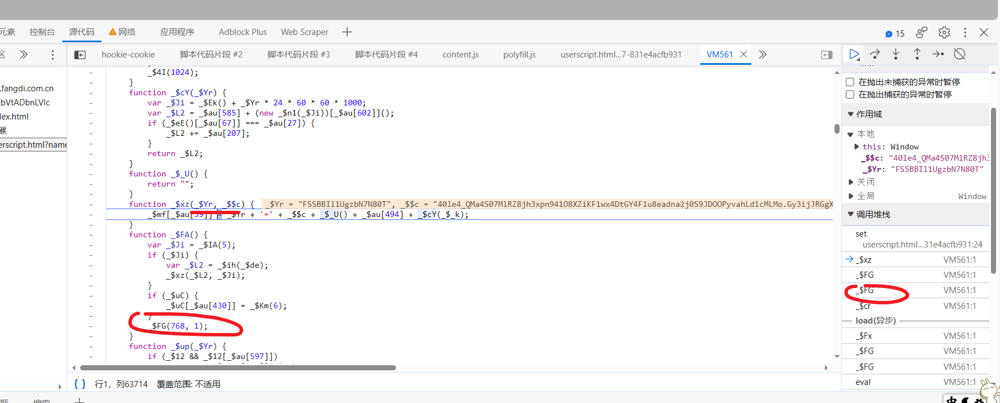
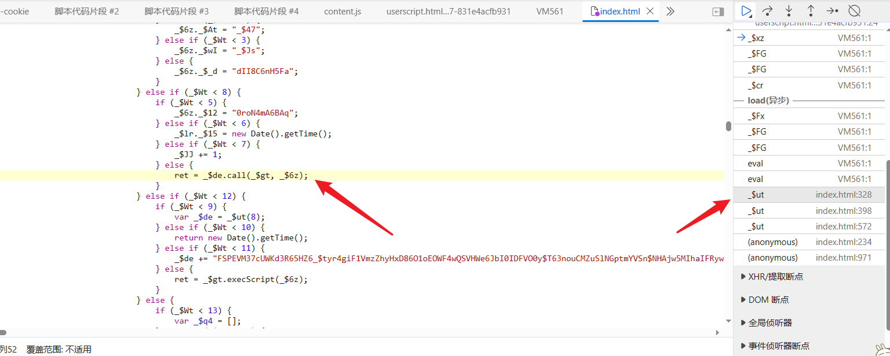
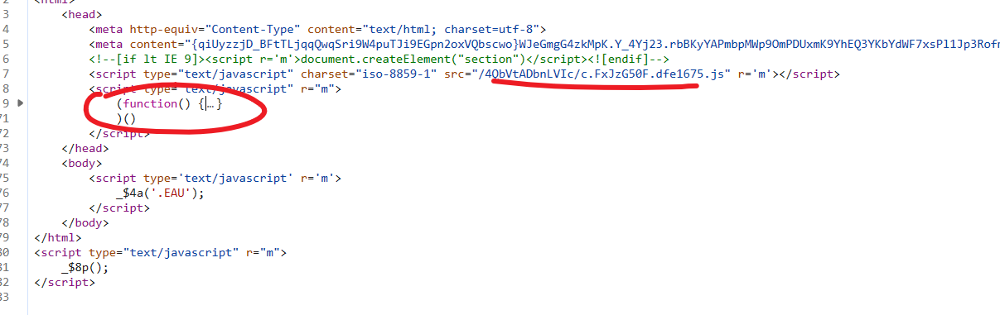

## 瑞数安全产品

### 一.简介

#### 1. 瑞数

瑞数动态安全 Botgate（机器人防火墙）以“动态安全”技术为核心，通过动态封装、动态验证、动态混淆、动态令牌等技术对服务器网页底层代码持续动态变换，增加服务器行为的“不可预测性”，实现了从用户端到服务器端的全方位“主动防护”，为各类 Web、HTML5 提供强大的安全保护。

#### 2. 瑞数执行流程分析

我们在做逆向的时候，首先得分析出哪些`加密参数`是需要逆向的，然后再是去逆向这些参数。当然瑞数也是一样。
所以我们第一步就是`明确逆向的目标`：

- 现象：上了 rs 的网站会请求两次 page_url，第二次请求 page_url 时才能得到正确的页面内容；
- 分析：分析其请求体，发现第二次请求 page_url 时带上了 cookie_s 和 cookie_t, 而 cookies_s 是来自第一次请求 page_url 时其响应头 set 的;



#### 3.执行流程



这里我们需要关注`eval调用`的位置（也就是`VM的入口`），**cookie 生成的位置**。

> 注：浏览器`v8`调用`eval`执行代码时会开启一个虚拟机（`VM`+数字）去执行 JavaScript 代码。

### 二.瑞数 4

#### 1. 逆向目标

- 网址:http://www.fangdi.com.cn/index.html
- 逆向参数:`FSSBBIl1UgzbN7N80T`

#### 2. 瑞数 4 特点

- debugger: 两次
- key 名字:`FSSBBIl1UgzbN7N80T`是 js 代码生成, `FSSBBIl1UgzbN7N80S`是服务器返回

#### 3. 逆向分析

- 过无限 debugger

```
var _constructor = constructor;
Function.prototype.constructor = function(s) {
    if (s == "debugger") {
        console.log(s);
        return null;
    }
    return _constructor(s);
}

//去除无限debugger
Function.prototype.__constructor_back = Function.prototype.constructor ;
Function.prototype.constructor = function() {
    if(arguments && typeof arguments[0]==='string'){
        //alert("new function: "+ arguments[0]);
        if( "debugger" === arguments[0]){
            // arguments[0]="consoLe.Log(\"anti debugger\");";
            //arguments[0]=";";
            return
    }
    }
    return Function.prototype.__constructor_back.apply(this,arguments);
};

var _Function = Function;
Function = function(s) {
    if (s == "debugger") {
        console.log(s);
        return null;
    }
    return _Function(s);
}
```

- hook 对应 cookie 生成的位置

```JavaScript
(function () {
// 严谨模式 检查所有错误
    'use strict';
// document 为要hook的对象 这里是hook的cookie
    var cookieTemp = "";
    Object.defineProperty(document, 'cookie', {
        // hook set方法也就是赋值的方法
        set: function (val) {
            // 这样就可以快速给下面这个代码行下断点
            // 从而快速定位设置cookie的代码
            if (val.indexOf('FSSBBIl1UgzbN7N80T') != -1) {
                debugger;
            }
            console.log('Hook捕获到cookie设置->', val);
            cookieTemp = val;
            return val;
        }, // hook get 方法也就是取值的方法
        get: function () {
            return cookieTemp;
        }
    });
})();
```

- 可以看到 cookie 的生成位置,
- 是有`$FG`函数调用生成的,执行的代码是在`vm`文件当中
- `vm`文件在瑞数当中都是通过`eval`生成的,可以网上找到他执行`eval`的位置



- 往下面的栈进行查找可以找到入口文件
- 这个文件就是瑞数第一次请求返回 412 状态码的页面



- 那我们就需要把这个页面的代码拿下来我们自己执行,获取的方法是一个自执行方法
- 需要把这个文件的外链 js 代码也拿过来,一般是一个 ts 数据的 js 文件
- 要进外链 js 文件的话,需要通过抓包工具的脚本功能



- 那下来之后我们就可以补环境了

#### 4.逆向结果

- JavaScript 代码

```JavaScript
//  检测当前执行的文件是哪一个
delete __dirname
delete __filename
content = "content_data"

function get_enviroment(proxy_array) {
    for (var i = 0; i < proxy_array.length; i++) {
        handler = '{\n' +
            '    get: function(target, property, receiver) {\n' +
            '        console.log("方法:", "get  ", "对象:", ' +
            '"' + proxy_array[i] + '" ,' +
            '"  属性:", property, ' +
            '"  属性类型:", ' + 'typeof property, ' +
            // '"  属性值:", ' + 'target[property], ' +
            '"  属性值类型:", typeof target[property]);\n' +
            '        return target[property];\n' +
            '    },\n' +
            '    set: function(target, property, value, receiver) {\n' +
            '        console.log("方法:", "set  ", "对象:", ' +
            '"' + proxy_array[i] + '" ,' +
            '"  属性:", property, ' +
            '"  属性类型:", ' + 'typeof property, ' +
            // '"  属性值:", ' + 'target[property], ' +
            '"  属性值类型:", typeof target[property]);\n' +
            '        return Reflect.set(...arguments);\n' +
            '    }\n' +
            '}'
        eval('try{\n' + proxy_array[i] + ';\n'
            + proxy_array[i] + '=new Proxy(' + proxy_array[i] + ', ' + handler + ')}catch (e) {\n' + proxy_array[i] + '={};\n'
            + proxy_array[i] + '=new Proxy(' + proxy_array[i] + ', ' + handler + ')}')
    }
}

proxy_array = ['window', 'document', 'location', 'navigator', 'history', 'screen', 'aaa', 'target']
window = global;
window.top = window;
window.fetch = function (res) {
    console.log('window中的fetch接受的值:', res)
}
window.sessionStorage = function (res) {
    console.log('window中的fetch接受的值:', res)
}

window.addEventListener = function (res) {
    console.log('window中的addEventListener接受的值:', res)
}
window.DOMParser = function (res) {
    console.log('window中的DOMParser接受的值:', res)
}
window.localStorage = {}
window.name = '$_YWTU=J5Kqj1vMVZt0p3jcKdQszRtzTokjPjsSc6r8XesJXBg&$_cDro=49&vdFm='
window.self = window
window.XMLHttpRequest = function () {

}

// document 环境
div = {
    getElementsByTagName: function (res) {
        console.log('div中的getElementsByTagName接受的值:', res)
        if (res == 'i') {
            return {length: 0}
        }
    }
}

meta = {
    0: {},
    1: {
        content: content,
        parentNode: {
            removeChild: function (res) {
                console.log('meta中的removeChild接受的值:', res)
            }
        }
    },
    length: 2
}
script = {
    0: {
        getAttribute: function (res) {
            console.log('script中的getAttribute接受的值:', res)
            if (res == 'r') {
                return 'm'
            }
        },
        parentElement: {
            removeChild: function (res) {
                console.log('script中的removeChild接受的值:', res)
            }
        }
    },
    1: {
        getAttribute: function (res) {
            console.log('script中的getAttribute接受的值:', res)
            if (res == 'r') {
                return 'm'
            }
        },
        parentElement: {
            removeChild: function (res) {
                console.log('script中的removeChild接受的值:', res)
            }
        }
    },
    length: 2
}
document = {
    characterSet: 'UTF-8',
    charset: 'UTF-8',
    createElement: function (res) {
        console.log('document中的createElement接受的值:', res)
        if (res == 'div') {
            return div
        } else {
            return {}
        }

    },
    getElementsByTagName: function (res) {
        console.log('document中的getElementsByTagName接受的值:', res)
        if (res == 'meta') {
            return meta
        }
        if (res == 'script') {
            return script
        }
        if (res == 'i') {
            return {length: 0}
        }
    },
    addEventListener: function (res) {
        console.log('document中的addEventListener接受的值:', res)
    },
    exitFullscreen: function (res) {
        console.log('document中的exitFullscreen接受的值:', res)
    },
    documentElement: {
        addEventListener: function () {
        },
        style: {}
    },

}

location = {
    "ancestorOrigins": {},
    "href": "http://www.fangdi.com.cn/service/service_law_detail_img2.html",
    "origin": "http://www.fangdi.com.cn",
    "protocol": "http:",
    "host": "www.fangdi.com.cn",
    "hostname": "www.fangdi.com.cn",
    "port": "",
    "pathname": "/service/service_law_detail_img2.html",
    "search": "",
    "hash": ""
};
navigator = {
    userAgent: "Mozilla/5.0 (Windows NT 10.0; Win64; x64) AppleWebKit/537.36 (KHTML, like Gecko) Chrome/105.0.0.0 Safari/537.36",
    languages: ["zh-CN", "zh"],
    appVersion: "5.0 (Windows NT 10.0; WOW64) AppleWebKit/537.36 (KHTML, like Gecko) Chrome/103.0.0.0 Safari/537.36",
    webdriver: false,
    appName: "Netscape",
    vendor: "Google Inc.",
    connection: {
        downlink: 10,
        effectiveType: "4g",
        rtt: 200,
        saveData: false,
    }
};


get_enviroment(proxy_array)
setTimeout = function () {
}
setInterval = function () {
}
// get_enviroment(proxy_array)
setTimeout = function () {
}
setInterval = function () {
}

'ts_code'

'func_code'

function get_cookie() {
    return document.cookie
}

console.log(get_cookie());


```

- python 代码

```
import requests
import re
import execjs
from lxml import etree

requests = requests.session()
headers = {
    'Host': 'www.fangdi.com.cn',
    'Referer': 'http://www.fangdi.com.cn/service/service_law_detail_img2.html',
    'User-Agent': 'Mozilla/5.0 (Windows NT 10.0; Win64; x64) AppleWebKit/537.36 (KHTML, like Gecko) Chrome/103.0.0.0 Safari/537.36',
}
url = 'http://www.fangdi.com.cn/index.html'


def first_request():
    response = requests.get(url, headers=headers)
    obj_html = etree.HTML(response.text)
    content_data = obj_html.xpath('//meta[2]/@content')[0]
    func_code = obj_html.xpath('//script[2]/text()')[0]
    return content_data, func_code


def second_request():
    content_data, func_code = first_request()
    # print(content_data, func_code)
    with open('1111.js', encoding='utf-8') as f:
        js_code = f.read().replace('content_data', content_data).replace("'func_code'", func_code)
    # print(js_code)
    js = execjs.compile(js_code)
    cookies = {'FSSBBIl1UgzbN7N80T': js.call('get_cookie').split(';')[0].split('=')[-1]}
    # print(cookies)
    res = requests.get(url, headers=headers, cookies=cookies)
    print(res.request.headers)
    print(res)
    # second_request()


second_request()

```

### 三.瑞数 5

#### 1.瑞数 5 特点

- `debugger`2 层
- 状态码第一次 412
- 补的方式和瑞数 4 一模一样

### 四.瑞数变异

#### 1.变异特点

- 和瑞数 6 是一致的
- 在 html 文件加载的是 ts 代码,不是一个自执行方法了
- 通过 vmp 的方式在加载的代码,外链的 js 可以直接写死

#### 2.逆向目标

- 网址:http://www.chinastock.com.cn/newsite/cgs-services/stockFinance/businessAnnc.html

#### 3.逆向结果

- JavaScript 代码

```JavaScript
delete __filename
delete __dirname

function get_enviroment(proxy_array) {
    for (var i = 0; i < proxy_array.length; i++) {
        handler = '{\n' +
            '    get: function(target, property, receiver) {\n' +
            '        console.log("方法:", "get  ", "对象:", ' +
            '"' + proxy_array[i] + '" ,' +
            '"  属性:", property, ' +
            '"  属性类型:", ' + 'typeof property, ' +
            // '"  属性值:", ' + 'target[property], ' +
            '"  属性值类型:", typeof target[property]);\n' +
            '        return target[property];\n' +
            '    },\n' +
            '    set: function(target, property, value, receiver) {\n' +
            '        console.log("方法:", "set  ", "对象:", ' +
            '"' + proxy_array[i] + '" ,' +
            '"  属性:", property, ' +
            '"  属性类型:", ' + 'typeof property, ' +
            // '"  属性值:", ' + 'target[property], ' +
            '"  属性值类型:", typeof target[property]);\n' +
            '        return Reflect.set(...arguments);\n' +
            '    }\n' +
            '}'
        eval('try{\n' + proxy_array[i] + ';\n'
            + proxy_array[i] + '=new Proxy(' + proxy_array[i] + ', ' + handler + ')}catch (e) {\n' + proxy_array[i] + '={};\n'
            + proxy_array[i] + '=new Proxy(' + proxy_array[i] + ', ' + handler + ')}')
    }
}
content="content_code"
proxy_array = ['window', 'document', 'location', 'navigator', 'history', 'screen']
window = global;
window.top = window
window.addEventListener = function (res) {
    console.log('window中的addEventListener：', res)
}


location = {
    "ancestorOrigins": {},
    "href": "http://www.chinastock.com.cn/newsite/cgs-services/stockFinance/businessAnnc.html",
    "origin": "http://www.chinastock.com.cn",
    "protocol": "http:",
    "host": "www.chinastock.com.cn",
    "hostname": "www.chinastock.com.cn",
    "port": "",
    "pathname": "/newsite/cgs-services/stockFinance/businessAnnc.html",
    "search": "",
    "hash": ""
}


i = {length: 0}
base = {length: 0}
div = {
    getElementsByTagName: function (res) {
        console.log('div中的getElementsByTagName：', res)
        if (res === 'i') {
            return i
        }

    }
}

script = {
    0: {},
    1: {}
}
meta = [
    {},
    {
        getAttribute: function (res) {
            console.log('meta中的getAttribute：', res)
            if (res === 'r') {
                return 'm'
            }
        },
        parentNode: {
            removeChild: function (res) {
                console.log('meta中的removeChild：', res)
                // return content
            }
        },
        content: content
    }
]
form = {
    id: "__Zm9ybS5pZAo__",
    action: "https://ucenter.miit.gov.cn/login.jsp",
}

document = {

    createElement: function (res) {
        console.log('document中的createElement：', arguments)
        if (res === 'div') {
            return div
        }
        if (res === 'form') {
            return form
        }


    },
    addEventListener: function (res) {
        console.log('document中的addEventListener:', res)
    },
    appendChild: function (res) {
        console.log('document中的appendChild：', res)
    },
    removeChild: function () {
        console.log('document中的removeChild：', arguments)
    },
    getElementsByTagName: function (res) {
        console.log('document中的getElementsByTagName：', arguments)
        if (res === 'script') {
            return script
        }
        if (res === 'meta') {
            return meta
        }
        if (res === 'base') {
            return base
        }
    },
    getElementById: function (res) {
        console.log('document中的getElementById：', arguments)
        if (res === 'root-hammerhead-shadow-ui') {
            return null
        }
    }

}


setInterval = function () {}
setTimeout = function () {}

get_enviroment(proxy_array)


'ts_code'

function main() {
    cookie = document.cookie

    return cookie
}

console.log(main())
```

- python 代码

```python
import requests
import re
import execjs
from lxml import etree

requests = requests.session()
headers = {
    "Connection": "keep-alive",
    "Upgrade-Insecure-Requests": "1",
    "User-Agent": "Mozilla/5.0 (Windows NT 10.0; Win64; x64) AppleWebKit/537.36 (KHTML, like Gecko) Chrome/99.0.4844.51 Safari/537.36",
    "Accept": "text/html,application/xhtml+xml,application/xml;q=0.9,image/avif,image/webp,image/apng,*/*;q=0.8,application/signed-exchange;v=b3;q=0.9",
    "Accept-Encoding": "gzip, deflate",
    "Accept-Language": "zh-CN,zh;q=0.9,en;q=0.8",
    "Host": "www.chinastock.com.cn"
}
url = 'http://www.chinastock.com.cn/newsite/cgs-services/stockFinance/businessAnnc.html'


def first_request():
    response = requests.get(url, headers=headers)
    print(response)
    obj_html = etree.HTML(response.text)
    content_code = obj_html.xpath('//meta[2]/@content')[0]
    ts_code = obj_html.xpath('//script[1]/text()')[0]
    # print(content_code, ts_code)
    return content_code, ts_code


def second_request():
    content_code, ts_code = first_request()
    with open('demo.js', encoding='utf-8') as f:
        js_code = f.read().replace('content_code', content_code).replace("'ts_code'", ts_code)
    # print(js_code)
    js = execjs.compile(js_code)
    cookies = {'1EzPGwRUoQaWT': js.call('main').split(';')[0].split('=')[-1]}
    print(cookies)
    res = requests.get(url, headers=headers, cookies=cookies)
    print(res.request.headers)
    print(res)


second_request()

def data_request():
    for page in range(1, 4):
        content_code, ts_code = first_request()
        with open('demo.js', encoding='utf-8') as f:
            js_code = f.read().replace('content_code', content_code).replace("'ts_code'", ts_code)
        # print(js_code)
        js = execjs.compile(js_code)
        cookies = {'1EzPGwRUoQaWT': js.call('main').split(';')[0].split('=')[-1]}
        print(cookies)
        url = "http://www.chinastock.com.cn/website2020/doc/queryDocList?pageSize=50&pageNo={}&dayLimit=9000&catName=yhgg_%E8%B0%83%E6%95%B4%E8%9E%8D%E8%B5%84%E8%9E%8D%E5%88%B8%E6%A0%87%E7%9A%84%E8%AF%81%E5%88%B8%E5%90%8D%E5%8D%95%E7%9A%84%E5%85%AC%E5%91%8A"
        res = requests.get(url.format(page), headers=headers, cookies=cookies)
        print(res.text)

# data_request()
```
