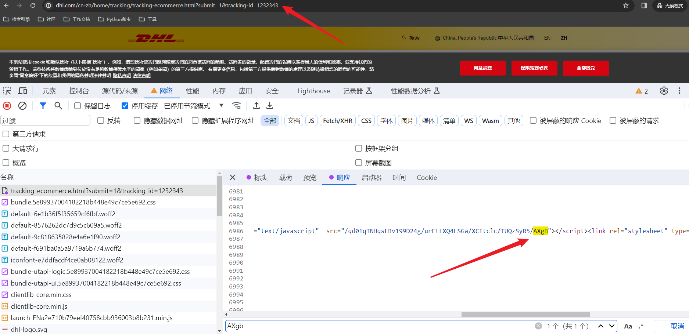
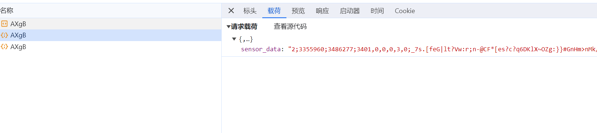
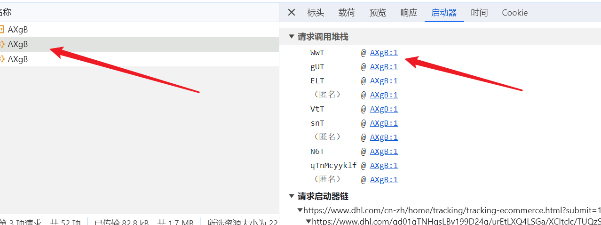
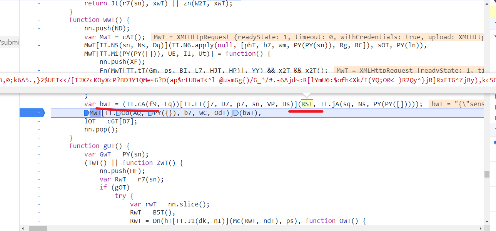
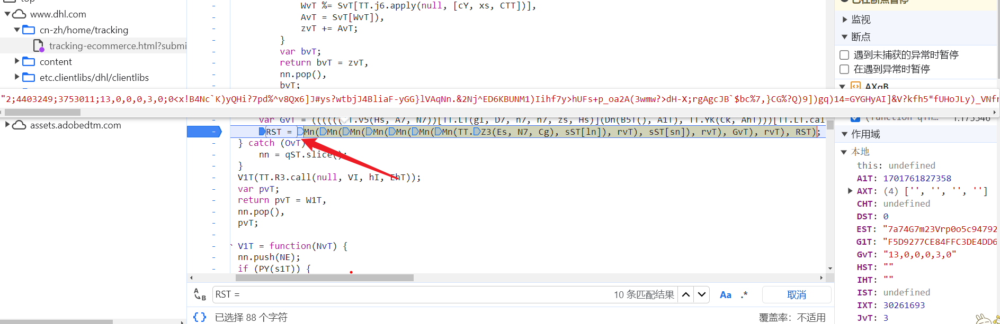

## AKAMAI 系列产品

**学习目标:**

1. 了解 akamai 执行过程
2. 熟悉 akamai 解析思路
3. 掌握 tls 指纹反爬原理

### 一.简介

#### 1. Akamai

- Akamai 是一家提供内容传递网络（CDN）和云服务的公司。CDN 通过将内容分发到全球各地的服务器，以减少网络延迟并提高用户访问网站的速度和性能。在其服务中，Akamai 使用一种称为 Akamai Cookie 加密的技术来增强安全性和保护用户的隐私。
- Akamai 常见的时 1.75 和 2 的版本,传递的数据是明文的数据就是 1.75,2 版本的数据是进行编码的

#### 2. 执行流程

Akamai 也是对 cookie 进加密处理的过程,但是和瑞数有区别,Akamai 请求过程:

- 请求网页地址,网页地址会返回一个外链的 js 代码



- 对外链地址发送 get 请求,获取到对应的 js 代码
- 在对当前外链 js 地址发送 post 请求,带上参数`sensor_data`
- 带上参数请求之后,会响应一个正确的`_abck`



- 逆向参数时需要注意 Akamai,每周会有一小改,一个月会大改一次
- 最重要的就是第二次的 post 请求,逆向的参数是`sensor_data`

### 二.逆向分析

#### 1. 逆向目标

- 网址:https://www.dhl.com/cn-zh/home/tracking/tracking-ecommerce.html?submit=1&tracking-id=1232343

- 逆向目标:`sensor_data`

#### 2.逆向分析

- 找到数据生成的位置,可以直接通过 xhr,或者通过启动器来定位



- 断点之后可以看到数据是 bwt 生成数据的,是由 RST 来的数据



- 可以找一下 RST 的生成位置



- 把他需要的代码都拿下来执行生成代码

#### 3.逆向结果

- JavaScript 代码

```
c6T = [300000, 4095, 1, 60, 40, 20, 0, 5, 16, 1000, 4, 21, 22, 30, 31, 8888888, 7777777, 8, 126, 47, 2, 10, 0.8, 0.7, 0.98, 0.4, 0.9, 0.95, 0.1, 0.025, 0.08, 0.075, 0.22, 255, 6, 4294967296, 999999, 13, 11, 24, 32, 3600000, 65535, 65793, 4294967295, 8388607, 4282663, 39, 3, 4064256, 9]

function B5T() {
    return VVT = Date.now && Date.now(), VVT;
}


var r1T = function () {
    var C4T = "Mozilla/5.0 (Windows NT 10.0; Win64; x64) AppleWebKit/537.36 (KHTML, like Gecko) Chrome/119.0.0.0 Safari/537.36";
    var P4T = "8108";
    var Q4T = 850845805802.5;
    var f4T = -1;
    var hzT = -1;
    var TzT = -1;
    var dzT = -1;
    var JzT = -1;
    var KzT = -1;
    var XzT = -1;
    var HzT = -1;
    HzT = 0;
    f4T = 1920;
    hzT = 1040;
    TzT = 1920;
    dzT = 1080;
    JzT = 150;
    KzT = 1920;
    XzT = 1920;

    NzT = 41869,
        FXT = 0;
    var wzT = Math.random();
    var LzT = parseInt(1000 * wzT / 2, 10);
    var nzT = ('').concat(wzT);
    nzT = Mn(nzT.slice(0, 11), LzT);
    var tzT = [
        "20030107",
        "zh-CN",
        "Gecko",
        5
    ];
    var DzT = tzT[0];
    var EzT = tzT[1];
    var szT = tzT[2];
    var czT = tzT[3];
    var jzT = 0;
    var FzT = 0;
    var IzT = 0;
    var lzT;
    return lzT = (((((((((((((((((((((((('').concat(C4T, ',uaend,')).concat(function gzT() {
        var mzT;
        var BzT;
        var kzT = 1;
        var CzT = 1;
        var PzT = 0;
        var QzT = 0;
        var fzT = 1;
        var h3T = 1;
        var T3T = 1;
        var d3T = 0;
        var J3T = 1;
        var K3T = 1;
        var X3T = 0;
        var H3T = 1;
        mzT = 1;
        BzT = 1;

        var V3T;
        return V3T = Mn(Mn(Mn(Mn(Mn(Mn(Mn(Mn(Mn(Mn(Mn(Mn(Mn(kzT, BXT(CzT, 1)), BXT(PzT, 2)), BXT(QzT, c6T[48])), BXT(fzT, 4)), BXT(h3T, 5)), BXT(T3T, c6T[34])), BXT(d3T, 7)), BXT(mzT, 8)), BXT(BzT, 9)), BXT(J3T, 10)), BXT(K3T, 11)), BXT(X3T, 12)), BXT(H3T, 13)),
            V3T;
    }(), ',')).concat(DzT, ',')).concat(EzT, ',')).concat(szT, ',')).concat(czT, ',')).concat(jzT, ',')).concat(FzT, ',')).concat(IzT, ',')).concat(NzT, ',')).concat(0, ',')).concat(f4T, ',')).concat(hzT, ',')).concat(TzT, ',')).concat(dzT, ',')).concat(KzT, ',')).concat(JzT, ',')).concat(XzT, ',')).concat(function x3T() {
        var W3T = [
            ",cpen:0",
            "i1:0",
            "dm:0",
            "cwen:0",
            "non:1",
            "opc:0",
            "fc:0",
            "sc:0",
            "wrc:1",
            "isc:0",
            "vib:1",
            "bat:1",
            "x11:0",
            "x12:1"
        ];

        var M3T;
        return M3T = W3T.join(','),
            M3T;
    }(), ',')).concat(P4T, ',')).concat(nzT, ',')).concat(Q4T, ',')).concat(0, ',')).concat(HzT, '#H,\x01 '),
        lzT;
};

function cST(bm_sz) {
    var YWT = bm_sz;
    var EWT = decodeURIComponent(YWT).split("~");
    var sWT = parseInt(EWT[2], 10), cWT = parseInt(EWT[3], 10);
    tWT = [sWT, cWT];
    return FWT = tWT

}


function ZST(Pz, xz) {
    var Lz = xz[0];
    var Vz = xz[1];
    var Rz = xz[2];
    (function sz() {
        fz = [];
        var Cj = 53;
        var Zj = "case gC:";
        var pj = 1663;
        var Dj = 0;
        for (var Fj = Cj; Fj < pj; ++Fj) {
            var Xj = "function lz(Pz,xz){'use strict';var Bz=lz;switch(Pz){case sC:{var Lz=xz[sr];var Vz=xz[gr];var Rz=xz[Nr];A6.push(Sz);(function sz(){A6.push(gz);if(Nz(typeof fz[h6],b6(h7.Lw(S6([]),Uz,xC,vj),[][[]]))){A6.pop();return;}function hj(wj){A6.push(Ij);var bj;return bj=Jj(typeof wj,h7.pw(Gj,BC))?h7.Nw(Tj,qj):b6(b6(h7.sw.apply(null,[LC,Aj]),wj),h7.gw(Hj,VC)),A6.pop(),bj;}var kj=h7[h7.Yw.call(null,Ej,rj,tj)].call(Bz);var Cj=kj[h7.fw(RC,Qj)](hj(mj[h6]),dj[h6]);var Zj=hj(Yj[h6]);var pj=kj[h7.fw(RC,Qj)](Zj,b6(Cj,cj[h6]));var Dj=h6;for(var Fj=Cj;Fj<pj;++Fj){var Xj=kj[h7.Uw.call(null,Mj,zj)](Fj);if(Xj!=jj&&Xj!=qj&&Xj!=nj){Dj=(Dj<<Oj)-Dj+Xj;Dj=Dj|h6;}}fz[h6]=Dj?Dj:H6;h7[h7.Sw.call(null,Kj,SC)][h6]=b6(h6,H6);A6.pop();}());if(h7.q7[sr]>sr){Wj(fz[sr]-lj[sr]);}var Pj;var xj;var Bj=S6(h6);var Lj=h7.Hb(Vj,Rj);var Sj=Rz?gj:sj;if(S6(Nj)&&(Nj=h7.Tb.apply(null,[fj,Uj,vn]),UM(Vz,h6)&&hn(Vz,wn)))for(Pj=h6;hn(Pj,wn);++Pj)if(Nz(Pj,Vz))for(xj=h6;M6(xj,In);++xj)Nj+=Pj[h7.Fw(bn,Jn)]();for(;;){for(Lj=h7.Hb.apply(null,[Vj,Rj]),Bj=S6(h6),Pj=h6;M6(Pj,b6(v7[h7.qb(Cc,gj)][h7.kb.call(null,Gn,An)](Hn(v7[h7.qb.apply(null,[Cc,gj])][h7.Eb(Aj,qj,Qc,zj)](),Sj)),Sj));++Pj){for(xj=h6;M6(xj,b6(v7[h7.qb.apply(null,[Cc,gj])][h7.kb(Gn,An)](Hn(v7[h7.qb.apply(null,[Cc,gj])][h7.Eb.apply(null,[S6(S6(h6)),Tn,Qc,zj])](),Sj)),Sj));++xj)Lj+=Nj[v7[h7.qb.call(null,Cc,gj)][h7.kb(Gn,An)](Hn(v7[h7.qb(Cc,gj)][h7.Eb.apply(null,[qn,S6(H6),Qc,zj])](),Nj[h7.Cw.apply(null,[mc,kn])]))];Lj+=h7.Hb.call(null,Vj,Rj);}for(Pj=h6;M6(Pj,Lz[h7.Cw.apply(null,[mc,kn])]);++Pj)if(Nz(En(H6),(Lz[Pj][h7.Fw.apply(null,[bn,Jn])]())[h7.fw(dc,Qj)](Lj))){Bj=S6(H6);break;}if(Bj){var rn;return rn=Lj,A6.pop(),rn;}}A6.pop();}break;case gC:{if(sr){throw Math.random();}}break;}}".charCodeAt(Fj);
            if (Xj != 10 && Xj != 13 && Xj != 32) {
                Dj = (Dj << 5) - Dj + Xj;
                Dj = Dj | 0;
            }
        }
        fz[0] = Dj ? Dj : 1;
    }());

    var Pj;
    var xj;
    var Bj = true;
    var Lj = ",";
    var Sj = 3;
    Nj = ""
    if (!Nj && (Nj = "abcdefghijklmnopaqrstuvxyzABCDEFGHIJKLMNOPAQRSTUVXYZ!@#%&-_=;:<>,~", (Vz >= 0) && Vz <= 9)) for (Pj = 0; Pj <= 9; ++Pj) if (Pj !== Vz) for (xj = 0; xj < 20; ++xj) Nj += Pj.toString();
    for (; ;) {
        for (Lj = ",", Bj = true, Pj = 0; Pj < Math.floor(Math.random() * Sj) + Sj; ++Pj) {
            for (xj = 0; xj < Math.floor(Math.random() * Sj) + Sj; ++xj) Lj += Nj[Math.floor(Math.random() * Nj.length)];
            Lj += ",";
        }
        for (Pj = 0; Pj < Lz.length; ++Pj) if (-1 !== (Lz[Pj].toString()).indexOf(Lj)) {
            Bj = false;
            break;
        }
        if (Bj) {
            return Lj
        }
    }
}

function HY(sHA) {
    for (var CHA = 0, bHA = 0; bHA < sHA.length; bHA++) {
        var tHA = sHA.charCodeAt(bHA);
        tHA < 128 && (CHA += tHA);
    }
    return CHA
}

var ZY = function (Oc, pc) {
    return Oc & pc;
};
var zY = function (gET, mET) {
    return gET % mET;
};
var r6T = function (O6T, p6T) {
    return O6T >> p6T;
};

var zn = function (Vn, An) {
    return Vn < An;
};
var Jt = function (jET, FET) {
    return jET === FET;
};
var Mn = function (bn, Gn) {
    return bn + Gn;
};

var BXT = function (rET, OET) {
    return rET << OET;
};

var U1T = function (bm_sz, _abck, html_url) {
    A1T = B5T()
    var sST = cST(bm_sz);

    RST = 0
    R1T = r1T()
    vST = "0,0,0,0,4873,113,0;0,-1,0,1,4763,1101,0;0,0,0,0,4880,113,0;0,-1,0,1,4870,1101,0;0,-1,0,1,4664,1101,0;0,0,0,0,4888,113,0;0,-1,0,1,4754,1101,0;0,0,0,0,4686,113,0;0,-1,0,1,3602,1101,0;"
    L1T = '0,0,0,0,4873,113,0;0,-1,0,1,4763,1101,0;0,0,0,0,4880,113,0;0,-1,0,1,4870,1101,0;0,-1,0,1,4664,1101,0;0,0,0,0,4888,113,0;0,-1,0,1,4754,1101,0;0,0,0,0,4686,113,0;0,-1,0,1,3602,1101,0;'
    fXT = [1, 32, 32, 0, 0, 0, 0, 4, 0, B5T(), -999999, 18204, 0, 0, 3034, 0, 0, 8, 0, '0', _abck, 39098, '-1', '-1', 30261693, 'PiZtE', 83797, 56, 0, '0', 0, ',', ''].join(',')
    W1T = ["-100", R1T, '-105', vST, '-108', '', '-101', "do_en,dm_en,t_en", "-110", '', '-117', '', '-109', '', '-102', L1T, '-111', '', '-114', '', '-103', '', '-106', '0,0', '-115', fXT, '-112', html_url, '-119', '-1', '-122', '0,0,0,0,1,0,0', '-123', '', '-124', '', '-126', '', '-127', 8, '-128', ',,', '-131', ',,,', '-132', '', '-133', '', '-70', '-1', '-80', '94', '-90', '9d94de22821c3355a13b27ed05656084f29f5daaa8066edff7b0a320a0df4079', '-116', 0];
    x1T = ZST(34, [W1T, 2, false])
    // console.log(x1T)
    RST = W1T.join(x1T)
    // console.log(RST)
    EST = '7a74G7m23Vrp0o5c947885'
    lST = 'yC4xvrXgniGeyikKztHA5Q=='
    RST = Mn(Mn(Mn(Mn(2, x1T), 2), x1T), RST = Mn(Mn(Mn(Mn(Mn(EST, lST), x1T), 24 ^ HY(RST), x1T), RST)));
    RST = function BST(kST, CST) {

        var PST;
        var QST;
        var fST;
        var hvT;
        var TvT = kST.split(',');
        for (hvT = 0; hvT < TvT.length; hvT++)
            PST = zY(ZY(CST >> c6T[17], c6T[42]), TvT.length),
                CST *= c6T[43],
                CST &= c6T[44],
                CST += 4282663,
                QST = zY(ZY(r6T(CST &= c6T[45], 8), c6T[42]), TvT.length),
                CST *= 65793, CST &= c6T[44], CST += c6T[46], CST &= c6T[45], fST = TvT[PST], TvT[PST] = TvT[QST], TvT[QST] = fST;
        var dvT;
        return dvT = TvT.join(','), dvT;
    }(RST, sST[1]);
    var UvT = [null, null, null, null, null, null, null, null, null, null, null, null, null, null, null, null, null, null, null, null, null, null, null, null, null, null, null, null, null, null, null, null, null, null, null, null, null, null, null, null, null, null, null, null, null, null, null, null, null, null, null, null, null, null, null, null, null, null, null, null, null, null, null, null, null, null, null, null, null, null, null, null, null, null, null, null, null, null, null, null, null, null, null, null, null, null, null, null, null, null, null, null, null, null, null, null, null, null, null, null, null, null, null, null, null, null, null, null, null, null, null, null, null, null, null, null, null, null, null, null, null, null, null, null, null, null, null]
    SvT = ''
    RST = function KvT(XvT, HvT) {

        for (var vvT = 0; zn(vvT, 127); ++vvT)
            zn(vvT, c6T[40]) || Jt(c6T[47], vvT) || Jt(34, vvT) || Jt(92, vvT) ? UvT[vvT] = -1 : (UvT[vvT] = SvT.length,
                SvT += String.fromCharCode(vvT));
        for (var zvT = '', VvT = 0; zn(VvT, XvT.length); VvT++) {
            var AvT = XvT.charAt(VvT)
                , xvT = ZY(r6T(HvT, 8), c6T[42]);
            HvT *= c6T[43],
                HvT &= c6T[44],
                HvT += c6T[46],
                HvT &= c6T[45];
            var WvT = UvT[XvT.charCodeAt(VvT)];
            if ('function' == typeof AvT.codePointAt) {
                var MvT = AvT.codePointAt(c6T[6]);
                MvT >= 32 && zn(MvT, 127) && (WvT = UvT[MvT]);
            }
            WvT >= 0 && (WvT += zY(xvT, SvT.length),
                WvT %= SvT.length,
                AvT = SvT[WvT]),
                zvT += AvT;
        }
        var bvT;
        return bvT = zvT,
            bvT;
    }(RST, sST[0])


    var GvT = (((((("")["concat"](B5T() - A1T, ","))["concat"](0, ","))["concat"](0, ","))["concat"](1, ","))["concat"](2, ","))["concat"](0);
    RST = Mn(Mn(Mn(Mn(Mn(Mn(Mn("2;", sST[0]), ";"), sST[1]), ";"), GvT), ";"), RST);
    return RST
}

console.log(U1T("4C0EB5576E56746FEA7E44353E408D11~YAAQR/6Yc5BPnNqLAQAAFFPwLhX7EkI2BZKgs0KasB3v8z1/DXKLlqPjmBokz04h+DYiIl9tIvrKfh9dQt/TeFfljUF+nyZqYk3OFGHYsF0nAp51CGFMES2LeMCS6BV91mOd+E30H9Wm2r84gdtqIG/2xbLNgDBr5G1goDbTWKo4cmQckkVSohHHY/pHJBMWf57Smr1kkqSrpc0eAsKCjoj9efCCjpaTwQ4xH5M90aInNQ4nrGSWkOXwjAiWMCXjKmrCUzAY+pOn1t3iZ7XsTESbLCrD9j/QiWq0Bp2GfHOzGoyurQiyyLXLKTKD3E828pr/GcQOjaSawUW4DLkj/3MYdNj6B7ORTvm2tkZKtQ+goghIFv91U3dRGTAXNehjKWPx7MOQKVHOFYjp14E=~3293492~3355459", '9536F265393639331496ED854EE3E805~-1~YAAQrwrgerSeg92LAQAAo3UkNQt6QJJSDBrga9f5KmTHn9Wdd3SzFcOdHquwxSdmh0HUhJUSMrccC/vqwqr9XLD7ZOrXt/VN967VZr6gy174KqV7m/HOA4ufRJJ/qdwaFdRwWnImEJdtbK4TRWvDjy9XPvtcz1A2+qtmV09bV8DuvO0wAIQD9JJxomFL5+GFgLa97spFGlATFHBz4JLX8oOscnBGv6qOKOQvYZgDhbP0Z6vuuS+NcsbF1IdyVzF3/zs/Yb5F5Tuy6wbiKUd/IAAwoWj9Vg/Y4y5n8mk1OjMIpnd6YB9f3Hnso+26lEqcCidXHYq6i8Zb+KlFVr9IyfYIuhxWZo6/OjYvTtKVLNqzOOB2W/XIdS9CQVvXoAtEnd7gNmFA7gZtCrJDZwYmSdcTo5VVrH/iZ5igXjw/~-1~-1~-1', 'https://www.dhl.com/cn-zh/home.html'));

```

- python 代码

```python
import execjs
import requests
import re

headers = {
    "user-agent": "Mozilla/5.0 (Windows NT 10.0; Win64; x64) AppleWebKit/537.36 (KHTML, like Gecko) Chrome/119.0.0.0 Safari/537.36"
}
url = "https://www.dhl.com/cn-zh/home/tracking/tracking-ecommerce.html"
params = {
    "submit": "1",
    "tracking-id": "1232343"
}
response = requests.get(url, headers=headers, params=params)

js_url = 'https://www.dhl.com' + re.findall('/noscript><script type="text/javascript"  src="(.*?)"></sc', response.text)[0]
cookies = {
    '_abck': response.cookies.get('_abck'),
    'bm_sz': response.cookies.get('bm_sz'),
    'ak_bmsc': response.cookies.get('ak_bmsc')
}

headers = {
    "referer": "https://www.dhl.com/cn-zh/home/tracking/tracking-ecommerce.html?submit=1&tracking-id=1232343",
    "user-agent": "Mozilla/5.0 (Windows NT 10.0; Win64; x64) AppleWebKit/537.36 (KHTML, like Gecko) Chrome/119.0.0.0 Safari/537.36"
}
res = requests.get(js_url, headers=headers, cookies=cookies)
dd = execjs.compile(open('扣代码.js', encoding='utf-8').read()).call('U1T', cookies['bm_sz'], res.cookies.get('_abck'), url)
# print(dd)
cookies['_abck'] = res.cookies.get('_abck')
data = {'sensor_data':dd}
headers1 = {
    "origin": "https://www.dhl.com",
    "referer": "https://www.dhl.com/cn-zh/home/tracking/tracking-ecommerce.html?submit=1&tracking-id=1232343",
    "user-agent": "Mozilla/5.0 (Windows NT 10.0; Win64; x64) AppleWebKit/537.36 (KHTML, like Gecko) Chrome/119.0.0.0 Safari/537.36"
}
print(data)
res1 = requests.post(js_url, headers=headers1, cookies=cookies, json=data)
print(res1.cookies)
print(res1.text)


```

### 三.TLS 指纹

#### 1. 简介

- TLS（传输层安全性）指纹是指一种用于标识和识别 TLS 协议连接的技术。TLS 是一种加密通信协议，用于在计算机网络上保护数据的传输安全。TLS 指纹可用于唯一标识特定 TLS 连接的加密参数和协商结果。
- 指纹的携带一般都是在 https 当中的, ssl/tls 都是在安全套接字层,可以把 ssl/tls 当做是两个步骤,先会去验证 ssl/tls,通过之后再去发送 http 请求

#### 2. 导致的后果

- 通过浏览器能正常获取到数据,但是通过代码哪怕带上全部的请求头的信息也是请求失败,返回的数据不对
- 那这种网站多半检测浏览器指纹,每个浏览器都会有指纹,通过 requests 发送请求时,底层用的是 urllib3 的库,库也会生成对应的指纹,服务器会检测这些指纹是不是属于这些库的,要是指纹不对,就不会返回数据

#### 3. 测试指纹

- 测试 tsl 指纹网址:https://tls.browserleaks.com/json
- 练习网址:https://ascii2d.net/

```python
import requests
from curl_cffi import requests

print("edge99:", requests.get("https://tls.browserleaks.com/json", impersonate="edge99").json())
print("chrome110:", requests.get("https://tls.browserleaks.com/json", impersonate="chrome110").json())
print("safari15_3:", requests.get("https://tls.browserleaks.com/json", impersonate="safari15_3").json())

```
