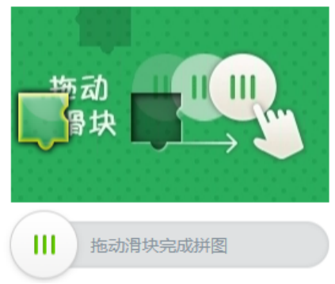

## 验证码专题

### 一.验证码简介



**注：**重点是识别滑块缺口，测出需要拖动的距离

#### 1. **核心步骤**

1. 从服务器随机取一张图片，并对图片上的随机`x,y`坐标和宽高一块区域抠图；
2. 根据步骤一的坐标和宽高，使用二维数组保存原图上抠图区域的像素点坐标；
3. 根据步骤二的坐标点，对原图的抠图区域的颜色进行处理。
4. 完成以上步骤之后得到两张图(扣下来的方块图，带有抠图区域阴影的原图),将这两张图和抠图区域的 y 坐标传到前台，前端在移动方块验证时，将移动后的 x 坐标传递到后台与原来的 x 坐标作比较，如果在阈值内则验证通过。
5. **请求验证的步骤**：前台向后台发起请求，后台随机一张图片做处理将处理完的两张图片的`base64`，抠图 y 坐标和`token`(token 为后台缓存验证码的唯一`token`,可以用缓存和分布式缓存)返回给前台。
6. 前台滑动图片将`x`坐标和`token`作为参数请求后台验证，服务器根据`token`取出`x`坐标与参数的 x 进行比较。

#### 2. 突破规则

首先我们先看看，**确定滑块验证码需要拖拽的位移距离**

**有三种方式**

- 人工智能机器学习，确定滑块位置
- 通过完整图片与缺失滑块的图片进行像素对比，确定滑块位置
- 花钱找人识别
  - 云码:https://www.jfbym.com/

各有优缺点。人工智能机器学习，确定滑块位置，需要进行训练比较麻烦，所以我们主要看后面两种。

#### 3. 常见验证码平台介绍

易盾：https://dun.163.com/product/captcha?from=baiduP2_YZM_CP4183

顶象：https://www.dingxiang-inc.com/business/captcha

同盾：https://xiaodun.com/onlineExperience/slidingPuzzle

数美：https://www.ishumei.com/

VAPTCHA：https://www.vaptcha.com/?lang=cn&from=0

极验：https://www.geetest.com/show

腾讯：https://007.qq.com/

阿里：https://we.51job.com/api/job/search-pc?api_key=51job&timestamp=1694777773&keyword=java&searchType=2&function=&industry=&jobArea=000000&jobArea2=&landmark=&metro=&salary=&workYear=&degree=&companyType=&companySize=&jobType=&issueDate=&sortType=0&pageNum=2&requestId=f6e64a68f0c18cd69f676f36a687a233&pageSize=20&source=1&accountId=&pageCode=sou%7Csou%7Csoulb

谷歌：https://www.google.com/recaptcha/api2/demo

AJ : 小公司喜欢用 开源的 只有 2 种 滑块 点选

地址：https://jnt.mfu.com.cn/page/tg 免费不要钱 AJ 验证码 没有轨迹

自己公司写的验证码，这种最简单

`recaptcha  hcaptcha  funcaptcha` 三剑客

解决方案：https://www.yescaptcha.com/auth/register 专业破谷歌

#### 4.滑动验证码处理

##### 1. 验证码图片处理

- 网址:https://dun.163.com/trial/jigsaw
- 使用浏览器技术提取滑块图片，进行处理

```python

import requests

url = 'https://necaptcha.nosdn.127.net/1396e11fe3c5493e80e63c533f3bd944.jpg'
res = requests.get(url)
open('full.png', 'wb').write(res.content)

url = 'https://necaptcha.nosdn.127.net/4859c94244e8463188777a04f6bb9a1b.png'
res = requests.get(url)
open('bg.png', 'wb').write(res.content)

```

##### 2.`ddddocr`识别

- 这里使用开源的技术`ddddocr`进行滑块的识别
- 项目地址:https://github.com/sml2h3/ddddocr
- 安装方式: pip install ddddocr

```python
import ddddocr


def text_dis():
    det = ddddocr.DdddOcr(det=False, ocr=False, show_ad=False)

    with open('bg.png', 'rb') as f:
        target_bytes = f.read()

    with open('full.png', 'rb') as f:
        background_bytes = f.read()

    res = det.slide_match(target_bytes, background_bytes)

    print(res)


if __name__ == '__main__':
    text_dis()

```

#### 5 文字点选识别

外接地址：http://www.chaojiying.com/api-5.html

外接地址：https://zhuce.jfbym.com/?bd_vid=7537823361963195239

练习网址:https://www.geetest.com/demo/click-float.html

- 获取图片

```python

import requests

url = 'https://static.geetest.com/captcha_v3/batch/v3/55187/2023-12-08T14/word/75b4ac5bc2be4634bbf8be3f90aeedf2.jpg?challenge=15a05a89c1389e1c933b7292518e3479'
res = requests.get(url)
open('click.png', 'wb').write(res.content)

```

- 识别代码

```python
import json

import requests
import base64


class YdmVerify(object):
    _custom_url = "http://api.jfbym.com/api/YmServer/customApi"
    _token = "N4gM_VcNbaiuxcuZEuh4g2aI-jSj9SDdV70Du6rzStw"
    _headers = {
        'Content-Type': 'application/json'
    }

    def slide_verify(self, slide_image, background_image, verify_type="20111"):
        payload = {
            "slide_image": base64.b64encode(slide_image).decode(),
            "background_image": base64.b64encode(background_image).decode(),
            "token": self._token,
            "type": verify_type
        }

        resp = requests.post(self._custom_url, headers=self._headers, data=json.dumps(payload))
        print(resp.text)
        return resp.json()['data']['data']

    def click_verify(self, image, extra=None, verify_type="30103"):
        payload = {
            "image": base64.b64encode(image).decode(),
            "extra": 'click',
            "token": self._token,
            "type": verify_type
        }
        if extra:
            payload['extra'] = extra
        resp = requests.post(self._custom_url, headers=self._headers, data=json.dumps(payload))
        print(resp.text)
        return resp.json()['data']['data']


if __name__ == '__main__':
    y = YdmVerify()
    # slide_image = open('bg.png', 'rb').read()
    # background_image = open('full.png', 'rb').read()
    # y.slide_verify(slide_image, background_image)
    image = open('click.png', 'rb').read()
    y.click_verify(image)

```

### 二. 极验滑块实战

- 使用自动化过滑块

```python
链接：https://pan.baidu.com/s/1zR2fIvO2iyC3esraWWYIvw
提取码：1234
```

### 三.点选验证码协议

#### 1. 逆向目标

- 网址:https://www.geetest.com/demo/click-float.html
- 逆向接口:https://api.geevisit.com/ajax.php
- 重点参数:`w`

#### 2. 逆向分析

- 代码 ast 还原
- 参数值需要换成自己的

```JavaScript
const parser = require("@babel/parser");
const traverse = require("@babel/traverse").default;
const t = require("@babel/types");
const generator = require("@babel/generator").default;
const fs = require("fs");

// #######################################
// 还原需要用到的js源码
// #######################################
//解密方法  还原字符串的


// #######################################

// #######################################
// AST解析函数
// #######################################
// 删除节点中的extra属性（二进制、Unicode等编码 -> utf-8）
function replace_unicode(path) {
    let node = path.node;
    if (node.extra === undefined)
        return;
    delete node.extra;
}

// 定义一个全局变量，存放待替换变量名
let name_array = [];

function get_name_array(path) {
    let {kind, declarations} = path.node
    if (kind !== 'var'
        || declarations.length !== 3
        || declarations[0].init === null
        || declarations[0].init.property === undefined)
        return;
    if (declarations[0].init.property.name !== "$_CV")
        return;
    // 获取待替换节点变量名
    let name1 = declarations[0].id.name
    // 获取待输出变量名
    let name2 = declarations[2].id.name
    // 将变量名存入数组
    name_array.push(name1, name2)

    // 删除下一个节点
    path.getNextSibling().remove()
    // 删除下一个节点
    path.getNextSibling().remove()
    // 删除path节点
    path.remove()
}

function replace_name_array(path) {
    let {callee, arguments} = path.node
    if (callee === undefined || callee.name === undefined)
        return;
    // 不在name_array中的节点不做替换操作
    if (name_array.indexOf(callee.name) === -1)
        return;
    // 调用khCTZ.$_Cl函数获取结果
    let value = vjekb.$_CV(arguments[0].value);
    // 创建节点并替换结果
    let string_node = t.stringLiteral(value)
    path.replaceWith(string_node)
}

function replace_$_Cl(path) {
    let {arguments, callee} = path.node
    // 解析arguments参数
    if (arguments.length !== 1) return;
    if (arguments[0].type !== 'NumericLiteral') return;

    // 解析callee
    if (callee.type !== 'MemberExpression') return;
    let {object, property} = callee;
    if (object.type !== 'Identifier' || property.type !== 'Identifier') return;

    if (property.name === '$_CV') {
        // 计算值
        let value = vjekb.$_CV(arguments[0].value);
        // 创建节点并替换
        let string_node = t.stringLiteral(value)
        path.replaceWith(string_node)
    }
}

// 控制流平坦化
function replace_ForStatement(path) {
    var node = path.node;

    // 获取上一个节点，也就是VariableDeclaration
    var PrevSibling = path.getPrevSibling();
    // 判断上个节点的各个属性，防止报错
    if (PrevSibling.type === undefined
        || PrevSibling.container === undefined
        || PrevSibling.container[0].declarations === undefined
        || PrevSibling.container[0].declarations[0].init === null
        || PrevSibling.container[0].declarations[0].init.object === undefined
        || PrevSibling.container[0].declarations[0].init.object.object === undefined)
        return;
    if (PrevSibling.container[0].declarations[0].init.object.object.callee.property.name !== '$_Do')
        return;

    // SwitchStatement节点
    var body = node.body.body;
    // 判断当前节点的body[0]属性和body[0].discriminant是否存在
    if (!t.isSwitchStatement(body[0]))
        return;
    if (!t.isIdentifier(body[0].discriminant))
        return;

    // 获取控制流的初始值
    var argNode = PrevSibling.container[0].declarations[0].init;
    var init_arg_f = argNode.object.property.value;
    var init_arg_s = argNode.property.value;
    var init_arg = vjekb.$_Do()[init_arg_f][init_arg_s];

    // 提取for节点中的if判断参数的value作为判断参数
    var break_arg_f = node.test.right.object.property.value;
    var break_arg_s = node.test.right.property.value;
    var break_arg = vjekb.$_Do()[break_arg_f][break_arg_s];

    // 提取switch下所有的case
    var case_list = body[0].cases;
    var resultBody = [];

    // 遍历全部的case
    for (var i = 0; i < case_list.length; i++) {
        for (; init_arg != break_arg;) {

            // 提取并计算case后的条件判断的值
            var case_arg_f = case_list[i].test.object.property.value;
            var case_arg_s = case_list[i].test.property.value;
            var case_init = vjekb.$_Do()[case_arg_f][case_arg_s];

            if (init_arg == case_init) {
                //当前case下的所有节点
                var targetBody = case_list[i].consequent;

                // 删除break节点，和break节点的上一个节点的一些无用代码
                if (t.isBreakStatement(targetBody[targetBody.length - 1])
                    && t.isExpressionStatement(targetBody[targetBody.length - 2])
                    && targetBody[targetBody.length - 2].expression.right.object.object.callee.object.name == "vjekb") {

                    // 提取break节点的上一个节点AJgjJ.EMf()后面的两个索引值
                    var change_arg_f = targetBody[targetBody.length - 2].expression.right.object.property.value;
                    var change_arg_s = targetBody[targetBody.length - 2].expression.right.property.value;

                    // 修改控制流的初始值
                    init_arg = vjekb.$_Do()[change_arg_f][change_arg_s];

                    targetBody.pop(); // 删除break
                    targetBody.pop(); // 删除break节点的上一个节点
                }
                //删除break
                else if (t.isBreakStatement(targetBody[targetBody.length - 1])) {
                    targetBody.pop();
                }
                resultBody = resultBody.concat(targetBody);
                break;
            } else {
                break;
            }
        }
    }
    //替换for节点，多个节点替换一个节点用replaceWithMultiple
    path.replaceWithMultiple(resultBody);

    //删除上一个节点
    PrevSibling.remove();
}

// 删除无关函数
function delete_func(path) {
    let {expression} = path.node
    if (expression === undefined
        || expression.left === undefined
        || expression.left.property === undefined)
        return;
    //  4个方法需要替换成自己
    if (expression.left.property.name === '$_Ao'
        || expression.left.property.name === '$_BF'
        || expression.left.property.name === '$_CV'
        || expression.left.property.name === '$_Do'
    ) {
        path.remove()
    }
}

// #######################################


// #######################################
// AST还原流程
// #######################################
// 需要解码的文件位置
process.argv.length > 2 ? encode_file = process.argv[2] : encode_file = './_encode.js'
// 解码后的文件位置
process.argv.length > 3 ? decode_file = process.argv[3] : decode_file = './_decode.js'

// 读取需要解码的js文件, 注意文件编码为utf-8格式
let jscode = fs.readFileSync(encode_file, {encoding: "utf-8"});

// 将js代码修转成AST语法树
let ast = parser.parse(jscode);
// AST结构修改逻辑
const visitor = {
    StringLiteral: {
        enter: [replace_unicode]
    },
    VariableDeclaration: {
        enter: [get_name_array]
    },
    CallExpression: {
        enter: [replace_name_array, replace_$_Cl]
    },
    ForStatement: {
        enter: [replace_ForStatement]
    },
    ExpressionStatement: {
        enter: [delete_func]
    },
}

// 遍历语法树节点，调用修改函数
traverse(ast, visitor);

// 将ast转成js代码，{jsescOption: {"minimal": true}} unicode -> 中文
let {code} = generator(ast, opts = {jsescOption: {"minimal": true}});
// 将js代码保存到文件
fs.writeFile(decode_file, code, (err) => {
});

```

- 用`v_jstools`获取临时环境

- 还原坐标代码

```python
def geetest_click(self):
    # 坐标还原
    click_point_array = self.click_xy.split('|')
    click_point_true = []
    for item in click_point_array:

        x, y = item.split(',')
        point = str(int(int(x) / 344 * 10000)) + '_' + str(int(int(y) / 344 * 10000))
        click_point_true.append(point)
    click_true_str = ','.join(click_point_true)

```

#### 3.逆向代码

- JavaScript 代码

```JavaScript
var K = function () {
    function e() {
        return (65536 * (1 + Math["random"]()) | 0)["toString"](16)["substring"](1);
    }

    return function () {
        return e() + e() + e() + e();
    }
        ;
}()

var get_tt = function (e, t, n) {
    if (!t || !n) return e;
    var r,
        i = 0,
        s = e,
        o = t[0],
        _ = t[2],
        a = t[4];
    while (r = n["substr"](i, 2)) {
        i += 2;
        var c = parseInt(r, 16),
            l = String["fromCharCode"](c),
            u = (o * c * c + _ * c + a) % e["length"];
        s = s["substr"](0, u) + l + s["substr"](u);
    }
    return s;
}
var rp = function (e) {
    function a(e, t) {
        return e << t | e >>> 32 - t;
    }

    function c(e, t) {
        var n, r, i, s, o;
        return i = 2147483648 & e, s = 2147483648 & t, o = (1073741823 & e) + (1073741823 & t), (n = 1073741824 & e) & (r = 1073741824 & t) ? 2147483648 ^ o ^ i ^ s : n | r ? 1073741824 & o ? 3221225472 ^ o ^ i ^ s : 1073741824 ^ o ^ i ^ s : o ^ i ^ s;
    }

    function t(e, t, n, r, i, s, o) {
        return c(a(e = c(e, c(c(function _(e, t, n) {
            return e & t | ~e & n;
        }(t, n, r), i), o)), s), t);
    }

    function n(e, t, n, r, i, s, o) {
        return c(a(e = c(e, c(c(function _(e, t, n) {
            return e & n | t & ~n;
        }(t, n, r), i), o)), s), t);
    }

    function r(e, t, n, r, i, s, o) {
        return c(a(e = c(e, c(c(function _(e, t, n) {
            return e ^ t ^ n;
        }(t, n, r), i), o)), s), t);
    }

    function i(e, t, n, r, i, s, o) {
        return c(a(e = c(e, c(c(function _(e, t, n) {
            return t ^ (e | ~n);
        }(t, n, r), i), o)), s), t);
    }

    function s(e) {
        var t,
            n = "",
            r = "";
        for (t = 0; t <= 3; t++) n += (r = "0" + (e >>> 8 * t & 255)["toString"](16))["substr"](r["length"] - 2, 2);
        return n;
    }

    var o, _, l, u, h, p, d, g, f, v;
    for (o = function m(e) {
        var t,
            n = e["length"],
            r = n + 8,
            i = 16 * (1 + (r - r % 64) / 64),
            s = Array(i - 1),
            o = 0,
            _ = 0;
        while (_ < n) o = _ % 4 * 8, s[t = (_ - _ % 4) / 4] = s[t] | e["charCodeAt"](_) << o, _++;
        return o = _ % 4 * 8, s[t = (_ - _ % 4) / 4] = s[t] | 128 << o, s[i - 2] = n << 3, s[i - 1] = n >>> 29, s;
    }(e = function w(e) {
        e = e["replace"](/\r\n/g, "\n");
        for (var t = "", n = 0; n < e["length"]; n++) {
            var r = e["charCodeAt"](n);
            r < 128 ? t += String["fromCharCode"](r) : (127 < r && r < 2048 ? t += String["fromCharCode"](r >> 6 | 192) : (t += String["fromCharCode"](r >> 12 | 224), t += String["fromCharCode"](r >> 6 & 63 | 128)), t += String["fromCharCode"](63 & r | 128));
        }
        return t;
    }(e)), d = 1732584193, g = 4023233417, f = 2562383102, v = 271733878, _ = 0; _ < o["length"]; _ += 16) g = i(g = i(g = i(g = i(g = r(g = r(g = r(g = r(g = n(g = n(g = n(g = n(g = t(g = t(g = t(g = t(u = g, f = t(h = f, v = t(p = v, d = t(l = d, g, f, v, o[_ + 0], 7, 3614090360), g, f, o[_ + 1], 12, 3905402710), d, g, o[_ + 2], 17, 606105819), v, d, o[_ + 3], 22, 3250441966), f = t(f, v = t(v, d = t(d, g, f, v, o[_ + 4], 7, 4118548399), g, f, o[_ + 5], 12, 1200080426), d, g, o[_ + 6], 17, 2821735955), v, d, o[_ + 7], 22, 4249261313), f = t(f, v = t(v, d = t(d, g, f, v, o[_ + 8], 7, 1770035416), g, f, o[_ + 9], 12, 2336552879), d, g, o[_ + 10], 17, 4294925233), v, d, o[_ + 11], 22, 2304563134), f = t(f, v = t(v, d = t(d, g, f, v, o[_ + 12], 7, 1804603682), g, f, o[_ + 13], 12, 4254626195), d, g, o[_ + 14], 17, 2792965006), v, d, o[_ + 15], 22, 1236535329), f = n(f, v = n(v, d = n(d, g, f, v, o[_ + 1], 5, 4129170786), g, f, o[_ + 6], 9, 3225465664), d, g, o[_ + 11], 14, 643717713), v, d, o[_ + 0], 20, 3921069994), f = n(f, v = n(v, d = n(d, g, f, v, o[_ + 5], 5, 3593408605), g, f, o[_ + 10], 9, 38016083), d, g, o[_ + 15], 14, 3634488961), v, d, o[_ + 4], 20, 3889429448), f = n(f, v = n(v, d = n(d, g, f, v, o[_ + 9], 5, 568446438), g, f, o[_ + 14], 9, 3275163606), d, g, o[_ + 3], 14, 4107603335), v, d, o[_ + 8], 20, 1163531501), f = n(f, v = n(v, d = n(d, g, f, v, o[_ + 13], 5, 2850285829), g, f, o[_ + 2], 9, 4243563512), d, g, o[_ + 7], 14, 1735328473), v, d, o[_ + 12], 20, 2368359562), f = r(f, v = r(v, d = r(d, g, f, v, o[_ + 5], 4, 4294588738), g, f, o[_ + 8], 11, 2272392833), d, g, o[_ + 11], 16, 1839030562), v, d, o[_ + 14], 23, 4259657740), f = r(f, v = r(v, d = r(d, g, f, v, o[_ + 1], 4, 2763975236), g, f, o[_ + 4], 11, 1272893353), d, g, o[_ + 7], 16, 4139469664), v, d, o[_ + 10], 23, 3200236656), f = r(f, v = r(v, d = r(d, g, f, v, o[_ + 13], 4, 681279174), g, f, o[_ + 0], 11, 3936430074), d, g, o[_ + 3], 16, 3572445317), v, d, o[_ + 6], 23, 76029189), f = r(f, v = r(v, d = r(d, g, f, v, o[_ + 9], 4, 3654602809), g, f, o[_ + 12], 11, 3873151461), d, g, o[_ + 15], 16, 530742520), v, d, o[_ + 2], 23, 3299628645), f = i(f, v = i(v, d = i(d, g, f, v, o[_ + 0], 6, 4096336452), g, f, o[_ + 7], 10, 1126891415), d, g, o[_ + 14], 15, 2878612391), v, d, o[_ + 5], 21, 4237533241), f = i(f, v = i(v, d = i(d, g, f, v, o[_ + 12], 6, 1700485571), g, f, o[_ + 3], 10, 2399980690), d, g, o[_ + 10], 15, 4293915773), v, d, o[_ + 1], 21, 2240044497), f = i(f, v = i(v, d = i(d, g, f, v, o[_ + 8], 6, 1873313359), g, f, o[_ + 15], 10, 4264355552), d, g, o[_ + 6], 15, 2734768916), v, d, o[_ + 13], 21, 1309151649), f = i(f, v = i(v, d = i(d, g, f, v, o[_ + 4], 6, 4149444226), g, f, o[_ + 11], 10, 3174756917), d, g, o[_ + 2], 15, 718787259), v, d, o[_ + 9], 21, 3951481745), d = c(d, l), g = c(g, u), f = c(f, h), v = c(v, p);
    return (s(d) + s(g) + s(f) + s(v))["toLowerCase"]();
}
w = {
    "$_DAH": {
        "$_DBV": "ABCDEFGHIJKLMNOPQRSTUVWXYZabcdefghijklmnopqrstuvwxyz0123456789()",
        "$_DCS": ".",
        "$_DDU": 7274496,
        "$_DEf": 9483264,
        "$_DFC": 19220,
        "$_DG_": 235,
        "$_DHY": 24
    },
    "$_DBV": "ABCDEFGHIJKLMNOPQRSTUVWXYZabcdefghijklmnopqrstuvwxyz0123456789()",
    "$_DCS": ".",
    "$_DDU": 7274496,
    "$_DEf": 9483264,
    "$_DFC": 19220,
    "$_DG_": 235,
    "$_DHY": 24,
    "$_DIG": function (e) {
        for (var t = [], n = 0, r = e["length"]; n < r; n += 1) t["push"](e["charCodeAt"](n));
        return t;
    },
    "$_DJx": function (e) {
        for (var t = "", n = 0, r = e["length"]; n < r; n += 1) t += String["fromCharCode"](e[n]);
        return t;
    },
    "$_EAu": function (e) {
        var t = this["$_DBV"];
        return e < 0 || e >= t["length"] ? "." : t["charAt"](e);
    },
    "$_EBs": function (e) {
        return this["$_DBV"]["indexOf"](e);
    },
    "$_ECc": function (e, t) {
        return e >> t & 1;
    },
    "$_EDb": function (e, i) {
        var s = this;
        i || (i = s);
        for (var t = function (e, t) {
            for (var n = 0, r = i["$_DHY"] - 1; 0 <= r; r -= 1) 1 === s["$_ECc"](t, r) && (n = (n << 1) + s["$_ECc"](e, r));
            return n;
        }, n = "", r = "", o = e["length"], _ = 0; _ < o; _ += 3) {
            var a;
            if (_ + 2 < o) a = (e[_] << 16) + (e[_ + 1] << 8) + e[_ + 2], n += s["$_EAu"](t(a, i["$_DDU"])) + s["$_EAu"](t(a, i["$_DEf"])) + s["$_EAu"](t(a, i["$_DFC"])) + s["$_EAu"](t(a, i["$_DG_"])); else {
                var c = o % 3;
                2 == c ? (a = (e[_] << 16) + (e[_ + 1] << 8), n += s["$_EAu"](t(a, i["$_DDU"])) + s["$_EAu"](t(a, i["$_DEf"])) + s["$_EAu"](t(a, i["$_DFC"])), r = i["$_DCS"]) : 1 == c && (a = e[_] << 16, n += s["$_EAu"](t(a, i["$_DDU"])) + s["$_EAu"](t(a, i["$_DEf"])), r = i["$_DCS"] + i["$_DCS"]);
            }
        }
        return {
            "res": n,
            "end": r
        };
    },
    "$_EEs": function (e) {
        var t = this["$_EDb"](this["$_DIG"](e));
        return t["res"] + t["end"];
    },
    "$_EFO": function (e) {
        var t = this["$_EDb"](e);
        return t["res"] + t["end"];
    },
    "$_EGQ": function (e, s) {
        var o = this;
        s || (s = o);
        for (var t = function (e, t) {
            if (e < 0) return 0;
            for (var n = 5, r = 0, i = s["$_DHY"] - 1; 0 <= i; i -= 1) 1 === o["$_ECc"](t, i) && (r += o["$_ECc"](e, n) << i, n -= 1);
            return r;
        }, n = e["length"], r = "", i = 0; i < n; i += 4) {
            var _ = t(o["$_EBs"](e["charAt"](i)), s["$_DDU"]) + t(o["$_EBs"](e["charAt"](i + 1)), s["$_DEf"]) + t(o["$_EBs"](e["charAt"](i + 2)), s["$_DFC"]) + t(o["$_EBs"](e["charAt"](i + 3)), s["$_DG_"]),
                a = _ >> 16 & 255;
            if (r += String["fromCharCode"](a), e["charAt"](i + 2) !== s["$_DCS"]) {
                var c = _ >> 8 & 255;
                if (r += String["fromCharCode"](c), e["charAt"](i + 3) !== s["$_DCS"]) {
                    var l = 255 & _;
                    r += String["fromCharCode"](l);
                }
            }
        }
        return r;
    },
    "$_EHE": function (e) {
        var t = 4 - e["length"] % 4;
        if (t < 4) for (var n = 0; n < t; n += 1) e += this["$_DCS"];
        return this["$_EGQ"](e);
    },
    "$_EIZ": function (e) {
        return this["$_EHE"](e);
    }
};

function get_w(click_true_str, pic, sss, cc, gt, challenge) {
    var s = new window._pe().$_BGCW()
    var o = {
        "lang": "zh-cn",
        "passtime": 1264,
        "a": click_true_str,
        "pic": pic,
        "tt": get_tt(s, cc, sss),
        "ep": {
            "ca": [
                {
                    "x": 1004,
                    "y": 328,
                    "t": 1,
                    "dt": 2985
                },
                {
                    "x": 1080,
                    "y": 229,
                    "t": 1,
                    "dt": 560
                },
                {
                    "x": 1181,
                    "y": 516,
                    "t": 3,
                    "dt": 704
                }
            ],
            "v": "3.1.0",
            "$_FB": false,
            "me": true,
            "tm": {
                "a": 1702216758154,
                "b": 1702216758302,
                "c": 1702216758302,
                "d": 0,
                "e": 0,
                "f": 1702216758159,
                "g": 1702216758172,
                "h": 1702216758172,
                "i": 1702216758172,
                "j": 1702216758199,
                "k": 1702216758183,
                "l": 1702216758199,
                "m": 1702216758298,
                "n": 1702216758300,
                "o": 1702216758304,
                "p": 1702216758478,
                "q": 1702216758478,
                "r": 1702216758507,
                "s": 1702216758544,
                "t": 1702216758544,
                "u": 1702216758544
            }
        },
        "h9s9": "1816378497",
        "rp": rp(gt + challenge + 1264)
    }

    dd = K()
    // dd = '24d75224dedaeaa8'
    u = new window._h()["encrypt"](dd)
    h = window._x["encrypt"](JSON.stringify(o), dd)
    p = w["$_EFO"](h)
    // console.log(p)
    return p + u
}


console.log(get_w("2865_5415,5144_2445", "/captcha_v3/batch/v3/55407/2023-12-10T21/word/9942e826c4ed4bec961e2a2294671fe3.jpg", "2a5a5362", [
    12,
    58,
    98,
    36,
    43,
    95,
    62,
    15,
    12
], "6216680937717fdab947ed9e71a3aaa1", "cdf881ab0b2d567fe30dd26634ca3b8f"))


```

- python 代码

```python
import json
import time

import execjs
import requests
import base64

requests = requests.session()


class JyClick():
    def __init__(self):
        self.one_url = 'https://www.geetest.com/demo/gt/register-click?t={}'
        self.two_url = 'https://api.geevisit.com/get.php'
        self._custom_url = "http://api.jfbym.com/api/YmServer/customApi"
        self.gt = None
        self.challenge = None
        self._headers = {
            'Content-Type': 'application/json'
        }
        self.headers = {
            "Accept": "*/*",
            "Accept-Language": "zh-CN,zh;q=0.9",
            "Cache-Control": "no-cache",
            "Connection": "keep-alive",
            "Pragma": "no-cache",
            "Referer": "https://www.geetest.com/",
            "Sec-Fetch-Dest": "script",
            "Sec-Fetch-Mode": "no-cors",
            "Sec-Fetch-Site": "cross-site",
            "User-Agent": "Mozilla/5.0 (Windows NT 10.0; Win64; x64) AppleWebKit/537.36 (KHTML, like Gecko) Chrome/119.0.0.0 Safari/537.36",
            "sec-ch-ua": "^\\^Google",
            "sec-ch-ua-mobile": "?0",
            "sec-ch-ua-platform": "^\\^Windows^^"
        }

    def one_request(self):
        response = requests.get(self.one_url.format(str(int(time.time() * 1000))), headers=self.headers)
        challenge = response.json()['challenge']
        gt = response.json()['gt']
        self.gt = gt
        self.challenge = challenge

    def two_request(self):
        params = {
            "gt": self.gt,
            "challenge": self.challenge,
            "lang": "zh-cn",
            "pt": "0",
            "client_type": "web",
            "w": "",
            "callback": "geetest_" + str(int(time.time() * 1000))
        }
        print(requests.get('https://api.geevisit.com/ajax.php', params=params, headers=self.headers).text)

        params = {
            "is_next": "true",
            "type": "click",
            "gt": self.gt,
            "challenge": self.challenge,
            "lang": "zh-cn",
            "https": "true",
            "protocol": "https://",
            "offline": "false",
            "product": "float",
            "api_server": "api.geevisit.com",
            "isPC": "true",
            "autoReset": "true",
            "width": "100%",
        }
        response = requests.get(self.two_url, headers=self.headers, params=params)
        pic = json.loads(response.text[1:-1])['data']['pic']
        s = json.loads(response.text[1:-1])['data']['s']
        c = json.loads(response.text[1:-1])['data']['c']
        return pic, s, c

    def geetest_click(self, click_xy):
        # 坐标还原
        click_point_array = click_xy.split('|')
        click_point_true = []
        for item in click_point_array:
            x, y = item.split(',')
            point = str(int(int(x) / 344 * 10000)) + '_' + str(int(int(y) / 344 * 10000))
            click_point_true.append(point)
        click_true_str = ','.join(click_point_true)
        return click_true_str

    def click_verify(self, image, extra=None, verify_type="30103"):
        payload = {
            "image": base64.b64encode(image).decode(),
            "extra": 'click',
            "token": "N4gM_VcNbaiuxcuZEuh4g2aI-jSj9SDdV70Du6rzStw",
            "type": verify_type
        }
        if extra:
            payload['extra'] = extra
        resp = requests.post(self._custom_url, headers=self._headers, data=json.dumps(payload))
        # print(resp.text)
        return resp.json()['data']['data']

    def parse_data(self, pic, s, c):
        img_res = requests.get('https://static.geetest.com' + pic, headers=self.headers)
        open('dd.png', 'wb').write(img_res.content)
        xy = self.click_verify(img_res.content)
        click_true_str = self.geetest_click(xy)
        # print(click_true_str)
        print(click_true_str, pic, s, c, self.gt, self.challenge)
        js = execjs.compile(open('demo.js', encoding='utf-8').read())
        data_w = js.call('get_w', click_true_str, pic, s, c, self.gt, self.challenge)
        # print(data_w)
        return data_w

    def three_request(self, data_w):
        params = {
            "gt": self.gt,
            "challenge": self.challenge,
            "lang": "zh-cn",
            "pt": "0",
            "client_type": "web",
            "w": data_w,
        }
        url = "https://api.geevisit.com/ajax.php"
        time.sleep(2)
        res = requests.get(url, params=params, headers=self.headers)
        return json.loads(res.text[1:-1])['data']['validate']

    def validate_request(self, validate):
        data = {
            "geetest_challenge": self.challenge,
            "geetest_validate": validate,
            "geetest_seccode": validate + "|jordan"
        }
        url = "https://www.geetest.com/demo/gt/validate-click"
        response = requests.post(url, headers=self.headers, data=data)
        print(response.text)

    def main(self):
        self.one_request()
        pic, s, c = self.two_request()
        data_w = self.parse_data(pic, s, c)
        validate = self.three_request(data_w)
        self.validate_request(validate)


if __name__ == '__main__':
    jy = JyClick()
    jy.main()


```
