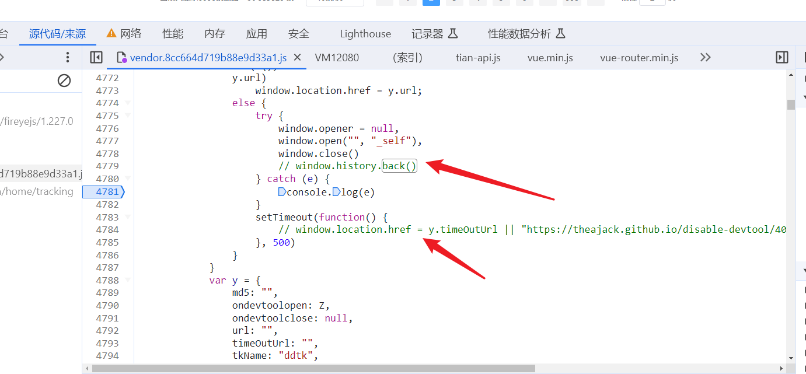

# 22.打开控制台就关闭页面

https://landchina.com/#/givingNotice

要知道那些操作会关闭页面

https://www.jb51.net/article/123145.htm

要是看到控制台有输出,清空控制台多半是 console.clear()方法 可以追踪当前这个方法看看在哪里有调用

可以通过脚步的方式来进行断点

替换文件把内容置空

替换文件在注释代码

